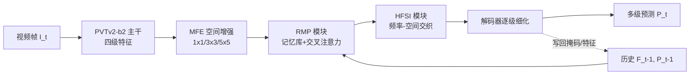

# HFSTI-Net: Hierarchical Frequency-spatial-temporal Interactions for Video Polyp Segmentation

**会议**: ICLR 2026  
**OpenReview**: [https://openreview.net/forum?id=6I9yjRTfuT](https://openreview.net/forum?id=6I9yjRTfuT)  
**代码**: [https://github.com/Yuanqin-He/HFSTI-Net](https://github.com/Yuanqin-He/HFSTI-Net)  
**领域**: 医学图像分割 / 视频息肉分割  
**关键词**: Video Polyp Segmentation, Frequency Learning, Spatiotemporal Modeling, Memory Bank, Colonoscopy  

## 一句话总结
HFSTI-Net 把"频率—空间"双路交互和"掩码引导的循环记忆传播"拼到一个网络里，分别治结肠镜视频里息肉分割的两大顽疾——单帧低对比导致的**形状坍塌**和长序列里目标忽隐忽现的**情景遗忘**，在 SUN-SEG / CVC-612 上既刷到 SOTA 又跑到 31 FPS 实时。

## 研究背景与动机
**领域现状**：自动息肉分割是结肠癌早筛的关键辅助。早期方法主攻单帧图像息肉分割（IPS），用 CNN/Transformer 提空间特征；近年视频息肉分割（VPS）兴起，靠 2D/3D 混合卷积或自注意力，利用时序一致性来提升鲁棒性。

**现有痛点**：作者把临床失败归结为两个具体现象。其一是**形状坍塌（shape collapse）**——息肉和周围黏膜在颜色、纹理上高度相似（"伪装"），单帧静态信息不足以把目标从背景里干净分出来，结果分割结构破碎、边界糊。其二是**情景遗忘（episodic amnesia）**——视场抖动、肠道蠕动、连续低质量模糊帧会让息肉外观剧烈变化，现有时序方法多依赖像素级稠密特征做隐式传播，缺乏高层语义抽象，遇到大时间间隔的帧间跳变就"失忆"，跟踪不稳。

**核心矛盾**：空间域方法擅长局部细节但缺全局上下文；频率域方法能抓全局语义却对噪声敏感、且现有频域工作往往把频率和空间**割裂处理**，没建模二者的跨域依赖。时序上，纯像素级传播又抓不住长程语义连续性。两条线索（频率—空间互补、长程时序记忆）都没被充分协同利用。

**本文目标**：在一个网络里**联合建模频率、空间、时序**三个域，同时压住形状坍塌和情景遗忘，并保持实时推理可临床部署。

**核心 idea**：**[频率-空间双路交织]** 用 FFT 自注意力抓全局频谱、空间自注意力守边界细节，再用一个可学习的交织融合块做双向纠缠；**[掩码引导的循环记忆]** 用记忆库存历史高层特征+预测掩码，靠交叉注意力 + 掩码亲和做时序对齐，让模型"记得住"目标的动态变化。

## 方法详解

### 整体框架
给定视频序列 $\{I_t\}_{t=1}^{T}$，先用 PVTv2-b2 主干抽四级特征 $F=\{F_i^t\}_{i=1}^{4}$。最高层特征 $F_4^t$ 先经 MFE 模块（并行 1×1/3×3/5×5 卷积）做空间增强，然后连同上一帧的历史上下文 $F_4^{t-1}, P_{t-1}$ 一起喂进 RMP 模块做时序对齐；对齐后的特征再交给 HFSI 模块做频率—空间交织，得到富化表征 $X=\{\chi_i\}_{i=1}^{4}$；最后解码器逐级聚合并细化，输出多级预测 $P=\{P_t^i\}_{i=1}^{4}$，配多级深监督损失。两个核心模块各司一职：HFSI 治形状坍塌（保结构完整性），RMP 治情景遗忘（保长程稳定性）。

### 关键设计

**1. HFSI 频率-空间交织：用频谱补全局、用空间守边界，再让两者互相纠缠。** HFSI 是一个三块串联的双路结构。**频率滤波块（FFB）** 把归一化输入做 FFT 变到频域，在频域算 query/key/value 的通道注意力 $\Lambda_f = Q_f \odot K_f$，用它重加权 $V_f$ 后逆变换回空间，同时挂一条轻量频率残差支路 $\sigma(\cdot)$ 增强频谱响应，两支拼接得频率感知特征 $X_f^r = \mathrm{Cat}\big(\mathcal{F}^{-1}(\Lambda_f \odot V_f),\ \mathcal{F}^{-1}(\sigma(\mathcal{F}(\hat{X})))\big)$，作用是抓全局上下文、压背景噪声、锐化低对比帧的边界。**空间细化块（SRB）** 则完全在空间域走，用 3×3 和 5×5 深度可分离卷积拼出多尺度 $Q_s,K_s,V_s$，算空间注意力 $\Lambda_s=\mathrm{Softmax}(Q_s\odot K_s)$ 突出显著结构，再并一条残差支路保原始细节，专守不同尺寸/复杂形状息肉的边缘精度。真正的关键是**交织融合块（IFB）**：它先把频率特征、空间特征和早层特征残差相加成 $X_c$，归一化后分别投影回频域和空域做门控乘法注意力（$\hat{X}_f^2$ 走 FFT 门控、$\hat{X}_s^2$ 走深度卷积门控），把二者逐元素相乘得 $\hat{X}_{fs}$ 作为共同输入，再各自在 Fourier 域和局部域做一轮门控/滤波后拼接并加回 $X_c$。这种"先各自增强、再相乘耦合、再各自精修"的双向纠缠，让全局频谱语义和局部空间细节在多层上对齐，而不是简单相加拼接——消融里去掉 IFB 掉点最明显。

**2. RMP 掩码引导的循环传播：把"历史特征 + 历史掩码"双双存进记忆库，分两步对齐时序。** RMP 维护一个记忆库，存过去帧的高层特征和预测掩码。对当前帧，**时序对齐模块（TAM）** 拿当前特征 $Q_T$ 当 query、记忆特征 $K_T/V_T$ 当 key-value 做交叉注意力 $Z=L(\mathrm{Attention}(L_q(Q_T),L_k(K_T),L_v(V_T)))$，再经 MLP + 残差归一化得 $Q_M=\mathrm{LN}(\mathrm{MLP}(Z)+Z)+Q_T$，并把记忆的 key/value 拼成 $K_M=K_T\oplus V_T$。第二步是**掩码亲和模块（MAM）**：把时序感知特征 $Q_M$ 和当前帧空间信息融合投影成查询对 $(q_k,q_v)$，记忆 $K_M$ 投成键值对 $(m_k,m_v)$，再做一轮交叉注意力得最终时空表征 $\text{output}=q_v\oplus\mathrm{Attention}(q_k,m_k,m_v)$。把"掩码"也纳入亲和计算，是它和纯特征传播的区别——掩码携带了显式的目标位置先验，让运动一致的息肉定位在遮挡和外观突变下也能稳住，从而压制情景遗忘。

**3. 多级深监督混合损失。** 解码器四个阶段都出预测，用加权 BCE + 加权 IoU 的混合损失逐级监督，且层级越浅权重越大：$L_{all}=\sum_{i=1}^{4}\frac{1}{2^{i-1}}\big(L_{bce}^{w}(P_t^i,G)+L_{iou}^{w}(P_t^i,G)\big)$。加权形式让难分的边界/小目标像素获得更高关注，多级监督则保证深浅特征都朝准确分割收敛。

## 实验关键数据

### 主实验表格
SUN-SEG-Easy / Hard / CVC-612 上与 NVS/IPS/VPS 各类 SOTA 对比（节选，**全指标第一**）：

| 方法 | 类型 | Easy Dice | Hard Dice | CVC-612 Dice |
|------|------|-----------|-----------|--------------|
| ZoomNext | NVS | 85.49 | 83.51 | 93.17 |
| SLTNet | NVS | 85.91 | 83.36 | 93.62 |
| PNS+ | VPS | 82.23 | 79.60 | 93.06 |
| VPSAM | VPS | 85.62 | 85.28 | 92.33 |
| SALI | VPS | 86.17 | 83.87 | 88.77 |
| **HFSTI-Net (Ours)** | VPS | **88.03** | **86.27** | **94.31** |

效率对比（SUN-SEG-Hard）：

| 方法 | Dice | GFlops | Param.(M) | FPS |
|------|------|--------|-----------|-----|
| SALI | 83.87 | 21.19 | 26.14 | 18.07 |
| PNS+ | 79.60 | 45.99 | 9.79 | 76.08 |
| **Ours** | **86.27** | 46.77 | 28.53 | **31.27** |

FPS 31.27 在 SOTA 里既快又准（除超轻量 PNS+ 外），满足实时临床部署。

### 消融实验表格
模块级消融（SUN-SEG-Hard Dice）：

| HFSI | RMP | Easy Dice | Hard Dice |
|:----:|:---:|-----------|-----------|
| | | 86.20 | 83.67 |
| ✓ | | 87.04 | 84.03 |
| | ✓ | 87.24 | 85.27 |
| ✓ | ✓ | **88.03** | **86.27** |

HFSI 子组件消融（Hard Dice，IFB 贡献最大）：去掉 FFB+SRB+IFB 仅 84.03 → 全开 86.27；其中移除 IFB 掉点最明显。频率交互方式消融（Hard Dice）：线性 1×1 卷积 84.15、空间注意力 85.38、FFT 交互（Ours）86.27，证明 FFT 频域交互不可替代。记忆帧数 1→4：Dice 86.27→86.66 缓升但 FPS 从 31.27 降到 26.94，单帧记忆已是精度/速度的实用折中。

### 关键发现
- HFSI 和 RMP 单独都涨点，叠加增益最大，说明"治形状坍塌"和"治情景遗忘"是两个互补正交的问题。
- IFB 的双向纠缠是 HFSI 的灵魂，简单相加/拼接换不来同样收益；FFT 频域交互显著优于空间注意力。
- T-SNE 显示频率+空间联合比单域能更好地把息肉/背景两类分开。

## 亮点与洞察
- 把临床失败现象拆成两个可命名的具体问题（shape collapse / episodic amnesia），再对症下两个模块，问题—方法对应清晰，可解释性强。
- IFB 的"先各自门控增强→逐元素相乘耦合→再各自精修"是比"相加/拼接"更深的跨域融合范式，对其他多域融合任务有借鉴价值。
- RMP 把**掩码**也存进记忆库并参与亲和计算，相当于给时序传播注入显式目标先验，比纯特征记忆更抗外观突变。
- 精度领先的同时守住 31 FPS 实时，兼顾了临床可用性。

## 局限与展望
- 论文展示了 failure cases（Figure 9），在极端连续低质帧/强遮挡下仍会失败，记忆库的可靠性受历史帧质量制约。
- 频域 FFT 自注意力 + 多模块叠加带来 46.77 GFlops，比轻量 VPS 方法重，参数 28.53M。
- 记忆帧数增加收益递减且降 FPS，长程记忆的有效利用仍有空间（如何挑选/淘汰关键帧未深入）。
- 仅在结肠镜息肉两数据集验证，跨器官/跨模态的泛化性待考。

## 相关工作与启发
- **图像/视频息肉分割**：从 CNN（局部）到 Transformer/混合架构（全局），再到 PNS+ 等全局时序注意力、关键帧引导策略，本文的 RMP 延续"显式建模时序依赖"思路但加入掩码记忆。
- **频率学习**：FcaNet 把通道注意力看作频域压缩、FAGF-Net 用频率感知注意力做伪装目标检测，本文的 FFB/IFB 进一步补上了"频率—空间双向交互"这一缺口。
- 启发：对于"伪装/低对比"类分割任务，频域是抓全局判别性的有效补充，但关键不在"用不用频域"，而在频域和空域如何深度纠缠；时序任务里把预测掩码也当作可检索记忆是个轻量而有效的招。

## 评分
- **新颖性**: ⭐⭐⭐⭐ — 频率-空间-时序三域联合、IFB 双向交织融合、掩码进记忆库都有新意，但各部件均建立在已有 FFT 注意力/记忆传播范式上的组合创新。
- **实验充分度**: ⭐⭐⭐⭐ — 三测试集、多类 SOTA、效率对比、模块/子组件/频率交互方式/记忆帧数多维消融 + 可视化齐全。
- **写作质量**: ⭐⭐⭐⭐ — 问题命名（shape collapse / episodic amnesia）清晰，方法与公式完整，少量笔误（如公式 4 括号）。
- **价值**: ⭐⭐⭐⭐ — 在临床实时约束下刷到 SOTA，代码开源，对医学视频分割与多域融合都有参考价值。

<!-- RELATED:START -->

## 相关论文

- [\[ICLR 2026\] WavePolyp: Video Polyp Segmentation via Hierarchical Wavelet-based Feature Aggregation and Inter-frame Divergence Perception](wavepolyp_video_polyp_segmentation_via_hierarchical_wavelet-based_feature_aggreg.md)
- [\[ICLR 2026\] CONSIGN: Conformal Segmentation Informed by Spatial Groupings via Decomposition](consign_conformal_segmentation_informed_by_spatial_groupings_via_decomposition.md)
- [\[AAAI 2026\] Decoding with Structured Awareness: Integrating Directional, Frequency-Spatial, and Structural Attention for Medical Image Segmentation](../../AAAI2026/medical_imaging/decoding_with_structured_awareness_integrating_directional_frequency-spatial_and.md)
- [\[ICLR 2026\] Nef-Net v2: Adapting Electrocardio Panorama in the Wild](nef-net_v2_adapting_electrocardio_panorama_in_the_wild.md)
- [\[NeurIPS 2025\] STAMP: Spatial-Temporal Adapter with Multi-Head Pooling](../../NeurIPS2025/medical_imaging/stamp_spatial-temporal_adapter_with_multi-head_pooling.md)

<!-- RELATED:END -->
