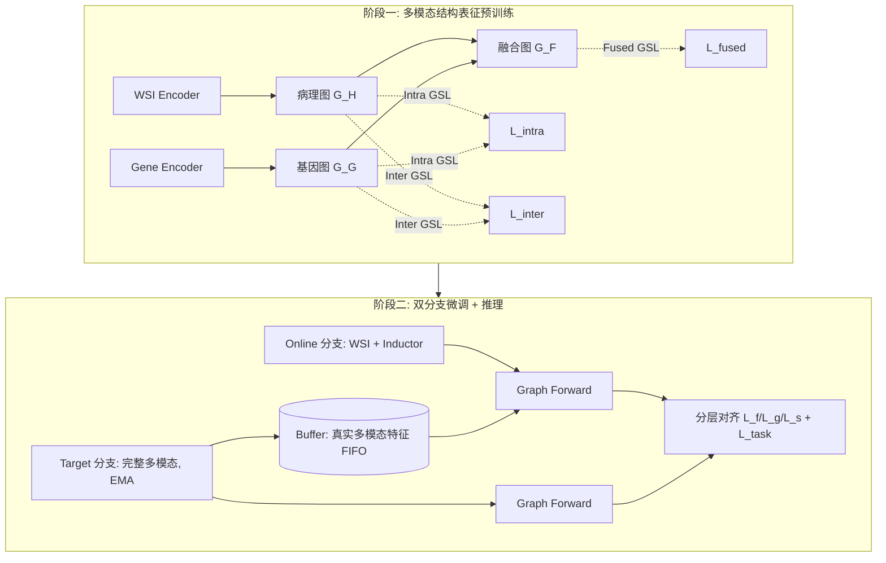

# Histopathology-Genomics Multi-modal Structural Representation Learning for Data-Efficient Precision Oncology

**会议**: ICLR 2026  
**OpenReview**: [https://openreview.net/forum?id=24QX6XpvSL](https://openreview.net/forum?id=24QX6XpvSL)  
**代码**: [https://github.com/WkEEn/MSRL](https://github.com/WkEEn/MSRL)  
**领域**: 医学图像 / 计算病理 / 多模态表征学习  
**关键词**: 病理-基因组多模态、缺失模态、图结构学习(GSL)、生存预测、数据高效推理  

## 一句话总结
MSRL 用图结构学习预训练一张「病理-基因组」跨病例关联图，并在微调阶段借助一个存了真实基因组特征的 buffer，让推理时只有病理切片(WSI)的病例也能"借"到诊断相关病例的真实基因信息，从而在基因组缺失场景下逼近完整多模态融合的精度。

## 研究背景与动机
**领域现状**：融合病理全切片图像(WSI)和基因组数据已成为精准肿瘤学的主流范式——WSI 提供形态学/细胞组织信息，基因组提供分子层面的微环境刻画，二者互补能给出更个性化的病例表征。但基因组测序成本高、流程复杂，真实临床里大量病例只有 WSI 而没有配对的基因组数据。

**现有痛点**：为应对推理时基因组缺失，已有工作走两条路线：(1) 训练时加一个辅助任务，用重建损失或蒸馏损失把 WSI 和基因组建立关联，推理时用学到的 prompt 顶替缺失模态；(2) 用生成式方法(如条件 VAE)从 WSI 合成基因组特征。这些方法都有两个共性缺陷:

- **只看单个病例，忽视病例间关联**：重建只依赖当前病例自己的 WSI 去预测基因组，关注 intra-case 的模态对齐，却丢掉了对癌症诊断至关重要的 inter-case 关联。
- **训练集里真实的基因组数据被白白浪费**：推理时基因组被完全"凭空合成"，而训练集中那些诊断相关病例本就有真实基因组数据，方法却没去利用它们,导致合成特征不真实、信息量不足。

**核心矛盾**：缺失模态要"补全",但纯凭单病例 WSI 合成出来的基因组既不真实又割裂了病例间的诊断关联——高维(d=768)、样本远少于维度的低秩基因组分布，让 VAE 这类生成器很容易采样出噪声。

**本文目标**：在推理只用单一 WSI 模态的前提下,既显式建模病例间关联,又能调用训练集里**真实**的基因组数据作为结构化先验,把缺失基因组"补"得更可信。

**核心 idea**：**[结构化关联补全]** 不再逐病例凭空生成基因组,而是预训练一张多模态关联图来刻画病例间的诊断相关性,再用一个 buffer 缓存训练病例的真实多模态特征;推理时把当前只有 WSI 的病例接入这张图,通过图传播从"诊断相关的真实病例"那里聚合到可靠的基因组信息。

## 方法详解

### 整体框架
MSRL 分两阶段。**预训练阶段**用 TCGA 泛癌(6,361 例完整配对数据)做自监督图结构学习(GSL),对齐 WSI 与基因组的表征空间并构建跨病例关联图;**微调/推理阶段**采用 online-target 双分支 + buffer:target 分支吃完整多模态数据、只在训练时激活、用 EMA 更新,指导只吃 WSI 的 online 分支学会补全缺失基因;buffer 用 FIFO 缓存训练病例的真实多模态特征,推理时把当前病例与 buffer 里的病例一起组图前向,借真实数据完成补全。

### 关键设计

**1. 多视角自监督图结构学习(GSL)预训练:把"谁和谁诊断相关"从数据里学出来。** GSL 的核心是一个参数化 graph learner,它不需要预先给定邻接矩阵,而是从节点特征自适应地推断出最优图结构(Algorithm 1:逐层做 Hadamard 加权 $z_i^{(l)}=E_i^{(l-1)}\odot\omega^{(l)}$,再用 $S=E^{(L)}(E^{(L)})^T$ 算相似度并后处理成 refined 邻接矩阵 $A_r$)。预训练用三类约束塑造这张图:**intra-modality** 用对比学习挖同一模态内的病例关联——把 refined 图 $A_r^H$ 和随机增广图 $A_{aug}^H$ 各过一遍 GCN,用 InfoNCE 拉近同病例、推远异病例 $L_{InfoNCE}(Z_H;Z_H^{aug})=-\sum_k \log\frac{\exp(\text{sim}(z_k,z_k^{aug})/\tau)}{\sum_i \exp(\text{sim}(z_k,z_i^{aug})/\tau)}$;**inter-modality** 用 InfoNCE 对齐同病例的病理与基因表征,把两模态结构拉到统一空间;**fused-modality** 再约束融合表征 $Z_F$ 同时保留病理与基因的特性。三者合成 $L_{gsl}=L_{intra}+L_{inter}+L_{fused}$。泛癌大数据让学到的关联更泛化,对齐后的基因组编码器也能直接迁移到下游。

**2. Buffer + 双分支:把训练集里的真实基因组当成可调用的"结构先验"。** 训练集 $D_{train}=\{X_G^s,X_I^s,y^s\}$ 有完整模态,测试集 $D_{test}=\{X_I^s,y^s\}$ 只有 WSI。buffer 初始化为训练病例真实多模态特征 $D_{buffer}=\{\text{concat}(\phi_G(X_G^s),\phi_H(X_I^s))\}$,并用 target 分支输出按 FIFO 滚动更新,保证缓存表征始终新鲜。微调时 target 分支吃真实完整数据、online 分支只吃 WSI,二者用 mixup 增广产生不同视角;关键在 **Graph Forward**:把当前病例特征和 buffer 里其他病例一起 readout 成 $F$,再 $A_r=\text{GSL}(F)$、$Z=\text{GCN}(A_r,F)$——也就是说当前只有 WSI 的病例,通过这张动态图和 buffer 里**真实**的基因组特征建立关联,缺失基因信息在图传播中被补全。这正是它区别于"凭空生成"路线的根本:补全的依据是真实的、诊断相关的邻居,而非单病例幻觉。

**3. Inductor:给 online 分支一个基因组占位符,让单模态也能进图。** online 分支没有基因组输入,MSRL 设计 Inductor 模块——它复用基因组编码器同款的 SNN 架构,但输入是 WSI 表征,输出一个"基因组 prompt"作为缺失数据的占位。这个 prompt 与 WSI 表征拼成 online 分支的多模态表征 $f=\text{concat}(g,h)$,随后在 Graph Forward 里通过跨病例关联被真正补全。推理时 $g\leftarrow\text{Inductor}(h)$ 估计缺失基因,再走一遍 online Graph Forward 用 $Z$ 预测,从而实现单 WSI 模态的数据高效推理。

**4. 分层对齐损失:在"图前/图后/结构"三个层级把 online 对齐到 target。** 微调用分层 InfoNCE 同时约束图学习前后的特征:$L_{f\_align}=L_{InfoNCE}(f,\hat f)$(图前融合特征)、$L_{g\_align}=L_{InfoNCE}(Z,\hat Z)$(图后 GCN 表征),保证 online 分支稳定且充分地学到真实多模态表征。结构层面用稀疏平衡 BCE 对齐 online 图 $A_r$ 与 target 图 $\hat A_r$:由于 $\hat A_r$ 里零元素远多于非零($c_0\gg c_1$),给两类元素加缩放因子 $\alpha_0=\frac{c_0+c_1}{2c_0}$、$\alpha_1=\frac{c_0+c_1}{2c_1}$ 来平衡。总损失 $L_{fine\_tune}=L_{f\_align}+L_{g\_align}+L_{s\_align}+L_{task}$ 只更新 online 分支,target 分支靠 EMA 更新防止表征坍缩。

## 实验关键数据

数据:TCGA 泛癌 7,263 例(32 癌种、12 原发部位),预训练 6,361 例无诊断信息;下游评测 6 个 TCGA 队列 + 2 个外部 CPTAC 队列。WSI 编码用 GigaPath(ViT-giant patch 编码 + LongNet slide 编码),基因按功能分组各过独立 SNN。

### 主实验:生存预测(C-Index,5 个队列)

| 方法 | 模态 | Overall C-Index |
|---|---|---|
| PANTHER (WSI 最强无预训练) | h. | 0.5967 |
| TITAN (WSI 基础模型) | h. | 0.6007 |
| **MSRL_H** (本文,纯 WSI) | h. | **0.6131** |
| G-HANet | g.+h.→h. | 0.6246 |
| LD-CVAE | g.+h.→h. | 0.6313 |
| DisPro | g.+h.→h. | 0.6414 |
| **MSRL** (训练多模态/推理 WSI) | g.+h.→h. | **0.6558** |
| SurvPath (完整多模态融合) | g.+h. | 0.6683 |
| **MSRL_multi** (完整多模态) | g.+h. | **0.6794** |

缺失模态设定下 MSRL 比 G-HANet / LD-CVAE / DisPro 分别高 3.12% / 2.45% / 1.44% C-Index,并逼近甚至追平完整多模态融合方法(MCAT 0.6455、CMTA 0.6547);完整多模态变体 MSRL_multi 反超第二名 1.03%。

### 精准诊断(4 任务,AUC)

| 方法 | BRCA 分期 | NSCLC 分期 | EGFR 突变 | HER2 状态 |
|---|---|---|---|---|
| TITAN | 0.648 | 0.639 | 0.822 | 0.693 |
| G-HANet | 0.632 | 0.634 | 0.830 | 0.715 |
| LD-CVAE | 0.646 | 0.650 | 0.836 | 0.717 |
| **MSRL** | **0.664** | **0.661** | **0.842** | **0.730** |

MSRL 在四项全部最优,比次优 LD-CVAE 的 AUC 高 1.8%/1.1%/0.6%/1.3%。

### 消融实验

| 变体 | Overall C-Index |
|---|---|
| KNN (Euclidean) 静态图 | 0.6009 (↓0.0549) |
| KNN (cosine) 静态图 | 0.6086 (↓0.0472) |
| MSRL_random GSL (不预训练) | 0.6369 (↓0.0189) |
| MSRL_online buffer (用 online 特征更新 buffer) | 0.6451 (↓0.0107) |
| **MSRL** (完整) | **0.6558** |

GSL 预训练贡献 +1.89%,且 random GSL 仍优于两种 KNN——说明学到的图捕捉的是隐式诊断关联而非单纯相似度;用 target 真实特征更新 buffer 比用 online 特征好 +1.07%。损失消融显示去掉结构对齐 $L_{s\_align}$ 性能掉得最狠,小数据集上甚至无法收敛。

### 关键发现
- **静态相似度图远不如学出来的图**:KNN(余弦/欧氏)比完整 MSRL 低 4.7%~5.5%,GSL 学的是"诊断相关"而非"特征相似"。
- **真实数据 > 凭空生成**:G-HANet/LD-CVAE 因高维低秩基因组分布难拟合、采样噪声大而落后;MSRL 用 buffer 里的真实基因组做结构引导,绕开了生成噪声。
- **强泛化**:外部 CPTAC 上 DisPro C-Index 掉 4.77%,MSRL 只掉 1.02%。
- **修复了 WSI 编码器被基因噪声"带偏"的问题**:从头训练引入高维基因噪声会损害 WSI 形态学表征,而 MSRL_H 纯 WSI 就比 GigaPath 基线 F1 提升 1.3%~3.5%。

## 亮点与洞察
- **把"缺失模态补全"从生成范式换成检索/结构范式**:不让模型幻觉基因组,而是从诊断相关的真实病例里"借",规避了低秩高维分布下生成器采样噪声的根本难题——这个视角切换是本文最有价值的洞察。
- **buffer + 双分支 + EMA 的组合很巧**:target 分支提供真实多模态监督、buffer 把训练集真实信息持久化、online 分支只需 WSI 即可推理,三者让"训练用多模态、推理用单模态"自然成立。
- **GSL 捕捉的是诊断关联而非相似度**:这一点被 KNN 对照实验干净地证明,对计算病理里"病例间关系如何建模"有普适启发。

## 局限与展望
- **buffer 依赖训练集的真实基因组覆盖度**:若训练集本身基因组配对就稀疏,或测试病例与训练分布差异大,可借的真实邻居质量会下降。
- **图规模与可扩展性**:邻接矩阵 $K\times K$ 随病例数增长,大规模部署时 GSL/GCN 的计算与显存成本、buffer 的 FIFO 容量如何权衡,正文未充分讨论。
- **仅评测 TCGA/CPTAC 泛癌**:真实临床里染色批次、扫描仪、人群差异更大,跨中心鲁棒性仍需更广验证。
- 未来可探索把"真实邻居检索"与"轻量生成"结合,在邻居稀疏区用生成兜底、在密集区用真实数据主导。

## 相关工作与启发
- **多模态融合**:MCAT(病理 patch 注意基因)、CMTA(双编解码对齐)、SurvPath(基因通路 token + 高效 Transformer)、MOTCat(最优传输)、PIBD(原型信息瓶颈)——MSRL 指出 MCAT 单向增强、CMTA 用 WSI 模块编码基因破坏序列结构等问题,并用 inter-modality 约束 + 基因专用编码改进。
- **缺失模态重建/蒸馏**:G-HANet(代理基因重建分支)、LD-CVAE(条件隐变量 VAE 生成)、DisPro(LLM 蒸馏 prognostic 知识到 prompt)——共性缺陷是只看单病例、推理时不用真实基因组,正是 MSRL 的切入点。
- **图结构学习(GSL)**:从 Franceschi、Liu 等的可微图结构学习,到 Liu/Li/Zhao 引入对比学习做无监督 GSL、Shen 扩展到多重图——MSRL 把无监督多重图 GSL 用到多模态病理-基因组关联建模,是一个落地新场景。

## 评分
- **新颖性**: ⭐⭐⭐⭐ 把缺失模态补全从"生成"转向"基于真实邻居的结构化检索",buffer+GSL 的组合在计算病理多模态里是新颖且自洽的范式切换。
- **实验充分度**: ⭐⭐⭐⭐ 7,263 例泛癌、生存预测+4 项精准诊断+外部 CPTAC 泛化+结构/损失双重消融,覆盖全面且统计显著性标注完整。
- **写作质量**: ⭐⭐⭐⭐ 动机-缺陷-方案的逻辑链清晰,图1对四类范式的对比、双分支/buffer 的算法伪代码到位;部分符号(GF、readout 细节)需配合附录。
- **价值**: ⭐⭐⭐⭐ 直击"基因组测序贵、临床常缺失"的真实痛点,推理只需 WSI 却逼近完整多模态精度,对精准肿瘤学落地有实际意义,代码已开源。

<!-- RELATED:START -->

## 相关论文

- [\[ICLR 2026\] Joint Adaptation of Uni-modal Foundation Models for Multi-modal Alzheimer's Disease Diagnosis](joint_adaptation_of_uni-modal_foundation_models_for_multi-modal_alzheimers_disea.md)
- [\[CVPR 2026\] Cross-Modal Guided Visual Synthesis for Data-Efficient Multimodal Depression Recognition](../../CVPR2026/medical_imaging/cross-modal_guided_visual_synthesis_for_data-efficient_multimodal_depression_rec.md)
- [\[CVPR 2026\] TopoSlide: Topologically-Informed Histopathology Whole Slide Image Representation Learning](../../CVPR2026/medical_imaging/toposlide_topologically-informed_histopathology_whole_slide_image_representation.md)
- [\[ICLR 2026\] Frequency-Balanced Retinal Representation Learning with Mutual Information Regularization](frequency-balanced_retinal_representation_learning_with_mutual_information_regul.md)
- [\[ICLR 2026\] MedGMAE: Gaussian Masked Autoencoders for Medical Volumetric Representation Learning](medgmae_gaussian_masked_autoencoders_for_medical_volumetric_representation_learn.md)

<!-- RELATED:END -->
