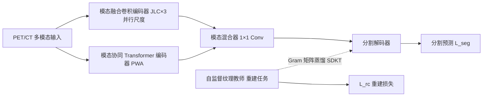

# Johnson-Lindenstrauss Lemma Guided Network for Efficient 3D Medical Segmentation

**会议**: ICLR 2026  
**OpenReview**: [https://openreview.net/forum?id=fmWlDfCFMR](https://openreview.net/forum?id=fmWlDfCFMR)  
**代码**: [https://github.com/JinPLu/VeloxSeg](https://github.com/JinPLu/VeloxSeg)  
**领域**: 医学图像分割 / 轻量化网络 / 多模态  
**关键词**: 3D 医学分割, 轻量化, Johnson-Lindenstrauss 引理, 窗口注意力, 知识迁移, PET/CT  

## 一句话总结
VeloxSeg 用「配对窗口注意力 + JL 引理约束的轻量卷积 + 基于 Gram 矩阵的纹理知识蒸馏」三件套，在 3D 医学分割上同时拿到精度（Dice +26%）和效率（GPU 吞吐 11×、CPU 48×、显存省到 1/20），破解轻量模型「效率/鲁棒性」二选一的困局。

## 研究背景与动机
**领域现状**：3D 医学分割是临床工作流的基石，近年从 CNN-Transformer 到 Mamba/RWKV 等序列模型精度持续提升，但要落地到医院真实环境（硬件受限、低延迟、多器官泛化、PET/CT 等异构多模态）就必须做轻量化，催生了一批参数量 <5M 的轻量方法。

**现有痛点**：作者把轻量化暴露的根本矛盾命名为「**效率/鲁棒性冲突**」——参数和算力一压缩，模型在异构数据和复杂病灶上的表现就崩。具体两条：① 对 3D 数据高维复杂性考虑不足。Mamba/RWKV 缺高效 3D 扫描策略，仍没取代 CNN-Transformer；窗口注意力靠级联捕捉跨窗交互很冗余，轴向/降采样注意力又削弱关键局部依赖；而主流的深度可分离卷积「激进的通道解耦破坏了 token 间的几何邻接关系」，让相邻组织难以区分、信息被碎片化，复杂解剖结构下尤其严重。② 对数据协同探索不足。轻量方法怕涨算力，常忽略多模态互补信息；而把重建/超分知识迁移到分割时，两者 ROI 差异大，容易引发**负迁移**。

**本文目标**：在不牺牲推理效率的前提下，系统性缓解效率/鲁棒性冲突，让轻量模型也能稳健处理异构模态和复杂病灶。

**核心 idea**：**(1) glance-and-focus 双流架构**——PWA 快速「扫视」检索多尺度全局线索，JLC 用最少参数「聚焦」稳健提取局部特征；**(2) 理论指导轻量化**——用 Johnson-Lindenstrauss 引理推出「每组最小通道数」以保持几何邻接，替代昂贵且数据相关的剪枝；**(3) 零推理开销的纹理蒸馏**——用 Gram 矩阵把自监督纹理教师的细节先验注入分割网络。

## 方法详解

### 整体框架
VeloxSeg 是 encoder-decoder 结构，左侧并行两个 4-stage 编码器——**模态融合卷积编码器**（核心是 JLC）和**模态协同 Transformer 编码器**（核心是 PWA），用 1×1 卷积做模态混合器（modal mixer），右接分割解码器；训练时额外挂一个自监督纹理教师，用 SDKT 把纹理先验蒸馏进来，推理时教师丢弃、零额外开销。把卷积流和注意力流分开，避免模态数增加时参数爆炸，同时最大化两者的并行性。

### 关键设计

**1. 配对窗口注意力 PWA：用对数个窗口对一次性吃下多尺度全局上下文。** 自注意力理论上能建模任意依赖但受算力/显存约束，窗口注意力靠级联补跨窗交互很冗余。PWA 换了个思路：给每个 stage 的 $M$ 个模态特征 $E_m^k$ 先投影成 $Q,K,V$，然后 (i) 把特征切成一组大窗口、每个小窗口里挑一个显著 token；(ii) 同步成对扩张窗口，得到尺度不同但长度相等的多模态序列 $X_{m,i}^k$；(iii) 把所有尺度、所有模态的序列汇总，**一次性**算跨尺度跨模态注意力 $A_m^k=\text{PWA}(E_m^k\mid E_1^k,\cdots,E_M^k)$；(iv) 用轻量 mixer 融合各尺度特征。关键在于只需 $\log(\text{size})$ 个配对窗口就能覆盖全局上下文，而最小窗口保证局部细节不丢，整体达到近线性复杂度——线性系数约为 Swin Transformer 的 **7.87%**。同一套机制顺手承担了多尺度的低成本模态交互，仅增加 0.27M 参数和 0.09 GFLOPs。

**2. JL 引理引导卷积 JLC：从「保距嵌入」反推卷积每组的最小通道数。** 深度可分离卷积把通道拆到每组 1 通道，破坏了特征空间里数据点的邻接关系，导致肿瘤 patch 和正常组织 patch 在低维投影里挤到一起（$d_1'\approx d_2'$）难以区分。作者搬来 Johnson-Lindenstrauss 引理：要把 $N$ 个高维点保距嵌入，至少需要 $O(\log N)$ 维。设 $M$ 模态输入图像与中间特征的体积比为 $v$，每个特征体素至少要保留 $v$ 个输入体素的信息；由于解剖约束和归一化输入有界，分割相关流形 $\mathcal{M}$ 可被有限样本覆盖，覆盖数为 $N(\mathcal{M},v)$，代入引理得每组通道数下界

$$C_{\mathrm{group}}=d'\geq c_{\text{JL}}\,\varepsilon^{-2}\log N(\mathcal{M},v).$$

视觉域拿不到真实 $N$，于是用 $\hat N(M,v)=(M\cdot v)^\alpha$ 近似（$\alpha$ 反映任务难度），在模态异构性最强的 AutoPET-II 上做消融定 $\alpha$，最终各 stage 组大小取 $\{n,2n,2n,4n\}$。这样既保持轻量，又靠「保距」让细粒度细节被稳健捕获，**绕开了依赖数据集重要性度量和手调稀疏度的剪枝**。

**3. 空间解耦知识迁移 SDKT：用 Gram 矩阵把纹理教师的「风格」蒸给分割网络，避开负迁移。** 重建/超分常用的 `Conv+PixelShuffle` 上采样，本质是把每个体素的通道关系「展开」成周围 patch 的空间细节——这暗示纹理教师该传给分割的，是**特征里的通道关系**而非空间布局。Gram 矩阵恰好以空间不变的方式刻画通道关系：对 $X\in\mathbb{R}^{C\times HWD}$，$\mathrm{GM}(X)=\frac{1}{CHWD}XX^\top\in\mathbb{R}^{C\times C}$。先用 $M$ 个重建任务训出自监督纹理教师 $T_m$，再用 Gram 一致性约束建立从教师到分割的正向迁移路径（数学上等价于用二阶多项式核最小化 MMD），从而绕开重建与分割 ROI 差异过大引发的负迁移。总损失

$$\mathcal{L}=(\mathcal{L}_{dice}+\mathcal{L}_{ce})+\lambda_{rc}\mathcal{L}_{rc}+\lambda_{sdkt}\sum_{m=1}^{M}\left\|\mathrm{GM}(D_T^m)-\mathrm{GM}(D_{seg})\right\|^2.$$

教师只在训练时参与，推理零开销。

## 实验关键数据

四个公开数据集：AutoPET-II、Hecktor2022（PET/CT），BraTS2021、BraTS2016（MRI），按 6:2:2 划分；指标含 Dice / HD95 / Precision / Recall，外加参数量、GFLOPs、GPU/CPU 吞吐。对比 8 个基础 + 3 个多模态 + 5 个轻量模型，覆盖 CNN / CNN-Transformer / CNN-KAN / CNN-Mamba / CNN-RWKV 五种范式，还加测了 SAM-Med3D（零样本）和 DINOv3（线性头微调）两个视觉基础模型。

### 主实验（PET/CT 分割，Dice %）

| 方法 | 范式 | AutoPET-II Dice ↑ | Hecktor2022 Dice ↑ |
|------|------|------|------|
| Swin UNETR (MICCAI'21) | CNN-Trans | 62.24 | 44.56 |
| VSmTrans (MIA'24) | 最佳基础模型 | 62.46 | 52.91 |
| U-KAN (AAAI'25) | CNN-KAN | 60.67 | 55.89 |
| H-DenseFormer (MICCAI'23) | 多模态 | 61.50 | 46.79 |
| U-RWKV (MICCAI'25) | 轻量 | 57.18 | 45.97 |
| SuperLightNet (CVPR'25) | 轻量 | 48.35 | 50.03 |
| SAM-Med3D (零样本) | 基础模型 | 26.59 | 31.94 |
| **VeloxSeg (Ours)** | — | **62.51** | **56.48** |

- 对最佳基础模型 VSmTrans：精度小幅领先，但只用其 **13.30% 参数**、**1.96% GFLOPs**。
- 对轻量模型：两数据集 Dice 领先 **>5%**，自身仅 1.66 MParams / 1.79 GFLOPs，GPU 吞吐 599 patches/s 且支持纯 CPU。
- 显存：训练比基础 CNN/Transformer 省最多 **20×**，推理省 **24×**。
- nnUNet 框架下：Dice +14.2%，仅用 nnUNet 1.87% 参数、0.058% GFLOPs，GPU 吞吐 4.8×、CPU 52.5×。
- MRI 适配：BraTS2021 上早融合变体 VeloxSeg-C 超次优 1.72% Dice。

### 消融实验（AutoPET-II，Dice %）

| 配置 | Params(M) | FLOPs(G) | Dice |
|------|------|------|------|
| 仅卷积，宽度 ⟨16,32,64,128⟩ | 0.73 | 2.41 | 50.10 |
| + 多尺度 kernel ⟨1,3,5⟩ | 0.66 | 2.30 | 53.65 |
| + JL 组大小 ⟨4,8,8,16⟩ | 1.18 | 2.66 | 55.84 |
| + Transformer (PWA) | 1.88 | 2.90 | 61.03 |
| + 统一上采样 | 1.66 | 1.79 | 59.71 |
| **+ Gram 监督 (完整)** | **1.66** | **1.79** | **62.51** |

### 关键发现
- **JL 组大小不是越大越好**：组大小从 ⟨1,1,1,1⟩ 到 ⟨4,8,8,16⟩ Dice 单调升到 55.84，但继续加到 ⟨8,16,16,32⟩ 反降到 55.14——印证了引理给出的是「最小必要」组大小而非越大越好。
- **Gram 监督是临门一脚**：单加纹理教师（只用 L_rc）Dice 反掉到 59.64（负迁移），加上 Gram 约束才跳到 62.51，证明「迁通道关系而非空间」是避免负迁移的关键。
- PWA 注意力距离分布（Wilcoxon 检验）显示不同 stage 大窗口确实在捕捉不同尺度的依赖。

## 亮点与洞察
- **用理论给轻量化定参**：把 JL 引理这个「保距嵌入」经典结论搬到卷积分组上，给出「每组最小通道数」的可解释下界，比经验剪枝更有原则、且数据无关、免重训。
- **一套注意力同时解决多尺度和多模态**：PWA 用对数个配对窗口达到近线性复杂度（Swin 的 7.87%），还顺手承担跨模态交互，几乎零额外成本。
- **把负迁移问题转成「风格迁移」**：洞察到 `Conv+PixelShuffle` 展开的是通道关系，于是用 Gram 矩阵做空间不变的纹理蒸馏，巧妙绕开重建/分割 ROI 差异，且推理零开销。
- 效率提升是数量级的（吞吐 11×/48×、显存 1/20~1/24），同时精度还涨，真正打破了效率/鲁棒性的取舍。

## 局限与展望
- $\hat N(M,v)=(M\cdot v)^\alpha$ 是经验近似，$\alpha$ 需在最难数据集上消融确定，并未给出从数据自动估计 $N$ 的理论方法，跨任务迁移时仍需调。
- 验证集中在 PET/CT 与 MRI，未覆盖 CT-only 大器官、内镜/超声等更广模态，glance-and-focus 是否普适待考。
- SDKT 依赖额外训练一组自监督纹理教师，训练管线变复杂（虽推理无开销）。
- HD95 等边界指标上 VeloxSeg 并非全面领先（如 AutoPET-II HD95 仍偏高），小病灶边界精度仍有空间。

## 相关工作与启发
- **轻量 3D 分割**：Slim UNETR、SuperLightNet、U-RWKV、HCMA-UNet 等走窗口/降采样/序列模型路线，VeloxSeg 指出它们要么削弱局部、要么破坏几何邻接。
- **窗口注意力谱系**：Swin/窗口注意力靠级联补跨窗，轴向/降采样注意力压算力却伤局部，PWA 用配对窗口在两者间取得更优折衷。
- **知识蒸馏 / 风格迁移**：把图像风格迁移里的 Gram 矩阵（Gatys 等）引到跨任务蒸馏，等价于二阶多项式核 MMD——为「重建→分割」这类 ROI 不匹配的迁移提供了通用思路，可推广到其他需要跨任务先验注入的轻量模型。
- 对「用经典数学引理指导网络结构设计」感兴趣的研究者，本文是一个把理论下界落到工程超参的范例。

## 评分
- **新颖性**: ⭐⭐⭐⭐ JL 引理指导卷积分组、Gram 矩阵做空间解耦蒸馏都很有巧思，把经典理论落到轻量化设计上是亮点。
- **实验充分度**: ⭐⭐⭐⭐ 四数据集、五范式、十余个 baseline 加视觉基础模型，消融把每个组件和关键超参都拆开验证，效率指标全面。
- **写作质量**: ⭐⭐⭐⭐ 「效率/鲁棒性冲突」「glance-and-focus」等命名清晰，理论推导和动机讲得有条理，图表充实。
- **价值**: ⭐⭐⭐⭐ 数量级的效率提升 + 精度不降，对临床落地（CPU 可跑、低显存）有直接现实意义，代码开源。

<!-- RELATED:START -->

## 相关论文

- [\[CVPR 2026\] PGR-Net: Prior-Guided ROI Reasoning Network for Brain Tumor MRI Segmentation](../../CVPR2026/medical_imaging/pgr-net_prior-guided_roi_reasoning_network_for_brain_tumor_mri_segmentation.md)
- [\[CVPR 2026\] Virtual Nodes Guided Dynamic Graph Neural Network for Brain Tumor Segmentation with Missing Modalities](../../CVPR2026/medical_imaging/virtual_nodes_guided_dynamic_graph_neural_network_for_brain_tumor_segmentation_w.md)
- [\[AAAI 2026\] FunKAN: Functional Kolmogorov-Arnold Network for Medical Image Enhancement and Segmentation](../../AAAI2026/medical_imaging/funkan_functional_kolmogorov-arnold_network_for_medical_image_enhancement_and_se.md)
- [\[CVPR 2026\] Learning Generalizable 3D Medical Image Representations from Mask-Guided Self-Supervision](../../CVPR2026/medical_imaging/learning_generalizable_3d_medical_image_representations_from_mask-guided_self-su.md)
- [\[ICLR 2026\] Cross-Timestep: 3D Diffusion Model with Trans-temporal Memory LSTM and Adaptive Priori Decoding Strategy for Medical Segmentation](cross-timestep_3d_diffusion_model_with_trans-temporal_memory_lstm_and_adaptive_p.md)

<!-- RELATED:END -->
