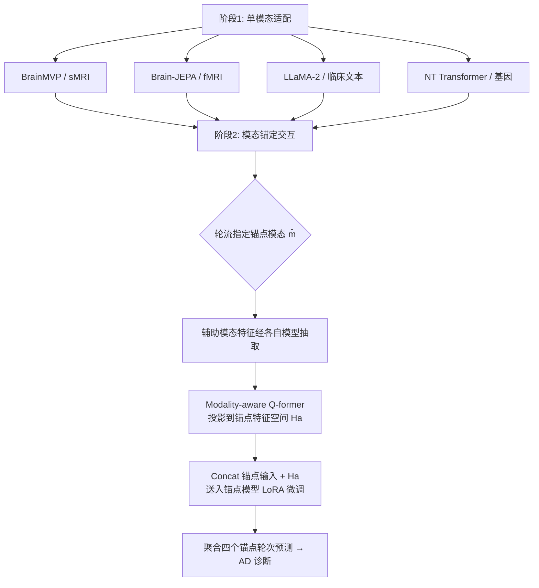

# Joint Adaptation of Uni-modal Foundation Models for Multi-modal Alzheimer's Disease Diagnosis

**会议**: ICLR 2026  
**OpenReview**: [https://openreview.net/forum?id=gPTjQxC74G](https://openreview.net/forum?id=gPTjQxC74G)  
**代码**: 待确认  
**领域**: 医学影像 / 多模态阿尔茨海默病诊断  
**关键词**: 阿尔茨海默病诊断, 多模态融合, 基础模型适配, Q-former, 锚定模态交互, LoRA  

## 一句话总结
本文提出"模态锚定交互（modality-anchored interaction）"框架，把 sMRI、fMRI、临床文本、基因四个领域各自的单模态基础模型组合起来做阿尔茨海默病诊断——轮流让一个模态当锚点并冻结其大部分参数，用 modality-aware Q-former 把其余辅助模态的特征选择性投影进锚点的特征空间，从而在不破坏各预训练表征完整性的前提下实现深度跨模态交互。

## 研究背景与动机
- **领域现状**：阿尔茨海默病（AD）是复杂的神经退行性疾病，NIA-AA 指南强调诊断需整合多模态生物标志物——sMRI 反映脑萎缩、fMRI 捕捉神经活动、临床记录反映整体状态、基因数据揭示遗传风险。同时神经生物学/医学领域已涌现一批强大的单模态基础模型（BrainMVP、Brain-JEPA、NT Transformer、临床 LLM），各自在本领域表现优异。
- **现有痛点**：传统多模态 AD 方法大多从头训练，在医学这种标注稀缺场景下数据效率低、鲁棒性差；而要把多个单模态基础模型组合起来，又面临一个核心难题——每个基础模型经大规模预训练后，其特征空间是异构且高度结构化的，**朴素地对齐或合并这些特征空间会破坏其完整性、削弱原有表征能力**。
- **核心矛盾**：既要让基础模型之间充分交互以利用互补信息，又要保护每个模型预训练特征空间的完整性——这两个目标天然冲突。
- **本文目标**：构建一个统一框架，在保留各基础模型特征空间的同时实现有效的多模态交互，覆盖 sMRI / fMRI / 临床 / 基因四种最常见 AD 模态。
- **核心 idea**：**[非对称锚定]** 放弃让所有模态平等交互，转而轮流指定一个模态及其基础模型为"锚点"并冻结其主体，把其余模态视为辅助信息源，用专门的 Q-former 把辅助特征投影进锚点空间后送入锚点模型联合处理，最后聚合所有锚点轮次的预测。

## 方法详解

### 整体框架
整个流程分两阶段：**阶段一（单模态适配）**用各自模态的有限标注数据，给每个基础模型挂一个线性分类头、用交叉熵单独微调，得到 modality-specific 的 AD 诊断模型；**阶段二（模态锚定交互）**依次把每个单模态模型指定为锚点，用 modality-aware Q-former 把其余三个辅助模态的特征对齐到锚点空间，与锚点输入拼接后送回锚点模型，用 LoRA 轻量微调；最终聚合四个锚点轮次的输出得到诊断结果。

### 关键设计
**1. 模态锚定交互（Modality-Anchored Interaction）：用"主从非对称"代替"平等融合"来护住特征空间。** 这是全文的核心机制。给定锚点模态 $\hat{m}$，其辅助模态集合为 $M'=\{m\in M\,|\,m\neq\hat{m}\}$。先用阶段一的单模态模型抽取各辅助模态特征，经 Q-former 对齐得到聚合的辅助表征 $H_a=\text{Qformer}(\text{Concat}(\{F_m(X_m)\}_{m\in M'}))$，再把它与锚点输入拼接送回锚点模型 $F_{\hat{m}}$，用交叉熵 $L_{\hat{m}}=\frac{1}{N_{\hat{m}}}\sum_i L_{CE}(F_{\hat{m}}(\text{Concat}(X_{\hat{m}}, H_a)))$ 微调。关键在于：辅助特征是被"喂进"锚点模型而非与之对称合并，锚点模型在自己熟悉的特征空间里处理外来信息，因此预训练表征不被冲垮；四个模态依次充当锚点、最后聚合，等于让每个基础模型都既贡献自身强项又吸收互补信息。

**2. 输入级交互 + LoRA 冻结主体：把"动外部融合层"改成"动锚点模型内部、但只动一点点"。** 与 M4Survive、Late Fusion 这类在输出端做对称晚融合的方法不同，本文把辅助 token 直接送进锚点 transformer 的**输入端**参与自注意力，实现更深的 inter-modal 交互。为了"既交互又不破坏"，锚点模型只用 LoRA 更新极小子集参数，主体冻结以保住预训练特征空间。表 5 的对照印证了这一点：Feature Concatenation / Linear Fusion / Self-Attention 这些输出级融合在 NC vs AD 上 ACC 约 0.83–0.90，而本文输入级锚定交互达到 0.945，说明"在哪一层交互"对异构基础模型的整合至关重要。

**3. Modality-aware Q-former：用"单模态查询 + 跨模态查询"双路把辅助特征精炼进锚点空间。** Q-former 同时建模两类信息。**单模态路**为每个辅助模态 $m$ 设一组可学习查询 $X_{uq}$，先把辅助特征线性投到锚点维度 $Z_m=\text{Linear}(F_m(X_m))$，再用交叉注意力 $\hat{X}_m=\text{CrossAttn}(Q=X_{uq}, K=Z_m, V=Z_m)$ 抽取与锚点相关的信息；**跨模态路**另设一组跨模态查询 $X_{cq}$，对所有单模态输出 $Z_a=\text{Concat}(\{\hat{X}_m\})$ 做交叉注意力 $\hat{X}_c=\text{CrossAttn}(Q=X_{cq},K=Z_a,V=Z_a)$，捕捉辅助模态之间的关联。最终输出 $H_a=\text{Concat}(\{\hat{X}_m\}_{m\in M'}, \hat{X}_c)\in\mathbb{R}^{4N_q\times C}$。区别于 BLIP-2/InstructBLIP 这类只把图像投进 LLM 文本空间的 Q-former，本文的 Q-former 要能投影进四个模态中任意一个被指定为锚点的空间，因此设计得更通用。

## 实验关键数据

### 主实验表格（ADNI，模态完整设置，ACC）

| 模态 | 方法 | NC vs MCI | NC vs AD | sMCI vs pMCI |
|------|------|-----------|----------|--------------|
| C | LLaMA-2（最强单模态） | 0.793 | 0.814 | 0.721 |
| F | Brain-JEPA | 0.777 | 0.807 | 0.714 |
| S | BrainMVP | 0.724 | 0.730 | 0.703 |
| G | NT-Human | 0.694 | 0.751 | 0.652 |
| C+G+F+S | M4Survive | 0.827 | 0.804 | 0.746 |
| C+G+F+S | Late Fusion | 0.818 | 0.798 | 0.714 |
| C+G+F+S | **Ours** | **0.871** | **0.846** | **0.763** |

模态不完整设置（更贴近真实临床）下提升更显著：NC vs MCI 达 0.979、NC vs AD 达 0.945、sMCI vs pMCI 达 0.846，全面超越所有单/多模态基线。

### 消融实验表格

| 消融维度 | 设置 | 结论 |
|----------|------|------|
| 融合方式（表 5, NC vs AD ACC） | Feature Concat 0.833 / Linear 0.899 / Self-Attn 0.901 → **Ours 0.945** | 输入级锚定交互显著优于输出级融合 |
| 基础模型选择（表 6） | 换 SamMed3D / DNA-Bert2 / BrainLM / MedGemma | 均比当前选型（BrainMVP/NT/Brain-JEPA/LLaMA-2）低 0.4%–3.3%，但框架对换模型鲁棒 |
| 查询数量 | 0（退化为晚融合）→ 16 | ACC 随查询数上升，16 个查询时跨模态交互已充分 |

### 关键发现
- **跨疾病泛化**：在 PPMI 上训练做帕金森病（PD）诊断，NC vs PD 达 ACC 0.967 / AUC 0.969，超过所有基线，说明框架不局限于 AD。
- **跨数据集 OOD**：在 ADNI 训练、迁移到缺基因模态的 OASIS-3 测 NC vs AD，仍取得 SOTA AUC 0.699。
- **互补性**：从单模态→双模态→四模态性能递增，临床记录与 fMRI 带来最大增益；用全部四模态最优，印证跨模态信息互补且本文能让基础模型充分交互。

## 亮点与洞察
- **"锚定"是一个优雅的工程化答案**：把"既要交互又要护住特征空间"这个矛盾，转化为非对称的主从结构——让外来特征进入主模型的"主场"被动适应，而非强行对齐两个异构空间，思路干净且可解释。
- **首个把基因 + 神经影像 + 临床三大类 AD 数据全覆盖**的基础模型组合框架，模态广度超越以往只用子集的工作。
- **输入级 vs 输出级交互的对照很有说服力**：表 5 明确量化了"交互发生在哪一层"的影响，对多基础模型融合的后续研究有方法论价值。
- **强泛化证据链完整**：模态完整/不完整、跨疾病（PD）、跨数据集（OASIS）三个维度都给了 SOTA，说明保留预训练特征空间确实带来了鲁棒性。

## 局限与展望
- **轮流锚定 + 四个模型推理的开销**：每个样本要把四个基础模型（含 LLaMA2-13B）依次当锚点跑一遍并聚合，计算/显存成本不低，论文未充分讨论效率与可部署性。
- **样本规模偏小**：模态完整设置下 pMCI 仅 44 例（ADNI）等，进展预测任务样本稀少，外部验证集（OASIS AD 42 例）规模也有限，统计稳健性存疑。
- **聚合策略简单**：最终预测是对四个锚点轮次输出的聚合，论文未深入探讨加权/不确定性感知的聚合是否能进一步提升。
- **缺失模态的处理细节**：模态不完整设置下如何具体处理缺失辅助模态（是否补零/跳过）值得更清晰的说明。

## 相关工作与启发
- **多模态 AD 融合**：早期靠共享表征、GCN、3D 网络组合神经影像；后续引入临床/认知评分。本文是首个同时纳入基因、神经影像、临床三大类的框架。
- **基础模型适配**：M4Survive 用对称晚融合整合医学基础模型，但深层跨模态交互受限；本文针对"如何让异构单模态基础模型有效交互"给出输入级锚定方案。
- **多模态 Q-former**：BLIP-2、MiniGPT-4、InstructBLIP 等用 query transformer 把非文本模态投进 LLM 文本空间。本文的 Q-former 不局限于文本锚点，可投影进任意被指定为锚点的模态空间，更通用。
- **启发**：当下游需要组合多个各自强大的预训练专家模型时，"非对称锚定 + 轻量适配（LoRA）+ 选择性投影（Q-former）"是一条值得迁移到其他多模态/多专家场景的范式，而不必强行训练一个统一的对称融合空间。

## 评分
- **新颖性**: ⭐⭐⭐⭐ 模态锚定交互（非对称主从 + 通用 Q-former）是对"交互 vs 护住特征空间"矛盾的清晰新解法，首次全覆盖三大类 AD 数据。
- **实验充分度**: ⭐⭐⭐⭐ 两种模态设置 + 跨疾病 + 跨数据集 + 多组消融，证据链完整；扣分在部分任务样本量偏小、效率分析缺位。
- **写作质量**: ⭐⭐⭐⭐ 动机—矛盾—方法的逻辑链清晰，公式与图示到位，易读。
- **价值**: ⭐⭐⭐⭐ 为"如何组合多个单模态医学基础模型"提供了可迁移的范式，对临床多模态诊断有实际意义。

<!-- RELATED:START -->

## 相关论文

- [\[CVPR 2026\] EMAD: Evidence-Centric Grounded Multimodal Diagnosis for Alzheimer's Disease](../../CVPR2026/medical_imaging/emad_evidence-centric_grounded_multimodal_diagnosis_for_alzheimers_disease.md)
- [\[AAAI 2026\] PulseMind: A Multi-Modal Medical Model for Real-World Clinical Diagnosis](../../AAAI2026/medical_imaging/pulsemind_a_multi-modal_medical_model_for_real-world_clinical_diagnosis.md)
- [\[ICLR 2026\] Bridging Radiology and Pathology Foundation Models via Concept-Based Multimodal Co-Adaptation](bridging_radiology_and_pathology_foundation_models_via_concept-based_multimodal_.md)
- [\[ICLR 2026\] Histopathology-Genomics Multi-modal Structural Representation Learning for Data-Efficient Precision Oncology](histopathology-genomics_multi-modal_structural_representation_learning_for_data-.md)
- [\[ICLR 2026\] CARE: Towards Clinical Accountability in Multi-Modal Medical Reasoning with an Evidence-Grounded Agentic Framework](care_towards_clinical_accountability_in_multi-modal_medical_reasoning_with_an_ev.md)

<!-- RELATED:END -->
