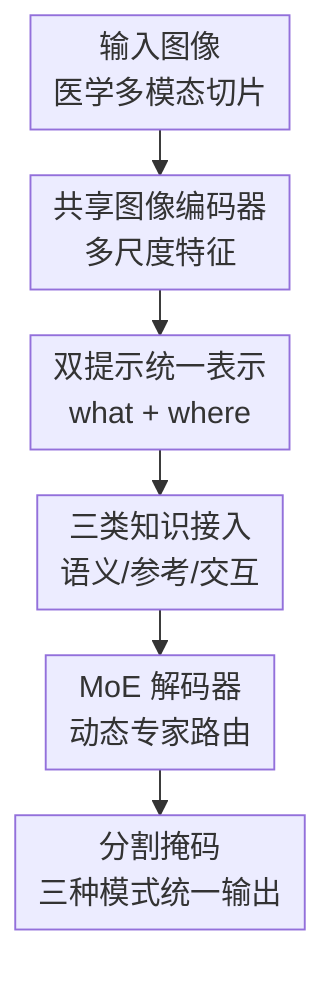

# K-Prism: A Knowledge-Guided and Prompt Integrated Universal Medical Image Segmentation Model

**会议**: ICLR2026  
**OpenReview**: [https://openreview.net/forum?id=gvRf95K4im](https://openreview.net/forum?id=gvRf95K4im)  
**代码**: https://github.com/bangwayne/K-Prism  
**领域**: 医学图像  
**关键词**: 医学图像分割、通用分割、上下文学习、交互式分割、Mixture-of-Experts

## 一句话总结
K-Prism 把语义先验、少样本参考样例和用户交互反馈统一编码成 1-D 稀疏提示与 2-D 稠密提示，再用 MoE 解码器动态路由，在 18 个医学图像数据集上同时刷新语义分割、in-context 分割和交互式分割的综合表现。

## 研究背景与动机
**领域现状**：医学图像分割已经是许多临床流程的基础能力，常见应用包括肿瘤勾画、器官定量、血管或病灶分割等。过去几年里，nnU-Net、UNETR、MedSAM、UniverSeg、Hermes 等方法分别在全监督语义分割、少样本参考分割或交互式分割中取得了很强的效果，但它们大多围绕一个固定使用场景训练和部署。

**现有痛点**：真实临床环境并不是一个模型只面对一种知识来源的理想实验室。某些常见器官可以依赖大规模标注数据学到的语义先验；某些罕见疾病或新扫描协议可能只有一两个参考病例；边界模糊的病例又需要医生通过点击、涂鸦或上一轮掩码逐步修正。现有模型通常只能处理其中一种，最多两种，导致医院需要维护多个任务专用模型，推理时也要在人机交互、少样本适配和语义分割工具之间切换。

**核心矛盾**：三类知识的形态完全不同。语义先验像“要分割哪一类”的类别查询；参考图像-掩码对同时包含目标外观和空间对应关系；交互反馈则是点击位置、正负提示和上一轮 mask。若直接把它们塞进同一个 decoder，模型既难以知道当前是哪种模式，也难以在不同提示粒度之间共享可迁移的表示。

**本文目标**：作者希望构建一个真正统一的医学图像分割框架，使同一模型在不改架构的情况下支持三种模式：基于训练集中学到的语义先验做常规分割，基于参考 image-mask pair 做 one-shot 或 few-shot in-context 分割，以及基于正负点击和上一轮 mask 做交互式 refinement。同时，这个统一模型还需要跨 CT、MRI、X-ray、病理、超声、皮肤镜、内镜等多模态数据保持泛化。

**切入角度**：K-Prism 的关键观察是，三类知识虽然来源不同，但都可以被拆成两个互补问题：一是“分割什么”，二是“在哪里关注”。前者适合用 1-D query 表示，后者适合用 2-D feature map 表示。只要把不同知识源都投影到这两类 prompt 里，再让 decoder 根据 prompt 类型动态选择专家，就有机会用一个模型覆盖多种临床工作流。

**核心 idea**：用“1-D 稀疏提示 + 2-D 稠密提示”统一表达语义、参考样例和交互反馈，并用 MoE cross-attention decoder 对不同知识模式进行动态路由。

## 方法详解
K-Prism 的方法主线可以理解为“统一输入语言 + 专家化解码”。输入图像先经过共享 image encoder 得到多尺度特征；不同知识源随后被转换为 1-D sparse prompts 和/或 2-D dense prompts；最后 MoE decoder 在 query 与 feature map 之间做双向 cross-attention，输出目标 mask。这样，语义分割、in-context 分割和交互式分割不再是三套模型，而是同一个模型的三种调用方式。

### 整体框架
K-Prism 首先用 UNet 风格的 image encoder 提取图像特征 $F=Encoder(I)$。对于语义分割，模型只需要类别相关的 1-D learnable queries；对于 in-context 分割，模型从参考图像和参考 mask 中生成 foreground/background queries 与参考对齐后的 dense feature；对于交互式分割，模型把正负点击和上一轮 mask 编成 2-D click map，同时把每个点击转成 1-D click query。所有提示最终进入 MoE decoder，由不同专家按 gating 权重参与融合。

三种模式的差异主要体现在 prompt 构造上。Mode-1 语义分割使用可学习的类别嵌入矩阵 $P \in R^{N_{cls}\times(p\times C)}$，对第 $n$ 类取 query $p_n$，直接用 $Decoder(F \mid p_n)$ 预测 mask。Mode-2 in-context 分割额外读取参考集 $S=\{I_{ref},M_{ref}\}$，既构造 foreground/background 1-D object queries，也通过 query-reference affinity 把参考 mask 语义投影到 query image 的空间特征上。Mode-3 交互式分割则把正点击、负点击、上一轮 mask 拼成三通道提示图，并为每个点击生成一个局部 feature pooling 后的位置 query。

这套设计的好处是，K-Prism 并不要求所有模式都提供同样的信息。语义分割没有空间提示，就只走 sparse prompt；in-context 有参考 mask，就同时生成 sparse object query 和 dense aligned feature；交互式分割有医生反馈，就把点击既当作空间修正信号，也当作 query 级别的正负注意力提示。统一发生在表示层，而不是强行把所有输入变成同一种原始格式。

### 关键设计
**1. 双提示统一表示：把异构知识拆成“分什么”和“看哪里”**

K-Prism 最核心的抽象是 dual-prompt representation。1-D sparse prompts 负责表达目标语义或实例级意图，也就是 what to segment；2-D dense prompts 负责给空间特征图注入定位、参考对应或交互反馈，也就是 where to attend。语义分割只需要前者，因为类别嵌入已经足以说明分割对象；in-context 和交互式分割则同时需要两者，因为参考样例和用户点击都包含空间信息。

在 in-context 模式中，query image 和 reference image 共享 image encoder，得到 $F_q$ 与 $F_k$；参考 image-mask pair 经过 mask encoder 得到 value feature $F_v$。模型把这些特征 flatten 成 $K^{ref}$、$V^{ref}$ 和 $K^q$，用负平方欧氏距离计算 reference 和 query 之间的 affinity：$A_{i,j}=c(K^{ref}_{:,i},K^q_{:,j})$，再对每个 query 位置做 softmax 得到 $W$，最后形成 $F_{fuse}=V^{ref}W$。这一步的意义是把“参考图里 mask 对应的目标长什么样、在哪些位置出现”转移到 query image 的空间坐标系中，而不是只用一个全局 embedding 表示参考样例。

同一模式下还会生成 1-D object queries。作者把参考 mask 下采样并 flatten 成 pooling mask，前一半 queries 聚合前景区域，后一半 queries 聚合背景区域，从而让 decoder 同时知道目标和非目标的高层特征。这样，reference pair 不只是一个模板，也成为“前景该像什么、背景该不像什么”的对比提示。

**2. 三模式提示接入：同一模型覆盖语义、少样本和交互式临床流程**

K-Prism 没有把三类任务写成三套分支，而是为每类临床知识定义最合适的提示入口。Mode-1 的 semantic prior 是可学习类别 query，适合训练集中出现过的器官或病灶；Mode-2 的 in-context knowledge 来自 reference image-mask pair，适合新疾病、新器官或新协议下只有少量标注样例的情况；Mode-3 的 interactive feedback 来自点击和上一轮 mask，适合医生在局部边界上逐步纠错。

交互式模式的设计尤其体现了“统一但不抹平差异”。点击首先被编码成三通道 dense prompt：正点击图、负点击图和 previous mask。这个 prompt 经过 PromptEncoder 后与图像特征相加；如果是在 refinement Mode-2，则与 reference projection 后的 $V^{ref}W$ 相加。与此同时，每个点击还会映射到 feature map 坐标，在 $2r+1$ 的局部窗口内平均池化，再叠加 SAM-style 位置编码形成 click query $q_c$。因此，点击既能在 2-D 空间上告诉模型“这里要改”，也能在 1-D query 上告诉 decoder“这是一个正例/负例意图”。

这种接入方式让 K-Prism 支持流畅切换：先用语义先验生成初始 mask，再用两次点击 refinement；或者先用参考样例做 in-context segmentation，再让医生点击修边。实验中的 Table 5(d) 正是验证这一点：相比纯 Mode-3，Mode-1 refine 与 Mode-2 refine 在 ACDC 和 BUS 上把达到 90% Dice 所需的点击数明显降下来，例如 ACDC 从 2.67 次降到 1.67/1.77 次，BUS 从 1.67 次降到 1.10/1.17 次。

**3. MoE 解码器：让不同知识模式走不同专家而不是挤进同一条注意力路径**

统一框架的风险是负迁移：语义 query、reference query 和 click query 的统计性质不一样，如果用一个普通 transformer decoder 同时服务所有模式，可能会在某些模式上欠拟合。K-Prism 因此在 cross-attention 和 FFN 中引入 Mixture-of-Experts。每个 MoE cross-attention 层有 $M$ 个 attention experts，query-specific gating network 输出权重 $\alpha=softmax(G(Q))$，最终输出为 $O_{moe}=\sum_m \alpha_m O_m$。

这个 MoE 不只是简单增加参数量。decoder 使用双向 cross-attention：第一步让 1-D sparse prompts 作为 queries，2-D fusion feature maps 作为 keys/values，让 prompt 从空间特征中吸收证据；随后再反过来让更新后的 1-D queries 作为 keys/values，2-D feature map 作为 queries，使空间特征被目标意图反向调制。MoE 专家分别出现在 cross-attention 和 FFN 中，使模型能对不同提示来源分配不同专家组合。

附录中的 expert weight 分析说明这种路由确实发生了：在 ACDC 外部数据上，Mode-1 更偏向 Expert 5，Mode-2 强烈偏向 Expert 1，Mode-3 则分布更均衡。这说明 MoE decoder 学到的不是单一平均策略，而是按任务模式改变专家使用方式。消融也支持这一点：去掉 MoE cross-attention、MoE FFN 或两者都会降低三种模式表现，完全去掉两者时 semantic Dice 从 81.28 掉到 76.77，in-context Dice 从 79.21 掉到 75.10，交互式 Dice(5) 从 93.79 掉到 92.22。

**4. 联合训练与多尺度细节：让统一能力来自共享表示而非后处理拼装**

K-Prism 的训练不是先分别训练三个模型再拼装，而是在同一训练循环中随机采样三种 operational mode。实现细节中，batch 被分配到 Mode-1、Mode-2、Mode-3 的概率分别是 0.3、0.3、0.4；mask loss 为 binary cross-entropy 加 Dice loss，即 $L=L_{ce}+L_{dice}$。这种联合训练让共享 encoder 和 decoder 同时看到类别先验、参考样例和交互反馈，使表示层能学习跨模式共性。

模型结构上，作者使用 UNet 作为轻量 image encoder，提取 $1/16$、$1/8$、$1/4$ 三个尺度的特征。decoder 共 6 层，按 round-robin 策略在多尺度特征上交互，并用 residual resampling connection 把上一层特征重采样后加到下一尺度。对于 foreground/background 或 positive/negative click queries，decoder 还使用 masked attention，让前景 query 关注预测前景区域，背景或负点击 query 关注互补区域。这些细节保证统一提示不是只在最低分辨率上做一次融合，而是在多尺度边界与局部结构上持续更新。

### 一个完整示例
假设医生要在一个新的乳腺超声 BUS 病例中分割肿瘤，而当前医院没有专门训练过这个协议的模型。K-Prism 可以先进入 Mode-2：输入 query ultrasound slice，再给一张 reference image 和对应 tumor mask。模型用共享 encoder 提取 query/reference 特征，用 mask encoder 读取 reference mask，并通过 affinity $W$ 把 reference tumor 区域的 value feature 投影到 query 图像上。同时，reference mask 的前景区域聚合成 foreground queries，背景区域聚合成 background queries。

MoE decoder 随后用这些 queries 和 dense fusion map 预测初始 tumor mask。如果初始边界漏掉了一个低回声小区域，医生可以点一下漏分区域作为 positive click，再点一下过分割区域作为 negative click。此时模型进入 refinement：click map 与上一轮 mask 形成 2-D dense prompt，每个点击又变成 click query，与原本的 reference object queries 一起送入 decoder。经过一两次交互，模型不必从零重新分割，而是在已有参考知识和局部反馈的基础上修正边界。

这也解释了为什么 K-Prism 在交互式指标上 click-efficient。它不是只把点击当孤立点，也不是只依赖上一轮 mask，而是让“参考样例提供初始目标外观、点击提供局部错误位置、MoE decoder 选择合适专家”三者一起工作。对于临床标注流程，这意味着医生更像在校对一个较好的初稿，而不是用点击从空白画布开始勾画。

### 损失函数 / 训练策略
K-Prism 训练 75 个 epoch，batch size 为 16，在 8 张 Quadro RTX 8000 GPU 上使用 AdamW，基础学习率 $1\times10^{-4}$，cosine annealing scheduler，并包含 10 个 warm-up epochs，最小学习率按 $1\times10^{-5}$ 缩放。训练图像 resize 到 $512\times512$，增强包括随机翻转、仿射变换、亮度/对比度调整、高斯模糊/噪声和 grid distortion。

训练时每个 batch 随机选择一种模式：Mode-1 语义分割概率 0.3，Mode-2 in-context 分割概率 0.3，Mode-3 交互式分割概率 0.4。交互点击通过预测 mask 与 ground truth 的差异模拟，新的点击放在最大误分类连通区域的质心；点击 map 半径为 1 pixel。推理时输入图像保持长边为 512 并保留宽高比，预测再映射回原始分辨率计算 Dice。

其他关键超参包括：语义分割每类使用 $p=2$ 个 1-D queries，in-context 使用 $n_s=6$ 个 object queries，decoder 通道固定为 256，attention head 数为 8，主实验 MoE expert 数为 $M=5$。训练阶段的 in-context reference 使用单个 image-mask pair；附录中的 few-shot 分析表明，在 AMOS MRI 这类多器官 3D 切片场景中，参考样例从 1-shot 增加到 9-shot 时 Dice 从 78.21 提升到 79.90。

## 实验关键数据

### 主实验
论文在 18 个公开医学图像数据集上评估，包括 12 个训练/同分布评估数据集、4 个 external 数据集和 2 个 unseen-class 数据集。模态覆盖 CT、MRI、X-ray、病理、超声、眼底、内镜和皮肤镜；任务包括多器官、肿瘤、皮肤病灶、息肉、肾小球、肺野、心脏结构等。作者分别比较 semantic、in-context 和 interactive 三类基线。

| 设置 | 指标 | K-Prism | 最强对比方法 | 提升 |
|------|------|---------|--------------|------|
| Semantic in-distribution 12 数据集 | 平均 Dice | 86.21 | Hermes 85.02 | +1.19 |
| Semantic external 4 数据集 | 平均 Dice | 83.45 | Hermes 81.81 | +1.64 |
| In-context in-distribution 12 数据集 | 平均 Dice | 84.82 | Iris 81.76 | +3.06 |
| In-context external 4 数据集 | 平均 Dice | 82.49 | Iris 78.52 | +3.97 |
| In-context unseen-class 2 数据集 | 平均 Dice | 31.91 | Iris 26.07 | +5.84 |

在 semantic setting 中，K-Prism 在 12 个同分布数据集上平均 Dice 为 86.21，高于 Hermes、Clip-driven 和 UniSeg。它在 LiTS tumor 上达到 64.22，在 KiTS tumor 上达到 78.70，这两个任务对肿瘤外观和上下文依赖较强，能体现统一先验的价值。外部数据上，K-Prism 在 BTCV、ACDC、UW-SC、BUS 的平均 Dice 为 83.45，也高于其他 universal models。

在 in-context setting 中，K-Prism 的优势更明显。它在 12 个同分布数据集上平均 Dice 为 84.82，并且在 11/12 个数据集上排名第一；外部数据平均 82.49。对 unseen-class 数据，BraTS 为 22.20，M&Ms-2 为 41.61，平均 31.91；其中 M&Ms-2 相比 Iris 的 26.30 有约 15.31 个点提升，说明 reference-guided prompt 对新结构有帮助。不过 BraTS 上仅 22.20 也提醒读者，严重 domain shift 下 in-context matching 仍然很难。

| 交互式分割设置 | 指标 | K-Prism | 最强对比方法 | 说明 |
|----------------|------|---------|--------------|------|
| In-distribution | NoC90 ↓ | 1.95 | SegNext 2.50 | 达到 90% Dice 所需点击更少 |
| In-distribution | Dice(5) ↑ | 95.50 | SegNext 93.80 | 5 次点击后最高 |
| External | NoC90 ↓ | 2.01 | SegNext 2.63 | 外部数据仍保持 click-efficient |
| External | Dice(5) ↑ | 94.92 | SegNext 92.96 | 泛化稳定 |
| Unseen-class | NoC90 ↓ | 4.32 | SegNext 4.77 | 新类别仍有优势 |
| Unseen-class | Dice(5) ↑ | 90.67 | MultiverSeg 87.93 | 5 次点击后领先明显 |

交互式结果表明，K-Prism 的初始质量和后续收敛都比较强。它在同分布数据上 Dice(1) 为 89.55，Dice(5) 为 95.50；外部数据上 Dice(5) 为 94.92；unseen-class 上 Dice(5) 为 90.67。相比 SAM2 和 MedSAM 这类初始 Dice 较高但点击后提升有限的方法，K-Prism 的 1-D sparse click queries 与 2-D dense click maps 共同发挥作用，所以 convergence curve 更陡。

### 消融实验
| 配置 | Semantic Dice | In-context Dice | NoC90 ↓ | NoC95 ↓ | Dice(1) | Dice(5) |
|------|---------------|-----------------|---------|---------|---------|---------|
| Full model | 81.28 | 79.21 | 2.31 | 4.80 | 86.76 | 93.79 |
| w/o MoE CA | 77.38 | 77.11 | 2.47 | 5.11 | 86.55 | 93.23 |
| w/o MoE FFN | 78.57 | 78.37 | 2.37 | 4.84 | 86.50 | 93.67 |
| w/o MoE FFN & CA | 76.77 | 75.10 | 2.62 | 5.04 | 84.16 | 92.22 |

MoE 相关消融说明，MoE cross-attention 对 semantic 和 in-context 的影响更大，去掉后 semantic Dice 降 3.90 点；MoE FFN 也有贡献，但单独去掉时对 Dice(5) 的影响较小。两者都去掉时表现最差，说明专家化能力不是某个单独模块带来的偶然增益，而是 cross-attention 和 FFN 共同支撑统一解码。

| 模式与组件 | 配置 | 关键指标 | 说明 |
|------------|------|----------|------|
| In-context | Full model | Dice 80.84 | 完整 dual prompt |
| In-context | w/o 2-D fusion | Dice 54.65 | 去掉空间对齐后几乎崩塌 |
| In-context | w/o 1-D queries | Dice 77.19 | 仍可工作但目标语义变弱 |
| Interactive | Full model | Dice(5) 93.68 | 完整 click dense + query |
| Interactive | w/o 2-D fusion | Dice(5) 79.21 | 点击缺少空间图后修正能力大降 |
| Interactive | w/o 1-D queries | Dice(5) 93.39 | 影响较小但仍有下降 |

这组消融非常关键：2-D fusion 是 in-context 和 interactive 的主支柱。去掉它后，in-context Dice 从 80.84 掉到 54.65，interactive Dice(5) 从 93.68 掉到 79.21。相比之下，去掉 1-D queries 的损失较小，说明 dense spatial alignment 对医学图像边界和位置更关键，但 1-D queries 仍能提供前景/背景或正负点击意图。

### 关键发现
- K-Prism 的最大贡献不是某个单项指标小幅上涨，而是同一个模型在三类 segmentation paradigm 上都达到或接近最佳，并且在 in-context 与 interactive 场景优势更明显。
- 2-D dense prompt 是最不可替代的组件，尤其是 reference-to-query affinity 和 click map 融合；这符合医学分割对局部边界、空间位置和模态纹理高度敏感的特点。
- MoE decoder 对统一模型很重要。专家数量从 2 增加到 5 时，semantic Dice 从 77.62 提升到 81.28，in-context Dice 从 75.55 提升到 79.21，NoC90 从 2.64 降到 2.31，但参数量也从 31.43M 增加到 43.29M。
- 额外专家带来的吞吐开销并不极端：单张 A100 上 plain decoder 为 5.38 FPS，5 experts 为 3.63 FPS。对实时性要求高的临床部署仍需评估，但并非完全不可用。
- in-context 模式对 reference exemplar 有一定敏感性。BUS 的 10 次 1-shot 评估方差很低，78.43 ± 0.72；ACDC 因为 3D 心脏解剖位置变化更大，方差为 83.68 ± 2.38。复杂 3D 多器官场景中增加 reference shot 数能缓解这一问题。

## 亮点与洞察
- K-Prism 把“通用医学分割”拆成知识来源统一，而不是任务标签统一。许多 universal segmentation 方法只是把多个类别或数据集放进一个训练池，K-Prism 则明确处理语义先验、参考样例和交互反馈三种临床知识形态。
- dual prompt 抽象很实用。1-D query 管目标意图，2-D feature 管空间定位，这个拆分不只适用于医学图像，也可迁移到遥感、工业缺陷、显微图像等“目标类别不固定但空间结构很重要”的分割任务。
- in-context 中用 affinity 把 reference mask value feature 投影到 query 空间，比单纯把 support image-mask pair 编成一个全局 token 更细。医学图像中同一器官在不同切片、不同模态下形态变化大，空间对齐类机制能提供更强的局部约束。
- 交互式设计没有只模仿 SAM 的点提示，而是把点击同时当作 2-D dense map 和 1-D sparse query。这个细节解释了为什么 K-Prism 在 Dice(1) 已经高的情况下还能随点击继续明显提升。
- MoE 的引入比较克制：它不是为所有任务堆一个巨型 foundation model，而是在 decoder 层提供专家化容量，让不同 prompt 模式有不同路由。对于医疗场景，这比纯参数规模扩张更容易解释和调试。

## 局限与展望
- K-Prism 目前是 2D slice-based formulation，无法充分利用 3D 体数据的连续上下文。对于 CT/MRI 中跨切片结构稳定的器官或肿瘤，2D 模型可能会在相邻切片间出现不一致。作者也指出未来可以探索 2D-to-3D propagation，把医生在单片上的 refinement 传播到整个 volume。
- in-context 模式仍依赖 reference exemplar 的质量和相似性。BraTS 和 M&Ms-2 失败案例表明，当参考和 query 在解剖、扫描视角或病灶外观上差异过大时，appearance-driven matching 会把相似强度或相似形状误认为目标。
- MoE decoder 增加了参数量和推理成本。5 experts 相比 plain decoder FPS 从 5.38 降到 3.63；虽然作者认为多 GPU 临床服务器可缓解，但边缘设备、术中实时系统或大批量离线标注仍需要更细的效率评估。
- 实验覆盖了很多 2D slice 和公共数据集，但真实临床部署还涉及扫描协议漂移、标注标准差异、隐私限制、跨医院 calibration 和医生交互习惯差异。K-Prism 更像一个有潜力的统一 backbone，而不是可以直接上线的临床产品。
- 未来可以进一步研究 expert specialization 的可解释性，例如不同器官、模态、交互轮次是否会稳定路由到特定专家；也可以把 reference retrieval 纳入框架，让模型自动从病例库中选 support，而不是假设用户已经给出合适 exemplar。

## 相关工作与启发
- **vs nnU-Net / UNETR**: 这些方法代表强任务专用或常规全监督医学分割，优势是单任务优化充分、工程成熟；K-Prism 的目标不是在每个单一数据集上取代它们，而是减少多模型部署和跨场景切换成本。
- **vs Hermes / Clip-driven / UniSeg**: 这些 universal semantic segmentation 方法主要依赖类别语义或任务嵌入，能统一多个类别和数据集；K-Prism 进一步把 reference exemplars 和 interactive feedback 纳入同一框架，因此在少样本和医生修正场景中更完整。
- **vs UniverSeg / Tyche / Iris**: 这些方法聚焦 in-context medical segmentation，强调用 support set 适配新任务；K-Prism 继承 reference-guided 思路，但加入 1-D/2-D dual prompt 和 MoE decoder，还能无缝接入语义先验与交互式 refinement。
- **vs MedSAM / SAM2 / nnInteractive / SegNext**: 这些方法主要面向 promptable 或 interactive segmentation。K-Prism 的不同点在于，点击不是唯一知识来源，而是可以叠加在 semantic 或 in-context 初始 mask 之上，从而把交互从“从零分割”变成“校正已有结果”。
- **vs MultiverSeg / Verse**: MultiverSeg 结合 in-context 与 interactive，Verse 结合 semantic 与 interactive，Iris 结合 semantic 与 in-context；K-Prism 的定位是把三者同时纳入一个架构，填补医学分割统一范式中最后一个组合缺口。

## 评分
- 新颖性: ⭐⭐⭐⭐⭐ 把三类医学分割知识统一到 dual prompt + MoE decoder 的设计很完整，尤其是覆盖 semantic、in-context、interactive 三种模式。
- 实验充分度: ⭐⭐⭐⭐⭐ 18 个数据集、三类任务、外部/未见类别测试、组件消融、专家数、吞吐、reference 敏感性和失败案例都比较充分。
- 写作质量: ⭐⭐⭐⭐☆ 主线清楚，图表信息密集；但方法细节较多，部分多尺度和 masked attention 细节主要放在附录，初读需要来回对照。
- 价值: ⭐⭐⭐⭐⭐ 对医学图像基础分割模型很有实际意义，尤其适合把自动分割、少样本适配和医生交互标注整合到同一工作流中。

<!-- RELATED:START -->

## 相关论文

- [\[AAAI 2026\] ProPL: Universal Semi-Supervised Ultrasound Image Segmentation via Prompt-Guided Pseudo-Labeling](../../AAAI2026/medical_imaging/propl_universal_semi-supervised_ultrasound_image_segmentation_via_prompt-guided_.md)
- [\[CVPR 2025\] Show and Segment: Universal Medical Image Segmentation via In-Context Learning](../../CVPR2025/medical_imaging/show_and_segment_universal_medical_image_segmentation_via_in-context_learning.md)
- [\[ICLR 2026\] Rethinking Model Calibration through Spectral Entropy Regularization in Medical Image Segmentation](rethinking_model_calibration_through_spectral_entropy_regularization_in_medical_.md)
- [\[CVPR 2026\] Universal-to-Specific: Dynamic Knowledge-Guided Multiple Instance Learning for Few-Shot Whole Slide Image Classification](../../CVPR2026/medical_imaging/universal-to-specific_dynamic_knowledge-guided_multiple_instance_learning_for_fe.md)
- [\[CVPR 2026\] VoxTell: Free-Text Promptable Universal 3D Medical Image Segmentation](../../CVPR2026/medical_imaging/voxtell_free-text_promptable_universal_3d_medical_image_segmentation.md)

<!-- RELATED:END -->
