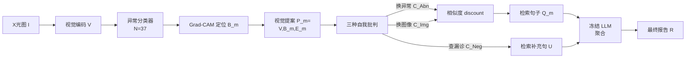

# Learning Self-Critiquing Mechanisms for Region-Guided Chest X-Ray Report Generation

**会议**: ICLR 2026  
**OpenReview**: [https://openreview.net/forum?id=6sOSwgCmpH](https://openreview.net/forum?id=6sOSwgCmpH)  
**代码**: 待确认  
**领域**: 医学影像 / 放射报告生成  
**关键词**: 胸片报告生成, 自我批判, 异常定位 grounding, 检索式生成, 弱监督定位  

## 一句话总结
RadSCR 把放射科医生「反复自我质疑」的诊断过程编码进模型结构，用「换异常类别、换病人图像、查漏诊」三种自我批判机制端到端学习，在不引入测试时 LLM 推理的前提下显著提升了胸片报告的临床准确率与异常定位可靠性。

## 研究背景与动机
**领域现状**：自动放射报告生成的核心诉求是「临床准确」且「可解释」——生成的异常发现必须可靠地 grounding 到图像中对应的区域，这正是放射科医生实际工作中做的事。近期工作大多走 anatomy-aware 路线，先检测解剖部位（肺、心脏等）再据此生成报告，提升了准确率与可解释性。

**现有痛点**：解剖部位级别的定位不够精细，无法满足细粒度 grounding 的需求；更关键的是，主流模型本质上是在「区域—句子」的统计相关性上训练的，缺乏对假设的复核环节，因而难以避免幻觉（hallucination）。

**核心矛盾**：放射科医生靠「自我批判」（self-critiquing）来降低误诊——在下结论前反复验证可疑区域。要把这种机制引入模型，最直接的方式是用 LLM 的链式思维（CoT）做测试时推理，但这会在推理时生成大量「思考」token，带来高昂的 test-time 成本，且在低资源临床环境中难以部署。

**本文目标**：在不依赖测试时 LLM 推理、不做 test-time scaling 的前提下，把多面向的自我批判机制直接内化进模型架构，训练阶段端到端学习，从而实现可靠的细粒度异常 grounding 与高临床准确率的报告生成。

**核心 idea**：**[把"反复质疑"做成可学习的对比结构]** —— 先用 Grad-CAM 把每个预测出的异常假设成「区域+标签+视觉特征」的视觉提案，再通过「换异常、换图像、查漏诊」三种批判对每个提案做 discount（打折扣），只有那些经得起质疑、仍然 distinct 且 relevant 的提案才被用于检索句子生成最终报告。

## 方法详解

### 整体框架
给定一张 X 光图 $I$，RadSCR 先编码视觉特征 $V$，用分类器预测 $N=37$ 个异常的存在性，并对每个阳性异常用 Grad-CAM 定位区域 $B_m$、配上可学习的概念表示 $E_m$，组成视觉提案 $P_m = \text{PropEncoder}(V, B_m, E_m)$。随后三种自我批判机制对每个提案生成「替代提案」并据此 discount 相似度，经过批判筛选的提案去报告库检索相关句子，最后交给一个冻结的 LLM decoder 聚合成报告。

### 关键设计

**1. 区域级视觉提案构建：把"哪里有什么异常"打包成可比对的三元组。** RadSCR 不依赖稀缺的异常框标注，而是对每个预测阳性的异常（$p_m=\text{Sigmoid}(\text{FCN}(\text{AvgPool}(V)))>0.5$）用 CAM 算像素级显著图 $W_m$，再用 objectness 估计算法把显著区域聚成 patch 级掩码并取并集得到区域 $B_m=\text{Map}(\text{MaxPool}(\{b_{m,1},b_{m,2},...\}))$。把 $(N{+}1)$ 个全局概念表示 $E$（$N$ 个异常 + 1 个背景 padding）中对应的 $E_m$ 嵌进区域位置形成 spatial-aware 表示 $F_m$，与 patch 级视觉特征 $V$ 拼接经 FFN 得到提案 $P_m=\text{FFN}(V\oplus F_m)$。这一步把抽象的「异常假设」变成一个能与句子、其它提案做点积比对的统一向量，是后续批判的基础。

**2. 三面向自我批判：用"反例"给可疑提案打折扣。** 这是全文的灵魂，模仿医生从三个角度复核：① **换异常类别** $C_m^{(Abn)}=\text{PropEncoder}(V,B_m,E'_m)$——在同一区域 $B_m$ 换上另一个（阴性或未被该区域覆盖的）异常概念 $E'_m$，检验该区域的特征是否真的对当前异常「专属」而非与相似异常混淆；② **换病人图像** $C_m^{(Img)}=\text{PropEncoder}(V',B_m,E_m)$——把视觉特征替换成另一随机病人的图像 $V'$，检验提案是否对该异常足够 specific 而非泛泛；③ **查漏诊（false negative）** $C^{(Neg)}=\text{PropEncoder}(V,B_0,E_0)$——因为细粒度定位会漏掉更「整体性」的异常，故把所有预测阴性异常的概念做平均池化 $E_0$、配上主要解剖部位聚合出的区域 $B_0$，做一个互补提案专门捞回潜在漏诊。检索时用 $C^{(Abn)}$ 与 $C^{(Img)}$ 去抑制原提案的相似度：$\tilde\sigma(P_m,s_{(m)})=\sigma(P_m,s_{(m)})-\alpha_2(\sigma(C_m^{(Abn)},s_{(m)})+\sigma(C_m^{(Img)},s_{(m)}))$，经得起质疑的句子才会被排到前面。

**3. 原型增强的检索式生成：让句子检索更鲁棒、更细粒度。** 每个异常假设 $K=5$ 个「原型」（prototype，更高层的临床概念），对报告库里句子的 TF-IDF 表示做 K-means 聚类得到（4 类阳性提及 + 1 类阴性提及）。句子表示 $s_{(m)}$ 由 ClinicalBERT 编码后先与概念 $E_m$ 做交叉注意力再自注意力池化得到。检索相似度同时考虑句子本身和它的原型 $\sigma(P_m,s_{(m)})=P_m\odot s_{(m)}+\alpha_1 P_m\odot o_{pt(s_{(m)})}$，这样同一异常在不同语境（如观察区域不同）的句子能被更细粒度地组织检索。最终把 discount 后 top-$M$ 的句子集 $\{Q_m\}$ 与漏诊互补集 $\{U_n\}$ 一起喂给冻结的 Phi(4B) decoder，prompt 设计为 $Q$ 中句子全部保留、$U$ 中句子仅在不与 $Q$ 矛盾时使用。

**4. 多损失端到端学习：把批判信号写进目标函数。** 训练目标为 $L^{(Prop)}+\beta_1 L^{(Alt)}+\beta_2 L^{(Neg)}$：$L^{(Prop)}$ 是对称对比损失，拉近提案 $P_m$ 与真句子/原型、推远其它异常句、其它报告同异常句、其它原型——由于端到端，异常定位也在此被弱监督地学到；$L^{(Alt)}$ 用三元组损失把 $s_{(m)}$ 拉近 $P_m$ 推远 $C^{(Abn)}$ 与 $C^{(Img)}$ 以学会批判；$L^{(Neg)}$ 用对比损失引导 $C^{(Neg)}$ 靠近「存在但未被假设」的阳性提及句、远离阴性提及句。整套机制只在训练时起作用，推理时无需任何额外的 LLM 推理开销。

## 实验关键数据

数据集：MIMIC-CXR（训练+测试）、ReXGradient、IU X-Ray（报告生成/检索/异常检测），VinDR-CXR（定位）。视觉骨干 Swin Transformer，LLM decoder 用冻结的 Phi(4B)，37 个 Chest ImaGenome 标注异常，每异常 $K=5$ 个原型。

### 主实验表格（MIMIC-CXR 报告生成）

| 方法 | CheXbert F1 | CE-Abn | CE-Organ | RadGraph-C | RadNLI-F1 |
|------|-------------|--------|----------|------------|-----------|
| RGRG (区域式) | 0.489 | 0.251 | 0.669 | 0.248 | 0.317 |
| LLaVA-Rad (7B) | 0.512 | 0.399 | 0.661 | 0.220 | 0.286 |
| CXR-RePaiR (检索式) | 0.423 | 0.380 | 0.630 | 0.191 | 0.264 |
| X-REM (检索式) | 0.402 | 0.382 | 0.615 | 0.186 | 0.280 |
| **RadSCR** | **0.610** | **0.572** | **0.744** | **0.367** | **0.408** |

RadSCR 在临床准确率（CheXbert、CE-Abn/Organ、RadGraph、RadNLI）上全面大幅领先所有 VLM/LLM/检索式基线。与更大 decoder 的近期模型相比（Table 2），MAIRA-2(7B) CheXbert-F1=0.621、RadFM=0.635，RadSCR(用 4B 冻结 decoder)=0.610，**用更小模型达到了可比水平**，且 CE-Organ(0.744) 与 RadNLI-Re/F1 反超。

### 消融实验表格（MIMIC-CXR）

| 移除项 | CheXbert F1 | CE-Abn | CE-Organ | RadGraph-C | RadNLI-F1 |
|--------|-------------|--------|----------|------------|-----------|
| 完整 RadSCR | 0.610 | 0.572 | 0.744 | 0.367 | 0.408 |
| (i) 训练+测试都去掉全部批判 $C^{(*)}$ | 0.561 | 0.535 | 0.689 | 0.289 | 0.359 |
| (ii) 仅测试去掉全部批判 $C^{(*)}$ | 0.545↓ | 0.379↓ | 0.653↓ | 0.231↓ | 0.343 |
| (ii) 仅测试去 $C^{(Neg)}$ | 0.491↓↓ | 0.545 | 0.668 | 0.354 | 0.398 |
| (iii) 去 LLM decoder | 0.611 | 0.554 | 0.724 | 0.351 | 0.326↓ |
| (iv) 去原型 $\{O_k\}$ | 0.591 | 0.377↓↓ | 0.751 | 0.210↓↓ | 0.357 |

### 关键发现
- **自我批判是主贡献来源**：训练+测试都去掉批判，几乎所有指标显著下降；只在推理时保留批判还能进一步提升报告质量，说明批判在 inference 阶段同样起作用。
- **$C^{(Neg)}$ 专治漏诊**：去掉它 CheXbert-F1 掉得最猛（0.610→0.491），印证全局特征确实能捞回细粒度定位漏掉的异常。
- **原型管"细粒度组织"**：去掉原型 CE-Abn 与 RadGraph 大幅下降，原型让同异常不同语境的句子被更好地组织检索。
- **采样更多替代提案有增益**：$C^{(Abn)}$/$C^{(Img)}$ 各采样 $N_p=2$ 时最优；Random+hard+easy 的混合采样策略能在部分指标上再涨（RadGraph-P 0.422→0.446）。
- **检索排序质量**：在 Acc@5/Acc@10 与三种偏好排序（PO-1/2/3）上 RadSCR 均优于检索式基线，正确诊断句被排得更靠前。

## 亮点与洞察
- **把"测试时推理"前置成"训练时结构"**：用对比/三元组损失把医生的自我批判过程编码进模型架构，绕开了 CoT 的高昂 test-time 成本，对低资源临床部署友好——这是与 MedCoT、ChestX-Reasoner 等 CoT 路线最本质的区别。
- **"换异常/换图像/查漏诊"三元批判设计精巧**：分别对应「特征是否专属」「是否过泛」「是否漏诊」三类典型错误，且都复用同一个 PropEncoder，工程上优雅。
- **弱监督定位的副产品**：异常定位无需框标注，靠端到端的视觉-语言对齐损失被「顺带」学到，缓解了大规模异常区域标注稀缺的痛点。
- **小模型打大模型**：冻结 4B decoder 即可逼平 7B MAIRA-2/RadFM，说明临床准确率的瓶颈更多在 grounding 可靠性而非 decoder 规模。

## 局限与展望
- **替代提案采样策略仍待优化**：作者承认「最优采样方式仍 open」，目前 hard/easy/mixed 等方案只是初步探索，最佳批判的采样仍是开放问题。
- **依赖 Grad-CAM 定位质量**：区域 $B_m$ 由 CAM + objectness 估计得到，定位本身的噪声会传导到提案与检索；CAM 在 OOD 异常上虽比检测器稳，但精度上限受限。
- **检索式框架受报告库覆盖约束**：最终句子来自报告库检索，库中未出现的罕见表述难以生成。
- **$C^{(Neg)}$ 区域来自解剖部位聚合**：漏诊互补提案的区域 $B_0$ 用主要解剖部位框聚合而非精确定位，粒度偏粗。
- **泛化性**：在 MIMIC-CXR 训练、跨 ReXGradient/IU X-Ray 测试虽有效，但跨机构/跨设备的真实泛化仍需更多验证。

## 相关工作与启发
- **Grounded 报告生成**：RGRG、ORGAN、MAIRA-2、BoxMed-RL 等走解剖部位检测路线，本文指出解剖级定位不够精细，转向细粒度异常区域 + 批判。
- **放射推理（VQA 中的 CoT）**：MedCoT（分层专家 CoT 互验）、MedRAX（任务分解 agent）、ChestX-Reasoner（每个发现拆 step CoT）代表 LLM 推理路线，本文以「结构内化」替代之。
- **"What-if"复核思路**：PGFC（事实核查匹配 finding-region）、CoFE（替换 patch 造反事实做对比学习）与本文同属「质疑式」路线，但 RadSCR 同时考虑替代异常、替代图像与漏诊检查，且直接服务于检索可靠性而非生成反事实解释。
- **弱监督异常定位**：注意力 attend 异常区域、解剖区域约束、coarse-to-fine 定位等，本文以端到端对齐损失实现弱监督定位。
- **启发**：「把昂贵的测试时推理蒸馏成训练时的对比结构」是一个可迁移到其它高风险、低资源场景（如病理、超声）的范式；对比批判作为一种轻量「自我验证」，或可成为缓解多模态幻觉的通用组件。

## 评分
- **新颖性**: ⭐⭐⭐⭐ 把医生自我批判抽象成「换异常/换图像/查漏诊」三种可学习的对比结构，并明确以「训练时结构替代测试时 LLM 推理」为卖点，设计独到。
- **实验充分度**: ⭐⭐⭐⭐ 四数据集、覆盖报告生成/检索/检测/定位多任务，基线涵盖 VLM/LLM/检索式三大类，消融拆解到每个批判分支与训练/测试两阶段，证据链完整。
- **写作质量**: ⭐⭐⭐⭐ 动机—方法—损失—实验逻辑清晰，公式与符号体系自洽；图表略密、部分细节挪到附录。
- **价值**: ⭐⭐⭐⭐ 在临床准确率上大幅领先且小模型逼平大模型，对低资源临床报告生成与幻觉缓解有实际意义，范式可迁移。

<!-- RELATED:START -->

## 相关论文

- [\[CVPR 2026\] Phrase-grounded APO for Improving Chest X-ray Report Generation](../../CVPR2026/medical_imaging/phrase-grounded_apo_for_improving_chest_x-ray_report_generation.md)
- [\[AAAI 2026\] PriorRG: Prior-Guided Contrastive Pre-training and Coarse-to-Fine Decoding for Chest X-ray Report Generation](../../AAAI2026/medical_imaging/priorrg_prior-guided_contrastive_pre-training_and_coarse-to-fine_decoding_for_ch.md)
- [\[AAAI 2026\] A Disease-Aware Dual-Stage Framework for Chest X-ray Report Generation](../../AAAI2026/medical_imaging/a_disease-aware_dual-stage_framework_for_chest_x-ray_report_.md)
- [\[ICLR 2026\] Rethinking Radiology Report Generation: From Narrative Flow to Topic-Guided Findings](rethinking_radiology_report_generation_from_narrative_flow_to_topic-guided_findi.md)
- [\[CVPR 2025\] Enhanced Contrastive Learning with Multi-view Longitudinal Data for Chest X-ray Report Generation](../../CVPR2025/medical_imaging/enhanced_contrastive_learning_with_multi-view_longitudinal_data_for_chest_x-ray_.md)

<!-- RELATED:END -->
