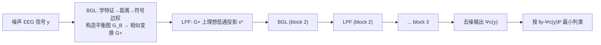

# Lightweight Transformer for EEG Classification via Balanced Signed Graph Algorithm Unrolling

**会议**: ICLR 2026  
**OpenReview**: [https://openreview.net/forum?id=zxsLio384j](https://openreview.net/forum?id=zxsLio384j)  
**代码**: 待确认  
**领域**: medical_imaging (EEG / 图信号处理)  
**关键词**: EEG 分类, 算法展开, 平衡符号图, 图信号去噪, 白盒 Transformer, 轻量模型  

## 一句话总结
把"平衡符号图上的谱去噪算法"逐迭代展开成一个可解释的类 Transformer 网络，用两个类别专属去噪器的重建误差做癫痫 EEG 二分类，在不到对照 Transformer 1% 参数量的情况下把准确率从 85% 拉到 97.6%。

## 研究背景与动机
- **领域现状**：癫痫 EEG 分类上，深度学习（CNN、Transformer）已把准确率推到 90%+，超过传统的 kNN+DTW、时频图特征等模型驱动方法。
- **现有痛点**：Transformer 类模型参数量动辄百万级（Lih et al. 2023 有 184 万参数），既是不可解释的黑盒，又难以部署到算力/内存受限的 EEG 便携设备上。
- **核心矛盾**：EEG 多传感器采样天然存在**成对反相关**（anti-correlation），最自然的建模方式是图里的**负边**；但一般符号图（含正负边）的"频率"在数学上没有良定义，无法直接复用成熟的图谱滤波工具。
- **本文目标**：构造一个既轻量又 100% 数学可解释、还能处理反相关的 EEG 分类器。
- **核心 idea**：**【算法展开 + 平衡符号图】** 借助 Dinesh et al. (2025) 的结论——*平衡*符号图（无奇数条负边的环）的 Laplacian 与某个正图 Laplacian 是相似变换关系、共享特征值——把负边的频率问题转化回成熟的正图谱域；再把图信号去噪迭代展开成神经层。**【生成式做判别】** 训练两个类别专属去噪器隐式学到两类的后验概率，用重建误差判类。

## 方法详解

### 整体框架
模型本质是把"低通滤波去噪 + 图学习更新"这对操作反复堆叠展开成前馈网络：每个 block 先用平衡图学习模块（BGL）从当前信号算出特征、距离、符号边权，构造平衡符号图 $G_B$ 并相似变换到正图 $G^+$；再用低通滤波模块（LPF）在 $G^+$ 上做谱去噪得到更平滑的信号，喂给下一 block。训练两个分别学健康人 / 癫痫患者信号统计的去噪器 $\Psi_0,\Psi_1$，推理时谁的重建误差小就判为哪类。

### 关键设计

**1. 平衡符号图构造：让负边可用又保证频率良定义。** EEG 传感器间既有正相关也有反相关，作者用负边建模反相关，但为了让图频率有意义，必须保证图"平衡"——无奇数条负边的环。借助 Cartwright-Harary 定理，平衡等价于每个节点带一个极性 $\beta_i\in\{1,-1\}$ 且 $\beta_i\beta_j=\mathrm{sign}(w_{i,j})$。极性先用经验协方差初始化（同号取同极性），之后每个图学习模块里再按"哪种极性让图拉普拉斯正则项 $\sum_q (x_q)^\top L_B(\beta_i) x_q$ 更小"逐节点翻转更新，使图与训练信号更平滑一致。边权由节点特征的 Mahalanobis 距离 $d_{i,j}=(f_i-f_j)^\top M (f_i-f_j)$ 映射：同极性时 $w_{i,j}=\exp(-d_{i,j})\ge 0$，异极性时 $w_{i,j}=\exp(-d_{i,j})-1\le 0$，从而自动满足平衡条件——这是首次把学到的非负特征距离映射成平衡符号图的符号边权。最后用 Gershgorin 圆盘定理加自环 $\delta=\max(-\lambda^-_{\min},0)$ 把 Laplacian 平移成半正定，且不改变特征向量（谱内容不变）。

**2. 正图谱上的理想低通去噪 + Lanczos 线性近似。** 拿到平衡图 $L_B$ 后，通过相似变换 $L^+=TL_BT^{-1}$（$T=\mathrm{diag}(\beta)$）映到正图，信号同步前处理 $y^+=Ty_B$。去噪被表述为把观测投影到低频子空间 $S_\omega(L^+)$——即前 $\omega$ 个最小特征值对应特征向量张成的空间：$\min_{x\in S_\omega(L^+)}\|y^+-x\|_2^2$，闭式解就是理想低通滤波 $x^*=g_\omega(L^+)y^+$。直接特征分解要 $O(N^3)$，作者改用 Lanczos 近似——只在 $m\ll N$ 维 Krylov 子空间的三对角小矩阵 $H_m$ 上分解，复杂度降到 $O(N)$，且把硬截断的截止频率 $\omega$ 用 sigmoid 平滑后变成**每个 block 唯一需要从数据学的滤波参数**。

**3. 图学习模块即自注意力，参数省在哪。** 把式 (8) 归一化边权 $\bar w_{i,j}$ 与经典自注意力 $a_{i,j}=\mathrm{softmax}(e_{i,j})$ 对照：若把负距离 $-d_{i,j}$ 当作 affinity，归一化符号边权就是注意力权重，所以带归一化的图学习模块本身就是一种自注意力。但 Transformer 要学稠密的 $K,Q,V\in\mathbb{R}^{E\times E}$；本文只学一个浅层 CNN（算特征 $f_i$）+ 低维度量矩阵 $M$ 代替 $K,Q$，再用单个截止频率 $\omega$ 代替整个 value 矩阵 $V$，参数量因此断崖式下降到一万出头。

**4. 双去噪器 + 对比损失：用生成式重建误差做判别。** 用平方误差训练 $\Psi_c$ 等价于让它逼近该类的后验均值 $E[x\mid y,c]$（MMSE 估计），即隐式学到该类后验概率。推理时 $c^*=\arg\min_c \|y-\Psi_c(y)\|_2^2$——属于哪类，对应去噪器的重建误差就更小。为强化区分度，训练用对比 MSE：$\sum_i \|x_{0,i}-\Psi_0(y_{0,i})\|_2^2 + \max(\rho-\|x_{1,i}-\Psi_0(y_{1,i})\|_2^2,0)$，即把自己类重建好的同时，刻意让另一类信号在本去噪器上重建得更差（margin $\rho$），逼去噪器抓住类判别性结构。

## 实验关键数据

数据集：Turkish Epilepsy EEG（10,356 条记录，121 人，35 通道，500Hz，15s），默认 8:1:1 划分，另设跨被试 LOSO 设定。

### 主实验表格

| 设定 | 方法 | 参数量 | Accuracy | F1 |
|------|------|--------|----------|-----|
| 默认(非图) | MDTW+kNN | - | 87.78 | 85.16 |
| 默认(非图) | mAtt | 46,542 | 92.00 | 90.22 |
| 默认(非图) | CWT+DCNN | 143,297 | 95.91 | 95.30 |
| 默认 | **Ours** | **14,787** | **97.57** | **98.01** |
| 默认(大模型) | Transformer (Lih 2023) | 1,849,771 | 85.12 | 82.00 |
| 默认(大模型) | STFT+CNN | 11,533,928 | 99.20 | 99.30 |
| LOSO(图) | DGCNN | 149,466 | 76.74 | 65.97 |
| LOSO(图) | EEGNet | 9,170 | 78.78 | 64.34 |
| LOSO | **Ours** | **14,787** | **90.06** | **92.59** |

### 消融实验表格

| 消融维度 | 设定 | Accuracy | F1 |
|----------|------|----------|-----|
| 图类型(LOSO) | 正图 | 84.30 | 87.23 |
| 图类型(LOSO) | 不平衡符号图 | 78.87 | 82.52 |
| 图类型(LOSO) | **平衡符号图** | **93.68** | **94.94** |
| 损失函数 | 单 MSE | 81.44 | — |
| 损失函数 | **对比 MSE** | **更高(全指标提升)** | — |

### 关键发现
- 仅 1.5 万参数即超过 184 万参数的 Transformer（97.6% vs 85.1%），逼近千万级 STFT+CNN（99.2%），参数量不足后者 0.13%。
- 图类型消融最具说服力：不平衡符号图（78.9%）反而比正图（84.3%）更差，说明负边只有在"平衡"前提下频率良定义才有用；平衡符号图（93.7%）大幅领先，证明"符号边 + 平衡"缺一不可。
- 对比 MSE 损失在所有指标上稳定优于单 MSE，margin 惩罚帮去噪器保住类判别结构。

## 亮点与洞察
- **把负边问题"绕"回成熟正图谱域**：相似变换是整篇的支点，让反相关建模不再是悬而未决的难题，而能直接复用图信号处理的全套低通滤波工具。
- **生成式去噪器当判别器用**：不直接学分类边界，而是各类各训一个 MMSE 去噪器，靠重建误差判类，连分类决策本身都是可解释的。
- **可解释性是"层=优化迭代"意义上的真可解释**：每一层对应去噪目标函数的一次迭代，不是事后归因，对医疗设备落地有实际意义。
- **轻量来自结构而非剪枝**：参数省下来是因为把 $K,Q,V$ 换成了浅 CNN + 度量矩阵 + 单个截止频率，是设计层面的省，而非压缩。

## 局限与展望
- 仅在单一癫痫数据集（Turkish Epilepsy）上验证，跨数据集 / 跨疾病泛化未知。
- 只做二分类（健康 vs 癫痫），多类别 / 多病种场景下"每类一个去噪器"的策略扩展性与成本待考察。
- 依赖平衡符号图假设，真实 EEG 反相关结构是否总能被良好平衡化、不平衡残差如何影响仍需更深入分析。
- 仍被千万参数的 STFT+CNN 在绝对精度上小幅压制（97.6% vs 99.2%），精度-参数权衡的上限有待探索。

## 相关工作与启发
- **算法展开（Monga et al. 2021）**：把迭代优化逐步展开成神经层的范式是本文骨架；Yu et al. (2023) 的"白盒 Transformer"（展开 SRR 目标）是直接灵感来源。
- **图学习即自注意力（Thuc et al. 2024）**：证明归一化图边权扮演自注意力角色，本文把它从正图推广到平衡符号图。
- **平衡符号图谱理论（Dinesh et al. 2025）**：相似变换 + 共享特征值是负边可用的理论基石。
- **启发**：在"可解释 + 轻量"是硬约束的领域（医疗、边缘设备），与其压缩黑盒，不如从一个数学目标出发展开网络；生成式重建误差也可作为一种通用的可解释判别信号。

## 评分
- **新颖性**: ⭐⭐⭐⭐ 首次把平衡符号图谱去噪展开成 Transformer 处理 EEG 反相关，并用双去噪器重建误差做判别，组合相当原创。
- **实验充分度**: ⭐⭐⭐ 主实验 + LOSO + 图类型/损失消融到位，但仅单数据集二分类，泛化验证偏薄。
- **写作质量**: ⭐⭐⭐⭐ 理论推导（相似变换、Lanczos、后验/对比损失）清晰自洽，图 1/图 2 帮助理解。
- **价值**: ⭐⭐⭐⭐ 在资源受限 EEG 设备上同时拿到高精度、可解释、超轻量，实用价值明确。

<!-- RELATED:START -->

## 相关论文

- [\[ICLR 2026\] ODEBRAIN: Continuous-Time EEG Graph for Modeling Dynamic Brain Networks](odebrain_continuous-time_eeg_graph_for_modeling_dynamic_brain_networks.md)
- [\[CVPR 2026\] MedFG-VQA: Low-Frequency Memory and Graph Attention for Lightweight Medical VQA](../../CVPR2026/medical_imaging/medfg-vqa_low-frequency_memory_and_graph_attention_for_lightweight_medical_vqa.md)
- [\[ICLR 2026\] Frequency-Balanced Retinal Representation Learning with Mutual Information Regularization](frequency-balanced_retinal_representation_learning_with_mutual_information_regul.md)
- [\[CVPR 2026\] GraPHFormer: A Multimodal Graph Persistent Homology Transformer for the Analysis of Neuroscience Morphologies](../../CVPR2026/medical_imaging/graphformer_a_multimodal_graph_persistent_homology_transformer_for_the_analysis_.md)
- [\[ICLR 2026\] Brain-IT: Image Reconstruction from fMRI via Brain-Interaction Transformer](brain-it_image_reconstruction_from_fmri_via_brain-interaction_transformer.md)

<!-- RELATED:END -->
