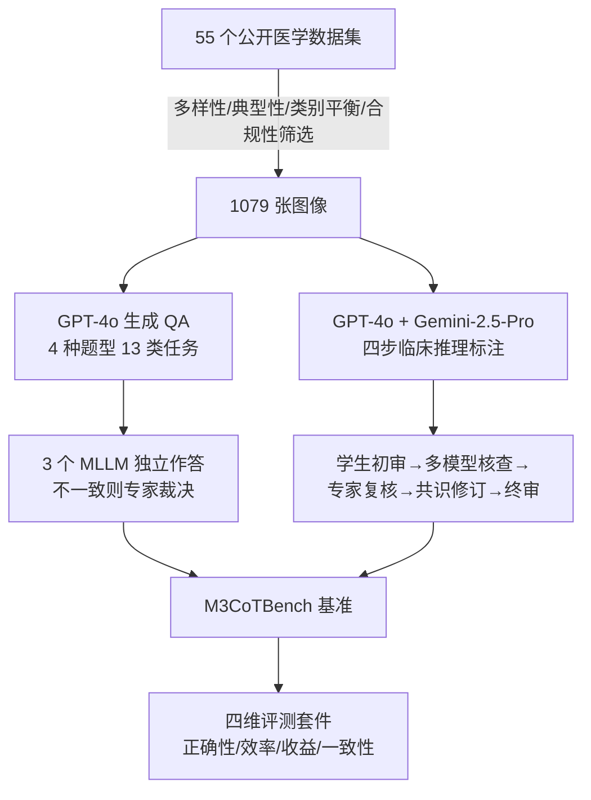

# M3CoTBench: Benchmark Chain-of-Thought of MLLMs in Medical Image Understanding

**会议**: ICLR 2026  
**OpenReview**: [https://openreview.net/forum?id=S7KyLgHqJf](https://openreview.net/forum?id=S7KyLgHqJf)  
**代码/主页**: [https://juntaojianggavin.github.io/projects/M3CoTBench/](https://juntaojianggavin.github.io/projects/M3CoTBench/)  
**领域**: 医学图像理解 / 多模态大模型 / CoT 评测基准  
**关键词**: Medical MLLM, Chain-of-Thought, Benchmark, Medical VQA, Reasoning Evaluation  

## 一句话总结
M3CoTBench 是首个专门评测「医学影像理解中 MLLM 思维链质量」的基准——它不只看最终答案对不对，而是用正确性、效率、收益、一致性四个维度去量化推理路径本身，揭示出当下 MLLM 在临床推理上既不可靠也不可解释，甚至加上 CoT 后准确率反而下降。

## 研究背景与动机

**领域现状**：CoT 推理在 LLM 上被证明能通过逐步中间推理提升问题求解能力，并已扩展到多模态大模型（MLLM）。在医学领域，诊断决策本身就依赖对细微视觉线索的逐步观察与验证，CoT 与临床「先看模态→抓关键特征→下结论→补充分析」的思维流程天然契合，因此医学 MLLM 被寄予厚望。

**现有痛点**：当前所有医学影像理解基准（VQA-RAD、SLAKE、OmniMedVQA、GMAI-MMBench 等）都只评测**最终答案准确率**，完全忽略中间推理路径的质量。这带来一个隐患——两个模型可能给出相同答案，但其中一个走的是完全错误或不可比的推理路径。在高风险的医疗场景里，这种「对结果不对过程」的黑箱推理无法为医生提供可信的判断依据，反而会放大未被察觉的错误、误诊和过度自信的风险。

**核心矛盾**：医学诊断要求**可解释、可复现、可信赖的逐步推理**，而现有评测体系只奖励答案正确，根本没有任何工具去衡量「推理过程本身好不好」。

**本文目标**：构建一个能系统评测医学影像 CoT 推理质量的基准，覆盖多模态、多难度、多任务，并配套专门面向临床推理的多维度指标。

**核心 idea**：**[把推理路径当成一等公民来评测]**——设计一套覆盖 24 种检查类型、13 类任务、4 种题型的医学 VQA 数据集，每条样本都标注与临床工作流对齐的逐步推理金标准，并提出正确性 / 效率 / 收益 / 一致性四个 CoT 专属维度，对通用与医学专用 MLLM 做细粒度诊断。

## 方法详解

### 整体框架
M3CoTBench 的构建分为三段流水线：**图像采集 → QA 标注与校准 → CoT 关键步骤标注与校准**，最后形成一个 1,079 图 / 1,079 QA 的高质量基准，并配一套四维评测套件。整条管线的核心是「LLM 自动生成 + 多 MLLM 交叉核对 + 医学专家最终把关」的人机协同验证，确保每条 QA 与每条推理链都临床可靠。

### 关键设计

**1. 临床对齐的四步 CoT 标注：把医生的诊断认知显式化。** 作者并非凭空设计推理步骤，而是先访谈来自五家医院的临床医生、放射科与超声科专家，归纳出医生的真实工作流，再用三套医学认知理论（假设演绎推理、模式识别、双过程理论）为其背书，最终凝练出四步结构：(1) 确认影像性质（成像模态/检查类型）；(2) 识别关键视觉特征；(3) 得出诊断结论（疾病/器官/组织）；(4) 基于医学知识补充分析（治疗策略、关联症状等）。关键之处在于步骤是**按任务类型条件化**的——模态识别题省去步骤 3、4，纯诊断题省去步骤 4，避免对简单感知任务强加冗余推理。

**2. 人机协同的多阶段校准：用交叉核对换可靠性。** QA 由 GPT-4o 统一生成（把已有 VQA/分类/分割/检测数据集分别改写成单选、多选、判断、简答，并基于原始标签生成「病因/治疗/预测」等推理驱动题），随后让三个不同 MLLM 独立作答，**只要有任一模型答案与初始答案不符，就交由资深医生最终裁决**。CoT 标注同样经历五级流程：学生初审纠正事实/拼写/格式错误并补全缺失 → GPT-4o 自动核查 → 被任一模型标记「可能错误」的步骤送对应模态专家人工复核 → 专家与学生开会做共识裁决 → 专家逐条终审。这套流程是该基准区别于「纯自动生成」基准的质量保证核心。

**3. 四维 CoT 专属评测指标：从结果评测升级到过程评测。** 这是论文的方法学贡献。**正确性**用模型推理步骤集合 $R$ 与专家标注金路径 $\{A_k\}$ 的重叠度计算，因可能存在多条有效参考路径，取重叠最大的 $A_{k^*}$，再算精确率 $\text{Precision}=\frac{1}{N}\sum_i |R^{(i)}\cap A_{k^*}^{(i)}|/|R^{(i)}|$ 与召回率（分母换成 $|A_{k^*}^{(i)}|$），用 F1 综合。**效率**用单位时间正确推理步数 $E=\sum_i |R^{(i)}\cap A_{k^*}^{(i)}|/T_{\text{CoT}}$ 衡量，并定义延迟 $L=T_{\text{CoT}}/T_{\text{direct}}$ 度量 CoT 引入的额外耗时。**收益**直接定义为带推理与不带推理的准确率之差 $I=\text{Acc}_{\text{step}}-\text{Acc}_{\text{direct}}$，正值说明 CoT 有帮助、负值说明反而有害。**一致性**则关注同类任务的推理路径是否结构稳定——把每条推理路径表示为有序的步骤类别序列，用最长公共子序列度量两条路径相似度 $\text{sim}(P,P_i^{(t)})=|\text{LCS}(P,P_i^{(t)})|/\max(|P|,|P_i^{(t)}|)$，先选出与所有路径平均相似度最高的参考路径，再算任务级一致性 $C_{\text{path}}^{(t)}=\frac{1}{N}\sum_i \text{sim}(P^{(t)},P_i^{(t)})$，最后对 13 个任务取均值。四个维度共同刻画了「推理对不对、快不快、值不值、稳不稳」。

## 实验关键数据

### 基准对比

| 数据集 | #Img/#QA | 检查类型 | 任务数 | 题型 | CoT标注 | 评测维度(Corr/Imp/Eff/Cons) |
|--------|----------|----------|--------|------|---------|------------------------------|
| VQA-RAD | 315/3515 | 3 | 8 | 2 | ✗ | ✗✗✗✗ |
| SLAKE | 642/14028 | 3 | 10 | 2 | ✗ | ✗✗✗✗ |
| OmniMedVQA | 118010/127995 | 12 | 5 | 3 | ✗ | ✗✗✗✗ |
| GMAI-MMBench | -/25831 | 38 | 6 | 2 | ✗ | ✗✗✗✗ |
| **M3CoTBench** | **1079/1079** | **24** | **13** | **4** | **✓** | **✓✓✓✓** |

M3CoTBench 是唯一带逐步 CoT 标注且配齐四个推理评测维度的医学基准。

### 主实验（部分代表性模型）

| 模型 | F1(↑) | Acc_direct | Acc_step | I(↑) | E(↑) | L(↓) | C_path(↑) |
|------|-------|-----------|----------|------|------|------|-----------|
| Gemini 2.5 Pro | **66.07** | 60.24 | 60.10 | -0.14 | 0.10 | 1.52 | 82.00 |
| Qwen3-VL-Thinking-30B | 62.15 | 51.95 | 55.47 | **+3.52** | 0.02 | 1.15 | 76.02 |
| GPT-4.1 | 60.76 | 56.77 | 58.11 | +1.34 | 0.17 | 5.08 | 81.31 |
| Qwen3-VL-Instruct-8B | 55.17 | 51.30 | 46.62 | -4.68 | 0.04 | **93.94** | 82.65 |
| GPT-5 | 55.13 | 58.76 | 58.29 | -0.47 | 0.06 | 1.10 | 65.39 |
| Lingshu-32B (医学) | 59.16 | 51.81 | 44.95 | -6.86 | 0.21 | 10.87 | 71.47 |
| LLaVA-Med (医学) | 30.51 | 29.38 | 29.29 | -0.09 | 0.35 | 3.22 | 72.68 |

### 关键发现
- **CoT 在医学影像上经常帮倒忙**：绝大多数模型的 Impact $I$ 为负（如 Lingshu-7B 达 -7.92、HuatuoGPT-Vision -6.95），即加上逐步推理后准确率反而下降。医学诊断更依赖视觉线索而非逻辑推断，CoT 容易引入无关/误导步骤、加剧幻觉或分散对关键特征的注意力。只有 Qwen3-VL-Thinking 系列（推理已内化）取得正收益。
- **闭源不等于推理更好**：闭源模型在 CoT-金标准对齐上没有一致优势。GPT-5 精确率高但召回低，因为它常无视 CoT 指令直接给答案；GPT-4.1 与 Gemini 2.5 Pro 则推理链完整均衡。**遵守 CoT 指令的程度** 才是 CoT 质量的主导因素，而非开闭源。
- **Thinking > Instruct、大模型 > 小模型**：Qwen3-VL-Thinking 始终优于 Instruct 变体；同系列大模型 F1 更高、更不易跳步或推理坍塌。
- **延迟差异巨大**：Instruct 模型加 CoT 后延迟暴增（Qwen3-VL-Instruct-8B 超 90×），而本身就 step-by-step 输出的 Thinking 模型与闭源模型延迟增幅温和。
- **医学专用模型未必更强**：医学 MLLM 在 CoT 对齐上不一定优于通用模型，领域专精不等于高质量推理。
- **错误源于中间步骤**：定性分析发现系统性错误出现在中间推理而非最终预测——表现为「决定性诊断特征验证不充分」「逐步语言化削弱视觉-语言对接」「错误沿推理链累积放大」三类。

## 亮点与洞察
- **评测范式的转变**：从「只评结果」升级到「评过程」，第一次把推理路径质量在医学影像场景下做成可量化的四维指标，填补了医学 CoT 评测的空白。
- **反直觉的结论很有价值**：实证地揭示「CoT 在医学影像理解上常常有害」，并归因到视觉证据在逐步语言化过程中被扭曲/丢失，对盲目堆 CoT 的医学 MLLM 研究是一记警钟。
- **标注质量扎实**：四步推理结构有临床访谈 + 三套认知理论双重背书，五级人机协同校准保证了金标准的可靠性，这是基准能成立的根基。
- **一致性指标设计巧妙**：用 LCS 把推理步骤当有序序列衡量结构稳定性，比把步骤当无序集合的传统做法更贴合「可复现的临床推理」诉求。

## 局限与展望
- **规模偏小**：1,079 图 / 1,079 QA 相比 OmniMedVQA（12.8 万 QA）规模有限，每图仅一条 QA，统计功效和长尾覆盖受限。
- **评测依赖 LLM 裁判**：正确性/一致性用 GPT-4o、LLaMA-3.3-70B、Gemini 2.5 Pro 做评判，裁判模型自身偏差可能传导到分数。
- **金路径的唯一性假设**：虽然允许多条参考路径，但临床真实推理可能更发散，LCS 匹配对合理的「另类正确路径」可能惩罚过重。
- **只诊断不开方**：基准揭示了 CoT 在医学影像上的问题，但未提出如何让 CoT 真正有益（如何抑制视觉信息在语言化中的丢失），留给后续工作。

## 相关工作与启发
- **医学多模态基准**（VQA-RAD、SLAKE、OmniMedVQA、GMAI-MMBench、Med-CMR）：都聚焦答案准确率而缺中间推理标注，本文正是补上这一维度。
- **CoT 多模态基准**（Visual-CoT、M3CoT、MME-CoT、CoMT）：在自然图像上推进了 CoT 评测，MME-CoT 同样发现 CoT 在感知任务上掉点，本文把这一线索专门下沉到医学高风险场景。
- **启发**：CoT 不是「越多越好」的免费午餐，在视觉证据主导、逻辑链条次要的领域，强行逐步语言化可能损害而非提升表现；评测体系应当同时审查「过程」与「结果」，尤其在医疗这类需要可解释、可追溯推理的高风险应用中。

## 评分
- **新颖性**: ⭐⭐⭐⭐ 首个医学影像 CoT 质量评测基准，四维指标（尤其用 LCS 量化推理一致性）有方法学新意，「CoT 在医学影像常有害」的结论具警示价值。
- **实验充分度**: ⭐⭐⭐⭐ 覆盖开源/闭源/医学专用三类共 20+ 个 MLLM，含定量四维分析 + 定性错误归因，结论扎实；扣分在数据规模偏小、依赖 LLM 裁判。
- **写作质量**: ⭐⭐⭐⭐ 动机清晰、流水线与指标定义严谨、findings 分类组织得当，易读。
- **价值**: ⭐⭐⭐⭐ 为临床可信 AI 提供了评测推理过程的工具与反直觉洞察，对医学 MLLM 与多模态 CoT 研究都有直接指导意义。

<!-- RELATED:START -->

## 相关论文

- [\[CVPR 2026\] SurgCoT: Advancing Spatiotemporal Reasoning in Surgical Videos through a Chain-of-Thought Benchmark](../../CVPR2026/medical_imaging/surgcot_advancing_spatiotemporal_reasoning_in_surgical_videos_through_a_chain-of.md)
- [\[ICLR 2026\] Boosting Medical Visual Understanding From Multi-Granular Language Learning](boosting_medical_visual_understanding_from_multi-granular_language_learning.md)
- [\[NeurIPS 2025\] THUNDER: Tile-level Histopathology image UNDERstanding benchmark](../../NeurIPS2025/medical_imaging/thunder_tile-level_histopathology_image_understanding_benchmark.md)
- [\[ICLR 2026\] U2-BENCH: Benchmarking Large Vision-Language Models on Ultrasound Understanding](u2-bench_benchmarking_large_vision-language_models_on_ultrasound_understanding.md)
- [\[ICLR 2026\] Towards Text–Mask Consistency in Medical Image Segmentation](towards_text-mask_consistency_in_medical_image_segmentation.md)

<!-- RELATED:END -->
