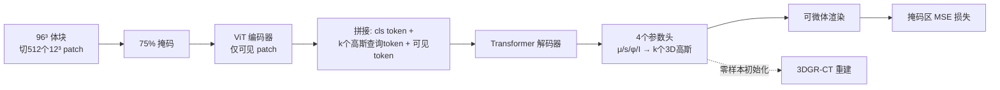

# MedGMAE: Gaussian Masked Autoencoders for Medical Volumetric Representation Learning

**会议**: ICLR 2026  
**OpenReview**: [https://openreview.net/forum?id=Z2XIRLv535](https://openreview.net/forum?id=Z2XIRLv535)  
**代码**: [https://github.com/windrise/MedGMAE](https://github.com/windrise/MedGMAE)  
**领域**: 医学影像 / 自监督表征学习 / 3D Gaussian Splatting  
**关键词**: 掩码自编码器, 3D 高斯基元, 体数据预训练, 零样本初始化, CT 重建  

## 一句话总结
MedGMAE 把 3D 医学影像 MIM 预训练的目标从"重建离散体素强度"换成"预测一组连续的 3D 高斯基元再渲染回体积"，既学到更符合解剖连续性的编码器表征，又让解码器变成可迁移的、能给 3DGS-CT 重建做零样本初始化的"几何先验"。

## 研究背景与动机
- **领域现状**：标注稀缺让 3D 医学影像普遍依赖自监督预训练，掩码图像建模（MIM）因解剖结构高度相似而成为主流，做法是从可见 patch 回归被遮挡区域的体素强度。
- **现有痛点**：作者指出体素级重建有三个被忽视的根本缺陷——(i) **离散重建与解剖连续性冲突**：逐体素回归是"基于局部上下文填空"，擅长贴图纹理却抓不住解剖结构的几何抽象与形状一致性；(ii) **解码器不可迁移**：解码器只为重建低层像素强度而生，预训练后通常被丢弃，零样本能力受限；(iii) **稀疏解剖分布导致参数浪费**：医学体数据里解剖器官只占约 11.8% 空间，稠密体素表示天然冗余。
- **核心矛盾**：MIM 想学到结构化、几何感知的解剖表征，但"逐体素回归"这个代理任务本质鼓励的是局部插值而非全局结构理解，二者方向相悖。
- **本文目标**：用一个既连续、又参数高效、且解码器可复用的中间表示，把预训练目标从"局部重建"升级为"几何推理"。
- **核心 idea**：**用稀疏 3D 高斯基元做中间表示** —— 让模型从稀疏可见 patch 出发预测整套描述整个体积的 3D 高斯参数（位置/尺度/旋转/强度），用连续可微的高斯基元天然编码解剖边界的几何与形状一致性，并让训练好的高斯解码器直接当作 3DGS-CT 重建的零样本初始化器。

## 方法详解

### 整体框架
MedGMAE 沿用 MAE 的非对称 encoder-decoder 骨架：把 96³ 体块切成 512 个 12³ patch、按 75% 比例掩码，ViT 编码器只处理可见 patch；解码器引入 k 个可学习"高斯查询 token"，让它们注意可见 patch 的语义后各自吐出一个 11 维高斯参数；最后用可微体渲染把这 k 个高斯渲染回体积，仅在被掩码区域算 MSE 重建损失。增强版 MedGMAE* 再叠加多级残差块做 coarse-to-fine 的高斯加密，用于重建任务。

### 关键设计

**1. 以 3D 高斯基元替代体素作为重建目标：把"填空"改成"几何推理"。** 每个 3D 高斯由中心位置 $\mu\in\mathbb{R}^3$、协方差 $\Sigma=RSS^TR^T$（拆成尺度向量 $s\in\mathbb{R}^3$ 与旋转四元数 $\phi\in\mathbb{R}^4$）和强度 $I$ 组成，共 11 维 $g=\{\mu,s,\phi,I\}$。任一空间点 $X$ 的强度由邻域高斯按马氏距离衰减叠加得到：$V(X|g_i)=\sum_{i:\|X-\mu_i\|\le d_i} I_i\cdot e^{-\frac{1}{2}(X-\mu_i)^T\Sigma_i^{-1}(X-\mu_i)}$。这种连续、可微的椭球表示天然编码了解剖结构的方向、尺度与边界连续性，使预训练目标从局部插值转向对全局几何的抽象建模，同时只用约 3e5 个参数就表达原本 4e7 体素的体积（99% 参数缩减），与器官稀疏分布天然契合。

**2. 解耦的高斯查询 token：高斯数量与掩码数量彻底分离。** 解码器输入由三部分拼接而成 $X_{dec}=\{\hat x_1\}\cup\{q_j\}_{j=1}^{k}\cup\{\hat x_i\}_{i=2}^{n}$ ——编码器 class token、$k$ 个可学习高斯查询 token、其余可见 token。关键在于 $k$（要预测的高斯个数）可与被掩码 patch 数完全无关地自由设定，从而灵活控制重建粒度。查询 token 通过多头自注意力聚合可见 patch 的空间-语义信息，再经中心头、尺度头、旋转头、强度头四个专用线性头输出参数，并配套激活：位置/强度用 sigmoid 约束到 [0,1]，旋转做 L2 归一化保单位四元数。为稳定训练还定制了偏置初始化（尺度头 bias=-1.386 → sigmoid 后约 0.2，强度头 bias=-0.405 → 约 0.5），让三个空间维度的尺度分布一致。

**3. 仅掩码区域的可微体渲染损失：用渲染回路把几何参数接回监督信号。** 拿到 $k$ 个预测高斯后，可微渲染器在目标体积网格上累加各高斯贡献重建出体积，再仅对原本被掩码的区域与真值算 MSE。这样既保证监督只来自被遮挡处（迫使模型"推理"而非"复制"可见区），又通过局部聚合（只算影响半径 $d_i$ 内的高斯）让大尺度医学体积的可微渲染在计算上可行。

**4. MedGMAE* 多级残差：coarse-to-fine 加密以服务高精度重建。** 在 $l\in\{0,1,2\}$ 三个层级上，Level 0 是 $N_0$ 个基高斯，Level 1/2 分别扩到 $m_1N_0$、$m_2N_0$ 个，相邻层之间建立参数依赖。尺度强制单调收缩 $s_l=s_0+\hat s_l\cdot\sigma_{scale}-\Delta s_l$（$\sigma_{scale}=0.1$，$\Delta s_1=0.02,\Delta s_2=0.05$），位置/强度/旋转则以残差形式细化（如 $\mu_l=\mu_0+\hat\mu_l\cdot\sigma_\mu$，旋转再归一化），所有残差头用 tanh 限幅。这套层级加密让粗层管整体形状、细层补纹理细节，在 CT 重建里显著提升对细粒度结构的刻画。

**5. 解码器作为零样本几何先验初始化 3DGR-CT 重建。** 因为预训练学到的就是描述真实解剖的高斯参数，训练好的高斯解码器可直接对 FBP 初重建做零样本推理，输出的高斯点云作为 3DGR-CT 重建的初始化，把原本随机/启发式初始化替换为携带解剖先验的初始化，从而把自监督预训练与下游 CT 重建实际打通。

## 实验关键数据

预训练用 AbdomenAtlas1.0Mini（5195 例 CT），下游用 UNETR 作骨架在分割/分类/配准/重建四类任务上评测。

### 主实验表格

分割（DSC%，4 数据集 × 1%/10%/100% 数据量，节选 1% 低数据场景）：

| 方法 | AMOS 1% | FLARE'22 1% | BTCV 1% | SegTHOR 1% |
|------|---------|-------------|---------|------------|
| 从头训 SwinUNETR | 28.94 | 35.89 | 27.71 | 44.82 |
| MAE | 54.67 | 62.35 | — | 66.72 |
| HySparK | 34.50 | 37.54 | 35.81 | 58.81 |
| VoCo（前 SOTA） | 55.81 | 57.66 | **73.20** | 67.12 |
| **MedGMAE** | **58.79** | **62.72** | 66.19 | **70.92** |

1% 数据下 MedGMAE 在 AMOS / FLARE'22 比 VoCo 高 2.98% / 5.06%，对从头训基线提升达 20–35%。

分类（CT-RATE，AUC%）与配准（DSC%）：

| 任务 | 指标 | 前最优 | MedGMAE |
|------|------|--------|---------|
| 分类 CT-RATE | AUC | SUP 76.04 | **76.40** |
| 配准 IXI | DSC | VoCo 73.6 | **73.7** |
| 配准 OASIS | DSC | VoCo 84.4 | **85.7** |

IXI/OASIS 均为预训练未见过的 MRI 模态，佐证跨模态泛化。

CT 重建零样本初始化（AAPM-Mayo，节选 120 projections）：

| 方法 | 时间(min) | iter(P=35) | PSNR(full) | SSIM(full) |
|------|-----------|-----------|------------|------------|
| 3DGR（原始） | 507±47.8 | 1660 | 45.2 | 98.7 |
| MedGMAE 初始化 | 357±22.0 | 1040 | **46.2** | 98.5 |
| MedGMAE* 初始化 | 335±20.4 | **920** | 45.8 | **98.7** |

整体训练时间缩短 31–37%，达到 PSNR=35 / SSIM=90% 所需迭代平均减少 39.4% / 28.1%，平均 1.39× 加速，t 检验 p<0.001。

### 消融实验表格

代理任务消融（DSC%，对比体素 SSL vs 高斯 SSL）：

| 代理任务 | AMOS | FLARE'22 | SegTHOR |
|----------|------|----------|---------|
| 无（从头训） | 77.02 | 70.81 | 85.82 |
| Voxel SSL | 83.61 | 82.56 | 88.52 |
| **Gaussian SSL** | **84.90** | **83.77** | **89.15** |

### 关键发现
- 体素 SSL 相对从头训提升 6–12%，而把代理任务换成高斯重建再额外提升 1–2%，直接验证"高斯表示优于体素重建"这一核心假设。
- 增益在低数据（1%）场景最显著，说明几何先验对标注稀缺最有价值。
- 高斯解码器不再是"用完即弃"，作为零样本初始化器实打实加速了下游 CT 重建，且不牺牲最终质量。

## 亮点与洞察
- **把"中间表示"当成第一性问题**：不在掩码策略/架构上做增量，而是直接换掉重建目标本身——用连续高斯基元对齐解剖连续性，这是对 MIM 代理任务的一次范式级反思。
- **一鱼两吃的解码器**：同一个预训练解码器既给编码器迁移服务，又能零样本初始化 3DGS-CT 重建，解决了体素 MIM 里"解码器被丢弃"的浪费。
- **稀疏性即先验**：抓住"器官仅占 11.8% 空间"这一医学体数据特性，让高斯的稀疏天性变成 99% 的参数效率优势。
- **k 与掩码解耦**这一设计细节很关键，使重建粒度可调，也为 coarse-to-fine 扩展留出空间。

## 局限与展望
- CT 重建结果受 FBP 初重建噪声影响，作者建议用多视角 3D 高斯基础模型来缓解。
- 实验集中在 CT（预训练）+ 少量 MRI 配准，更多模态/任务（如 PET、超声）的普适性仍待验证。
- 高斯个数 $k$、影响半径 $d_i$ 等超参对渲染质量与计算开销的权衡未做系统分析。
- 零样本初始化只在 3DGR-CT 一类重建上验证，能否迁移到其他 3DGS 医学重建管线尚不清楚。

## 相关工作与启发
- **MIM 谱系**：MAE 用 25% 可见 patch + 轻量解码器开创高效预训练，医学侧 Models Genesis、HySparK、VoCo 等在掩码与架构上各有变体，但都被"体素级重建"目标锁死；本文给出"不改架构改目标"的另一条路。
- **3DGS 医学应用**：3D Gaussian Splatting 已用于 CT/冠脉/4D-CT 重建；2D 的 GMAE 用高斯 z 轴推断 2.5D 层做空间理解，而本文是用真 3D 高斯整体表示真实解剖体积，动机与对象都不同。
- **启发**：当一个自监督代理任务的"重建目标"与领域结构先验冲突时，与其堆掩码/架构 trick，不如换一个与领域几何对齐的连续中间表示——同时让解码器从"一次性"变成"可复用先验"。

## 评分
- **新颖性**: ⭐⭐⭐⭐ 把 3D 高斯基元引入医学 MIM 作为重建目标、并让解码器复用做零样本重建初始化，思路清晰且切中体素 MIM 的真实痛点。
- **实验充分度**: ⭐⭐⭐⭐ 覆盖分割/分类/配准/重建四类任务、十余个 SSL 基线、多数据量，且含跨模态泛化与统计显著性；消融较简洁但直指核心。
- **写作质量**: ⭐⭐⭐⭐ 动机三点对应方法三优势，结构工整、图表清楚，个别公式与表述有小笔误。
- **价值**: ⭐⭐⭐⭐ 为医学影像预训练提供了"几何中间表示 + 可迁移解码器"的新框架，实用性（加速 CT 重建）与表征质量兼得。

<!-- RELATED:START -->

## 相关论文

- [\[CVPR 2026\] Masked-Diffusion Autoencoders for 3D Medical Vision Representation Learning](../../CVPR2026/medical_imaging/masked-diffusion_autoencoders_for_3d_medical_vision_representation_learning.md)
- [\[AAAI 2026\] Multivariate Gaussian Representation Learning for Medical Action Evaluation](../../AAAI2026/medical_imaging/multivariate_gaussian_representation_learning_for_medical_action_evaluation.md)
- [\[ICLR 2026\] Frequency-Balanced Retinal Representation Learning with Mutual Information Regularization](frequency-balanced_retinal_representation_learning_with_mutual_information_regul.md)
- [\[ICLR 2026\] Anatomy-aware Representation Learning for Medical Ultrasound](anatomy-aware_representation_learning_for_medical_ultrasound.md)
- [\[CVPR 2026\] GaussianPile: A Unified Sparse Gaussian Splatting Framework for Slice-based Volumetric Reconstruction](../../CVPR2026/medical_imaging/gaussianpile_a_unified_sparse_gaussian_splatting_framework_for_slice-based_volum.md)

<!-- RELATED:END -->
