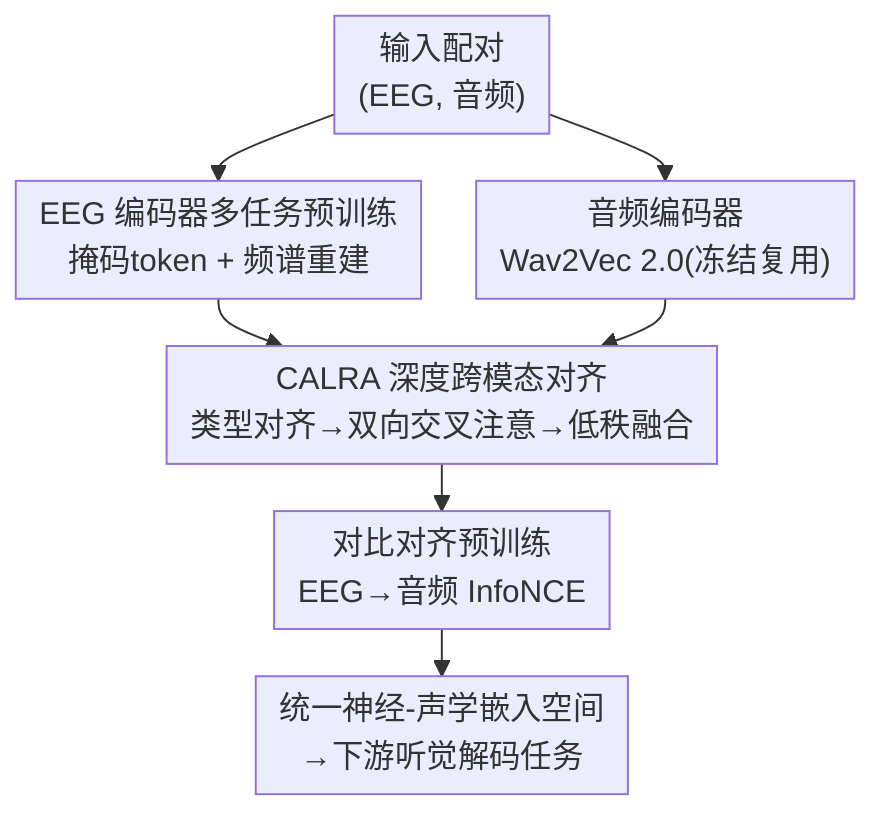

# MindMix: A Multimodal Foundation Model for Auditory Perception Decoding via Deep Neural-Acoustic Alignment

**会议**: ICLR 2026  
**OpenReview**: [https://openreview.net/forum?id=1ifQzlETeG](https://openreview.net/forum?id=1ifQzlETeG)  
**代码**: https://github.com/CookieMikeLiu/MindMix  
**领域**: 医学图像 / 脑机接口 / 多模态对齐  
**关键词**: EEG 解码, 听觉感知, 神经-声学对齐, 基础模型, 对比学习

## 一句话总结
MindMix 用「先在 3500+ 小时无标签 EEG 上预训练一个高容量脑电编码器、再用 100+ 小时 EEG-音频配对数据通过 CALRA 跨模态对齐模块做对比学习」的两阶段策略，造出第一个面向听觉感知解码的多模态基础模型，在听觉注意力解码、情绪识别、音乐检索三类任务上大幅超越现有单模态 EEG 基础模型与任务专用 SOTA（KUL 上准确率 99.82%）。

## 研究背景与动机
**领域现状**：从非侵入式 EEG 解码人脑的听觉体验（听谁说话、情绪、听的是哪段音乐）是认知神经科学和脑机接口（BCI）的核心目标。最近一波 EEG 基础模型（EEGPT、LaBraM、HEAR、CBraMod）通过在海量无标签脑电上做自监督预训练，学到了可跨任务、跨被试迁移的通用神经表征，被寄望于推动听觉解码。

**现有痛点**：这些基础模型几乎都是「单模态」的——只在 EEG 信号上预训练，从没见过对应的声学刺激。结果它们学到的表征并没有被优化成与声音的内在结构对齐。论文实测发现一个尴尬现象：强大的 LaBraM、CBraMod 在听觉注意力解码（KUL）上只有 63.30%、68.42%，反而被任务专用的 DARNet（94.81%）远远甩开。原因是这些基础模型大多在非听觉任务（运动想象、癫痫检测、睡眠分期）上预训练，通用表征对听觉解码并不对路，而且对数据格式/预处理极其敏感。

**核心矛盾**：单模态 EEG 基础模型的表征空间与声学信息的结构是脱节的；而少数任务专用的多模态方法（MusicAAD、AADNet）虽然引入了音频，提升却很有限——因为它们只做了浅层的投影式对齐（CLIP 式的线性点积），无法刻画 EEG↔音频之间低信噪比、高度非线性的映射关系，也没有区分语音 vs 音乐这类异质刺激下截然不同的神经响应模式。

**本文目标**：(1) 造一个真正"见过"声音的高容量 EEG 编码器；(2) 设计一个能做细粒度、深度跨模态交互的对齐模块，而不是浅层投影；(3) 让二者在配对数据上端到端对齐，得到一个可迁移到多种听觉解码任务的统一表征空间。

**切入角度**：作者观察到「简单地把两个模态拼在一起还不够，关键在深度对齐」。要在共享嵌入空间里把对应的 EEG-音频对拉近、不对应的推远，就必须让两个模态在对比损失之前先充分交互。

**核心 idea**：用「高容量 EEG 编码器 + CALRA 深度跨模态对齐 + 对比学习」三件套，把单模态 EEG 基础模型和任务专用解码器之间的鸿沟补上，学到一个深度对齐的神经-声学表征。

## 方法详解

### 整体框架
MindMix 是一个双流多模态基础模型。给定一对输入 $(S_{EEG}, S_{Audio})$，两个模态专用编码器分别产出初始嵌入 $(E_{proj}, A_{proj})$；这两个嵌入送入核心创新模块 **CALRA**，在听觉类型（语音 / 音乐）条件下做深度交互，输出最终对齐嵌入 $(E_{aligned}, A_{aligned})$；整个框架用对比损失 $L_{CL}$ 端到端优化，把真实配对拉近、batch 内非配对推远。

训练分三阶段：① 单模态预训练——EEG 编码器在 3564 小时通用脑电上用多任务自监督从零训练；② 多模态对齐——在 109 小时 EEG-音频配对数据上通过 CALRA 学神经-声学映射；③ 下游微调——在 held-out 的听觉任务数据集上微调评测。音频侧直接复用预训练好的 Wav2Vec 2.0（脚手架，非本文创新）。

### 关键设计

**1. 高容量 EEG 编码器与多任务自监督预训练：让脑电编码器从零学到鲁棒的神经动态**

EEG 信号有两个老大难：被试间差异大、各数据集电极通道数不一致（论文中从 8 通道到 255 通道都有）。为此编码器采用**通道独立分块**——把 $S_{EEG} \in \mathbb{R}^{C \times T}$ 按通道独立切成 $K$ 个定长时间片，经 1D 时间卷积得到初始嵌入 $\tilde{X}$，再用一个共享码本把它量化成离散神经 token $v \in V$。最终输入嵌入由三项相加构成：

$$E_{patch} = v + T + E$$

其中 $T$ 是可学习的时间位置嵌入（标记片在 epoch 内的相对位置 1～$K$），$E$ 是空间嵌入——一张把标准 10-20 电极名（如 'Cz'、'Pz'）映射到向量的查找表，使模型无论通道数怎么变都能分辨每个片的解剖来源。

这一阶段的真正创新是**两个并行自监督任务**。主分支做**掩码 token 预测**：随机遮住部分片，用主 Transformer 从可见片预测被遮片的原始神经 token，

$$L_M = -\sum_{j \in M} \log p(v_j \mid \tilde{X}_{visible})$$

辅分支做**频谱重建**：用一个较小的 Transformer 重建原始片的傅里叶频谱（幅度 $A$、相位 $\psi$），

$$L_S = \mathbb{E}_j\left[\|\tilde{A}_j - A_j\|^2 + \|\tilde{\psi}_j - \psi_j\|\right]$$

总预训练损失是这两项（外加量化损失 $L_Q$）的加权和。掩码任务的主 Transformer 充当 $f_{EEG}$ 主干，对输出序列做均值池化再投影，得到初始 EEG 嵌入 $E_{proj}$。频谱重建强制编码器保留时频细节、掩码预测强制它学上下文语义，二者互补，使表征在噪声大、跨被试的脑电上更鲁棒——这也是为什么后面消融里换成现成的 LaBraM/CBraMod 主干都打不过它。

**2. CALRA：refine-then-contrast 的深度跨模态对齐**

CALRA（Cross-Attention Low-Rank Alignment）针对的痛点是：标准 CLIP 式的浅层投影在 EEG-音频这种低信噪比、强非线性、还分语音/音乐异质刺激的场景下根本不够；而早融合（拼接）虽能建模交互，却破坏了高效检索所需的双流结构。CALRA 的策略是「先精炼再对比」——在算对比损失之前，先把上下文感知的深度交互注入到嵌入里。它由三个协同子组件组成：

- **类型专属对齐器（Type-specific Aligner）**：神经响应对语音和音乐差异巨大，于是按听觉类型标签 $k$ 用一个可学习变换 $f_k$ 给初始投影选路，$(E'_{proj}, A'_{proj}) = f_k(E_{proj}, A_{proj})$，让模型对不同刺激类型采用各自最优的对齐策略。
- **双向交叉注意（Bi-directional Cross-Attention）**：在全局投影向量上让两模态互相检索补充信息，$E'_{interacted} = \text{MHA}(Q_E, K_A, V_A)$、$A'_{interacted} = \text{MHA}(Q_A, K_E, V_E)$ 同时进行，配残差与 LayerNorm，得到 $h_E, h_A$。它做的是整体对齐而非局部 token 匹配。
- **共享低秩对齐（Shared Low-Rank Alignment）**：把 $h_E, h_A$ 投到共享瓶颈，用逐元素乘 $\odot$ 强制**双线性交互**：

$$E_{feedback} = W_{D,eeg}\big(H_{shared}(W_{U,eeg}(h_E) \odot W_{U,audio}(h_A))\big)$$

最终对齐嵌入经残差整合：$E_{aligned} = \text{LayerNorm}(h_E + E_{feedback})$（音频侧对称）。这个低秩结构高效近似了昂贵的张量融合，能捕捉简单线性组合抓不住的乘性特征交互。作者特别澄清：这和 LoRA 那种「低秩矩阵做加性权重适配」完全不同，CALRA 的低秩是用来建模多模态特征的联合分布。

三个子组件叠加，使 CALRA 成为一个「对比损失之前的全局表征精炼步骤」——它增强嵌入本身而不动损失机制，因此既保留了标准对比学习的训练稳定性，又补上了浅层投影缺失的深度依赖。

**3. EEG→音频方向的对比对齐预训练：用单向 InfoNCE 稳住一对多映射**

最终对齐嵌入用 CLIP 式对比目标优化，对每个 EEG 嵌入，要在 mini-batch 内从所有音频里找出正确的对应：

$$L_{CL} = -\frac{1}{N}\sum_{i=1}^{N} \log \frac{\exp(\text{sim}(E_{aligned,i}, A_{aligned,i})/\tau)}{\sum_{j=1}^{N}\exp(\text{sim}(E_{aligned,i}, A_{aligned,j})/\tau)}$$

$\text{sim}$ 是余弦相似度，$\tau$ 是可学习温度。作者刻意选 **EEG→音频** 这个有向方向，理由很具体：它直接对应下游解码任务的方向，而且避免了「一个音频刺激对应许多种可能神经响应」带来的一对多对齐不稳定。最小化该目标会联合训练 $f_{EEG}$、$f_{Audio}$、CALRA 三者，逼出一个神经活动与听觉内容语义对齐的嵌入空间。

### 损失函数 / 训练策略
预训练总损失 = 掩码 token 预测 $L_M$ + 频谱重建 $L_S$ + 量化损失 $L_Q$ 的加权和（阶段一）；多模态对齐阶段用 InfoNCE 对比损失 $L_{CL}$ 端到端优化整个框架（阶段二）。所有下游数据集都从前两阶段严格 held-out。评测用被试内 5 折交叉验证（70%/10%/20% 划分），且采用更保守的窗口级指标（每 2 秒片段算准确率）而非聚合的 trial 级；对语音 AAD 还额外引入「跨 trial」严格协议，训练/测试段来自不相交的 trial，排除时间相关性导致的数据泄漏。

## 实验关键数据

### 主实验
覆盖三类听觉解码任务、六个数据集，对比任务专用 SOTA（DBPNet、DARNet、MusicAAD、AADNet）与单模态 EEG 基础模型（EEGPT、LaBraM、CBraMod、BIOT、BENDR）。

| 任务 | 数据集 | 指标 | MindMix | 之前最好 | 提升 |
|------|--------|------|---------|----------|------|
| 语音 AAD | KUL | Balanced Acc. | 0.9982 | 0.9481 (DARNet) | +5.0pt |
| 语音 AAD | DTU | Balanced Acc. | 0.9993 | 0.8456 (MusicAAD) | +15.4pt |
| 语音 AAD | ESAA | Balanced Acc. | 1.0000 | 0.9089 (DARNet) | +9.1pt |
| 情绪分析 | PME4 | Balanced Acc. | 0.7256 | 0.6142 (MusicAAD) | +11.1pt |
| 情绪分析 | HR-EEG4EMO | Balanced Acc. | 0.8878 | 0.8274 (DBPNet) | +6.0pt |
| 音乐检索 | MAD-EEG | Duo Acc. | 0.9475 | 0.9425 (MusicAAD) | +0.5pt |

两个关键观察：① 单模态 EEG 基础模型（LaBraM 63.30%、CBraMod 68.42% on KUL）普遍打不过任务专用模型（DARNet 94.81%），暴露出「在非听觉任务上预训练 → 听觉表征次优」的硬伤；② 同为多模态的 MusicAAD/AADNet 相比单模态对手提升有限，反衬出 MindMix 99.82% 的飞跃来自**深度对齐**而非简单的模态相加。

### 消融实验
在 HR-EEG4EMO（情绪）与 KUL（AAD）上系统消融。

| 配置 | Emotion Acc. | AAD Acc. | 说明 |
|------|-------------|----------|------|
| MindMix (Full) | 0.8878 | 0.9982 | 完整模型 |
| w/ Co-Attention | 0.8629 | 0.9785 | CALRA 换成普通共注意力 |
| w/ Concat-MLP | 0.8574 | 0.9593 | 换成拼接融合 |
| w/o Alignment (CLIP) | 0.8483 | 0.9535 | 退回 CLIP 式浅层投影 |
| w/ LaBraM 主干 | 0.8588 | 0.9744 | EEG 编码器换 LaBraM |
| w/ CBraMod 主干 | 0.8642 | 0.9637 | EEG 编码器换 CBraMod |
| w/ EEGNet 主干 | 0.8555 | 0.9442 | EEG 编码器换 EEGNet |
| w/ Mel-spectrogram | 0.8432 | 0.9448 | 音频换 Mel 频谱（掉 5.45pt AAD） |
| w/o Cross-Attention | 0.8482 | 0.9435 | 去掉双向交叉注意（掉 5.58pt AAD） |
| w/o Shared Low-Rank | 0.8557 | 0.9742 | 去掉共享低秩融合 |
| w/o Type-specific Aligner | 0.8675 | 0.9853 | 去掉类型对齐器 |

### 关键发现
- **双向交叉注意是 CALRA 里最关键的部件**：去掉它 AAD 掉 5.58pt，是三个子组件中掉点最多的；共享低秩对齐次之，类型对齐器贡献相对最小但仍有用。
- **深度对齐 >> 简单融合**：CLIP 式浅投影、Concat-MLP、Co-Attention 都明显不如 CALRA 的乘性双线性融合（如 EEG4EMO 上 0.8878 vs 0.8574），证实乘性交互能抓到拼接抓不到的跨模态依赖。
- **自定义 EEG 编码器不可替代**：即便把强大的 CBraMod 主干接上 CALRA 一起对齐训练，KUL 上也只有 96.37%，仍落后完整 MindMix 的 99.82%；两侧都需要丰富的预训练表征——音频换成传统 Mel 频谱会直接掉 5.45pt。
- **稳健性验证**：在更严格的「跨 trial」协议下绝对准确率虽如预期下降，但 MindMix 仍保持领先，说明优势来自真正的神经-声学对齐而非利用了 trial 特有的伪影。

## 亮点与洞察
- **"refine-then-contrast" 范式很巧**：不动对比损失、只在损失前精炼嵌入本身，既保留了 CLIP 训练的稳定性，又注入了深度跨模态交互——这种"在对齐前先让两模态充分对话"的思路可迁移到任何双流检索式多模态对齐任务。
- **用频谱重建 + 掩码预测双任务做 EEG 自监督**：频谱分支强制保留时频信息、掩码分支强制学上下文，针对脑电低信噪比的特点是很对症的组合，比单纯掩码建模更鲁棒。
- **单向对比方向的论证有意思**：选 EEG→音频 而非双向，理由是规避「一个音频对多种神经响应」的一对多不稳定，并对齐下游任务方向——这是把领域先验写进损失设计的好例子。
- **通道独立分块 + 10-20 电极查找表**优雅解决了跨数据集通道数不一致（8～255 通道）的工程难题，让一个编码器吃下异质电极配置。

## 局限与展望
- **近乎饱和的准确率值得警惕**：KUL 99.82%、ESAA/DTU 接近 100%，在被试内窗口级评测下逼近天花板，可能触及数据集本身的难度上限；虽然作者用跨 trial 协议做了稳健性补充，但主表的极高数字更多反映被试内设定相对容易，跨被试泛化能力仍需更多验证。
- **评测限于被试内（within-subject）5 折**：BCI 真正的难点是跨被试/跨设备的零样本迁移，论文主结果没有正面回答这一点。
- **类型对齐器依赖刺激类型标签**：需要预先知道当前听的是语音还是音乐，开放场景下若类型未知或混合，路由机制如何退化未充分讨论。
- **改进思路**：把类型对齐器从硬标签路由改成软门控/自动推断刺激类型；在跨被试协议下重训练并报告，验证统一嵌入空间的真实迁移力。

## 相关工作与启发
- **vs 单模态 EEG 基础模型（EEGPT / LaBraM / CBraMod）**：它们只在 EEG 上自监督预训练、从没见过音频，表征与声学结构脱节，听觉解码上反被任务专用模型甩开；MindMix 在预训练就引入 EEG-音频配对，学到共享对齐空间，这是性能飞跃的根因。
- **vs 任务专用多模态方法（MusicAAD / AADNet）**：它们也用了音频但只做浅层融合，相比单模态提升有限；MindMix 的 CALRA 用双向交叉注意 + 低秩双线性融合做深度对齐，差距被显著拉开。
- **vs 标准 CLIP 对齐**：CLIP 靠浅层线性点积，无法刻画 EEG-音频的非线性高噪声映射；CALRA 在对比前注入上下文感知交互，是"refine-then-contrast"而非直接对比原始投影。
- **vs LoRA 等低秩适配**：同样用低秩，但 LoRA 是加性权重适配，CALRA 的低秩是为建模多模态特征的联合分布（乘性融合），动机与作用完全不同。

## 评分
- 新颖性: ⭐⭐⭐⭐⭐ 首个面向听觉感知解码的多模态 EEG 基础模型，CALRA 的"refine-then-contrast"+ 低秩双线性融合设计有创见。
- 实验充分度: ⭐⭐⭐⭐ 三任务六数据集 + 细致消融（对齐/编码器/子组件三层），但主结果限被试内且数字近饱和，缺跨被试泛化。
- 写作质量: ⭐⭐⭐⭐ 动机—痛点—设计逻辑清晰，公式与组件对应明确，刺激类型路由部分可再展开。
- 价值: ⭐⭐⭐⭐⭐ 把 EEG 基础模型从单模态推向神经-声学对齐，为听觉脑机接口提供了可迁移的统一表征基座。

<!-- RELATED:START -->

## 相关论文

- [\[ICLR 2026\] Neuro-Symbolic Decoding of Neural Activity](neuro-symbolic_decoding_of_neural_activity.md)
- [\[CVPR 2026\] LEMON: A Large Endoscopic MONocular Dataset and Foundation Model for Perception in Surgical Settings](../../CVPR2026/medical_imaging/lemon_a_large_endoscopic_monocular_dataset_and_foundation_model_for_perception_in.md)
- [\[NeurIPS 2025\] NeurIPT: Foundation Model for Neural Interfaces](../../NeurIPS2025/medical_imaging/neuript_foundation_model_for_neural_interfaces.md)
- [\[ICLR 2026\] Autoregressive Visual Decoding from EEG Signals](autoregressive_visual_decoding_from_eeg_signals.md)
- [\[ICLR 2026\] Bridging Radiology and Pathology Foundation Models via Concept-Based Multimodal Co-Adaptation](bridging_radiology_and_pathology_foundation_models_via_concept-based_multimodal_.md)

<!-- RELATED:END -->
