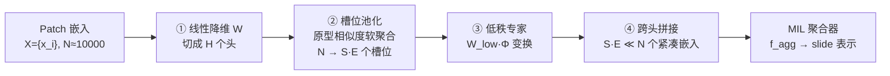

# Mixture of Mini Experts: Overcoming the Linear Layer Bottleneck in Multiple Instance Learning

**会议**: ICLR 2026  
**OpenReview**: [https://openreview.net/forum?id=S5Io33pc78](https://openreview.net/forum?id=S5Io33pc78)  
**代码**: [https://github.com/mahmoodlab/mammoth](https://github.com/mahmoodlab/mammoth)  
**领域**: 计算病理 / 全切片图像分类 / 多示例学习  
**关键词**: Multiple Instance Learning, Mixture of Experts, Computational Pathology, Whole-Slide Image, Soft Routing, Low-Rank  

## 一句话总结
本文指出多示例学习(MIL)流程里那个一直被忽视的"任务特定线性层"才是性能瓶颈，提出即插即用的多头软路由 MoE 模块 MAMMOTH 替换它，在不增加参数量的前提下，让任意 MIL 模型(哪怕是 max/mean pooling)都获得显著提升。

## 研究背景与动机
**领域现状**：在计算病理(CPath)里，吉像素级全切片图像(WSI, 单张约 10000 个 patch)的分类几乎都用 MIL 三段式流程完成：① patch 编码器提取通用特征 → ② 一个线性层把通用特征变成任务特定特征 → ③ 聚合成 slide 级表示做分类。学界在第一步(病理基础模型 UNI/Virchow)和第三步(ABMIL/CLAM/TransMIL 等聚合架构)上投入了海量精力。

**现有痛点**：唯独第二步——那个把通用特征转成任务特征的线性层——几乎无人碰过。绝大多数 MIL 模型对所有 patch 用**同一个**线性变换，不管这个 patch 是上皮细胞、间质还是淋巴细胞。可乳腺癌分型恰恰需要同时区分上皮形态、空间排布、间质结构等多种截然不同的形态学概念。一个共享线性层只能把 patch 压成一个**连续模糊**的嵌入空间(Fig.1A)，下游聚合很难再把这些概念拆开。

**核心矛盾**：直觉上应该用 MoE——一堆专家各管一类形态——来替换它。但 MoE 标准做法(稀疏硬路由)在 CPath 里水土不服：patch 数量极大(≈10000)而训练样本极少(<1000 病例)，硬分配会导致训练不稳定、专家利用不均、参数膨胀引发过拟合。

**本文目标**：设计一个能替换该线性层、**参数量持平**、且能即插即用进任何 MIL 模型的 MoE 模块。

**核心 idea**：**用软路由 + 多头 + 低秩 + 槽位池化**，让每个专家处理"全体 patch 的一个加权组合"而非硬分配某些 patch，从而既得到形态学专精，又保住训练稳定性和参数预算。

## 方法详解

### 整体框架
MAMMOTH(MAtrix-factorized Mixture Module of transformation Heads)直接顶替 MIL 里的 $f_{\text{MIL}}^{\text{linear}}$，把原本 $x_{\text{WSI}} = f_{\text{MIL}}^{\text{agg.}}(\{f_{\text{MIL}}^{\text{linear}}(x_i)\})$ 中的线性层换成一条流水线：先把每个 patch 嵌入切成多个头并行处理，每个头内用基于原型相似度的"槽位池化"把上万 patch 软聚合成少量槽位，再让低秩专家对每个槽位做专精变换，最后跨头拼接，输出一个**比输入小 25 倍以上**的紧凑嵌入集喂给后续聚合器。

### 关键设计

**1. 多头切分输入：在病理大维度嵌入上做细粒度专精。** 病理基础模型的 patch 嵌入维度很大(>1024)，远超自然图像 token(196/256)。MAMMOTH 先用一个线性层 $W \in \mathbb{R}^{(P\cdot H)\times D}$ 把嵌入压缩，再切成 $H$ 个互不重叠的分区，第 $h$ 个分区为 $\bar{x}_{i,h} = (Wx_i)[(h-1)P+1 : hP] \in \mathbb{R}^P$，每个分区交给一套独立的 MoE 处理。这与 Multihead MoE(把分区展平成 $N\cdot H$ 个嵌入再共享专家池)不同——MAMMOTH 让每个头有自己专属的专家池，从而对嵌入子空间有更细粒度的控制，也天然消化了超大嵌入维度。消融显示把 $H{=}16$ 退化成 $H{=}1$ 会掉 5.4%。

**2. 槽位池化实现软专家分配：让每个 patch 都贡献给每个专家。** 这是绕开硬路由不稳定的关键。对专家 $k$，维护 $S$ 个可训练随机初始化的原型 $\{s_j^{(k)}\}$，每个原型代表一种形态学概念。输入嵌入与原型做内积后在 $N$ 个 patch 上做 softmax，得到相似度 $\alpha_{j,i}^{(k)} = \frac{\exp(\langle \bar{x}_i, s_j^{(k)}\rangle)}{\sum_{i'}\exp(\langle \bar{x}_{i'}, s_j^{(k)}\rangle)}$，再加权平均得到槽位嵌入 $u_j^{(k)} = \sum_{i=1}^{N}\alpha_{j,i}^{(k)}\cdot\bar{x}_i$。因为所有 $\alpha$ 非零，每个 patch 都对每个槽位(进而每个专家)有贡献——这就是"软分配"，梯度流顺畅、专家利用均衡，且每个加权平均本身就是 WSI 里某种形态学特征的"摘要"。

**3. 低秩专家保持参数预算不变：用矩阵分解换专家数量自由。** 标准 MoE 用稠密矩阵 $W_{\text{full}}^{(k)}$ 处理槽位嵌入，参数随专家数线性膨胀。MAMMOTH 把它近似成"专家专属的小矩阵 $W_{\text{low}}^{(k)} \in \mathbb{R}^{(D'/H)\times Q}$ × 全专家共享的 $\Phi \in \mathbb{R}^{Q\times P}$"，输出 $z_j^{(k)} = \text{LayerNorm}(\text{ReLU}(W_{\text{low}}^{(k)}\cdot\Phi u_j^{(k)}))$。低秩分解 $W_{\text{full}}^{(k)} \simeq W_{\text{low}}^{(k)}\cdot\Phi$ 加上权重共享，使它能塞进 $E{=}30$ 个专家却仍把可训练参数压到与原线性层持平。消融里改用稠密变换反而掉 3.6%。

**4. 压缩输出集替代逐 patch 更新：像原型聚合一样稳定训练。** Soft MoE 的输出会还原成 $N$ 个更新后的 patch 嵌入；MAMMOTH 则把跨头拼接后的 $z_j^{(k)} = \text{Concat}([z_{j,1}^{(k)},\dots,z_{j,H}^{(k)}]) \in \mathbb{R}^{D'}$ 直接当作最终集合 $\{z_j^{(k)}\}_{j,k=1}^{S\cdot E}$，且 $S\cdot E \ll N$。这把上万 noisy patch 蒸馏成几百个有代表性的形态学聚合体，喂给聚合器时大幅简化了聚合步骤、稳定了训练，类似 prototype-based 方法。消融里换回逐 patch 输出会掉 4.7%。

## 实验关键数据
覆盖 **8 种 MIL 方法 × 19 个分类/生存任务**(组织分型 6 + 分子标志物 13 + 生存 4)，编码器用 UNI，超参 $E{=}30, H{=}16, S{=}9$。

### 主实验表格(组织分型，Balanced acc. / AUROC / Weighted κ)

| 任务 (类别数) | ABMIL Base→+Ours | CLAM Base→+Ours | Mean Base→+Ours | 8法均值 ∆ |
|---|---|---|---|---|
| BRACS-C (C=3) | 67.1→72.7 | 56.2→73.4 | 65.1→72.4 | **+7.60** |
| BRACS-F (C=7) | 42.8→46.1 | 32.3→46.8 | 33.7→43.6 | **+6.49** |
| EBRAINS-C (C=12) | 86.1→90.0 | 87.9→91.3 | 86.7→89.4 | **+3.20** |
| EBRAINS-F (C=30) | 67.2→72.4 | 69.8→72.5 | 70.3→72.9 | **+4.33** |
| NSCLC (C=2) | 94.7→94.7 | 91.7→93.7 | 91.4→93.9 | +0.56 |
| PANDA (C=6) | 93.1→94.3 | 92.6→93.3 | 92.7→93.5 | +1.50 |

组织分型 48 个配置里 46 个提升，平均 **+7.36%**；下降仅出现在 NSCLC 这种本就高分的简单二分类任务。

### 消融实验表格(ABMIL，6 任务均值，满分 71.6)

| 消融维度 | 改动 | 性能 |
|---|---|---|
| 完整模型 | MAMMOTH | **71.6** |
| MoE 方法 | → 原线性层 | 68.1 (−4.9%) |
| MoE 方法 | → Soft MoE | 66.9 (−6.6%) |
| MoE 方法 | → 稀疏多头 | 69.1 (−3.5%) |
| MoE 方法 | → PaMoE | 69.2 (−3.4%) |
| 头数 | 16→1 | 67.7 (−5.4%) |
| 槽变换 | 低秩→稠密 | 69.0 (−3.6%) |
| 共享 Φ | 共享→每专家 | 70.6 (−1.4%) |
| 输出 | 槽位→逐 patch | 68.2 (−4.7%) |
| MoE 目标 | 线性层→聚合器(M4) | 67.4 (−5.9%) |

### 关键发现
- **任务特定变换比聚合架构选择更重要**：装上 MAMMOTH 后，连最弱的 MaxMIL(73.9%)都超过最强基线 ABMIL(73.6%)；mean/max pooling 分别反超 ABMIL 2.0%/0.3%。
- 全局：152 个配置里 130 个提升，平均 **+3.8%**；生存任务 30/32 提升，C-index 平均 +2.78。
- 可解释性：两位执业病理学家确认专家自发专精到不同形态(肿瘤、间质、肺泡、淋巴细胞)；且发现并缓解了"实例梯度干扰(IGI)"——异质 patch 在共享线性层里产生冲突梯度，软路由把它们解耦。

## 亮点与洞察
- **问题定位漂亮**：在被研究透了的三段式 MIL 里精准指出"中间那一层"是被集体忽视的瓶颈，并用大规模实证(152 配置)坐实，这种"找对问题"本身就比堆架构更有价值。
- **软路由是 CPath MoE 能work的关键**：把"硬分配少数 patch"换成"全体 patch 软加权"，正面化解了病理数据 patch 多/样本少导致的训练不稳，消融里 Soft MoE/稀疏 MoE 全输给它。
- **真·即插即用且零参数代价**：低秩+权重共享让 30 个专家塞进原线性层的参数预算，对 8 种 MIL 全部兼容，落地门槛极低。
- IGI(实例梯度干扰)这个观察为"为何专精在训练第一个 epoch 就快速收敛"提供了机理解释，超出了单纯刷点。

## 局限与展望
- **简单/分子任务收益有限**：NSCLC 这类高分二分类、以及低基线 AUC 的分子标志物(KRAS、PIK3CA)提升不稳定甚至偶有下降——形态学信号本身不足时 MoE 无米下锅。
- **依赖强基础模型嵌入**：方法假设 UNI 等基础模型嵌入已隐式聚类相似形态，槽位才能"开局即专精"。换弱编码器时这一前提能否成立未充分讨论。
- 超参($E,H,S$)较多，论文用固定值，缺乏跨任务自适应；专家数与切片异质性的关系也值得进一步探究。

## 相关工作与启发
- **MoE 谱系**：从稀疏硬路由(Switch/GShard)的表示坍塌问题，到 Soft MoE 的可微门控、稀疏多头 MoE 的细粒度专精，MAMMOTH 是 Soft + 多头 + 参数高效(低秩/权重共享 LoRA 式)三条线的融合。
- **CPath 里的 MoE**：此前要么是多任务 ABMIL 专家(M4)、要么是伪影检测 CNN 加权、要么是 PaMoE 替换 transformer FFN；MAMMOTH 不同在于替换"普遍存在的初始线性层"，因而通用性最强。
- **启发**：在任何"先变换再聚合"的 set-based 任务里(点云、视频 token、检索召回),"被忽视的逐元素变换层"都可能是隐藏瓶颈，软路由 MoE + 集合压缩是一种低成本可迁移的替换范式。

## 评分
- 新颖性: ⭐⭐⭐⭐ 不是发明新 MoE，但"重新定位 MIL 瓶颈到中间线性层"+针对 CPath 痛点的软路由/多头/低秩组合设计很有洞见。
- 实验充分度: ⭐⭐⭐⭐⭐ 8 MIL × 19 任务 × 152 配置 + 完整消融 + 病理学家可解释性验证 + IGI 机理分析，体量与严谨度俱佳。
- 写作质量: ⭐⭐⭐⭐ 动机—方法—实验逻辑清晰，公式与图示到位；超参取值理由略简。
- 价值: ⭐⭐⭐⭐⭐ 即插即用、零参数代价、对全部 MIL 通杀，对计算病理落地有直接实用价值。

<!-- RELATED:START -->

## 相关论文

- [\[ICML 2025\] Do Multiple Instance Learning Models Transfer?](../../ICML2025/medical_imaging/do_multiple_instance_learning_models_transfer.md)
- [\[ICLR 2026\] ASMIL: Attention-Stabilized Multiple Instance Learning for Whole-Slide Imaging](asmil_attention-stabilized_multiple_instance_learning_for_whole-slide_imaging.md)
- [\[ICML 2026\] EEG-Based Multimodal Learning via Hyperbolic Mixture-of-Curvature Experts](../../ICML2026/medical_imaging/eeg-based_multimodal_learning_via_hyperbolic_mixture-of-curvature_experts.md)
- [\[CVPR 2025\] DFLMoE: Decentralized Federated Learning via Mixture of Experts for Medical Data](../../CVPR2025/medical_imaging/dflmoe_decentralized_federated_learning_via_mixture_of_experts_for_medical_data_.md)
- [\[CVPR 2025\] MIL-PF: Multiple Instance Learning on Precomputed Features for Mammography Classification](../../CVPR2025/medical_imaging/mil-pf_multiple_instance_learning_on_precomputed_features_for_mammography_classi.md)

<!-- RELATED:END -->
