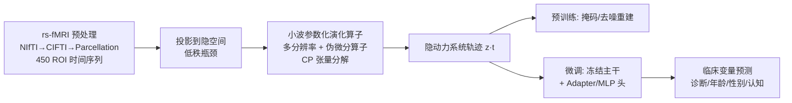

# MnemoDyn: Learning Resting State Dynamics from 40K fMRI Sequences

**会议**: ICLR 2026  
**OpenReview**: [https://openreview.net/forum?id=zexMILcQOV](https://openreview.net/forum?id=zexMILcQOV)  
**代码**: [https://github.com/vsingh-group/mnemodyn](https://github.com/vsingh-group/mnemodyn)  
**领域**: 医学影像 / 计算神经科学 / 基础模型  
**关键词**: rs-fMRI、脑动力学、算子学习、小波、伪微分算子、受控微分方程、基础模型  

## 一句话总结
把静息态 fMRI 看作隐空间里一条由「可学习演化算子」驱动的轨迹，用小波参数化的伪微分算子代替 Transformer 自注意力，在约 40K 条 rs-fMRI 序列上预训练出一个轻量、长序列友好、跨数据集泛化的脑影像基础模型。

## 研究背景与动机
**领域现状**：静息态 fMRI 记录大脑自发的血氧（BOLD）信号，是手术规划、癫痫定位与认知/疾病研究的重要模态。近年的 rs-fMRI 基础模型（BrainLM、Brain-JEPA）几乎全部沿用 NLP 的 Transformer 骨干，靠自注意力建模时间依赖，在标准 5–7 分钟采集协议上效果不错。

**现有痛点**：把注意力直接搬到脑信号上有三处水土不服。其一是**长序列代价**——睡眠/临床场景正转向长达数小时的连续采集，注意力的平方复杂度让计算迅速爆炸；其二是**数据效率**——真实场景里下游队列往往只有几百个样本，注意力模型很难在小数据上微调好；其三是**部署成本**——大模型难以落到算力受限的临床环境。更根本的是，注意力的归纳偏置（token 化、位置编码、全局交互）与脑信号的本质并不匹配：脑信号是连续过程的离散采样，具有强局部时间相关、层级化、多尺度的结构。

**核心矛盾**：基础模型范式要的是「大规模预训练 + 强泛化」，但脑信号「连续、多尺度、噪声大、采集贵」的特性又与注意力的「离散 token + 全局密集交互」的假设相冲突——既想要基础模型的可迁移性，又不想付出注意力的代价和错配的归纳偏置。

**本文目标**：构造一个不依赖注意力、计算/参数高效、能处理长序列、并能在小样本下游任务上稳定迁移的 rs-fMRI 基础模型。

**核心 idea**：**[算子学习取代自回归]** 不去学原始信号或隐状态的自回归映射，而是把大脑当作在隐空间生成轨迹的动力系统，直接学习支配这条轨迹的**演化算子**；**[小波 × 伪微分算子]** 用多分辨率小波基参数化算子核，借助小波与伪微分算子相互作用天然产生的稀疏（块对角）表示，把多尺度建模做得既有表达力又算得动。

## 方法详解

### 整体框架
MnemoDyn 把观测信号 $x(t)\in\mathbb{R}^n$（$n$ 个脑区 parcel）视作一个隐神经状态 $z(t)\in\mathbb{R}^d$ 的测量，隐状态按一个连续时间动力系统 $\frac{dz(t)}{dt}=F(z(t),u(t);\theta)$ 演化。求解这个 ODE 等价于学习一个把「初始状态 + 输入路径」映到「整条隐轨迹」的非线性积分算子，而算子核用多分辨率小波基 + CP 张量低秩分解来参数化，使整个模型用卷积核高效实现、对长序列线性扩展。预训练阶段用（掩码/去噪）自编码重建信号，微调阶段冻结主干、只训练轻量 adapter/MLP 头去预测临床变量。

### 关键设计
**1. 从状态空间到算子：用积分算子捕捉非马尔可夫依赖。** 作者先写出标准状态空间模型——隐状态转移 $z_{t+1}=f(z_t,u_t;\theta)+w_t$ 与观测 $x_t=h(z_t;\phi)+v_t$，再论证连续时间形式更契合脑信号的连续本质，于是过渡到 ODE $\frac{dz}{dt}=F(z,u;\theta)$。离散映射 $f$ 不过是 ODE 流的一次数值积分步（Euler 即 $z_{t+1}\approx z_t+\Delta t\cdot F$）。把 ODE 写成积分形式后得到 Volterra 型方程 $z(t)=z_0+\int_0^t F(z(\tau),u(\tau);\theta)\,d\tau$，关键在于这个从 0 到 $t$ 的积分让算子在每一时刻都能访问输入的**整段历史**。进一步把向量场拆成自治漂移项 $P$ 与控制调制项 $K$，控制项就构成一个作用在输入上的非线性积分算子 $(K_\theta u)(t)=\int_0^t K(z(\tau);\theta)u(\tau)\,d\tau$。作者更把它写成受控微分方程（CDE）形式 $z(t)=z_0+\int_0^t P\,d\tau+\int_0^t K\,du_W(\tau)$，其中小波变换后的路径 $u_W$ 充当「rough path」，使模型能编码超越逐点取值的历史——这正是相比纯 ODE 能建模非马尔可夫依赖的来源。

**2. 多分辨率小波核：把"多尺度"做进算子里。** 神经科学经验表明脑信号具有层级化的多尺度组织，作者据此把积分核展开为可分离小波基的线性组合 $K(z(\tau);\theta)=\sum_{j=0}^{J}\sum_k \phi_{j,k}(\tau)A_{j,k}(z(\tau);\theta)$，其中 $\phi_{j,k}$ 是尺度 $j$、平移 $k$ 处的小波基，$A_{j,k}$ 是受当前状态 $z(\tau)$ 调制的矩阵值函数。换个视角看，可以先用小波把输入滤成 $u_{j,k}(\tau)=\phi_{j,k}(\tau)u(\tau)$，再让状态相关的算子 $A_{j,k}$ 作用其上——于是算子呈现"先在多个时间分辨率/位置上做局部滤波，再做状态条件变换"的两段式结构，既保留时间局部性又获得尺度自适应。每一层对应一个小波尺度，层间用残差连接耦合，从而把细粒度涨落与长程结构逐层整合。

**3. 伪微分算子 + CP 低秩：把"算得动"落到实处。** 朴素实现有两个致命问题：算子核随序列变长需要巨大矩阵、且 rs-fMRI 高维需要很大的隐维度，直接做会丧失计算效率。作者的破解点是——既然信号已表示在小波域，**小波与伪微分算子的相互作用会天然给出高度稀疏、块对角的表示**，于是参数与隐动力的交互完全在小波域内、以紧凑块对角形式表达，用多组卷积滤波器并行实现即可。针对高维隐空间带来的参数爆炸，再叠加 Canonical Polyadic（CP）张量分解 $X\approx\sum_{r=1}^{R}\lambda_r a_r^{(1)}\otimes\cdots\otimes a_r^{(N)}$ 把算子参数张量压成若干秩一外积之和，在保表达力的同时大幅削减自由参数。两者叠加使 92M 参数的 MnemoDyn 在单张 A100-40GB 上约 3 小时即可完成预训练（基线常需 4 卡），并支持仅用 HCP 这种中等规模数据训出可用的基础模型。

**4. 预训练目标与微调：掩码重建 + 冻结迁移。** 预训练给了三种自监督变体：MnemoDyn-Denoise（去噪自编码）、MnemoDyn-Mask（随机掩 70% 时空块后从上下文重建，逼模型学长程依赖）、以及借鉴 Brain-JEPA 掩码方案的 MnemoDyn-Mask-JEPA，优化器用 AdamW + 余弦退火热重启。微调时冻结预训练主干，只在时间和 ROI 上池化后的特征上接一个带 LayerNorm/GELU/Dropout 的 MLP 头，回归任务用 MSE、分类任务用交叉熵。实验显示三种预训练目标下游表现相当，作者据此论证性能驱动因素是**算子参数化本身**而非某个特定的预训练目标。

## 实验关键数据
预训练用 UK Biobank（约 65K 样本、TR 0.735s、序列长约 490）与 HCP（约 1000 样本、TR 0.72s、序列长 1200）两套数据各训一个模型；统一预处理为 NIfTI→CIFTI→450 ROI（Schaefer-400 皮层 + Tian 皮层下），按训练集中位数/IQR 做鲁棒归一化。下游用 HCP-Aging、ADNI、ADHD-200、ABIDE、NKIR 等六套额外数据集评测。

### 主实验表格
ADNI 诊断/生物标志物 + UK Biobank 人口学（test set，mean）：

| 方法 | NC/MCI ACC↑ | NC/MCI F1↑ | Amyloid ACC↑ | Amyloid F1↑ | Age MSE↓ | Sex ACC↑ |
|---|---|---|---|---|---|---|
| BrainNetCNN | 60.00 | 64.72 | 59.00 | 59.43 | 0.99 | 77.86 |
| BrainGNN | 67.40 | 71.42 | 57.00 | 62.61 | 0.93 | 77.31 |
| BNT | 78.90 | 83.14 | 62.00 | 59.53 | 0.86 | 80.78 |
| BrainLM | 75.79 | 85.66 | 67.00 | 68.82 | 0.61 | 86.47 |
| Brain-JEPA | 76.84 | 86.32 | 71.00 | 75.97 | 0.50 | 88.17 |
| **MnemoDyn-Mask** | **96.12** | **95.98** | **95.27** | **95.61** | 0.44 | **88.40** |
| MnemoDyn-Mask-JEPA | 93.67 | 93.32 | 94.89 | 94.60 | **0.42** | 88.30 |

诊断/生物标志物任务上提升极为显著（NC/MCI 准确率从约 77% 跳到 96%，Amyloid 从约 71% 跳到 95%）。

HCP-Aging 人口学 + 认知特质（test set，mean）：

| 方法 | Age MSE↓ | Sex ACC↑ | Sex F1↑ | Neuroticism MSE↓ | Flanker MSE↓ |
|---|---|---|---|---|---|
| BrainLM | 1.14 | 75.27 | 73.19 | 1.05 | 0.77 |
| Brain-JEPA | 1.02 | 79.17 | 76.29 | 0.99 | 1.28 |
| MnemoDyn-Denoise | 0.91 | 80.20 | 80.11 | 0.91 | 0.61 |
| **MnemoDyn-Mask** | **0.90** | **83.10** | **82.77** | **0.90** | **0.60** |
| MnemoDyn-Mask-JEPA | 0.90 | 82.57 | 82.23 | 0.90 | 0.60 |

### 消融实验表格
跨基础模型的重建泛化（验证集 MSE / R²）：

| 模型 | UK-Biobank (MSE, R²) | HCP (MSE, R²) |
|---|---|---|
| MnemoDyn-UKB | 2.36e-5, 0.985 | 4.52e-8, 0.934 |
| MnemoDyn-HCP | 1.86e-9, 0.969 | 3.94e-6, 0.987 |

在 UKB 上训练的模型能高质量重建 HCP 数据、反之亦然（R² 均 >0.93），说明算子表示跨数据集泛化良好。预训练策略消融（Denoise/Mask/Mask-JEPA）下游表现相当，佐证性能来自算子参数化而非特定目标。

### 关键发现
- **效率**：92M 参数模型单卡 A100-40GB 约 3 小时完成预训练，远低于基线的 4 卡配置。
- **结构涌现**：预训练后 Frobenius 范数集中在小波算子核上、密集分量随深度迅速衰减，输出投影矩阵约 95% 稀疏——表明动力学由结构化跨尺度滤波器驱动，与小波域参数化设计一致。
- **小样本友好**：仅用 HCP（约 1000 样本）也能训出可用的基础模型，这是注意力模型难以做到的。

## 亮点与洞察
- **范式切换而非调参**：把 fMRI 建模从"学自回归序列映射"重构为"辨识支配动力系统的算子"，绕开了 token 化、位置编码、patching 这些注意力模型里又琐碎又敏感的环节。
- **领域先验进架构**：多分辨率小波直接对应神经科学里脑信号的层级多尺度组织，归纳偏置与数据本质对齐，而不是套用 NLP 假设。
- **数学结构换效率**：小波 × 伪微分算子的稀疏块对角性 + CP 低秩，是真正让"多尺度积分算子"从理论可写变成单卡可训的关键工程支点。
- **诊断任务的巨大跃升**值得注意——ADNI 上 +20 个点的提升幅度，提示算子表示对疾病相关的动力学差异可能格外敏感。

## 局限与展望
- 实验仅限 parcellated（脑区级）rs-fMRI，尚未扩展到 voxel 级或 EEG/PET 等多模态输入。
- 作者明确指出隐空间动力系统建模**不等于生理验证**——算子谱虽可解释，但不能当作神经生理机制的证据，这一局限与 BrainLM/Brain-JEPA 等数据驱动基线相同。
- ADNI 诊断任务上相对基线高出约 20 个点的幅度异常大，跨数据集划分/泄漏与统计稳健性值得在更多 cohort 上复核。
- 展望：长序列（数小时睡眠采集）与多模态融合是自然的下一步，算子线性扩展的特性正好对此友好。

## 相关工作与启发
- **算子学习 / 状态空间**：DeepONet、Fourier Neural Operator 开创了学习无穷维函数空间映射；S4/Mamba 等 SSM 显式分解隐演化与观测，但少有针对神经生理数据、也几乎不用小波这类多尺度基——本文恰好补上这块。
- **脑影像的注意力模型**：BNT、BrainLM、Brain-JEPA 把 Transformer 引入 fMRI，但在长程/噪声/不规则采样下常常吃亏，且 token 化与连续脑信号错配——本文提供了一条完全不用全局注意力的领域对齐替代路线。
- **轻量领域模型主张**：多项 benchmark（如 DLinear 之争、time-series 评测）表明结构对齐的 CNN/RNN 在低数据时序任务上能超过 Transformer——本文是这一思潮在脑影像基础模型上的有力实证。

## 评分
- **新颖性**: ⭐⭐⭐⭐⭐ 把算子学习 + 小波伪微分算子 + CP 低秩三者组合成 rs-fMRI 基础模型，是一条与主流注意力路线正交且自洽的新范式。
- **实验充分度**: ⭐⭐⭐⭐ 覆盖重建/分类/回归多任务、多达八套数据集、含跨数据集泛化与预训练目标消融；但 ADNI 上异常大的提升幅度缺少更细的泄漏排查与更多 cohort 复核。
- **写作质量**: ⭐⭐⭐⭐ 从状态空间→ODE→积分算子→小波核的推导层层递进、动机清晰；公式较密，工程实现细节略简。
- **价值**: ⭐⭐⭐⭐⭐ 单卡 3 小时训练 + 小样本可用 + 开源模型，对算力受限、样本稀缺的真实神经影像研究有直接落地意义。

<!-- RELATED:START -->

## 相关论文

- [\[ICLR 2026\] Learning Patient-Specific Disease Dynamics with Latent Flow Matching for Longitudinal Imaging Generation](learning_patient-specific_disease_dynamics_with_latent_flow_matching_for_longitu.md)
- [\[NeurIPS 2025\] GeoDynamics: A Geometric State-Space Neural Network for Understanding Brain Dynamics on Riemannian Manifolds](../../NeurIPS2025/medical_imaging/geodynamics_a_geometric_state-space_neural_network_for_understanding_brain_dynam.md)
- [\[ICLR 2026\] Brain-IT: Image Reconstruction from fMRI via Brain-Interaction Transformer](brain-it_image_reconstruction_from_fmri_via_brain-interaction_transformer.md)
- [\[ICLR 2026\] Moving Beyond Diffusion: Hierarchy-to-Hierarchy Autoregression for fMRI-to-Image Reconstruction](moving_beyond_diffusion_hierarchy-to-hierarchy_autoregression_for_fmri-to-image_.md)
- [\[CVPR 2026\] fMRI-LM: Towards a Universal Foundation Model for Language-Aligned fMRI Understanding](../../CVPR2026/medical_imaging/fmri-lm_towards_a_universal_foundation_model_for_language-aligned_fmri_understan.md)

<!-- RELATED:END -->
