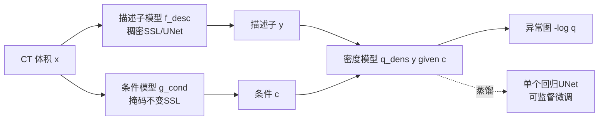

# Modeling the Density of Pixel-level Self-supervised Embeddings for Unsupervised Pathology Segmentation in Medical CT

**会议**: ICLR 2026  
**OpenReview**: [https://openreview.net/forum?id=i7YnUW0uWg](https://openreview.net/forum?id=i7YnUW0uWg)  
**代码**: [https://github.com/mishgon/screener](https://github.com/mishgon/screener)  
**领域**: 医学图像 / 无监督异常分割 / 自监督表示学习  
**关键词**: UVAS, 密度估计, 稠密自监督, 3D CT, 病理分割, 掩码不变条件  

## 一句话总结
本文提出 Screener：用稠密自监督学习取代 ImageNet 预训练特征、用"掩码不变"的可学习条件变量取代手工正弦位置编码，把基于密度的无监督视觉异常分割（UVAS）框架做成全自监督，在 3 万例无标注 CT 上训练后于 1820 例多病理测试集上大幅超越现有 UVAS 方法。

## 研究背景与动机
- **领域现状**：3D 医学影像里要检出"所有"病理是难题。监督模型只能识别数据集里标注过的少数几类病理（如肺癌、肺炎、肾/肝肿瘤），对未标注的病变（如气胸）束手无策；而无标注 CT 数据量巨大却长期闲置。
- **现有痛点**：把病理检测重述为无监督视觉异常分割（UVAS）后，自然图像上成熟的方法搬到医学影像都水土不服——合成式（DRAEM、MOOD）和重建式（Autoencoder、f-AnoGAN）方法都要求训练集"全是健康样本"，但未经筛选的 CT 里混入大量带病患者且无法自动剔除；唯一不要求"绝对无病"、只假设"病理罕见"的密度式方法（CFLOW、MSFlow），又依赖 ImageNet 预训练编码器，存在严重域偏移。
- **核心矛盾**：密度式 UVAS 框架理论上最契合医学场景（只需"罕见"而非"缺失"），但它的两个核心组件都是为自然图像设计的——描述子来自 ImageNet 编码器（域偏移），条件变量用手工正弦位置编码（医学扫描未必解剖对齐，位置编码缺乏解剖/患者层面的语义）。换上监督医学编码器（STU-Net）也不行，特征过于任务特化、缺乏判别病理的通用信息。
- **本文目标**：构造一个完全不依赖标注、不依赖外部预训练的全自监督密度式 UVAS 模型，既能直接做无监督病理分割，又能蒸馏成一个可微调的病理分割基础模型。
- **核心 idea**：**用稠密自监督同时重造密度式 UVAS 的两个组件**——(1) 稠密 SSL 学到域内、高分辨率、判别力强的描述子，替代 ImageNet 特征；(2) 用"对图像掩码不变"的可学习像素级嵌入作为条件变量，替代手工位置编码，从而把条件分布简化到连一个简单高斯都能媲美归一化流。

## 方法详解

### 整体框架
Screener 沿用密度式 UVAS 的"描述子模型 + 密度模型"双模块结构，并把条件机制也换成可学习的自监督模块。三个模块依次训练：描述子模型 $f_{\theta_{desc}}$ 把 CT 编码成稠密特征 $y$；条件模型 $g_{\theta_{cond}}$ 编码出掩码不变的上下文条件 $c$；密度模型 $q_{\theta_{dens}}(y\mid c)$ 学习条件分布，推理时把负对数密度 $-\log q(y[p]\mid c[p])$ 当作每个体素的异常分数。三模块都可用 $1\times1\times1$ 卷积逐体素高效执行。最后再把整条推理管线蒸馏进单个 UNet，使框架可被监督微调。

### 关键设计

**1. 稠密自监督描述子：让"正常"自然聚到高密度区。** 描述子的好坏直接决定密度建模的成败——它必须对病理有判别力、又对无关的正常变化鲁棒。作者用稠密 SSL 来获得这种平衡：从一个 CT 体积里取两个随机大小、重叠的 3D crop，缩放到 $H\times W\times S$ 并施加颜色抖动等增广得到 $x^{(1)},x^{(2)}$，过描述子模型得到特征图 $y^{(1)},y^{(2)}$；在重叠区随机选 $n$ 个位置，对每个位置取出对应两视图的描述子构成正样本对。体素级目标（InfoNCE 或 VICReg，对应 DenseInfoNCE / DenseVICReg）强迫即使空间相邻的位置也要可区分，而增广不变性抹掉低层细节，使嵌入空间更平滑、更语义化——相似的正常模式自然落到高密度区。架构上作者刻意"极简"：采用全分辨率输出的 UNet（精确定位小病灶），不加多尺度特征金字塔或全局辅助目标，只靠全分辨率的稠密自监督。

**2. 掩码不变条件变量：把"病理在不在"从上下文里抹掉。** 一个局部模式是否反常往往取决于上下文（解剖位置、患者年龄性别）——同样的钙化在老年人肺里正常、在乳腺里异常。手工正弦位置编码在未对齐的医学扫描里缺乏解剖语义；解剖位置编码 APE 又只针对单一域、捕捉不到患者级细节。作者的关键想法是训练条件模型 $g_{\theta_{cond}}$ 去预测"在不同掩码视图下都一致"的体素嵌入：哪怕某个病灶在一个掩码视图里可见、在另一个里被遮住，模型也要对该位置预测相同的条件嵌入。这样学到的条件特征图就对异常的有无不变，只保留解剖位置、组织类型、患者年龄/性别等能从全局结构稳健推断的信息。实现上条件模型架构和训练流程与描述子模型完全相同，唯一区别是把随机掩码作为额外的增广。

**3. 条件密度建模 + 蒸馏成可微调 UNet。** 密度模型可视为"根据条件预测描述子"的预测器，异常分数就是逐位置的预测误差。训练时采样 $m$ 个 crop，用预训练好的描述子/条件模型产出 $\{y_i\},\{c_i\}$，最小化负对数似然 $\frac{1}{m\cdot|P|}\sum_i\sum_{p}-\log q_{\theta_{dens}}(y_i[p]\mid c_i[p])$。密度模型有两种参数化：简单高斯（baseline）和归一化流（更强表达力）。由于条件变量已经把分布简化，简单高斯也能逼近流模型的效果。推理时把整卷分成重叠 patch 逐块算异常图再在重叠区平均聚合。由于三模块管线无法端到端优化，作者把整条推理管线**蒸馏**进单个 UNet：用预训练 Screener 产出的负对数密度图作"伪标签"，训一个回归 UNet（最后一层单通道无激活）用 MSE 直接拟合该分数图——这等价于一种新的自监督预训练，随后重置末层、加 sigmoid，用 BCE+Dice 在少量标注上监督微调。

## 实验关键数据

训练集：NLST、AMOS、AbdomenAtlas（3 万+ 无标注 CT）；测试集：LIDC、MIDRC、KiTS、LiTS（1820 例，仅部分病理有标注）。指标用体素级 AUROC（对标注不全鲁棒）与 Dice（因标注不全被严重低估）。

### 主实验表格（无监督设置，体素级 AUROC）

| 方法 | LIDC | MIDRC | KiTS | LiTS |
|---|---|---|---|---|
| Autoencoder | 0.71 | 0.65 | 0.66 | 0.68 |
| f-AnoGAN | 0.82 | 0.66 | 0.67 | 0.67 |
| Patched Diffusion | 0.87 | 0.76 | 0.76 | 0.80 |
| DRAEM | 0.63 | 0.72 | 0.82 | 0.83 |
| MOOD-Top1 | 0.79 | 0.79 | 0.77 | 0.80 |
| MSFlow | 0.71 | 0.67 | 0.63 | 0.63 |
| **Screener (ours)** | **0.96** | **0.87** | **0.90** | **0.93** |

### 消融实验表格（条件模型 × 密度模型，DenseVICReg 描述子）

| 条件模型 | 密度模型 | LIDC | MIDRC | KiTS | LiTS |
|---|---|---|---|---|---|
| None | Gaussian | 0.81 | 0.81 | 0.61 | 0.71 |
| Sin-cos pos. | Gaussian | 0.82 | 0.80 | 0.74 | 0.77 |
| APE | Gaussian | 0.88 | 0.80 | 0.78 | 0.86 |
| **Masking-invariant** | Gaussian | **0.96** | **0.84** | **0.87** | **0.90** |
| Sin-cos pos. | Norm. flow | 0.96 | 0.89 | 0.90 | 0.94 |
| Masking-invariant | Norm. flow | 0.96 | 0.87 | 0.90 | 0.93 |

### 关键发现
- **无监督大幅领先**：Screener 在四个测试集 AUROC 全面碾压所有 UVAS baseline（如 LIDC 0.96 vs 次优 0.87），Dice 也成倍提升。重建式方法会过拟合训练集病理、合成式方法泛化不到真实病变、依赖 ImageNet 的 MSFlow 在 CT 上失效。
- **掩码不变条件让简单高斯逼近流模型**：用归一化流时各种条件策略差别不大；但用简单高斯时，条件越有信息量结果越好，掩码不变条件让高斯模型（如 LIDC 0.96）追平复杂流模型，验证了"条件简化分布"的核心论点。
- **低样本微调是 SOTA 预训练**：每折仅 25 例标注微调时，蒸馏后的 Screener 一致提升下游分割（LIDC Dice 相对从零训练提升约 49%，p<0.01），与监督预训练 STU-Net、最强自监督 VoCo 相当；但全量数据微调时优势消失，符合"SSL 在数据稀缺时收益最大"的普遍观察。
- 描述子消融：DenseVICReg 略优于 DenseInfoNCE，描述子维度从 32 增到 128 无增益；自监督描述子显著优于 ImageNet-ResNet50 与监督 STU-Net。

## 亮点与洞察
- **把"全自监督"贯彻到密度式 UVAS 的每个组件**：描述子和条件都用稠密 SSL 重造，彻底摆脱对标注和外部预训练的依赖，正面回应了医学 CT"无法保证训练集全健康"这一结构性约束。
- **掩码不变是个优雅的条件学习原则**：用"对掩码不变"来定义"只保留与病理无关的上下文"，既简洁又自洽——它正好把"会泄露异常信息"的局部内容剔除，留下解剖/患者层面的稳健语义，这也是简单高斯能逼近流模型的根因。
- **蒸馏成单 UNet 巧妙打通无监督到监督**：三模块管线本不可端到端微调，用负对数密度图当伪标签蒸馏，顺手把无监督框架重新诠释为一种自监督预训练方法，一举两得。
- **首个 CT 上大规模 UVAS 评测**：在 1820 例多解剖、多病理上系统对比，填补了 UVAS 在医学影像上缺乏大规模 benchmark 的空白。

## 局限与展望
- **全量微调无增益**：当下游有充足标注时，Screener 预训练相对从零训练不再有优势，限制了其在数据充裕场景的价值。
- **Dice 被严重低估且阈值需少量病例选取**：因 ground truth 只标注目标病理、模型会检出所有异常，导致大量"真正例"被当假正例；分割阈值仍需在 10 个病理病例上调，离完全无标注还差一步。
- **仅在 CT 上验证**：方法虽宣称域无关，但实验集中于 3D CT，对 MRI、病理切片、自然图像的迁移性未验证。
- 三阶段分别训练（描述子→条件→密度→蒸馏）流程偏重，端到端化和训练效率仍有优化空间。

## 相关工作与启发
- **密度式 UVAS**：CFLOW、MSFlow（Gudovskiy 2022；Zhou 2024）奠定"描述子+条件归一化流"范式，本文继承其框架但替换两大组件。
- **稠密自监督**：DenseCL、VADER、VICRegL（Wang 2021；Pinheiro 2020；Bardes 2022）提供像素级 SSL 目标；作者做了医学域定制的极简化（全分辨率 UNet、去多尺度）。
- **医学预训练**：与 Model Genesis、SwinUNETR、VoCo、MAE、STU-Net 等对比，证明自监督描述子优于监督特征。
- **启发**：把"对某种增广不变"作为剥离特定信息的工具（这里是掩码→剥离病理信息）是个可推广的设计模式，可迁移到其他需要"上下文条件但要屏蔽目标信号"的异常检测/反事实建模任务。

## 评分
- **新颖性**: ⭐⭐⭐⭐ 用稠密 SSL 同时重造密度式 UVAS 的描述子与条件，"掩码不变条件"是一个简洁有洞见的新机制，虽是已有框架的组件替换但组合与切入点很巧。
- **实验充分度**: ⭐⭐⭐⭐ 3 万例训练 + 1820 例四数据集评测，无监督/微调/消融三条线齐全，对比 baseline 充分、带显著性检验；略欠跨模态验证与全量微调正收益。
- **写作质量**: ⭐⭐⭐⭐ 动机层层递进、把"为何选密度式""为何换两组件"讲得清楚，图表与符号规范。
- **价值**: ⭐⭐⭐⭐ 给医学影像"检出所有病理"提供了可落地的全自监督方案与首个 CT UVAS benchmark，并附开源代码与预训练模型，实用价值高。

<!-- RELATED:START -->

## 相关论文

- [\[ICLR 2026\] HEEGNet: Hyperbolic Embeddings for EEG](heegnet_hyperbolic_embeddings_for_eeg.md)
- [\[CVPR 2026\] IBISAgent: Reinforcing Pixel-Level Visual Reasoning in MLLMs for Universal Biomedical Object Referring and Segmentation](../../CVPR2026/medical_imaging/ibisagent_reinforcing_pixel-level_visual_reasoning_in_mllms_for_universal_biomed.md)
- [\[ICLR 2026\] PathChat-SegR1: Reasoning Segmentation in Pathology via SO-GRPO](pathchat-segr1_reasoning_segmentation_in_pathology_via_so-grpo.md)
- [\[CVPR 2026\] Dual-Level Confidence based Implicit Self-Refinement for Medical Visual Question Answering](../../CVPR2026/medical_imaging/dual-level_confidence_based_implicit_self-refinement_for_medical_visual_question.md)
- [\[ICCV 2025\] Boosting Vision Semantic Density with Anatomy Normality Modeling for Medical Vision-language Pre-training](../../ICCV2025/medical_imaging/boosting_vision_semantic_density_with_anatomy_normality_modeling_for_medical_vis.md)

<!-- RELATED:END -->
