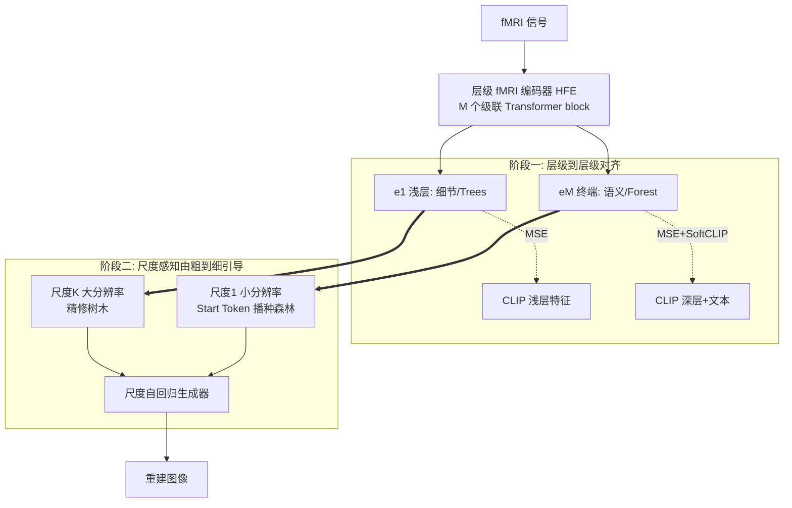

# Moving Beyond Diffusion: Hierarchy-to-Hierarchy Autoregression for fMRI-to-Image Reconstruction

**会议**: ICLR 2026  
**OpenReview**: [https://openreview.net/forum?id=AT7hCh6HB7](https://openreview.net/forum?id=AT7hCh6HB7)  
**代码**: [https://github.com/XuZhang2/MindHier](https://github.com/XuZhang2/MindHier)  
**领域**: 脑信号解码 / fMRI-to-Image 重建 / 视觉自回归生成  
**关键词**: fMRI-to-Image、尺度自回归(VAR)、层级对齐、由粗到细、CLIP、NSD  

## 一句话总结
MindHier 把 fMRI-to-image 重建从"扩散模型 + 单一静态引导"换成"尺度自回归(next-scale prediction) + 层级化神经引导"，让大脑信号按"先森林后树木"的层级逐尺度注入生成过程，在 NSD 上拿到 SOTA 语义指标的同时推理快 4.67×、结果还更确定性。

## 研究背景与动机
**领域现状**：从 fMRI 信号重建出受试者看到的图像，是连接计算机视觉与认知神经科学的核心任务。近几年的主流做法几乎全是扩散模型：把 fMRI 编码成一个 CLIP 空间里的神经嵌入，然后用这个嵌入作为"固定引导"，从高斯噪声一步步去噪还原出图像。

**现有痛点**：作者指出这种"单一静态引导"范式有两个根本缺陷。其一，fMRI 信号本身是**层级化**的——不同脑区分别编码粗粒度语义内容和细粒度感知细节，但现有方法把这种丰富的多层级信息**坍缩成一个向量**，信息严重浪费。其二，引导信号是**时间不变**的，而生成模型是**多阶段动态**过程：早期需要全局语义约束，后期需要精确的结构和纹理线索。固定引导在早期冗余、在后期不足，造成"表示"与"生成"之间的错配。雪上加霜的是，扩散模型本身能注入引导的控制点很有限。

**核心矛盾**：fMRI 的层级结构 + 生成的阶段性需求 ↔ 现有方法用一个固定向量贯穿全程，既丢了层级又对不上阶段。

**本文目标**：设计一个能在**不同生成阶段注入不同层级神经特征**的重建框架，让全局语义先建立、局部细节后精修。

**核心 idea**：**用尺度自回归(VAR)替代扩散** —— VAR 的"next-scale prediction"天然提供了一串离散、可控的尺度（分辨率）控制点；再把 fMRI 编码成多层级特征，**深层语义引导小尺度、浅层细节引导大尺度**，使整个重建过程模拟人类感知的"森林先于树木"(Forest before Trees)层级原理。

## 方法详解

### 整体框架
MindHier 是一个两阶段训练的由粗到细重建框架。**阶段一**训练一个层级 fMRI 编码器(HFE)，把 fMRI 信号解耦成一组从全局语义到局部细节的多层级特征，并用层级对齐损失把它们对到冻结 CLIP 的不同层；**阶段二**冻结该编码器，微调一个尺度自回归生成器(基于 Switti/VAR 预训练)，通过带掩码的交叉注意力把不同层级的 fMRI 特征按"深层引导粗尺度、浅层引导细尺度"的方式注入 K 个尺度的生成。

### 关键设计

**1. 层级 fMRI 编码器(HFE)：把一团脑信号解耦成"森林到树木"的特征金字塔。** 不同于把 fMRI 压成单个向量，HFE 用 $M$ 个级联的 Transformer block，把每个 block 的输出 $\{e_1,\dots,e_M\}$ 都当作层级表示的一部分。这里借用了 ViT 的既有规律——浅层处理局部信息、深层聚合全局信息：终端输出 $e_M$ 编码最抽象的全局语义("森林")，靠前的 $e_1,\dots$ 保留细粒度感知细节("树木")。一次前向就拿到整套层级特征，这也是后面推理高效的根源之一。

**2. 层级到层级对齐(Hierarchy-to-Hierarchy Alignment)：用 CLIP 的层级当蓝图，逐层监督 HFE。** 光有层级架构不够，还需要层级化的训练目标来"逼"编码器学到结构化分解。作者用两个互补损失联合优化。**结构对齐**用级联 MSE，把 HFE 第 $m$ 个 block 的输出 $e_m$ 与 CLIP 视觉编码器对应层 $v_{g_m}$ 做点对点对齐（特征都做 $\ell_2$ 归一化以稳定训练）：
$$\mathcal{L}_{\text{MSE}}=\sum_{m=1}^{M}\big\|\ell_2(e_m)-\ell_2(v_{g_m})\big\|_2^2$$
其中映射 $g_m=8+4m$ 把 fMRI 对到 CLIP ViT-L/14 的第 $\{12,16,20,24\}$ 层。**语义对齐**则给终端特征 $e_M$ 加一个 SoftCLIP 对比损失，在 CLIP 共享空间里同时对齐图像特征 $v$ 和文本 caption 特征 $t$，提供一个全局语义锚点：
$$\mathcal{L}_{\text{SoftCLIP}}=-\frac{1}{B}\sum_{i=1}^{B}\Big[\log\frac{\exp(e_i\cdot v_i/\tau)}{\sum_j\exp(e_i\cdot v_j/\tau)}+\log\frac{\exp(e_i\cdot t_i/\tau)}{\sum_j\exp(e_i\cdot t_j/\tau)}\Big]$$
这套"深层对深层"当蓝图先定布局、"浅层对浅层"当渲染器填纹理的自上而下对齐，是后续重建质量的关键。

**3. 尺度感知由粗到细神经引导：把层级特征按分辨率精准灌进自回归。** VAR 把图像量化成 $K$ 个多尺度 token map $R=\{r_1,\dots,r_K\}$，每个位置查 $N{=}4096$ 的码本取最近码字，自回归分解为 $p(r_1,\dots,r_K)=\prod_k p(r_k|r_{<k})$。MindHier 的创新在于把每个尺度的条件换成**尺度专属**特征 $s_k$：
$$p(R|E)=\prod_{k=1}^{K} p(r_k\mid r_{<k},\,s_k)$$
引导按两个认知启发的阶段动态选取：**播种"森林"($k{=}1$)** 用最抽象的语义特征 $e_M$ 作为特殊 Start Token 来初始化最低分辨率尺度，给整张图定下连贯的全局基底；**精修"树木"($1<k\le K$)** 则在更高分辨率尺度上通过多头交叉注意力逐步注入细节特征 $s_k=e_{h_k}$，索引 $h_k=M-\lfloor M(k-1)/K\rfloor$ 巧妙地把靠前 block 的细节特征对到靠后的生成阶段。工程上用一个**选择性注意力掩码**实现：粗尺度只允许 attend 深层语义特征、细尺度只 attend 浅层细节特征。最后把各尺度量化向量求和 $\hat{f}=\sum_k \text{lookup}(Z,\hat r_k)$ 再经解码器 $D$ 得到图像 $\hat I$，整体用交叉熵预测真值 token map 训练。

## 实验关键数据

### 主实验（NSD 新测试集，跨 Subject 1/2/5/7 平均）

| 方法 | PixCorr↑ | SSIM↑ | Incep↑(%) | CLIP↑(%) | Eff↓ | SwAV↓ | 推理(s)↓ |
|------|---------|-------|-----------|----------|------|-------|---------|
| Takagi[CVPR23] | 0.246 | 0.410 | 83.8 | 82.1 | 0.811 | 0.504 | 15.08 |
| MindBridge[CVPR24] | 0.151 | 0.263 | 92.4 | 94.7 | 0.712 | 0.418 | 15.98 |
| Wills Aligner[AAAI25] | 0.271 | 0.328 | 94.3 | 94.8 | 0.649 | 0.373 | - |
| **MindHier (Ours)** | 0.235 | 0.381 | **95.9** | **96.4** | **0.606** | **0.329** | **2.64** |
| †MindEye2[ICML24] | 0.322 | 0.431 | 95.4 | 93.0 | 0.619 | 0.344 | 12.14 |
| †MindHier (Ours) | 0.326 | 0.461 | 95.9 | 95.4 | 0.613 | 0.345 | **2.64** |

(† 表示额外用了 MindEye2 的辅助低层特征。)在高层语义指标(Incep/CLIP/Eff/SwAV)上全面 SOTA，推理时间 2.64s 相比 MindEye2 的 12.14s 快 **4.67×**。

### 诊断实验（Subject 1）

| 编码器设计 | CLIP↑ | SwAV↓ | 结论 |
|-----------|-------|-------|------|
| Single Feature(单特征) | 95.1% | 0.346 | 基线 |
| Hierarchical(仅终端监督) | 95.4% | 0.339 | 小幅提升 |
| **Hierarchical(全级联监督)** | **97.2%** | **0.321** | 层级 + 逐层监督缺一不可 |

| CLIP 层映射 | CLIP↑ | PixCorr↑ | 结论 |
|------------|-------|----------|------|
| $g_m{=}16{+}2m$ {18,20,22,24} | 95.4% | 0.226 | 太晚→语义同质、缺辨识度 |
| $g_m{=}6m$ {6,12,18,24} | 94.8% | 0.283 | 太早→低层略好、语义降 |
| **$g_m{=}8{+}4m$ {12,16,20,24}** | **97.2%** | 0.273 | 中间偏深最平衡 |

| 引导方向 | CLIP↑ | SwAV↓ |
|---------|-------|-------|
| **由粗到细(Coarse-to-Fine)** | **97.2%** | **0.321** |
| 反转(Fine-to-Coarse) | 96.1% | 0.330 |

### 关键发现
- **层级 + 逐层监督是核心增益**：从单特征到全级联监督，CLIP 从 95.1%→97.2%，证明只有架构没有逐 block MSE 监督只能拿到小幅提升。
- **CLIP 层映射存在低层↔高层权衡**：对齐过早的层低层指标略好但语义掉，过晚的层语义同质化，中间偏深的 {12,16,20,24} 最优。
- **由粗到细方向不能反**：反转成先细后粗后 CLIP 掉 1.1 个点，但模型没有崩溃，说明尺度自回归 + 注意力本身有韧性，能部分补偿次优引导。
- **确定性优势**：从 fMRI 特征直接初始化（而非随机噪声），四次重复试验结果几乎一致，而扩散基线 MindBridge 跨试验颜色外观大幅漂移。

## 亮点与洞察
- **范式迁移而非局部改进**：第一个把"next-scale prediction"的视觉自回归(VAR)系统性引入 fMRI-to-image，并论证它比扩散更契合大脑信号的层级性——尺度即天然控制点。
- **认知对齐有据可循**：把神经科学的"Forest before Trees"(Navon 1977)全局先于局部的感知原理，落成了"深层特征播种小尺度、浅层特征精修大尺度"的计算框架，而非生搬硬套。
- **三重平衡**：在语义保真、确定性稳定、推理速度三者间建立了少见的平衡，把 fMRI 解码从离线分析推向了实时脑机接口的可能性。
- **效率来源清晰**：层级编码器一次前向出全部特征 + 自回归把绝大部分算力压到低分辨率尺度，两点共同带来 4.67× 加速。

## 局限与展望
- **低层结构指标非最优**：在 PixCorr/SSIM 等像素级低层指标上不及 MindEye2 等扩散方法，需要借辅助低层特征(†)才能追平；说明 VAR 路线在精确纹理/像素对齐上仍有差距。
- **强依赖 CLIP 层级先验**：整个层级监督建立在"CLIP 浅层=细节、深层=语义"的假设上，映射函数 $g_m$ 是手工设计的超参，换 backbone 或换层映射都要重新调。
- **仅在 NSD 单一数据集验证**：只测了 NSD 的 4 个完成全部扫描的受试者，跨数据集、跨被试泛化与真正在线的实时 BCI 场景尚未验证。
- **两阶段非端到端**：编码器与生成器分阶段训练、编码器冻结，未探索联合优化能否进一步提升。

## 相关工作与启发
- **fMRI-to-image 谱系**：从早期手工特征/稀疏回归 → VAE/GAN 的像素级重建 → IC-GAN/StyleGAN 隐空间 → 当前 LDM+CLIP 的语义引导主流；MindHier 是对"CLIP 单向量固定引导"这条主线的正面反思。
- **视觉自回归(VAR, Tian et al. 2024)**：本文的方法基座，"next-scale prediction" + 多尺度残差 VQ-VAE 把图像变成 token 金字塔；MindHier 把它从纯生成迁到了条件脑解码，且生成器用 Switti 预训练初始化。
- **启发**：对任何"用一个固定 embedding 引导多阶段生成"的任务（文本到图像、可控生成等），这篇提示了一个通用思路——把条件信号也做成层级/尺度对齐的，让 condition 的粒度随生成阶段动态切换，可能比单一全局 condition 更高效也更可控。

## 评分
- **新颖性**: ⭐⭐⭐⭐ 把 VAR 尺度自回归引入 fMRI 解码并配套层级对齐 + 尺度感知引导，是有说服力的范式切换，而非增量调参。
- **实验充分度**: ⭐⭐⭐⭐ 主实验 + 三组诊断实验(层级监督/层映射/引导方向)逻辑闭环，跨被试取均值且带方差；扣分在仅 NSD 单数据集、低层指标需辅助特征追平。
- **写作质量**: ⭐⭐⭐⭐ "森林先于树木"的认知隐喻贯穿全文、动机—方法—实验对应清晰，图 2 流程与公式互证。
- **价值**: ⭐⭐⭐⭐ 4.67× 加速 + 确定性重建把脑解码推向实时 BCI，对脑机接口与生成式神经解码方向有较强实用与启发价值。

<!-- RELATED:START -->

## 相关论文

- [\[ICLR 2026\] Brain-IT: Image Reconstruction from fMRI via Brain-Interaction Transformer](brain-it_image_reconstruction_from_fmri_via_brain-interaction_transformer.md)
- [\[ICLR 2026\] DM4CT: Benchmarking Diffusion Models for Computed Tomography Reconstruction](dm4ct_benchmarking_diffusion_models_for_computed_tomography_reconstruction.md)
- [\[CVPR 2026\] Benchmarking Endoscopic Surgical Image Restoration and Beyond](../../CVPR2026/medical_imaging/benchmarking_endoscopic_surgical_image_restoration_and_beyond.md)
- [\[ICLR 2026\] Distributional Consistency Loss: Beyond Pointwise Data Terms in Inverse Problems](distributional_consistency_loss_beyond_pointwise_data_terms_in_inverse_problems.md)
- [\[CVPR 2026\] D$^2$-FOSA: Dual-Diffusion Guided EEG-to-Image Reconstruction with Frequency-Oriented Semantic Alignment](../../CVPR2026/medical_imaging/d2-fosa_dual-diffusion_guided_eeg-to-image_reconstruction_with_frequency-oriente.md)

<!-- RELATED:END -->
