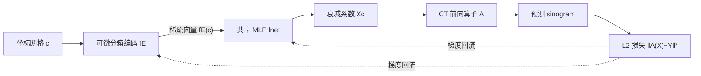

# NAB: Neural Adaptive Binning for Sparse-View CT Reconstruction

**会议**: ICLR 2026  
**OpenReview**: [https://openreview.net/forum?id=ARXIoso9D3](https://openreview.net/forum?id=ARXIoso9D3)  
**代码**: [https://github.com/Wangduo-Xie/NAB_CT_reconstruction](https://github.com/Wangduo-Xie/NAB_CT_reconstruction)  
**领域**: 自监督 CT 重建 / 隐式神经表示 / 坐标编码  
**关键词**: 稀疏视角 CT、形状先验、自适应分箱、坐标编码、隐式神经表示、工业 CT  

## 一句话总结
用一组可微的"自适应矩形分箱"取代隐式神经表示里随机傅里叶编码，把工业物体常见的矩形形状先验显式塞进坐标编码里，让每个 bin 的位置/大小/旋转/陡度都能从投影数据端到端学出来，在稀疏视角 CT 重建上大幅超越 INR 基线。

## 研究背景与动机

**领域现状**：稀疏视角 CT 重建是个典型的病态逆问题——为了降低工业检测成本和医疗辐射剂量，人们希望用尽量少的扫描角度恢复出高质量断层图。监督学习方法靠成对的稀疏/稠密视角训练，但训练-测试分布偏移导致泛化差；于是隐式神经表示（INR）成为主流：把空间坐标用随机傅里叶编码（Random Fourier Coding, RFC）映射成高频特征，再过一个小 MLP 预测衰减系数，只依赖物体自身的投影数据做自监督重建。

**现有痛点**：RFC 这套编码有两个结构性缺陷。其一，它基于一次性随机采样的频率矩阵 $\Omega$，编码里完全没有物体的形状先验信息——而工业 CT 拍的多半是砖块、支架、金属板这类**以矩形为主**的人造物，这个强先验被白白浪费了。其二，INR 能表示的函数被限制在 $\sum_{\omega} c_\omega \sin((\omega, r)+\phi_\omega)$ 这种谐波组合里，根据 Gibbs 现象，在矩形物体的跳变边界附近不可避免地产生过冲和波纹状伪影，再多三角基也消不掉。

**核心矛盾**：稀疏视角下信息本就不足，越需要靠先验补足；但傅里叶编码这种通用基既不携带形状先验，又天然不擅长拟合直角边界，等于在最缺信息的场景里用了最不合适的工具。

**本文目标**：设计一种可微的坐标编码，把"物体由若干矩形块拼成"这个先验显式建模进去，且每个矩形块的几何参数都能跟着投影损失一起被梯度优化。

**核心 idea（自适应矩形分箱）**：用两条平移过的双曲正切函数之差构造一维"方波"，沿正交两轴各做一次再 Hadamard 相乘，就得到一个局部的矩形 bin；再给它加上可微的旋转和缩放，让 bin 能自适应地平移、缩放、旋转去贴合物体里任意朝向的矩形区域。

## 方法详解

### 整体框架

NAB 把经典 INR 的"坐标 → 随机傅里叶特征 → MLP → 衰减系数"流水线中的编码模块整个换掉：坐标网格先经过一组可微的分箱函数 $\hat g(\cdot)$ 编码成一个稀疏向量（每一维对应一个自适应矩形 bin），再送进共享 MLP 预测每点衰减系数；把全图衰减系数经 CT 前向算子 $A$ 投影成 sinogram，与实测投影算 L2 损失，梯度同时回流更新 MLP 权重和所有 bin 的几何参数。整个过程是单物体自监督，不需要任何外部训练集。

### 关键设计

**1. 双 tanh 之差构造可微矩形分箱：把"硬盒子"做成能求导的形状基。** 难点在于"矩形区域"本身是个不可微的指示函数，没法直接塞进梯度优化。作者的做法是先沿 x 轴用两条平移后的双曲正切之差搭出一条"方波" $\gamma(c)_i = \frac{1}{2}\tanh(k_i(x_c-u_i+\frac{1}{2}h_i)) - \frac{1}{2}\tanh(k_i(x_c-u_i-\frac{1}{2}h_i))$，其中 $u_i$ 是中心、$h_i$ 是边长、$k_i$ 控制 tanh 的陡度；沿 y 轴对偶地构造另一条方波 $\mu(c)_i$（参数为中心 $v_i$、宽度 $w_i$）。两条正交方波取 Hadamard 积 $g(c)_i = \mu(c)_i \times \gamma(c)_i$，就得到一个以 $(u_i,v_i)$ 为中心、$h_i \times w_i$ 大小的局部矩形 bin。tanh 处处可微，所以这个"矩形"的位置和大小都能被梯度推着动。

**2. 旋转嵌入：让 bin 摆脱坐标轴对齐的束缚。** 现实里的矩形零件很少正好横平竖直，轴对齐的 bin 拼斜矩形会很费力。作者在算方波之前先对输入坐标做一次仿射旋转：把 $[x_c-u_i, y_c-v_i]$ 投影到旋转后的方向上，例如 $\hat\gamma(c)_i$ 里用 $[\cos\theta_i, -\sin\theta_i][x_c-u_i, y_c-v_i]^\top$ 替换原来的 $x_c-u_i$，y 轴方向同理用 $[\sin\theta_i, \cos\theta_i]$。这样旋转后的 bin $\hat g(c)_i$ 就绕中心 $(u_i,v_i)$ 转过了角度 $\theta_i$，而且 $\theta_i$ 本身也是可微参数，能在自监督重建里学出来。最终编码 $f_E(c) = [\lambda_1\hat g(c)_1, \dots, \lambda_M\hat g(c)_M]^\top$，每个 bin 再带一个幅度因子 $\lambda_i$，于是位置、大小、旋转、陡度、高度全部端到端可优化。

**3. 极限逼近：证明它本质是一种非随机的硬分箱。** 作者从理论上把这套软分箱和核方法里的随机硬分箱接上了。当 $\lambda_i=1$ 时，$f_E(c)$ 会贴近二值向量集合 $S=\{(h_1,\dots,h_M)^\top \mid h_i\in\{0,1\}\}$，且二者的 $\ell_1$ 距离被一个函数 $f_{dis}$ 控制；他们解析地证明当所有陡度 $k_i\to+\infty$ 时 $f_{dis}\to 0$，再由夹逼定理得到 $\lim_{k\to\infty}\min_{z\in S}\|f_E(c)-z\|_1 = 0$。这说明陡度足够大时 bin 退化成带清晰边界的理想矩形（硬分箱），从而在数学上和 Rahimi & Recht 的 random binning 建立起联系——只不过 NAB 是有方向、非随机地放置这些 bin。

**4. 多尺度陡度：从直角推广到曲面几何。** 纯矩形 bin 拟合不了带弧线/圆形的物体。作者把陡度 $k_i$ 从单值放宽成从一个尺度集合 $\{p_1,\dots,p_q\}$（$q>1$）里取值，既含大陡度（接近硬矩形）也含小陡度（平滑的鼓包状 bump 函数）。不同陡度给出形态各异的平滑变体，为重建提供更丰富的基；在含非零曲率区域的 Workpieces 和医疗数据集上，正是靠这个多尺度机制让框架同时覆盖矩形与曲面结构。

## 实验关键数据

数据集：从碳酸钙空心立方体切片旋转 19 个角度得到的 **CaCO3** 工业数据集（以矩形为主），从 Zeiss 数据采样 10 个切片的 **Workpieces** 数据集（含弧线/圆形等曲面），均生成 16/14/12 视角的平行束投影；另在附录验证医疗数据集。指标为 PSNR/SSIM。

### 主实验表格（CaCO3，节选）

| 方法 | 16-view PSNR↑ | 16-view SSIM↑ | 12-view PSNR↑ | 参数量↓ |
|------|------|------|------|------|
| FBP | 11.74 | 0.125 | 9.44 | - |
| DIP-TV | 24.05 | 0.783 | 22.40 | 1.90×10⁶ |
| Instant-NGP | 30.81 | 0.953 | 27.23 | 2.96×10⁶ |
| INRf（随机傅里叶） | 29.01 | 0.934 | 25.08 | 2.49×10⁵ |
| INRl2（7层大网络） | 38.89 | 0.983 | 30.36 | 1.25×10⁶ |
| **Ours (Iter=29990)** | **43.61** | **0.996** | **34.72** | **2.52×10⁵** |

同样的 MLP 架构下，只把随机傅里叶编码换成 NAB，就让 INRf 在 12/14/16 视角分别提升 9.64 / 12.97 / 14.60 dB；即便对手 INRl2 用了近 5 倍参数，NAB 仍在三个视角分别领先 4.36 / 2.24 / 4.72 dB。

### 主实验表格（Workpieces，含曲面，节选）

| 方法 | 16-view PSNR↑ | 14-view PSNR↑ | 12-view PSNR↑ |
|------|------|------|------|
| DIP-TV | 33.64 | 29.89 | 28.20 |
| Instant-NGP | 31.17 | 31.95 | 28.38 |
| INRf | 33.34 | 34.03 | 27.37 |
| **Ours (Iter=29990)** | **36.26** | **35.23** | **32.76** |

曲面物体上 NAB 超过 INRf 平均 5.39/1.20/2.92 dB（12/14/16 视角），提升幅度比纯矩形的 CaCO3 小，因为这里含大量弧线/圆形，但仍是最优；且只需 INRl2 约 20% 的参数。

### 消融实验表格（CaCO3，16 view）

| 配置（冻结某组件） | PSNR↑ | SSIM↑ |
|------|------|------|
| w/o 中心位置 {u,v} | 29.82 | 0.901 |
| w/o 边长 {h,w} | 30.82 | 0.787 |
| w/o 旋转 θ | 37.50 | 0.982 |
| w/o 陡度 k | 42.91 | 0.994 |
| w/o 高度 λ | 43.37 | 0.996 |
| **Full（Ours）** | **43.61** | **0.996** |

### 关键发现
- **位置与边长是命门**：冻结 bin 的中心 $\{u_i,v_i\}$ 或边长 $\{h_i,w_i\}$ 会直接掉 10+ dB，说明"把矩形放对地方、调对大小"是性能主来源。
- **旋转是第二重要项**：禁用旋转掉 6.11 dB，印证现实矩形多为斜置、轴对齐 bin 远不够用。
- **陡度与高度是微调项**：冻结陡度仅掉 0.7 dB，冻结高度只掉 0.24 dB——后者几乎被后续 MLP 补偿掉。
- **参数效率高**：NAB 用 2.52×10⁵ 参数就超过 1.25×10⁶ 的 INRl2 和 2.96×10⁶ 的 Instant-NGP，且训练少 10k epoch 仍有竞争力。

## 亮点与洞察
- **把"形状先验"塞进编码层而非网络层**，是个很干净的视角：与其堆网络容量去拟合矩形，不如让坐标编码本身就长成矩形基，参数省一个量级还更可解释。
- **用 tanh 之差把不可微的"盒子指示函数"软化成可微形状基**，并给出陡度趋无穷收敛到硬分箱的解析证明，把工程 trick 和核方法里的 random binning 在理论上接上，少见地兼顾了实用与严谨。
- **多尺度陡度**是个轻巧的泛化开关——一个陡度集合就让同一框架从纯矩形平滑过渡到曲面几何，避免为不同物体重设计编码。

## 局限与展望
- **强依赖矩形/规则几何先验**：方法天生面向工业人造物，对完全无规则、纹理复杂或软组织丰富的医疗图像，优势会被稀释（Workpieces 上提升已明显小于 CaCO3），需把分箱推广到更一般的 bump 形态才稳。
- **bin 数量 M 与多尺度集合需手工设定**：编码长度固定 456、陡度集合按数据集人工给（CaCO3 用 {600,800}，Workpieces 用 {25,50,75}），缺少自动确定 bin 数与尺度的机制。
- **仅在 2D 平行束、单切片上验证**：未展示 3D 锥束、扇束或动态/含金属伪影场景，工业落地仍需扩展几何与维度。
- **逐物体自监督**：每个物体都要从头优化近 3 万 epoch，重建一张图的时间成本高于摊销式的监督方法。

## 相关工作与启发
- **经典 CT 重建**：解析法（FBP）快但伪影多，迭代法（SIRT/SART/NAG LS）伪影少但慢——NAB 想兼得质量与对稀疏视角的鲁棒。
- **自监督重建**：DIP 系列和 INR 系列（傅里叶特征 + MLP）是两大主流；本文指出后者编码层不带先验是被忽视的短板，从坐标编码切入而非从损失或网络结构切入。
- **显式表示**：3D Gaussian 系（如 X-Gaussian）把隐式换成显式但拟合力弱、且 Gaussian 形态本身建模不了直角，反衬出 NAB 选择矩形基的针对性。
- **启发**：当目标域有强结构先验（建筑、电路、晶格等），"为先验量身定做可微基函数 + 让基的几何参数端到端可学"是一条比堆网络更省、更可解释的路；陡度→硬分箱的极限分析也提示，软化离散结构时可保留收敛到理想离散解的理论保证。

## 评分
- **新颖性**: ⭐⭐⭐⭐⭐ 用可微自适应矩形分箱替换随机傅里叶编码、并解析证明其极限退化为硬分箱，是坐标编码层面少见的原创视角。
- **实验充分度**: ⭐⭐⭐⭐ 两个工业数据集 × 三种视角 × 十余个基线 + 五项组件消融，覆盖充分；但 3D / 扇束 / 医疗场景仅在附录，主文偏 2D 工业。
- **写作质量**: ⭐⭐⭐⭐ 动机—公式—理论—实验链条清晰，图示直观；公式较密，对不熟悉 INR 的读者门槛略高。
- **价值**: ⭐⭐⭐⭐ 在工业稀疏视角 CT 上以更少参数取得显著增益，且"为先验定制可微基"的思路对其他结构化重建任务有迁移价值。

<!-- RELATED:START -->

## 相关论文

- [\[NeurIPS 2025\] Are Pixel-Wise Metrics Reliable for Sparse-View Computed Tomography Reconstruction?](../../NeurIPS2025/medical_imaging/are_pixel-wise_metrics_reliable_for_sparse-view_computed_tomography_reconstructi.md)
- [\[AAAI 2026\] Unsupervised Motion-Compensated Decomposition for Cardiac MRI Reconstruction via Neural Representation](../../AAAI2026/medical_imaging/unsupervised_motion-compensated_decomposition_for_cardiac_mri_reconstruction_via.md)
- [\[ICML 2026\] Foundation VAEs for 3D CT Reconstruction, Augmentation, and Generation](../../ICML2026/medical_imaging/foundation_vaes_for_3d_ct_reconstruction_augmentation_and_generation.md)
- [\[CVPR 2026\] GaussianPile: A Unified Sparse Gaussian Splatting Framework for Slice-based Volumetric Reconstruction](../../CVPR2026/medical_imaging/gaussianpile_a_unified_sparse_gaussian_splatting_framework_for_slice-based_volum.md)
- [\[ICLR 2026\] OpenPros: A Large-Scale Dataset for Limited View Prostate Ultrasound Computed Tomography](openpros_a_large-scale_dataset_for_limited_view_prostate_ultrasound_computed_tom.md)

<!-- RELATED:END -->
