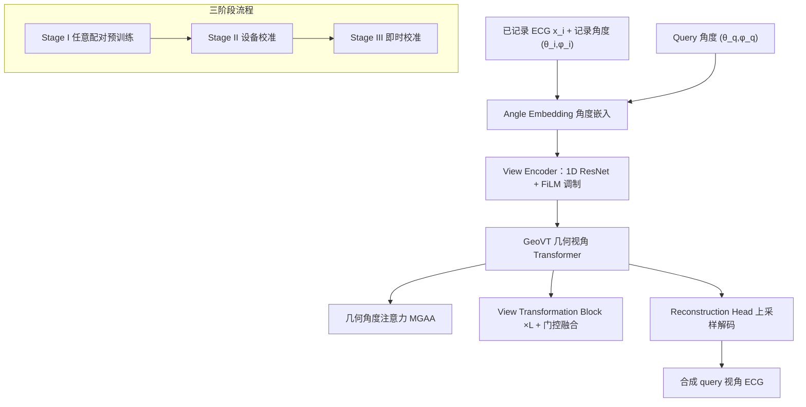

# Nef-Net v2: Adapting Electrocardio Panorama in the Wild

**会议**: ICLR 2026  
**OpenReview**: [https://openreview.net/forum?id=JzZhhhxniR](https://openreview.net/forum?id=JzZhhhxniR)  
**代码**: [https://github.com/HKUSTGZ-ML4Health-Lab/NEFNET-v2](https://github.com/HKUSTGZ-ML4Health-Lab/NEFNET-v2)  
**领域**: 医学信号生成 / ECG 新视角合成  
**关键词**: Electrocardio Panorama, ECG 视角合成, 几何注意力, 跨设备校准, 隐式心电场  

## 一句话总结
把"任意视角心电图合成"从理想实验室假设搬到真实临床：用几何视角 Transformer 做直接的视角到视角映射，配合三阶段（预训练→设备校准→即时校准）流程，解决长时程、跨设备、电极偏移三大落地难题，PSNR 比上一代 Nef-Net 高约 6 dB。

## 研究背景与动机
- **领域现状**：标准 12 导联 ECG 只能从固定解剖视角观测心脏电活动，而某些病变（如 Brugada 综合征、后壁心梗）需要非标准视角才能暴露关键诊断信号。Chen et al. (2021) 提出 **Electrocardio Panorama**（电心全景）概念，用隐式神经表示重建连续的"心电场"，从而虚拟观测任意视角的 ECG，初代方法称 Nef-Net。
- **现有痛点**：Nef-Net 停留在理想化假设下，难以落地——(1) 只能做单心拍重建，无法处理连续长时程信号；(2) 把不同视角特征简单平均，忽略各视角对目标视角的差异化相关性，少视角监督下重建模糊；(3) 不考虑设备间差异（传感器、信号处理管线）与个体间差异（电极放置偏移）；(4) 缺乏密集视角数据集，评测只能在 8/12 导联窄角设置下做，无法验证全心电场的泛化能力。
- **核心矛盾**：心电全景合成既要**信息丰富（任意视角）**，又要**在真实世界鲁棒（跨设备、抗电极偏移、长时程）**——初代的"共享几何先验 + 特征平均"建模在 in-the-wild 场景下精度崩塌。
- **本文目标**：构建可落地的全景 ECG 合成框架，支持任意长度、任意视角合成，泛化到不同 ECG 设备，并补偿操作者导致的电极放置偏差。
- **核心 idea**：**【重新表述任务】** 把视角合成从"重建共享心电场"改成**直接的成对视角到视角确定性映射**，再用**几何感知注意力**显式建模 query 视角与已记录视角之间的空间关系，配合**三阶段开发-部署流程**逐级补偿设备与个体偏差。

## 方法详解

### 整体框架
NEF-NET V2 把任意视角 ECG 合成建模为**视角到视角的直接变换**：给定 $l$ 路已记录单导联信号 $X=\{x_1,\dots,x_l\}$（各 $x_i\in\mathbb{R}^{1\times t}$）及其记录角度，与目标 query 角度，一步映射出 query 视角信号，不再像 Nef-Net 那样显式建模共享的心电场表示。架构含三个核心组件：Angle Embedding（角度嵌入）、View Encoder（视角编码器）、Geometric View Transformer（几何视角 Transformer, GeoVT）。落地侧再叠加三阶段训练/校准流程。

### 关键设计
**1. 几何视角 Transformer（GeoVT）：用角度相似度替代盲目特征平均**
针对 Nef-Net 把所有视角特征均匀平均、混入 query 无关信号导致模糊的弊病，GeoVT 用一个跨注意力模块 **MGAA** 显式比较 query 导联与已记录导联的角度嵌入，算出几何角度注意力图 $\text{GAA}=\text{softmax}\!\left(\frac{F_qW_q(F_kW_k)^\top}{\sqrt{d'}}\right)$，其中 $W_q,W_k\in\mathbb{R}^{d\times d'}$ 为可学习投影。这张注意力图衡量"哪些已记录视角在几何上更接近 query 视角"，从而选择性放大几何一致的特征、抑制无关信号。所有 View Transformation Block 共享同一张 GAA 图，既保证一致性又减少参数。由于不再维护重量级的心电场表示，整个 pipeline 反而更轻、参数更少。

**2. 分层视角变换块 + 空间门控融合：粗到细地搬运特征**
GeoVT 堆叠 $L$ 个 View Transformation Block，把已记录特征逐层迁移到 query 表示。第 $i$ 块先把记录特征投到角度隐空间 $F_v^{i+1}=\text{Linear}(F_v^i)$，再按 GAA 融合，并通过空间门控逐块累积：$F_o^{i+1}=F_o^i\odot(1-G_i)+\text{Ext.}(F_v^i\times\text{GAA})\odot G_i$，其中 $G_i$ 是带 sigmoid 的可学习门控参数，特征提取器 $\text{Ext.}$ 沿用 SE block 设计。门控让模型在每一层自适应决定保留多少旧特征、注入多少新变换特征，实现粗到细的特征精炼。Reconstruction Head 则用线性插值上采样 + 谱归一化 1D 卷积 + LayerNorm + GELU 把融合嵌入解回时域。View Encoder 端用 1D ResNet 提特征后，以 FiLM 仿射调制把 query 特征注入，放大与 $(\theta_q,\varphi_q)$ 对齐的信号、压制无关分量。

**3. 三阶段开发-部署流程：逐级吃掉设备与个体偏差**
为应对真实部署中的设备异质性与个体变异，方法把训练拆成三阶段。**Stage I 任意配对预训练（ANYPRE）**：把每个 case 的可用视角随机划成 recorded–query 两子集动态采样配对，全参数可训，用 MAE 损失 $L_{\text{MAE}}=\lVert\hat Y_i-Y_i\rVert_1$ 学习跨视角不变表示（两路肢体导联固定作为参考电位）。**Stage II 设备校准（D-CAL）**：在目标设备的所有配对上用 $L_{\text{MAE}}$ 微调，对齐特定硬件的特征分布偏移。**Stage III 即时校准（OF-CAL）**：真实记录角度 $(\theta_{\text{real}},\varphi_{\text{real}})$ 因电极放置变异与个体解剖差异常偏离理想角（Panobench 中标准差可达 $10.6°$），于是引入可学习角度偏差 $(d\theta,d\varphi)$，把理想角修正为 $(\theta+d\theta,\varphi+d\varphi)$；按临床 10 秒录制标准，用前 5 秒做校准，冻结 View Encoder 与 Reconstruction Head，只微调角度嵌入以适配个体偏移。

**4. Panobench：首个 48 导联密集视角心电全景基准**
为突破以往只有 8/12 视角导致评测不充分的局限，作者构建 Panobench——4,470 条 10 秒录制、每例 48 个视角（6 肢体导联 + 42 类胸前导联），每个视角都带 CT 测量的球坐标 $(\theta,\varphi)$。密集视角让模型能在"输入数 / 监督数 / 合成数"任意组合下被严格评测全心电场泛化能力，为临床转化提供高分辨率参照。

## 实验关键数据
数据集：PTB-XL、Tianchi、CPSC2018、ChinaDB 四个公开集 + 自建 Panobench，全部重采样到 500 Hz，8:2 划分。指标：PSNR↑ / SSIM↑。

### 主实验表格（重建 + 合成，括号内为 输入/重建/合成 视角数）

| 任务 | 方法 | ChinaDB PSNR | CPSC2018 PSNR | Tianchi PSNR | PTB-XL PSNR |
|---|---|---|---|---|---|
| 重建 (3,9) | EKGAN | 32.76 | 33.35 | 34.39 | 31.71 |
| 重建 (3,9) | Nef-Net | 29.59 | 29.12 | 31.44 | 30.22 |
| 重建 (3,9) | **NEF-NET V2** | **35.84** | **36.12** | **37.13** | **35.21** |
| 合成 (3,8,1) | Nef-Net | 25.24 | 26.72 | 27.92 | 24.10 |
| 合成 (3,8,1) | **NEF-NET V2** | **32.57** | **33.62** | **34.46** | **33.41** |
| 合成 (5,6,1) | Nef-Net | 26.06 | 26.11 | 28.01 | 25.37 |
| 合成 (5,6,1) | **NEF-NET V2** | **33.16** | **32.76** | **34.82** | **32.07** |

合成任务上相比 Nef-Net 普遍提升 6–9 dB；8-to-12 重建设置下与 EKGAN/SSSD 等 SOTA 接近持平。

### 消融实验表格（三阶段框架，合成 PSNR / SSIM）

| 阶段 | ChinaDB | CPSC2018 | Tianchi | PTB-XL |
|---|---|---|---|---|
| Any-Pairs Pretraining | 29.83 / 0.972 | 31.01 / 0.975 | 32.71 / 0.975 | 31.15 / 0.981 |
| + Device Calibration | 30.77 / 0.973 | 32.08 / 0.979 | 33.05 / 0.977 | 31.15 / 0.981 |
| + On-the-fly Calibration | **32.57 / 0.981** | **33.62 / 0.985** | **34.46 / 0.976** | **33.41 / 0.982** |

设备校准带来 0–1.07 dB 增益，即时校准再带来 1.75–2.74 dB——说明**个体解剖差异对全景质量的影响比设备差异更大**。

### 关键发现
- **少视角监督下优势最明显**：Nef-Net 因特征平均在稀疏监督时严重退化（Panobench 上 3 监督导联时 Syn 仅 21 dB），NEF-NET V2 借几何注意力保留诊断细节，同设置达 31–32 dB；随监督导联增多两者差距收窄。
- **病理信号保真**：在 CPSC2018 九类心脏病上平均 PSNR 提升 6.9 dB，房颤（AF）提升 7.3 dB，在 AF/I-AVB/PVC/STE 等病理样本上 margin 更大，说明合成不仅复现一般形态还保留关键病理特征。
- **输入视角数（3→7）几乎不影响重建/合成性能，而监督视角数才是关键变量**，重建性能可视为合成性能的上界。

## 亮点与洞察
- **范式转换很关键**：从"重建共享心电场"改成"直接视角到视角映射"，既简化 pipeline、降参数量，又规避了特征平均的根本缺陷——这是性能跃升的主因。
- **把临床落地拆成可操作的三级校准**，并用"前 5 秒校准 + 后 5 秒评估"巧妙复用临床标准 10 秒录制时长，工程上很优雅。
- **可学习角度偏差** $(d\theta,d\varphi)$ 是个轻量但击中要害的设计：直接把"电极放歪了多少"作为可优化量，回避了难以直接测量真实角度的困境。
- Panobench（48 导联 + CT 球坐标）本身是有价值的社区资产，把全景 ECG 评测从 12 导联推到密集视角。

## 局限与展望
- 合成与重建之间仍有明显 gap，说明生成完全未见视角依旧是根本难题，远未饱和。
- Panobench 规模（4,470 例）相对有限，48 导联 + CT 球坐标的采集成本高，外部可复现性受限。
- 即时校准依赖每位患者前 5 秒做在线微调，增加推理期开销，实时部署的延迟/算力代价文中未充分量化。
- 评测主要用 PSNR/SSIM 信号保真指标，"病理特征是否保留"多靠少量可视化定性说明，缺乏下游诊断任务（如分类 AUC）的端到端验证。

## 相关工作与启发
- **ECG 视角重建/合成谱系**：早期线性变换 → RNN/LSTM/CNN/CGAN 等非线性方法（只能恢复预定义已知导联），到 Electrocardio Panorama（Chen et al. 2021，首次条件化于视角角度合成任意未见视角）。本文是该全景路线在 in-the-wild 场景下的系统升级。
- **设计借鉴**：FiLM 仿射调制（Perez et al. 2018）、SE block（Hu et al. 2018）、谱归一化卷积（Miyato et al. 2018）、跨注意力机制——把通用视觉/生成模块迁移到 1D 心电信号。
- **启发**：把多导联 ECG 类比"多视角相机系统"是贯穿全文的核心直觉；"用几何先验引导注意力 + 分阶段域适应"的思路可推广到其他需要跨传感器/跨个体校准的生理信号合成任务。

## 评分
- **新颖性**: ⭐⭐⭐⭐ —— 任务重表述（视角到视角直接映射）+ 几何角度注意力 + 三阶段校准 + 48 导联新基准，组合创新扎实，虽非全新概念但落地视角的系统性升级有分量。
- **实验充分度**: ⭐⭐⭐⭐ —— 5 数据集、重建/合成双任务、跨病理类别、三阶段消融齐全；扣分在缺下游诊断任务端到端验证与即时校准开销量化。
- **写作质量**: ⭐⭐⭐⭐ —— 痛点-贡献-方法-实验逻辑清晰，图表完整，公式与设计动机交代到位。
- **价值**: ⭐⭐⭐⭐ —— 推动全景 ECG 从实验室走向临床可用，Panobench 与开源代码具社区价值，对心血管诊断有实际意义。

<!-- RELATED:START -->

## 相关论文

- [\[ICLR 2026\] HFSTI-Net: Hierarchical Frequency-spatial-temporal Interactions for Video Polyp Segmentation](hfsti-net_hierarchical_frequency-spatial-temporal_interactions_for_video_polyp_s.md)
- [\[CVPR 2026\] SD-FSMIS: Adapting Stable Diffusion for Few-Shot Medical Image Segmentation](../../CVPR2026/medical_imaging/sd_fsmis_adapting_stable_diffusion_for_few_shot_medical_image_segmentation.md)
- [\[ECCV 2024\] Chameleon: A Data-Efficient Generalist for Dense Visual Prediction in the Wild](../../ECCV2024/medical_imaging/chameleon_a_data-efficient_generalist_for_dense_visual_prediction_in_the_wild.md)
- [\[AAAI 2026\] MAISI-v2: Accelerated 3D High-Resolution Medical Image Synthesis with Rectified Flow and Region-specific Contrastive Loss](../../AAAI2026/medical_imaging/maisi-v2_accelerated_3d_high-resolution_medical_image_synthesis_with_rectified_f.md)
- [\[CVPR 2026\] PGR-Net: Prior-Guided ROI Reasoning Network for Brain Tumor MRI Segmentation](../../CVPR2026/medical_imaging/pgr-net_prior-guided_roi_reasoning_network_for_brain_tumor_mri_segmentation.md)

<!-- RELATED:END -->
