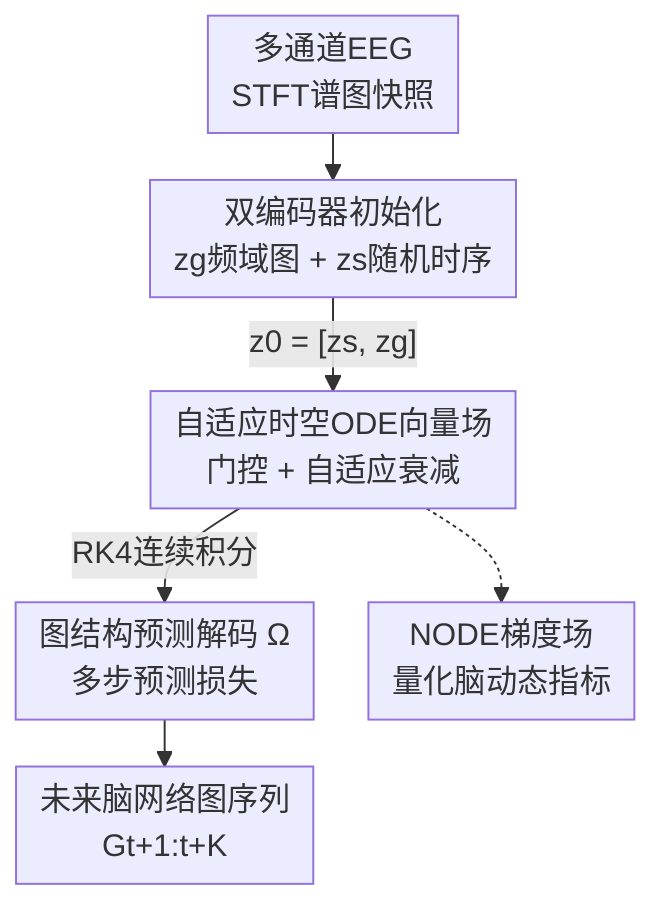

# ODEBRAIN: Continuous-Time EEG Graph for Modeling Dynamic Brain Networks

**会议**: ICLR 2026  
**OpenReview**: [https://openreview.net/forum?id=9EjZGs8ube](https://openreview.net/forum?id=9EjZGs8ube)  
**代码**: https://github.com/HHJIAnmo/ODEBRAIN (有)  
**领域**: 医学信号 / 脑电EEG / 动态脑网络建模  
**关键词**: Neural ODE, 脑网络, 连续时间建模, 时序图, 癫痫检测

## 一句话总结
ODEBRAIN 用神经常微分方程（NODE）把多通道 EEG 显式建模成"连续时间动态系统"，通过双编码器构造抗噪的初始状态 + 自适应时空向量场求解隐空间轨迹 + 图结构多步预测损失，在 TUSZ/TUAB 癫痫与异常 EEG 任务上显著超过离散循环类基线（F1 提升 6.0%、ACC 提升 8.1%）。

## 研究背景与动机

**领域现状**：用 EEG 建模大脑网络的动态活动是生物标志物发现与临床诊断的关键。近年主流做法是时序图网络（TGN）——把多通道 EEG 表示成图，用 GNN 抓空间依赖、用循环模型（RNN/DCRNN/GraphS4mer 等）抓时间动态，从而刻画脑网络的逐步演化。

**现有痛点**：这些方法都把 EEG 强行切成**固定的离散时间步**。可大脑活动本质是连续的，离散化强加了刚性的窗口假设，无法刻画连续展开的时间进程，也抓不住癫痫发作这类发生在"任意时刻"的不规则突变。更糟的是循环架构逐步外推，会累积复合的预测误差。

**核心矛盾**：EEG 的"连续、非平稳、瞬态、随机"本质 vs. 离散循环建模的"固定步长、状态转移必须卡在步点上"假设——两者根本对不上。

**本文目标**：把脑网络建模成一个显式的连续时间动态系统，并落到两个具体子问题上：(i) 给 NODE 一个能抵抗 EEG 瞬态与随机性的鲁棒初始状态 $z_0$；(ii) 给向量场 $f_\theta$ 一个能真正刻画底层神经动态、而非只做表层预测的学习目标。

**切入角度**：作者把 NODE 引入脑网络建模。NODE 直接参数化隐状态的导数并对时间连续积分 $z(t+1) = z_0 + \int_t^{t+1} f_\theta(t, z_t)\,dt$，天然不需要固定步长，能把离散采样的 EEG 看成底层连续过程 $\int f_\theta(t)\,dt$ 的采样观测，既能表达缓慢的振荡节律，又能表达突发跃迁。

**核心 idea**：首次把 EEG 脑网络显式表述为"一串随时间变化的图、其隐动态由 NODE 支配"，并配上抗噪初始化 + 自适应向量场 + 图结构预测目标，让连续轨迹既稳定又有临床可解释性。

## 方法详解

### 整体框架

ODEBRAIN 的输入是一段多通道 EEG 信号，输出是未来 $K$ 步随时间变化的脑网络图序列 $G_{t+1:t+K}$（下游再做癫痫/异常分类）。整条管线分两个阶段：**Stage 1 反向初始状态编码**把过去的 EEG 编成一个鲁棒初始状态 $z_0$；**Stage 2 前向时空 ODE 求解**用一个自适应向量场把 $z_0$ 沿时间连续积分出隐轨迹；最后**图嵌入预测解码器** $\Omega$ 把隐轨迹投回未来图节点，并用多步预测损失监督。

具体地，每段 EEG 先经短时傅里叶变换（STFT）转成谱图快照（频域强度作节点属性、邻接矩阵作边属性）。Stage 1 用**双编码器**分头处理：一路确定性地抓频域图结构得到 $z_g$，一路把原始 EEG 的随机性编成 $z_s$，拼成 $z_0 = [z_s, z_g]$。Stage 2 的向量场 $f_\theta$ 在残差块基础上加门控调制与自适应衰减，用 RK4 数值解器积分得到 $\{z_{t+1},\dots,z_{t+K}\}$。这条轨迹既是预测脑网络的来源，其梯度场 $f_\theta$ 本身又被当作量化脑动态（快/慢、方向、收敛中心）的指标。

### 关键设计

**1. 双编码器反向初始状态编码：给 NODE 一个抗噪的起点**

NODE 的轨迹完全从初始状态 $z_0$ 出发积分，一旦 $z_0$ 没编好，误差会沿时间传播并破坏长程动态；而 EEG 又高度随机甚至混沌，关键特征往往瞬态出现且毫无前兆。作者因此设计两路互补编码：确定性的**谱节点编码**用 GRU 分别在节点与边的谱属性序列上建模演化（$h_i^n = \mathrm{GRU}_{node}(X_{i,\le t})$、$h_{ij}^e = \mathrm{GRU}_{edge}(A_{ij,\le t})$），再由 GNN 聚合出图状态 $z_g = \mathrm{GNN}(h_i^n, h_{ij}^e)$，抓住频带间变化与通道相关性；**随机时序编码**则用描述子 $\Psi: \mathbb{R}^{T\times L}\mapsto \mathbb{R}^c$（$c\ll m$）把原始 EEG 段的随机性量化成 $z_s$，刻意引入受控随机性。两者拼成 $z_0 = [z_s, z_g]$。这么做的关键在于：纯确定性的隐表示缺乏表达瞬态运动的灵活性，而受控随机性等价于一种隐空间正则，能提升鲁棒性、防止过早收敛到次优解——消融里去掉随机正则后 F1 从 0.496 掉到 0.462，去掉它脑网络初始化就抗不住噪声。

**2. 自适应时空 ODE 向量场：让连续轨迹在噪声下保持稳定**

直接用深层网络当向量场 $f_\theta$ 去拟合高度多变的 EEG 状态，会带来很大的解器误差、轨迹发散。作者把向量场设计成残差块 + 门控 + 自适应衰减三件套：

$$f_\theta(z_0) = (g(z_0) + 1) \odot h(z_0) - \lambda(z_s)\,\frac{z_s}{z_0}$$

其中 $h(z_0)$ 是通用残差块给出的基础向量场，门控 $g(z_0) = \sigma(W_g z_0 + b_g) \in (0,1)^{m+c}$ 提供状态自适应的调制（哪个维度的动态该放大/抑制由当前状态决定）；最后一项是以随机时序状态 $z_s$ 为条件的**自适应衰减** $\lambda(z_s) = \mathrm{Softplus}(W_a^{(2)}\circ\tanh(W_s^{(1)} z_s + b_1) + b_2) > 0$，在噪声输入下把轨迹往回拉、做正则。隐轨迹用 RK4 解器积分 $z(t+\Delta t) = z(t) + \frac{\Delta t}{6}(k_1 + 2k_2 + 2k_3 + k_4)$。门控之所以有效：消融里去掉门控 AUROC 从 0.881 掉到 0.867，说明这种自适应调制是稳定轨迹演化的关键；而把门控换成"随机系数"版本仍不如可学习门控，证明是"学出来的"调制而非随机扰动在起作用。

**3. 图结构预测解码器 + 多步预测损失：把目标对准脑网络结构而非表层信号**

标准 NODE 训练只用回归式目标去预测未来状态，容易只学到表层时序、抓不住底层神经动态。作者认为神经元放电往往在异步的多个通道同时激活，所以学习目标应该是**预测图结构本身**而不是单纯的时序值。解码器 $\Omega: \mathbb{R}^{m+c}\mapsto \mathbb{R}^d$ 把每个时刻的隐状态投回未来 EEG 节点属性 $\hat{G}_{t+i} = \Omega(z_{t+i})$，并用多步图预测损失 $L_G = \mathbb{E}_G\lVert \hat{G}_{t+1:K} - G_{t+1:K}\rVert^2$ 显式监督未来不同时间步的脑网络。训练分两段：先用图预测损失无监督地学连续动态，再把整条隐轨迹池化后做下游分类微调。结构化的多步目标比"只重建"或"预测原始信号"都更好（消融见 Fig.7b），图相似度（GJI）从离散预测的 0.53 提到 0.63，说明它真的更准地还原了脑网络的局部连接结构。

**4. NODE 梯度场作为脑动态的量化指标：从"能预测"到"可解释"**

这是本文第一个提出的视角：把训练好的向量场 $f_\theta$（即 $dz/dt$）本身当作量化脑网络动态的度量。在隐空间里画出 $f_\theta$ 的方向、速度与收敛中心后，癫痫态会出现明显的"场中心"（梯度指向并最终收敛的区域，对应高频狂野振荡），而正常态/发作前态没有这种中心、由低频振荡主导。这种可视化只有连续动态建模才做得到，给临床提供了区分发作/非发作状态的几何刻画，把模型从一个黑盒预测器变成了能讲清"大脑动态怎么变"的工具。

### 损失函数 / 训练策略
无监督预训练阶段最小化多步图预测损失 $L_G = \mathbb{E}_G\lVert \hat{G}_{t+1:K} - G_{t+1:K}\rVert^2$，让 ODE 解器学到连续神经动态；之后把整条隐轨迹 $z(t)$ 跨全部时间步池化，做下游分类（如癫痫检测）微调。图构造采用 Top-$\tau=3$ 稀疏 + 范数/Graphical lasso 正则，缓解相关图的噪声与容积传导效应。

## 实验关键数据

### 主实验
TUSZ（12s 癫痫检测）与 TUAB（异常 EEG 分类）上对比离散循环类与连续 ODE 类基线。ODEBRAIN† 为连续多步预测、ODEBRAIN‡ 为连续单步预测。

| 数据集 | 指标 | ODEBRAIN‡ | 之前最好基线 | 提升 |
|--------|------|-----------|--------------|------|
| TUSZ | ACC | 0.877 | neural SDE 0.857 | +2.0% |
| TUSZ | F1 | 0.496 | GDEs 0.475 | +2.1% |
| TUSZ | AUROC | 0.881 | ODE-RNN 0.855 | +2.6% |
| TUAB | ACC | 0.778 | DCRNN/neuralSDE 0.768 | +1.0% |
| TUAB | F1 | 0.774 | DCRNN 0.769 | +0.5% |
| TUAB | AUROC | 0.857 | DCRNN 0.848 | +0.9% |

（摘要口径：相对最强基线在 TUSZ 上 F1/ACC 分别提升约 6.0%/8.1%，TUAB 上 F1/AUROC 约 1.2%/2.4%；上表为与各列第二名的逐项差，口径不同 ⚠️ 以原文为准。）长短horizon 对比中，60s 癫痫检测 ODEBRAIN 同样取得 AUROC 0.828 / F1 0.430，全面领先 DCRNN（0.802 / 0.413）与 latent-ODE（0.745 / 0.331）。

### 消融实验

| 配置 | TUSZ AUROC | TUSZ F1 | 说明 |
|------|-----------|---------|------|
| Full model | 0.881 | 0.496 | 完整模型 |
| − Gate（去门控） | 0.867 | 0.488 | 去自适应门控，轨迹稳定性下降 |
| − Stochastic（去随机正则） | 0.848 | 0.462 | 去随机正则，抗噪能力下降 |
| +Random（随机系数门控） | 0.860 | 0.474 | 随机替代可学习正则，仍不如完整模型 |

初始状态消融（Fig.7a）：时空联合初始化 AUROC 0.877 > 仅空间 0.862 > 混合 0.851，且在最长 11s horizon 上增益最大；损失目标消融（Fig.7b）：结构化多步预测损失全面优于"仅重建"和"预测原始信号"。

### 关键发现
- 门控与随机正则是两根支柱：去门控掉 1.4 个点（轨迹稳定性），去随机正则掉 3.4 个点 F1（抗噪），两者缺一不可，且都需"可学习"而非随机替代。
- 时空联合初始化在长 horizon 上优势最明显，印证好的 $z_0$ 对长程连续积分的决定性作用。
- 计算成本不高：ODEBRAIN 459K 参数、164 NFEs、0.516s/batch，与固定深度的离散模型同一延迟档；NFEs 比 ODE-RNN(189)/neural SDE(153) 更少，说明积分更稳定。
- 图构造对 Top-$\tau=3$ 稀疏 + 正则敏感：加正则后 Recall 提升，证明范数相关图含噪、易受容积传导影响，稀疏正则连接更可靠。

## 亮点与洞察
- **把"离散切窗"的隐含假设挑明并替换**：作者点出 TGN 一直在用固定时间步，与脑活动连续本质冲突——这个被忽略的问题陈述本身就很有价值，NODE 的引入顺理成章。
- **双编码器解耦"确定性结构"与"随机性"**：用 $z_g$ 抓频域图结构、$z_s$ 注入受控随机当隐空间正则，这种"确定 + 随机"拼接初始状态的思路可迁移到任何噪声大的时序-图任务。
- **向量场即可解释性**：把 $f_\theta$ 的梯度场（方向/速度/收敛中心）直接当临床指标，是"连续建模"独有的红利，离散方法做不到——这是最让人"啊哈"的点。
- **目标从信号转向图结构**：预测脑网络结构而非时序值，契合神经元异步同时激活的生理事实，GJI 0.53→0.63 的提升说明这个目标选得对。

## 局限与展望
- 作者承认：虽然隐动态是连续时间的，但输入与监督仍基于切段（epoched）信号，限制了真正的长程连续建模。
- 泛化性待验证：目前只在癫痫/异常 EEG 上测，对其他神经疾病或认知任务的迁移尚未探索。
- 自己发现：向量场 $f_\theta$ 公式里 $-\lambda(z_s)\frac{z_s}{z_0}$ 的逐元素除法、以及衰减项的具体维度对齐，论文写得偏简，复现需对照代码 ⚠️ 以原文为准；图相似度评估依赖 Top-$\tau=3$ 稀疏构图，对图构造选择存在一定依赖。
- 改进思路：把监督也搬到连续时间（如对不规则采样直接积分监督），或把梯度场指标做成显式的临床生物标志物量表。

## 相关工作与启发
- **vs DCRNN / EvoBrain（离散 TGN）**: 他们用循环架构在固定离散步上建模脑网络逐步转移，本文用 NODE 连续积分，区别在于不再假设状态转移卡在步点上；优势是抓得住任意时刻的瞬态突变、且不累积复合误差。
- **vs latent-ODE / ODE-RNN / neural SDE / GDEs（连续基线）**: 它们多为通用时序或单一机制（如 SDE 的随机正则、GDE 的图定义），本文针对 EEG 专门设计抗噪双编码器初始化 + 门控自适应向量场 + 图结构预测目标，在 TUSZ/TUAB 上一致更好且 NFEs 更少（积分更稳）。
- **vs 既有脑动态 NODE 工作（Cai 2023 / Han 2024 / Chen 2024）**: 它们多聚焦影像数据或神经元特征工程、或从预定义认知状态出发，本文首次从 EEG 数据驱动地把脑网络建成连续时间图动态系统。

## 评分
- 新颖性: ⭐⭐⭐⭐⭐ 首次把 EEG 脑网络显式表述为 NODE 支配的连续时间图动态系统，并把梯度场当临床指标。
- 实验充分度: ⭐⭐⭐⭐ 两数据集 + 多基线 + 初始化/损失/horizon/正则多维消融 + 计算成本，但任务仍限于癫痫/异常 EEG。
- 写作质量: ⭐⭐⭐⭐ 问题陈述清晰、图示直观，少数公式（向量场衰减项）记号偏简需对照代码。
- 价值: ⭐⭐⭐⭐⭐ 连续脑网络建模 + 可解释向量场对临床 EEG 分析有实际意义，方法范式可迁移到其他噪声时序-图任务。

<!-- RELATED:START -->

## 相关论文

- [\[NeurIPS 2025\] EvoBrain: Dynamic Multi-Channel EEG Graph Modeling for Time-Evolving Brain Networks](../../NeurIPS2025/medical_imaging/evobrain_dynamic_multi-channel_eeg_graph_modeling_for_time-evolving_brain_networ.md)
- [\[ICLR 2026\] Inference-Time Dynamic Modality Selection for Incomplete Multimodal Classification](inference-time_dynamic_modality_selection_for_incomplete_multimodal_classificati.md)
- [\[ICLR 2026\] Lightweight Transformer for EEG Classification via Balanced Signed Graph Algorithm Unrolling](lightweight_transformer_for_eeg_classification_via_balanced_signed_graph_algorit.md)
- [\[ICLR 2026\] CRONOS: Continuous time reconstruction for 4D medical longitudinal series](cronos_continuous_time_reconstruction_for_4d_medical_longitudinal_series.md)
- [\[ICLR 2026\] Functional MRI Time Series Generation via Wavelet-Based Image Transform and Spectral Flow Matching for Brain Disorder Identification](functional_mri_time_series_generation_via_wavelet-based_image_transform_and_spec.md)

<!-- RELATED:END -->
