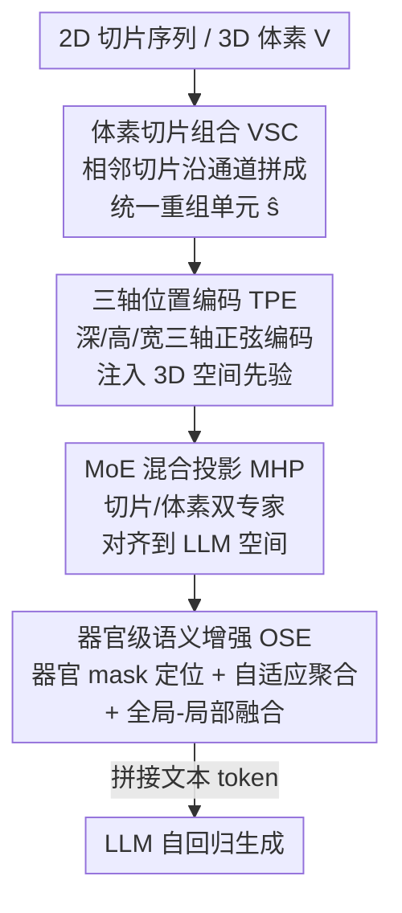

# OmniCT: Towards a Unified Slice-Volume LVLM for Comprehensive CT Analysis

**会议**: ICLR 2026  
**OpenReview**: [https://openreview.net/forum?id=nrZI64gTvC](https://openreview.net/forum?id=nrZI64gTvC)  
**代码**: https://github.com/ZJU4HealthCare/OmniCT  
**领域**: 医学图像 / 多模态VLM  
**关键词**: CT 理解, 切片-体素统一, 大视觉语言模型, 器官级语义, 医学评测基准

## 一句话总结
OmniCT 用一套「切片组合 + 三轴位置编码 + MoE 混合投影」的空间一致性增强（SCE）把 2D 切片和 3D 体素统一进同一个 LVLM 的 token 空间，再用器官级语义增强（OSE）把解剖区域显式注入表征，配上 170 万样本的 MedEval-CT 数据集与混合基准，在切片驱动和体素驱动两类 CT 任务上都大幅超过现有医学/通用 LVLM（7B 切片平均 81.45，体素平均 66.15）。

## 研究背景与动机

**领域现状**：CT 是临床信息密度最高、覆盖心肺肝肠等关键脏器的成像方式，其诊断同时依赖两类线索——切片级局部特征（亚厘米级肺结节、病灶边界）和体素级空间表征（肿瘤浸润范围、器官间解剖关系）。现有医学 LVLM 几乎都只盯着其中一类：要么处理 2D 切片，要么处理 3D 体素。

**现有痛点**：切片驱动模型受益于大规模 2D 预训练，视觉-语言对齐强、泛化好，但**缺乏跨切片的空间一致性**，看不出体素里的整体结构关系；体素驱动模型显式建模 voxel 级空间结构，擅长整体空间和器官级推理，但**对细粒度异常和边界形态不敏感**，而且架构很难兼容切片输入。两条技术路线长期割裂。

**核心矛盾**：CT 诊断本质上需要「微观细节敏感性 + 宏观空间推理」二者兼得，但单一维度建模满足不了双重需求。缺一个统一建模范式，正是医学 LVLM 临床落地的主要瓶颈。此外评测层面也缺位——现有医学基准多走「泛多模态能力」路线，对 CT 解读的任务对齐度和临床代表性都不够。

**本文目标**：① 在一个框架里融合 2D/3D 的互补优势，既保留 2D 对齐的泛化与效率，又注入 3D 空间结构感知；② 把临床上「以器官为单位读片」的先验显式编码进表征；③ 建一套专为 CT 的统一数据集 + 基准 + 工具链。

**切入角度**：作者观察到，如果能把切片和体素都重新组织成「统一的重组单元」喂给同一个视觉编码器，并在 token 上注入三维位置先验，就能在**不破坏 2D 兼容性**的前提下让模型获得体素感知；再叠加器官 mask 的区域选择，就能把临床读片的器官视角加进去。

**核心 idea**：用「体素切片组合 + 三轴位置编码 + MoE 混合投影」把切片和体素统一进同一个 token 空间（SCE），再用「器官区域定位 + 自适应聚合 + 上下文融合」注入器官级语义（OSE），形成一个切片-体素通吃的统一 LVLM。

## 方法详解

### 整体框架
OmniCT 的输入可以是独立的 2D 切片序列，也可以是完整的 3D 体素 $V \in \mathbb{R}^{D \times H \times W}$；无论哪种，第一步都被规整成统一的「重组单元」喂进视觉编码器，最终拼接文本 token 送进 LLM 做自回归生成。整条管线分两大功能块：**SCE（空间一致性增强）** 负责把切片/体素统一进 token 空间并注入 3D 空间先验，**OSE（器官级语义增强）** 负责在统一表征上叠加器官区域语义。两块串行：先经 SCE 得到带空间感知的统一视觉 token $\hat{F}$，OSE 在其上做器官选择与聚合，得到全局-局部融合的 $\hat{F}_{\text{OSE}}$，再与文本 embedding 拼接喂给 LLM。

SCE 内部又分三步：Volumetric Slice Composition（VSC）把相邻切片沿通道拼成局部一致的体素单元；Tri-Axial Positional Embedding（TPE）给 patch token 注入深/高/宽三轴的正弦位置编码；MoE Hybrid Projection（MHP）通过切片/体素双专家把视觉特征对齐到 LLM 空间。OSE 则分三步：用 TotalSegmentator 产生的器官 mask 做解剖区域定位、对长度不一的器官 token 做自适应聚合、再与全局视觉 token 做上下文融合。

### 关键设计

**1. 体素切片组合 VSC：用通道维拼接把切片和体素统一成同一种输入单元**

要让一个模型同时吃切片和体素，最大的障碍是两者输入形状和语义不一致。VSC 的做法是：对 3D 体素，沿 $z$ 轴把相邻三张切片拼到通道维，构造局部一致的体素单元 $\hat{s}_i = \text{Concat}(V_{3i-2}, V_{3i-1}, V_{3i})$，$i = 1, \dots, \lfloor D/3 \rfloor$，每个 $\hat{s}_i \in \mathbb{R}^{3 \times H \times W}$ 保留了跨切片的空间过渡；对独立的 2D 切片 $s_i \in \mathbb{R}^{1 \times H \times W}$，则直接沿通道复制成 $3 \times H \times W$。这样切片和体素都被统一成同一系列 $3 \times H \times W$ 的重组单元 $\hat{S} = \{\hat{s}_i\}$，可以走完全相同的后续编码路径。和通用 LVLM 靠帧采样、关键帧堆叠的做法不同，VSC 是**结构化地保留相邻切片的上下文空间连续性**，而不是简单丢帧，这正是「跨切片空间一致性」的来源。

**2. 三轴位置编码 TPE：给 patch token 注入深/高/宽三维位置，让模型有体素感知又不破坏切片兼容**

重组单元过视觉编码器 $\phi_v$ 得到 patch token $F \in \mathbb{R}^{N_s \times H' \times W' \times d_v}$（patch 大小 $3 \times K \times K$，$H' = H/K$）。光有 patch 特征还看不出三维结构，TPE 沿深度 $N_s$、高 $H'$、宽 $W'$ 三个轴各构造正弦位置编码 $P = \{P^{N_s}, P^{H'}, P^{W'}\}$，沿特征维拼接到 token 上：

$$Z = F \oplus P^{N_s} \oplus P^{H'} \oplus P^{W'}, \quad Z \in \mathbb{R}^{N_s \times H' \times W' \times (d_v + d_z + d_y + d_x)}$$

这里把 $N_s$（重组单元数）当作新的「深度维」，于是三轴编码就显式给了全局体素感知。妙在它是 concat 而非改 patch 结构，所以对切片输入（$N_s$ 退化、单元数变化）天然兼容，不需要为 2D/3D 各设计一套位置方案。

**3. MoE 混合投影 MHP：切片/体素双专家路由，把两种模态对齐进同一个 LLM 语义空间**

体素输入的 token 量极大、冗余高，直接投影会爆 token。MHP 先做 token 级 unshuffle，把空间相邻的 $m \times m$ token 聚成更紧凑的表征 $\hat{Z}$（切片输入设 $m=1$ 保留原分辨率），再用一个切片-体素混合专家投影：

$$\hat{F} = \psi(\hat{Z} \mid \theta_p) = W_{\text{share}} \, \sigma(W_s \hat{Z} \cdot \mathbb{1}_{\text{slice}} + W_v \hat{Z} \cdot \mathbb{1}_{\text{volume}})$$

其中 $\sigma$ 是 GELU，$\mathbb{1}_{\text{slice}}$、$\mathbb{1}_{\text{volume}}$ 是切片/体素的二值路由指示。直白说：切片走 $W_s$ 专家、体素走 $W_v$ 专家，再共享 $W_{\text{share}}$ 对齐到 LLM 空间。这样既缓解了体素的 token 爆炸，又让两种模态在同一塔（single-tower）语义空间里统一——消融里特意把 VSC 和 MHP 固定，因为它俩是耦合 2D/3D 的「地基」，正是这套设计让单模态训练学到的投影模式能在切片↔体素间互相迁移。

**4. 器官级语义增强 OSE：用器官 mask 显式选区 + 自适应聚合，把临床「以器官读片」的先验注入表征**

临床读片是以器官为单位做观察和病灶定位的，而 CT 体素常 >150 张切片、面内 512×512，病灶却只占很小局部，全局 token 容易淹没细节。OSE 分三步解决：① **解剖区域定位**——用 TotalSegmentator 生成含 117 个解剖结构的器官 mask $M_o$，按像素-token 的缩放关系映射到 token 尺寸，做 mask 索引 $\hat{F}_o = \hat{F}[\hat{M}_o]$ 选出器官专属 token；② **自适应器官级聚合**——不同器官 token 长度差异巨大，直接和文本拼会严重长度失衡，于是用固定维度的判别式聚合 $\hat{f}_o = \text{Agg}(\hat{F}_o) \in \mathbb{R}^{L_c \times d_h}$ 压到统一长度 $L_c$，关键是它带「放大效应」（小器官细节被放大、增强细粒度病灶特征）和「压缩效应」（大器官/全局区域被压缩、减冗余）；③ **上下文融合**——把器官聚合表征和全局视觉 token 拼成 $\hat{F}_{\text{OSE}} = [\hat{F}; \hat{f}_o]$，兼顾局部判别力和全局上下文。这一设计让模型在保留整体覆盖的同时，把诊断最相关的小结构「放大」出来，提升了临床任务的相关性和可解释性。

### 损失函数 / 训练策略
两个增强模块产出医学视觉特征 $\hat{F}_{\text{OSE}} \in \mathbb{R}^{(L+L_c) \times d_h}$，与文本 query 的 embedding $E$ 拼成统一输入 $T = [\hat{F}_{\text{OSE}}; E]$ 喂进 LLM，优化标准自回归交叉熵：

$$\min_{\theta} \; \mathbb{E}_{(T, y) \sim D} \left[ -\sum_{t=1}^{N_y} \log P(y_t \mid y_{<t}; T; \theta) \right]$$

分两阶段：预训练阶段只训投影参数 $\theta = \{\theta_p\}$；指令微调阶段同时训投影和 LLM $\theta = \{\theta_p, \theta_{\text{llm}}\}$。模型提供 3B 和 7B 两个规模。

## 实验关键数据

### 主实验
切片驱动（2D）在 SLAKE / VQA-RAD / OmniMedVQA / RadFig-VQA 上评测，体素驱动（3D）在 M3D / CT-RATE / 3D-RAD 上评测。

| 设定 | 指标 | OmniCT-7B | 次优 | 提升 |
|--------|------|------|----------|------|
| 2D 切片 4 基准均值 | Avg. | **81.45** | Lingshu-7B 70.44 | +11.01 |
| 3D 体素 3 基准均值 | Avg. | **66.15** | CT-CHAT 35.97 | +30 以上 |
| RadFig-VQA Task1/Task2 | Acc | 97.97 / 98.70 | GPT-5 67.00 / 69.10 | 大幅领先 |

OmniCT-3B 同样强：切片均值 77.71、体素均值 63.48，单看 CT-RATE 多选达 87.38。对照里 RadFM（号称切片+体素通吃）切片均值仅 32.12，体素驱动模型（M3D-LaMed、CT-CHAT）虽在个别子任务（CT-CHAT 在 CT-RATE 多选 86.46）很强，但整体均值都 <36，凸显覆盖面和稳定性不足。

### 消融实验
固定 VSC 和 MHP（视为 2D/3D 耦合地基），单独分析 SCE 与 OSE：

| 配置 | 2D 公开 | 3D 公开 | MedEval Organ | MedEval Task | Avg. |
|------|------|------|------|------|------|
| baseline | 78.68 | 62.17 | 76.51 | 78.41 | 77.62 |
| + SCE | 80.14 | 63.68 | 76.79 | 78.69 | 78.06 |
| + OSE | 80.74 | 65.37 | 77.02 | 79.42 | 78.62 |
| + SCE + OSE（Full） | **81.45** | **66.15** | **78.24** | **80.27** | **79.62** |

### 关键发现
- SCE 和 OSE 互补且都正向：单独加各有提升，组合最优；两者在**体素驱动任务上增益更明显**（3D 从 62.17 → 66.15），说明空间一致性和器官语义对 3D 感知更关键。
- MHP 是协同 2D/3D 的核心：作者归因「单塔统一语义空间 + MHP」让切片学到的投影模式能自然迁移到体素、反之亦然——这也解释了为何 OmniCT 在单模态训练下仍表现强、在不同混合数据比例下都稳居最优。
- 报告生成上用微调 RadBERT 做 18 类异常标签预测，OmniCT 超过多数体素驱动 CT 模型与既有统一模型，与专为 CT 体素报告设计的模型相当。

## 亮点与洞察
- **「通道拼接 + 三轴位置编码」是低成本统一切片/体素的巧招**：不改视觉编码器、不为 2D/3D 各设计一套架构，仅靠把相邻切片拼通道 + concat 三维位置编码，就让同一条路径既兼容切片又获得体素感知，工程上很轻。
- **双专家 MoE 投影 + 单塔语义空间带来跨模态迁移**：切片/体素各走一个专家、共享投影头，使得单模态训练的能力能迁移到另一模态，这对医学场景里切片/体素数据分布不均（本文 16.3% vs 83.7%）尤其实用。
- **器官聚合的「放大-压缩」效应**直击 CT「病灶占比极小」痛点：用分割 mask 做 token 选区再自适应压到固定长度，小器官被放大、大区域被压缩，既解决长度失衡又保住细粒度病灶——这种「显式注入临床读片先验」的思路可迁移到其他以解剖结构为中心的医学影像任务。
- **MedEval-CT 三件套（Dataset / Bench / Factory）** 把数据、基准、评测工具链institutionalize：170 万 VQA、7 类任务、4 类临床难度、13 器官，外加统一处理 DICOM/NIfTI/数组/切片序列和多层评测协议（统计/语义/LLM 评判），对后续工作是可复用的基础设施。

## 局限与展望
- 器官定位依赖 TotalSegmentator 的外部分割 mask，OSE 的质量会受分割精度上限制约；mask 错误或覆盖不到的结构（罕见解剖/严重病变变形）可能拖累器官级语义。
- VSC 固定按 3 张相邻切片沿通道拼接，组数 $\lfloor D/3 \rfloor$，对各向异性层厚或超薄/超厚扫描，「3 张一组」的空间一致性假设是否稳健、最优组数是否随分辨率变化，文中未深入讨论。
- 评测以本文自建的 MedEval-CT 为主，虽也覆盖公开基准，但「最大 CT 数据集 + 自建基准 + 强基线」三者同源，跨机构、跨设备的真实临床泛化仍需外部验证。
- 报告生成只用 18 类异常标签预测做代理评估，未充分体现长文本报告的临床完整性与事实一致性。

## 相关工作与启发
- **vs 切片驱动医学 LVLM（HealthGPT / HuatuoGPT-V / Lingshu / RadFM）**：它们靠 2D 预训练拿到强对齐与泛化，但缺跨切片一致性；OmniCT 通过 VSC+TPE 在保留 2D 兼容的同时补上体素感知，切片均值反超 Lingshu +11.01。
- **vs 体素驱动医学 LVLM（M3D-LaMed / CT-CHAT）**：它们显式建模 voxel 但对细粒度异常不敏感、难适配切片任务、整体均值 <36；OmniCT 用统一框架兼顾微观细节与宏观空间，体素均值 66.15 大幅领先。
- **vs 通用 LVLM（InternVL3 / Qwen2.5-VL / GPT-5）**：它们语言推理强、个别子任务（GPT-5 在 3D-RAD）领先，但缺 CT 域适配、表现不稳定；OmniCT 的领域专精与统一建模带来全面且稳定的优势。

## 评分
- 新颖性: ⭐⭐⭐⭐ 切片-体素统一范式 + 双专家投影 + 器官级显式注入，工程组合新颖且针对性强，单点创新偏「巧」而非「奇」。
- 实验充分度: ⭐⭐⭐⭐⭐ 覆盖 2D/3D 七大基准、3B/7B 双规模、SCE/OSE 消融、混合数据与报告生成专项分析，证据链完整。
- 写作质量: ⭐⭐⭐⭐ 结构清晰、公式与模块对应明确，部分概念（聚合函数 Agg 具体形式）描述较略。
- 价值: ⭐⭐⭐⭐⭐ 统一范式 + 170 万样本数据集 + 评测工具链，对 CT 医学 LVLM 的临床落地与后续研究都是强基础设施。

<!-- RELATED:START -->

## 相关论文

- [\[ICLR 2026\] Unified Brain Surface and Volume Registration](unified_brain_surface_and_volume_registration.md)
- [\[AAAI 2026\] GuideGen: A Text-Guided Framework for Paired Full-Torso Anatomy and CT Volume Generation](../../AAAI2026/medical_imaging/guidegen_a_text-guided_framework_for_paired_full-torso_anatomy_and_ct_volume_gen.md)
- [\[CVPR 2026\] GaussianPile: A Unified Sparse Gaussian Splatting Framework for Slice-based Volumetric Reconstruction](../../CVPR2026/medical_imaging/gaussianpile_a_unified_sparse_gaussian_splatting_framework_for_slice-based_volum.md)
- [\[ICLR 2026\] Improving 2D Diffusion Models for 3D Medical Imaging with Inter-Slice Consistent Stochasticity](improving_2d_diffusion_models_for_3d_medical_imaging_with_inter-slice_consistent.md)
- [\[CVPR 2026\] OmniBrainBench: A Comprehensive Multimodal Benchmark for Brain Imaging Analysis Across Multi-stage Clinical Tasks](../../CVPR2026/medical_imaging/omnibrainbench_a_comprehensive_multimodal_benchmark_for_brain_imaging_analysis_a.md)

<!-- RELATED:END -->
