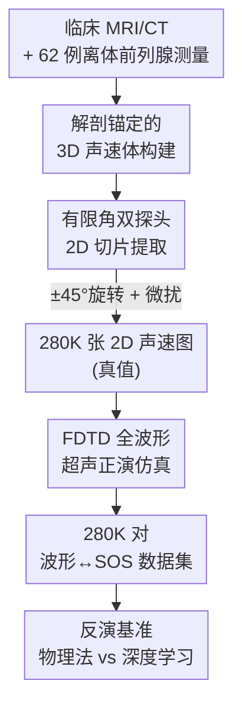

# OpenPros: A Large-Scale Dataset for Limited View Prostate Ultrasound Computed Tomography

**会议**: ICLR 2026  
**OpenReview**: [https://openreview.net/forum?id=kcFEpBagea](https://openreview.net/forum?id=kcFEpBagea)  
**代码**: https://open-pros.github.io/ （数据集与求解器开源）  
**领域**: 医学图像 / 数据集与基准  
**关键词**: 前列腺USCT, 有限角重建, 声速反演, 全波形仿真, 逆问题基准

## 一句话总结
本文构建了首个面向有限角前列腺超声计算机断层（USCT）的大规模数据集 OpenPros——基于真实临床 MRI/CT 和离体前列腺测量造出解剖逼真的 3D 声速体，切片得到 28 万对 2D 声速图与全波形超声数据，并配套开源 FDTD 求解器与一套物理法/深度学习的反演基准，揭示出深度模型虽快且准但仍无法解析前列腺内部细结构、跨病人泛化也未解决。

## 研究背景与动机
**领域现状**：前列腺癌是男性高发且高致死的肿瘤，早筛至关重要。当前临床主力影像 mpMRI 准确但昂贵、可及性差；常规经直肠超声（TRUS）便宜实时，但对临床显著肿瘤的灵敏度只有 30%–50%，前部/尖部病灶常漏检。超声计算机断层（USCT）能重建声速（SOS）、衰减等定量组织参数，作为潜在恶性生物标志物，被视为有前景的替代方案。

**现有痛点**：前列腺的解剖位置决定了采集只能放在经直肠和经腹两个受限位置，形成稀疏、角度受限的「有限角」数据；加上组织异质性强、紧邻膀胱与骨盆骨结构，传统基于物理的反演收敛慢、病态严重、伪影重，单样本动辄数小时到一天。更关键的是——领域里**根本没有**大规模、解剖精确、含骨结构与有限角配置的前列腺 USCT 数据集，现有 USCT 数据几乎都是乳腺、且不含骨、不模拟有限角，无法支撑算法开发与公平比较。

**核心矛盾**：算法进步依赖高保真配对数据（声速图 ↔ 全波形信号），而真实临床 USCT 系统（仅 SoftVue、QTscan 获 FDA 批准）都是全角度乳腺设备、硬件不适配前列腺，拿不到这种配对数据；纯合成数据又缺乏解剖真实性。

**本文目标**：造出一个既解剖真实、又物理可信、还覆盖有限角与含骨场景的大规模配对数据集，并给出统一的反演基准协议（效率 / 精度 / 泛化 / 鲁棒）。

**切入角度**：用真实临床扫描和离体测量「锚定」解剖与声速分布，把昂贵的真实数据当模板，再用高精度波动方程求解器批量仿真出全波形信号，从而以可控成本规模化生产配对样本。

**核心 idea**：用「真实解剖 3D 声速体 → 临床受限探头切 2D → FDTD 正演波场」三段流水线，把 4 例临床扫描 + 62 例离体前列腺扩展成 28 万对有限角 USCT 训练样本，并配套开源求解器与基准。

## 方法详解

### 整体框架
OpenPros 不是一个新模型，而是一条**数据生成 + 基准评测的流水线**。输入是真实临床 MRI/CT 和离体前列腺的超声测量，输出是 28 万对「2D 声速图（真值）↔ 40 通道全波形超声信号」以及一套反演基准。整体分四步：先把临床扫描经专家标注、并融合离体测得的 SOS，组装成解剖逼真的 3D 声速体；再在临床真实的双探头几何下按 ±45° 旋转切片，得到大量 2D 声速图；然后用四阶空间/二阶时间的 FDTD 求解器对每张 2D 图正演声波传播，记录 20 源 × 322 收的波场；最后在这套数据上系统比较物理法与深度学习反演，并设计 ID/OOD/加噪等评测协议。

### 关键设计

**1. 解剖锚定的 3D 声速体构建：让仿真数据带上真实解剖与真实声速**

纯合成体缺解剖真实性，是过往 USCT 数据集的硬伤。本文用多模态真实数据「锚定」每一处组织：主要器官在 T2 加权 MRI 上由专家标注，脂肪从 T1 加权 MRI 分割，骨从 X 射线 CT 分割，而前列腺本身的声速与衰减来自 62 例离体样本在 QT 扫描仪上的真实测量，其余器官声速取自 ITIS 组织数据库。为模拟组织内部异质性，作者不给每类组织赋一个常数，而是用数据库给出的均值与标准差，按**高斯分布** $c \sim \mathcal{N}(\mu_{\text{tissue}}, \sigma_{\text{tissue}}^2)$ 在体素级随机赋值声速。这样既保住了解剖结构（含膀胱、骨盆骨这些乳腺数据里没有的难点），又让前列腺区域的声速分布贴近真实测量，最大化保真度并降低对纯合成的依赖。

**2. 有限角双探头 2D 切片：把临床受限采集几何「刻」进数据**

USCT 算法的难点在于有限角，所以数据必须如实复现这种受限。作者在 3D 体内放置两个临床真实探头——一个经直肠探头插在直肠内、一个经腹探头贴在体表，然后在 ±45° 的旋转范围内加小幅随机扰动采截面，得到 28 万张 2D 声速图。每张图固定为 401 × 161 网格、物理视场 60 mm（横向）× 150 mm（轴向）、网格间距 0.375 mm，对应前列腺及周围结构的真实尺度。关键在于：源和收只分布在网格上下边界（而非环绕全域），这正是前列腺解剖决定的稀疏、角度受限条件——数据从生成时就内建了这个病态难点，而不是后期人为裁剪。

**3. 高保真 FDTD 全波形正演：用开源求解器规模化生产配对信号**

有了真值声速图 $c$，还需要对应的观测波形 $p$。正演由声波方程 $\nabla^2 p - \tfrac{1}{c^2}\tfrac{\partial^2 p}{\partial t^2} = s$ 支配，本文用四阶空间精度、二阶时间精度的 FDTD 求解器数值求解，在精度与算力间取得平衡。激励用 1 MHz 峰频的 Ricker 子波（贴合临床换能器），每个样本布 20 个源（上下边界各 10 个）、每源 322 个接收点，记录 1000 个时间步（$\Delta t = 10^{-7}$ s，共 100 µs），并加 120 网格点吸收边界抑制虚假反射。最终每个样本的超声数据是 40 通道，按探头组合划分：体表发/体表收（0–9）、体表发/直肠收（10–19）、直肠发/直肠收（20–29）、直肠发/体表收（30–39），覆盖经腹与经直肠两条成像路径的透射与反射。求解器（FDTD 与 Runge-Kutta 隐式迭代）随数据集一并开源，保证可复现。

**4. 多维反演基准协议：不只比精度，更要逼出泛化与鲁棒的短板**

数据集的价值在于能公平、系统地暴露方法短板。本文设计了覆盖三大核心问题的基准：推理效率、重建精度、分布外（OOD）泛化。被测方法含两类物理法（Delay-and-Sum 波束形成、三阶段多频 USCT 反演）与两类深度模型（全卷积 InversionNet、把 [S,T,R] 波形张量切时空 patch 做自注意力的 ViT-Inversion）。评测用 MAE/RMSE（数值保真）与 SSIM/PCC（结构对齐）四个指标，并刻意设计三种 OOD 切分——病人级（留出整个未见病人 3_04）、留一前列腺、组合切分——以及加高斯噪声（$\sigma \in \{0.01, 0.02, 0.05\}$）的鲁棒性测试。这套协议的关键在于区分「同病人内插」与「跨病人外推」，从而把当前方法「看着准、其实跨病人就崩」的问题量化出来。

### 损失函数 / 训练策略
反演被表述为监督学习问题 $\min_\theta \mathbb{E}_{p,c}[\mathcal{L}(c, \hat{c})]$，其中 $\hat{c} = f_\theta^{-1}(p)$ 是深度网络对逆映射 $c = f^{-1}(p)$ 的近似。训练目标常用 MAE/RMSE 等量化指标。ID 实验按切片级 90%/10% 随机划分（不强制病人互斥，刻意测内插）；OOD 实验则按病人/前列腺划分以测外推。

## 实验关键数据

### 主实验（同分布 ID）

| 方法 | MAE↓ | RMSE↓ | SSIM↑ | PCC↑ | 单样本推理 |
|------|------|-------|-------|------|-----------|
| 物理法 USCT（多频） | — | ≈0.16 | ≈0.90 | — | ≈24 小时 |
| Delay-and-Sum 波束形成 | — | — | — | — | ≈4 小时 |
| InversionNet (CNN) | 0.0074 | 0.0247 | 0.9955 | 0.9851 | 4.9 ms |
| ViT-Inversion | **0.0067** | **0.0205** | **0.9967** | **0.9893** | 8.9 ms |

深度模型把 RMSE 相比物理法降低约 5–6×，SSIM 逼近 0.99，且推理从「小时级」压到「毫秒级」，具备实时成像潜力。ViT-Inversion 在四项指标上全面最优，InversionNet 紧随其后。

### 消融 / 泛化实验

| 场景 | 方法 | RMSE↓ | SSIM↑ | 说明 |
|------|------|-------|-------|------|
| 病人级 OOD | InversionNet | 0.1010 | 0.9399 | 误差较 ID 增大约 3–5× |
| 病人级 OOD | ViT-Inversion | 0.0890 | 0.9496 | 比 CNN 更抗外推 |
| 留一前列腺 | ViT-Inversion | 0.0210 | 0.9934 | 几乎不掉点 |
| 组合 OOD | ViT-Inversion | 0.0916 | 0.9482 | 与病人级同样难 |
| 加噪 σ=0.05 | InversionNet | — | 0.825 | 单调下降，CNN 更脆 |
| 加噪 σ=0.05 | ViT-Inversion | — | 0.935 | Transformer 更稳 |

### 关键发现
- **泛化的真正瓶颈是跨病人**：留一前列腺（同病人内不同腺体）几乎不掉点，说明病人内解剖差异不难；但换到未见病人，误差暴涨 3–5×，SSIM 从 0.99 跌到 0.94——患者无关的有限角重建仍是未解难题。
- **「全局像、细节糊」**：定量指标看着接近完美（SSIM>0.99），但放大前列腺区域可见，内部细结构与小病灶/边界仍被平滑掉，分辨率远未达临床可用，指标高估了真实重建质量。
- **ViT 全面优于 CNN**：无论精度、跨病人泛化还是抗噪，自注意力对声波长程相互作用的建模都带来一致优势；但推理略慢（8.9 ms vs 4.9 ms）。

## 亮点与洞察
- **用真实数据「锚定」合成**：以临床扫描 + 离体测量定解剖与声速、再用高斯异质性赋值，是兼顾「保真」与「规模」的实用范式，可迁移到其他难以大规模采真值的医学成像逆问题。
- **把病态难点「内建」进数据**：有限角不是后期裁剪出来的，而是从双探头几何与边界布源时就注定，使基准真正贴近临床受限场景，而非理想全角度。
- **诚实揭短**：作者主动用 OOD 切分和放大视图证明「指标好≠临床可用」，为后续物理引导学习、不确定性量化指明方向，这种「自我证伪」式基准比单纯刷分更有价值。

## 局限与展望
- **2D + 仅 SOS 的简化**：只仿真 2D、只建模声速，忽略 3D 传播、离面散射、衰减与密度等参数；作者定位其为「快速原型基准」，成功想法需在更完整的 3D 多参数模型上复检。
- **解剖多样性有限**：仅 4 例临床病人 + 62 例离体前列腺，可能欠采某些解剖变异，正是跨病人泛化崩塌的根源之一。
- **改进方向**：扩充病人队列、引入多参数声学图、扩展到 3D 仿真，并纳入临床病理与精心设计的 OOD 场景；数据集也明确面向 UNet、扩散/生成模型、神经算子等更广模型族开放。

## 相关工作与启发
- **vs 乳腺 USCT 数据集（Li et al. / Ruiter et al. / OpenWaves）**：它们含声学参数但不含前列腺、不含骨、不模拟有限角；OpenPros 是首个同时具备「前列腺 + 真实解剖 + 组织异质 + 含骨 + 有限角 + 公开免费」全部属性的数据集。
- **vs 男性盆腔解剖数据集（Segars / Visible Human / Zygote）**：这些有真实解剖但**无声学参数**、不适用于 USCT 反演；OpenPros 补上了「解剖 + 声学全波形」的配对。
- **vs InversionNet（地震/超声反演）**：本文将其作为 CNN 基线纳入，并配上 ViT-Inversion 对照，证明 Transformer 在长程声波建模上的泛化与抗噪优势。

## 评分
- 新颖性: ⭐⭐⭐⭐⭐ 首个有限角前列腺 USCT 大规模数据集，填补明确空白
- 实验充分度: ⭐⭐⭐⭐ ID/OOD/加噪多协议系统基准，但被测模型族仍偏少
- 写作质量: ⭐⭐⭐⭐⭐ 动机、数据构建与短板揭示叙述清晰诚实
- 价值: ⭐⭐⭐⭐⭐ 开源数据 + 求解器 + 基准，直接推动临床相关逆问题研究

<!-- RELATED:START -->

## 相关论文

- [\[ICLR 2026\] DM4CT: Benchmarking Diffusion Models for Computed Tomography Reconstruction](dm4ct_benchmarking_diffusion_models_for_computed_tomography_reconstruction.md)
- [\[NeurIPS 2025\] Are Pixel-Wise Metrics Reliable for Sparse-View Computed Tomography Reconstruction?](../../NeurIPS2025/medical_imaging/are_pixel-wise_metrics_reliable_for_sparse-view_computed_tomography_reconstructi.md)
- [\[ICLR 2026\] U2-BENCH: Benchmarking Large Vision-Language Models on Ultrasound Understanding](u2-bench_benchmarking_large_vision-language_models_on_ultrasound_understanding.md)
- [\[CVPR 2026\] Instruction-Guided Lesion Segmentation for Chest X-rays with Automatically Generated Large-Scale Dataset](../../CVPR2026/medical_imaging/instruction-guided_lesion_segmentation_for_chest_x-rays_with_automatically_gener.md)
- [\[ICLR 2026\] NAB: Neural Adaptive Binning for Sparse-View CT Reconstruction](nab_neural_adaptive_binning_for_sparse-view_ct_reconstruction.md)

<!-- RELATED:END -->
