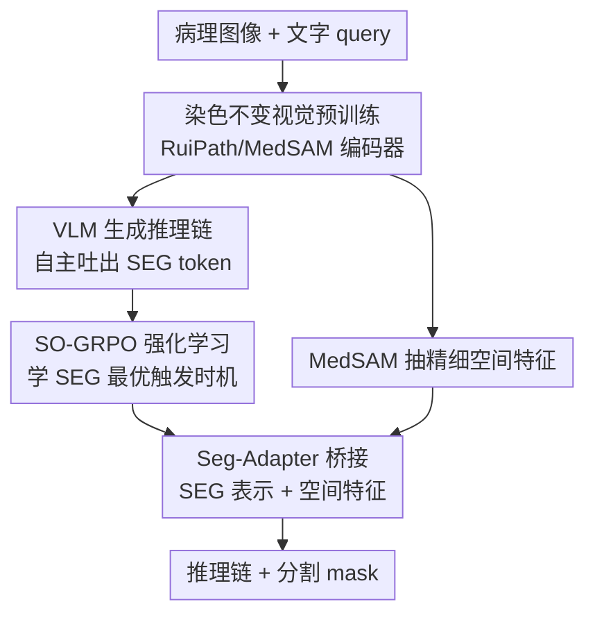

# PathChat-SegR1: Reasoning Segmentation in Pathology via SO-GRPO

**会议**: ICLR 2026  
**OpenReview**: [https://openreview.net/forum?id=DQESI75YrD](https://openreview.net/forum?id=DQESI75YrD)  
**代码**: https://github.com/yul945562-bit/Pathseg  
**领域**: 医学图像 / 多模态VLM / 强化学习  
**关键词**: 病理图像分割、推理分割、GRPO、染色不变、SEG token

## 一句话总结
针对病理图像里"罕见/未见形态学难以分割"的痛点，本文造了一个病理专用的推理分割模型 PathChat-SegR1：用染色不变自蒸馏训练病理视觉编码器，再用 SO-GRPO 强化学习让 VLM 自主决定"何时该输出 `<SEG>` token 触发分割"，在未见病理上零样本 Dice 比此前 SOTA 提升 61%。

## 研究背景与动机
**领域现状**：病理图像分割支撑组织定量分析与临床诊断，主流是 nnU-Net、MedSAM、BiomedParse 这类闭集分割模型，在预定义类别上表现很强；另一条线是 SAM 系开集分割，靠点/框 prompt 实现泛化。

**现有痛点**：临床天天遇到训练集里没有的罕见病理或新形态学，闭集模型直接失效；SAM 系虽能开集，但每个目标都要人工点/框，对动辄上百个细胞结构的全切片（WSI）完全不现实，而且看不懂文字表达的语义/临床查询。更要命的是临床还要求"可解释"——模型得能讲出诊断依据，而不只是给个 mask。

**核心矛盾**：推理分割（reasoning segmentation，用自然语言 query 引导对未见对象分割并生成推理链）本是出路，但现有推理分割模型搬到病理上撞三堵墙：(1) 视觉编码器是通用域的，缺病理知识、对染色变化不鲁棒；(2) LLM backbone 沿用 LISA 那套"在预设位置插 `<SEG>` token"的范式，无法自主判断"语义上下文是否已攒够、该不该现在触发分割"；(3) 病理领域根本没有推理分割的数据集和 benchmark。

**本文目标**：分别补齐这三块——病理专用且染色鲁棒的视觉表征、能自主决定分割时机的 RL 训练、大规模病理推理分割 benchmark。

**切入角度**：作者观察到，病理医生看罕见肿瘤时是"边推理边攒证据，证据够了才下结论"，而固定插 `<SEG>` 的范式恰恰把"何时下结论"这个决策权剥夺了。于是把 `<SEG>` 从"固定插入"改成"自主生成"，并用 RL 在推理过程的每一步评估"现在触发分割是不是最优"。

**核心 idea**：用病理专用 + 染色不变的编码器替换通用编码器，再用 Segmentation-Optimized GRPO（SO-GRPO）把分割质量的梯度回传到 `<SEG>` 的生成时机上，让模型学会"何时该停止推理、输出分割"。

## 方法详解

### 整体框架
PathChat-SegR1 输入一张病理图像 + 一条文字 query，输出一段文字推理链 + 一张分割 mask。架构由三个组件协同：① **VLM backbone**（Qwen2.5-VL，但视觉编码器换成病理基座 RuiPath）负责读图、生成推理链，并在推理链中自主吐出一个 `<SEG>` token 来"发令"分割；② **MedSAM 图像编码器**独立处理同一张图，抽取精细空间特征供 mask 生成；③ **Seg-Adapter**把 VLM 那个 `<SEG>` token 的隐表示桥接给 mask decoder，结合 MedSAM 的空间特征产出最终 mask。

训练分三阶段串行：**预训练**阶段，VLM 学病理知识（图文对 next-token prediction），同时 MedSAM 编码器做染色不变自蒸馏；**监督微调（SFT）**阶段，对齐视觉与语言 embedding、教模型在推理链里正确放 `<SEG>`，用 LoRA + adapter 省成本、mask decoder 全参训练；**SO-GRPO 强化学习**阶段，让模型学会"语义攒够了才生成 `<SEG>`"。

### 关键设计

**1. 染色不变视觉预训练：让编码器对染色风格"免疫"**

病理图像因制片协议、实验室习惯不同会有显著染色差异，训练时见过的染色风格一换，模型对组织形态的判断就崩。作者对 MedSAM 视觉编码器做染色不变自蒸馏：对每张图 $x_i$ 用 RandStainNA 在 LAB 颜色空间做随机通道线性变换，生成两个"虚拟重染色"视图（embedding 记为 $z_i^a, z_i^b$），编码器一边做掩码自编码（MAE，75% mask 比例）重建被遮的 patch，一边要求两个染色视图特征一致。预训练目标为

$$L_{SSL} = \frac{\alpha}{N}\sum_{i=1}^{N}\mathrm{Cos}(s_{i,1}, s_{i,2})\,\|z_i^a - z_i^b\|^2 + L_{MAE}$$

其中 $s_{i,1}, s_{i,2}$ 是两个视图的染色模板向量（由 LAB 空间颜色分布的均值 $A$ 和标准差 $D$ 构成）。妙处在于那个余弦距离项是个**自适应权重**：染色差异越大、$\mathrm{Cos}$ 越大，特征不一致的惩罚就越重，逼模型把"染色风格"从特征里剥离。同样的自蒸馏也用在 VLM 里的 RuiPath 编码器上（RuiPath 本身是 DINOv2 在大规模组织病理上预训练的基座，自带组织结构/细胞形态/疾病模式的病理先验）。

**2. `<SEG>` token 从固定插入改为自主生成 + GAE 时序信用分配**

LISA 范式把 `<SEG>` 插在预定位置，等于剥夺了模型"何时下结论"的自主权；而标准 GRPO 给整条轨迹**均匀**分配 reward，无法定位"哪一步生成 `<SEG>` 才最优"。作者把轨迹级优势估计换成**广义优势估计（GAE）**，给推理生成的每个时间步单独算信用：

$$\hat{A}_{GAE}(s_t, a_t) = \sum_{l=0}^{\infty}(\gamma\lambda)^l \delta_{t+l}, \quad \delta_t = r_t + \gamma V(s_{t+1}) - V(s_t)$$

这里状态 $s_t$ 包含 query、视觉特征和已生成的全部推理 token，$\delta_t$ 是 TD 残差，衡量相邻推理状态间的 reward 改善，$V(s_t)$ 估计从当前推理上下文出发的期望累积 reward。模型学会在 $\hat{A}_{GAE}(s_t, a_t=\texttt{<SEG>})$ 最大处生成 `<SEG>`——这一刻意味着"语义已攒够、再多推理也不会让分割更好"。GAE 还把梯度方差相比蒙特卡洛估计降低了 $\frac{1-(\gamma\lambda)^{2T}}{1-(\gamma\lambda)^2}$ 倍，让"是否触发分割"这个关键决策步的策略更新更稳。

**3. 可微分割奖励 + 稀疏感知奖励：把分割质量回传到 `<SEG>`，并管住乱吐 token**

Dice、IoU 这类标准分割指标是离散、不可微的，没法把分割质量的梯度传回 `<SEG>` 表示。作者用概率软化造了**可微分割奖励**

$$R_{soft} = \frac{2\sum_i p_i g_i + \epsilon}{\sum_i p_i + \sum_i g_i + \epsilon}$$

其中 $p_i = \sigma(M_{pred,i})$ 是预测 mask 软化后的概率、$g_i$ 是 ground truth，由此打通 $R_{soft}\to M_{pred}\to h_{SEG}$ 的可微路径，让梯度 $\partial R_{soft}/\partial h_{SEG}$ 直接引导 `<SEG>` 隐表示去编码能最大化与 GT 重叠的空间位置与语义。另外，模型可能过早或过量吐 `<SEG>`，作者把它当信息论问题，设**稀疏感知奖励**

$$R_{sparse} = \beta_{sparse}\cdot \mathbb{I}(s_t \in S_{spatial}) - \gamma_{sparse}\cdot \mathbb{I}(s_t \notin S_{spatial})$$

$S_{spatial}$ 是含空间-语义信息的状态（用规则检测 "boundary"、"region" 等位置描述词），在非空间状态吐 `<SEG>` 就罚、在空间状态吐就奖，数学上等价于最大化 token 生成与分割目标间的互信息 $I(M_{gt}; a_t=\texttt{<SEG>}|s_t)$。最终总奖励还叠加空间定位奖励 $R_{spatial}$（验证 mask 质心与 query 关键词对齐）、格式奖励 $R_{format}$、长度惩罚 $R_{len}=-\lambda_{len}\max(0,\ln(L-L_0+1))$（抑制过长 CoT），组合成 SO-GRPO 的总目标 $J_{SO\text{-}GRPO}(\theta)$，并带 KL 正则防止偏离 SFT 初始化。

**4. 自适应调度保收敛**

强化学习训练易震荡。作者用满足 Robbins-Monro 条件（$\sum_k\alpha_k=\infty$、$\sum_k\alpha_k^2<\infty$）的学习率调度 $\alpha_k=\alpha_0/(1+\eta k)$，配合 KL 正则构造 Lyapunov 函数 $V(\theta)=\mathbb{E}_{s\sim\rho}[\mathrm{KL}(\pi^*\|\pi_\theta)]$，证明单调改善 $V(\theta_{k+1})\le V(\theta_k)-\eta\|\nabla V(\theta_k)\|_2^2$，即每次策略更新都拉近与最优策略的距离，保证收敛到局部最优。⚠️ 这部分理论推导以原文为准。

### 损失函数 / 训练策略
SFT 阶段联合优化推理链生成与 mask 预测：

$$L_{SFT} = \lambda_{CoT}\cdot L_{CE} + \lambda_{seg}\cdot(L_{Dice} + L_{BCE})$$

第一项是推理链的自回归交叉熵，第二项是分割 mask 的 Dice + BCE。参数高效策略：LLM backbone 与 RuiPath 编码器用 LoRA（rank 16、dropout 0.1）、MedSAM 编码器插轻量 adapter、随机初始化的 mask decoder 与 Seg-Adapter 全参训练。RL 阶段超参 $\lambda_{soft}=0.3$、$\lambda_{sparse}=0.2$、$\lambda_{spatial}=\lambda_{format}=0.1$、$\lambda_{KL}=0.01$；8×H800、AdamW（lr $1\times10^{-4}$）、batch 64。

数据上构建了 **118,667 条**「病理图像-GT mask-query-推理链」四元组 benchmark：65% 来自 6 个公开集（Camelyon16/17、CRAG、DigestPath、GlaS、WSSS4LUAD），加上 43,847 张来自 493 台真实手术的私有术中冰冻切片（含冰晶失真、组织折叠等真实伪影）。推理链标注用半自动流水线：Gemini-2.5-Pro 先生成对比目标区与周围组织的形态描述，DeepSeek-R1 转成结构化推理链，3 位有 8-15 年经验的病理医生人工审核临床准确性。

## 实验关键数据

### 主实验
零样本 in-domain 评测（8 个 benchmark，Dice）。闭集方法逐数据集单独训练，推理分割方法和本文统一训练后零样本测试：

| 数据集 | 本文 | MMR-7B(推理SOTA) | nnU-Net(闭集) |
|--------|------|------|------|
| Camelyon16 | **0.76** | 0.57 | 0.74 |
| GlaS | **0.87** | 0.72 | 0.91 |
| CRAG | **0.92** | 0.74 | 0.94 |
| FS-Mic（术中冰冻） | **0.74** | 0.56 | 0.69 |
| FS-WSI | **0.84** | 0.62 | 0.82 |

本文在 Camelyon16 上相对最强推理基线 MMR-7B 有 33% 相对提升，且在多个集上逼近"逐数据集调优"的 nnU-Net，却只用一套统一训练。

未见病理域外评测（Dice）才是核心卖点：

| 方法 | PMBT(零样本) | RD(零样本) | RD(一样本) |
|------|------|------|------|
| MMR-7B | 0.36 | 0.33 | 0.47 |
| Seg-Zero | 0.39 | 0.29 | 0.44 |
| **PathChat-SegR1** | **0.58** | **0.53** | **0.72** |

PMBT 上 0.58 Dice 比 MMR-7B 相对提升 **61%**；罕见病（RD）一样本 in-context 学习把 0.53 拉到 0.72（相对 MMR-7B 提升 53%），且无需重训。

### 消融实验
组件消融（PMBT，Dice）：

| 配置 | Dice | 说明 |
|------|------|------|
| Full Model | 0.58 | 完整模型 |
| w/o RuiPath 编码器 | 0.42 | 掉 0.16，通用编码器缺病理知识 |
| w/o RL | 0.40 | 掉 0.18，SFT 学不会分割时机 |
| w/o SFT | 0.44 | 掉 0.14 |
| w/o MedSAM 预训练 | 0.51 | 染色不变自蒸馏失效 |
| w/o Auto-emission | 0.51 | 退回固定插 `<SEG>` |

SO-GRPO 拆解（PMBT）：

| 配置 | Dice | 收敛步数 | 梯度方差 |
|------|------|------|------|
| Full SO-GRPO | 0.58 | 18K | 0.031 |
| Standard GRPO | 0.53 | 24K | 0.048 |
| w/o GAE | 0.55 | 22K | 0.042 |
| w/o 可微奖励 | 0.56 | 20K | 0.038 |

### 关键发现
- **RL 和病理编码器贡献最大**：去掉 RL 掉 0.18、去掉 RuiPath 掉 0.16，印证"分割时机"和"病理先验"是两大命脉；SFT 单独训练无法优化 `<SEG>` 时机，因为它对所有推理步均匀监督。
- **SO-GRPO 不只是涨点还更稳更快**：相比标准 GRPO，Dice 从 0.53→0.58、收敛步数 24K→18K、梯度方差 0.048→0.031，GAE 是降方差主力。
- **推理链质量也更高**：FS-WSI 上 BLEU-4 0.315 / F1 0.612，超过专门做医学文本预训练的 Med-PaLM（0.291/0.581），说明 RuiPath 的病理视觉知识对推理质量的贡献超出纯语言能力。

## 亮点与洞察
- **把"何时分割"建模成 RL 的时序信用分配**：用 GAE 给推理每一步打分、在优势最大处触发 `<SEG>`，这是从 LISA 固定插入范式跳出来的关键一招，思路可迁移到任何"特殊 token 何时生成"的任务（如工具调用、检索触发）。
- **可微分割奖励打通梯度回路**：把离散 Dice 软化成可微 $R_{soft}$，让分割质量的梯度直接塑造 `<SEG>` 隐表示——这是"reward 不可微就没法端到端"的通用破法。
- **染色不变自蒸馏用自适应余弦权重**：染色差异越大惩罚越重，是个简洁有效的"按需用力"机制，可借鉴到任何有风格扰动的医学影像表征学习。

## 局限与展望
- 大量"理论保证"（Robbins-Monro 收敛、Lyapunov 单调改善、互信息等价）写得很形式化，但实证只给了梯度方差/收敛步数，理论与实践的连接较弱，建议以原文公式为准看待。
- 私有冰冻切片数据集占比大（43,847 张）且不公开，benchmark 的可复现性受限；公开部分仍主要是乳腺/淋巴/结直肠等常见组织。
- 框架组件多（VLM + RuiPath + MedSAM + Seg-Adapter + mask decoder）且训练三阶段，工程复杂度和推理开销不低，临床落地的实时性（尤其术中冰冻要求分钟级）未给出延迟数据。
- 域外提升虽大但绝对 Dice 仍偏低（RD 零样本 0.53），离临床可用还有距离，一样本才到 0.72。

## 相关工作与启发
- **vs LISA**：LISA 在预设位置插 `<SEG>`，本文改为 VLM 自主生成 + RL 学时机，解决了"无法自主判断语义是否攒够"的问题，域外 Dice 大幅领先。
- **vs Seg-Zero / SAM4MLLM**：它们用 MLLM 生成点/框 prompt 去驱动冻结的 SAM，点 prompt 在病理复杂空间信息上表达力不足；本文把分割能力直接集成进 LLM 并端到端优化。
- **vs 标准 GRPO（Seg-Zero/MedReasoner/LENS）**：标准 GRPO 对整条轨迹均匀给 reward，定位不了最优分割时机；SO-GRPO 用 GAE 做逐步信用分配 + 可微/稀疏奖励，收敛更快、更稳。
- **vs SAM-Path / SegAnyPath（闭集/SAM 系）**：它们要么逐病理类型重训、要么靠密集人工 prompt；本文统一训练 + 文字 query，零样本就能泛化到未见病理。

## 评分
- 新颖性: ⭐⭐⭐⭐⭐ 把"分割时机"建模成 RL 时序信用分配 + 可微分割奖励，是推理分割范式的实质推进
- 实验充分度: ⭐⭐⭐⭐ 8 个 in-domain + 2 个域外 + 4 张消融表覆盖充分，但私有数据不公开、缺延迟分析
- 写作质量: ⭐⭐⭐⭐ 结构清晰、动机扎实，但理论部分偏堆砌、与实证脱节
- 价值: ⭐⭐⭐⭐⭐ 直击临床"罕见病理无法分割"的真实痛点，并配套大规模 benchmark

<!-- RELATED:START -->

## 相关论文

- [\[ICLR 2026\] Modeling the Density of Pixel-level Self-supervised Embeddings for Unsupervised Pathology Segmentation in Medical CT](modeling_the_density_of_pixel-level_self-supervised_embeddings_for_unsupervised_.md)
- [\[ICML 2026\] PathCTM: Thinking in Scales — Accelerating Gigapixel Pathology Image Analysis via Adaptive Continuous Reasoning](../../ICML2026/medical_imaging/thinking_in_scales_accelerating_gigapixel_pathology_image_analysis_via_adaptive_.md)
- [\[CVPR 2026\] MedLoc-R1: Performance-Aware Curriculum Reward Scheduling for GRPO-Based Medical Visual Grounding](../../CVPR2026/medical_imaging/medloc-r1_performance-aware_curriculum_reward_scheduling_for_grpo-based_medical_.md)
- [\[ICLR 2026\] Bridging Radiology and Pathology Foundation Models via Concept-Based Multimodal Co-Adaptation](bridging_radiology_and_pathology_foundation_models_via_concept-based_multimodal_.md)
- [\[NeurIPS 2025\] QoQ-Med: Building Multimodal Clinical Foundation Models with Domain-Aware GRPO Training](../../NeurIPS2025/medical_imaging/qoq-med_building_multimodal_clinical_foundation_models_with_domain-aware_grpo_tr.md)

<!-- RELATED:END -->
