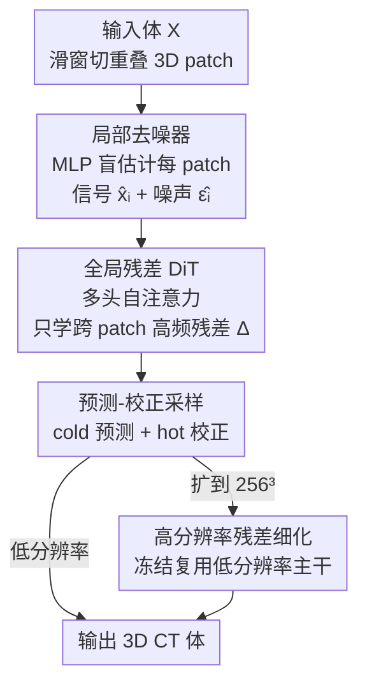

# Pixel-Level Residual Diffusion Transformer: Scalable 3D CT Volume Generation

**会议**: ICLR 2026  
**OpenReview**: [https://openreview.net/forum?id=bWtRZQ1rm2](https://openreview.net/forum?id=bWtRZQ1rm2)  
**代码**: https://github.com/Fredy-Zhang/PRDiT  
**领域**: 医学图像 / 扩散模型 / 3D生成  
**关键词**: 3D CT生成, 残差扩散, Diffusion Transformer, 体素级生成, 高分辨率扩展

## 一句话总结
PRDiT 提出一种**直接在体素级**生成高分辨率 3D CT 体的两阶段残差扩散框架：先用轻量 MLP「局部去噪器」从重叠 3D patch 里估出低频粗结构，再用「全局残差 DiT」用全卷积视野补回高频残差，配合 hot 预测-校正采样和「复用低分辨率主干」的扩展策略，在 LIDC-IDRI / RAD-ChestCT 上 3D FID、MMD、Wasserstein 全面超过 HA-GAN、3D LDM、WDM-3D，且 256³ 训练成本仅为对手的 1/4 ~ 1/6。

## 研究背景与动机

**领域现状**：3D 医学体（尤其 CT）生成对诊断、分割、异常检测都很有用，主流路线分两类——GAN（HA-GAN、3D-StyleGAN）能出逼真局部细节，扩散模型（3D-DDPM、3D LDM、WDM-3D、triplane 扩散）训练更稳、保真度更高，近年成为主力。

**现有痛点**：体素特征图的体积随分辨率**立方级**膨胀，直接在高分辨率 3D 体上跑深层 U-Net 内存/算力都爆炸，于是现有方法被迫用各种「妥协」：patch 分块、降采样、或用 VAE/VQ-VAE 压到隐空间。但 patch 和降采样会**截断有效感受野**，丢掉全局解剖一致性；隐空间压缩在 3D 医学这种**样本稀缺**场景下又训不出鲁棒的编码器，重建质量差、关键解剖细节流失。

**核心矛盾**：局部细节保真度 ↔ 全局结构一致性 ↔ 计算可行性，三者难以兼得。卷积 U-Net 擅长局部却建模不了长程依赖；而把 2D 成功的 DiT 直接搬到稠密 3D 又会遇到训练不稳、优化困难，以及分辨率翻倍时 token 数 ×8、注意力开销 ×64 的天价成本。

**本文目标**：在**不引入自编码器瓶颈**的前提下，做到（1）体素级高保真合成、（2）全局结构一致、（3）能廉价扩展到 256³ 高分辨率。

**切入角度**：把生成任务按频率分解——低频粗结构其实**局部 patch 内部就能估出来**，真正难、需要全局上下文的是**跨 patch 边界的高频残差**。于是不必让一个大模型同时扛低频和高频。

**核心 idea**：用「轻量局部去噪器估低频 + 全局 DiT 只学高频残差」的两阶段 coarse-to-fine 残差学习，直接在体素级生成，并通过冻结复用低分辨率模型来近乎免费地扩到高分辨率。

## 方法详解

### 整体框架
PRDiT 把 3D 扩散过程拆成两条互补的支路，串成一个 coarse-to-fine 的残差流水线。给定体 $X \in \mathbb{R}^{C\times H\times W\times D}$，先用**滑窗（窗口 $p$、步长 $s<p$、带重叠）**切成 $N$ 个 3D patch 并展平。第一支路是 **Local Denoiser**：一个 MLP 盲估计器，对每个 patch **独立**地、只凭 patch 内信息预测出干净信号 $\hat{x}_i$ 和噪声 $\hat{\epsilon}_i$，给整个体提供一份「先验粗估」。第二支路是 **Global Residual DiT**：把所有 patch embedding 通过多头自注意力联合起来，用全局视野算出**残差修正** $\Delta\hat{x}_i,\Delta\hat{\epsilon}_i$，把局部估计在 patch 边界处的误差补回去。采样时用 **predictor-corrector（hot 扩散）** 方案在确定性引导与可控随机性之间取平衡。最后，要扩到更高分辨率时，**冻结复用**已训好的低分辨率 PRDiT 当结构先验，只额外训一个「高分辨率残差细化模块」补回降/升采样丢掉的高频。

### 关键设计

**1. 局部去噪器：用重叠 patch 上的 MLP 盲估计器先吃掉低频**

针对「直接在高分辨率 3D 体上跑深模型内存爆炸」这个痛点，作者把低频粗结构的活儿交给一个**极轻量的逐 patch MLP**，而不是让大 Transformer 全包。前向扩散用 Zhang et al. (2023) 的角度调度：在时刻 $t$ 把干净 patch $v_i$ 加噪成 $v_i^t = \cos(\tfrac{t}{T}\tfrac{\pi}{2})\,v_i + \sin(\tfrac{t}{T}\tfrac{\pi}{2})\,\epsilon_i$。MLP 由两层 **Adaptive SwiGLU**（用时间嵌入经 AdaLN 调制出 $\gamma,\beta$ 来 shift/scale）加残差跳连和线性投影组成，**同时**输出去噪 patch $\hat{x}_i$ 和噪声估计 $\hat{\epsilon}_i$，对齐标准扩散「联合估清晰信号与噪声」的目标，损失为 $L_{local}=\mathbb{E}_i[\|\hat{x}_i-x_i\|_2^2+\|\hat{\epsilon}_i-\epsilon_i\|_2^2]$。

两个细节是关键：一是**滑窗带重叠**（$s<p$），让相邻 patch 在边界共享上下文，缓解拼接伪影、提升连续性（消融里去掉重叠 FID 从 2.04 劣化到 3.27）；二是它本质是个**盲估计器**——只看 patch 内信息，所以注定在跨 patch 的全局结构上有误差，这恰好把「难的部分」干净地留给下一阶段。

**2. 全局残差 DiT：冻结局部支路，只让 Transformer 学跨 patch 的高频修正**

局部去噪器逐 patch 独立、看不到全局，patch 边界和长程解剖一致性会出错。这里**冻结局部去噪器**，再训一个 DiT 用多头自注意力同时 attend 到所有 patch embedding，输出的不是从头重建，而是**残差** $\Delta$：精修后的 patch 为 $\tilde{x}_i=\hat{x}_i+\Delta\hat{x}_i$、$\tilde{\epsilon}_i=\hat{\epsilon}_i+\Delta\hat{\epsilon}_i$，用同样的逐 patch 损失 $L_{global}=\mathbb{E}_i[\|\tilde{x}_i-x_i\|_2^2+\|\tilde{\epsilon}_i-\epsilon_i\|_2^2]$ 训练。

这样设计有两层好处：其一，DiT 只需补「残差」而非学整个分布，学习复杂度和训练时间都降下来；其二，因为局部支路只训一次，扩展 DiT 深度（4/8/12 层）时可以复用同一个局部去噪器，把规模化的开销摊薄。消融非常说明问题——**去掉全局 DiT（只剩局部）FID 直接崩到 41.92**，证明跨 patch 的全局残差才是高保真的命门；去掉局部去噪器（DiT-only）也明显变差，说明两阶段分工缺一不可。位置编码 PE 只喂给全局 DiT，让它独占建模空间关系的能力。

**3. 预测-校正采样：从 cold 升级到 hot 扩散注入可控随机性**

确定性的 cold 采样（单步梯度更新）多样性和细节都不够。作者把 Zhang et al. (2023) 的梯度生成路径改造成**分离的 cold 预测步 + hot 校正步**：预测步先**向前跳 $k$ 步**，$x_{t-k}=x_t-k\cdot\nabla(\cos(\beta_t)\hat{x}_0+\sin(\beta_t)\hat{\epsilon})$（$\beta_t=\tfrac{t}{T}\tfrac{\pi}{2}$）；校正步再**回退 $k-1$ 步**并注入新鲜噪声 $x_{t-1}=\Gamma_t^{(k)}x_{t-k}+\sqrt{1-(\Gamma_t^{(k)})^2}\,\epsilon'$，其中 $\Gamma_t^{(k)}=\cos(\beta_{t-1})/\cos(\beta_{t-k})$ 做方差保持。

当 $k=1$ 退化为标准 cold 单步更新；$k>1$ 配上校正器就变成**hot 扩散**，每步注入受控随机性增加探索。这套预测-校正在「确定性引导」和「自适应随机性」之间取平衡，既保细节又保全局连贯。消融显示 $k=1$（cold）FID 高达 8.889，升到 $k=2$（hot）骤降到 2.173，$k$ 不必是整数但实验里取 2 最好。

**4. 高分辨率扩展：冻结复用低分辨率主干，只训一个高频残差模块**

从头在 256³ 训 DiT 几乎不可行——比 128³ token 数 ×8、注意力开销约 ×64，逼出极小 batch、频繁 OOM、优化崩坏。作者不重训，而是**复用并冻结**已训好的低分辨率 PRDiT 当结构先验：给定高分辨率噪声体 $X_{HR}$，先**降采样**→过低分辨率模型→**升采样**得到一份「粗」的信号与噪声初值，再用一个基于局部去噪器结构的**高分辨率残差细化模块**补回高频，且**集成进采样循环内**（每步降采样查询低分辨率模型、升采样、立刻细化高频），而非事后级联超分（后者常破坏扩散学到的低频结构）。

这里有个反直觉但关键的采样选择：信号升采样用**三线性插值**（更平滑、保解剖结构连续），但**噪声的降/升采样都用最近邻**——因为三线性会平均像素、衰减高频噪声能量，破坏预训练模型期望的噪声统计；最近邻保住噪声能量，让降采样输入对齐低分辨率模型的训练分布。训练时只更新细化模块、冻结主干，目标用 patch 级信号-噪声估计损失加一个**低频一致性项**（约束高分辨率预测降采样后要匹配低分辨率输出），让模块专注高频。结果 256³ 上 FID 2.28 远超 HA-GAN（3.98）和 WDM-3D（5.60），训练只要 36 GPUh vs 对手 120~140 GPUh。

### 损失函数 / 训练策略
- 局部去噪器：$L_{local}=\mathbb{E}_i[\|\hat{x}_i-x_i\|_2^2+\|\hat{\epsilon}_i-\epsilon_i\|_2^2]$，联合估信号与噪声。
- 全局 DiT：冻结局部支路后用 $L_{global}=\mathbb{E}_i[\|\tilde{x}_i-x_i\|_2^2+\|\tilde{\epsilon}_i-\epsilon_i\|_2^2]$ 训残差。
- 高分辨率细化：patch 级信号-噪声估计损失 + 低频一致性项；主干全程冻结。
- 数据预处理：裁到肺窗、重采样到 1mm 各向同性、crop/pad 到 256³，低分辨率实验用平均池化降采样并归一化到 $[-1,1]$。

## 实验关键数据

### 主实验
LIDC-IDRI 与 RAD-ChestCT，128³ 分辨率，FID 已 ×10³，三个随机种子均值±标准差，W-Score 以 PRDiT-12L 为参照（越接近 1 越好）。

| 数据集 | 指标 | HA-GAN | 3D-LDM | WDM-3D | PRDiT-4L | PRDiT-12L |
|--------|------|--------|--------|--------|----------|-----------|
| LIDC-IDRI | FID ↓ | 3.26 | 7.62 | 3.67 | 2.04 | **1.41** |
| LIDC-IDRI | MMD ↓ | 0.2071 | 0.3458 | 0.1885 | 0.1852 | **0.1501** |
| RAD-ChestCT | FID ↓ | 3.92 | 4.14 | 4.11 | 1.92 | **1.45** |
| RAD-ChestCT | MMD ↓ | 0.183 | 0.228 | 0.213 | 0.169 | **0.159** |

即便最浅的 PRDiT-4L 已全面超过所有 baseline；加深到 8/12 层稳定提升，体现可扩展性，而所有变体复用同一个只训一次的局部去噪器。

256³ 高分辨率（LIDC-IDRI，FID ×10³，A100 GPU 小时）：

| 模型 | FID ↓ | MMD ↓ | 训练成本 |
|------|-------|-------|----------|
| HA-GAN | 3.98 | 0.2237 | 140 GPUh |
| 3D-LDM | OOM | OOM | — |
| WDM-3D | 5.60 | 0.2590 | 120 GPUh |
| **PRDiT-4L↑256** | **2.28** | **0.1370** | **36 GPUh** |

### 消融实验
PRDiT-4L，LIDC-IDRI，FID ×10³。

| 配置 | FID ↓ | MMD ↓ | 说明 |
|------|-------|-------|------|
| Full model | 2.04 | 0.1853 | 完整模型 |
| w/o overlap | 3.27 | 0.2304 | 去掉 patch 重叠，边界不一致 |
| w/o local denoiser | 3.10 | 0.2174 | 只剩全局 DiT |
| w/o global DiT | 41.92 | 0.7795 | 只剩局部，FID 崩盘 |

预测步 $k$ 的影响（hot vs cold）：

| $k$ | FID ↓ | MMD ↓ | 说明 |
|-----|-------|-------|------|
| 1.0 (cold) | 8.889 | 0.3490 | 纯确定性，最差 |
| 2.0 | **2.173** | **0.1849** | 最优 |
| 3.0 | 3.112 | 0.2112 | 过多随机性 |
| 4.0 | 4.184 | 0.2425 | 继续劣化 |

高分辨率扩展策略（LIDC-IDRI）：从头训 PRDiT-128 得 FID 2.04 / 80 GPUh，而 PRDiT-64↑128 升采样方案 FID 2.89 / 仅 12 GPUh，**快 6 倍以上**，质量-算力权衡很划算。

### 关键发现
- **全局 DiT 是命门**：去掉它 FID 从 2.04 暴涨到 41.92，说明跨 patch 的全局高频残差才是高保真的根本；两阶段分工缺一不可。
- **hot 优于 cold**：$k$ 从 1 到 2，FID 从 8.889 骤降到 2.173，但过大（$k=3,4$）反而变差——随机性要适度。
- **重叠 patch 必要**：去重叠 FID 劣化 60%，验证滑窗重叠对边界连续性的作用。
- **复用主干极省算力**：256³ 训练 36 GPUh vs 对手 120~140 GPUh，且 3D-LDM 在该分辨率直接 OOM、WDM-3D 对随机种子敏感（少数退化样本拉高方差）。

## 亮点与洞察
- **按频率分工，而非按模块堆叠**：把「局部 patch 内能估的低频」和「需要全局视野的高频残差」拆给轻量 MLP 和 DiT，这个频率视角让小模型也能打——4 层就 SOTA。
- **残差学习降低 DiT 负担**：DiT 只学 $\Delta$ 而非从头重建，既稳了训练又省了算力，是把 2D DiT 搬进稠密 3D 的关键工程解法。
- **噪声用最近邻、信号用三线性**：这个采样选择背后是「保住噪声能量统计以对齐预训练分布」的洞察，值得迁移到任何「复用低分辨率扩散模型做超分」的场景。
- **冻结复用 + in-loop 细化**：不重训主干、把高分辨率细化嵌进采样循环而非事后级联，避免破坏扩散学到的低频结构——这套「先验冻结、残差补高频」范式可推广到其他 3D/视频扩散扩展。

## 局限与展望
- 评测集中在无条件生成与分布距离指标（3D FID / MMD / Wasserstein），未直接验证生成体对下游诊断/分割任务的实际增益。
- 仅在胸部 CT（LIDC-IDRI、RAD-ChestCT）上验证，跨模态（MRI、PET）和其他解剖部位的泛化未知。
- $k$ 固定取 2 是经验最优，作者也承认 $k$ 可非整数、还有进一步优化空间，但未系统搜索；hot 扩散对不同数据集是否都以 $k=2$ 最优待考。
- 体素级直接生成虽避开自编码器瓶颈，但对超大体（>256³）的内存可行性、以及条件生成（病灶可控合成）尚未展开。

## 相关工作与启发
- **vs HA-GAN（GAN 路线）**：HA-GAN 用分层 patch 生成器/判别器出高分辨率体，但有 mode collapse、训练不稳、显存大；PRDiT 走扩散更稳，且 FID/MMD 全面更优、训练更省。
- **vs 3D LDM（隐空间扩散）**：3D LDM 用 VQ-GAN 压到隐空间再扩散，但 3D 医学样本稀缺导致编码器训不好、丢解剖细节，256³ 还直接 OOM；PRDiT **不要自编码器瓶颈**，直接体素级保细节。
- **vs WDM-3D（小波 U-Net 扩散）**：WDM-3D 在小波子带上用 3D U-Net 扩散提效，但仍是卷积、长程依赖弱，对种子敏感；PRDiT 用 DiT 拿全局视野，质量和鲁棒性都更好。
- **vs 原始 2D DiT / TCAM-Diff**：DiT 在 2D 和稀疏 3D（点云）有效，但作者发现直接搬到**稠密 3D** 会训练不稳、扩展昂贵；PRDiT 的两阶段残差分解正是为驯服稠密 3D DiT 而生。

## 评分
- 新颖性: ⭐⭐⭐⭐ 两阶段频率分解 + 残差 DiT + 冻结复用扩展，组合新颖且针对 3D 医学痛点。
- 实验充分度: ⭐⭐⭐⭐ 两数据集、多深度、128³/256³、完整消融与算力对比；但缺下游任务与跨模态验证。
- 写作质量: ⭐⭐⭐⭐ 动机清晰、图文（Fig 1-3）对照到位、消融说服力强。
- 价值: ⭐⭐⭐⭐ 体素级高分辨率 3D CT 生成且训练成本骤降，对数据稀缺的医学影像有实用价值。

<!-- RELATED:START -->

## 相关论文

- [\[ICLR 2026\] Modeling the Density of Pixel-level Self-supervised Embeddings for Unsupervised Pathology Segmentation in Medical CT](modeling_the_density_of_pixel-level_self-supervised_embeddings_for_unsupervised_.md)
- [\[CVPR 2026\] Sketch2CT: Multimodal Diffusion for Structure-Aware 3D Medical Volume Generation](../../CVPR2026/medical_imaging/sketch2ct_multimodal_diffusion_for_structure-aware_3d_medical_volume_generation.md)
- [\[CVPR 2026\] SPECTRE：面向体积 CT Transformer 的自监督与跨模态预训练](../../CVPR2026/medical_imaging/scaling_self-supervised_and_cross-modal_pretraining_for_volumetric_ct_transforme.md)
- [\[ICLR 2026\] OmniCT: Towards a Unified Slice-Volume LVLM for Comprehensive CT Analysis](omnict_towards_a_unified_slice-volume_lvlm_for_comprehensive_ct_analysis.md)
- [\[NeurIPS 2025\] Scalable Diffusion Transformer for Conditional 4D fMRI Synthesis](../../NeurIPS2025/medical_imaging/scalable_diffusion_transformer_for_conditional_4d_fmri_synthesis.md)

<!-- RELATED:END -->
