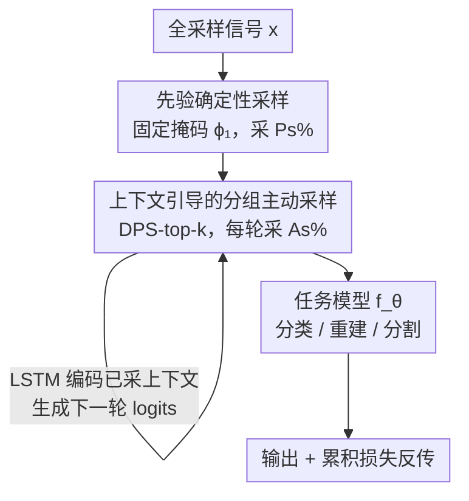

# Prior-aware and Context-guided Group Sampling for Active Probabilistic Subsampling

**会议**: ICLR 2026  
**OpenReview**: [https://openreview.net/forum?id=GMxQHTyO2T](https://openreview.net/forum?id=GMxQHTyO2T)  
**代码**: https://github.com/B9Kang/PGADPS  
**领域**: 医学图像 / 压缩感知 / 主动采样  
**关键词**: 概率子采样, 主动采样, MRI 加速, Gumbel-top-k, Lipschitz 平滑性

## 一句话总结
在 Active Deep Probabilistic Subsampling（A-DPS）基础上，先用训练集学到的固定先验掩码采一批样本、再用 DPS-top-k 的分组主动采样按每个输入的上下文补采，配合 Lipschitz 理论证明分组采样让优化更平滑，在 MNIST/CIFAR-10 分类、fastMRI 重建、AeroRIT 高光谱分割上全面超过 A-DPS、DPS 等采样方法。

## 研究背景与动机

**领域现状**：MRI、CT、超声、高光谱等成像系统采集成本高，子采样（subsampling）能在不显著损失下游任务性能的前提下减少测量数、缩短采集时间。压缩感知（CS）靠信号稀疏性做采样，但不感知下游任务；后来的深度子采样方法（如 DPS、LOUPE）能联合优化"采样模式 + 任务模型"，但学到的是一张**对全数据集平均最优的固定掩码**，对单个样本未必最优。为此 Active DPS（A-DPS）引入主动采样：每一步根据已采到的样本动态决定下一个采哪里，从而为每个测试实例生成自适应的采样轨迹——这在每个病人生理结构都不同的医学成像里尤其有价值。

**现有痛点**：A-DPS 虽然能实例自适应，但采样策略仍有两处短板。其一，它从零开始迭代采样，**没有利用训练集里那份现成的、全局的先验知识**——每次都要"白手起家"地为每个样本重新探索。其二，A-DPS 用 **top-1 采样**：每一步只选概率最高的那一个样本，而且为每个被采的像素/线训练一个独立的任务函数，这会让优化变得不稳定。

**核心矛盾**：top-1 的逐点采样把"选 K 个样本"拆成 K 个串联的任务函数 $f_K(f_{K-1}(\cdots f_1(x_1)\cdots))$，其等效 Lipschitz 常数是各层 Lipschitz 常数的**连乘** $\prod_r L_r$。神经网络的 $L_r$ 通常远大于 1，连乘后损失面变得极其陡峭、梯度大幅放大，优化难以收敛——这正是 A-DPS 在采样数变多后精度反而下降的根因。换句话说，"逐点主动采样"和"优化稳定性"之间存在矛盾。

**本文目标**：(1) 把训练集先验显式注入采样流程；(2) 把 top-1 主动采样换成分组（top-k）采样以平滑优化面；(3) 给出分组采样为何更稳定的理论解释。

**切入角度**：作者观察到 DPS 原文里 top-k 经验上就比 top-1 好，于是把"为什么好"用 Lipschitz 平滑性补上——一次性选 k 个样本只对应**一个**任务函数 $f_k$，等效 Lipschitz 常数是 $L_k$ 而非连乘，天然更小。

**核心 idea**：用"训练集先验固定采样（全局）+ DPS-top-k 分组主动采样（实例上下文）"两段拼接，替代 A-DPS 的纯 top-1 逐点主动采样，得到更平滑的损失面与更稳的优化。

## 方法详解

### 整体框架

PGA-DPS 要解决的是同一个任务：给定全采样信号 $x\in\mathbb{R}^N$，找一个只取 $M$ 个位置的子采样集合 $A\subseteq\{0,1\}^N$（采样率 $r=100\times M/N\%$），使下游任务 $f_\theta$ 在这 $M$ 个样本上的表现尽量接近全采样。整体流程分两段：**先验固定采样**先用一张从训练集学到的固定掩码 $\phi_1$ 采走 $P_s$ 比例的样本（提供全局先验），**上下文引导的分组主动采样**再用 DPS-top-k 分若干轮、每轮按当前输入上下文一次性补采 $A_s$ 比例的样本（提供实例自适应）；两段采到的样本喂给任务模型 $f_\theta$ 输出预测。整段采样与任务模型端到端联合训练，靠 Gumbel-Softmax 把"离散采样不可导"的问题松弛掉。

举例（论文 Fig.1，MNIST 分类、目标 31 个像素）：DPS 一步固定选 31 个；A-DPS 要 31 次 top-1 迭代；而 PGA-DPS 只需 3 步——一步先验固定采样 + 2 轮分组主动采样。

### 关键设计

**1. 先验确定性采样：把训练集的全局先验固定下来当起点**

A-DPS 每个实例都从零开始主动采样，完全不用训练集里那份现成的统计先验，相当于每次都重做一遍探索。PGA-DPS 在网络里额外引入一组可训练 logits $\phi_1\in\mathbb{R}^N$（MNIST 上长度 784），训练时它学到一张**对全数据集平均最优的固定（deterministic）采样掩码**——这正是 DPS 那种"平均最优掩码"的角色。推理时先用这张固定掩码无条件采走 $P_s$ 比例的样本，作为所有后续主动采样的共同地基。它的价值在 MRI 重建里看得很直观：DPS 因为只追平均最优，会把采样高度集中在 k-space 的 DC（低频中心）线上；A-DPS 总是从中心线起步；而 PGA-DPS 的先验掩码天然是"中心 + 外围"的混合，频率成分更均衡，为之后的细节补采留出空间。

**2. 上下文引导的分组主动采样：用 DPS-top-k 一次补一组而非一个**

固定先验解决了"全局"，但缺"实例自适应"。这一段沿用 A-DPS 的分析-合成（analysis-by-synthesis）思想：任务模型 $f_\theta$ 先对当前已采样本给出预测 $t_j=f_\theta(A_{j-1}x)$，采样网络 $g_j$（实现为 LSTM + MLP）把这个任务上下文编码成下一轮的 logits $\phi_j=g_j(t_j)$，再据此挑下一批样本。关键差异在于"一批"：A-DPS 用 DPS-top-1，每轮只选 $\arg\text{top}_1(w_{j-1}+\phi_j+G_j)$ 一个样本（$w_{j-1}\in\{-\infty,0\}^N$ 是把已选位置置 $-\infty$ 的累积掩码，保证不重复选）；PGA-DPS 改用 **DPS-top-k**，每轮通过 $A=\arg\text{top}_k(\phi+G)$ 用**单一共享 logits** 一次性选 k 个样本。Gumbel-top-k trick 让"从类别分布里高效抽 top-k"可行，温度 $\tau=2$ 的 Gumbel-Softmax 松弛保证整条链路可反传。这样把"采 $A_s$ 比例的样本"压成少数几轮分组采样（如每轮 20%、两轮采完 40%），而不是几十次逐点迭代。

**3. 分组采样的 Lipschitz 平滑性：为什么 top-k 比 top-1 优化更稳（Theorem 1）**

设计 2 为何有效，作者用 Lipschitz 常数给出理论解释。top-1 把选 k 个样本建模成 k 个串联任务函数 $f=f_k(f_{k-1}(\cdots f_1(x_1)\cdots))$，其损失的 Lipschitz 上界是各层连乘：

$$\|\text{Loss}_{\text{DPS-top-1}}(x)\|_2 \le \prod_{r=1}^{k} L_r\,\|x_1^*-x_1\|_2$$

而 top-k 把这 k 个样本交给**一个**任务函数 $f_k$ 处理，上界只含单个常数：

$$\|\text{Loss}_{\text{DPS-top-k}}(x)\|_2 \le L_k\,\|x^*-x\|_2$$

只要每层 $L_j\ge 1$（神经网络在非平凡的非近恒等映射下普遍如此，而分类、k-space→图像重建、分割都远离恒等映射），就有 $L_k\le\prod_r L_r$，于是 $\sup_x\|\text{Loss}_{\text{DPS-top-k}}\|\le\sup_x\|\text{Loss}_{\text{DPS-top-1}}\|$，梯度的 Lipschitz 常数同理。直白地说：top-1 的损失面被连乘放大得很陡，top-k 的损失面更平滑，因而优化更稳更高效。这也解释了实验里的现象——A-DPS（top-1）在采样数变多后精度反而掉，正是等效 Lipschitz 常数被连乘抬高所致。

**4. (Ps, As) 预算分配：在先验与主动之间按任务调权**

PGA-DPS 把样本预算切成两份：先验占比 $P_s$、主动占比 $A_s$，二者之和构成目标采样量。例如 MNIST 取 $(P_s,A_s)=(60,20)$ 表示 60% 样本由先验固定采样选定、剩下 40% 由两轮各 20% 的分组主动采样补足。这个划分不是无关紧要的旋钮，而是直接对应"全局先验 vs 实例上下文"的权衡，且最优值随任务变化很大：MNIST $(60,20)$、CIFAR-10 $(10,20)$、fastMRI $(30,30)$、AeroRIT 分割 $(80,20)$。作者还给出一条经验法则——若 DPS 一贯优于 A-DPS，说明损失面较陡（等效 Lipschitz 大），应调大 $P_s$；反之 A-DPS 更好则损失面较平、$P_s$ 可调小。$A_s$ 则建议落在 20–30%，过大反而因主动采样占比下降而收益见顶甚至回落。

### 损失函数 / 训练策略
分类与分割用类别交叉熵，重建用展开的近端梯度网络（deep unfolded proximal gradient）。采样网络与任务网络同时训练；主动采样的损失在所有迭代上累积，网络以半贪心（semi-greedy）方式更新。温度固定 $\tau=2$（附录证明固定温度即可稳健）。

## 实验关键数据

### 主实验

CIFAR-10 像素子采样分类（六次独立运行均值，精度 %）——任务越难、PGA-DPS 优势越大，且 A-DPS 在 $r\ge14\%$ 后开始掉点（Lipschitz 抬高），PGA-DPS 仍单调上升：

| 采样率 r | DPS | A-DPS | PGA-DPS |
|--------|------|-------|---------|
| 2% | 38.6 | 52.9 | **54.3** |
| 10% | 46.1 | 70.4 | **74.7** |
| 14% | 49.2 | 70.7 | **78.6** |
| 20% | 54.3 | 68.3 | **82.7** |

fastMRI 膝关节 k-space 重建（208×208，加速因子 8，$r=12.5\%$，10 次均值）对比各类采样方法：

| 方法 | NMSE↓ | PSNR↑ | SSIM↑ |
|------|-------|-------|-------|
| Low-pass | 0.0462 | 24.5 | 0.511 |
| LOUPE | 0.0465 | 25.1 | 0.574 |
| DPS | 0.0408 | 25.3 | 0.571 |
| A-DPS | 0.0398 | 25.4 | 0.576 |
| **PGA-DPS** | **0.0359** | **25.9** | **0.621** |

对比 RL 主动采样（368×640，加速因子 8，ACS=30）：PGA-DPS 同样领先 Evaluator policy / DS-DDQN —— NMSE 0.0331、PSNR 30.5、SSIM 0.668，均为最佳。

AeroRIT 高光谱波段选择分割（选 5 个波段，$r\approx9.8\%$）：PGA-DPS 的 mIOU 0.6752 / mDICE 0.7803 接近用全部 51 波段（0.7037 / 0.8063），实现 >10 倍加速；而 A-DPS 在分割上严重退化（mIOU 仅 0.5181），印证逐点 top-1 在复杂任务上联合优化难以稳定。

### 消融实验
fastMRI 上对 $(P_s,A_s)$ 网格扫描（加速因子 8，$M=26$）：

| 配置 | NMSE↓ | PSNR↑ | SSIM↑ | 说明 |
|------|-------|-------|-------|------|
| $P_s{=}0\%,A_s{=}5\%$ | 0.0398 | 25.4 | 0.576 | 等价于 A-DPS + 分组采样 |
| $P_s{=}0\%,A_s{=}20\%$ | 0.0373 | 25.7 | 0.598 | 仅靠分组、无先验 |
| $P_s{=}30\%,A_s{=}30\%$ | **0.0359** | **25.9** | **0.621** | 最优配置 |
| $P_s{=}70\%,A_s{=}5\%$ | 0.0370 | 25.7 | 0.596 | 先验过重、主动不足 |

### 关键发现
- 即便 $P_s=0$（无先验），单把 top-1 换成 top-k 分组采样，SSIM 也随 $A_s$ 增大而提升（0.576→0.598），直接验证 Theorem 1 的理论预测。
- $A_s$ 超过 15–20% 后收益见顶甚至略降——主动采样占比过高会挤压总预算，存在最优点。
- 先验采样对低测量量场景增益最显著（k-space 线数越少越受益），说明全局先验在数据极稀时托底作用最强。
- A-DPS 在 MNIST（MLP，Lipschitz 大）低采样率下尚可、采样数一多就掉；在 CIFAR-10（CNN，Lipschitz 小）全程稳于 DPS，但 $r\ge14\%$ 仍掉点——与 Theorem 1 的 Lipschitz 解释一致。

## 亮点与洞察
- **把"经验上 top-k 比 top-1 好"补成理论**：用 Lipschitz 连乘 vs 单常数的对比，干净地解释了分组采样为何让损失面更平滑，这个分析可迁移到任何"串联逐步决策 vs 一次性分组决策"的可微采样/选择问题。
- **先验 + 主动的两段拼接**很朴素却有效：固定掩码管"全局平均最优"、分组主动管"实例自适应"，把 DPS 和 A-DPS 各自的长处缝在一起，而不是二选一。
- **用 DPS/A-DPS 的性能差当 Lipschitz 探针**：根据"谁赢"来判断损失面陡峭程度、进而决定 $P_s$ 大小，是个很实用的超参经验法则。
- 方法天然跨任务（分类/重建/分割）和跨模态（自然图像/MRI/高光谱），对采集成本敏感的 CT、超声、雷达等系统有直接迁移价值。

## 局限与展望
- $(P_s,A_s)$ 需按任务/任务模型/采样率手调，最优值差异很大（10%~80%），目前只有经验区间和启发式法则，作者把自动调参列为未来工作。
- 温度 $\tau$ 固定为 2，虽证明够用，但退火/调度温度可能进一步提升。
- 理论分析基于"任务远离恒等映射、$L_j\ge1$"的假设；对近恒等任务（如轻度去噪）结论未必成立，文中未实验验证这种边界情形。
- 实验任务规模偏小（MNIST/CIFAR-10/单线圈膝关节/单个高光谱数据集），在更大分辨率、多线圈 MRI 或更复杂分割上的稳定性仍待检验。

## 相关工作与启发
- **vs A-DPS**：同样联合优化采样掩码与任务模型、同样主动采样，但 A-DPS 用 top-1 逐点采、无训练集先验；PGA-DPS 加先验固定采样 + 改 top-k 分组采样，优化更稳、全任务超越。
- **vs DPS / LOUPE**：它们学一张全数据集平均最优的固定掩码（DPS 用 Gumbel-Softmax、LOUPE 用 L1 稀疏惩罚松弛阈值），不做实例自适应；PGA-DPS 保留这张固定掩码当先验起点，再叠加实例级主动采样。
- **vs RL 主动采集（Evaluator policy、DS-DDQN）**：RL 方法需要一个能处理任意采样模式的预训练重建网络；PGA-DPS 端到端联合训练采样与重建，且在 368×640 设定下重建指标更优。

## 评分
- 新颖性: ⭐⭐⭐⭐ 两段拼接思路朴素但配上 Lipschitz 理论解释有分量，非颠覆性创新
- 实验充分度: ⭐⭐⭐⭐ 覆盖三任务四数据集、含 RL 基线与 (Ps,As) 网格消融，但数据集规模偏小
- 写作质量: ⭐⭐⭐⭐ 动机—方法—理论—实验链条清晰，理论与实验互相印证
- 价值: ⭐⭐⭐⭐ 对 MRI 等采集受限场景有直接实用价值，方法可即插到现有 DPS 框架

<!-- RELATED:START -->

## 相关论文

- [\[CVPR 2026\] Active Inference for Micro-Gesture Recognition: EFE-Guided Temporal Sampling and Adaptive Learning](../../CVPR2026/medical_imaging/active_inference_for_micro-gesture_recognition_efe-guided_temporal_sampling_and_.md)
- [\[NeurIPS 2025\] Active Target Discovery under Uninformative Prior: The Power of Permanent and Transient Memory](../../NeurIPS2025/medical_imaging/active_target_discovery_under_uninformative_prior_the_power_of_permanent_and_tra.md)
- [\[CVPR 2026\] PGR-Net: Prior-Guided ROI Reasoning Network for Brain Tumor MRI Segmentation](../../CVPR2026/medical_imaging/pgr-net_prior-guided_roi_reasoning_network_for_brain_tumor_mri_segmentation.md)
- [\[AAAI 2026\] Towards Effective and Efficient Context-aware Nucleus Detection in Histopathology Whole Slide Images](../../AAAI2026/medical_imaging/towards_effective_and_efficient_context-aware_nucleus_detection_in_histopatholog.md)
- [\[CVPR 2026\] OSA: Echocardiography Video Segmentation via Orthogonalized State Update and Anatomical Prior-aware Feature Enhancement](../../CVPR2026/medical_imaging/osa_echocardiography_video_segmentation_via_orthogonalized_state_update_and_anat.md)

<!-- RELATED:END -->
