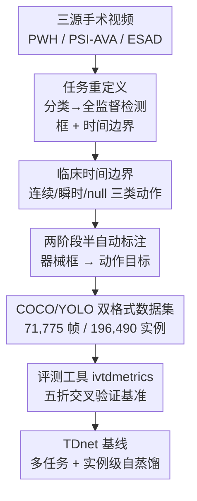

# ProstaTD: Bridging Surgical Triplet from Classification to Fully Supervised Detection

**会议**: ICLR 2026  
**OpenReview**: [https://openreview.net/forum?id=0NkXZ98BjJ](https://openreview.net/forum?id=0NkXZ98BjJ)  
**代码**: https://github.com/chen-yiliang/ProstaTD  
**领域**: 医学图像 / 手术视频理解 / 目标检测  
**关键词**: 手术三元组检测, 全监督, 数据集, 前列腺切除, 自蒸馏

## 一句话总结
本文构建了首个面向「全监督手术三元组检测」的大规模多中心数据集 ProstaTD（21 台机器人辅助前列腺切除术、71,775 帧、196,490 个带框实例、89 类三元组），用临床定义的时间边界 + 精确包围框把这个任务从「帧级弱监督分类」推进到「带空间定位的全监督检测」，并配套两款标注工具、一套评测工具和一个融合多任务学习 + 实例级自蒸馏的基线 TDnet。

## 研究背景与动机
**领域现状**：手术三元组（surgical triplet）指从手术视频每一帧里识别出 `<器械, 动作, 目标>` 三元组（instrument-verb-target），刻画「哪个器械、做了什么动作、作用在哪块解剖结构上」，是手术数据科学里支撑术中决策辅助、术后技能评估、规范化训练的基础任务。这个方向由 CholecT40/45/50 系列开创，目前 CholecT50 是最主流的基准。

**现有痛点**：CholecT50 有三个硬伤。其一，**没有包围框标注**，只给帧级类别标签，任务被困在弱监督设定里，无法做精确空间定位；CholecTriplet 2022 挑战赛虽然把检测纳入考量，但仍然只能靠类激活图（CAM）+ NMS 弱监督地「猜」位置，预测含糊。其二，**时间边界模糊不一致**：到底是器械「入画」算三元组开始还是「接触目标」算开始、是「离开目标」还是「退出画面」算结束，原文没说清，导致标注口径不统一，模型学不到稳定的时序动态。其三，**数据源单一**：只采自一家机构的胆囊切除术，器械外观与术式风格单调，罕见三元组缺失，模型容易过拟合本地风格、跨院泛化差。

**核心矛盾**：三元组任务要真正「可用于临床」，必须同时给出**空间位置（框）**和**语义标签（三元组类别）**，但现有数据集只提供帧级类别，从根上就只支持分类、不支持检测——空间监督信号的缺失把整个领域钉死在了弱监督天花板下。

**本文目标**：造一个**带精确包围框 + 临床标准时间边界 + 多机构来源**的检测级数据集，把任务从分类升级到全监督检测；并提供标注工具、评测工具和基线方法，让后续工作能公平对比。

**切入角度**：作者选择技术难度更高的「机器人辅助前列腺根治术（RARP）」作为新场域——它属于「超大手术」（cholecystectomy 只是「大手术」），器械并发度更高、解剖结构更复杂、可跨 ESAD/PSI-AVA/自采 PWH 三源采集，天然比胆囊切除术更能逼出检测模型的真实能力。

**核心 idea**：用「全监督检测数据集 + 临床定义的时序/空间标注协议」替代「帧级弱监督分类标签」，把手术三元组从识别问题彻底变成检测问题。

## 方法详解

### 整体框架
ProstaTD 不是一个算法，而是一条「数据集构建 + 基准 + 基线」的完整管线：先把任务**重定义**为带框、带时间边界的全监督检测；再从三个异构来源（自采 PWH 9 台、PSI-AVA 8 台、ESAD 4 台）汇集 21 台前列腺切除手术视频，**统一弃用原始标注、按自研协议重标**；标注分两阶段半自动完成（先器械框、后动作/目标），辅以两款自研标注工具，最终产出 COCO/YOLO 双格式、覆盖 7 器械 / 10 动作 / 10 目标 / 89 三元组类的数据集；最后用一套专门的评测工具（ivtdmetrics）跑五折交叉验证基准，并给出融合自蒸馏的基线模型 TDnet。

### 关键设计

**1. 任务重定义：从帧级弱监督分类升级为带框全监督检测**

针对 CholecT50「只有类别标签、无空间定位」的根本缺陷，本文把手术三元组形式化为一个标准检测问题：给定视频帧 $F_t$，每个器械实例都带一个包围框 $B=\{(c_x, c_y, w, h)\}$（中心点 + 宽高）和一个三元组类别 $C \in \{C_1, \dots, C_N\}$，检测目标是找出帧内全部有效三元组 $T_t = \{C_1, \dots, C_k\}$ 并同时给出每个交互的**空间位置 + 语义标签**。正是这个「框」的引入，让任务从「这帧里有没有某个三元组」变成「某个三元组发生在画面的哪个位置」，从而能解耦同时出现的多个器械、可靠地把器械和它的动作/目标关联起来——这是弱监督 CAM 做不到的。为兼容主流检测框架，数据同时以 YOLO 格式 `⟨tri, i, a, t, cx, cy, w, h⟩` 和 COCO 格式（左上角 `x,y,w,h`）发布。

**2. 临床定义的时间边界：用手术语义而非器械出现来切动作**

CholecT50 的时间边界模糊，本文与泌尿外科专家协作制定统一规则。关键洞察是：**不能仅凭「器械出现在画面里」就判定三元组开始**——那只是器械级步骤识别，和临床上的手术技能评估并不对齐。于是把三元组动作分为三类分别定义边界：**连续动作**（如沿髂血管的淋巴结清扫），从器械接触/极度贴近目标时开始，到器械离开同一目标超过 2 秒时结束；**瞬时动作**（如用剪刀剪线），时间窗更宽松，取器械-目标接触时刻前后各 2 秒；**null 动作**，对应器械静止或移动但无实质交互。这套「临床知情」的切分让标注在时序上既精确又有语义，更贴合真实手术，也使得多个标注者能在一致口径下合并标注——其可靠性由后文 0.82 的 Cohen's Kappa 一致性印证。

**3. 两阶段半自动标注 + 专用工具：在专家监督下规模化产出高质量标签**

为在 60 余名贡献者、近 20 万实例规模下保住质量，标注拆成两阶段。**第一阶段（器械框）**：用此前自研的膀胱镜器械检测模型预标注，因前列腺与膀胱手术存在域差异，团队对选定视频做至少三轮人工修正后再回炉微调检测器，如此「半自动训练-修正」迭代五个循环，完成全部器械类型 + 框标注；这一阶段可由学生助理承担。**第二阶段（动作/目标）**：在器械标注上补全动作与目标，需要大量医学专业知识，由 10 名外科医生 + 14 名医学背景资深学生完成，每帧至少 3 人复核。配套自研两款工具：`Triplet-labelme` 做单帧三元组（器械/动作/目标 + 框）精细编辑，`SurgLabel` 做跨用户自定义时间段的动作/目标高吞吐批量标注。最终 5 位未参与原标注的外科医生独立复核，与合并真值的平均 Cohen's Kappa 达 0.82，分歧主要出现在解剖边界附近的目标归属上，再经二次共识解决。

**4. TDnet 基线：多任务学习 + 实例级自蒸馏缓解三元组类别不均衡**

数据集类别长尾严重（89 类、分布极不均），导致所有方法 F1 都偏低。作者给出基线 TDnet：采用**多任务学习**，在三元组主任务外对器械（I）、动作（V）、目标（T）三个分量施加辅助监督；并在**实例级引入自蒸馏**，以此缓解三元组不均衡、提升检测鲁棒性。效果上，TDnet 把召回从主流 YOLO 的 ~36% 提到 39.7%、同时保持 34.7% 精度，拿到最高 F1 32.8%，并在 mAP$_{IVT}$@0.5 上从 YOLOv12 的 34.3% 提到 36.1%、@0.50:0.95 从 31.8% 提到 33.1%，且保持 126.6 FPS 的实时速度——说明它能在不大幅增加误报的前提下捕获更多真阳性。（TDnet 仅作为「未来工作的参照基线」给出，更多细节在原文附录 E，⚠️ 自蒸馏与多任务的具体损失形式以原文为准。）

## 实验关键数据

### 主实验
评测协议：在全部 21 台手术视频上做**五折交叉验证**（轮换测试折），输入 640×640、单张 RTX 4090，用自研 ivtdmetrics 报告 IoU 0.5 与 0.50:0.95 下的 mAP 以及 Precision/Recall/F1。其中 mAP$_{IVT}$（完整三元组）最关键。

| 方法 | mAP$_I$@50 | mAP$_V$@50 | mAP$_T$@50 | mAP$_{IVT}$@50 | mAP$_{IVT}$@95 | FPS |
|------|-----------|-----------|-----------|---------------|---------------|-----|
| Tripnet-Det*（弱监督） | 1.6 | 0.6 | 0.4 | 0.1 | – | 331.8 |
| RDV-Det*（弱监督） | 1.8 | 0.6 | 0.3 | 0.1 | – | 146.6 |
| Faster R-CNN | 73.3 | 48.4 | 43.5 | 25.9 | 22.6 | 23.4 |
| RT-DETR | **91.6** | 58.9 | 56.8 | 33.0 | 29.6 | 66.3 |
| YOLOv12 | 88.8 | 59.9 | 54.5 | 34.3 | 31.5 | 204.1 |
| MCIT-IG | 77.4 | 53.6 | 48.4 | 29.6 | 26.0 | 16.0 |
| **TDnet（本文）** | 89.9 | **61.7** | **55.7** | **36.1** | **33.1** | 126.6 |

\* 弱监督方法。可见弱监督管线（Tripnet-Det / RDV-Det）的 mAP$_{IVT}$ 仅 0.1%，几乎完全失效——它们只靠类别标签，无法解耦共现器械、也无法可靠关联器械与动作/目标，这是「分类标签做不了检测」的直接证据，也是本文要造检测数据集的最有力论据。

### Precision–Recall 分析（IVT 分量）

| 方法 | Precision | Recall | F1 |
|------|-----------|--------|----|
| Deformable-DETR | 36.1 | 19.7 | 22.7 |
| RT-DETR | **36.4** | 31.5 | 30.9 |
| YOLOv12 | 33.5 | 36.2 | 31.9 |
| TAPIR | 35.2 | 20.3 | 23.4 |
| MCIT-IG | 35.5 | 21.0 | 24.1 |
| **TDnet（本文）** | 34.7 | **39.7** | **32.8** |

### 关键发现
- **弱监督 vs 全监督鸿沟巨大**：弱监督方法 mAP$_{IVT}$ 几乎为 0，全监督检测器普遍在 25–36%，直接证明空间监督（框）对这个任务不可或缺。
- **专为手术设计的旧方法反而吃亏**：TAPIR（依赖稀疏时序标注 + 过时 backbone）和 MCIT-IG（为半监督两阶段设计）在全监督全标注场景下表现不佳，说明它们的归纳偏置不适配「标签完整」的新设定。
- **不均衡远未解决**：即便最好的 TDnet，F1 也只有 32.8%，绝对分数偏低，说明重类别不均衡下的手术三元组检测仍有很大改进空间。
- **数据集复杂度更高**：ProstaTD 有 58.77% 的帧同时含 ≥3 个三元组实例，而 CholecT50 中 93.25% 的帧 ≤2 个、且没有任何帧 ≥4 个——前列腺手术场景明显更拥挤、更难。

## 亮点与洞察
- **用「框」把弱监督天花板捅破**：以往领域被困在帧级分类，本文抓住「缺空间监督」这一根因，直接造检测级标注，弱监督基线接近 0 的对照实验把这个 motivation 钉得非常实。
- **时间边界的临床化定义**：把动作分成连续/瞬时/null 三类、用「接触目标」而非「器械入画」+ 2 秒规则切边界，这种「按手术语义而非视觉出现」的标注哲学，可迁移到其它手术视频时序标注任务。
- **半自动 + 五轮迭代的标注工程**：用旧检测器预标注 → 多轮人工修正 → 回炉微调的闭环，是大规模医学标注「降本保质」的可复用范式，0.82 Kappa 给了质量背书。
- **多任务 + 实例级自蒸馏对长尾的针对性**：TDnet 在精度几乎不降的情况下把召回拉高近 4 个点，说明对三元组分量加辅助监督 + 自蒸馏是缓解长尾的有效手段。

## 局限与展望
- 作者承认：即便最佳模型 F1 仅 32.8%，重类别不均衡下的检测远未解决，留给后续大量空间。
- 数据集规模虽大但仍限于**单一术种（前列腺根治术）**，跨术种的泛化能力未验证；89 类三元组也仍受限于本数据集采集到的术式分布。
- TDnet 仅作为基线给出，自蒸馏 / 多任务的设计细节、消融贡献在正文中较简略（放在附录 E/F），论文重心明显在数据集而非方法创新。
- 改进思路：引入时序建模（跨帧三元组一致性）、面向长尾的重采样/损失、以及用本数据集预训练手术基础模型再迁移到其它术种。

## 相关工作与启发
- **vs CholecT45/50**：它们是此前唯一用于「程序级」三元组研究的数据集，但只提供帧级类别标签、无框、无明确时间边界，只支持分类；本文提供框 + 临床时间边界 + 多源数据，支持全监督检测，且场景更复杂（前列腺 vs 胆囊）。
- **vs CholecQ**：提供了类三元组的框标注，但仅限 Cholec80 的 3 秒片段，帧冗余高、时序多样性差、只有 17 类三元组、无法覆盖完整动作，被本文判定为「玩具规模」；ProstaTD 覆盖完整手术、89 类。
- **vs ESAD / PSI-AVA**：两者本身是前列腺手术资源，但 ESAD 的框粗糙、常把多个器械框在一起，PSI-AVA 只有稀疏标注；本文弃用其原始标注、按统一协议全部重标。
- **vs CholecTriplet 2022 弱监督方案（Tripnet-Det / RDV-Det）**：它们靠 CAM + NMS 弱监督定位，预测含糊、mAP$_{IVT}$≈0；本文用全监督框标注直接把检测精度提升一到两个数量级。

## 评分
- 新颖性: ⭐⭐⭐⭐☆ 首个全监督手术三元组检测数据集 + 任务重定义，数据贡献扎实，但方法（TDnet）创新有限。
- 实验充分度: ⭐⭐⭐⭐⭐ 13+ 种检测器五折交叉验证基准、弱监督对照、Kappa 一致性、复杂度分布分析，benchmark 很全。
- 写作质量: ⭐⭐⭐⭐☆ 动机与数据集构建讲得清楚，方法（基线）部分相对简略。
- 价值: ⭐⭐⭐⭐⭐ 把整个手术三元组领域从分类推进到检测，配套工具 + 评测 + 基线，基础设施价值高。

<!-- RELATED:START -->

## 相关论文

- [\[CVPR 2026\] TRCoRSurg: Temporal-Relational Co-Reasoning for Surgical Video Triplet Recognition](../../CVPR2026/medical_imaging/trcorsurg_temporal-relational_co-reasoning_for_surgical_video_triplet_recognitio.md)
- [\[AAAI 2026\] Bridging Vision and Language for Robust Context-Aware Surgical Point Tracking: The VL-SurgPT Dataset and Benchmark](../../AAAI2026/medical_imaging/bridging_vision_and_language_for_robust_context-aware_surgical_point_tracking_th.md)
- [\[CVPR 2026\] Synergistic Bleeding Region and Point Detection in Laparoscopic Surgical Videos](../../CVPR2026/medical_imaging/synergistic_bleeding_region_and_point_detection_in_laparoscopic_surgical_videos.md)
- [\[ICLR 2026\] Bridging Radiology and Pathology Foundation Models via Concept-Based Multimodal Co-Adaptation](bridging_radiology_and_pathology_foundation_models_via_concept-based_multimodal_.md)
- [\[ICLR 2026\] CodeBrain: Bridging Decoupled Tokenizer and Multi-Scale Architecture for EEG Foundation Model](codebrain_bridging_decoupled_tokenizer_and_multi-scale_architecture_for_eeg_foun.md)

<!-- RELATED:END -->
