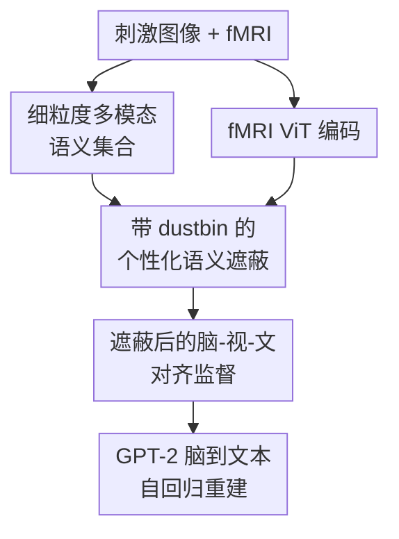

# Reducing Semantic Mismatch in Brain-to-Text Decoding Through Personalized Multimodal Masking

**会议**: ICLR2026  
**OpenReview**: [https://openreview.net/forum?id=ya00JrKTjp](https://openreview.net/forum?id=ya00JrKTjp)  
**代码**: 无  
**领域**: 医学图像 / 神经影像解码  
**关键词**: fMRI脑解码, 脑到文本生成, 语义错配, 最优传输, 多模态语义遮蔽

## 一句话总结
这篇论文提出 Yo'Mind，用最优传输驱动的个性化多模态语义遮蔽，把每个被试看图时真正被脑信号编码的视觉/文本语义挑出来，再用于脑到文本解码，从而缓解脑表征与机器表征之间的语义错配，并在 NSD 跨被试脑到文本重建上取得更好的结果。

## 研究背景与动机
**领域现状**：非侵入式脑解码近几年越来越依赖大模型表征：一类方法把 fMRI 映射到 Stable Diffusion 或 CLIP 这类视觉语义空间，用来做脑到图像重建；另一类方法把 fMRI 条件接入 GPT-2、GIT、BLIP 等语言模型，用自然语言描述被试看见的图像。对于脑到文本任务，关键不再是复原每个像素，而是从脑活动中读出足够稳定、可语言化的语义内容。

**现有痛点**：主流对齐思路通常把整张图像的全局表示当作监督目标，默认机器看到的语义和人脑编码的语义是一致的。但 VLM 的图像 embedding 往往会尽量编码画面里的所有可见元素，而人脑在观看自然图像时并不会平均关注所有内容。一个人可能关注男孩放风筝，另一个人可能更在意湖边风景，第三个人可能注意到旁边的狗。把同一个全局图像表示强行对齐到所有人的 fMRI，就容易产生语义错配。

**核心矛盾**：问题的根源在于机器表征是“场景全量语义”，脑信号更像“被试选择性编码后的语义子集”。这种选择性不仅受图像复杂度影响，还受个体兴趣、注意偏好和脑区语义分工影响。跨被试解码时矛盾更明显，因为同一张图像在不同被试脑中可能对应不同的语义重点。

**本文目标**：作者希望在没有额外人工标注、没有手工阈值、也不需要给每张图设定固定遮蔽数量的前提下，自动判断哪些视觉/语言语义成分更可能被某个被试的脑信号编码，并用这些成分作为脑到文本重建的监督。

**切入角度**：论文的关键观察是，视觉刺激可以拆成一组细粒度语义元素，fMRI 也可以拆成一组脑区/patch 表征；如果某个语义元素真的被脑活动编码，它应该能和某些 fMRI patch 建立低成本匹配。最优传输天然适合描述“从一组元素到另一组元素的软分配”，因此可以用来建模脑语义选择，而不是硬性删掉固定数量的图像 patch。

**核心 idea**：用带 dustbin 的最优传输，把图像 patch 语义和 MLLM 生成的文本语义动态分配给 fMRI patch 或“丢弃桶”，从而为每个被试构造个性化的、软遮蔽后的多模态语义监督。

## 方法详解
Yo'Mind 的方法可以理解为三个动作：先把一张刺激图像拆成视觉语义和语言语义集合，再用 fMRI patch 与这些语义元素做最优传输匹配，最后只用匹配上的语义元素监督脑到文本解码器。它不是直接让脑信号拟合整张图的全局 CLIP embedding，而是先问一个更细的问题：这位被试的大脑到底“接住了”哪些语义？

### 整体框架
输入是一名被试观看自然图像时的 fMRI 信号，以及对应的刺激图像。图像侧，模型用冻结的 CLIP vision encoder 提取图像 patch embedding，同时用 Harmon/Qwen2.5 生成区分该图像有用的语义描述，再经冻结的 CLIP text encoder 得到词级文本 embedding；脑信号侧，模型把 fMRI voxel 序列切成若干 patch，用 ViT 编码成脑表征。随后，Yo'Mind 在脑表征与多模态语义集合之间求解带 dustbin 的最优传输，得到个性化语义遮蔽结果，并把遮蔽后的语义目标用于训练脑到文本解码器。

### 关键设计
**1. 细粒度多模态语义集合：把“整张图”拆成可被脑信号选择的语义候选**

如果监督目标只有一条全局图像 embedding，模型很难区分“被试确实没编码这个物体”和“embedding 里恰好包含这个物体”。Yo'Mind 先把图像 $x$ 切成 $N$ 个非重叠 patch，用冻结的 CLIP vision encoder 得到视觉语义 $v_i$；同时让 Harmon 用固定 prompt 生成图像的区分性语义描述，再用 CLIP text encoder 得到 $M$ 个文本语义 $t_i$。这样一张图不再是单点表示，而是一个候选集合 $s_j=\{v_1,\ldots,v_N,t_1,\ldots,t_M\}$。

这个设计的意义在于给“选择性注意”留下操作空间。视觉 patch 提供位置相关的局部线索，文本语义提供对象、关系、氛围等更抽象的语言线索；二者都落在 CLIP 共享空间中，后续可以和 fMRI 表征做统一匹配。对于脑到文本任务，文本语义尤其重要，因为最终输出本来就是语言描述，而不是像素级图像。

**2. 带 dustbin 的个性化语义遮蔽：用最优传输软选择每个被试真正编码的语义**

给定 fMRI patch 表征 $r_i$ 和语义元素 $s_j$，Yo'Mind 用余弦距离构造匹配成本 $C_{i,j}=1-\langle r_i,s_j\rangle$，再通过 Sinkhorn 算法求解熵正则最优传输。普通 OT 会要求每个语义元素都被分配出去，这和本文问题并不匹配：有些图像元素可能根本没有被被试编码，强行匹配只会把噪声带进监督。

为了解决这个问题，论文借鉴 graph matching 里的 dustbin 思路，在成本矩阵里额外加入一行和一列可学习的虚拟桶。语义元素可以被分配给真实 fMRI patch，也可以被分配给 dustbin；求解后丢掉 dustbin，就得到部分分配矩阵 $P\in[0,1]^{K\times(N+M)}$，并满足 $P\mathbf{1}\leq\mathbf{1}$、$P^T\mathbf{1}\leq\mathbf{1}$。这一步把“遮蔽多少、遮蔽哪些、保留强度多大”都交给数据和匹配成本决定，避免了 Mind-SA 那种固定数量 hard masking 的刚性假设。

**3. 脑-视-文对齐监督：只让 fMRI 拟合被保留下来的个性化语义**

得到部分分配矩阵后，Yo'Mind 不再让每个 fMRI patch 去追整张图的语义，而是让它拟合由 $P$ 加权汇聚后的语义目标：$L_{align}=\sum_i\|r_i-\sum_j P_{i,j}s_j\|_2^2$。如果某些语义元素被分给 dustbin，它们不会进入这个监督项；如果某些元素只是弱相关，也会以较小权重参与。

这比全局对齐更贴近神经解码的实际结构。不同脑区/patch 可以对齐到不同语义成分，比如腹侧通路更偏物体类别，背侧或顶叶相关区域可能更偏空间与动作信息。跨被试训练时，这种软分配还允许同一张图在不同被试上形成不同的语义监督，从而把个体差异纳入统一模型，而不是把差异当作噪声抹平。

**4. 融入 MindGPT 的端到端脑到文本架构：把语义遮蔽变成可训练的解码收益**

Yo'Mind 的脑到文本部分沿用 MindGPT 风格：fMRI encoder 输出脑表征，冻结的 GPT-2Base 通过每层 cross-attention 接收脑条件，自回归生成词序列 $W=[w_i]_{i=1}^n$。训练时除了语义对齐损失，还优化语言建模目标 $P(W)=-\sum_i\log P(w_i|[w_j]_{j<i},F(y);\theta)$，其中 $F(y)$ 是 OT 引导后的 fMRI 编码结果。

这个接法让最优传输模块不只是解释工具，而是直接影响生成模型的训练信号。由于 Sinkhorn 求解和后续加权汇聚都是可微的，视觉/文本语义筛选、fMRI 表征学习和文本重建可以在一个端到端框架里联合优化。论文因此能在不改变 GPT-2 主体的情况下，把“人脑关注什么”注入到解码器前端。

### 损失函数 / 训练策略
实现上，视觉和文本编码器来自冻结的 CLIP ViT-B/32；fMRI encoder 是 16 层、16 头 self-attention 的 ViT。作者从 NSD 中选取早期视觉皮层、腹侧、外侧和顶叶相关 ROI，共 27,638 个 voxel，并把 fMRI 展平成一维序列后均匀切成 $K=8$ 个 patch。GPT-2Base 保持冻结，每个 decoder layer 加入 12 头 cross-attention，projection 维度设为 4。

训练时 Sinkhorn 迭代 100 次，熵正则参数 $\epsilon=1$；可学习参数主要是 fMRI encoder 和 GPT-2 cross-attention 层。优化器为 Adam，学习率 $1e^{-4}$，weight decay $1e^{-4}$，在 4 张 NVIDIA RTX 3090 上训练。整体训练目标由语义对齐损失和脑到文本自回归损失共同驱动：前者让脑表征靠近个性化筛出的语义，后者保证这些语义能转化为自然语言描述。

## 实验关键数据

### 主实验
论文主要在 Natural Scenes Dataset (NSD) 上评估。NSD 包含 8 名被试在 7T fMRI 下观看自然图像的数据；本文遵循既有设置，使用被试 1、2、5、7 的 27,750 个 trial，其中 2,770 个 trial、982 张共享 COCO 图像作为测试集。评价指标覆盖 BLEU-1/2/3/4、METEOR、ROUGE、CIDEr 和 SPICE。

| 方法 | 被试设置 | B@4 | METEOR | ROUGE | CIDEr | SPICE |
|------|----------|-----|--------|-------|-------|-------|
| MindGPT | S1/S2/S5/S7 | 15.87 | 20.04 | 38.41 | 43.56 | 10.97 |
| UMBRAE | S1/S2/S5/S7 | 18.40 | 19.24 | 43.64 | 57.76 | 12.42 |
| Mind-SA | S1/S2/S5/S7 | 18.86 | 38.08 | 42.72 | 54.03 | 12.25 |
| Yo'Mind | S1/S2/S5/S7 | 20.88 | 38.40 | 43.63 | 56.07 | 12.42 |
| Mind-SA† | Harmon caption | 32.46 | 36.25 | 54.26 | 79.48 | 18.72 |
| Yo'Mind† | Harmon caption | 33.36 | 39.25 | 55.19 | 81.16 | 19.25 |

相对 MindGPT，Yo'Mind 在 METEOR、BLEU-4、CIDEr 上分别带来约 91.6%、31.6%、28.7% 的提升。相对最相关的 Mind-SA，Yo'Mind 在 COCO caption 和 Harmon caption 两种标注设定下都更强，尤其在细粒度 Harmon 描述上，METEOR 从 36.25 提升到 39.25，CIDEr 从 79.48 提升到 81.16。

### 消融实验
| 配置 | B@4 | METEOR | ROUGE | CIDEr | 说明 |
|------|-----|--------|-------|-------|------|
| ventral + masking | 17.64 | 35.99 | 41.88 | 46.24 | 只用腹侧 ROI，加入语义遮蔽 |
| ventral, no masking | 15.90 | 21.05 | 38.98 | 43.68 | 去掉语义遮蔽后明显下降 |
| ventral+lateral+parietal + masking | 21.78 | 38.98 | 45.82 | 58.87 | 三类高层 ROI 下效果最好 |
| ventral+lateral+parietal, no masking | 16.37 | 21.26 | 38.06 | 46.87 | 同样 ROI 下，不做遮蔽损失很大 |
| visual only | 21.45 | 38.07 | 44.97 | 57.24 | 只用视觉语义集合 |
| text only | 18.35 | 32.95 | 41.87 | 45.02 | 只用文本语义集合 |
| visual + text | 21.78 | 38.98 | 45.82 | 58.87 | 多模态语义集合最稳 |

### 关键发现
- 个性化语义遮蔽是主要增益来源之一。在相同 ROI 下，加入 masking 后 METEOR 从 21.26 提升到 38.98，CIDEr 从 46.87 提升到 58.87，说明“先筛掉未被脑信号编码的语义”比简单扩大脑区输入更关键。
- 多模态语义集合优于单模态集合。visual only 已经很强，但加入文本语义后 METEOR、ROUGE、CIDEr 继续提升，说明 MLLM 生成的语言属性能补充图像 patch 难以表达的关系和场景语义。
- caption 质量会影响上限。使用 SMALLCAP、BLIP3o、Harmon 作为文本监督时，Harmon 在 METEOR 和 CIDEr 上最好，BLIP3o 在 B@4 与 ROUGE 上略高，整体说明更丰富、更结构化的文本描述更适合脑到文本解码。
- fMRI patch 数量不是越多越好。附录显示 $K=8$ 时 B@4/METEOR/ROUGE/CIDEr 为 20.88/38.40/43.63/56.07，优于 $K=4$ 和 $K=16$，这与 NSD ROI 的脑区组织结构相匹配。
- 统计检验显示收益稳定。作者对测试集做 100 次 bootstrap，并用双尾 paired t-test 比较 Yo'Mind 与 Mind-SA，所有指标上均达到 $P<0.0001$。

## 亮点与洞察
- 最巧妙的点是把语义 mismatch 转化为“集合匹配 + 可丢弃元素”的问题。dustbin 让模型可以诚实地说“这个语义不在该被试的脑信号里”，比固定删 patch 更自然。
- 论文把神经科学中的选择性注意和机器学习中的最优传输连起来。它没有直接预测注意力热图，而是从脑表征与语义元素的匹配结构中间接恢复 brain-preferred semantics，这对解释脑解码模型很有启发。
- 多模态语义集合的设计很实用。视觉 patch 保留图像局部信息，文本描述补充对象关系和场景属性，两者统一到 CLIP 空间后，fMRI 可以选择自己更接近的那部分语义。
- 对跨被试建模来说，Yo'Mind 的软分配比共享 latent space 更细。共享空间解决“不同被试能不能放到一起训练”，而个性化 masking 进一步回答“同一图像对不同被试应该监督哪些语义”。
- 这个思路可以迁移到其他脑机接口任务。例如脑到图像重建可以把 Yo'Mind 作为高层语义流，再配合低层视觉结构流；语音脑解码也可以把声学片段、词义和语境描述构造成多模态语义集合。

## 局限与展望
- 最大局限是 brain-preferred semantics 的生物学验证还不充分。NSD 中被试大多保持中央注视，眼动数据不能充分反映 covert attention，因此当前可视化更像模型解释证据，而不是严格的神经科学验证。
- 方法依赖 CLIP、Harmon 和 GPT-2 等外部大模型表征。如果这些模型本身存在偏差，所谓“语义候选集合”也会带着机器先验，未必完全覆盖人脑真正编码的内容。
- 实验主要集中在 NSD 和附录 DIR，两者都是视觉刺激诱发的 fMRI 数据。对于更自然的动态视频、自由观看、语言刺激或真实 BCI 场景，语义集合构造和 OT 匹配是否仍然稳定，还需要进一步验证。
- 计算上，Sinkhorn 在固定迭代和固定 fMRI patch 数下可以 GPU 高效实现，但当文本语义集合很长、图像 patch 更密或扩展到视频时，$N+M$ 的线性增长仍可能带来成本压力。
- 后续可以结合显式眼动、行为报告、注意力任务或多模态生理信号来验证分配矩阵是否真的对应被试关注内容，而不是只对应有利于重建指标的统计相关。

## 相关工作与启发
- **vs MindGPT**: MindGPT 已经能把 fMRI 接到 GPT-2 做脑到文本生成，但它更接近全局语义对齐，缺少对“哪些语义被被试实际编码”的显式建模。Yo'Mind 保留 MindGPT 的生成框架，把核心改动放在前端的个性化语义监督上。
- **vs Mind-SA**: Mind-SA 首先强调 semantic mismatch，并通过固定数量的图像 patch 删除来保留语义共识。Yo'Mind 的进步在于从 hard masking 改成 OT soft allocation，并用 dustbin 自动决定冗余语义，不需要手动指定删多少 patch。
- **vs UMBRAE / Neuro2Language**: 这些方法更关注跨被试共享表征或统一解码框架。Yo'Mind 同样支持跨被试，但把个体差异落实到每张图、每个语义元素与每个 fMRI patch 的匹配上，粒度更细。
- **vs 脑到图像重建方法**: Stable Diffusion 类方法追求视觉保真，通常需要低层结构和高层语义双流。Yo'Mind 更适合解释“被试理解了什么”，如果要做图像重建，可以作为高层 caption/semantic stream 接入扩散模型。
- **启发**: 对多模态学习来说，Yo'Mind 提醒我们不要把所有模态都粗暴拉到一个全局向量空间；当不同模态天然只共享部分语义时，先做可丢弃、可解释的局部匹配，可能比全局对齐更稳。

## 评分
- 新颖性: ⭐⭐⭐⭐⭐ 把带 dustbin 的最优传输用于个性化脑语义遮蔽，问题定义和建模方式都比较清晰。
- 实验充分度: ⭐⭐⭐⭐ 覆盖主结果、统计检验、ROI、模态、caption 来源和 fMRI patch 数消融，但对真实注意机制的生物学验证仍偏弱。
- 写作质量: ⭐⭐⭐⭐ 论文动机讲得顺，方法公式完整，定性图也有解释；少数表格和 caption 设定之间需要读者仔细区分。
- 价值: ⭐⭐⭐⭐⭐ 对脑到文本解码、跨被试神经表征对齐和可解释脑机接口都有参考价值，尤其适合作为 semantic mismatch 方向的后续基线。

<!-- RELATED:START -->

## 相关论文

- [\[ICLR 2026\] SEED: Towards More Accurate Semantic Evaluation for Visual Brain Decoding](seed_towards_more_accurate_semantic_evaluation_for_visual_brain_decoding.md)
- [\[ICLR 2026\] Seeing Through the Brain: New Insights from Decoding Visual Stimuli with fMRI](seeing_through_the_brain_new_insights_from_decoding_visual_stimuli_with_fmri.md)
- [\[ECCV 2024\] UMBRAE: Unified Multimodal Brain Decoding](../../ECCV2024/medical_imaging/umbrae_unified_multimodal_brain_decoding.md)
- [\[ICCV 2025\] Beyond Brain Decoding: Visual-Semantic Reconstructions to Mental Creation Extension Based on fMRI](../../ICCV2025/medical_imaging/beyond_brain_decoding_visualsemantic_reconstructions_to_ment.md)
- [\[ICLR 2026\] Towards Interpretable Visual Decoding with Attention to Brain Representations](towards_interpretable_visual_decoding_with_attention_to_brain_representations.md)

<!-- RELATED:END -->
