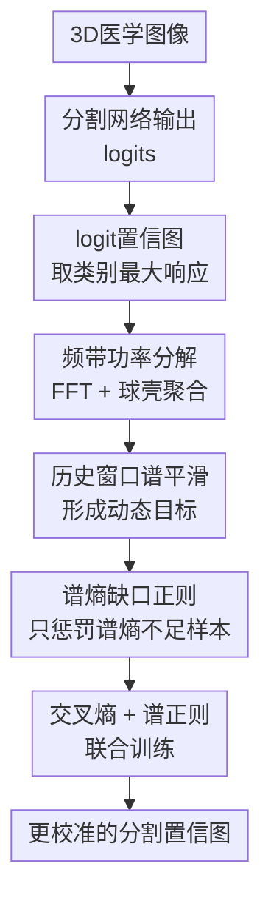

# Rethinking Model Calibration through Spectral Entropy Regularization in Medical Image Segmentation

**会议**: ICLR2026  
**OpenReview**: [https://openreview.net/forum?id=SOFSVaZXSj](https://openreview.net/forum?id=SOFSVaZXSj)  
**代码**: 无  
**领域**: 医学图像  
**关键词**: 医学图像分割, 模型校准, 谱熵正则, 不确定性估计, 频域分析  

## 一句话总结
这篇论文把医学图像分割中的过置信校准问题重新放到频域里看，认为低频主导的 spectral bias 和置信图总谱能量被压低的 confidence saturation 会共同导致边界不确定性失真，并用谱熵正则与跨 batch 的功率谱平滑在训练时改善校准，同时基本不牺牲分割精度。

## 研究背景与动机
**领域现状**：医学图像分割模型已经能在肿瘤、器官、心脏结构、前列腺等任务上取得很高的 Dice，但临床系统不能只看分割轮廓是否像，还要知道模型在每个体素上的置信度是否可信。理想情况下，模型说某个体素属于病灶的置信度是 0.8，那么相似情况下它大约应该有 80% 的概率是对的；这就是校准问题。

**现有痛点**：现实中的分割网络常常在病灶边界、器官薄结构、模糊组织交界处给出过高置信度。后处理式校准如 temperature scaling 或 Platt scaling 通常只在整体 logit 分布上做全局调整，难以适配不同器官、模态和局部区域；训练期方法如 Label Smoothing、Focal Loss、MarginLoss、SVLS、CRaC 虽然能抑制一部分过置信，但主要还是在空间域或类别概率上加约束，很少直接问一个问题：置信图本身在频域里应该是什么样子？

**核心矛盾**：医学分割的置信图需要同时表达两类信息。低频部分对应器官或病灶的大尺度结构，决定模型是否知道目标大概在哪里；高频部分对应边界和细小结构，决定模型能否把不确定性放在真正模糊的地方。普通神经网络训练存在 spectral bias，倾向先学低频、弱化高频，而过置信的置信图又会变得接近大片饱和值，导致整体功率谱密度偏低。这样一来，模型看似很自信，实际却把边界不确定性和结构变化都压扁了。

**本文目标**：作者希望设计一个训练期校准方法，让分割模型在保持像素级交叉熵监督和分割精度的同时，主动维护置信图的频谱丰富度。具体来说，方法要能减少低频过度集中，补回高频边界信息，并避免每个 batch 的频谱统计因为样本差异太大而给训练带来噪声。

**切入角度**：论文先用合成二分类置信图做观察：内部区域保持满置信，边界置信从过置信的 1.0 逐步降到更合理的 0.5。PSD 分析显示，边界越接近校准状态，频带上的功率越丰富；过置信图反而谱能量稀疏。这说明校准不只是概率温度问题，也能表现为置信图的频域结构问题。

**核心 idea**：用置信图的谱熵作为训练正则，让每个样本的频带功率分布不要比动态平滑目标更塌缩，从而把医学分割校准从“压低概率”转为“让置信图保留合理的频域复杂度”。

## 方法详解
### 整体框架
本文方法是一个插入训练目标的 frequency-aware calibration 框架。给定 3D 医学图像，分割网络先输出每个类别的 logits；方法从 logits 中取每个体素的最大类别响应构成标量置信图，再对置信图做 3D FFT、按同心频带聚合功率谱，得到每个样本的频带功率向量。随后，当前 batch 的频谱统计会进入一个历史窗口形成平滑目标，最后用 hinge-like 的谱熵正则惩罚谱熵不足的样本，并与普通交叉熵一起优化。

这里的关键不是直接最大化预测熵，也不是把输出概率统一压软，而是约束“置信图的频带功率是否过于单一”。如果某个样本的功率几乎都集中在低频，说明它可能把边界和细节不确定性抹平了；如果频带分布更均衡，它就更有能力同时表达结构和边界层面的不确定性。

### 关键设计
**1. 频带功率分解：把过置信从空间图像问题转成频谱分布问题**

论文首先从网络 logits 构造标量置信图，而不是直接用 softmax 概率。原因是 softmax 容易在 0 或 1 附近饱和，反而会遮住过置信形成之前的证据强度；logits 保留了更宽的动态范围，更适合观察模型什么时候把某些区域推得过于自信。对每个样本 $b$，方法取 $z_b(d,h,w)=\max_c z_{b,c}(d,h,w)$，得到一个 3D 标量场。

接下来对这个标量场做 3D FFT 并中心化频谱，计算功率谱密度 $E_b(u,v,w)=|F_b(u,v,w)|^2$。为了把复杂的 3D 频谱压成可训练的统计量，作者按频率半径划分 $K$ 个同心球壳频带 $I_k$，并在每个频带内求和得到 $S_b^{(k)}=\sum_{(u,v,w)\in I_k}E_b(u,v,w)$。这样，一个置信图就被表示成 $K$ 维频带功率向量，低频结构和高频边界信息可以被分开度量。

这个设计抓住了医学分割校准的特殊性：分割错误或不确定性常常不是全图均匀发生，而是集中在边界、薄结构和形态复杂区域。空间域上单纯调整概率可能会把所有区域一起变软；频域上的功率分解则能显式看到模型是否把置信变化压成了低频平滑块。

**2. 历史窗口谱平滑：用跨 batch 的动态目标减少频谱反馈噪声**

如果直接拿当前 batch 的频谱分布当目标，训练信号会很不稳定。医学图像 batch size 通常很小，本文实验里 batch size 为 2，不同病例、器官大小、病灶形态会让频带功率差异非常大。某一批样本可能天然边界复杂，另一批可能结构更平滑，直接逐 batch 正则容易让模型追着噪声跑。

因此作者维护一个长度为 $W$ 的历史频谱窗口。每个 batch 先把样本频带功率平均成当前 batch 的谱向量，再加入历史 buffer；目标谱向量 $\tilde{S}$ 是最近 $W$ 个 batch 的平均。早期训练时历史不足，就复制当前 batch 统计来初始化，避免目标为空或数值跳变。这个机制让谱熵目标随训练动态更新，但不会被单个病例的形态强烈支配。

这个平滑目标也解释了为什么方法不是固定追求“完全均匀频谱”。医学图像本身并不应该每个频带一样强，器官结构和扫描分辨率会决定合理谱形。历史窗口给出的是当前数据和模型状态下的参考复杂度，正则只要求单个样本不要比这个参考更塌缩。

**3. 谱熵缺口正则：只拉起谱熵不足的样本，避免把已合理样本过度扰动**

有了样本频带功率 $S_b$ 和平滑目标 $\tilde{S}$ 后，方法先把它们归一化成频带概率分布 $P_b$ 和 $\tilde{P}$：$P^{(k)}=S^{(k)}/(\sum_j S^{(j)}+\epsilon)$。然后用 Shannon entropy 衡量频谱分布是否均衡：$H_{spec}(P)=-\sum_{k=1}^{K}P^{(k)}\log(P^{(k)}+\epsilon)$。如果功率集中在少数低频，谱熵会低；如果多个频带都有贡献，谱熵会高。

正则项采用 hinge-like 形式：$L_{Spectral}=\frac{1}{B}\sum_{b\in B}[\max(0,H_{spec}(\tilde{P})-H_{spec}(P_b))]^2$。这意味着只有当某个样本的谱熵低于动态目标时才会产生惩罚；已经具有足够频谱多样性的样本不会被继续推高熵。这个选择比无脑最大化谱熵更稳，因为医学图像置信图仍然需要保留真实结构，不应该为了频域均匀而制造无意义的高频噪声。

论文给出的解释是，谱熵本身是尺度不变的，但当模型在交叉熵约束下想提高样本谱熵时，不能简单把全部 logit 能量压低到平坦状态，否则会损害分割任务；它更自然的路径是把过度集中的低频功率重新分配到被压制的频带，特别是与边界不确定性相关的高频成分。这样既缓解 spectral bias，也对抗 confidence saturation。

**4. 与分割目标联合优化：把校准作为训练期轻量正则而不是额外推理流程**

最终训练目标是 $L_{total}=L_{CE}+\lambda L_{Spectral}$。$L_{CE}$ 保证体素级分类准确，$L_{Spectral}$ 约束置信图的频域复杂度，$\lambda$ 控制校准强度和分割精度之间的权衡。论文在不同数据集上展示了 $\lambda$ 的敏感性：过小会正则不足，过大可能让 Dice 下降，适中的 $0.01$ 到 $0.05$ 通常较稳。

这个设计的工程价值在于它不要求多次推理、模型集成或贝叶斯采样，也不依赖额外的 ground-truth spectrum。训练时只在输出 logits 上增加频域统计和一个正则项，测试时仍然是普通分割网络前向。对临床部署来说，这比 MC-Dropout 或 ensemble 更轻，也比 post-hoc calibration 更能进入模型学习过程本身。

### 损失函数 / 训练策略
训练流程可以概括为四步。第一步，输入 batch 后得到 logits $z=f_\theta(x)$，计算常规交叉熵 $L_{CE}$。第二步，对每个样本取最大 logit 形成置信图，做 3D FFT、频谱中心化、PSD 计算，并在 $K$ 个球壳频带里聚合功率。第三步，当前 batch 的平均谱向量进入长度为 $W$ 的历史窗口，得到平滑目标 $\tilde{S}$ 和目标谱熵 $H_{spec}(\tilde{P})$。第四步，对每个样本计算谱熵缺口损失，与交叉熵加权相加后反向传播。

实验默认设置是在 U-Net 上训练 3D patch，patch size 为 $96\times96\times96$，batch size 为 2，优化器为 SGD，初始学习率 0.01。校准指标包括 ECE、SCE、TACE，其中 ECE 和 SCE 使用 15 个 bins，TACE 的阈值为 $\epsilon=0.001$。附录超参数分析显示，窗口大小 $W=50$、频带数 $K=3$ 到 $7$、正则权重 $\lambda$ 在适中范围时比较稳；过小窗口会让目标噪声偏大，过大窗口会对训练分布变化反应太慢，过多频带则更容易受噪声影响。

## 实验关键数据
### 主实验
论文在六个公开医学图像分割数据集上评估：BraTS2020、iSeg2017、FLARE2021、ACDC、ATLAS2023、PROMISE2012，覆盖脑肿瘤、婴儿脑 MRI、腹部器官、心脏、肝肿瘤、前列腺等场景。主干实验使用 U-Net，并与 CE、Focal Loss、Label Smoothing、MbLS、SVLS、CRaC 等训练期校准方法比较。

| 数据集 | 指标 | CE | 最强对比方法 | 本文 | 结论 |
|--------|------|----|--------------|------|------|
| BraTS2020 | DSC↑ / ECE↓ | 86.9 / 9.1e-3 | CRaC ECE 2.2e-3, MbLS ECE 1.9e-3 | 87.2 / 1.5e-3 | Dice 略升，ECE 最低 |
| iSeg2017 | DSC↑ / ECE↓ | 94.2 / 4.5e-3 | MbLS ECE 2.1e-3 | 94.4 / 2.0e-3 | 分割和校准都小幅领先 |
| FLARE2021 | DSC↑ / ECE↓ | 91.5 / 25.5e-3 | MbLS ECE 2.2e-3 | 92.5 / 0.8e-3 | 腹部器官上校准提升非常明显 |
| ACDC | DSC↑ / ECE↓ | 91.1 / 32.5e-3 | MbLS ECE 23.2e-3 | 91.3 / 2.1e-3 | ECE 大幅降低，Dice 不降 |
| ATLAS2023 | DSC↑ / ECE↓ | 68.7 / 24.9e-3 | SVLS ECE 6.8e-3, CRaC ECE 7.0e-3 | 71.8 / 5.5e-3 | 困难肝肿瘤数据上精度和校准同时最好 |
| PROMISE2012 | DSC↑ / ECE↓ | 80.2 / 11.7e-3 | CE ECE 11.7e-3 | 81.2 / 10.8e-3 | 校准小幅改进，分割更好 |

从表格看，本文不是只靠牺牲分割精度换校准。尤其在 FLARE2021 和 ATLAS2023 这类结构复杂、类别或病灶变化较大的任务上，DSC、HD95、ASD 与 ECE/SCE 同时改善，说明频域约束没有简单把预测变软，而是在边界和结构不确定性表达上更稳。

### 消融实验
作者在 BraTS2020 和 FLARE2021 上做了关键消融：只用交叉熵、加入没有历史窗口的谱熵正则、加入完整的谱熵正则和平滑窗口。

| 配置 | BraTS DSC↑ | BraTS ECE↓ | FLARE DSC↑ | FLARE ECE↓ | 说明 |
|------|------------|------------|------------|------------|------|
| Baseline $L_{CE}$ | 0.869 | 0.0091 | 0.915 | 0.0255 | 普通分割训练，存在明显过置信 |
| $L_{CE}$ + $L_{Spectral}$ w/o $W$ | 0.870 | 0.0065 | 0.921 | 0.0170 | 频域正则有效，但即时谱目标仍偏噪 |
| $L_{CE}$ + $L_{Spectral}$ | 0.872 | 0.0015 | 0.925 | 0.0008 | 平滑谱目标后，分割和校准都进一步提升 |

这个消融很关键：单独加入谱熵正则已经能降低 ECE，说明“频域复杂度不足”确实和校准有关；加入窗口平滑后提升更大，说明医学图像小 batch 的频谱统计如果不平滑，正则目标会不够稳定。

### 关键发现
- 本文在 ECE 和 SCE 上几乎全面领先；TACE 上 CRaC 在 ACDC 和 PROMISE2012 有局部优势，作者解释为 CRaC 对小而规则的解剖结构做了更细的局部置信约束，但这种局部优势并没有转化为整体分割指标的稳定领先。
- 频谱可视化显示，CE baseline 的总体谱功率最低，并且 PSD 斜率更陡，符合 confidence saturation 和低频主导；Focal Loss 会进一步压制高频，导致边界不确定性表达偏弱；本文方法则在高频区域保留更多功率，可靠性曲线也更接近理想对角线。
- 架构泛化实验覆盖 nnUNet、SwinUNETR、UNet++、AttentionUNet、TransUNet。固定超参数下，方法对多种分割架构都能提高 DSC 并降低 ECE，说明它更像输出置信图层面的通用正则，而不是只适配 U-Net 的技巧。
- 超参数分析表明，$\lambda$ 过大虽然可能继续降低 ECE，但会损害 DSC；$W$ 过小目标噪声大，过大适应慢；$K$ 太少看不清频谱结构，太多又容易受噪声影响。方法有效，但仍需要按数据集做适度调参。

## 亮点与洞察
- 这篇论文最有意思的地方是把“过置信”解释成置信图频谱塌缩，而不是只把它看成 softmax 概率太尖。这个视角让边界不确定性、低频结构、高频细节之间有了可度量的连接，也解释了为什么一些简单压低置信度的方法会造成 underconfidence。
- 谱熵正则的 hinge 形式比较克制：它不追求越熵越高越好，只防止样本比动态目标更低熵。这一点很重要，因为医学分割的置信图应该有结构，不能为了校准把所有边界都变成噪声状不确定。
- 历史窗口平滑是一个小但实用的设计。医学 3D 分割常受显存限制，batch 很小，很多统计正则在这种设置下会不稳定；跨 batch 聚合频谱目标能让正则更像数据分布层面的约束，而不是单个病例的偶然形态。
- 这套思想可以迁移到其他 dense prediction 任务，例如遥感分割、自动驾驶语义分割、病灶检测热图校准。只要输出置信图存在“大片过置信 + 边界不确定性不足”的问题，就可以考虑对输出谱结构而不是输入图像谱结构做正则。

## 局限与展望
- 论文主要在全监督医学图像分割中验证，尚未充分讨论 domain shift、跨医院扫描协议变化、低标注或半监督场景下频谱目标是否仍稳定。频域统计可能会随分辨率、器官尺度和预处理策略变化，跨域部署仍需验证。
- 方法引入了 $\lambda$、$W$、$K$ 等超参数。虽然附录给出敏感性分析，但临床数据集差异很大，真实部署时仍需要验证集调参；如果验证集很小，动态目标和校准指标可能存在估计偏差。
- 论文从最大 logit 构造置信图，这对多类别分割很自然，但也可能忽略次高类别与最高类别之间的 margin 信息。未来可以考虑把 logit margin、class-wise confidence map 或不确定性熵图一起纳入频域约束。
- 频谱均衡和语义正确性之间仍有边界。高频功率增加不必然等于更好的边界校准，如果数据噪声、标注边界不一致或重采样伪影强，频域正则可能放大非语义高频。后续可以结合边界 mask、解剖先验或标注不确定性来约束哪些高频值得保留。

## 相关工作与启发
- **vs Temperature Scaling / Platt Scaling**: 这些后处理方法在训练后调整 logits 或概率分布，优点是简单，但通常是全局校准；本文在训练期直接约束输出置信图的频域结构，更适合医学图像中不同区域不确定性差异很大的情况。
- **vs Label Smoothing / Focal Loss**: Label Smoothing 和 Focal Loss 都会改变类别概率的尖锐程度，但容易出现整体变软或局部 underconfidence；本文不是直接压低概率，而是要求置信图保留合理频带复杂度，因此能更好兼顾 Dice 和 ECE。
- **vs SVLS / CRaC**: SVLS 和 CRaC 代表空间域、区域约束式校准，关注邻域或类别区域的置信一致性；本文则从频域看结构和边界不确定性，两者关注的统计不同。未来可以把空间区域约束和谱熵正则结合起来，让校准同时具备局部语义感知和频域复杂度约束。
- **vs 频域医学分割方法**: 许多频域方法处理输入图像、特征或 ground-truth spectrum，目标多是提升鲁棒性或分割精度；本文直接正则输出 confidence/logit map 的频谱，并且不需要 ground truth 的频谱模板，重点是校准可信度。

## 评分
- 新颖性: ⭐⭐⭐⭐⭐ 从频域解释并正则医学分割校准，角度清晰且和传统概率校准有明显区别。
- 实验充分度: ⭐⭐⭐⭐⭐ 六个公开数据集、多种校准指标、多架构泛化、消融和超参数分析都比较完整。
- 写作质量: ⭐⭐⭐⭐ 论文主线清楚，频谱动机和实验现象能对上；但个别地方对“谱熵如何增加总谱能量”的解释还可以更严谨。
- 价值: ⭐⭐⭐⭐⭐ 对需要可信置信图的医学分割很有实践意义，也给 dense prediction 校准提供了一个可迁移的频域正则思路。

<!-- RELATED:START -->

## 相关论文

- [\[ICLR 2026\] K-Prism: A Knowledge-Guided and Prompt Integrated Universal Medical Image Segmentation Model](k-prism_a_knowledge-guided_and_prompt_integrated_universal_medical_image_segment.md)
- [\[AAAI 2026\] Refine and Align: Confidence Calibration through Multi-Agent Interaction in VQA](../../AAAI2026/medical_imaging/refine_and_align_confidence_calibration_through_multi-agent_interaction_in_vqa.md)
- [\[CVPR 2026\] GeoSemba: Reconstructing State Space Model for Cross Paradigm Representation in Medical Image Segmentation](../../CVPR2026/medical_imaging/geosemba_reconstructing_state_space_model_for_cross_paradigm_representation_in_m.md)
- [\[CVPR 2026\] TANGO: Learning Distribution-wise Foundation Prior Consistency and Instance-wise Style Calibration for Medical Image Generalization](../../CVPR2026/medical_imaging/tango_learning_distribution-wise_foundation_prior_consistency_and_instance-wise_.md)
- [\[CVPR 2026\] Learning Diffeomorphism for Medical Image Registration with Time-Embedded Architectures Using Semigroup Regularization](../../CVPR2026/medical_imaging/learning_diffeomorphism_for_medical_image_registration_with_time-embedded_archit.md)

<!-- RELATED:END -->
