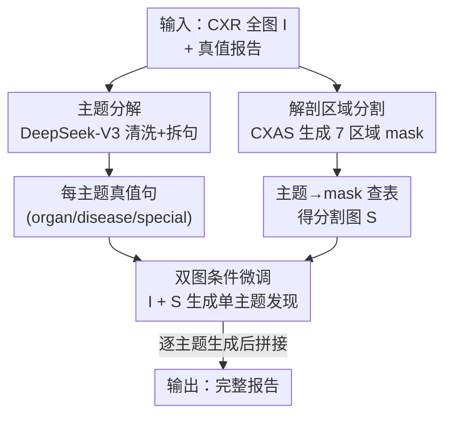

# Rethinking Radiology Report Generation: From Narrative Flow to Topic-Guided Findings

**会议**: ICLR 2026  
**OpenReview**: [https://openreview.net/forum?id=nV3SAjFlyv](https://openreview.net/forum?id=nV3SAjFlyv)  
**代码**: 待确认  
**领域**: 医学图像 / 多模态VLM  
**关键词**: 放射报告生成、视觉接地、主题分解、解剖分割、幻觉抑制

## 一句话总结
本文指出"模仿放射科医生叙事流"的报告生成范式会让 VLM 过度依赖语言先验、削弱视觉接地，于是提出 LLaVA-TA：把整篇报告拆成按解剖区域组织的独立主题、每个主题只看全图+对应解剖 mask 单独生成一句话发现，在 MIMIC-CXR 上把 RadGraph F1（report 级 29.4→34.3、topic 级最高 44.0）和 CheXpert F1 大幅刷新。

## 研究背景与动机

**领域现状**：放射报告生成（RRG）的主流做法是把 VLM 当成通用 caption 模型来微调，让它把整篇报告当作一个连续的文本序列、自回归地"一句接一句"生成，模仿人类医生的叙事行文（narrative flow）。这是从通用视觉-语言任务直接迁移过来的范式。

**现有痛点**：RRG 对错误的容忍度极低——一个幻觉性的"发现"可能带来严重临床后果。但作者怀疑：以叙事连贯性为优化目标，会诱导模型依赖"句子之间的语言相关性"，而不是老老实实看图。换句话说，模型学会了"上一句说了心脏，下一句大概率该说肺"这种语言模式，反而盖过了图像中的直接证据。

**核心矛盾**：作者设计了一个受控实验来验证这个假设——让预训练的 LLaVA-Rad 在给定前若干句真值的条件下补全报告最后 $K$ 句，并对比"喂真实 CXR"与"喂全黑图像"两种情况的指标差距。结果（Fig.1）很清楚：随着提供的文本前缀越长（$K$ 越小），用真图相对黑图的性能增益越来越小。也就是说**文本上下文越多，模型越无视输入图像**，转而靠语言先验补全。这就是本文命名的"叙事偏置（Narrative Bias）"：自回归模型 $P(y_t|y_{<t}, I)$ 倾向于最大化语言概率 $P(y_t|y_{<t})$ 而非视觉条件概率 $P(y_t|I)$。

**本文目标**：在不牺牲语言质量的前提下，强制模型把每一个临床发现都接地到对应的视觉证据上，从根上切断"前文 token 主导后文发现"的依赖链。已有工作（MAIRA-2、DART 的显式接地与自纠错、Multi-Phased Supervision 的分层训练等）虽然在对齐上有进展，但仍保留了让早期 token 决定后续概率的自回归叙事结构，没有真正瓦解句间依赖。

**切入角度**：既然叙事流是病根，那就**拆掉叙事结构本身**。把报告从"一条线性叙事"重构成"一组互相独立、各自只对一个临床主题负责的发现"，每个主题只盯着它对应的解剖区域看图说话。

**核心 idea**：用"按主题分解 + 解剖区域接地"取代"线性叙事生成"——让模型对每个临床主题（如 organ-lungs、disease-consolidation）单独、独立地生成一句视觉接地的发现，从而打断句间语言先验、逼出更严格的视觉接地。

## 方法详解

### 整体框架
LLaVA-TA 的核心是把"非结构化、叙事式"的训练监督，替换成"主题与解剖区域显式对齐"的结构化监督。整条 pipeline 分三步：先用 LLM 把每篇真值报告拆成一组干净的、按临床主题对齐的原子句子；同时用专门的 CXR 分割模型给每张图生成各解剖区域的 mask；最后在微调阶段，模型同时看"全图 + 该主题对应的解剖 mask 图"，被提示只为单个主题生成一句发现。推理时再把各主题逐一生成的句子拼接成完整报告。

### 关键设计

**1. 主题引导的报告分解：把线性叙事拆成互相独立的原子发现**

这一步直接针对"叙事偏置"的病根——句间依赖。作者用指令跟随型 LLM（DeepSeek-V3）对每篇真值报告做两件事：**清洗**（去掉"与上次检查相比""可能是肺不张"这类比较性、推测性措辞，只留当前图像可见的、基于证据的发现）和**主题切分**（按一个分层本体把每句话映射到唯一主题，优先级为：① 病理级如 disease-consolidation，② 解剖级如 organ-lungs，③ 辅助类如 support devices）。切分时强制"一句话只对应一个主题"、比较/含糊措辞被改写、否定表述标准化（如统一成"Pneumothorax is absent"）。这样每篇报告就变成一组直接、清晰、视觉接地的句子目标。为什么有效：训练目标从"一长串相互纠缠的叙事"变成"一句一主题的短监督信号"，模型再也无法靠句间相关性蒙混过关，幻觉的"运气式猜测"空间被大幅压缩。作者还验证了分解质量——把拆出的句子拼回整段后，BLEU-1 58.7 / BLEU-4 38.0 / ROUGE-L 60.8、RadGraph-F1 67.2，说明分解保留了高词汇与临床保真度。

**2. 解剖区域分割提供空间接地：让每个主题只盯着该看的区域**

光拆主题还不够，得告诉模型"心脏的发现去看心脏那块"。作者用 CXAS（一个 UNet 系的专用分割模型）把每张 CXR 分成 7 个关键解剖区域：椎骨、肋骨、横膈、纵隔、腹部、心脏、左右肺。每个临床主题通过一张预定义查表映射到一个或多个区域（如 disease-pleural effusion 可能同时涉及肺和横膈，则把对应 mask 合并）。这样每个"主题-句子"对就有了两路对齐的视觉输入：原始全局图 $I$ 和主题专属分割图 $S$。这种双输入策略把模型注意力聚焦到相关区域、降低无关区域噪声，也提升了可解释性。

**3. 双图条件的视觉-语言微调：用结构化 prompt 把全图与局部图喂进 LLM**

微调架构沿用 LLaVA-Rad 三件套：视觉编码器 BiomedCLIP-CXR（在 697k 放射图-报告对上预训练，分别编码 $I$ 和 $S$ 得到 $Z_I$、$Z_S$）、可学习 MLP 对齐层（把视觉嵌入投影到 LLM 词嵌入空间）、语言模型 Vicuna-7B-v1.5。每个训练样本是一条含两个 `<image>` 占位符的结构化 prompt："Given the image `<image>` and the segmented part `<image>`, describe the findings for the topic: *topic*."，前向时两个占位符的 token 嵌入被替换成 MLP 投影后的视觉嵌入，拼成一条统一序列。训练目标就是标准自回归交叉熵：

$$\mathcal{L}(\theta) = -\sum_{t=1}^{L} \log P(y_t \mid y_{<t}, X_{\text{prompt}}, Z_I, Z_S; \theta)$$

采用两阶段协议：阶段一冻结视觉编码器和 LLM、只训 MLP 做跨模态对齐；阶段二保持视觉编码器冻结、用 LoRA（rank=128）端到端微调 MLP+LLM。关键点在于：损失虽是自回归，但因为每条样本只针对单个主题、目标句很短，模型没有机会跨主题"接话"，自回归的语言先验被监督粒度天然约束住了。

### 一个完整示例
以一张报告为例（Fig.2）。原报告是一段叙事："The lungs are low in volume, which obscures the right lower lung calcified granuloma. No focal consolidation is seen. There is no pleural effusion or pneumothorax. The heart is normal in size with post-surgical changes..."。经主题分解后变成一组独立条目：`organ-lungs`→"The lungs are low in volume." + "A right lower lung calcified granuloma is present."；`disease-consolidation`→"Focal consolidation is absent."；`disease-pleural effusion`→"Pleural effusion is absent."；`organ-heart`→"The heart is normal in size."；`support devices`→"Intact mediastinal wires are present."。训练时若取主题 `organ-lungs`，则把全图 $I$ 和肺区分割图 $S$ 一起喂入，prompt 要模型只描述肺部发现，目标即上面那两句肺部句子。推理拼报告时，对每篇报告固定喂入全部 organ 级和 special 级主题以保证解剖覆盖完整，disease 级主题则用测试集真值疾病标签作为 prompt（这是刻意的实验设计，把生成质量从上游疾病分类器的误差里隔离出来，便于公平对比）。

### 损失函数 / 训练策略
数据用 MIMIC-CXR-JPG（仅正位、含 Findings 段），预处理后 212,379 训练 / 1,721 验证 / 3,029 测试报告对；经主题切分膨胀为 1,161,753 训练 / 9,388 验证 / 17,193 测试的主题级对。阶段一：1 epoch、batch 256、lr 1e-3、cosine + 0.03 warmup；阶段二：3 epoch、batch 64、lr 1e-4、LoRA rank 128。全程 4×A100(40G)。跨域泛化在 IU-Xray 上用同一管线评测。

## 实验关键数据

### 主实验
MIMIC-CXR-JPG 测试集（节选关键行；topic / report 为两种评测设定）。LLaVA-TA 全面刷新 SOTA，7B 模型甚至超过 Med-PaLM M(84B)、GPT-4V。

| 模型 | 规模 | RadGraph F1 | CheXpert Macro-F1-14 | BLEU-4 | ROUGE-L |
|------|------|-------------|----------------------|--------|---------|
| LLaVA-Rad | 7B | 29.4 | 39.5 | 16.1 | 30.8 |
| MAIRA-1 | 7B | 29.6 | 42.3 | 14.2 | 28.9 |
| Med-PaLM M | 84B | 26.7 | — | 11.3 | 27.3 |
| LLaVA-T (report) | 7B | 34.2 | 63.0 | 25.7 | 41.8 |
| **LLaVA-TA (report)** | 7B | **34.3** | **62.4** | **24.8** | **42.6** |
| LLaVA-TA (topic) | 7B | 44.0 | 77.9 | 31.8 | 60.6 |

> 注：摘要中"RadGraph F1 29.4→44.0、CheXpert F1-14 39.5→71.5"取的是 topic 级数字；report 级对应提升为 29.4→34.3、39.5→62.4。topic 级评测只考核真值中出现的主题，避免 RadGraph 把"正确生成的阴性发现"误判为 false positive，故数值系统性更高，两种设定不可直接横比。

### 消融实验

| 配置 | RadGraph F1 (report) | 说明 |
|------|----------------------|------|
| LLaVA-Rad（叙事基线） | 29.4 | 完整自回归叙事 |
| LLaVA-T（仅主题，无 mask） | 34.2 | 只做主题分解、只喂全图 |
| LLaVA-TA（主题+解剖 mask） | 34.3 | 完整模型 |

PEFT（仅训 MLP、冻结视觉编码器与 LLM）设定下差异被放大（Table 2，MIMIC RadGraph F1）：LLaVA-Rad 19.8、LLaVA-T 仅 1.6、**LLaVA-TA 31.1**。

### 关键发现
- **主题分解是性能主驱动**：仅加主题分解（LLaVA-T）就把 RadGraph F1 从 29.4 拉到 34.2、CheXpert Macro-F1-14 从 39.5 跳到 63.0，证明"打断叙事流"是最关键的单一因素。
- **解剖 mask 的价值在参数高效场景显现**：全量微调时 LLaVA-TA 与 LLaVA-T 持平；但冻结 LLM 只训 MLP 时，LLaVA-T 几乎崩溃（RadGraph F1 1.6），LLaVA-TA 仍达 31.1——说明 LLM 冻结时，解剖 mask 提供的显式空间线索对轻量 MLP 学好"视觉区域→LLM 隐空间"映射至关重要。
- **跨域稳健**：IU-Xray 上 LLaVA-TA 相对 LLaVA-Rad 仍大幅领先（RadGraph F1 31.4 vs 19.8，report 级），表明学到的视觉-语言映射更少依赖训练集语言先验。
- **可解释性**：注意力可视化（Fig.3/4）显示即便模型漏报某发现，其注意力仍正确高亮病灶区域，可为放射科医生提供可信的接地反馈。

## 亮点与洞察
- **"叙事流是病根"的受控实验设计很漂亮**：用"真图 vs 黑图 × 不同文本前缀长度"的差值曲线，直接把"文本越多越无视图像"这件事量化出来，为整篇方法提供了清晰动机，而不是泛泛而谈幻觉。
- **不靠堆参数而靠重构监督粒度**：7B 模型胜过 84B 的 Med-PaLM M，说明"把任务拆成主题独立监督"比单纯放大 LLM 更高效——这个思路可迁移到其他需要严格事实接地的结构化生成任务（如病理报告、表格描述）。
- **解剖 mask 的真正用武之地是 PEFT**：作者诚实地指出全量微调下 mask 几乎不带来增益，只有冻结 LLM 时才关键——这是一个对"何时该加结构化视觉输入"很有指导价值的观察。

## 局限与展望
- **推理时 disease 主题用了真值疾病标签**：report 级评测刻意用测试集真值疾病标签作 prompt 以隔离上游分类误差，意味着端到端真实部署还需配一个疾病分类器，其误差未被计入当前数字。
- **依赖外部组件质量**：主题分解依赖 DeepSeek-V3、解剖接地依赖 CXAS 分割与人工查表映射，这些上游组件的错误会传导进训练目标，但论文未系统分析其敏感性。
- **拼接式报告可能损失叙事可读性**：把独立句子拼成报告，临床医生习惯的行文连贯性和优先级排序可能下降；report 级指标低于 topic 级也部分反映了这一代价。
- **改进思路**：把疾病主题选择做成可学习的、端到端联合优化；探索更细粒度或可学习的主题-区域映射，减少对手工本体的依赖。

## 相关工作与启发
- **vs LLaVA-Rad**：本文直接以它为骨架与基线，区别在于把"过滤历史比较句后仍线性叙事生成"改成"主题分解 + 双图接地"，从而真正切断句间依赖，RadGraph F1 29.4→34.3。
- **vs MAIRA-2 / DART**：它们加显式接地目标和自纠错模块来对齐文本与病灶区域，但保留自回归叙事结构、未瓦解句间依赖；本文从生成范式本身动手。
- **vs COMG / Multi-Grained**：COMG 引入解剖 mask、Multi-Grained 用句级对比学习，方向相近但都没做到主题级解耦；本文的"一主题一监督"是更彻底的 disentanglement。

## 评分
- 新颖性: ⭐⭐⭐⭐ 把"叙事流削弱视觉接地"这一隐性病根诊断清楚并用受控实验佐证，再据此重构生成范式，角度新颖
- 实验充分度: ⭐⭐⭐⭐ 主表对比充分、含 PEFT/跨域/注意力可视化多维消融，但 disease 主题用真值标签略削弱端到端说服力
- 写作质量: ⭐⭐⭐⭐ 动机—方法—实验逻辑闭环清晰，图示到位
- 价值: ⭐⭐⭐⭐ "重构监督粒度而非堆参数"对医学 VLM 与结构化事实生成有较强借鉴意义

<!-- RELATED:START -->

## 相关论文

- [\[CVPR 2026\] BiOTPrompt: Bidirectional Optimal Transport Guided Prompting for Disease Evolution-aware Radiology Report Generation](../../CVPR2026/medical_imaging/biotprompt_bidirectional_optimal_transport_guided_prompting_for_disease_evolutio.md)
- [\[ICLR 2026\] Learning Self-Critiquing Mechanisms for Region-Guided Chest X-Ray Report Generation](learning_self-critiquing_mechanisms_for_region-guided_chest_x-ray_report_generat.md)
- [\[CVPR 2026\] CURE: Curriculum-guided Multi-task Training for Reliable Anatomy Grounded Report Generation](../../CVPR2026/medical_imaging/cure_curriculum-guided_multi-task_training_for_reliable_anatomy_grounded_report_.md)
- [\[CVPR 2026\] SAT-RRG: LLM-Guided Self-Adaptive Training for Radiology Report Generation with Token-Level Push–Pull Optimization](../../CVPR2026/medical_imaging/sat-rrg_llm-guided_self-adaptive_training_for_radiology_report_generation_with_t.md)
- [\[CVPR 2026\] OraPO: Oracle-educated Reinforcement Learning for Data-efficient and Factual Radiology Report Generation](../../CVPR2026/medical_imaging/orapo_oracle-educated_reinforcement_learning_for_data-efficient_and_factual_radi.md)

<!-- RELATED:END -->
