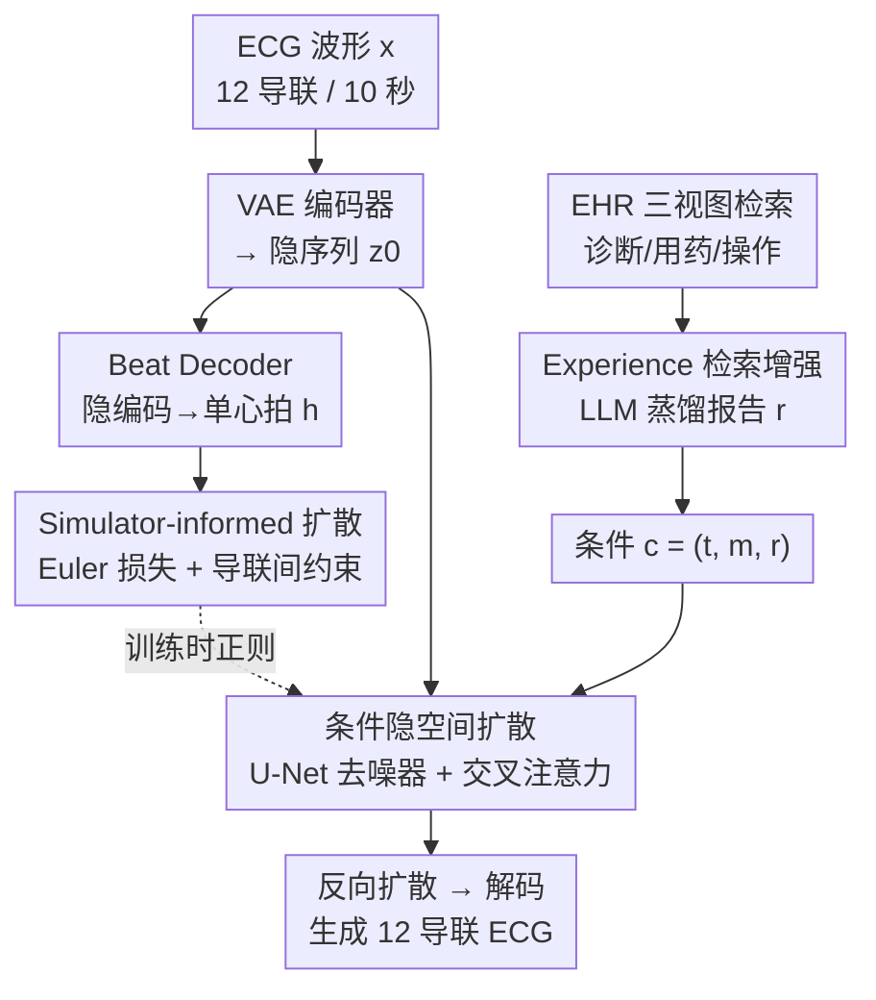

# SE-Diff: Simulator and Experience Enhanced Diffusion Model for Comprehensive ECG Generation

**会议**: ICLR 2026  
**OpenReview**: [https://openreview.net/forum?id=95ZV35sBDm](https://openreview.net/forum?id=95ZV35sBDm)  
**代码**: https://github.com/ignite-abd/SE-Diff  
**领域**: 医学图像 / 扩散模型 / 时间序列生成  
**关键词**: ECG 生成, 文本到 ECG, 扩散模型, ODE 物理仿真, 检索增强

## 一句话总结
SE-Diff 把一个轻量级 ODE 心电仿真器和一套基于 EHR 病例经验的 LLM 检索增强同时塞进条件隐空间扩散模型，让"从临床文本生成 12 导联 10 秒心电图"既符合心脏电活动的物理机理、又贴合真实临床经验，在信号保真度、文本对齐和下游分类上全面超过此前的文本到 ECG 方法。

## 研究背景与动机

**领域现状**：心血管疾病是全球首要死因，12 导联心电图（ECG）是最常用的无创检查手段，但带标注的大规模 ECG 语料因为成本、隐私和临床流程限制非常稀缺。一个自然的思路是"生成"ECG——用合成数据扩充训练集、构建无偏数据集、做隐私友好的数据共享。近年扩散模型（DDPM）在各模态上展现了强保真度，于是被迁移到时间序列、特别是文本条件的 ECG 生成上（如 DiffuSETS）。

**现有痛点**：作者指出当前文本到 ECG 生成有两个明显缺口。其一，**忽视生理仿真器知识**：现有扩散模型几乎纯靠数据学习 ECG 的形态和时序，而几十年的生理建模早就给出了紧凑的 ODE 仿真器（McSharry 三方程模型），能在可控参数下生成真实的 P–QRS–T 形态和心率变异——但这些机理先验几乎从没被当作约束注入扩散训练，导致"统计生成"和"机理可解释"之间脱节。其二，**没用上规模化的经验知识**：以往工作只在窄窄的患者元数据上做条件，没有利用分散在大规模电子病历（EHR）里的"病例经验"——也就是相似患者的诊断规律。

**核心矛盾**：ECG 不是任意时间序列，它由真实的心脏电活动驱动，既要符合单导联的 P–QRS–T 物理形态，又要满足 12 个导联之间的生理依赖关系；纯数据驱动的扩散模型既学不到这种机理约束，也调不动 EHR 里成千上万条经验。

**本文目标**：从自然语言临床描述直接生成真实的 10 秒、12 导联 ECG，并且让生成同时受"物理机理"和"临床经验"两路知识引导。

**切入角度**：物理这一路，作者把 ODE 仿真器接到扩散的去噪动力学上——但仿真器作用在单个心拍上、扩散作用在整段隐空间上，二者尺度不匹配，所以需要一个"桥"把隐编码翻译成单周期心拍；经验这一路，用检索增强（RAG）从 EHR 找相似患者、再让 LLM 把他们的诊断蒸馏成一段简洁的、生理上站得住脚的报告。

**核心 idea**：用"ODE 仿真器一致性约束 + LLM 经验检索报告"同时增强条件隐空间扩散，让 ECG 生成既机理合理又经验贴合。

## 方法详解

### 整体框架
SE-Diff 是一个在 VAE 隐空间里跑的条件扩散框架，输入是临床文本条件 $c=(t,m,r)$（原始诊断 $t$、基础元数据 $m$、检索增强报告 $r$），输出是 12 导联 10 秒波形 $x\in\mathbb{R}^{12\times L}$。整条管线分三步搭起来：先训练一个 VAE 把整段 ECG 编码成隐序列 $z_0=E_\phi(x)\in\mathbb{R}^{d\times T}$，同时额外挂一个**轻量 Beat Decoder** $D_\psi^{beat}$，把隐编码翻译成一个 QRS 对齐的单心拍 $h\in\mathbb{R}^{12\times L_c}$——这个单心拍正是后面接 ODE 仿真器约束的"接口"。然后冻结 VAE 和 Beat Decoder，在隐空间训练一个带交叉注意力的 U-Net 去噪器 $\epsilon_\vartheta(z_t,t,c)$；训练时，仿真器约束作用在 Beat Decoder 输出的单心拍上，经验检索得到的报告通过文本通路进入条件。推理时从高斯噪声出发跑反向扩散得到 $\hat z_0$，再用完整 VAE 解码回波形 $\hat x=D_\theta(\hat z_0)$。

整体上，物理这一路（Beat Decoder → 仿真器约束）只在训练时充当正则项、**不改变反向采样过程**；经验这一路（EHR 检索 → LLM 报告）则把外部知识灌进条件。两路相互独立又同时收紧生成结果。

### 关键设计

**1. Beat Decoder：把整段隐编码翻译成单心拍，给物理约束开一个接口**

仿真器约束的难点在尺度不匹配——ODE 仿真器描述的是一个心动周期的 P–QRS–T 形态，而扩散在整段 10 秒隐序列上操作，没法直接把方程约束加到 $z_0$ 上。作者的解法是在 VAE 上额外挂一个轻量 Beat Decoder $D_\psi^{beat}:\mathbb{R}^{d\times T}\to\mathbb{R}^{12\times L_c}$，专门把隐编码 $z_0$ 解成一个 QRS 对齐的单周期心拍 $h$。训练 Beat Decoder 时，先用首个 R 峰定位裁出真实单心拍 $C(x)=x[:,\,r_0-0.2f_s:r_0+0.4f_s]$ 作监督，损失为 $L_{beat}=\frac{1}{12L_c}\|C(x)-D_\psi^{beat}(E_\phi(x))\|_F^2$。

但单个心拍还得反映这 10 秒窗口里所有心拍的统计特性，作者没有简单地把 $h$ 平铺成整段，而是检测窗口内所有 R 峰、裁出 $J$ 个等长心拍，在频域上对齐：对每个心拍取去均值后的单边对数幅度谱 $\hat S_\ell[k]=\log(\varepsilon+|\mathrm{rFFT}(h_\ell-\bar h_\ell)[k]|)$，再用谱损失 $L_{spec}=\frac{1}{12JK}\sum_{\ell,j,k}w(f_k)(\hat S_\ell[k]-S_\ell^{(j)}[k])^2$ 把单心拍预测和每个观测心拍的频谱拉齐，其中权重 $w(f)$ 可以强调生理显著频带（如 0.5–3 Hz 的心率带）。VAE 总损失 $L_{VAE}=L_{full}+\beta_{KL}L_{KL}+L_{beat}+\alpha_{spec}L_{spec}$ 把整段重建、KL、单心拍重建和频域统计一起优化。这一步本身不是"生成创新"，但它是后面所有物理约束能落地的前提——没有这个可微的单心拍接口，ODE 仿真器根本插不进扩散流程。

**2. Simulator-informed 扩散：用 ODE 仿真器把机理先验灌进去噪器**

这是针对"忽视生理仿真器知识"痛点的核心设计。作者基于 McSharry 三方程 ECG 仿真器（一个在单位极限环上转、用相位编码心动周期、对 P/Q/R/S/T 五个标志点叠加高斯凸起产生电压的 ODE 模型），离线为每个类别拟合一组形态参数 $\eta_{class}=\{\theta_\beta,a_\beta,b_\beta\}$，然后在扩散训练时通过两条互补的正则项把 Beat Decoder 输出的单心拍 $h$ 约束到物理上合理。

第一条是 **Simulator-guided Euler 损失**：用 Euler 积分器把仿真器以参数 $\eta$ 和固定初值跑出参考轨迹，再惩罚单心拍每一步的离散导数和 ODE 右端项之间的偏差，$L_{Euler}=\frac{1}{12(L_c-1)}\sum_{\text{lead}}\sum_\ell\big\|\frac{h_{\ell+1}-h_\ell}{\Delta t}-f_z(x_\ell,y_\ell,h_\ell,t_\ell;\eta)\big\|^2$，相当于要求生成心拍在每个时间点都"服从"心电动力学方程。第二条是 **导联间依赖约束**：真实 12 导联不仅每个导联形态要对，导联之间还得满足额面导联的经典恒等式（Einthoven 三角和 Goldberger 中心端导出的关系），例如 $I=II-III$、$aVR=-\frac12(I+II)$ 等。作者把这些恒等式写成 $(y,p,q,\beta,\gamma)$ 元组，约束子导联的离散导数等于父导联仿真器导数的线性组合，$L_{inter\text{-}lead}=\sum_{(y,p,q,\beta,\gamma)}\sum_\ell\big(\frac{h_{\ell+1}^y-h_\ell^y}{\Delta t}-\beta f_z(\cdot;\eta_p)-\gamma f_z(\cdot;\eta_q)\big)^2$。两条约束都只在训练时作用、不进反向采样，相当于用物理知识"塑形"去噪器，使它生成的波形既单导联形态对、又导联间生理一致。

**3. Experience 检索增强条件：用 LLM 把相似病例的经验蒸馏成报告**

针对"没用上规模化经验知识"的痛点，作者把 MIMIC-IV-ECG 链接到 MIMIC-IV-Clinical，为每个住院建一个紧凑的**三视图画像**（诊断、用药、操作）。给定索引住院 $u$，用 Jaccard 相似度分别在三个视图上算相似性 $\tau_X(u,u')=J(E_u^X,E_{u'}^X)$，再加权聚合成单一相似度 $\tau(u,u')=\lambda_1\tau_{Diag}+\lambda_2\tau_{Med}+\lambda_3\tau_{Proc}$，检索 top-k 最相似的住院。把这些相似病例的诊断画像连同 $(t,m)$ 一起喂给 LLM，让它蒸馏出一段简洁、生理上站得住脚的报告 $r$。最终条件 $c=(t,m,r)$ 通过交叉注意力进入去噪器。这个设计的巧妙在于：它不是简单地把更多元数据拼进去，而是用检索把"真实临床里相似患者会是什么样"这层经验补进来，再靠 LLM 把零散的诊断码翻译成连贯的描述，相当于给生成器加了一个"会查病例库的临床顾问"。

### 损失函数 / 训练策略
分两阶段。先用 $L_{VAE}=L_{full}+\beta_{KL}L_{KL}+L_{beat}+\alpha_{spec}L_{spec}$ 训练 VAE（编码器、完整解码器、Beat Decoder 一起优化）；然后冻结 $E_\phi,D_\theta,D_\psi^{beat}$，只训练去噪器，目标是隐空间扩散损失加上两条仿真器正则：$L_{total}=L_{DDPM}+\lambda L_{Euler}+\gamma L_{inter\text{-}lead}$。所有仿真器驱动的项都是"训练专用"，推理时走标准 DDPM 反向过程并可选 classifier-free guidance。

## 实验关键数据

### 主实验
在 MIMIC-IV-ECG（80 万条 12 导联 10 秒 ECG，500 Hz）上训练，PTB-XL 上做外部验证；对比 SSSD、WGAN、BeatDiff、DiffuSETS 四个基线。评测分四个临床层级：信号级稳定性（MAE、NRMSE）、特征级生理（心率误差 MAE_HR）、诊断/语义对齐（相对 CLIP、相对 FID）、心拍级形态与间期保真。

| 数据集 | 指标 | SE-Diff | DiffuSETS (前SOTA) | 说明 |
|--------|------|---------|----------|------|
| MIMIC-IV-ECG | MAE ↓ | **0.0923** | 0.1092 | 波形重建更准 |
| MIMIC-IV-ECG | NRMSE ↓ | **0.0714** | 0.0851 | — |
| MIMIC-IV-ECG | MAE_HR ↓ | **8.43** | 13.29 | 心率估计误差大幅下降 |
| MIMIC-IV-ECG | rCLIP ↑ | **0.9470** | 0.9309 | 文本-ECG 对齐更强 |
| MIMIC-IV-ECG | rFID ↑ | **0.9509** | 0.9209 | 分布更接近真实 |
| PTB-XL (外部) | MAE ↓ | **0.1076** | 0.1281 | 跨数据集仍领先 |
| PTB-XL (外部) | MAE_HR ↓ | **8.24** | 17.88 | 外部集心率误差减半 |

心拍级形态/间期上（Table 2），SE-Diff 在 PR、QRSd、QT/QTcF、ST@J+60、P/T 波时长全部取得最低中位误差，例如 MIMIC 上 QT 误差从 DiffuSETS 的 8.20 降到 4.50、P 波时长从 5.60 降到 2.50，说明它不只匹配全局统计、还忠实保留了心拍级时序和形态。

### 消融实验
三个组件分别去掉（同一调度和随机种子下重训）：

| 配置 | MAE_HR (MIMIC) ↓ | rFID ↑ | 说明 |
|------|------|--------|------|
| Full SE-Diff | **8.43** | **0.9509** | 完整模型 |
| w/o Sim (去 Euler 一致性) | 14.28 | 0.9138 | 心率误差几乎翻倍 |
| w/o InterLead (去导联间约束) | 19.21 | 0.9128 | 心率误差恶化最多 |
| w/o Exp (去 EHR 检索) | 15.06 | 0.9032 | rFID 掉得最多 |

下游分类（Table 3，严重类别不平衡下用合成数据增强少数类）：性别分类 F1 从 Unbalanced 的 42% 提到 58%、AUC 从 46% 提到 58%，逼近 Balanced 上界（62%）；罕见病分类（窦性 vs 室上速 SVT）F1 从 56% 提到 72%，且在少数类 SVT 上增益最显著。

### 关键发现
- **导联间约束对心率最关键**：去掉 InterLead 后 MIMIC 上 MAE_HR 从 8.43 暴涨到 19.21，是单项掉点最猛的，说明强制导联间生理一致性显著稳住了节律/心率估计。
- **三个组件各管一块**：去 Sim 主要伤心率与形态，去 InterLead 主要伤心率与导联一致性，去 Exp 主要伤分布保真（rFID 掉到 0.9032），三者互补而非冗余。
- **经验增强在罕见类上更值钱**：罕见病 SVT 的相对增益大于常见情形，说明当生理异质性高、少数类标注稀缺时，检索增强的合成数据增强尤其有效。

## 亮点与洞察
- **把"老式 ODE 物理模型"重新接进现代扩散**：作者没有抛弃几十年的心电生理建模，而是用一个可微的 Beat Decoder 当桥，把 McSharry 三方程仿真器变成训练正则项——这种"经典机理 + 数据驱动"的缝合思路，可迁移到任何有已知物理/微分方程先验的信号生成（如脑电、血压波、地震波）。
- **导联间恒等式当硬约束**：直接把 Einthoven/Goldberger 这种领域公认的物理恒等式写成损失，是个很省事又很有效的归纳偏置；启发是凡有"通道间已知线性关系"的多通道生成，都可以照搬这种"子通道导数 = 父通道导数线性组合"的约束。
- **检索增强用在时间序列生成而非文本生成**：把 RAG 从"给 LLM 补知识"挪到"给信号生成器补条件"，且检索的是结构化 EHR 三视图、再用 LLM 蒸馏成自然语言报告，这条"结构化检索 → LLM 翻译 → 作条件"的链路有很强的复用价值。

## 局限与展望
- **仿真器参数离线按类拟合**：$\eta_{class}$ 是离线对代表性真实心拍拟合得到的，类别覆盖和拟合质量会直接影响物理约束的有效性；对训练时未见的罕见形态，仿真器先验可能不准。
- **依赖可链接的 EHR**：经验检索强依赖 MIMIC-IV-ECG 能链接到临床记录、且有诊断/用药/操作三视图；在没有配套 EHR 或隐私受限的场景下这一路无法启用。
- **物理约束只在训练期**：仿真器项不进反向采样，推理时如果 classifier-free guidance 或采样调度不当，生成结果仍可能偏离物理——把机理约束以某种形式引入采样可能是后续方向。
- **评测仍偏自动指标**：保真度/对齐用的是自动指标和下游分类，缺少临床医生对生成 ECG 可读性/可诊断性的盲评。

## 相关工作与启发
- **vs DiffuSETS**：DiffuSETS 是此前唯一从临床文本生成 12 导联 10 秒 ECG 的方法，但纯数据驱动、无物理先验也无经验检索；SE-Diff 在它的隐空间扩散基础上加了仿真器一致性和 EHR 检索，全指标超过它，尤其心率误差（MIMIC 13.29→8.43）。
- **vs SSSD / BeatDiff**：SSSD 用结构化状态空间做条件 ECG 扩散、BeatDiff 是面向形态的心拍扩散，二者都没显式注入 12 导联间的物理依赖；SE-Diff 的导联间约束正是补这块短板。
- **vs WGAN 类增强**：GAN 增强在类别不平衡分类上有提升但有限，SE-Diff 因为生成更贴合真实分布（rFID 更高），下游少数类增益明显更大。

## 评分
- 新颖性: ⭐⭐⭐⭐⭐ 首次把 ODE 心电仿真器接进隐空间扩散，并把 EHR 三视图检索 + LLM 蒸馏用作时间序列生成的条件，两路结合很新。
- 实验充分度: ⭐⭐⭐⭐ 内外两个数据集、四个临床层级指标、三组消融加下游分类都做了，缺临床医生盲评。
- 写作质量: ⭐⭐⭐⭐ 公式和模块边界清晰，物理约束部分推导完整，个别符号略密集。
- 价值: ⭐⭐⭐⭐⭐ 缓解 ECG 数据稀缺与隐私问题，且"经典机理 + 检索增强"的缝合范式对其他生理信号生成有很强迁移价值。

<!-- RELATED:START -->

## 相关论文

- [\[ICLR 2026\] Pixel-Level Residual Diffusion Transformer: Scalable 3D CT Volume Generation](pixel-level_residual_diffusion_transformer_scalable_3d_ct_volume_generation.md)
- [\[CVPR 2026\] Diffusion-Based Native Adversarial Synthesis for Enhanced Medical Segmentation Generalization](../../CVPR2026/medical_imaging/diffusion-based_native_adversarial_synthesis_for_enhanced_medical_segmentation_g.md)
- [\[ICLR 2026\] OmniCT: Towards a Unified Slice-Volume LVLM for Comprehensive CT Analysis](omnict_towards_a_unified_slice-volume_lvlm_for_comprehensive_ct_analysis.md)
- [\[ICLR 2026\] DM4CT: Benchmarking Diffusion Models for Computed Tomography Reconstruction](dm4ct_benchmarking_diffusion_models_for_computed_tomography_reconstruction.md)
- [\[ICLR 2026\] Cross-Timestep: 3D Diffusion Model with Trans-temporal Memory LSTM and Adaptive Priori Decoding Strategy for Medical Segmentation](cross-timestep_3d_diffusion_model_with_trans-temporal_memory_lstm_and_adaptive_p.md)

<!-- RELATED:END -->
