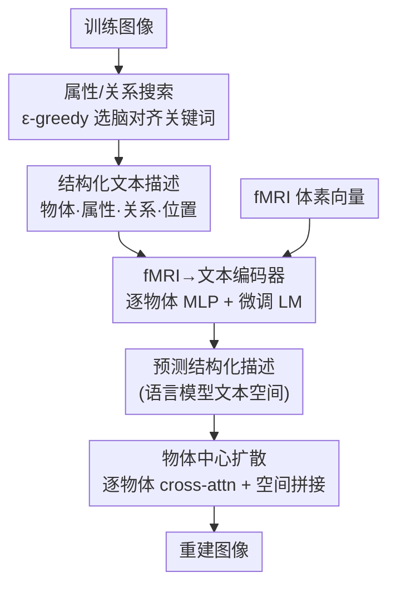

# Seeing Through the Brain: New Insights from Decoding Visual Stimuli with fMRI

**会议**: ICLR 2026  
**OpenReview**: [https://openreview.net/forum?id=88ZLp7xYxw](https://openreview.net/forum?id=88ZLp7xYxw)  
**代码**: https://github.com/GraphmindDartmouth/PRISM  
**领域**: 医学图像 / 脑信号解码 / 扩散模型  
**关键词**: fMRI 视觉解码, 文本中间空间, 物体中心生成, 提示词搜索, 扩散模型

## 一句话总结
PRISM 颠覆了「重建视觉图像就要用视觉表征」的惯例：作者先用对齐度量证明 fMRI 信号其实和语言模型的**文本空间**最像，于是把 fMRI 投到结构化文本空间作为中间桥梁，再用「自动搜索脑对齐关键词 + 物体中心扩散」把文本组合成图像，在 NSD/BOLD5000/GOD 三个数据集上把感知损失 LPIPS 最多压低约 6%。

## 研究背景与动机

**领域现状**：从 fMRI 信号重建被试看到的图像是脑科学与机器学习的交叉热点。主流做法分两步——先把 fMRI 信号映射到某个隐空间，再用预训练生成模型（多为扩散模型）从该隐空间产生图像。重建质量取决于两件事：隐空间和神经活动是否「对齐」，以及生成模型能不能从该空间产出高质量图像。

**现有痛点**：近年工作几乎都在堆生成模型（SDXL 之类）以提升画质，却**默认隐空间必须匹配刺激的模态**——既然要重建视觉图像，就该用视觉模型（ResNet、CLIP-image、LDM）的表征作为核心隐空间。少数方法掺一点语言模型的语义信息当辅助，但骨架仍是视觉表征。这条路有两个问题：一是「对齐」这件事长期被忽视，没人验证视觉空间是不是真的最贴近大脑；二是视觉表征用一个**统一的整体隐向量**同时编码物体和它们的属性，把对象和属性糅在一起，常导致物体识别错误，比如把「一只灰色、带虎纹的猫」重建成一只老虎。

**核心矛盾**：人类视觉处理本质上是**以物体为中心、组合式（compositional）**的——先识别有哪些物体、各自什么属性、彼此什么关系，而不是把整幅图当一个整体来理解（Marr 的视觉理论）。用整体隐向量的视觉空间从根上就和这种组合式认知错配。

**本文目标**：(1) 重新审视「重建视觉图像到底该用什么隐空间」；(2) 让隐空间和生成模型显式建模视觉刺激的组合性与关系性（物体、属性、关系）。

**切入角度**：作者不预设答案，而是直接量化 fMRI 信号与三类表征空间（语言模型文本空间、视觉-语言联合空间、纯视觉空间）的对齐度。一个反直觉的观察由此浮现——大脑更关心图像的**语义含义**而非像素细节，所以纯文本空间反而最贴近神经活动。

**核心 idea**：用纯文本作为 fMRI 到图像之间的中间表征空间，并把文本组织成「物体-属性-关系-位置」的结构化描述，再用物体中心的扩散生成把这些结构拼回图像。

## 方法详解

### 整体框架

PRISM 要解决的是「fMRI → 图像」的重建，但它换了一条桥：不再走视觉隐空间，而是走**结构化文本空间**。整条管线分训练与推理两侧。训练侧：对每张训练图像，先用一个 VLM 生成结构化文本描述（每个物体一条 `[物体 : 描述 : 位置]` 元组 + 背景），这些描述由「属性/关系搜索模块」自动挑选出最贴合大脑的关键词来引导；然后用这些结构化描述作监督，训练一个编码器 + 微调语言模型，把 fMRI 信号映射进语言模型的文本空间。推理侧：编码器从 fMRI 预测出结构化描述，再交给一个改造过的预训练扩散模型做**物体中心生成**——逐个物体独立去噪、按预测位置空间拼接，最后融合背景输出重建图像。

整个设计的地基是 §3.1 的核心发现：fMRI 和语言模型文本空间最对齐，因此「用文本作桥」不是工程取巧而是有实证依据的选择。

### 关键设计

**1. 文本作为中间表征空间：用对齐度量证明 fMRI 更像「文字」而非「图像」**

这是全文的根基，也直接回应了「隐空间必须匹配刺激模态」的惯例。作者把三类空间的表征拿来和 fMRI 比对齐度：文本侧用 T5、LLaMA3 的文本嵌入（喂图像的 caption），视觉侧用 LDM、ResNet50 的图像嵌入，CLIP 则两种模态都取。对齐用三个互补指标度量：Centered Kernel Alignment（CKA，越高越对齐）、Canonical Correlation Analysis（CCA，取首个典型相关系数 $\rho=\mathrm{corr}(p_1^\top X, p_2^\top K)$，越高越对齐）、以及 Generalization Gap（用 MLP 把 fMRI 映到目标空间时的训练-测试损失差，越低说明越好学）。其中 CKA 定义为归一化的 HSIC：$\mathrm{CKA}(X,K)=\frac{\mathrm{HSIC}(X,K)}{\sqrt{\mathrm{HSIC}(X,X)\cdot\mathrm{HSIC}(K,K)}}$，核函数取高斯 RBF。

结果很反直觉：T5 文本空间在三项指标上全面领先（CKA 0.558、CCA 0.834、Gap 0.113），而纯视觉的 ResNet50/LDM 垫底（CKA 仅 0.18/0.20）；更出人意料的是融合了双模态的 CLIP 反而不如纯语言模型。作者的解释是大脑更在意图像的「意思」而非像素细节，所以语义浓度高的文本空间天然更贴近神经活动。这个发现把后续所有设计的合法性都立住了——既然 fMRI 像文字，那就老老实实用文字当桥。

**2. 属性/关系搜索模块：把「该描述什么」变成可优化的提示词搜索**

光说「用结构化文本」还不够，关键是描述里到底要强调哪些**属性和关系**——颜色？动作？空间布局？很多属性其实在脑信号里并无对应，硬塞进去只会污染对齐。手工试关键词既费力又不一定对得上大脑，于是作者把「选关键词」形式化成一个带约束的提示词优化问题：给定关键词 $a$，VLM 据提示 $P(a)$ 为图像 $Y_i$ 生成结构化描述 $D_i^a=\mathrm{VLM}(Y_i,P(a))$，目标是让由此重建出的图像和原图最像，同时约束文本嵌入和 fMRI 的 CKA 超过阈值 $\beta$：

$$\max_a \sum_{i=1}^N S\big(Y_i, \mathrm{Diff}(\mathrm{VLM}(Y_i,P(a)))\big)\quad \text{s.t.}\ \ \mathrm{CKA}(X, K^a)>\beta$$

其中 $S$ 是图像相似度（如负感知损失），约束保证选出的关键词既能指导好重建、又和脑信号对齐。求解上，作者用一个 LLM 当关键词生成器做 $\varepsilon$-greedy 搜索：从前人常用的属性/关系关键词集 $A$ 出发，每步以 $1-\varepsilon$ 概率基于当前最优关键词的语义邻域生成新候选、以 $\varepsilon$ 概率随机探索，只有通过相似度阈值的候选才并入 $A$。一个有意思的实证结论是：尽管探索范围很广，最优关键词总是收敛到**空间类关系**（Spatial Layout、Relative Position），这和神经科学里「大脑对物体空间排布敏感」的发现吻合——梯度归因甚至定位到与空间记忆相关的 Presubiculum 脑区激活最强。

**3. fMRI→文本编码器：逐物体 MLP 分头编码 + 微调语言模型解码结构**

有了结构化描述当监督，就要把 fMRI 真正投进文本空间。这里复用了「以物体为中心」的思想：不是用一个大网络整体编码，而是为每个物体单独配一个 MLP，$f_j=\mathrm{MLP}_j(x_i)$，再把各物体表征拼接后送进语言模型生成估计的结构化描述 $\hat D_i^a=\mathrm{LM}(\mathrm{MLP}_g(\mathrm{Concat}(f_1,\dots,f_m)))$。语言模型用逐物体描述的自回归交叉熵微调：

$$\mathcal{L}_{\mathrm{LM}}=-\sum_{j=1}^m\sum_{t'=1}^T \log p(y_{t'}\mid y_{<t'}, f_j)$$

训练分两段：先把各 MLP 独立训练若干 epoch，再联合微调 LM 和 MLP 以最大化整体重建表现。这种逐物体分头编码让 fMRI 信号与结构化文本之间形成细粒度对齐，避免了视觉方法那种「一个整体向量糊住所有物体」的老问题。

**4. 物体中心扩散：逐物体 cross-attention + 空间拼接 + 背景融合**

最后一步是把预测出的结构化描述拼回图像，关键是别再丢物体。作者改造预训练扩散模型做组合式生成：把全局上下文提示 $\hat p_0$ 和每个物体描述 $\hat d_j$ 分别编码成条件矩阵 $C_0, C_j$，在去噪的每一步让物体 $j$ 的隐表征单独走 cross-attention：$H^j_{t-1}=\mathrm{CrossAttention}(H_t, C_j)$；再按预测位置 $\hat{loc}_j$ 把各物体隐表征做空间感知的缩放拼接 $H^{cat}_{t-1}=\Psi(\{H^j_{t-1},\hat{loc}_j\}_{j=1}^m)$。为了让物体与背景边界平滑、避免拼贴感，最终用一个混合比 $\beta$ 把物体拼接结果和全局上下文隐表征加权融合：

$$H_{t-1}=\beta\cdot H^{cat}_{t-1}+(1-\beta)\cdot H^0_{t-1}$$

如此逐步去噪，每个物体从自己的描述独立生成、再按位置组装。这正是消融里证明最关键的模块——它把「人脑分物体理解场景」的特性显式注入生成过程，从而不会像 Mindeye 系列那样漏掉关键物体。

### 损失函数 / 训练策略
核心训练目标即上文的语言模型自回归损失 $\mathcal{L}_{\mathrm{LM}}$（对所有 $m$ 个物体描述求和）。训练采用两阶段：先独立训练各物体的 MLP，再联合微调 LM + MLP。VLM 推理时引入 negative prompt 抑制畸变物体/背景杂乱（公平起见对所有 baseline 也施加同样的 negative prompt）。

## 实验关键数据

数据集：NSD、BOLD5000、GOD 三个真实 fMRI 数据集。评测五指标：PixCorr/SSIM（像素与结构相似）、LPIPS（人类感知相似，越低越好）、CLIP 与 Inception V3 双向识别（语义一致性）。为公平，所有方法统一用 Stable Diffusion 2.1 骨架（另附 SDXL 版）。

### 主实验（NSD，SD 2.1 骨架）

| 方法 | PixCorr ↑ | SSIM ↑ | LPIPS ↓ | CLIP ↑ | Inception V3 ↑ |
|------|-----------|--------|---------|--------|----------------|
| **PRISM** | **0.3404** | **0.4640** | **0.5963** | **0.9467** | **0.9516** |
| Mindeye2 | 0.3160 | 0.4447 | 0.6338 | 0.9201 | 0.9308 |
| Mindeye1 | 0.3114 | 0.3868 | 0.6501 | 0.9121 | 0.9198 |
| NeuralDiffuser | 0.3011 | 0.3348 | 0.6522 | 0.9409 | 0.9487 |
| Takagi | 0.2100 | 0.3880 | 0.7665 | 0.8811 | 0.9086 |

PRISM 在三数据集、五指标上全面领先；LPIPS 相对次优 Mindeye2 从 0.6338 降到 0.5963，约 6% 的感知损失下降即由此而来。换 SDXL 骨架后进一步拉开（PRISM+SDXL LPIPS 0.5563）。作者强调 PRISM 能稳定重建出**所有物体**，而 Mindeye 系列常漏掉关键物体。

额外的图像问答（QA）测试：用 Qwen2.5 基于重建图像回答 COCO 问题，PRISM 准确率 60.54%，显著高于 Mindeye2 的 57.65%、Mindeye1 的 55.16%，说明重建不仅像、而且语义可读。

### 消融实验（NSD）

**隐空间对比**（验证「文本空间」选择）：

| 隐空间 | PixCorr ↑ | SSIM ↑ | LPIPS ↓ |
|--------|-----------|--------|---------|
| 语言模型文本空间（本文） | **0.3404** | **0.4640** | **0.5963** |
| CLIP 文本嵌入 | 0.3208 | 0.3725 | 0.6611 |
| LDM 图像隐空间 | 0.2090 | 0.3727 | 0.7502 |

**两个模块的消融**：

| 配置 | PixCorr ↑ | SSIM ↑ | LPIPS ↓ | 说明 |
|------|-----------|--------|---------|------|
| PRISM 完整 | 0.3404 | 0.4640 | 0.5963 | — |
| w/o 物体中心扩散 | 0.3291 | 0.4299 | 0.6111 | 换回标准 U-Net cross-attn |
| w/o 搜索（用最佳初始词） | 0.3311 | 0.4421 | 0.6005 | 跳过提示词优化 |
| w/o 搜索（用最差初始词） | 0.3068 | 0.4167 | 0.6398 | 暴露初始关键词的下限 |

### 关键发现
- **文本空间是真胜利而非巧合**：语言模型文本空间不仅对齐指标领先，连重建结果也全面优于 CLIP 文本和视觉隐空间，说明「纯文字也能承载多层次视觉信息」。
- **物体中心扩散是最不可替代的模块**：去掉它造成的下降无法靠提示词优化补回，印证「分物体生成」对感知准确度的核心作用。
- **空间关系是大脑最在意的线索**：$\varepsilon$-greedy 搜索总收敛到 Spatial Layout / Relative Position，且梯度归因把它对应到主管空间记忆的 Presubiculum 脑区（平均激活 0.0080，远高于功能属性对应的 VMV1 的 0.0028），给出了可解释的神经学佐证。

## 亮点与洞察
- **用对齐度量「先量后用」**：先用 CKA/CCA/Generalization Gap 三把尺子证明 fMRI 更像文字，再据此设计方法，把一个看似激进的选择（不用视觉表征）变成有实证支撑的结论——这种「先验证再建模」的范式很值得迁移到其他跨模态对齐任务。
- **把提示词工程变成带约束优化**：用 CKA 阈值约束 + 重建相似度目标，把「描述里该强调什么」交给 $\varepsilon$-greedy 自动搜索，既避免手工调词，又保证选出的语义维度真和脑信号挂钩。
- **组合式贯穿编码与解码两端**：逐物体 MLP 编码 + 逐物体 cross-attention 生成，让「以物体为中心」从模型监督一路贯通到像素，直接根治了视觉方法「整体隐向量糊住物体」的顽疾。
- **机器学习发现反哺神经科学**：方法选出的最优关键词收敛到空间布局，并被脑区激活分析印证，是一个 ML 系统反过来给出可检验神经学假设的漂亮例子。

## 局限与展望
- 作者坦承空间脑区（Presubiculum）解释仍需神经科学界进一步验证，目前只是梯度归因层面的相关性证据。
- 整条管线依赖 VLM 生成结构化描述与 LLM 做关键词搜索，引入了多个外部大模型，成本与误差传播未充分讨论；结构化描述质量受 VLM 能力上限制约。
- 物体数较多、遮挡严重或关系复杂的场景下，逐物体独立生成再拼接可能在边界融合（由单一混合比 $\beta$ 控制）上吃力，论文主要在物体数适中的自然图像上验证。
- 「文本最对齐」的结论是在所测的特定文本/视觉模型与数据集上得到的，是否对所有刺激类型（如抽象纹理、无明确物体的图像）都成立仍待考察。

## 相关工作与启发
- **vs Mindeye1/Mindeye2（Scotti et al.）**：他们把 fMRI 映到 CLIP **图像**嵌入空间再扩散生成，PRISM 改走纯文本空间且做物体中心生成；优势是不漏物体、感知与语义指标全面更好，代价是依赖 VLM/LLM 流水线。
- **vs MindDiffuser（Lu et al.）**：两阶段先解码语义再对齐 CLIP 视觉结构特征，仍以视觉表征为骨架；PRISM 则用对齐实验直接否定了「必须用视觉表征」这一前提。
- **vs 掺语义信息的方法（Lin et al. 等）**：以往把语言信息当视觉表征的辅助，PRISM 把文本提升为唯一中间空间，是定位上的根本差异。

## 评分
- 新颖性: ⭐⭐⭐⭐⭐ 「fMRI 更像文字」的发现 + 把视觉重建改走纯结构化文本空间，挑战了领域默认假设。
- 实验充分度: ⭐⭐⭐⭐ 三数据集五指标 + QA + 隐空间/模块消融 + 脑区归因，较完整；复杂场景与成本分析略薄。
- 写作质量: ⭐⭐⭐⭐ 发现-动机-方法逻辑链清晰，公式与图示到位。
- 价值: ⭐⭐⭐⭐⭐ 既刷新 SOTA，又给出可被神经科学检验的洞察，对脑机接口/脑驱动生成有启发。

<!-- RELATED:START -->

## 相关论文

- [\[ICLR 2026\] Towards Interpretable Visual Decoding with Attention to Brain Representations](towards_interpretable_visual_decoding_with_attention_to_brain_representations.md)
- [\[CVPR 2026\] Duala: Dual-Level Alignment of Subjects and Stimuli for Cross-Subject fMRI Decoding](../../CVPR2026/medical_imaging/duala_dual-level_alignment_of_subjects_and_stimuli_for_cross-subject_fmri_decodi.md)
- [\[ICLR 2026\] Brain-IT: Image Reconstruction from fMRI via Brain-Interaction Transformer](brain-it_image_reconstruction_from_fmri_via_brain-interaction_transformer.md)
- [\[ICLR 2026\] SEED: Towards More Accurate Semantic Evaluation for Visual Brain Decoding](seed_towards_more_accurate_semantic_evaluation_for_visual_brain_decoding.md)
- [\[ICLR 2026\] A Cognitive Process-Inspired Architecture for Subject-Agnostic Brain Visual Decoding](a_cognitive_process-inspired_architecture_for_subject-agnostic_brain_visual_deco.md)

<!-- RELATED:END -->
