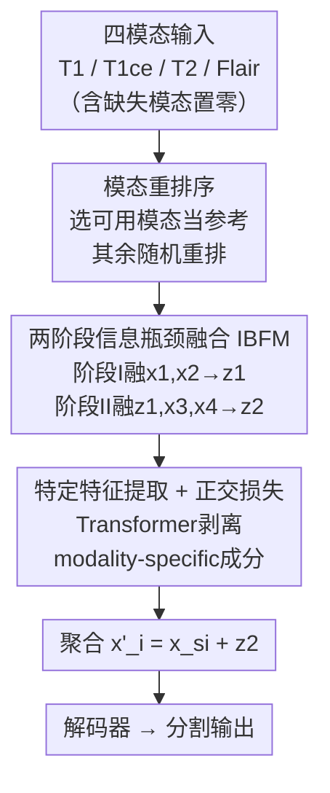

# Sequential Information Bottleneck Fusion: Towards Robust and Generalizable Multi-Modal Brain Tumor Segmentation

**会议**: ICLR 2026  
**OpenReview**: [https://openreview.net/forum?id=tmV2sOZ8TV](https://openreview.net/forum?id=tmV2sOZ8TV)  
**代码**: 无  
**领域**: 医学图像  
**关键词**: 脑肿瘤分割, 缺失模态, 信息瓶颈, 序列融合, 多模态MRI

## 一句话总结
针对多模态 MRI 脑肿瘤分割中常见的"模态缺失"问题，本文提出用**序列信息瓶颈融合**逐步把各模态信息压进一个共享潜表示，从信息论角度论证它比主流的并行融合更鲁棒、泛化上界更紧，并据此设计 SMSN 网络，在 BRATS18/20 上全面超越并行融合基线，还能不微调地从胶质瘤迁移到脑转移瘤。

## 研究背景与动机
**领域现状**：脑肿瘤分割依赖 T1、T1ce、T2、Flair 四种 MRI 模态互补的信息。但临床里经常有一种或几种模态缺失（设备/流程缺陷），所以"缺失模态分割"成了刚需。当前主流是**融合式方法**——把可用模态融成一个联合表示，再去分割，代表作有 mmFormer、M2FTrans、MMMViT、IMS2Trans。

**现有痛点**：这些方法几乎都用**并行融合**——把所有模态同时拼接（concatenation）或用注意力一次性映射到共享潜空间。问题是，当某个模态缺失时，这种"一锅烩"的融合**保不住模态间的共享信息**（modality-common information），分割性能就掉。

**核心矛盾**：并行融合往往**重度依赖主导模态**（dominant modality，即与目标 $Y$ 互信息最高的那个模态，如 Flair 对整体肿瘤、T1ce 对增强肿瘤）。一旦主导模态缺席，融合表示就失去了最有信息量的来源，预测崩盘。根因在于并行融合没有显式控制"哪些信息该留、哪些该压"。

**本文目标**：设计一种融合方式，让融合表示**不绑死在任何单一模态的可用性上**，在任意缺失组合下都尽量保住任务相关的共享信息。

**切入角度**：作者从信息瓶颈（Information Bottleneck, IB）理论出发，把"逐个模态、递归更新潜状态"的**序列融合**与并行融合做信息论对比，证明序列 IB 融合能给出更紧的泛化上界、更紧的 Lipschitz 界（对应更平滑的损失曲面、更强鲁棒性）。

**核心 idea**：用"序列信息瓶颈融合"代替"并行融合"——一步步把模态压进共享潜表示，只保留任务相关信息、压掉冗余，从而在缺失模态时依然稳。

## 方法详解

### 整体框架
SMSN（Sequential Multi-modal Segmentation Network）要解决的是：四个模态里随便缺几个，分割都不能崩。它的核心思路是把"并行一次性融合"换成"两阶段序列 IB 融合"，并配上一套处理缺失、解耦特征的模块。

整条管线是：四个模态各过一个独立编码器 → 经**模态重排序**把可用模态排到合适位置 → 送进**两阶段信息瓶颈融合模块（IBFM）**，逐步压出共享（modality-common）潜表示 $z_1, z_2$ → 用 **Transformer 做特定特征提取**并配正交损失，把各模态的 modality-specific 成分从 $z_2$ 里剥出来 → 把特定特征与共享表示聚合（$x_i' = x_{si} + z_2$）→ 送进解码器输出分割。编码器/解码器结构沿用 mmFormer 与 M2FTrans，本文的新意全在中间的融合与解耦。

### 关键设计

**1. 序列信息瓶颈融合：用递归式潜状态更新替代并行拼接**

这是全文立论的根。并行融合 $X=(X_1,\dots,X_M)\xrightarrow{f}Z$ 把所有模态一次性映射，缺主导模态就垮；序列融合 $X_1,X_2\xrightarrow{f_1}Z_1,\ X_3\xrightarrow{f_2}Z_2,\dots$ 让模态一步步进、潜状态递归更新。作者用 IB 目标 $Z^*=\arg\max_{p(z|x)}[I(Z;Y)-\beta I(X;Z)]$ 来约束每一步的融合：在固定信息约束 $I(X;Z)$ 下，最优表示 $Z^*$ 能最大化对目标的预测信息 $I(Z^*;Y)$，并且把任务无关信息压掉。

为什么这样更鲁棒、更泛化？作者给了三层论证：（i）**泛化上界更紧**——按信息论泛化界 $\epsilon_T(h)\le \epsilon_S(h)+O(\sqrt{I(Z;X)/n})$，IB 融合主动压低 $I(Z_{IB};X)$，使得 $I(Z_{IB};X)<I(Z_p;X)$，所以测试误差上界严格更小（Proposition 1/2）；（ii）**缺失模态下依然成立**——无论缺主导模态 $X_d$ 还是支撑模态 $X_s$，IB 融合只保留干净的任务相关信号，$I(Z_{IB};X)<I(Z_p;X)$ 都成立；（iii）**Lipschitz 界更紧**——在各模块 1-Lipschitz 假设下，$\prod_i L_{\phi_i}L_i\le \min_i L_i\le \sqrt{\sum_i L_i^2}$，即序列融合的 Lipschitz 常数比并行小，对应更平滑的决策边界。实测的损失曲面（loss landscape）也随缺失模态数增加保持更平、更规整，印证了这一点。

**2. 两阶段信息瓶颈融合模块（IBFM）：把四模态分两步压进共享表示**

序列融合的具体落地。面对四个模态 $x=\{x_i\}_{i=1}^4$，IBFM（受 ITHP 启发）分两阶段：阶段 I 融合 $x_1,x_2$ 得瓶颈表示 $z_1$，阶段 II 在 $z_1$ 基础上融合 $x_3,x_4$ 得 $z_2$，每个 $z$ 都是带压缩的潜表示。融合目标写成 IB 形式：

$$F = \underbrace{I([x_1,x_2];z_1)-\beta I(z_1;y_0)}_{\text{stage I}} + \underbrace{I(z_1,[x_3,x_4];z_2)-\gamma I(z_2;y_1)}_{\text{stage II}}$$

其中 $y_0,y_1$ 是各阶段的任务目标，$\beta,\gamma$ 控制压缩与相关性的权衡。互信息项不可直接优化，所以借变分近似（Alemi 等）把 $I([x_1,x_2];z_1)$、$I(z_1,[x_3,x_4];z_2)$ 用对标准正态先验 $r(\cdot)$ 的 KL 散度上界化：

$$L_e = \mathbb{E}\big[D_{KL}(p(z_1|[x_1,x_2])\,\|\,r(z_1))\big] + \mathbb{E}\big[D_{KL}(p(z_2|z_1,[x_3,x_4])\,\|\,r(z_1))\big]$$

这样递归式的压缩保证了每一步都只往潜表示里塞任务相关信息，缺模态时整体互信息 $I(Z;X)$ 受的扰动远小于并行融合。

**3. 模态重排序 + 模态感知重建：让缺失模态不污染序列起点**

序列融合有个隐患：如果序列开头就放了一个缺失模态（用零张量表示），IB 目标会被带偏，整条链就废了。为此作者提出**模态重排序策略**——从可用模态里随机挑一个当初始参考，其余 $N-1$ 个模态（不管是否可用）再随机重排后依次融合。这保证序列起点永远是有效信息。

同时为了让网络专注于"能用的"模态，引入**模态感知重建损失**：两个解码器分别从 $z_1,z_2$ 重建输入模态，但乘上二值可用性掩码 $M_i\in\{0,1\}$（$M_i=1$ 表示模态 $x_i$ 存在）：

$$L_r = \beta\,\mathbb{E}_{z_0}\Big[\sum_{i=1}^{2}M_i\log q_{\psi_0}(x_i|z_0)\Big] + \gamma\,\mathbb{E}_{z_1}\Big[\sum_{i=3}^{4}M_i\log q_{\psi_1}(x_i|z_1)\Big]$$

掩码让网络只去重建真实存在的模态，避免对着零张量"硬重建"而学坏，从而在缺失条件下更稳。

**4. 特定特征提取 + 正交损失：把共享与特有信息掰开**

理论上 IB 能从混合特征里分出共享信息，但实践中 $z_2$ 里仍会残留一些 modality-specific 信息。为了干净地解耦，作者用 Transformer 块做**特定特征提取**：把四个编码器输出的模态特征 $\{x_i\}$ 与融合表示 $z_2$ 拼起来过 Transformer，再拆回每个模态对应的特定成分 $x_{si}$。为了逼着 $x_{si}$ 只装"$z_2$ 没装下的"信息，加**正交损失** $L_o=\sum_{i=1}^M\|z_2\cdot x_{si}\|^2$，让特定成分与共享表示在高维空间正交。最后每个模态的特征由 $x_i' = x_{si}+z_2$ 聚合（共享 + 特有），再送解码器。这一步把"共享信息走 IB、特有信息走 Transformer"两条路彻底分开，减少冗余。

### 损失函数 / 训练策略
总损失把分割损失 $L_s$ 与三项辅助损失联合优化：IB 变分损失 $L_e$（KL 压缩）、正交损失 $L_o$（解耦特有/共享）、模态感知重建损失 $L_r$（缺失鲁棒）。$\beta,\gamma$ 是 IB 的关键超参，控制压缩 vs 任务相关性的权衡，敏感性分析见实验。训练在 BRATS 上从零开始、不做预训练。

## 实验关键数据

### 主实验
BRATS18 / BRATS20 上 15 种缺失模态组合的平均 Dice（WT/TC/ET 三个子区域），对比四个并行融合基线。SMSN 在绝大多数子区域与平均值上领先，缺 2-3 个模态的困难场景优势尤其明显。

| 数据集 / 子区域 | 指标 | SMSN(本文) | 次优基线 | 提升 |
|--------|------|------|----------|------|
| BRATS18 / WT | Avg. Dice | **85.62** | 85.39 (M2FTrans) | +0.23 |
| BRATS18 / TC | Avg. Dice | **75.20** | 73.25 (mmFormer) | +1.95 |
| BRATS18 / ET | Avg. Dice | **62.39** | 55.21 (MMMViT) | +7.18 |
| BRATS20 / WT | Avg. Dice | **87.14** | 85.74 (mmFormer) | +1.40 |
| BRATS20 / TC | Avg. Dice | **78.80** | 77.79 (mmFormer) | +1.01 |
| BRATS20 / ET | Avg. Dice | **63.06** | 62.17 (M2FTrans) | +0.89 |

ET（增强肿瘤，最依赖 T1ce、最难）上提升最大（BRATS18 +7.18），说明序列 IB 融合在主导模态稀缺时确实保住了关键信息。

跨域泛化：BRATS20 训练的模型**不微调**直接迁到脑转移瘤（BM）数据集。两类肿瘤形态差异巨大（胶质瘤边界模糊浸润，转移瘤边界清晰类圆形）。

| 子区域 | SMSN Avg. | 次优(M2FTrans) | 说明 |
|------|------|------|------|
| WT | **57.03** | 55.16 | 标准差也更低，输入变化下更稳 |
| TC | **45.70** | 38.62 | 大幅领先 |
| ET | **36.89** | 31.74 | 大幅领先 |

### 消融实验
逐个去掉 IBFM / 特定特征提取模块 / 正交损失 / 重建损失，验证每个组件都必要（正交损失随特定特征提取模块一并移除）。

| 配置 | BRATS18 TC | BRATS18 ET | 说明 |
|------|---------|---------|------|
| Full SMSN | **75.20** | **62.39** | 完整模型 |
| 去掉部分模块/损失 | 72.72~74.19 | 56.71~61.69 | 各项均掉点，ET 掉得最狠 |

### 关键发现
- **正交损失 + 特定特征提取最关键**：去掉后分割明显下降，印证了"IB 会残留特有信息、需显式解耦"的分析；ET 子区域对解耦最敏感。
- **超参 $\beta,\gamma$ 敏感但鲁棒**：性能确实随 $\beta$（压缩强度）、$\gamma$（损失权重）变化，但在 $[0.1,1]$ 到 $[1,0.1]$ 的宽范围内 SMSN 始终优于基线，说明 IB 框架即便不精调也能稳定获益。
- **困难场景优势放大**：缺模态越多，SMSN 相对并行基线的领先越大，与"损失曲面更平、Lipschitz 界更紧"的理论一致。

## 亮点与洞察
- **把"序列 vs 并行融合"上升到信息论层面**：不止给个网络，而是用泛化界、Lipschitz 界、损失曲面三条证据链论证序列 IB 融合更优，理论与实验互证，这种"先证明再设计"的路子很扎实。
- **模态重排序是个小而妙的工程点**：序列融合天然怕"开头就缺模态"，一个随机重排 + 选可用模态当参考就化解了，几乎零成本却直接决定序列方法能不能用。
- **掩码重建 + 正交解耦的组合可迁移**：模态感知重建（乘可用性掩码只重建存在的模态）和"共享走 IB、特有走 Transformer + 正交"这套解耦思路，可以直接搬到其他缺失模态的多模态任务（如多模态分类、检索）。
- **不微调跨肿瘤类型迁移**：从胶质瘤直接迁到形态迥异的转移瘤还能领先，说明序列 IB 压出来的共享表示确实更"任务本质"、少过拟合到训练域。

## 局限与展望
- **两阶段的分组是固定的**：方法把四模态固定切成 (x1,x2) 和 (x3,x4) 两阶段，分组方式如何影响结果、模态数更多/更少时怎么扩展，文中没充分讨论。
- **超参敏感**：$\beta,\gamma$ 对性能有明显影响，虽宽范围内仍优于基线，但实际部署仍需调，理论上的"最优压缩点"难精确定位。
- **Lipschitz 假设偏理想**：1-Lipschitz 连续对 softmax 自注意力其实难严格满足，作者靠融合后接 LayerNorm 来近似稳定梯度，理论条件是"实践可达"而非严格成立。
- **依赖既有 backbone**：编码器/解码器直接沿用 mmFormer 与 M2FTrans，创新集中在融合环节，端到端架构层面的探索有限。

## 相关工作与启发
- **vs mmFormer / M2FTrans（并行融合 SOTA）**: 它们用拼接或注意力一次性融合所有模态，本文改成两阶段序列 IB 融合，区别在于显式压掉任务无关信息、不绑死主导模态；本文在缺失模态尤其多缺场景下更鲁棒，代价是引入了 IB/重建/正交多项损失。
- **vs ITHP（IB 驱动的层级蒸馏）**: ITHP 把辅助模态信息蒸馏进紧凑表示，本文借鉴其 IB 思想但面向"缺失模态分割"，新增模态重排序与模态感知重建来专门处理缺失，并配正交损失做特有/共享解耦。
- **vs 非融合方法（M3AE / ShaSpec 的模态重建/共享-特有建模）**: 它们计算开销大、可扩展性受限，本文作为融合式方法更轻量，且实验显示性能也更优。

## 评分
- 新颖性: ⭐⭐⭐⭐⭐ 把序列 IB 融合系统性引入缺失模态分割，并给出泛化/Lipschitz 双重理论保证，立论清晰。
- 实验充分度: ⭐⭐⭐⭐ 两数据集 15 种缺失组合 + 跨域迁移 + 消融 + 超参敏感性，较完整；但仅脑肿瘤一个领域、缺更多模态数的扩展验证。
- 写作质量: ⭐⭐⭐⭐ 理论推导与方法叙述条理清楚，图表丰富；部分公式记号（如 $z_0$ 与 $z_1$）略有混淆需对原文。
- 价值: ⭐⭐⭐⭐ 缺失模态是临床真痛点，方法鲁棒且能零样本跨肿瘤迁移，实用价值高。

<!-- RELATED:START -->

## 相关论文

- [\[CVPR 2026\] Uni-Encoder Meets Multi-Encoders: Representation Before Fusion for Brain Tumor Segmentation with Missing Modalities](../../CVPR2026/medical_imaging/uni-encoder_meets_multi-encoders_representation_before_fusion_for_brain_tumor_se.md)
- [\[ICLR 2026\] Frequency-Balanced Retinal Representation Learning with Mutual Information Regularization](frequency-balanced_retinal_representation_learning_with_mutual_information_regul.md)
- [\[ICCV 2025\] M-Net: MRI Brain Tumor Sequential Segmentation Network via Mesh-Cast](../../ICCV2025/medical_imaging/m-net_mri_brain_tumor_sequential_segmentation_network_via_mesh-cast.md)
- [\[CVPR 2026\] Virtual Nodes Guided Dynamic Graph Neural Network for Brain Tumor Segmentation with Missing Modalities](../../CVPR2026/medical_imaging/virtual_nodes_guided_dynamic_graph_neural_network_for_brain_tumor_segmentation_w.md)
- [\[ICLR 2026\] Histopathology-Genomics Multi-modal Structural Representation Learning for Data-Efficient Precision Oncology](histopathology-genomics_multi-modal_structural_representation_learning_for_data-.md)

<!-- RELATED:END -->
