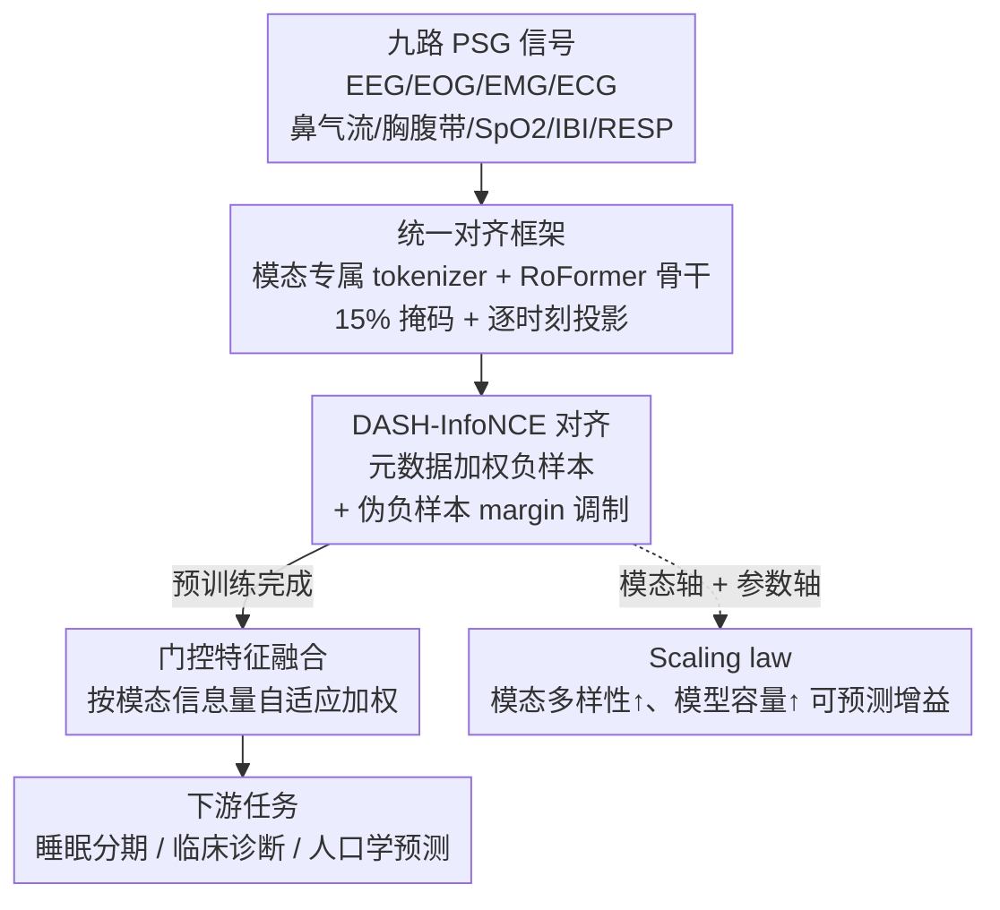

# sleep2vec: Unified Cross-Modal Alignment for Heterogeneous Nocturnal Biosignals

**会议**: ICLR 2026  
**OpenReview**: [https://openreview.net/forum?id=DDXhRN66eV](https://openreview.net/forum?id=DDXhRN66eV)  
**代码**: 待确认  
**领域**: 医学信号 / 自监督表示学习 / 多模态对齐  
**关键词**: 睡眠监测, PSG 基础模型, 跨模态对比对齐, 元数据感知, scaling law

## 一句话总结
sleep2vec 在 42,249 夜、九种睡眠生理信号上做跨模态对比预训练，用一个会按人口学/采集元数据动态加权负样本的 DASH-InfoNCE 目标把异构信号对齐进同一表示空间，从而在睡眠分期和临床诊断上既能用任意模态子集推理、又对传感器缺失鲁棒，并首次刻画了 PSG 信号随模态多样性与模型规模增长的 scaling law。

## 研究背景与动机
**领域现状**：临床睡眠评估的金标准是多导睡眠图（PSG），它同时记录脑电（EEG）、眼电（EOG）、肌电（EMG）、心电（ECG）、鼻气流、胸腹带、血氧（SpO2）等十几路同步信号。走出医院后，各种床旁监护仪和可穿戴设备只采集其中一部分通道，于是真实世界里出现了「设备各异、通道残缺、采样率不一」的碎片化格局。生理信号自监督预训练被寄望成为统一建模的范式。

**现有痛点**：已有工作要么是为单一下游任务（如睡眠分期）训练的专用模型，缺乏基础模型的通用性；要么对比预训练只覆盖一到三个通道（典型是 EEG、ECG），从未扩展到完整的 PSG 通道集；模态一多时，目标函数又往往退化成重建。重建强调还原每个模态自身的细节，并不强制异构输入映射到同一语义流形——结果是推理时默认要拿到和训练时一样的模态集合，一旦传感器缺失性能就崩。

**核心矛盾**：要做一个能在异构传感器配置间鲁棒泛化的统一表示，关键不在「还原每路信号」，而在「把不同模态对齐到共享语义空间」；但跨中心的对比学习又有个隐患——模型容易抓住队列特有的捷径（某中心的设备指纹、某年龄段的统计偏差），把这些当成区分负样本的依据，从而过拟合数据集而非学到真正的生理状态。

**本文目标**：(1) 把九种波形/区间衍生信号对齐进一个模态无关的嵌入空间，使下游能在任意模态子集上工作且抗缺失；(2) 设计一个能抑制队列捷径、提升跨中心泛化的对比目标；(3) 系统刻画 PSG 基础模型在模态多样性和参数规模两个轴上的 scaling 规律。

**切入角度**：作者假设同夜并发的多路信号是同一潜在生理状态的多个视角（这正是 Rechtschaffen-Kales、AASM 分期规范背后的物理前提）。既然它们共享潜在状态，那么把这些视角对齐就理应得到模态无关、对缺失鲁棒的表示；而既然要对齐，就能用「人口学相似度」来判断哪些负样本本该更难、哪些根本是同人同夜的伪负样本。

**核心 idea**：在九模态、四万余夜 PSG 上做逐时刻跨模态对比对齐，并把年龄、性别、采集中心、同夜身份等元数据注入 InfoNCE 的负样本加权与 margin 调制（DASH-InfoNCE），用「对齐 + 元数据感知 + 有原则的 scaling」替代「逐通道重建」。

## 方法详解

### 整体框架
sleep2vec 是一个 PSG 基础模型，要解决的是「九种异构信号、频繁缺失」如何统一建模。整体管线分两段：预训练阶段把每路 30 秒 token 经模态专属 tokenizer 编码后送入同一个模态无关骨干，在投影空间里用 DASH-InfoNCE 做逐时刻跨模态对齐；微调阶段去掉掩码与投影头，用门控融合把可用模态聚合后接任务头。

具体地，每夜录音被切成 intra-subject 段（同人不同时间片）与 inter-subject 段（不同人），各模态用自己的 MLP tokenizer 把 30 秒 token 映射成等维嵌入（高采样率 EEG/EOG/EMG/ECG 重采样到 128 Hz，低采样率鼻气流/胸腹带/SpO2/IBI/RESP 到 4 Hz，tokenizer 直接吃各自原始采样率从而在时间上对齐）。每个 mini-batch 只围绕一个模态对 $(m_a, m_b)$ 构建以稳定优化，对配对实例独立做 15% 时间步掩码、前置一个可学习 [CLS]，再过模态无关的 RoFormer 骨干。骨干每个时间步的隐状态经共享三层 MLP 投影到 128 维对齐空间，在该空间逐时刻施加对比损失；[CLS] 位置则给出全夜级别的全局表示。下游时按任务选用逐时刻隐状态（序列任务如分期）或 [CLS] 全局表示（聚合任务如性别/年龄/诊断），多模态可用时用门控融合聚合。

### 关键设计

**1. 统一多模态对齐框架：用模态专属入口 + 模态无关骨干吃下任意通道子集**

针对「通道残缺、采样率各异、专用模型不通用」的痛点，框架把「处理模态差异」和「学习语义」解耦：差异留在入口，语义交给共享骨干。每个模态有自己的极简 MLP tokenizer（两层前馈 + 残差，SiLU 激活、0.1 dropout，末尾 LayerNorm），直接在原始采样率上把 30 秒 token 编码成等维嵌入——30 秒正好对应 AASM 推荐的标准分期 epoch。由于各 tokenizer 输出维度一致，不同采样率的信号在时间上自然对齐，可以一并喂给同一个模态无关的 RoFormer 骨干。骨干本身被刻意定位成「一个通用序列编码器的具体实例」而非核心贡献，作者强调换成别的 Transformer 或状态空间模型也不影响框架——真正的配方是「灵活骨干 + 元数据感知对齐目标」。对齐发生在逐时刻而非仅全局：骨干每个时间步隐状态经共享投影头进 128 维空间，对配对的掩码段逐时刻施加对比损失，再对时间求平均（$L_{\text{DASH}}=\frac{1}{L}\sum_{t=1}^{L} L^{(t)}_{\text{DASH}}$）。这种逐时刻对齐使表示在时间分辨率上也保持一致，正适合分期这类序列任务。

**2. DASH-InfoNCE：用元数据重塑负样本集，掐掉队列捷径**

这是论文的核心贡献，直接回应「跨中心对比易抓队列捷径」的矛盾。标准时间步 InfoNCE 把同 batch 同时刻所有非配对样本一视同仁地当负样本，分母为 $\sum_{j=1}^{B}\exp(s_{i,j,t}/\tau)$。DASH-InfoNCE 在分子不变的前提下，从两方面改写分母：

$$\ell_{\text{DASH}}(i,t) = -\log \frac{\exp\!\big(s_{i,\pi(i),t}/\tau\big)}{\sum_{j=1}^{B} \omega_{i,j}\,\exp\!\big((s_{i,j,t}-\gamma\,\psi(d_{i,j},p_{i,j,t}))/\tau\big)}$$

一是**元数据驱动的样本加权** $\omega_{i,j}$：定义一个随年龄差 $|a_i-a_j|$ 衰减的对称核 $\kappa$，再乘上性别相似因子 $s^{(g)}_{i,j}\in\{\gamma_{\text{same}},\gamma_{\text{diff}}\}$ 和采集中心相似因子 $s^{(c)}_{i,j}\in\{\delta_{\text{same}},\delta_{\text{diff}}\}$（同类权重更大），得到未归一化权重 $\alpha_{i,j}=\kappa(a_i,a_j)\,s^{(g)}_{i,j}\,s^{(c)}_{i,j}+\varepsilon h_{i,j}$，再归一化成 $\omega_{i,j}$。这让概率质量集中到「年龄/性别/中心都接近、因而本该更难」的负样本上，迫使模型学真正的生理差异而非数据集指纹；常数 $\varepsilon=10^{-6}$ 保证同人同夜负样本始终有非零权重以稳住分母。二是**伪负样本 margin 调制**：同一人同一夜的不同段语义本就接近，把它们当硬负样本去推开是错的。用指示 $h_{i,j}=\mathbb{I}[u_i=u_j\wedge j\neq\pi(i)]$ 选出这些伪负样本，对其 logit 减去一个固定 margin $\gamma m$（$\psi$ 取 $d_{i,j}=1$ 时为 $m$、否则为 0），从而降低它们在 softmax 中的竞争力，又通过加权项保留其在分母中的存在。关键在于：整个目标只依赖元数据 $(a_i,g_i,c_i)$ 和身份 $u_i$，绝不使用任何下游标签，因此仍是纯自监督。

**3. 门控特征融合：按模态信息量自适应加权，抗缺失又不被噪声拖累**

微调时如何把多路模态聚合，直接影响性能。朴素 Concat 拼接会产生高维稀疏表示、放大计算与样本复杂度、加剧过拟合；Mean 平均又假设各通道同等可靠，而生理信号的信噪比和互补内容差异很大，均匀平均会冲淡模态特异线索、在传感器缺失时尤其脆弱。门控机制给每个模态学习一个标量权重，按信息量自适应地放大有用模态、压低噪声模态，得到更紧凑、更面向任务的聚合表示。这一设计与框架的「任意模态子集」目标呼应——可用模态变了，门控权重随之调整，使推理对缺失鲁棒。

**4. 模态与参数双轴 scaling law：把「加模态、加容量」变成可预测的收益**

不同于语言/视觉里成熟的 scaling 研究，PSG 上几乎没人系统刻画过。作者沿模态多样性和参数规模两个轴系统实验，发现两条都呈可预测的增益趋势，且在跨队列泛化场景下尤其明显（采集配置、人口学、协议差异越大，统一预训练的好处越突出）。临床诊断实验里，对每个模态数 $N$ 枚举所有大小为 $N$ 的模态组合做集成并取平均 ROC-AUC，结果随 $N$ 单调上升，验证了清晰的模态 scaling 效应；而 DASH-InfoNCE 相对普通 InfoNCE 的优势随模态增多而拉大，说明元数据感知对齐在大规模多模态场景下更能榨出跨模态生理关联。

### 损失函数 / 训练策略
预训练用 DASH-InfoNCE（式上），对每个 anchor 在批内、逐时刻计算后对实例和时间双重平均；温度 $\tau>0$ 控制 softmax 集中度，margin 强度 $\gamma\ge0$。掩码概率 15%，仅在掩码段之间做对齐。每 batch 只采一个模态对以稳定优化。语料由 HSP + NSRR 四队列（SHHS/MrOS/MESA/WSC）统一成 42,249 夜、30,852 人，专设 23,934 人的预训练划分，下游按 8:1:1 划分且无受试者重叠。微调时移除掩码与投影头，模态配置固定，任务头直接吃骨干特征。

## 实验关键数据

### 主实验
SHHS 五类睡眠分期（W/N1/N2/N3/REM），FM 基线由作者复现以公平对比；专用模型逐通道单独训练，而 sleep2vec 只在全模态上预训练一次：

| PSG 通道集 | 模型 | Acc.(%) | κ | MF1(%) |
|--------|------|------|------|------|
| EEG | SleepFM (FM) | 86.3 | 0.81 | 76.3 |
| EEG | sleep2vec | 87.4 | 0.82 | 77.3 |
| IBI & RESP | SleepFM | 79.7 | 0.71 | 65.7 |
| IBI & RESP | SleepFounder | 80.9 | 0.73 | 68.3 |
| IBI & RESP | sleep2vec | 83.0 | 0.75 | 65.9 |
| ECG & ABD | SleepFM | 77.9 | 0.68 | 62.7 |
| ECG & ABD | sleep2vec | 82.7 | 0.75 | 65.6 |
| FULL | SleepFM | 86.7 | 0.81 | 77.3 |
| FULL | PFTSleep | 87.7 | 0.83 | 80.8 |
| FULL | sleep2vec | 88.6 | 0.84 | 79.5 |

sleep2vec 在所有 PSG 通道子集上一致超过基线 FM：在 IBI & RESP 这种弱通道配置上领先尤为明显（83.0% vs. SleepFM 79.7%、SleepFounder 80.9%），部分配置已逼近甚至超过专用模型。专用模型在 EEG-only 上仍有微弱优势（κ 0.83 vs. 0.82），但差距很小。

跨队列评估：在 SHHS 上微调、直接测从未见过的 APPLES（预训练与微调都没碰）：

| 通道集 | 模型 | Acc.(%) | κ | MF1(%) |
|--------|------|------|------|------|
| IBI & RESP | SleepFM | 69.1 | 0.55 | 54.3 |
| IBI & RESP | sleep2vec | 73.2 | 0.61 | 57.8 |
| FULL | SleepFM | 71.4 | 0.59 | 60.0 |
| FULL | sleep2vec (InfoNCE) | 76.8 | 0.67 | 63.5 |
| FULL | sleep2vec | 78.4 | 0.69 | 65.2 |

分布漂移下 sleep2vec 鲁棒性显著，全通道下比 SleepFM 高出 7 个点（78.4% vs. 71.4%）。

### 消融实验

| 配置 | 关键现象 | 说明 |
|------|---------|------|
| sleep2vec (full DASH-InfoNCE) | FULL Acc. 88.6 / APPLES 78.4 | 完整模型 |
| sleep2vec (InfoNCE) | FULL Acc. 88.4 / APPLES 76.8 | 退回普通 InfoNCE，跨队列掉 1.6 点 |
| Leave-one-out 去 EEG / IBI | Acc. 明显下降 | 这两路模态贡献最大 |
| Leave-one-out 去 SpO2 / EOG | Acc. 影响很小 | 冗余度高 |
| Concat / Mean 融合 | 弱于 Gating | 拼接过拟合、平均冲淡线索 |

### 关键发现
- **DASH-InfoNCE 的增益在跨队列上最突出**：同分布内（SHHS FULL）相对 InfoNCE 只差 0.2 点，但到未见过的 APPLES 上拉开到 1.6 点（76.8→78.4），说明元数据加权主要在抑制队列捷径、提升泛化。
- **模态重要性高度不均**：留一法显示去掉 EEG 或 IBI 掉点最多，去掉 SpO2、EOG 几乎无影响——印证门控融合「按信息量加权」的必要性。
- **模态 scaling 单调有效**：四个临床诊断任务（高血压、过敏/鼻窦、哮喘、冠心病）的 ROC-AUC 都随模态数 $N$ 上升，且 DASH-InfoNCE 对 InfoNCE 的优势随 $N$ 增大而扩大。

## 亮点与洞察
- **把「人口学元数据」从标签变成对比学习的几何调节器**：年龄/性别/中心不再作为监督目标，而是用来重塑负样本的权重与 margin，这是个很可迁移的思路——任何有元数据、又怕队列捷径的对比预训练都能借鉴这种「按相似度加权负样本 + 同源伪负样本减 margin」的写法。
- **对齐而非重建**：作者明确论证重建只保真各模态细节、不强制共享语义流形，因而推理时绑死训练模态集；改用逐时刻跨模态对齐后，表示天然模态无关、抗缺失，这是 PSG 基础模型范式上的一次切换。
- **首次在 PSG 上画出模态/参数双轴 scaling law**：把「加传感器、加参数」从经验之谈变成可预测趋势，对临床部署很有指导意义——知道往哪个轴投入能换来多少跨中心泛化。
- **骨干可替换的诚实表态**：明说 RoFormer 不是核心贡献、换别的序列编码器也行，把功劳归给「灵活骨干 + 元数据感知对齐」这个配方，降低了读者对特定架构的迷信。

## 局限与展望
- **下游评估集中在 SHHS/WSC/APPLES 等成人队列**：年龄跨度虽大（1-109），但临床诊断只测了四种常见病、且都在 SHHS 上，是否能推广到更广的疾病谱和儿童/特殊人群仍待验证。
- **元数据可得性是前提**：DASH-InfoNCE 依赖年龄、性别、采集中心、同夜身份，当这些元数据缺失或不可靠时，加权与 margin 机制会退化回普通 InfoNCE，论文未深入讨论元数据噪声/缺失下的表现。
- **核 $\kappa$ 与各相似因子的具体形式、margin $m$ 的取值未在正文给全**：诸如年龄核的带宽、$\gamma_{\text{same}}/\gamma_{\text{diff}}$ 的设定对结果的敏感性缺乏系统消融（⚠️ 细节以原文附录为准）。
- **每 batch 只采一个模态对**：稳定了优化，但也意味着一次 forward 只对齐两个模态，模态对之间的采样策略（哪些对更该多采）是潜在的改进点。

## 相关工作与启发
- **vs SleepFM / SleepFounder（PSG 基础模型基线）**: 它们多为逐通道单独预训练或限于小模态子集，sleep2vec 只预训练一次就覆盖九模态，且在所有通道集上一致领先，弱通道配置（IBI & RESP）和跨队列（APPLES）优势最大。
- **vs 重建式多模态方法（如 SleepFounder/Narayanswamy 等）**: 它们优先还原模态细节，推理默认模态集合不变；本文用显式跨模态对齐换来模态无关、抗缺失的表示。
- **vs CLIP / ImageBind（跨模态对齐范式）**: 同样把异构输入对齐进共享空间，但 sleep2vec 面对的是「同 batch 内同人同夜的伪负样本」和「队列捷径」这两个生理信号特有问题，靠 DASH-InfoNCE 的元数据加权 + 伪负样本 margin 专门处理，而非简单照搬图文对齐。

## 评分
- 新颖性: ⭐⭐⭐⭐⭐ DASH-InfoNCE 把元数据注入负样本几何 + 首次刻画 PSG 双轴 scaling law，思路清晰且可迁移
- 实验充分度: ⭐⭐⭐⭐ 多通道集、跨队列、留一法、临床多病种 + 模态 scaling 都覆盖，但部分超参/核形式消融留在附录
- 写作质量: ⭐⭐⭐⭐⭐ 动机推导扎实、对齐 vs 重建的论证有力、对骨干贡献的表态诚实
- 价值: ⭐⭐⭐⭐⭐ 真实世界传感器碎片化与缺失场景下的通用睡眠基础模型，临床部署价值高

<!-- RELATED:START -->

## 相关论文

- [\[ICLR 2026\] BioX-Bridge: Model Bridging for Unsupervised Cross-Modal Knowledge Transfer across Biosignals](biox-bridge_model_bridging_for_unsupervised_cross-modal_knowledge_transfer_acros.md)
- [\[ICLR 2026\] Unified Brain Surface and Volume Registration](unified_brain_surface_and_volume_registration.md)
- [\[ICLR 2026\] Joint Adaptation of Uni-modal Foundation Models for Multi-modal Alzheimer's Disease Diagnosis](joint_adaptation_of_uni-modal_foundation_models_for_multi-modal_alzheimers_disea.md)
- [\[ICLR 2026\] OmniCT: Towards a Unified Slice-Volume LVLM for Comprehensive CT Analysis](omnict_towards_a_unified_slice-volume_lvlm_for_comprehensive_ct_analysis.md)
- [\[AAAI 2026\] FaNe: Towards Fine-Grained Cross-Modal Contrast with False-Negative Reduction and Text-Conditioned Sparse Attention](../../AAAI2026/medical_imaging/fane_towards_fine-grained_cross-modal_contrast_with_false-negative_reduction_and.md)

<!-- RELATED:END -->
