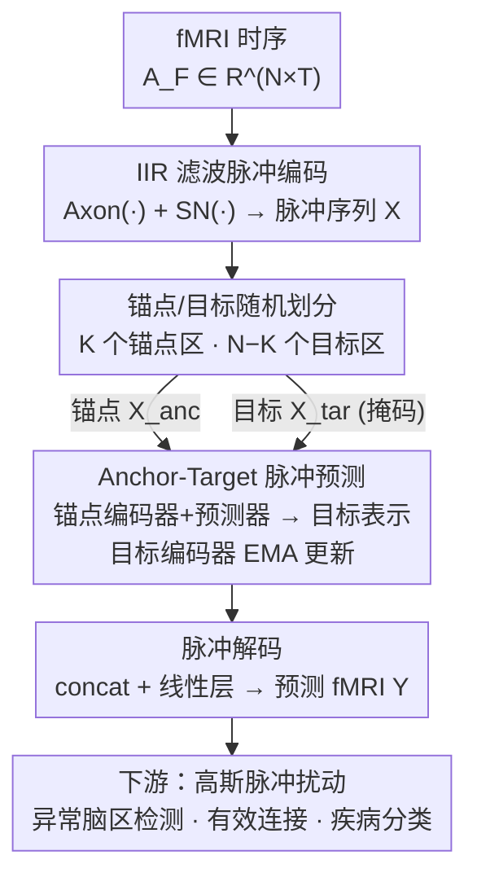

# Spike-based Digital Brain: A Novel Fundamental Model for Brain Activity Analysis

**会议**: ICLR 2026  
**OpenReview**: [https://openreview.net/forum?id=Mkjcuo6PN4](https://openreview.net/forum?id=Mkjcuo6PN4)  
**代码**: https://github.com/UAIBC-Brain/Spike-DB  
**领域**: 医学图像 / 脉冲神经网络 / fMRI 脑活动建模  
**关键词**: 数字脑, 脉冲神经网络, fMRI, 自监督预测, 有效连接

## 一句话总结
本文提出 Spike-DB，把脉冲计算范式引入 fMRI 时序建模：先用 IIR 滤波模拟的脉冲神经元把 BOLD 信号编码成脉冲序列，再以「锚点脑区→目标脑区」的自监督预测框架学习脑区间的时序驱动关系，在癫痫与阿尔茨海默（ADNI）数据集上同时实现高精度脑活动预测、疾病分类、异常脑区识别与有效连接推断。

## 研究背景与动机
**领域现状**：fMRI 是当前最常用的全脑无创成像手段，通过 BOLD 信号反映神经活动的时空动态。近年脑活动建模从早期的统计方法（ICA、动态因果模型 DCM）走向深度学习，出现了 BrainLM、BrainMass、Brain-JEPA 等大规模预训练「基础模型」，用掩码自编码或联合嵌入预测从海量神经影像里学通用表示，并据此衍生出「虚拟脑 / 数字孪生脑」这类全脑尺度的数字脑模型。

**现有痛点**：BOLD 信号信噪比低、易受生理噪声与扫描条件干扰，要从中提取稳定的神经活动特征本就很难。更关键的是，现有数字脑模型几乎都建立在**统计或连续值神经网络**之上——它们能刻画宏观的时序模式和功能连接，却**无法体现真实神经活动里的离散放电特性与生物学约束**，因此难以解释真实神经活动的机制。

**核心矛盾**：脑活动在生物学上是**离散脉冲式放电**的，而主流建模工具是连续值张量运算；这层「表示范式的错配」让模型即便预测得准，也说不清脑区之间到底是怎么相互驱动、哪里出了病理异常。

**本文目标**：构建一个更贴近生物神经系统的脑活动建模框架，既能高精度预测脑活动，又能揭示脑区间的因果/驱动关系，并支撑疾病分类、异常脑区定位、有效连接推断等临床下游任务。

**切入角度**：作者借鉴脉冲神经网络（SNN）——脉冲是事件驱动、离散、低冗余的，天然契合神经放电；同时借鉴 JEPA 式「用一部分预测另一部分」的自监督思路，把它搬到脉冲表示空间，让模型学的是脑区之间的**时序驱动关系**而非简单重建。

**核心 idea**：用脉冲序列代替连续值来表示 fMRI，并用「锚点脑区驱动目标脑区」的脉冲空间预测任务，去逼近真实脑动力学。

## 方法详解

### 整体框架
Spike-DB 是一个在**脉冲表示空间**里做自监督学习的非生成式框架。一条受试者的 fMRI 时序记为 $A_F \in \mathbb{R}^{N \times T}$（$N$ 个脑区、长度 $T$）。整体流程分五步：(1) 先用 IIR 滤波模拟的脉冲神经元把 $A_F$ 编码成脉冲序列 $X \in \mathbb{R}^{N \times T}$；(2) 从 $N$ 个脑区里**随机抽 $K$ 个作锚点（anchor）区，其余 $N{-}K$ 个作目标（target）区**，分别送进锚点编码器与目标编码器；(3) 预测器以锚点表示 + 每个目标区的可学习掩码 token（带位置嵌入）为输入，逐个预测目标区的脉冲表示；(4) 目标编码器的权重不走梯度，而是用锚点编码器的指数滑动平均（EMA）更新，以稳定训练；(5) 脉冲解码器把预测出来的嵌入还原回原始脑区 fMRI 空间。训练完成后，预测误差用于异常脑区检测、模型本身用于疾病分类、对输入施加扰动则可推断有效连接。

三个编码/预测模块都以 **Spike Transformer** 为骨干，在脉冲空间里运算，既保留动态信息又压低冗余和噪声。

### 关键设计

**1. IIR 滤波模拟的脉冲神经元：让脉冲编码也能抓住 BOLD 的高低频与长程依赖**

传统的 Leaky Integrate-and-Fire（LIF）神经元只关注膜电位动力学，忽略了突触动态和神经元内部的信号滤波机制，因此很难刻画 BOLD 信号里的高/低频分量和跨脑区的长期依赖。本文改用「无限脉冲响应（IIR）滤波器」来构造 LIF 神经元，靠它的递归结构来捕捉 fMRI 的时序动态。整个 SNN 被拆成两个操作：$\text{Axon}(\cdot)$ 负责把脉冲传给下一个神经元，由一个二阶指数 IIR 滤波器模拟——$f_i[t] = \alpha_1 f_i[t{-}1] + \alpha_2 f_i[t{-}2] + \beta x_i[t{-}1]$，其中 $\alpha_1,\alpha_2,\beta$ 都是由时间常数 $\tau_m,\tau_s$ 决定的系数；$\text{SN}(\cdot)$ 负责膜电位更新与放电，由 $v[t] = -V_{thre}r[t] + \sum_i \omega_i f_i[t]$、复位滤波 $r[t]$ 和 Heaviside 阈值发放 $O[t] = \text{Hea}(v[t]-V_{thre})$ 组成。多层堆叠后 $X_l = \text{SN}_l(\text{Axon}_l(X_{l-1}))$，把连续的 BOLD 编码成事件驱动的脉冲序列。二阶滤波的引入正是为了补上 LIF 缺的频率选择性和长程记忆，这是后续预测能稳的前提。

**2. Anchor-Target 脉冲空间预测：用「一部分脑区驱动另一部分」学时序因果**

如果只做重建，模型学到的是「把信号抄回来」，体现不出脑区之间谁驱动谁。Spike-DB 借鉴 JEPA 思路，把任务设成**用 $K$ 个锚点脑区的表示去预测 $N{-}K$ 个目标脑区的表示**。锚点脉冲 $X_{anc}$ 经锚点编码器 $f_\theta$ 得到区级表示 $r_{anc}\in\mathbb{R}^{K\times D}$（梯度更新）；目标脉冲 $X_{tar}$ 经目标编码器 $f_{\bar\theta}$ 得到 $r_{tar}^j$，注意目标是在**编码器输出端**掩码而非输入端掩码。预测器 $z_\phi$ 吃进 $r_{anc}$ 和每个目标区共享的可学习掩码 token $\{m_j\}$（叠加位置嵌入），逐区预测 $\hat r_{tar}^j = z_\phi(r_{anc}, \{m_j\})$，对 $N{-}K$ 个目标区调用 $N{-}K$ 次。训练损失是预测与真实表示在**脉冲发放率**上的均方误差：

$$L_r = \frac{1}{N-K}\sum_{j=1}^{N-K}(\hat R_{tar}^j - R_{tar}^j)^2,\quad R_{tar}^j = \frac{1}{D}\sum_{d=1}^{D} r_{tar}^j$$

其中 $R_{tar}^j,\hat R_{tar}^j$ 是表示在 $D$ 维上的平均脉冲发放率。预测目标区在隐空间而非像素/原信号空间，使模型被迫学到「锚点如何在时序上驱动目标」的关系——这正是后面能推断有效连接的根源。

**3. EMA 目标编码器 + 脉冲解码：稳住自监督训练并还原到可解释的脑区空间**

锚点-目标自监督若两端都走梯度，容易塌缩或训练不稳。Spike-DB 让**目标编码器 $\bar\theta$ 不做梯度更新，而用锚点编码器 $\theta$ 的指数滑动平均（EMA）来更新**，平滑训练过程、降低噪声，得到更稳定的目标表示。预测出的隐空间嵌入要回到临床可用的形式，于是末端加一个脉冲解码器：先按脑区索引把各目标区预测 $\hat r_{tar}^1,\dots,\hat r_{tar}^{N-K}$ 拼成整体嵌入矩阵 $\hat r_{tar}\in\mathbb{R}^{(N-K)\times D}$，再用一层全连接做回归 $Y = \text{Linear}(\hat r_{tar})$，把脉冲表示还原成预测的 fMRI 时序 $Y\in\mathbb{R}^{(N-K)\times T}$。EMA 解决「训练稳不稳」，解码解决「学到的东西能不能落回脑区空间被临床读懂」，两者一起把自监督表示接上了下游任务。

**4. 高斯脉冲扰动推断有效连接：在脉冲空间里做「虚拟刺激实验」**

预测准还不够，临床更想知道脑区之间的有效连接（EC）方向与正负。训练好后，对单个输入脑区做扰动，看预测结果的变化来量化它对全脑的有效连接：$EC_i = \delta(X + \Delta\cdot e_i) - \delta(X)$，$e_i$ 是只在第 $i$ 脑区为 1 的单位向量，$EC_i>0$ 为兴奋性连接、反之为抑制性。难点是 Spike-DB 在**脉冲空间**运算，常规扰动法不好直接用，作者设计了基于高斯脉冲的扰动：往脉冲时序里注入一个局部、平滑、幅度可控的高斯脉冲 $\Delta = k\cdot\exp\!\big(-\tfrac{(T-t_0)^2}{2\alpha^2}\big)$（取幅度 $k{=}1$、中心 $t_0{=}T/2$、宽度 $\alpha{=}20$），模拟瞬时刺激对脑活动的影响。这套「扰动-看预测响应」的范式，让一个预测模型摇身变成可做因果探针的虚拟脑。

### 一个完整示例
取 4 个脑区 A、B、C、D：随机抽 B、C 作锚点区，A、D 作目标区。fMRI 先被编码成脉冲序列，锚点编码器把 B、C 编成表示 $r_{anc}$，预测器结合 A、D 各自的掩码 token（带位置）逐个预测出 A、D 的脉冲表示，再经脉冲解码还原成 A、D 的预测 fMRI。这一组预测可直接喂给三个下游任务：把预测信号与真实信号做配对 t 检验找显著偏差的**异常脑区**；用预测模型做**疾病二分类**；对某个脑区注入高斯脉冲、观察全脑预测变化来量化**有效连接**。论文实测时把锚点数 $K$ 固定到 89（90 个脑区只留 1 个目标区，循环预测全脑），此设置下预测精度最佳。

### 损失函数 / 训练策略
预训练目标即上文脉冲发放率上的 MSE 损失 $L_r$。每个数据集独立预训练一个 Spike-DB 模型（$\delta_{FLE},\delta_{TLE},\delta_{SMC},\delta_{EMCI},\delta_{NC\text{-}E},\delta_{NC\text{-}A}$）；按**受试者**而非按数据划分 80% 预训练 / 20% 测试。锚点数 $K$ 默认 89。

## 实验关键数据

数据集：自采癫痫数据集（FLE、TLE 及对照 NC-E，$T{=}240$）与公开 ADNI（SMC、EMCI 及对照 NC-A，$T{=}197$）。fMRI 预测用 RSE（越低越好）和 $R^2$（越高越好）评估；疾病分类用 ACC、F1。

### 主实验

fMRI 时序预测（5 次独立运行均值），对比 BrainLM / BrainMass / Brain-JEPA / BrainSymphony：

| 数据 | 指标 | Brain-JEPA | BrainSymphony | Spike-DB |
|------|------|------------|---------------|----------|
| FLE | $R^2$↑ / RSE↓ | 0.952 / 0.219 | 0.963 / 0.192 | **0.972 / 0.168** |
| TLE | $R^2$↑ / RSE↓ | 0.964 / 0.217 | 0.969 / 0.202 | **0.979 / 0.184** |
| NC-E | $R^2$↑ / RSE↓ | 0.967 / 0.182 | 0.974 / 0.162 | **0.983 / 0.131** |
| EMCI | $R^2$↑ / RSE↓ | 0.938 / 0.249 | 0.947 / 0.231 | **0.954 / 0.213** |
| SMC | $R^2$↑ / RSE↓ | 0.943 / 0.240 | 0.948 / 0.228 | **0.957 / 0.207** |
| NC-A | $R^2$↑ / RSE↓ | 0.965 / 0.188 | 0.975 / 0.160 | **0.981 / 0.137** |

Spike-DB 在全部六类数据上都是 SOTA；相对最强 baseline BrainSymphony，在癫痫/ADNI 上 $R^2$ 平均再升约 1%/0.8%，RSE 显著降约 14.9%/11.4%，在更难的 EMCI、SMC 上同样领先。

疾病分类（四个二分类任务，ACC%/F1%）：

| 任务 | Starformer | BrainSymphony | Spike-DB |
|------|-----------|---------------|----------|
| FLE vs NC-E | 89.81 / 88.89 | 88.89 / 87.76 | **91.67 / 91.90** |
| TLE vs NC-E | 89.11 / 86.75 | 88.12 / 85.37 | **90.10 / 88.09** |
| EMCI vs NC-A | 86.36 / 83.20 | 85.88 / 86.21 | **87.88 / 85.19** |
| SMC vs NC-A | 85.92 / 85.71 | 84.51 / 83.58 | **86.95 / 87.32** |

四个任务全部最优，最难的 SMC vs NC-A 也达 86.95% ACC / 87.32% F1。

### 消融实验

| 配置 | 现象 | 说明 |
|------|------|------|
| Full model | 最优 | 完整 Spike-DB |
| w/o 脉冲机制 | $R^2$、RSE 都显著变差 | 去掉脉冲神经元层后 Spike Transformer 退化为普通 Transformer，证明脉冲表示对捕捉 fMRI 时序依赖至关重要 |
| 减小锚点数 $K$ | $K$ 越小性能越差，$K<45$ 急剧恶化 | $K{=}70$ 时 $R^2{=}0.949$、RSE${=}0.214$，仍胜过 BrainLM、BrainMass |

### 关键发现
- **脉冲机制是核心增益来源**：移除脉冲编码后预测精度明显下滑，说明离散脉冲表示比连续值更能抓住 BOLD 的时序依赖与动态放电模式。
- **锚点数量存在"够用"阈值**：锚点太少（$K<45$）会削弱模型捕捉脑区交互的能力；本文把 $K$ 推到 89（只留 1 个目标区循环预测全脑）反而最好，说明强约束的预测任务更利于学到脑区驱动关系。
- **异常脑区与临床高度吻合**：用 NC 组模型预测患者数据、对原始/预测做配对 t 检验，FLE/TLE/EMCI/SMC 分别检出 4/3/5/2 个显著异常脑区（如 HIP、THA、PCG、PHG、PCUN），与既有癫痫、ADNI 文献证据一致。
- **兴奋/抑制连接失衡**：扰动推断的有效连接显示患者组 EC 总数显著少于对照组，且患者抑制性连接反超兴奋性，呼应"兴奋-抑制失衡与疾病发生发展相关"的神经科学观点。

## 亮点与洞察
- **把脉冲计算搬进 fMRI 数字脑**：用 IIR 滤波模拟的脉冲神经元代替连续值表示，既贴近神经放电的离散生物特性，又靠二阶滤波补回 LIF 缺失的频率选择性，是「生物可解释」与「建模精度」少见的双赢。
- **预测模型→因果探针的复用**：训练好的预测器通过高斯脉冲扰动 $\delta(X+\Delta e_i)-\delta(X)$ 就能量化有效连接的方向与正负，相当于在模型里做"虚拟刺激实验"，把一个自监督预测器变成可做因果分析的工具，这个思路可迁移到其他时序生理信号。
- **隐空间预测+EMA 的稳态自监督**：在脉冲表示空间而非原信号空间做预测，逼模型学脑区驱动关系而非简单重建；EMA 目标编码器进一步稳住训练——这套组合可复用到任何"用一部分预测另一部分"的脑信号自监督。

## 局限与展望
- **仅在 fMRI 上验证**：方法绑定 BOLD 时序，是否能推广到 EEG/MEG 等更高时间分辨率、放电特性更直接的模态尚未验证。
- **脑区数与图谱依赖**：实验脑区数约 90、$K$ 固定到只留 1 个目标区，这种极端设置对更细粒度图谱或更大脑区数下的可扩展性、计算成本未充分讨论。
- **有效连接为相对量、缺金标准**：EC 由扰动前后预测差定义，超参（$k,t_0,\alpha$）人为设定，且缺乏侵入式电生理等金标准对照，结论更多停留在"与文献一致"层面。
- **数据规模有限**：自采癫痫 + ADNI 子集，样本量与站点多样性偏小，跨站点泛化与临床部署稳健性仍需更大规模验证。

## 相关工作与启发
- **vs Brain-JEPA / BrainLM / BrainMass**：它们同样走掩码/联合嵌入预测的自监督路线，但都在**连续值**空间建模；Spike-DB 把整个预测搬进**脉冲空间**并用 IIR-SNN 编码，既保留 JEPA 的"用一部分预测另一部分"，又补上离散放电的生物约束，预测精度与分类全面更优。
- **vs BrainSymphony / Starformer**：前者用并行时空流的轻量 Transformer、后者是专门的疾病分类模型，强在某些任务；Spike-DB 作为统一的脉冲数字脑同时覆盖预测、分类、异常定位、有效连接四类任务，且整体最优。
- **vs 传统 LIF-SNN**：标准 LIF 只建膜电位、丢了突触动态与频率滤波；本文用二阶 IIR 滤波重构 Axon/SN 两步，使脉冲编码能承载 BOLD 的高低频与长程依赖，是把 SNN 用于慢时序生理信号的一处关键改造。

## 评分
- 新颖性: ⭐⭐⭐⭐⭐ 首次把脉冲计算范式系统性引入 fMRI 数字脑建模，并用扰动把预测器复用为有效连接探针
- 实验充分度: ⭐⭐⭐⭐ 覆盖预测/分类/异常脑区/有效连接四类任务，但数据规模与跨模态泛化有限
- 写作质量: ⭐⭐⭐⭐ 框架清晰、公式完整，部分下游分析偏定性
- 价值: ⭐⭐⭐⭐⭐ 兼顾建模精度与生物可解释性，对癫痫、AD 等临床脑科学研究有直接应用潜力

<!-- RELATED:START -->

## 相关论文

- [\[ICLR 2026\] Brain-IT: Image Reconstruction from fMRI via Brain-Interaction Transformer](brain-it_image_reconstruction_from_fmri_via_brain-interaction_transformer.md)
- [\[ICLR 2026\] Unified Brain Surface and Volume Registration](unified_brain_surface_and_volume_registration.md)
- [\[ICLR 2026\] Neuro-Symbolic Decoding of Neural Activity](neuro-symbolic_decoding_of_neural_activity.md)
- [\[CVPR 2026\] Uni-Hema: Unified Model for Digital Hematopathology](../../CVPR2026/medical_imaging/uni-hema_unified_model_for_digital_hematopathology.md)
- [\[ICLR 2026\] Towards Interpretable Visual Decoding with Attention to Brain Representations](towards_interpretable_visual_decoding_with_attention_to_brain_representations.md)

<!-- RELATED:END -->
