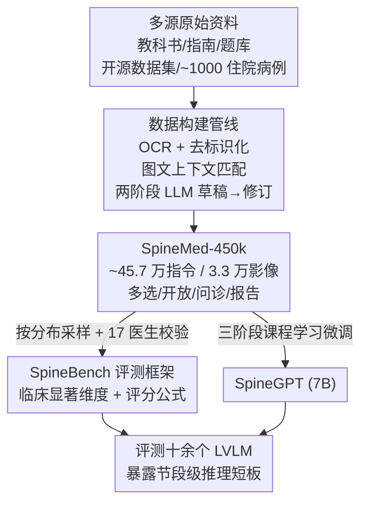

# SpineBench: 一个临床显著、椎体节段感知的脊柱诊疗评测基准与 SpineMed-450k 语料库

**会议**: ICLR 2026  
**OpenReview**: [https://openreview.net/forum?id=sHeQG5aav8](https://openreview.net/forum?id=sHeQG5aav8)  
**代码**: 无  
**领域**: 医学图像 / 多模态VLM / 评测基准  
**关键词**: 脊柱诊疗, 节段感知推理, 临床指令数据, 评测基准, 课程学习

## 一句话总结
本文以脊柱外科医生全程参与（clinician-in-the-loop）的方式构建了 45 万条规模、可溯源的多模态脊柱诊疗指令语料 **SpineMed-450k** 与配套评测基准 **SpineBench**，揭示了当前大视觉语言模型在「定位到具体椎体节段」的精细推理上系统性薄弱，并用一个仅 7B 的微调模型 **SpineGPT** 证明专科指令数据能让小模型达到接近 Gemini-2.5-Pro 的临床效果。

## 研究背景与动机

**领域现状**：脊柱疾病（退变、畸形、外伤、炎症）影响全球 6.19 亿人，是致残的主要原因之一。脊柱临床决策的特殊之处在于**单一模态无法确诊**——医生必须把 X 光、CT、MRI 的发现整合起来，定位到**具体椎体节段**（如 L4/L5），再分级严重程度、规划手术。当前虽然涌现了大量通用与医学专用的大视觉语言模型（LVLM），但它们在脊柱这种高度依赖解剖学定位的工作流上几乎没有针对性能力。

**现有痛点**：进步受阻的瓶颈不在模型容量，而在数据与评测两端。一方面缺乏**可溯源、临床扎实**的指令数据——现有医学数据多是泛化语料，缺少脊柱专科所需的高质量监督；另一方面缺乏**节段感知的标准化评测**——现有脊柱数据集（VerSe、RSNA LumbarDISC、Spark 等）几乎都是单模态、面向分割/检测/分类这类低层感知任务，输出的是体素掩码或类别标签，根本无法刻画复杂临床决策所需的整体语境。

**核心矛盾**：脊柱诊疗本质是「Collaborator AI」（医生的协作者）——需要跨模态综合、节段级推理、覆盖从诊断到治疗到预后的完整流程；而现有数据集只能训练出「Tool AI」（做单点感知的工具）。这中间存在一道认知鸿沟。此外，以往工作很少让临床医生**全程**参与构建管线，导致数据实用性受限。

**本文目标**：构建首个面向脊柱全流程临床推理的多模态指令语料，并配一套能暴露真实临床错误模式的评测基准，最后用一个落地模型证明这套数据的价值。

**核心 idea**：把脊柱外科医生嵌入数据构建的每一个环节（定义纳入标准、筛选最具决策价值的影像、指定必须暴露的失败模式），用「两阶段 LLM 生成（草稿→修订）+ 图文上下文绑定」保证数据高质量且可溯源，再从中采样出经 17 位医生人工校验的 SpineBench。

## 方法详解

### 整体框架

本文不是一个新模型方法，而是一套**数据-评测-模型三位一体的生态系统**。整体可以理解为一条从「多源原始资料」流向「可用的脊柱 AI」的管线：先把教科书、临床指南、专家共识、题库、开源脊柱数据集（Spark、VerSe）、Europe PMC 病例报告以及约 1000 例去标识化的真实住院病例汇聚起来；经过预处理（OCR 解析、去标识化、去重、图文上下文匹配）后，用两阶段 LLM 流程蒸馏出多选题、开放题、多轮问诊、诊断报告四类监督数据，最终汇成 **SpineMed-450k**（约 45.7 万条指令、3.3 万张影像）。这份语料随后分两路使用：一路按原始分布采样、再经 17 位骨科医生分组校验，构成评测基准 **SpineBench**（487 道多选 + 87 个报告生成）；另一路作为训练数据，通过三阶段课程学习微调出落地模型 **SpineGPT**。

### 关键设计

**1. 临床医生全程参与的可溯源数据构建管线：把「教科书与病例」蒸馏成高质量脊柱指令**

这一设计直击「缺乏可溯源、临床扎实的指令数据」这个痛点。管线分四到五个阶段：**数据采集**时为每一条派生项追踪来源（数据集 ID/DOI、病例标识），优先采用许可宽松的上游数据，并由医生定义纳入标准、为住院病例挑选最具决策价值的影像（如 MRI 目标序列、关键 CT 节段）；**结构化信息抽取**用 PaddleOCR 把 PDF 和图像解析成保留表格、图注、版式的 Markdown，再用一个自研的 **Picture Context Matching（图文上下文匹配）**算法，通过图注模式的正则匹配把每张图锚定到其周围段落，并用 GPT-5-mini 做语义一致性检查、过滤掉图文不符的样本；**去标识化与清洗**按 HIPAA 移除所有个人可识别信息（PII），剔除术后照片、非诊断性表格等无关图像，再用 GPT-5-mini 做细粒度分类、把骨科领域分为 7 类、脊柱子领域细分为 14 类，保证纯度；**数据生成**则因源施策——教科书等外部知识用 Gemini-2.5-pro 生成中英双语、文本与图文两种形态的多选/开放题，开源 3D 数据集（每例自适应采样 25 个切片）生成模拟医患多轮问诊，真实临床记录则用**本地部署**的 GLM-4.5V 生成（以保证数据安全）多选题、问诊对话和完整诊断报告。

整条管线的关键在于**两阶段 LLM 生成（draft → revision）**：先出草稿，再按医生制定的修订标准（带显式 prompt 与日志）做修订，临床医生还会持续 review 并细化 prompt 策略与修订准则，使输出对齐报告规范。诊断报告本身按六个维度组织——结构化影像发现、AI 辅助诊断、治疗建议（再细分为面向患者的通俗解释与面向医生的循证决策树）、风险与预后评估、术后问题管理、诊断依据与免责声明——完整模拟一次真实临床工作流。

**2. SpineBench：用临床显著的多维评分把「节段级推理对不对」量化出来**

光有数据还不够，必须有能暴露真实临床错误的评测。SpineBench 从 SpineMed-450k 中**按原始分布**采样 500 道多选题和 100 份医疗报告（覆盖 14 个脊柱子病种、多个来源），再由 **17 位持证骨科医生分成三组独立校验**——纠正错误的问答对、剔除不适合评测的题目，最终留下 487 道高质量多选题和 87 个报告生成 prompt。

评测在十个临床相关维度上展开（影像报告、诊断、患者指导、循证治疗、技术可行性、风险预后、覆盖度、相关性、粒度、可解释性），并给出一个数据驱动的加权总分。总分由文本多选、图文多选、报告生成三块按样本量加权得到：

$$Score_{total} = \sum_{k=1}^{3} w_k \cdot P_k, \qquad w_k = \frac{N_k}{\sum_{i=1}^{3} N_i}$$

其中报告分 $P_3$ 又按五大 section、每个 section 内若干维度（每维 1–5 分）归一化到 0–100：

$$P_3 = 20 \times \sum_{i=1}^{5}\left(\frac{1}{n_i}\sum_{j=1}^{n_i} s_{ij}\right)$$

$s_{ij}$ 是第 $i$ 个 section 第 $j$ 个维度的得分，$n_i$ 是该 section 的维度数。这套统一评分让从基础诊断推理到复杂报告生成的不同任务可以直接对比。为验证 LLM 自动打分的可靠性，作者还做了**人-机一致性分析**：用医生盲评对照 LLM 分数，十个维度的 Pearson 相关系数从 0.382 到 0.949，多数维度高于 0.7，说明自动评分是专家判断的可靠代理。

**3. SpineGPT：三阶段课程学习，证明专科数据让 7B 小模型追平百亿大模型**

为验证 SpineMed-450k 的有效性，作者以 Qwen2.5-VL-7B-Instruct 为底座、用 ms-swift 框架在 8 张 A100 上做**三阶段课程学习**微调。**Stage-1（通用与骨科基础）**先用公开医学文本（medical-o1-reasoning、Medical-R1-Distill、MedThoughts-8K）和 15 万条 PubMedVision 多模态指令打底，再训练 SpineMed-450k 中的非脊柱骨科子集——作者发现这些非脊柱数据反而能显著提升 SpineBench 表现，说明拓宽知识面有助于专科任务。**Stage-2（脊柱专科）**聚焦全部脊柱数据，并抽取多选与开放题构造长推理链，强化脊柱外科推理。**Stage-3（报告与对话增强）**用多轮对话、报告生成和长链推理指令进一步训练对话与生成能力；为应对最高 49k token 的长上下文，这一阶段把 DeepSpeed 从 Zero2 切到 Zero3 offloading。课程学习由易到难、由通用到专科、由短到长，逐级把模型推向脊柱诊疗的实用水平。

### 损失函数 / 训练策略

三阶段均为标准指令微调（SFT），各训练 1 epoch；Stage-1/2 学习率 $1\times10^{-5}$、最大长度 16,384、DeepSpeed Zero2，Stage-3 学习率降到 $1\times10^{-6}$、最大长度扩到 49,152、改用 Zero3 offloading。全局 batch size 按阶段调优以最大化 GPU 利用率。

## 实验关键数据

### 主实验

作者在 SpineBench 上评测了十余个当代 LVLM（含闭源与开源、通用与医学专用）。核心结论：当前模型在节段级精细诊断和开放式临床推理上普遍薄弱，而 SpineGPT（7B）在开源模型中取得突破。

| 模型 | 规模 | 闭式 QA 平均 | 报告生成 Sum | 总平均 |
|------|------|------|------|------|
| Gemini-2.5-Pro | >100B | 88.50 | 93.32 | **89.23** |
| GPT5-mini | - | 85.83 | 93.56 | 87.01 |
| GPT5 | - | 84.46 | 91.60 | 85.54 |
| GLM-4.5V（最佳开源） | 21B | 83.98 | 79.24 | 83.26 |
| Qwen2.5-VL-72B | 72B | 82.75 | 63.80 | 79.88 |
| Medgemma-27B（医学专用） | 27B | 82.34 | 70.16 | 76.66 |
| Qwen2.5VL-7B（底座） | 7B | 74.95 | 54.52 | 64.74 |
| **SpineGPT（本文）** | **7B** | **87.89** | 87.24 | **87.44** |

几个关键发现：**（1）领域预训练单独不够**——医学专用的 Medgemma-27B 总分仅 76.66，比本文低 10 分有余，尽管它大了近 4 倍。**（2）跨模态对齐普遍薄弱**——几乎所有模型在图文任务上掉点，GPT5 从文本 87.41% 跌到图像 79.97%（差 7.44 个百分点），GLM-4.5V 差 4.36 分。**（3）小模型反超**——SpineGPT 以 87.44% 总平均超过所有开源模型 4.18+ 分，闭式 QA（87.89%）超过 Claude4（79.67%）、GPT-4o（84.74%），纯文本 QA（89.46%）甚至超过 GPT5（87.41%）。它仅用 Gemini-2.5-Pro 不到 7% 的参数量，就达到了后者约 98% 的性能，且能在医院防火墙内本地部署、保护数据隐私。

### 消融实验

消融围绕「哪部分训练数据是决定性的」展开（闭式 QA，单位 %）：

| 训练数据配置 | 文本 | 图像 | 平均 | 说明 |
|------|------|------|------|------|
| Qwen2.5-VL-7B（基线） | 75.51 | 74.09 | 74.95 | 未微调 |
| 仅通用医学 | - | - | 65.31 | 比基线还**降** ~10 分 |
| + 非脊柱骨科子集 | - | - | 82.14 | 域对齐数据带来 +7 分 |
| 仅脊柱子集 | - | - | 87.07 | 达全模型约 99% |
| 通用 + 非脊柱 | 83.67 | 77.20 | 81.11 | 缺脊柱数据明显受限 |
| 全多阶段课程（完整） | 89.46 | 84.46 | **87.89** | 峰值 |

### 关键发现
- **脊柱专科数据是决定性因素**：仅用脊柱子集就能达到完整模型约 99% 的性能（87.07 vs 87.89），而只用大规模通用医学数据反而比基线掉到 65.31，说明泛化医学语料对脊柱专科任务是不够甚至有害的。
- **域对齐比规模更重要**：加入非脊柱骨科子集就能从 74.95 跳到 82.14，验证了「相近领域、高密度专科数据」的价值，呼应了 Medgemma-27B 大而不强的现象。
- **跨模态对齐是行业共性短板**：即便最强闭源模型也在图文任务上掉约 7 个百分点，提示医学影像理解与视觉-语言对齐仍是瓶颈。

## 亮点与洞察
- **「临床医生嵌入每一环」而非只在末端审核**：医生参与定义纳入标准、筛影像、指定必须暴露的失败模式，再加上两阶段「草稿→修订」与全程可溯源（DOI/病例 ID），把医学数据的「可信度」做进了管线本身，这是大多数医学数据集做不到的。
- **Picture Context Matching 把散落的图文重新绑定**：教科书 OCR 后图、图注、正文容易错位，用图注正则锚定 + LLM 语义一致性过滤把每张图锚回它的语境段落，是构建高质量图文医学语料一个可复用的小工程。
- **小模型 + 专科数据 ≈ 百亿大模型**：7B 的 SpineGPT 用不到 7% 参数达到 Gemini-2.5-Pro 约 98% 的效果，且能在院内本地部署，这对隐私敏感的医疗落地是极有说服力的卖点。
- **节段感知（level-aware）作为评测主轴**：把「定位到 L4/L5 这种具体椎体」当成一等公民来评，比泛泛的「诊断对不对」更贴合脊柱临床的真实失败模式。

## 局限与展望
- **模型规模与训练范式有限**：目前只验证了 7B 模型与纯 SFT 课程学习，作者计划训练更大模型、引入强化学习。
- **报告评测依赖 LLM 打分**：虽有人-机一致性分析支撑，但个别维度（如 imaging_report，Pearson 仅 0.382；relevance 甚至出现 nan）相关性偏低，说明自动评分在某些维度仍不稳，存疑处建议以原文为准。
- **数据严重偏向教科书**：训练集 45.6 万条里教科书占约 37.7 万，真实住院病例仅约 9700 条，长尾的真实病例分布可能未被充分覆盖；测试集也只保留多选与报告两种格式。
- **未与最新闭源模型做充分对比**：作者承认仍需与 GPT-4、Gemini 等做更全面的直接对比来确立清晰的性能标尺。

## 相关工作与启发
- **vs VerSe / RSNA LumbarDISC / Spark 等脊柱数据集**：它们是单模态、面向分割/检测/分类的低层感知任务，输出类别标签或体素掩码；本文是首个多模态（X 光+CT+MRI+文本）、面向全流程临床推理（诊断→治疗→预后）、输出指令对的脊柱语料，从「Tool AI」跨到「Collaborator AI」。
- **vs 通用/医学 LVLM（GPT5、Gemini-2.5-Pro、Medgemma 等）**：它们在通用医学上强，但在脊柱节段级推理上系统性薄弱；本文用专科指令数据微调的小模型在该任务上反超，说明专科数据的边际价值远高于堆参数。
- **vs 一般医学指令数据集（PubMedVision 等）**：它们提供泛化医学监督，本文证明这类数据单独使用对脊柱任务甚至有害，必须叠加域对齐的专科数据。

## 评分
- 新颖性: ⭐⭐⭐⭐ 首个节段感知、全流程的多模态脊柱诊疗语料与基准，数据工程扎实但方法层面创新偏工程化。
- 实验充分度: ⭐⭐⭐⭐ 评测了十余个 LVLM + 课程学习消融 + 人机一致性，但缺与最新闭源模型的全面对比。
- 写作质量: ⭐⭐⭐⭐ 动机清晰、图表完整，部分评测维度相关性偏低未充分讨论。
- 价值: ⭐⭐⭐⭐⭐ 解决脊柱 AI 的数据与评测空白，7B 本地可部署模型对医疗落地极具实用价值。

<!-- RELATED:START -->

## 相关论文

- [\[ICLR 2026\] You Point, I Learn: Online Adaptation of Interactive Segmentation Models for Handling Distribution Shifts in Medical Imaging](you_point_i_learn_online_adaptation_of_interactive_segmentation_models_for_handl.md)
- [\[ICLR 2026\] Boosting Medical Visual Understanding From Multi-Granular Language Learning](boosting_medical_visual_understanding_from_multi-granular_language_learning.md)
- [\[ICLR 2026\] Rethinking Radiology Report Generation: From Narrative Flow to Topic-Guided Findings](rethinking_radiology_report_generation_from_narrative_flow_to_topic-guided_findi.md)
- [\[ICLR 2026\] MedGMAE: Gaussian Masked Autoencoders for Medical Volumetric Representation Learning](medgmae_gaussian_masked_autoencoders_for_medical_volumetric_representation_learn.md)
- [\[ICLR 2026\] Towards Text–Mask Consistency in Medical Image Segmentation](towards_text-mask_consistency_in_medical_image_segmentation.md)

<!-- RELATED:END -->
