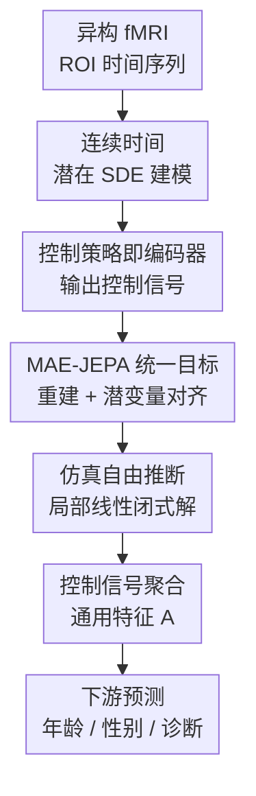

# Stochastic Optimal Control for Continuous-Time fMRI Representation Learning

**会议**: ICLR2026  
**OpenReview**: [https://openreview.net/forum?id=N51nP3TBwR](https://openreview.net/forum?id=N51nP3TBwR)  
**代码**: 补充材料提供，公开仓库待确认  
**领域**: 医学图像 / fMRI 表征学习  
**关键词**: fMRI表征学习, 连续时间建模, 随机最优控制, 自监督学习, 脑动力学  

## 一句话总结
BDO 把异构 fMRI 时间序列看成连续时间潜在随机动力系统，用随机最优控制把 MAE 重建和 JEPA 潜变量预测统一起来，从而在多数据集下学习对 TR 差异更稳健、计算更高效的脑动力学表征。

## 研究背景与动机
**领域现状**：fMRI 记录的是 BOLD 信号随时间变化的脑活动，常被用于年龄、性别、认知特质和精神疾病诊断等下游任务。由于标注数据昂贵且跨队列差异大，近年的趋势是先用大规模无标注 fMRI 做自监督预训练，再把学到的表征迁移到具体临床或神经科学任务上。已有方法大致分两类：一类像 BrainLM、Brain-JEPA 那样把 ROI 时间序列切成固定时空 patch；另一类像 BrainMass 那样把整段时间序列压成静态功能连接图。

**现有痛点**：这两类路线都在预处理阶段牺牲了 fMRI 最重要的时间结构。Patch 化方法需要固定长度、固定采样间隔，遇到不同数据集的 TR 不一致时只能下采样、上采样或调整 patch 大小；图方法虽然规避了序列长度问题，却把一整段信号平均成功能连接，丢掉了短时动态。对多中心 fMRI 来说，这个问题很现实：UK Biobank 的 TR 约为 0.735 秒，而 ABIDE 中不同站点的 TR 可在 1.5 到 3.0 秒之间变化。把这些数据硬塞进同一个离散时间网格，会让模型在物理时间尺度上看到含义不一致的 token。

**核心矛盾**：fMRI 的真实信号是连续演化、带噪声、且采样不规则的脑动力学；但主流自监督模型为了工程方便，往往把它离散化为规则 patch 或静态图。这样一来，模型越依赖固定网格，越难同时保留细粒度时间变化和跨数据集可迁移性。

**本文目标**：作者希望构建一个能直接处理连续时间 fMRI 的自监督框架：既能把不同 TR、不同长度的扫描放到同一真实时间轴上，又能从高维、强噪声的 ROI 序列中提取紧凑表征，并且计算成本不能像传统 SDE/ODE 求解器那样高到无法在 4 万级样本上预训练。

**切入角度**：论文的关键观察是，连续时间潜在动力学可以自然表示不规则采样的 fMRI，而随机最优控制（SOC）提供了一种把“根据观测修正潜在轨迹”写成优化问题的方式。换句话说，模型不再把 encoder 仅仅看成一个黑盒特征抽取器，而是把它解释为控制策略：它输出的控制信号负责把先验随机动力学推向能解释观测 fMRI 的后验动力学。

**核心 idea**：用“最优控制信号”作为 fMRI 的通用表征，在连续时间潜在 SDE 中学习它，并用 MAE 的遮蔽重建和 JEPA 的稳定潜变量目标共同约束这个控制信号，使其既能解释被遮蔽的脑信号，又不被原始 BOLD 噪声牵着走。

## 方法详解

### 整体框架
BDO 的输入是一段 ROI 级 fMRI 时间序列 $Y=\{y_{t_1},\cdots,y_{t_k}\}$ 以及真实时间戳 $T=\{t_1,\cdots,t_k\}$，输出不是某个单点 latent，而是一串由控制策略产生的控制信号 $\{\alpha_t\}$。这些控制信号驱动连续时间潜在状态 $X_t$，再通过均值池化得到通用特征 $A$，用于年龄回归、性别分类和精神疾病诊断等下游任务。

训练时，模型先随机遮蔽 75% 左右的时间点，把未遮蔽部分作为 context，把被遮蔽部分作为 target。在线 encoder 根据 context 产生控制信号并推动潜在 SDE 预测 target 时刻的状态；decoder 用潜变量重建原始 fMRI；同时，一个 EMA 更新的 target encoder 对真实 target 片段产生稳定的潜在目标，迫使在线控制信号向这个目标靠拢。为了避免每次都用数值 SDE solver，作者进一步把受控 SDE 近似成分段局部线性系统，直接用闭式均值和协方差计算潜在状态，并用 parallel scan 把长序列计算并行化。

### 关键设计
**1. 连续时间潜在 SDE 建模：把不同 TR 的 fMRI 放回同一真实时间轴**

BDO 首先避免在观测空间直接建模高维 BOLD 信号，而是假设脑活动背后存在低维潜在状态 $X_t \in \mathbb{R}^d$，并让它按 Itô diffusion 连续演化。先验过程可写成 $dX_t=f(t,X_t)dt+\sigma(t)dW_t$；在简化设定下，作者甚至把复杂先验弱化为纯随机过程 $dX_t=\sigma(t)dW_t$，承认 fMRI 的真实动力学很难先验指定。真正承载数据解释能力的是后验过程中的控制项：$dX_t^\star=[f(t,X_t^\star)+\sigma(t)\alpha^\star(t,X_t^\star;Y)]dt+\sigma(t)dW_t$。

这个设定的好处是，时间戳不再只是序列位置编号，而是真实物理时间。TR 为 0.735 秒和 TR 为 2 秒的数据可以在同一个连续时间框架下表达，只是在观测时间点上不同。相比把 ABIDE 这类短序列重复到固定长度，或把 HCP-A 下采样到某个 patch 网格，连续时间建模更符合 fMRI 的采样机制，也保留了跨数据集迁移时最容易被破坏的时间尺度信息。

**2. 控制策略即编码器：用“如何修正随机先验”定义脑动力学表征**

论文把表征学习重写成随机最优控制问题。参数化控制策略 $\alpha_\theta(t,X_t^\theta;Y)$ 由 Transformer encoder 实现，它读入 fMRI 序列后输出控制信号，用来把原本随机的潜在轨迹推向能解释观测数据的轨迹。优化目标包含两部分：一部分是控制能量 $\int_0^T \frac{1}{2}\|\alpha_\theta(t,X_t^\theta;Y)\|^2dt$，约束模型不要无限制地偏离先验；另一部分是观测似然 $-\sum_{t\in T}\log g_\psi(y_t|X_t^\theta)$，要求被控制的潜在状态能解释实际 fMRI。

这个目标等价于变分推断中的 ELBO 下界。直观地说，控制能量对应“为了贴合观测需要付出多少修正”，观测似然对应“修正后的轨迹能不能解释数据”。作者把最优控制策略本身视为 latent encoder，并把一段时间内的控制信号聚合成通用特征 $A=f(\{\alpha_t^\star\}_{t\in T})$。这比直接取最后一个隐藏状态更有解释意味：特征 $A$ 记录的是模型为了让潜在脑动力学对齐观测 fMRI 所需的系统性调整。

**3. MAE-JEPA 统一自监督目标：既重建被遮蔽信号，又避免被 BOLD 噪声过拟合**

如果只做 MAE，模型会用 context 重建被遮蔽的原始 BOLD 信号 $Y_{tar}$。这能迫使 encoder 学到时间依赖，但 fMRI 噪声强，直接最小化原始信号重建误差容易让模型追逐无意义波动。BDO 因此在 SOC 目标里加入 JEPA 式潜变量预测：在线 encoder 只看 context，预测 target 时刻的控制潜变量；EMA target encoder 看真实 target，产生一个更稳定、缓慢变化的目标控制信号 $\bar{\alpha}_t$。

论文把这一点写成分层似然和几何混合分布：辅助潜变量 $\tilde{\alpha}_t$ 同时受 context posterior $p_\theta(\tilde{\alpha}_t|X_t,Y_{ctx})$ 和 target empirical prior $q_{\bar{\theta}}(\tilde{\alpha}_t|X_t,Y_{tar})$ 约束。最终训练目标包含重建项 $\|y_t-D_\psi(\tilde{\alpha}_t)\|^2$ 和潜变量对齐项 $\tau\|\tilde{\alpha}_t-\bar{\alpha}_t\|^2$。前者保证模型没有丢掉可观测 fMRI 结构，后者提供稳定的自蒸馏目标，降低对原始噪声的过拟合风险。

**4. 仿真自由推断：用局部线性闭式解替代昂贵 SDE solver**

连续时间模型常见的瓶颈是数值积分：每个样本、每段时间都要跑 ODE/SDE solver，在 450 ROI、4 万余 UKB 样本、数百 epoch 的预训练里会非常昂贵。BDO 的工程核心是把受控 SDE 在每个时间区间近似为局部线性系统：$dX_t^\theta=[-D_{t_i}X_t^\theta+\alpha_{t_i}^\theta(Y)]dt+dW_t$。在这个形式下，给定控制信号和漂移矩阵，任意观测时刻的边缘分布仍是高斯，均值 $\mu_t$ 和协方差 $\Sigma_t$ 可以直接闭式计算。

作者还让 $D_{t_i}=V\Lambda_{t_i}V^\top$，其中共享正交基 $V$ 和时间相关特征值 $\Lambda_{t_i}$ 使模型既保留可学习的动力学结构，又便于并行计算。由于均值和协方差递推可以写成关联运算，parallel scan 把序列维度的计算从 $O(k)$ 串行步骤压到 $O(\log k)$ 并行时间。这样，SOC 不是停留在漂亮理论上，而是变成一个能在大规模 fMRI SSL 中实际训练的模型。

### 一个完整示例
假设有一名受试者的 resting-state fMRI 被预处理成 $160\times450$ 的 ROI 时间序列，其中 160 个时间点来自真实扫描时间轴，而不是抽象的 token 序号。训练时，BDO 随机遮蔽其中 75% 的时间点，只把约 40 个 context 时间点及其真实时间戳交给在线 encoder。encoder 输出这些 context 上的控制信号，并通过局部线性 SDE 的闭式推断，估计被遮蔽时间点的潜在状态分布。

接下来，decoder 尝试从预测到的潜变量重建被遮蔽 ROI 信号；与此同时，EMA target encoder 读取真实 target 片段，给出 target 时刻的稳定控制目标。在线分支如果只学到噪声，会在潜变量对齐上受罚；如果只学到平滑平均，也会在重建被遮蔽信号时失败。训练结束后，对一段完整扫描，模型不需要再模拟整条随机轨迹，只需通过 encoder 得到每个时间点的控制信号，再取均值 $A=\frac{1}{|T|}\sum_{t\in T}\alpha_t$，就能得到下游任务使用的 compact feature。

这个例子也说明 BDO 为什么适合异构数据。若另一个数据集只有 80 个时间点、TR 更长，模型看到的是不同时间戳上的观测，而不是必须补齐成 160 个 token 的伪序列。连续时间 SDE 和仿真自由推断负责把这些观测放到同一物理时间逻辑中，控制信号则提取“为了解释这段脑活动需要怎样调整潜在动力学”的表征。

### 损失函数 / 训练策略
BDO 的训练目标可概括为三项的组合：控制能量正则、MAE 式重建、JEPA 式潜变量对齐。论文中的重标定目标为

$$
\hat{L}_{\theta,\psi}=\mathbb{E}_{X^\theta}\left[\int_0^T \sigma_q^2\|\alpha_t^\theta\|^2dt-\sum_{t\in T_{tar}}\mathbb{E}_{\tilde{\alpha}_t^\theta}\left(\|y_t-D_\psi(\tilde{\alpha}_t^\theta)\|^2+\tau\|\tilde{\alpha}_t^\theta-\alpha_t^{\bar{\theta}}\|^2\right)\right].
$$

其中 $\tau=\frac{(1-\lambda)\sigma_\zeta^2}{\sigma_q^2}$ 控制 JEPA 正则强度。预训练使用 UKB 的 41,072 名受试者 resting-state fMRI，其中 80% 用于自监督预训练，20% 留作内部评估；每个样本预训练时随机抽取 160 个时间步，并使用 $\gamma=0.75$ 的 temporal masking。优化器使用 Adam，batch size 为 128，训练 200 epoch，学习率采用 10 epoch warm-up 后 cosine decay，从 0.0001 升到 0.001 再降回 0.0001。EMA target encoder 的动量从 0.996 线性增加到 1.0。

模型结构上，encoder 是 12 层 Transformer，先把 450 ROI 的输入投影到潜在维度 $d$，再通过 attention 和 FFN 处理时间序列。论文给出 5M、21M、86M 三种 BDO 规模，对应潜在维度分别为 192、384、768，并统一使用 100 个局部线性基矩阵。下游评估分为 linear probing 和 full fine-tuning：前者冻结预训练 encoder，只训练单层 head；后者连 encoder 一起微调。分类任务使用 BCE，回归任务使用 MSE。

## 实验关键数据

### 主实验
论文在内部 UKB held-out、外部 HCP-A、ABIDE、ADHD200、HCP-EP 上评估。BDO 的核心优势不是只在一个任务上赢，而是在 age regression、gender classification 和多种精神疾病诊断上都能稳定迁移，尤其在外部数据集上体现出连续时间建模对 TR/长度差异的鲁棒性。

| 数据集 / 任务 | 协议 | 本文 BDO | 最强对比基线 | 主要结论 |
|--------|------|------|----------|------|
| UKB held-out 年龄 | FT | MSE 0.481 / $\rho$ 0.722 | BrainNetTF: MSE 0.561 / $\rho$ 0.673 | 内部年龄预测明显优于任务专用模型和 SSL 模型 |
| UKB held-out 性别 | FT | ACC 92.59 / F1 92.57 | BrainNetTF: ACC 91.19 / F1 91.17 | 在内部分类上也达到最高结果 |
| HCP-A 年龄 | FT | MSE 0.273 / $\rho$ 0.851 | BrainLM: MSE 0.340 / $\rho$ 0.818 | 跨数据集年龄迁移最强 |
| HCP-A 性别 | FT | ACC 79.40 / F1 78.98 | BrainLM: ACC 72.78 / F1 72.36 | 外部性别分类提升明显 |
| ABIDE 诊断 | FT | ACC 69.32 / F1 68.32 | BrainMass: ACC 67.27 / F1 66.66 | 自闭症分类上超过 fMRI SSL 基线 |
| ADHD200 诊断 | FT | ACC 64.16 / F1 64.27 | BrainMass: ACC 63.91 / F1 62.55 | ADHD 分类小幅但稳定领先 |
| HCP-EP 诊断 | FT | ACC 82.86 / F1 82.87 | BrainMass: ACC 76.19 / F1 76.25 | 早期精神病分类提升最大 |

### 消融实验
| 配置 | 关键指标 | 说明 |
|------|---------|------|
| BDO 标准时间尺度 | HCP-A 年龄 $\rho$ 0.768 / 性别 ACC 72.00 | 使用真实 TR 和标准连续时间推断 |
| Compressed TR | HCP-A 年龄 $\rho$ 0.678 / 性别 ACC 67.59 | 人为压缩 TR 后性能下降，说明真实时间尺度重要 |
| Dilated TR | HCP-A 年龄 $\rho$ 0.660 / 性别 ACC 67.82 | 人为拉长 TR 同样损害表征 |
| No masking ($\gamma=0$) | 年龄 $\rho$ 0.445 | 没有 MAE 任务时自监督表征明显失败 |
| 最优 masking ($\gamma=0.75$) | 年龄 $\rho$ 0.738 | 适度高遮蔽率能迫使模型学习时间结构 |
| JEPA-only | 年龄 $\rho$ 0.521 | 只做潜变量预测不足以支撑强表征 |
| MAE-only ($\tau=0$) | 年龄 $\rho$ 0.717 | 重建任务是主干，但仍不如统一目标 |
| MAE+JEPA ($\tau=0.03$) | 年龄 $\rho$ 0.738 | JEPA 正则对 MAE 表征有增益 |
| Mean pooling | 年龄 $\rho$ 0.768 / 性别 ACC 72.00 | 默认用控制信号均值聚合为 $A$ |
| PMA pooling | 年龄 $\rho$ 0.772 / 性别 ACC 73.84 | 更复杂的注意力聚合略有提升，提示时间聚合仍有空间 |

### 关键发现
- BDO 的外部泛化优势主要出现在跨数据集场景。HCP-A、ABIDE、ADHD200、HCP-EP 的 TR、长度和人群都不同，连续时间建模避免了固定 patch 模型必须重复、裁剪或重采样的结构性问题。
- MAE 是核心训练信号。$\gamma=0$ 时年龄预测 $\rho$ 只有 0.445，而 $\gamma=0.75$ 达到 0.738，说明遮蔽重建确实迫使模型学习可迁移的时间依赖。
- JEPA 不是单独可用的主任务，但作为正则很有效。JEPA-only 表现较弱，MAE-only 已经不错，而 $\tau=0.03$ 的统一目标进一步提升，符合“用潜变量目标抑制原始 BOLD 噪声过拟合”的设计动机。
- 计算效率非常突出。86M BDO 在 4 张 RTX 3090 上约 15 GPU hours 完成预训练，而 BrainLM 约 496 GPU hours、BrainMass 约 244 GPU hours；同时 BDO 的 HCP-A 年龄 $\rho$ 和性别 ACC 都更高。
- 可扩展性符合预期。5M、21M、86M 模型在 HCP-A 年龄和疾病诊断上整体随规模提升；UKB 预训练数据从 25% 增到 100% 时，多数外部任务也随数据量改善。

## 亮点与洞察
- 把 encoder 解释成控制策略很有启发性。很多医学时间序列表征学习只说“学一个 latent”，但 BDO 的 $\alpha_t$ 有更清晰的语义：它表示为了让潜在脑动力学解释观测 fMRI，模型在每个时间点需要施加怎样的数据驱动修正。
- 连续时间建模抓住了 fMRI SSL 的一个真实痛点。TR 异构不是小的预处理细节，而是决定一个 token 代表多少物理时间的根本问题；论文用 TR distortion 实验说明，只要时间尺度被人为压缩或拉长，表征性能就会显著下降。
- MAE 与 JEPA 的组合比单独照搬视觉 SSL 更适合 fMRI。fMRI 的原始信号噪声很强，直接重建可能学到低层波动；但完全只做 latent prediction 又缺少足够观测约束。BDO 把两者放到同一个 SOC 目标里，是这篇论文最稳的设计点。
- 仿真自由推断是理论落地的关键。没有局部线性闭式解和 parallel scan，SOC/SDE 框架很可能只适合小规模实验；有了这套近似后，它才变成能和 BrainLM、BrainMass 这种大模型比较训练效率的实用方法。
- 医学图像任务里的“时间轴”值得被更认真对待。这篇论文的思路可以迁移到 EEG、ECG、ICU 生理信号、纵向影像随访等不规则采样场景：先在连续时间潜在空间建模，再把控制/校正信号作为表征。

## 局限与展望
- 局部线性近似可能带来 variational gap。作者承认，仿真自由推断依赖分段局部线性假设，在长时间跨度或高度非线性的脑动态分析里可能累积误差。
- 模型复杂度高于常规 SSL。BDO 同时包含 SOC、SDE、MAE、JEPA、EMA target encoder 和局部线性推断，对普通医学影像团队来说复现和调参门槛较高。
- 神经生物学解释仍不充分。论文用 IG、PCA/UMAP 和 latent displacement 做了初步分析，但控制信号 $\alpha_t$ 与具体神经机制、脑区交互或疾病过程之间还没有建立严谨对应。
- 下游任务仍以预测性能为主。年龄、性别、诊断分类能证明表征有效，但若要用于临床，需要更细粒度的校准、偏倚分析、队列外验证和专家可解释性评估。
- 表征聚合方式还有空间。默认均值池化简单高效，但 PMA 消融显示注意力聚合能进一步提升，说明控制信号的时间结构没有被完全利用。

## 相关工作与启发
- **vs BrainLM / Brain-JEPA**: 这些方法把 fMRI 序列变成固定长度 patch，并用 MAE 或 JEPA 做自监督。BDO 的区别在于不把时间离散化成固定 token 网格，而是直接在连续时间潜在 SDE 上学习，因此更适合不同 TR 和不同序列长度的队列。
- **vs BrainMass**: BrainMass 通过静态功能连接图学习脑网络表征，能绕开序列长度问题，但会压掉短时动态。BDO 保留时间演化，并把动态变化压缩为控制信号特征，适合需要时间信息的任务。
- **vs Latent ODE / GRU-ODE-Bayes**: 这些连续时间模型也能处理不规则采样，但通常依赖数值 solver，难以扩展到大规模 SSL。BDO 的仿真自由推断让连续时间建模具备实际预训练效率。
- **vs BrainHarmonix-F**: BrainHarmonix-F 也关注异构 fMRI 的预训练，并通过大规模 UKB+ABCD 数据和增强获得强表现。BDO 的优势在于用连续随机动力学显式建模时间尺度，在 HCP-A、ABIDE 和 HCP-EP 等任务上整体达到相当或更好的 linear probing 表现。
- **对后续工作的启发**: 医学时间序列表征学习可以少一些“把数据规整成模型喜欢的格式”，多一些“让模型尊重数据真实采样机制”。对多中心临床数据来说，TR、采样频率、缺失和序列长度不是噪声，而是模型应显式处理的观测结构。

## 评分
- 新颖性: ⭐⭐⭐⭐⭐ 用随机最优控制重新解释 fMRI SSL，并把控制策略本身作为表征，想法很鲜明。
- 实验充分度: ⭐⭐⭐⭐⭐ 覆盖内部、外部、诊断、任务态迁移、效率、消融和可解释性分析，证据链比较完整。
- 写作质量: ⭐⭐⭐⭐☆ 理论推导扎实、实验表格清楚，但 SOC/SDE 部分对非该领域读者仍然偏重。
- 价值: ⭐⭐⭐⭐⭐ 对异构 fMRI foundation model 很有参考价值，也为不规则医学时间序列表征学习提供了可迁移框架。

<!-- RELATED:START -->

## 相关论文

- [\[ICLR 2026\] CRONOS: Continuous time reconstruction for 4D medical longitudinal series](cronos_continuous_time_reconstruction_for_4d_medical_longitudinal_series.md)
- [\[ICLR 2026\] ODEBRAIN: Continuous-Time EEG Graph for Modeling Dynamic Brain Networks](odebrain_continuous-time_eeg_graph_for_modeling_dynamic_brain_networks.md)
- [\[ICLR 2026\] Anatomy-aware Representation Learning for Medical Ultrasound](anatomy-aware_representation_learning_for_medical_ultrasound.md)
- [\[ICLR 2026\] MnemoDyn: Learning Resting State Dynamics from 40K fMRI Sequences](mnemodyn_learning_resting_state_dynamics_from_40k_fmri_sequences.md)
- [\[ICLR 2026\] CortiLife: A Unified Framework for Cortical Representation Learning across the Lifespan](cortilife_a_unified_framework_for_cortical_representation_learning_across_the_li.md)

<!-- RELATED:END -->
