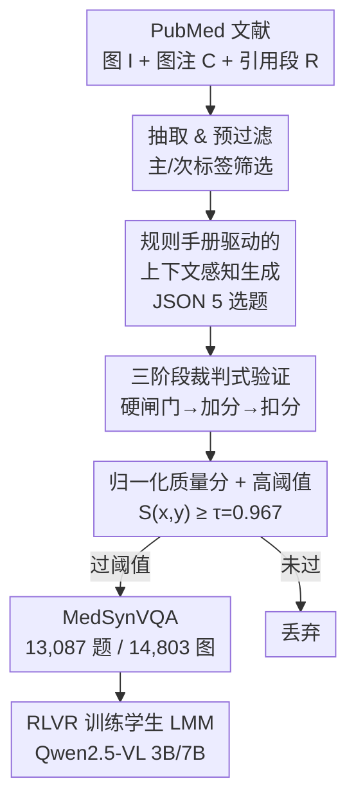

# MedVLSynther：用「生成器–验证器」LMM 从医学文献合成高质量视觉问答

**会议**: ICLR 2026  
**OpenReview**: [https://openreview.net/forum?id=ULMWcNduE3](https://openreview.net/forum?id=ULMWcNduE3)  
**代码**: https://github.com/UCSC-VLAA/MedVLSynther  
**领域**: 医学图像 / 多模态VLM / 数据合成  
**关键词**: 医学VQA, 数据合成, 生成器-验证器, 评分手册(rubric), RLVR

## 一句话总结
本文提出 MedVLSynther——一个「规则手册(rubric)驱动 + 上下文感知」的生成器–验证器框架，直接从开放的 PubMed 医学文献（图、图注、正文引用段）合成多选题式医学 VQA，经多阶段自动验证后产出 13,087 道高质量题目（MedSynVQA），用它配合可验证奖励的强化学习训练开源 LMM，在 6 个医学 VQA benchmark 上平均准确率达到 55.85（3B）/58.15（7B），超过多个强医学 LMM 基线。

## 研究背景与动机
**领域现状**：大型多模态模型（LMM）正成为生物医学问答助手，需要联合解读医学影像（X 光、CT、显微图等）和周边文字（图注、叙述）。但评测端虽有丰富的 benchmark（OmniMedVQA、MMMU-Med 等），它们只为评测设计、不提供训练划分。

**现有痛点**：训练侧的数据集分三类，各有硬伤。① 专家人工标注集（VQA-RAD、SLAKE）质量高但规模小、模态窄；② 自动生成集（PMC-VQA 等）易扩规模，但大多由**纯文本 LLM** 产出，忽略图像证据与图文关系，导致题干含糊、选项有歧义、答案在医学上站不住脚，反而拖累模型学习；③ 闭源大规模资源（如 GMAI-VL-5.5M）因病人隐私、授权、机构协议无法公开共享。

**核心矛盾**：社区能全面**评测**医学 VQA 系统，却无法**广泛且透明地训练**它们——缺的是大规模、可公开、高质量且可审计的训练语料。纯文本生成省事但丢掉了视觉 grounding；私有临床数据质量高但不可复现。

**本文目标**：能否直接从开放生物医学文献，合成高质量、可审计的医学 VQA 训练数据？拆成两个子问题：(1) 怎样生成既扎根图像证据、又不靠图注泄漏答案的考试级题目；(2) 怎样自动把低质量题目过滤掉，使整条管线规则透明、端到端可复现。

**切入角度**：作者押注在「让生成和验证都显式由 rubric 驱动、且对图文上下文感知」。开放权重 LMM（GLM-4.5V-108B 等）在多模态任务上已逼近闭源系统，足以承担强感知与推理，同时保持全程开放可审计。

**核心 idea**：用一对「规则手册驱动的生成器 + 多阶段验证器」LMM，把开放文献里的图–注–引用转写成考试级多选 VQA，再用一个归一化质量分卡高阈值筛选，最后用可验证奖励的 RL（RLVR）训练学生模型。

## 方法详解

### 整体框架
整条管线（MedVLSynther）把「一篇 PubMed 文献」变成「若干道经过审计的多选医学 VQA」，再拿这批数据去训练学生 LMM。流程是：先从 Biomedica（PMC-OA 的图与图级元数据抽取）取出 `x=(I, C, R)`——图像 `I`（一条图注可能对应至多 6 张图）、图注 `C`、正文中对该图的引用段 `R`，按主标签（临床影像、显微）和 25 个二级子类预过滤，得到 23,788 个三元组。然后生成器 LMM `G_θ` 在 rubric 约束下产出严格 JSON 格式的 5 选项题目 `y={q, options{A..E}, answer}`；验证器 LMM `V_φ` 看到同样的图文上下文 + 候选题目，分三阶段打分（硬性闸门 → 加分项 → 扣分项）；把正负分聚合成一个归一化质量分 `S(x,y)`，卡阈值 `τ=0.967` 接受，最终留下 13,087 道题，命名为 MedSynVQA。最后用 MedSynVQA 通过 RLVR 训练 Qwen2.5-VL 3B/7B 学生。

### 关键设计

**1. 规则手册驱动的上下文感知生成：让题目扎根图像而非凭空捏造**

这一步针对的是痛点②——纯文本 LLM 生成的题目忽略视觉证据。作者让生成器 `G_θ` **同时**接收图像 `I`、图注 `C` 和正文引用段 `R`（context-aware），并扮演「医学教育出题专家」的角色，在一份自检 rubric 约束下产出严格 JSON 的 5 选项题目。rubric 分三档要求：**Essential（输出前必须通过）**——题干自包含（不能出现「caption/context」这类元指代）、必须依赖检视具体视觉特征才能作答、隐式利用图注事实但不泄漏答案、恰好一个最佳答案、模态/解剖/术语医学正确；**Important（强烈建议）**——认知层级高于「应用」、干扰项强且平行、聚焦单一概念；**Optional**——在证据明确时给出定位或定量细节。同时限定一小套题型原型（异常识别、模态识别、解剖/定位、生物/技术属性、疾病诊断、下一步、病变分级），降低 prompt 熵、引导临床有意义的问题。严格 JSON schema 让输出可被机器验证，为后续自动过滤铺路。

**2. 三阶段裁判式验证：把质量控制做成可审计的硬规则**

光靠生成器还不够可靠，规模化必须有自动验证。验证器 `V_φ` 同样看到 `x` 和候选 `y`，被要求扮演 **Referee（裁判）+ Critic（批评者）** 两个角色，只返回带二值分的结构化 rubric。三阶段是：**Stage-1 本质筛查（硬闸门）**——Referee 评 7 条不可妥协项（题干自包含、词汇约束不引入无据临床事实、不逐字复述源文造成诊断泄漏、单一正确选项、选项语义类型一致、临床有效性、图文一致），每条评 `{0,5}`，**任一不过即丢弃**；这一阶段顺带剔除无法评分的样本（如 JSON 畸形），23,635 → 22,903。**Stage-2 细粒度加分（bonus）**——Critic 默认「这题不够优秀」，仅在无可辩驳证据下给 4–8 条加分项打分（Important 权重 3/4，Optional 1/2），如强干扰项、平行选项、题干简洁、聚焦清晰、答案字段有效、JSON 合规；只要能想象出「稍好一点的措辞或干扰项」就拒绝该项，刻意压低 recall 抬高 precision。**Stage-3 惩罚项（找茬）**——主动搜索常见陷阱并扣分：禁用词（−2，题干含「caption/context」）、同义漂移（−1，引入无据具体事实）、多答案（−2）、医学不准确（−2），每条须给出具体理由才触发。作者还发现**验证器最好和生成器用不同模型**，能提升鲁棒性。

**3. 归一化质量分与高阈值接受：用一个可解释分数卡住精度**

如何把上面的正负分汇成一个可阈值化的决策？作者定义归一化质量分：设正向准则集 `P`（Important∪Optional，权重 $w_i>0$，得分 $s_i\in\{0,w_i\}$），陷阱集 `N`（权重 $w_j<0$，得分 $p_j\in\{0,w_j\}$），

$$S(x,y)=\mathrm{clip}_{[0,1]}\!\left(\frac{\sum_{i\in P}s_i+\sum_{j\in N}p_j}{\sum_{i\in P}w_i}\right).$$

通过 Stage-1 的候选，当 $S(x,y)\ge\tau$（$\tau=0.967$）才被接受。这个相当高的阈值强调精度、同时仍保留可用产出率，最终筛出 13,087 道题。分母用正向权重之和归一，使分数落在 $[0,1]$ 区间、可跨样本统一卡线；扣分项直接进分子使「踩坑」立刻拉低分数，体现了「宁缺毋滥」的数据策略——消融显示数据量过 5K 后收益递减，说明高阈值过滤本身就是质量保证的核心，而非单纯堆量。

### 损失函数 / 训练策略
拿到 MedSynVQA 后，作者用两种方式训练学生 LMM（默认 Qwen2.5-VL 3B/7B）：**SFT**——仿照 MedVLThinker，用 GLM-4.5V-108B 蒸出 thinking trace，在「（思维链, 答案）」对上做监督微调，强调临床扎根的推理路径并保持严格答案格式；**RLVR（可验证奖励的 RL）**——用 GRPO **只对答案**优化（不优化思维链），奖励鼓励精确匹配准确率与 schema 合规，避免过拟合到单一影像模态。实验表明 RL 一致优于 SFT，且 MedSynVQA 作为奖励信号最强。默认实验用 5K 样本以控算力。

## 实验关键数据

### 主实验
在 6 个医学 VQA benchmark（MMMU-Med、MedX-M、PathVQA、PMC、SLAKE、VQA-RAD）上报告多选准确率，与通用及医学 LMM 对比：

| 模型 | PathVQA | SLAKE | VQA-RAD | 平均 |
|------|---------|-------|---------|------|
| Qwen2.5-VL-7B-Instruct（base） | 65.39 | 65.71 | 68.75 | 53.50 |
| HuatuoGPT-Vision-7B | 63.53 | 75.00 | 63.60 | 54.69 |
| MedVLThinker-7B（前 SOTA） | 66.83 | 65.79 | 64.71 | 54.88 |
| **MedVLSynther-3B** | 62.82 | 74.76 | 73.53 | **55.85** |
| **MedVLSynther-7B** | 65.56 | 72.36 | **77.57** | **58.15** |

3B 学生即超过 MedVLThinker-7B（+0.97），7B 学生比前 SOTA 提升 +3.27；VQA-RAD 最高到 77.57。

### 消融实验

| 配置（3B / 7B 平均） | 3B | 7B | 说明 |
|------|------|------|------|
| 零样本 base | 49.14 | 53.50 | Qwen2.5-VL Instruct |
| PMC 风格纯文本生成 | 54.25 | 54.41 | 只用文本 LLM 出题 |
| PMC 风格图文生成 | 54.80 | 55.15 | 加入图像 |
| Rubric 上下文感知生成 | 54.72 | 57.33 | 本文生成器 |
| + Rubric 上下文感知验证 | **55.85** | **57.56** | 完整管线 |

数据规模消融（3B）：1K→52.64，5K→55.85，10K→55.03，全量→55.17——过 5K 收益递减。训练源对比（Table 5）：在 RL 下 MedSynVQA 一致优于 PMC（图文）和 m23k（纯文本）。

### 关键发现
- **生成和验证缺一不可**：单看平均，rubric 上下文感知生成与 PMC 图文生成相近（54.72 vs 54.80，3B），但**加上验证后**才拿到最佳平均（55.85），且在临床扎根数据集（SLAKE、VQA-RAD）上涨幅最大——验证补足了精度上限。
- **验证器容量越强、下游越好**：用 GLM-108B 同时做生成器和验证器，7B 学生平均进一步到 58.08；正文为最大化开放可复现，主结果仍用 Qwen2.5-VL-72B 验证器。
- **RL > SFT**：纯文本 m23k 做 SFT 时甚至严重掉点（3B 仅 32.80），而 RLVR 在所有数据源上都更稳，MedSynVQA 信号最强。
- **无评测集泄漏**：针对合成医学 VQA 定制的污染分析未检出与评测集的重叠。

## 亮点与洞察
- **把「出题 + 阅卷」拆成生成器–验证器双 LMM**：生成器负责扎根图文出题，验证器扮演 Referee+Critic 用硬闸门/加分/扣分三阶段把关——这套「自动出题再自动质检」的结构天然可审计，prompt、rubric、元数据全可复现，是它相对私有数据集的最大优势。
- **「宁缺毋滥」的归一化质量分 + 高阈值（0.967）**很巧妙：把主观质量判断变成一个可解释、可卡线的标量，扣分项直接拉低分子，使踩坑样本被一票否决；配合「过 5K 收益递减」的观察，说明质量过滤比堆量更关键。
- **验证器与生成器异构能提升鲁棒性**：用不同模型当裁判，避免生成器「既当运动员又当裁判」的盲区——这个 trick 可迁移到任何 LLM 自生成数据的质检环节。
- **全程只用开放文献 + 开放权重模型**：规避病人隐私与授权问题，给「可复现、保护隐私」的医学训练数据提供了一条现实路径。

## 局限与展望
- 作者承认：合成数据**不能取代**精心标注的临床数据集，只是一条可行且有用的补充路径。
- 数据规模消融显示过 5K 后收益递减甚至略降（3B 10K=55.03<5K=55.85），暗示当前过滤方法仍有改进空间——可能需要更细的多样性/难度控制而非单纯加量。
- 题目均为**多选题（MC-VQA）**，未覆盖开放式生成、定位框等更丰富的临床问答形式；模态虽达 13 类但来源受 Biomedica 预过滤标签约束。
- 验证器质量直接决定数据质量，而验证器本身也是 LMM，其偏好/盲区可能被系统性带入数据集；污染分析只在特定协议下「未检出」，不等于绝对无泄漏。

## 相关工作与启发
- **vs PMC-VQA（纯文本/自动生成）**: 它用纯文本 LLM 大规模产出 22 万+ 对，但忽略视觉证据、题干含糊；本文条件于图–注–引用并加多阶段验证，RL 训练下 MedSynVQA 一致优于 PMC，区别在「上下文感知 + 显式质检」。
- **vs MedVLThinker（纯文本医学语料训练）**: 它是仅用文本数据训练的强基线；本文提供缺失的高质量**多模态**监督信号，3B 学生即超过其 7B 版本。
- **vs 闭源大规模集（如 GMAI-VL-5.5M）**: 后者规模大但不可公开共享；本文以「开放文献 + 开放权重」换取可审计与可复现，牺牲一部分规模但赢得透明度。

## 评分
- 新颖性: ⭐⭐⭐⭐ 生成器–验证器 + rubric + 归一化质量分的组合务实有效，单点创新不极端但工程闭环完整。
- 实验充分度: ⭐⭐⭐⭐⭐ 6 个 benchmark、多组消融（管线/规模/生成器验证器选择/训练源）+ 污染分析，覆盖充分。
- 写作质量: ⭐⭐⭐⭐ 结构清晰、图文配合好；部分表述/拼写略有瑕疵。
- 价值: ⭐⭐⭐⭐⭐ 给隐私敏感的医学 VQA 提供了可复现、可审计、可扩展的开放训练数据路径，数据与代码均开源。

<!-- RELATED:START -->

## 相关论文

- [\[ICLR 2026\] CARE: Towards Clinical Accountability in Multi-Modal Medical Reasoning with an Evidence-Grounded Agentic Framework](care_towards_clinical_accountability_in_multi-modal_medical_reasoning_with_an_ev.md)
- [\[ICLR 2026\] You Point, I Learn: Online Adaptation of Interactive Segmentation Models for Handling Distribution Shifts in Medical Imaging](you_point_i_learn_online_adaptation_of_interactive_segmentation_models_for_handl.md)
- [\[ICLR 2026\] CONSIGN: Conformal Segmentation Informed by Spatial Groupings via Decomposition](consign_conformal_segmentation_informed_by_spatial_groupings_via_decomposition.md)
- [\[ICLR 2026\] M3CoTBench: Benchmark Chain-of-Thought of MLLMs in Medical Image Understanding](m3cotbench_benchmark_chain-of-thought_of_mllms_in_medical_image_understanding.md)
- [\[ICLR 2026\] PathChat-SegR1: Reasoning Segmentation in Pathology via SO-GRPO](pathchat-segr1_reasoning_segmentation_in_pathology_via_so-grpo.md)

<!-- RELATED:END -->
