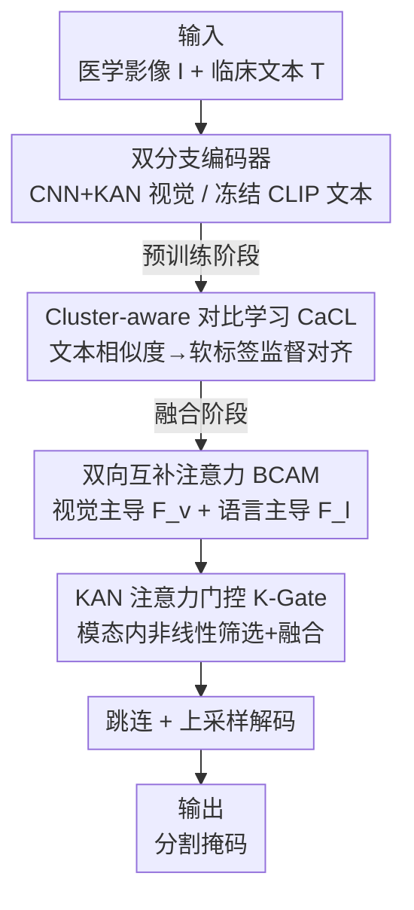

# Towards Text–Mask Consistency in Medical Image Segmentation

**会议**: ICLR 2026  
**OpenReview**: [https://openreview.net/forum?id=riOevy2RwZ](https://openreview.net/forum?id=riOevy2RwZ)  
**代码**: 无  
**领域**: 医学图像 / 文本引导分割 / 多模态对齐  
**关键词**: 文本-掩码一致性, 对比学习, 双向注意力, KAN, 医学分割

## 一句话总结
针对文本引导的医学分割中"掩码和文本对不上"的问题，C2Seg 用两阶段方案——预训练阶段用基于文本相似度软标签的对比学习 CaCL 化解模板化临床描述带来的假负样本冲突，融合阶段用双向互补注意力 BCAM 显式构造"语言主导"的空间特征路径，再配 KAN 门控做细粒度选择，在四个公开医学数据集上同时提升文本-掩码一致性和分割精度。

## 研究背景与动机
**领域现状**：把视觉-语言模型（VLM）迁到医学分割已经是主流——给一张影像配一段临床文本（如"双侧肺部感染，两处病灶，左上"），让模型把语言里的数量、位置、侧别等语义当作约束去抠出病灶区域。

**现有痛点**：实际跑出来的掩码经常和文本"打架"。文本明明说"unilateral、one infected area"，模型却在双肺都标了病灶；文本说"two infected areas"，模型却给出错误的病灶个数。也就是说，现有 pipeline 没把临床语言真正转成像素级的结构约束，在病灶计数、左右侧别、粗略位置这些语义属性上保不住文本-掩码一致性。

**核心矛盾**：作者把失配追溯到两个根因。其一，临床描述高度模板化、语义重复——QaTa-COV19 里约 7000 个样本只共享约 300 条独特文本模板，意味着同一个 mini-batch 内经常出现一模一样的文本。可标准 InfoNCE 对比学习仍然强行做一对一匹配，把 $(I^{(i)}, T^{(j)})$（其中 $T^{(j)}$ 和 $T^{(i)}$ 是同一条模板）当成强负样本硬推开，制造出大量假负样本和对比冲突，把跨模态对齐质量拖垮。其二，大多数方法仍是"视觉中心、单向交叉注意力"——即便号称做了双向交互（DualA），其"语言主导"分支也只输出更新后的 text token，文本只是通过注意力权重间接调制视觉特征，从未形成一条显式的、保留空间结构的语言主导表征，对语言语义的建模始终不充分。

**本文目标**：在不更新语言编码器的前提下，既修好对比学习阶段的假负样本问题，又补上融合阶段缺失的"语言主导且空间感知"的通路，从而同时提升一致性与精度。

**核心 idea**：用文本-文本相似度做软标签替代硬正负样本（治对齐），用真正产出像素网格特征的语言主导注意力路径替代只更新 token 的伪双向（治融合），再用 KAN 门控做模态内的非线性筛选。

## 方法详解

### 整体框架
C2Seg（Consistency-enhanced Two-stage Segmentation）是一个两阶段串行框架。输入是医学影像 $I$ 与配对文本 $T$，输出是像素级分割掩码。第一阶段（预训练）只做对比对齐：双分支编码器分别抽视觉、语言特征，用 **Cluster-aware 对比学习（CaCL）** 把批内文本相似度转成软标签来监督图文相似度分布，得到判别性更强、对齐更稳的视觉表征。第二阶段（融合分割）接着把视觉/语言特征送进 **双向互补注意力模块（BCAM）**，同时产出视觉主导特征 $F_v$ 和语言主导特征 $F_l$，再经 **KAN 注意力门控（K-Gate）** 做加权融合得到 $F_{out}$，最后通过跳连和上采样逐级恢复分辨率得到掩码。训练时视觉编码器用很小的学习率微调，语言编码器全程冻结，以保留文本空间稳定的语义锚点。

### 关键设计

**1. Cluster-aware 对比学习 CaCL：把"文本邻域相似度"变成软标签，化解假负样本**

这一项直接针对模板化临床文本造成的假负样本冲突。CaCL 不再把 in-batch 对比当成"一个正样本 + 其余全是负样本"，而是把它重构成"批内语义分布匹配"：先在冻结语言空间里算文本-文本余弦相似度矩阵 $M_{ij}=\cos(l_i, l_j)$。由于共享模板会整体抬高相似度，作者对每行做"去偏 + 非负截断"，$M'_{ij}=\max\{M_{ij}-\mu_i, 0\}$，其中 $\mu_i=\frac{1}{B}\sum_k M_{ik}$ 可看成该样本的批级"模板偏置"，减掉它能压住全局模板效应、让软标签更聚焦在局部语义邻域。再用温度 $\tau$ 归一化得到软目标 $\hat{Y}_{ij}=\frac{\exp(M'_{ij}/\tau)}{\sum_k \exp(M'_{ik}/\tau)}$，并和对角线混合保留锚点身份：$Y_{ij}=\rho \hat{Y}_{ij}+(1-\rho)\mathbb{1}[j=i]$。

监督时令跨模态 logit $s_{ij}=v_i^\top l_j$，用双向 InfoNCE 把预测分布同时往 $Y$ 拉：

$$L_{CaCL} = -\frac{1}{B}\sum_{i=1}^{B}\sum_{j=1}^{B}\left(Y_{ij}\log P^{v\to l}_{ij} + Y_{ji}\log P^{l\to v}_{ij}\right)$$

它的妙处在梯度上：$\frac{\partial L_{CaCL}}{\partial s_{ij}}=\frac{1}{B\tau}\left((P^{v\to l}_{ij}-Y_{ij})+(P^{l\to v}_{ij}-Y_{ji})\right)$。语义相近但非配对的样本因为拿到了非零目标质量（$Y_{ij}>0$），原本会把它们推开的排斥梯度被削弱甚至反转，假负样本问题就被缓解了。和"聚类原型"或"近邻扩正样本"等方法相比，CaCL 不是把一对一放宽成一对多的硬标签，而是直接拟合连续的语义相似度分布，因此能处理软正样本（语义邻居）问题；额外开销只是建矩阵 $M$ 的 $O(B^2C)$，相对骨干可忽略。

**2. 双向互补注意力 BCAM：补一条真正产出像素网格特征的语言主导路径**

这一项针对"伪双向、视觉中心"的融合缺陷。代表性方法 M3Att 虽然做了视觉-语言互注意力，但在融合时用一个全连接把空间维 $P$ 压进通道维 $C$，相当于对每个 text token 把所有图像 patch 做非结构化混合，破坏了空间归纳偏置、丢掉边界纹理等局部细节。BCAM 则在融合阶段并行构造两条互补注意力路径，直接在像素网格上产出空间对齐的多模态特征。

具体地，用可学习 KAN 层从视觉特征 $V\in\mathbb{R}^{P\times C}$ 和语言特征 $L\in\mathbb{R}^{N\times C}$ 取 key/value，算缩放点积分数 $A=\frac{1}{\sqrt{d}}V_{key}(L_{key})^\top\in\mathbb{R}^{P\times N}$。**视觉主导路径**沿语言轴 $N$ 做 softmax 聚合语言 value：$F_v=\mathrm{Softmax}_N(A)\cdot L_{value}\in\mathbb{R}^{P\times C}$，得到"每个像素按相关性收集 token 语义"、且保留原始空间分辨率的视觉特征。**语言主导路径**是关键差异——若直接用 $A^\top$ 聚合会得到 $\mathbb{R}^{N\times C}$ 的 token 级表征、缺失像素拓扑，于是作者沿空间轴 $P$ 归一化 $A^\top$，把每个 token 的空间权重作用到视觉 value 上再按 token 求和：

$$F_l=\frac{1}{N}\sum_{n=1}^{N}\mathrm{Softmax}_P\!\left(A^\top[n,:]\right)\odot V_{value}\in\mathbb{R}^{P\times C}$$

这样得到的 $F_l$ 编码了"每个 token 在所有空间位置上的聚合影响"，是一张空间连贯、与图像网格对齐的语言引导特征图。比起单向纯视觉融合，这条语言发起的路径缓解了模态失衡，把文本语义到空间表征的映射真正显式化，给解码器提供空间一致的信号。

**3. KAN 注意力门控 K-Gate：融合前在每个模态内部做非线性选择性增益**

BCAM 双向交互后，两个模态各自的统计偏置和噪声（成像伪影、模板化措辞）仍可能跨模态传播甚至被放大，稀释空间细节或诱发语义漂移。K-Gate 在融合前对每条流先做模态内的抑制/增强，再做数据相关的混合。对 $F_v$、$F_l$ 各建一个独立门控头（两层 KAN 夹一个 ReLU），用 tanh 把门控权重约束到 $[-1,1]$：$g_v=\tanh(\mathrm{KAN}^{(2)}_v(\mathrm{ReLU}(\mathrm{KAN}^{(1)}_v(F_v))))$，$g_l$ 同理。随后逐元素重加权 $F^g_v=F_v\odot g_v$、$F^g_l=F_l\odot g_l$，把两者沿通道拼接后用 $1\times1$ 卷积做通道对齐和线性混合得到 $F_{out}$。用 KAN 而非普通 MLP，是为了以较少参数提供更强的非线性建模能力，给跨模态高阶交互留一条细粒度的选择路径；KAN 同时也用在视觉编码器后两层和 BCAM 的 key/value 投影里。

### 损失函数 / 训练策略
预训练阶段用 $L_{CaCL}$ 对齐图文表征；分割阶段用 BCE + Dice 组合损失（BCEDice）。默认温度 $\tau=0.07$、软标签权重 $\rho=0.8$，预训练 batch size 256、分割阶段 32，Adam + 余弦退火，视觉编码器小学习率微调、语言编码器冻结。

## 实验关键数据

### 主实验
在 QaTa-COV19、MosMedData+（肺部）和 CVC-ClinicDB、Kvasir（结肠息肉）四个公开数据集上对比。C2Seg 仅 18.92M 参数，在区域重叠指标（Dice/mIoU）和距离指标（HD95/ASSD）上同时取得 SOTA 或有竞争力的结果。

| 数据集 | 指标 | C2Seg | 之前最好 | 提升 |
|--------|------|--------|----------|------|
| QaTa-COV19 | Dice(%) | 85.25 | 84.27 (MedLangViT) | +0.98 |
| QaTa-COV19 | mIoU(%) | 76.97 | 75.93 (MedLangViT) | +1.04 |
| MosMedData+ | Dice(%) | 77.81 | 75.95 (MedLangViT) | +1.86 |
| CVC-ClinicDB | Dice(%) | 91.82 | 89.96 (MMIUNet) | +1.86 |
| Kvasir | Dice(%) | 91.92 | 90.83 (LAVT) | +1.09 |

距离指标上优势更明显，如 QaTa-COV19 的 HD95 从 14.51 降到 12.71、CVC-ClinicDB 的 HD95 从 9.33 降到 6.53，说明边界和病灶定位更准——这正是利用文本约束做空间定位的几何收益。定性图也印证：文本说"one infected area / two infected areas / 左下中部"时，C2Seg 能在数量、侧别、粗位置上贴合文本，而对照方法常过分割或数错病灶。

### 消融实验
在 MosMedData+ 和 CVC-ClinicDB 上逐组件叠加（CLIP 为文本编码器）：

| 配置 | MosMed Dice(%) | CVC Dice(%) | 说明 |
|------|----------------|-------------|------|
| (a) 仅视觉单模态 | 73.61 | 86.59 | 基线 |
| (b) +DualA | 75.59 | 89.56 | 传统双向融合 |
| (c) DualA→BCAM | 76.50 | 90.31 | 换上本文融合 |
| (d) +K-Gate | 77.03 | 90.68 | 加门控 |
| (e) +HardCL | 77.32 | 91.26 | Stage I 用硬标签对比 |
| (f) Full（CaCL） | 77.81 | 91.82 | 完整模型 |

每加一个组件都稳定涨点。把 (e) 的硬标签对比换成 CaCL（即 e→f），MosMed Dice 再 +0.49、CVC +0.56，验证软标签确实优于硬正负样本。

### 关键发现
- **BCAM 是涨点主力**：从 (b) DualA 换到 (c) BCAM，两数据集分别 +0.91/+0.75，说明真正产出像素网格的语言主导路径比"只更新 token"的伪双向更有效。
- **CaCL 优于硬对比**：在已有 BCAM+K-Gate 基础上，CaCL 比 HardCL 更好，软标签缓解假负样本的作用可量化。
- **文本编码器**：CLIP 虽未在医学语料预训练，却略好于 BioBERT/PubMedBERT——因为 CLIP 经图文对比训练，嵌入空间天然与视觉对齐，更适配本文这类短的、含位置/数量线索的描述；纯文本预训练的生物医学模型更适合长报告。
- **KAN 用在高层而非全替换**：CNN 前三层 + KAN 后两层的混合编码器最好（Dice 77.81），纯 KAN 编码器反而掉到 76.21，说明 CNN 的局部感受野对低层特征不可或缺，KAN 适合做高层补充；BCAM/K-Gate 里把 KAN 换成线性/MLP 也会掉点。
- **超参不敏感**：$\rho$、$\tau$ 在测试范围内波动很小；batch size 越大对对比学习越有利，但 512 相对 256 提升边际（77.89 vs 77.81），故取 256 作性能/算力折中。

## 亮点与洞察
- **把"模板化文本"从噪声变成信号**：临床文本高度重复本是对比学习的灾难（满是假负样本），作者用行均值去偏 + 软标签反而把这种相似结构当成语义邻域监督，思路可迁移到任何"标签语义高度重叠"的检索/对齐任务。
- **语言主导路径的构造细节很巧**：不是简单转置注意力矩阵，而是沿空间轴归一化 $A^\top$ 再聚合视觉 value，刻意保住像素拓扑——这解决了"语言分支输出没有空间结构、无法解码"的根本矛盾。
- **去偏项 $\mu_i$ 的解释干净**：把"批级模板偏置"显式减掉，是一个轻量却有物理意义的设计，几乎零成本。

## 局限与展望
- 数据集都是病灶相对集中、文本短而模板化的场景（肺部/息肉），CaCL 的去偏假设在文本多样性高、模板复用率低的数据上收益可能减小。
- 软标签质量依赖冻结语言编码器的相似度估计；若文本编码器对某类临床术语区分不佳，软标签会传递偏差。
- 一致性提升主要靠定性图和分割指标间接体现，论文未给出"文本-掩码一致性"本身的直接量化指标（如计数/侧别准确率），这块若能量化会更有说服力。
- 两阶段训练 + 大 batch 预训练带来一定工程成本。

## 相关工作与启发
- **vs M3Att / DualA**：它们的"语言主导"分支只输出更新后的 text token，最终分割仍依赖视觉分支特征图，文本只能间接调制；本文 BCAM 显式产出保留像素网格的语言主导特征 $F_l$，把文本语义直接落到空间表征上。
- **vs 聚类原型 / 近邻扩正（PCL、NNCLR 类）**：它们把一对一放宽成一对多，但仍是标签层面的硬正负分配；CaCL 直接拟合连续语义相似度分布，能建模软正样本（语义邻居）。
- **vs UKAN / MM-UKAN++**：同样用 KAN，但前者是单模态或视觉侧建模，本文系统性把 KAN 用到跨模态注意力的 key/value 投影和门控里，并通过消融论证 KAN 适合做高层非线性补充而非替换 CNN。

## 评分
- 新颖性: ⭐⭐⭐⭐ 软标签去偏对比 + 真·语言主导空间路径两点都切中文本引导分割的实际痛点，组合扎实。
- 实验充分度: ⭐⭐⭐⭐ 四数据集 + 逐组件消融 + 文本编码器/KAN结构/超参分析较完整，缺一致性的直接量化指标。
- 写作质量: ⭐⭐⭐⭐ 动机清晰、公式与梯度推导到位，图文对照充分。
- 价值: ⭐⭐⭐⭐ 在参数量更小的情况下同时改善一致性与精度，方法模块可复用到其他文本引导医学分割。

<!-- RELATED:START -->

## 相关论文

- [\[CVPR 2026\] CG-Reasoner: Centroid-Guided Positional Reasoning Segmentation for Medical Imaging with a Robust Visual-Text Consistency Metric](../../CVPR2026/medical_imaging/cg-reasoner_centroid-guided_positional_reasoning_segmentation_for_medical_imagin.md)
- [\[CVPR 2026\] VoxTell: Free-Text Promptable Universal 3D Medical Image Segmentation](../../CVPR2026/medical_imaging/voxtell_free-text_promptable_universal_3d_medical_image_segmentation.md)
- [\[CVPR 2026\] Learning Generalizable 3D Medical Image Representations from Mask-Guided Self-Supervision](../../CVPR2026/medical_imaging/learning_generalizable_3d_medical_image_representations_from_mask-guided_self-su.md)
- [\[CVPR 2026\] Simple-ViLMedSAM: Simple Text Prompts Meet Vision-Language Models for Medical Image Segmentation](../../CVPR2026/medical_imaging/simple-vilmedsam_simple_text_prompts_meet_vision-language_models_for_medical_ima.md)
- [\[CVPR 2026\] From Infusion to Assimilation Distillation for Medical Image Segmentation](../../CVPR2026/medical_imaging/from_infusion_to_assimilation_distillation_for_medical_image_segmentation.md)

<!-- RELATED:END -->
