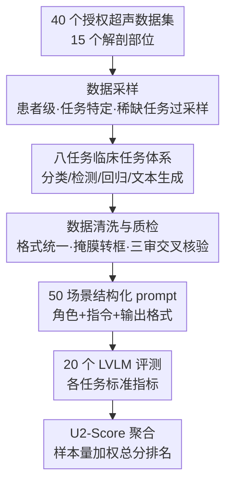

# U2-BENCH: Benchmarking Large Vision-Language Models on Ultrasound Understanding

**会议**: ICLR 2026  
**OpenReview**: [https://openreview.net/forum?id=jU10qDevGg](https://openreview.net/forum?id=jU10qDevGg)  
**代码**: https://dolphin-sound.github.io/u2-bench/ （数据集见 HuggingFace DolphinAI/u2-bench）  
**领域**: 医学图像 / 多模态VLM  
**关键词**: 超声理解、医学基准、大视觉语言模型、空间推理、临床报告生成

## 一句话总结
U2-BENCH 是第一个系统评测大视觉语言模型（LVLM）超声理解能力的基准，它从 40 个授权数据集采样 7,241 个病例、覆盖 15 个解剖部位，定义了横跨分类/检测/回归/文本生成四大类的 8 个临床任务，对 20 个开源闭源模型评测后发现：模型在图像级分类上表现尚可，但在空间推理和临床语言生成上普遍崩盘。

## 研究背景与动机
**领域现状**：超声是全球医疗中使用最广的影像方式之一（产科、急诊、心脏、低资源场景都离不开），实时、低成本，但又出了名地难解读。近年医学 LVLM 进展迅速，已经在 X 光、CT、MRI、病理这类**静态、噪声低、视图标准化**的模态上展示了不错的多模态能力。

**现有痛点**：但这些模型和基准几乎都绕开了超声。超声 AI 的工作大多基于小规模、任务专一的数据集（如胎儿切面识别、病灶分割），缺一个公开、均衡、覆盖广的基准来回答一个关键问题——这些新兴 LVLM 到底能不能从静态医学视觉任务泛化到需要**空间推理 + 解剖结构上下文理解**的超声任务？即便是已有的通用医学基准 GMAI-MMBench，超声也只有约 1.4k 个病例、集中在分类与分割、仅覆盖 6 个解剖部位，根本测不出临床值估计、结构化报告生成这类更广的能力。

**核心矛盾**：超声的本质难度和自然图像/其它医学模态完全不同。它强烈依赖操作者、充满伪影（声影、各向异性），而且是在图像序列里**动态呈现三维解剖结构**。准确解读不只要识别视觉模式，还要懂解剖、要做动态空间-上下文推理——这正是当下 LVLM 的训练数据里最稀缺的能力。

**本文目标**：构建第一个全面评测 LVLM 超声理解的基准，把"超声看得懂吗"这个模糊问题分解为四类核心能力（分类、检测、回归、文本生成）下的 8 个具体临床任务，并给出一个统一的总分来横向比较模型。

**切入角度**：从**真实超声诊断工作流**出发设计任务——不是凭空造题，而是参照超声科典型流程、并由临床专家迭代细化，确保每个任务都对应一个真实的临床应用场景（共 50 个）。

**核心 idea**：用"四大能力 × 八任务 × 15 部位 × 50 场景"的临床导向任务体系，加上一个样本量加权的聚合指标 U2-Score，把 LVLM 的超声理解能力变成一个可标准化、可复现、可排名的测评。

## 方法详解

### 整体框架
U2-BENCH 本质是一套**数据 + 任务 + 评测协议**的基准。它的构建分三个阶段：先从 40 个授权超声数据集里按"患者级、任务特定"的策略采样 7,241 个病例（覆盖 15 个解剖部位）；再把这些病例对齐到 8 个临床任务（归入分类/检测/回归/文本生成四大能力）；最后做标注标准化、格式统一、图像/帧选择、质量核验，并为 50 个应用场景各自设计结构化 prompt。评测时对 20 个开源/闭源、通用/医学专用 LVLM 跑全部任务，用各任务对应的标准指标打分，再用样本量加权聚合成一个总分 U2-Score 做排名。

### 关键设计

**1. 临床导向的八任务体系：把"超声看得懂"拆成可测的四类能力**

基准最核心的贡献是任务设计。作者没有简单堆 VQA 题，而是把超声理解归纳为四大核心能力，并在其下定义 8 个对应真实超声工作流的任务：分类下有**疾病诊断（DD）**（如乳腺 BI-RADS 分级）和**视图识别与评估（VRA）**（判断图像质量、把扫描归到标准切面如胎儿头部/腹部长轴）；检测下有**病灶定位（LL）**、**器官检测（OD）**、**关键点检测（KD）**；回归下有**临床值估计（CVE）**（预测病灶大小、左室射血分数、肝脂肪百分比等连续临床参数）；文本生成下有**报告生成（RG）**和**描述生成（CG）**。这套任务由超声科典型流程归纳、再经领域专家细化，因此每个任务都能直接映射到一个临床诊断/推理能力，而不是泛泛的"看图说话"。正是这种细分让基准能暴露出"分类能做、空间推理崩盘"这种结构性差异，而单一 VQA 指标是看不出来的。

**2. 患者级采样 + 三审交叉核验的数据构建管线：保证均衡、防泄漏、可复现**

7,241 个病例来自 40 个授权数据集（其中 25 个沿用 Alsharid 等人 2025 的汇编）。为了反映真实临床分布并防止数据泄漏，作者采用**患者级（subject-level）而非图像级**的采样，保留同一患者内部的一致性；同时在临床医生指导下，对"临床高优先级但数据稀缺"的任务做**有意过采样**，避免基准被大宗任务（甲状腺、乳腺占了三分之一以上）淹没。数据清洗上：超声扫描统一图像格式，视频序列每个study只采少量代表帧以控评测成本，分割掩膜统一转成边界框，文本经"医学引导翻译 + 术语表消歧 + 临床医生终审"译成英文。质量核验是双层的——自动过滤丢掉缺标签/无效标注/损坏文件的样本，人工核验则由 10 人标注团队按"每个数据点至少 3 人独立审"的交叉验证协议执行（工程师查 JSON 元数据有效性 → 生物医学专家查标签-图像一致性/单位/解剖术语 → 临床医生终审诊断一致性并撰写任务 prompt）。这套管线让"基准可信"从口号落到可操作步骤上。

**3. 检测任务的 9 类位置化改造 + U2-Score 聚合指标：让异构任务可比、可汇总**

这是评测协议里两个关键工程决策。其一，检测任务原本要模型输出真值框或坐标，但实测发现**很多 LVLM 根本无法稳定生成合法坐标或遵守边界框格式**——直接评测会让评分变成"格式遵循测试"而非"定位能力测试"。作者于是把检测统一**简化为 9 类位置分类**（把图像划成上左/中心/下右等 9 个粗空间扇区），用准确率衡量定位是否正确，从而在所有模型间得到稳定可比的结果。其二，8 个任务指标五花八门（分类用 Acc/F1，检测用 Acc，回归用 RMSE/MAE/%tol，生成用 BLEU-4/ROUGE/BERTScore），无法直接相加，作者设计 U2-Score 做加权聚合：

$$\text{U2-Score} := \sum_{t=1}^{N} w_t d_t,\quad w_t = \frac{n_t}{\sum_j n_j},\quad d_t \le 1$$

其中 $N$ 是任务数，$d_t$ 是第 $t$ 个任务所选指标的取值（归一到 $\le 1$），权重 $w_t$ 由该任务样本量 $n_t$ 占总样本的比例决定。这等价于一个**病例级平均**，好处是缓解了不同任务样本量不均衡的问题，让一个模型的总体超声理解能力浓缩成一个可排名的数字（随机猜测计算 U2-Score 时 BLEU 取 0）。

**4. 三段式结构化 Prompt：跨任务公平可比，并支持 prompt 消融**

为保证 20 个模型在 50 个场景下行为一致、结果可比，作者为每个场景设计了由三部分组成的结构化 prompt：**临床角色定义**（设定上下文与专业身份，如"你是一名放射科医生")、**任务特定指令**（对齐标准超声工作流）、**输出格式规范**（分类选项、数值范围或参考输出示例）。统一的 prompt 模板既消除了"提示词差异导致不公平"的混杂因素，又让作者能进一步做 prompt 设计的消融——例如系统性研究"在 prompt 里显式点出解剖部位"是否真的改变诊断准确率（见消融实验）。

## 实验关键数据

### 主实验（U2-BENCH，20 个 LVLM，U2-Score 排名）

| 模型 | 类型 | DD Acc↑ | KD Acc↑ | CVE RMSE↓ | RG BLEU%↑ | U2-Score↑ |
|------|------|---------|---------|-----------|-----------|-----------|
| Dolphin-V1 | 闭源 | **0.682** | **0.478** | 0.243 | 3.22 | **0.5835** |
| GPT-5 | 闭源 | 0.537 | 0.266 | 0.310 | 1.06 | 0.3250 |
| Gemini-2.5-Pro-Preview | 闭源 | 0.426 | 0.271 | 0.294 | 5.50 | 0.2968 |
| Lingshu-7B | 医学专用 | 0.459 | 0.127 | 0.258 | 2.00 | 0.2704 |
| MedGemma-4B-it | 医学专用 | 0.501 | 0.275 | 0.167 | 1.54 | 0.2668 |
| DeepSeek-VL2 | 开源 | 0.413 | **0.295** | 0.296 | **7.47** | 0.2630 |
| Qwen-2.5-VL-72B | 开源 | 0.490 | 0.115 | 0.322 | 3.09 | 0.2421 |
| Claude-3.7-Sonnet | 闭源 | 0.212 | 0.136 | 0.176 | 0.69 | 0.1596 |
| Random Guessing | — | 0.414 | 0.112 | 0.547 | 0 | — |

注：U2-Score 越高越好。Dolphin-V1（DolphinAI 自家模型）几乎在所有任务上断层第一，总分 0.5835 约为次优 GPT-5（0.3250）的 1.8 倍；闭源整体领先开源；但**没有任何模型在 KD 上超过 0.160 准确率（个别如 DeepSeek-VL2 0.295 是少数例外）、所有模型 RG 的 BLEU 都低于 7.5**，说明空间推理与报告生成是普遍短板。

### 消融实验

| 分析 | 配置 | 关键结果 | 说明 |
|------|------|---------|------|
| Prompt 解剖信息（表3） | 含解剖 token | 准确率 52.4% | Gemini-2.0-Pro 在 521 例乳腺/甲状腺上 |
| Prompt 解剖信息 | 不含解剖 token | 准确率 45.1% | McNemar 检验 $\chi^2=16.04$, $p=6.2\times10^{-5}$ |
| 模型规模（Qwen-2.5-VL 族） | 3B→72B | DD 0.450→0.490；CVE RMSE 降 | 分类/回归随规模小升 |
| 模型规模 | 3B→72B | RG/KD 几乎不涨甚至倒退 | 语言生成与空间推理触顶 |
| 指令遵循（表2） | DD 任务 | 17 个里 6 个满分 | 现代模型已很会读 prompt |

### 关键发现
- **任务难度分层明显**：图像级分类（DD/VRA）和临床值估计相对可做，但空间推理（KD/OD）和文本生成（RG）持续困难——这是跨所有模型家族的一致趋势，指向 LVLM 缺超声特定的空间感知与echogenicity（回声特征）理解。
- **规模收益递减、甚至反噬**：Qwen-2.5-VL 从 3B 放大到 72B，CVE 的 RMSE 确实下降，但语言生成和空间推理改进触顶；作者推测过度放大可能让模型在浅层视觉模式上过拟合，反而损害临床文本生成。"紧凑模型偶尔在某些任务上超过更大模型"暗示**针对性训练比单纯堆规模更重要**。
- **医学专用 vs 通用各有所长**：MedDr、MedGemma 这类医学模型在推理/结构化任务上有竞争力（如 MedDr CVE RMSE=0.214、CG BERT=81.21），但在粗粒度视觉分类上仍落后大通用模型（Qwen-72B DD F1=0.456 vs MedDr 0.312）——领域适配利于语义/推理重的任务，通用模型在视觉识别上保持优势。
- **解剖提示有显著效果**：在 prompt 里显式写出解剖部位，能让诊断准确率显著提升 +7.3 个百分点（McNemar 检验 $p=6.2\times10^{-5}$），说明当前模型严重依赖文本先验来弥补视觉感知不足。
- **指令遵循已不是瓶颈**：DD 任务上 17 个模型有 6 个满分，非满分的偏差都在 6 个百分点内，无系统性失败——失分主要来自偶发格式遗漏或安全策略拒答（"信息不足""无法提供医疗建议"），而非读不懂题。

## 亮点与洞察
- **任务设计带"临床血统"**：8 任务全部由真实超声工作流归纳、经临床专家迭代，每个都对应一个 50 场景里的具体应用——这让基准不只是测"能不能看图"，而是测"能不能像超声医生那样工作"，结果的可解释性远强于通用 VQA。
- **把"模型不会输坐标"这个工程坑变成方法决策**：检测任务从坐标回归改成 9 类位置分类，是个很务实的设计——它承认"格式失败"会污染能力评测，用粗粒度扇区换来跨模型稳定可比，这个思路可迁移到任何"模型输出格式不可控"的评测场景。
- **U2-Score 等价于病例级平均**：用样本量加权而非简单平均，自动抵消任务样本不均衡（甲状腺/乳腺占三分之一）带来的偏置，这个细节让总分排名更可信。
- **解剖提示 +7.3% 的统计验证**：用 McNemar 配对检验而非简单比准确率，把"加解剖词有没有用"做成了有 $p$ 值的严谨结论，是这类基准论文里少见的统计严谨度。

## 局限与展望
- **作者承认的局限**：当前 LVLM 对超声结构的感知很弱——难以识别解剖结构间的相对空间关系（反映在检测任务的差表现上），也常抓不住诊断关键的细微回声模式；根因是缺大规模超声专用的图文预训练数据，以及超声本身噪声大、异质性高。改进需要精选超声数据集、超声感知的预训练目标、以及带显式空间推理能力的架构/适配器。
- **临床超声远比通用视觉-语言任务复杂**：超声横跨 15+ 临床亚专科，每科有不同解剖、扫描切面和诊断标准（胎儿生物测量要标准 AC/HC 切面，心脏要胸骨旁长轴/心尖四腔），一个有用的 LVLM 必须懂亚专科解剖、遵循扫描协议、按诊断工作流推理——这远超当前模型能力。
- **自己发现的局限**：① 主榜单上 Dolphin-V1（作者自家 DolphinAI 模型）断层领先，存在"裁判即选手"的潜在偏置，其大幅领先有多少来自真实能力、多少来自对基准分布的熟悉，难以剥离；② 视频序列只采少量代表帧来控成本，可能丢失超声"动态三维"这一最本质的信息维度，使评测偏向静态图像理解；③ prompt 消融只在 Gemini-2.0-Pro、521 例乳腺/甲状腺上做，结论的普适性有待更多模型/部位验证。
- **改进思路**：引入显式的时序/3D 评测任务以测动态空间推理；用第三方模型做主榜单以降低自家模型偏置；把 9 类位置分类与真实框检测并列报告，区分"格式能力"与"定位能力"。

## 相关工作与启发
- **vs GMAI-MMBench**：GMAI-MMBench 是通用医学 LVLM 基准，但超声只有约 1.4k 病例、集中在分类/分割、仅 6 个解剖部位，且不评临床值估计或结构化报告。U2-BENCH 专注超声、7,241 病例、15 部位、8 任务覆盖回归与报告生成，专科深度远高。
- **vs MMBench / SEED-Bench / MMT-Bench**：这些是通用域 LVLM 基准（双语选择题、大规模视觉推理、图文/视频 VQA），强调通用视觉理解、缺临床落地评测；U2-BENCH 把评测锚定在临床工作流与标准超声指标上。
- **vs MedGemma / Med-Gemini**：它们虽然号称覆盖超声，但在该领域能力仅限描述生成（caption）；U2-BENCH 把超声能力打散成 8 个细分任务，能精确暴露这些模型在空间推理/报告生成上的真实短板。
- **启发**：当某模态的模型输出格式难以约束时（如坐标），可像本文一样把任务"降维"成稳定可评的分类形式，先保证可比性、再逐步逼近真实任务；评测异构多任务时，样本量加权的聚合分是个既简单又能防偏置的实用选择。

## 评分
- 新颖性: ⭐⭐⭐⭐ 第一个系统的超声 LVLM 基准，任务设计有临床血统，但方法学上以"基准构建"为主、无新模型/算法。
- 实验充分度: ⭐⭐⭐⭐⭐ 20 个开源闭源/通用医学模型 × 8 任务 × 15 部位，含规模、指令遵循、prompt 消融与统计检验。
- 写作质量: ⭐⭐⭐⭐ 任务定义清晰、管线交代到位，但主榜单自家模型断层领先的偏置未充分讨论。
- 价值: ⭐⭐⭐⭐⭐ 填补了超声这一高临床价值却被忽视的模态评测空白，为后续超声 LVLM 研究提供统一可复现的测试台。

<!-- RELATED:START -->

## 相关论文

- [\[ICLR 2026\] Fetal-Gauge: A Benchmark for Assessing Vision-Language Models in Fetal Ultrasound](fetal-gauge_a_benchmark_for_assessing_vision-language_models_in_fetal_ultrasound.md)
- [\[CVPR 2026\] LLaDA-MedV: Exploring Large Language Diffusion Models for Biomedical Image Understanding](../../CVPR2026/medical_imaging/llada-medv_exploring_large_language_diffusion_models_for_biomedical_image_unders.md)
- [\[ICLR 2026\] DM4CT: Benchmarking Diffusion Models for Computed Tomography Reconstruction](dm4ct_benchmarking_diffusion_models_for_computed_tomography_reconstruction.md)
- [\[ICLR 2026\] Boosting Medical Visual Understanding From Multi-Granular Language Learning](boosting_medical_visual_understanding_from_multi-granular_language_learning.md)
- [\[ICLR 2026\] OpenPros: A Large-Scale Dataset for Limited View Prostate Ultrasound Computed Tomography](openpros_a_large-scale_dataset_for_limited_view_prostate_ultrasound_computed_tom.md)

<!-- RELATED:END -->
