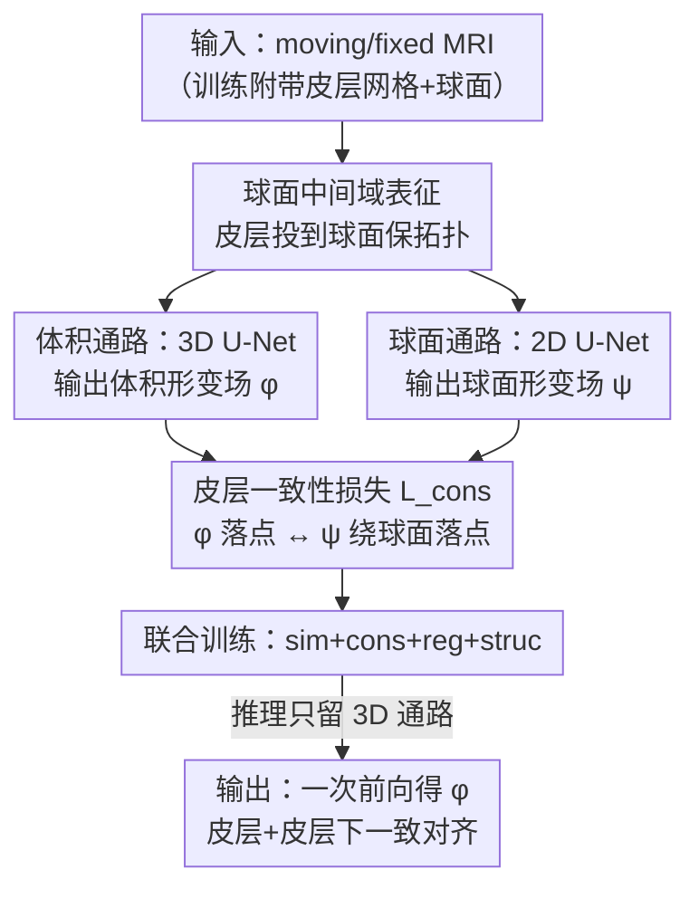

# Unified Brain Surface and Volume Registration

**会议**: ICLR 2026  
**OpenReview**: [https://openreview.net/forum?id=7FvUJu63zq](https://openreview.net/forum?id=7FvUJu63zq)  
**代码**: https://github.com/mabulnaga/neuralign  
**领域**: 医学图像  
**关键词**: 脑MRI配准, 皮层表面配准, 球面配准, 可微形变, 一致性损失

## 一句话总结
NeurAlign 用一个共享框架同时训练「体积配准网络」和「球面配准网络」，并通过一条皮层一致性损失把两者耦合起来，让脑 MRI 的皮层（表面）和皮层下（体积）结构在一次前向中被一致地对齐，推理时只需一张 MRI、不需要网格或分割，配准精度（皮层 Dice 最高 +7 分）和速度（比标准方法 CVS 快几个数量级）都显著领先。

## 研究背景与动机
**领域现状**：脑 MRI 跨被试分析的基础是把两个脑配准到一起，这要求同时对齐两类结构——大脑外层薄而高度褶皱的**皮层（cortical surface）**，以及内部的**皮层下结构（subcortical volume）**。传统上这是两套互不相通的方法：体积配准在欧氏空间里估计一个稠密 3D 位移场、靠图像灰度相似度对齐；皮层配准则把皮层投影到球面上、靠预先算好的几何描述子（沟回深度 sulcal depth、平均曲率 mean curvature）在球面上对齐，因为球面映射天然保拓扑。

**现有痛点**：体积配准虽然擅长对齐皮层下结构和全局解剖，但在皮层上经常失败——皮层太薄、褶皱跨被试差异极大，欧氏空间的优化容易陷入局部极小，把一个脑回（gyrus）的体素错配到相邻脑回里。而球面配准虽能对齐皮层，却完全没法处理体积结构。于是神经科学研究者被迫把「体积」和「表面」当成两个割裂的问题分别求解，再用临时手段拼起来。

**核心矛盾**：标准的联合方法 CVS 是**串行**的——先在球面上做皮层配准，再用一个弹性偏微分方程（elastic PDE）把表面形变「外推」到内部体积。问题在于：这种插值得到的内部形变**不保证**和原始的体积配准一致，皮层↔皮层下边界处会引入误差，破坏全脑分析；而且 CVS 每对图像要算 2.5 小时、还必须先提取皮层网格和分割。本质上，串行公式**解耦**了表面目标和体积目标，无法求一个同时满足两者的相干（coherent）配准。

**本文目标**：用一个统一的学习框架，让皮层和皮层下结构在**同一次前向**里被一致地对齐，并且推理时不依赖昂贵的网格/分割预处理。

**切入角度**：作者的关键观察是——皮层配准必须在球面做（才保拓扑），体积配准必须在 3D 做（才能管皮层下），那么与其先后串联，不如让两个域的形变场**同时优化、并显式约束它们在皮层处相互一致**。一致性是几何上的：皮层网格顶点经体积形变场得到的落点，应当等于它先映到球面、被球面配准、再映回 3D 的落点。

**核心 idea**：用一个**球面中间域**桥接表面拓扑与体积解剖，让一条「皮层一致性损失」把体积网络和球面网络耦合训练，从而同时获得拓扑正确的皮层对齐和准确的皮层下对齐。

## 方法详解

### 整体框架
NeurAlign 是一个无监督学习框架，把脑配准拆成两条并行通路再耦合到一起。输入是一对脑 MRI（moving / fixed），训练时还附带各自的皮层网格和「膨胀」得到的球面表示；输出是两个可微形变场——3D 体积位移场 $\varphi$ 和球面（2D 角度空间）位移场 $\psi$。**体积通路**用一个 3D U-Net $F_v(I_1,I_2;\omega_v)=\varphi$ 处理图像灰度、对齐皮层下结构；**球面通路**用一个 2D U-Net $F_s$ 处理投影到平面的球面网格、靠几何描述子对齐皮层。两条通路本来各自为政，靠一条**皮层一致性损失 $\mathcal{L}_{\text{cons}}$** 把它们绑在一起：它惩罚「皮层网格顶点经 $\varphi$ 的落点」与「经球面通路 $\psi$ 绕一圈映回 3D 的落点」之间的差异，从而强制两个域在皮层上给出几何一致的对齐。关键的工程价值在于：网格和球面只在**训练时**用来提供这条一致性监督；**推理时只跑 3D U-Net，一张 MRI 进、形变场出**，不需要任何网格、球面或分割。

### 关键设计

**1. 球面中间域：把「保拓扑约束」变成可优化的几何耦合**

直接求一个同时对齐灰度和几何的双射 $\varphi:M_1\to M_2$ 极难——目标非凸、有退化解，而强制皮层映到皮层（$\varphi(\partial M_1)\subseteq\partial M_2$）尤其棘手，因为皮层薄、褶皱多、跨被试结构多变，欧氏体素网格根本捕捉不了细粒度的边界对应。NeurAlign 的破解办法是引入一个固定的**球面映射** $\tau_i:\partial M_i\to S^2$（由皮层膨胀 cortical inflation 得到，可逆），把皮层对齐从「在 3D 里硬怼」改成「在球面上算一个位移 $\psi:S^2\to S^2$ 来对齐几何描述子」。因为球面映射保拓扑，约束集 $P$ 自动满足。理想情况下两个域应严格一致，即 $\varphi(x)=\tau_2^{-1}\circ\psi\circ\tau_1(x)$（皮层顶点经体积场的落点 = 它映到球面、被球面配准、再映回 3D 的落点）。这个等式只在测度为零的皮层面上成立、是个硬约束，作者把它**软化**成一条耦合能量：

$$E_{\text{cons}}(\varphi,\psi)=\int_{\partial M_1} f\big(\varphi(x),\ \tau_2^{-1}(\psi(\tau_1(x)))\big)\, dS(x),$$

其中 $f$ 用平方误差度量两条路径的落点差异。这样皮层对齐被分流到天然保拓扑的球面去做，体积通路只管皮层下，而一致性把二者重新缝合——既绕开了欧氏空间对皮层的劣势，又保住了体积配准对皮层下的优势。

**2. 双网络 + 离散皮层一致性损失：让球面更新「渗透」进体积**

连续公式落到实现上，是一对无监督训练的 CNN。**体积网络**先输出一个静止速度场（SVF），积分得到可微位移场 $\varphi(x)=x+u(x)$，保证形变可逆。**球面网络**先用立体投影 $\pi:S^2\to\mathbb{R}^2$ 把球面网格摊到平面，再用标准 2D CNN 学一个角度空间 $(\theta,\phi)$ 的可微位移场 $\psi(\rho)=\rho+u_s(\rho)$；为应对球面参数化在两极被拉伸的非均匀采样，所有表面损失都按 $\sin(\theta)$ 加权做畸变校正，并用循环 padding + 两极 180° 循环移位处理边界不连续。耦合二者的离散一致性损失为：

$$\mathcal{L}_{\text{cons}}(\varphi,\psi,C_1)=\frac{1}{N_v}\sum_{v\in C_1} f\big(\varphi(v),\ \pi^{-1}(\psi(\pi(v)))\big),$$

对每个皮层网格顶点 $v$，比较它经 3D 场 $\varphi$ 的位移与经 2D 球面 warp 绕回的位移，$f$ 取 MSE，$\pi^{-1}(\cdot)$ 用三线性插值实现。这条损失看似只作用在测度为零的皮层面上、约束很弱，但离散实现巧妙地化解了这点：一致性损失在网格顶点处通过三线性插值采样体积形变场，**把梯度分散到邻近体素**；再叠加形变场的平滑先验，皮层处由表面驱动的更新就能自然地向体积内部传播——这正是它能同时改善皮层和皮层下对齐、而非只在皮层薄壳上起作用的原因。

**3. 联合训练损失：一致性必须配合体积结构监督才生效**

整个系统由一个组合损失端到端联合优化：

$$\mathcal{L}(\varphi,\psi)=\mathcal{L}_{\text{sim}}(\varphi,\psi)+\gamma\mathcal{L}_{\text{cons}}(\varphi,\psi)+\lambda\mathcal{L}_{\text{reg}}(\varphi,\psi)+\kappa\mathcal{L}_{\text{struc}}(\varphi,\psi).$$

其中 $\mathcal{L}_{\text{sim}}$ 在体积上用局部归一化互相关匹配 MRI 灰度、在球面上匹配几何描述子（沟回深度+平均曲率）；$\mathcal{L}_{\text{reg}}=\|\nabla\varphi\|^2+\|\nabla\psi\|^2$ 约束两个场平滑；$\mathcal{L}_{\text{struc}}$ 是当部分图像对有分割标签时加的辅助软 Dice 损失，监督皮层下子结构对齐。一个值得强调的发现来自消融：**单独加一致性损失、或单独加全结构 Dice 监督，都无法显著提升皮层 Dice**；只有「全结构 Dice 监督 + 球面一致性」同时存在时皮层 Dice 才大幅上涨且保住皮层下 Dice。这说明一致性损失不是孤立起效的——它需要体积结构监督把皮层下「钉」住，才能让球面驱动的皮层对齐在整脑范围内一致传播。超参取 $\lambda=1.0$、$\kappa=10.0$、$\gamma=0.05$（网格搜索得到）。

## 实验关键数据

### 主实验
在 OASIS-1 + ADNI（训练域）以及 IXI、Mindboggle-101（域外泛化）上评测，指标为 43 个皮层下结构 / 每半球 34 个皮层区域的 Dice、折叠体素占比（% folds）、形变场平滑度 SD log det J。

| 数据集 | 方法 | 皮层 Dice ↑ | 皮层下 Dice ↑ | % folds ↓ | SD logJ ↓ |
|--------|------|------|------|------|------|
| OASIS-1 & ADNI | CVS（标准联合法） | 0.681 | 0.715 | 1.73 | 8.737 |
| OASIS-1 & ADNI | uGradICON-seg | 0.583 | 0.701 | 0.688 | 0.41 |
| OASIS-1 & ADNI | VoxelMorph | 0.551 | **0.756** | 0.001 | 0.479 |
| OASIS-1 & ADNI | **NeurAlign** | **0.698** | 0.747 | 0.169 | 0.829 |
| IXI（域外） | CVS | 0.582 | 0.814 | 1.865 | 7.591 |
| IXI（域外） | uGradICON-seg | 0.639 | **0.825** | 0.602 | 0.399 |
| IXI（域外） | **NeurAlign** | **0.683** | 0.810 | 0.081 | 0.712 |
| Mindboggle-101（域外） | CVS | 0.535 | 0.766 | 2.164 | 7.429 |
| Mindboggle-101（域外） | **NeurAlign** | **0.703** | **0.823** | 0.174 | 0.831 |

NeurAlign 在三个数据集上皮层 Dice 都最高（统计显著 $p<0.01$），相比次优方法最多高出约 7.5 分；皮层下 Dice 在两个数据集上也最高，只在 IXI 上比最优低约 1.5 分（差异不大）。同时折叠占比极低（0.08%~0.17%），形变场规整——而 CVS 虽皮层下尚可，但折叠率高、SD logJ 高达 7~8，形变场远不如 NeurAlign 平滑。

**速度**：CVS 每对约 2.5±0.5 小时（CPU），uGradICON 因测试时优化需数分钟，NeurAlign 与其余基线均在**毫秒级**收敛——比 CVS 快几个数量级，且推理无需网格/分割。

### 消融实验
在 IXI 上（$\kappa=1.0,\gamma=0.05$）逐组件消融：

| 配置 | 皮层 Dice | 皮层下 Dice | 说明 |
|------|---------|---------|------|
| Base（纯 VoxelMorph） | 0.582 | 0.789 | 无任何监督 |
| Base + Dice(subcort) | 0.553 | 0.815 | 仅皮层下分割监督 |
| Base + Dice(all) | 0.562 | 0.812 | 全结构分割监督 |
| Base + Sphere | 0.560 | 0.736 | 仅球面一致性损失 |
| Base + Dice(all) + Sphere | **0.633** | 0.799 | 完整模型 |

### 关键发现
- **一致性损失与结构监督是「乘法」关系，不是「加法」**：单加全结构 Dice 监督皮层 Dice 只从 0.582→0.562（甚至略降），单加球面一致性皮层 Dice 仅 0.560；唯有两者合用才跳到 0.633。说明本文的皮层↔皮层下一致性约束确实是细粒度皮层对齐的关键，但它需要体积结构监督作支撑。
- **皮层提升不以牺牲皮层下为代价**：完整模型皮层下 Dice（0.799）相比纯 Dice 监督（0.812~0.815）只小幅下降，换来皮层 Dice 大涨。
- **$\kappa$（Dice 权重）的取舍依下游而定**：$\kappa>1$ 普遍优于基线；但 $\kappa$ 越大结构重叠越高、局部形变场规整度会变差——图谱分割传播宜用大 $\kappa$，纵向研究宜用更平滑的小 $\kappa$。

## 亮点与洞察
- **把「难以满足的硬约束」转译为「可优化的软耦合」**：皮层映到皮层是个测度为零、几乎无法直接优化的约束，作者借球面中间域 + 一致性能量把它软化，再靠三线性插值的梯度扩散让约束「有质量地」作用到体积——这套从连续公式到离散实现的转译很漂亮，是值得迁移到其他「表面约束传播进体积」问题的范式。
- **训练重、推理轻的非对称设计**：网格/球面/分割只在训练时充当一致性监督的脚手架，推理时全部丢掉、只留 3D U-Net，从而把每对 2.5 小时、依赖复杂预处理的流程压到毫秒级、只需一张 MRI——这对大规模人群研究的可用性是质变。
- **一个统一表征同时吃下两类几何**：球面管薄壳高曲率的皮层、3D 网格管体积，二者用同一损失缝合，避免了 CVS 那种「先后串联→边界不一致」的结构性误差。

## 局限与展望
- **作者承认**：可微框架无法处理改变拓扑的病变（如肿瘤），需靠训练时加病变 mask 缓解；对低质量临床扫描或儿童脑的泛化尚不清楚；只在 T1w 模态上验证（因为只有 T1w 能可靠重建皮层）。
- **依赖皮层表面提取与球面膨胀的预处理**：这条流水线在困难扫描上可能失败，只能靠丢弃失败样本或更鲁棒的学习式提取来兜底（实验数据上未观察到失败）。
- **自己发现**：消融表显示一致性损失须配合结构监督才生效，意味着完全无标注场景下方法收益有限；皮层下 Dice 在 IXI 上略逊于 uGradICON-seg，说明在某些域外数据上体积侧仍有提升空间。
- **可拓展方向**：一致性损失原理上可推广到任何与皮层网格存在一一映射的表征（不限球面），也可对 genus-0 拓扑的其他结构（如海马）加表面监督；还可接入 Deep Functional Maps 直接在网格上做皮层配准。

## 相关工作与启发
- **vs CVS（标准联合法）**：CVS 先球面配准、再用弹性 PDE 把表面形变外推进体积、最后灰度精修——串行解耦导致皮层↔皮层下边界不一致、每对 2.5 小时、必须有网格和分割。NeurAlign 改成两网络**联合训练 + 一致性损失**，一次前向、毫秒级、推理无需网格，皮层 Dice 在 Mindboggle 上 0.703 vs CVS 0.535，形变场也规整得多。
- **vs 体积学习法（VoxelMorph / uGradICON / SynthMorph / FireANTs）**：它们擅长皮层下但皮层吃力（欧氏空间易错配脑回），即便加分割监督皮层 Dice 也上不去；NeurAlign 借球面通路专门解决皮层对齐，皮层 Dice 全面领先，同时保住皮层下。
- **vs 球面配准法（Zhao 等的 2D CNN / Icosahedral CNN）**：这些只对齐皮层、无法管体积结构。NeurAlign 把平面参数化的球面配准网络与体积网络联合建模，是首个把球面配准「嵌进」统一体积-表面学习框架的工作。

## 评分
- 新颖性: ⭐⭐⭐⭐⭐ 首次用一条几何一致性损失把球面皮层配准与 3D 体积配准联合训练，统一了长期割裂的两套范式。
- 实验充分度: ⭐⭐⭐⭐ 4 个临床数据集含域外泛化、组件与超参双消融、多个强基线，唯模态仅限 T1w。
- 写作质量: ⭐⭐⭐⭐⭐ 从连续公式到离散实现层层递进，动机与一致性损失的几何含义讲得清晰。
- 价值: ⭐⭐⭐⭐⭐ 把数小时、依赖重预处理的联合配准压到毫秒级且推理只需一张 MRI，对大规模神经影像研究实用性极高。

<!-- RELATED:START -->

## 相关论文

- [\[ICLR 2026\] OmniCT: Towards a Unified Slice-Volume LVLM for Comprehensive CT Analysis](omnict_towards_a_unified_slice-volume_lvlm_for_comprehensive_ct_analysis.md)
- [\[ICLR 2026\] MedLesionVQA: A Multimodal Benchmark Emulating Clinical Visual Diagnosis for Body Surface Health](medlesionvqa_a_multimodal_benchmark_emulating_clinical_visual_diagnosis_for_body.md)
- [\[ECCV 2024\] UMBRAE: Unified Multimodal Brain Decoding](../../ECCV2024/medical_imaging/umbrae_unified_multimodal_brain_decoding.md)
- [\[ICLR 2026\] sleep2vec: Unified Cross-Modal Alignment for Heterogeneous Nocturnal Biosignals](sleep2vec_unified_cross-modal_alignment_for_heterogeneous_nocturnal_biosignals.md)
- [\[ICLR 2026\] Spike-based Digital Brain: A Novel Fundamental Model for Brain Activity Analysis](spike-based_digital_brain_a_novel_fundamental_model_for_brain_activity_analysis.md)

<!-- RELATED:END -->
