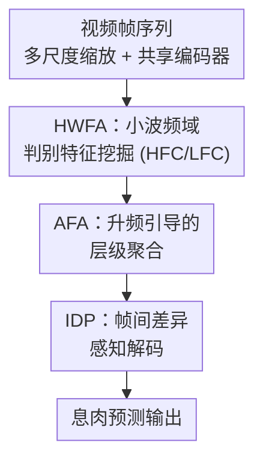

# WavePolyp: Video Polyp Segmentation via Hierarchical Wavelet-based Feature Aggregation and Inter-frame Divergence Perception

**会议**: ICLR 2026  
**OpenReview**: [https://openreview.net/forum?id=Sm3Y0TMnDv](https://openreview.net/forum?id=Sm3Y0TMnDv)  
**代码**: https://github.com/FishballZhang/WavePolyp  
**领域**: 医学图像 / 视频分割  
**关键词**: 视频息肉分割, 小波变换, 频域特征, 帧间差异, 时序一致性

## 一句话总结
WavePolyp 用小波把每帧特征拆成高/低频再分头增强聚合（HWFA），又用一个沿时间维度做差分注意力的模块（IDP）显式建模相邻帧的息肉差异，从而在结肠镜视频里既能抠出高度伪装的息肉、又能稳定地跨帧追踪，在 SUN-SEG 和 CVC-612 上全指标超过此前 SOTA 且接近实时（23 FPS）。

## 研究背景与动机
**领域现状**：结肠镜视频息肉分割（VPS）是辅助早期肠癌筛查的关键技术。早期工作大多是图像级息肉分割（IPS），靠 CNN 抠局部纹理或靠 Transformer 建模全局上下文，但它们只看单帧、学不到时序依赖。后来的 VPS 方法（PNS+、SALI、VP-SAM、Diff-VPS 等）开始引入 2D/3D 混合卷积、归一化注意力、长短时感受野来建模帧间一致性。

**现有痛点**：这些 VPS 方法的思路几乎都是「拿帧间时序信息去增强帧内空间表示」，存在两个被忽视的盲点。其一，它们没有充分挖掘**单帧内部**的判别性特征——息肉常常长在病变组织中、与背景高度相似（即「高伪装」），常规特征提取器在空间域里很难把这种细微差异抠出来。其二，当息肉运动不规则、帧质量低、相邻帧有噪声或错位时，过度依赖帧间相关性反而会让模型退化、误差累积。

**核心矛盾**：VPS 的难点其实分布在两个不同维度上——**帧内**需要更强的判别力来对抗高伪装，**帧间**需要识别息肉因肠道蠕动、相机抖动带来的形状/位置/尺寸剧变（即帧间差异）。现有方法把帧间信息塞进帧内表示，等于用一种手段去同时压两个本质不同的问题，结果两头都没压透。

**本文目标**：分别从频域和时序两条线下手——一条线在每帧内部用频域分析挖出被伪装掩盖的细粒度判别线索，另一条线显式建模相邻帧之间的差异以稳定追踪。

**切入角度**：作者观察到伪装息肉的判别信息恰好同时分布在高频分量（纹理、边缘）和低频分量（颜色、光照、整体结构）里，而离散小波变换（DWT）是无参、计算高效、天然能把特征拆成不同频带的工具，特别适合捕捉视觉相似病灶区域里的细微变化。对帧间，他们认为应该把「差异」本身当作一等公民显式算出来，而不是隐式地寄望注意力去学。

**核心 idea**：用小波频域分解 + 分频增强聚合（HWFA）强化帧内判别力，用沿时间维度的帧间差分注意力（IDP）显式感知帧间差异，二者互补、各管一头。

## 方法详解

### 整体框架
WavePolyp 是一个模仿医生「来回缩放观察、逐帧比对」习惯的 VPS 网络，整体由三块串成：共享特征编码器、HWFA 模块、由 IDP 堆叠而成的解码器。给定一段 $T$ 帧的视频 $I \in \mathbb{R}^{T\times 3\times H\times W}$，模型先借鉴 ZoomNeXt 把每帧缩放出 $0.75\times$ 和 $1.25\times$ 两个辅助尺度，三套尺度送进**共享编码器**抽多层特征，再经多尺度合并网络（MSM）对齐到 $1.0\times$ 尺度，得到四层特征 $\{f_k \mid k=1,2,3,4\}$。这些特征一路进 **HWFA**：对中高层特征做 DWT 拆出高频 $f_k^{HF}$ 和低频 $f_k^{LF}$，分别经 HFC/LFC 单元增强，再由 AFA 单元自高层向低层做升频引导的层级聚合，最终把聚合到最底层的频域线索回灌主特征，得到增强特征 $x_1,\dots,x_4$。增强特征送进由 4 个 **IDP** 块组成的粗到细级联解码器，每个 IDP 沿时间维度算出相邻帧差异并做差分注意力，逐级上采样融合，最后由息肉预测头输出 $P \in \mathbb{R}^{T\times 1\times H\times W}$。

### 关键设计

**1. HWFA：把每帧拆成高低频再分头增强，抠出被伪装掩盖的判别线索**

针对「息肉与背景高度相似、空间域抠不出细节」这个痛点，HWFA 不在空间域硬抠，而是先用 DWT 把特征 $f_k$ 分解成高频子带 $f_k^{HF}$（纹理、边缘）和低频子带 $f_k^{LF}$（颜色、光照、整体结构），再对两路分别设计增强单元。高频走 **HFC 单元**：特征过 $3\times3$ 卷积、BN、残差层保纹理，再叠通道注意力与空间注意力 CSA 突出关键区域，即 $W_k^{HF} = \mathrm{CSA}(\mathrm{BN}(\mathrm{conv}_3(f_k^{HF})) + f_k^{HF})$，强化纹理丰富的细节区。低频走 **LFC 单元**：因为低频含更多全局信息、也夹带冗余与干扰，作者把 BN 换成实例归一化 IN，并加一对对称的位置归一化 PN / 逆位置归一化 IPN——先 PN 再卷积，对均值 $\mu$、方差 $\sigma$ 做更新得到 $\mu',\sigma'$，最后 IPN 还原尺度，即 $W_k^{LF} = \mathrm{CSA}(\mathrm{IPN}(\mathrm{IN}(\mathrm{conv}_3(\mathrm{PN}(f_k^{LF})) + f_k^{LF})))$。这套归一化让后续注意力聚焦在更干净的全局信息上、从全局视角凸显异常病灶。两路分头处理的好处是：高频专管「边在哪、纹理细节」，低频专管「整体病灶在哪、别丢全局语义」，避免一锅炖把伪装区域的细微差异平均掉。

**2. AFA：用高层的引导矩阵做窗口线性变换，跨层聚合时对齐空间、抑制错位噪声**

HFC/LFC 把高频纹理和低频结构都「锐化」了，但如果直接靠上采样 + concat 把不同尺度的锐化特征拼起来，反而会放大它们之间固有的空间错位，引入比未增强时更糟的噪声和伪影。AFA 单元就是来解决这个跨层对齐问题的。它接收低层特征 $f_k^{HF}$、高层特征 $f_{k+1}^{HF}$ 和高层的引导矩阵 $W_{k+1}^{HF}$ 三个输入，借助一个窗口内的线性模型把高层语义引导到低层细节上：在局部窗口 $s_w$ 内对下采样后的低层特征做线性变换 $(f_k^{dh})_i = \sigma_w \mathrm{Down}(f_k^{HF})_i + \mu_w$，其线性系数通过最小化目标

$$\min_{\sigma_w,\mu_w} \sum_{i\in s_w}\left[(W_{k+1}^{HF})_i^2\big((f_k^{dh})_i - (f_{k+1}^{HF})_i\big)^2 + \epsilon\sigma_w^2\right]$$

求得（$\epsilon$ 约束 $\sigma_w$，⚠️ 公式以原文为准）。每个像素被多个窗口覆盖，取各窗口系数的平均得到逐像素 $\{\sigma_i,\mu_i\}$，上采样后得 $\{\sigma_h,\mu_h\}$，最终 $f_k^h = \sigma_h \odot f_k^{HF} + \mu_h$。高频和低频各自从高层向低层这样递归聚合，最终在最底层得到 $f_1^{HF}$、$f_1^{LF}$，它们已经吸收了多层增强后的判别信息。回灌时按频带因材施用：把 $f_1^{LF}$ 拼进高层 $f_3$（补全局语义、防背景信息被高层忽略），把 $f_1^{HF}$ 拼进浅层 $f_1$（补小目标、细边缘、纹理）。消融显示去掉 AFA 后性能甚至跌破基线，正说明这种「带引导矩阵的窗口对齐聚合」是把分频增强真正用好的关键。

**3. IDP：把相邻帧的差异显式算出来，沿时间维做差分注意力实现稳定追踪**

针对帧间痛点——息肉因肠道蠕动、相机抖动产生非刚性形变，单看帧内特征分不清是形变伪影还是真实结构变化，IDP 块把「帧间差异」当作显式信号来建模。给定从 $x_k$ 卷积展平得到的 $Q$、$K$、$V$，先做时序移位 Shift（把视频片段起始时刻的特征图移到末尾、其余前移一位），从而得到帧间差异 $\mathrm{Diff} = \mathrm{Shift}(V) - V$，再用可学习投影 $W_V$ 调制，让网络聚焦在时序变化显著的区域。关键在于注意力沿**时间维度**而非通道维度计算：

$$O = \mathrm{Conv}\!\left(W_V(\mathrm{Shift}(V)-V)\,\mathrm{Softmax}\!\Big(\tfrac{K^TQ}{\sqrt{HW}}\Big) + Q\right)$$

其中得到的权重矩阵是一个 $T\times T$ 矩阵，刻画每个时刻与其他所有时刻的交互比对，它与 $\mathrm{Diff}$ 相乘就能在时间序列里挑出最显著的差异信息、凸显追踪息肉位置所需的帧间差异；由于运算沿时间维（$T$ 通常很小，本文取 5），计算复杂度保持很低。最后再用两层 $T\times3\times3$ 卷积把差异信息充分扩散（称为帧间差异扩散 IDD），加回原始视觉特征 $Q$。解码器把 4 个 IDP 块按粗到细级联：从最深特征 $x_4$ 起，每个 IDP 先时序增强当前特征、上采样、再与下一更精细尺度残差融合，四次迭代后送预测头。可视化显示去掉 IDP 会出现掩码闪烁、边界不稳，加上后分割在时间上平滑一致。

### 损失函数 / 训练策略
总损失为二值交叉熵损失加不确定性感知损失：$L_{total} = L_{bce}(P_t, G_t) + \lambda L_{ual}(P_t, G_t)$，其中 $L_{ual}$（沿用 ZoomNeXt）逼模型在决策时提高「置信度」、加重对模糊预测的惩罚，$\lambda$ 为平衡系数并沿用 ZoomNeXt 的调整策略。所有帧统一缩放到 $352\times352$，片段长度 $T=5$、通道数 $C=64$，端到端训练 30 个 epoch、batch size 2，单张 RTX 3090，用 Adam（betas=(0.9,0.999)），backbone 与其余部分学习率分别初始化为 1e-5 与 2e-5、每 epoch 衰减 2%；默认 backbone 为 ImageNet 预训练的 PVTv2-b5。

## 实验关键数据

### 主实验
在 SUN-SEG（49,136 帧 / 285 段）和 CVC-612（612 帧 / 31 段）两个视频数据集上，与 SLT-Net、ZoomNeXt、AutoSAM、WeakPolyp、PNS+、MAST、SALI、VP-SAM 等 SOTA 比较，四项指标 $S_\alpha$ / $E_\phi^{mn}$ / $F_\beta^w$ / Dice 全面领先。

| 数据集 | 指标(Dice) | WavePolyp | 此前最强(VP-SAM) | SALI |
|--------|------|------|----------|------|
| SUN-SEG-Easy | Dice | **88.96** | 88.19 | 86.07 |
| SUN-SEG-Hard | Dice | **87.55** | 86.94 | 85.54 |
| CVC-612 | Dice | **94.36** | 93.45 | 93.01 |

其中 VP-SAM 性能最接近本文，但它每帧都依赖一个点提示，在临床中难以获取；WavePolyp 无需任何提示即可超过它。

### 性能-效率对比（SUN-SEG-Hard, RTX 3090, batch=1）

| 方法 | Dice | 参数量 | GFLOPs | FPS |
|------|------|--------|--------|-----|
| VP-SAM | 86.94 | 140.27M | 156.86 | 12.74 |
| SALI | 85.54 | 82.73M | 58.15 | 7.93 |
| ZoomNeXt | 85.22 | 84.78M | 102.32 | 22.48 |
| **WavePolyp** | **87.55** | 86.63M | 114.88 | **23.04** |

WavePolyp 在精度最高的同时达到接近实时的 23.04 FPS，比同等精度的 VP-SAM 快近一倍且参数量小得多。

### 消融实验
在 SUN-SEG 上拆解两大组件及其内部单元（HFC / LFC / Norm / AFA / Shift / IDA / IDD）。

| 配置 | Easy $S_\alpha$ | Easy Dice | Hard $S_\alpha$ | Hard Dice |
|------|------|------|------|------|
| Baseline | 89.12 | 87.51 | 88.84 | 86.12 |
| w/o AFA | 87.92 | 87.39 | 87.75 | 85.55 |
| Full model | **90.93** | **88.96** | **90.28** | **87.55** |

### 关键发现
- **HWFA 与 IDP 互补**：单独加任一组件都有提升，但二者合用增益更大；且在 Hard 测试集上单组件的 Dice 提升更明显，说明它们对困难样本适应性强。
- **AFA 不可或缺、去掉甚至跌破基线**：因为 HFC/LFC 强烈锐化了高频纹理和低频结构，缺了 AFA 的自适应空间对齐，盲目跨尺度融合这些锐化特征会放大固有错位、引入比未增强更糟的噪声伪影。
- **频域解耦确有其事**：可视化显示 $f_1^{HF}$ 锐利凸显息肉边界与表面纹理（回灌浅层 $x_1$），$f_1^{LF}$ 捕捉病灶整体与结构上下文（回灌深层 $x_3$），印证 HWFA 成功解耦并聚合了互补判别线索。
- **片段长度取 5 最佳**：太短捕捉不到帧间差异、息肉快速形变时定位失败；太长则时间上相距远的帧引入过量差异、干扰决策。

## 亮点与洞察
- **把「帧间差异」做成显式一等公民**：IDP 用 $\mathrm{Shift}(V)-V$ 直接算出相邻帧差，再沿时间维做差分注意力，而不是隐式寄望时空注意力去学差异。由于 $T$ 很小，时间维注意力的开销极低，这是它能既稳又快的关键。
- **高低频分头 + 不同归一化策略**：HFC 用 BN 保纹理、LFC 用 IN+PN/IPN 净化全局信息，体现了「不同频带的信息性质不同、就该用不同处理」的细腻设计，可迁移到任何前景/背景高度相似的伪装目标分割任务。
- **AFA 的窗口线性引导**：用高层引导矩阵 $W_{k+1}$ 加权地把高层语义对齐进低层细节，本质是一种「带语义先验的引导滤波」，比 concat+上采样更能抑制跨尺度错位，思路可复用到其他多尺度特征聚合场景。

## 局限与展望
- 作者承认实验只在结肠镜视频数据集上做，虽认为方法对相似挑战的其它数据集通用，但缺乏跨域验证。
- 失败案例集中在细节缺失、光照/对焦畸变、肠壁重叠遮挡等场景，说明对极端成像退化仍不鲁棒。
- 自己发现的局限：片段长度固定为 5，对运动速度差异极大的视频缺乏自适应；HWFA 用固定的 DWT 而非可学习小波，频带选择是否最优未充分探讨；方法栈了多尺度缩放 + 多层频域聚合 + 多块 IDP，结构偏重，进一步压缩才能上更受限的临床设备。

## 相关工作与启发
- **vs SALI / PNS+**：它们靠长短时感受野或归一化注意力建模时序一致性来增强帧内空间表示，本质仍是「用帧间信息补帧内」；WavePolyp 把帧内（频域判别）和帧间（显式差异）拆成两条独立线分别强化，互补而非互相借力。
- **vs VP-SAM**：VP-SAM 给 SAM 加时空侧网络并用可变形卷积建模运动，但每帧需要点提示，临床不现实；WavePolyp 无提示、精度更高、速度快近一倍。
- **vs FEDER（频域伪装分割）**：FEDER 也用可学习小波按频带解耦前景/背景，但面向图像；WavePolyp 把 DWT 分频 + 层级聚合用于视频，并配套帧间差异感知，针对的是 VPS 的时空双重挑战。

## 评分
- 新颖性: ⭐⭐⭐⭐ 频域分频增强 + 显式帧间差分注意力的组合在 VPS 里较新，但单项技术（小波分频、时序移位、引导滤波）多有渊源。
- 实验充分度: ⭐⭐⭐⭐ 两数据集全指标领先、含细粒度单元消融与性能-效率对比，但仅限结肠镜域、无跨域泛化验证。
- 写作质量: ⭐⭐⭐⭐ 结构清晰、动机与组件对应明确，公式较密但可读。
- 价值: ⭐⭐⭐⭐ 接近实时且精度 SOTA、无需提示，对临床 VPS 实用性强。

<!-- RELATED:START -->

## 相关论文

- [\[ICLR 2026\] HFSTI-Net: Hierarchical Frequency-spatial-temporal Interactions for Video Polyp Segmentation](hfsti-net_hierarchical_frequency-spatial-temporal_interactions_for_video_polyp_s.md)
- [\[NeurIPS 2025\] A Unified Solution to Video Fusion: From Multi-Frame Learning to Benchmarking](../../NeurIPS2025/medical_imaging/a_unified_solution_to_video_fusion_from_multi-frame_learning_to_benchmarking.md)
- [\[ICLR 2026\] COMPASS: Robust Feature Conformal Prediction for Medical Segmentation Metrics](compass_robust_feature_conformal_prediction_for_medical_segmentation_metrics.md)
- [\[CVPR 2026\] EchoVDiff: Cardiac-Cycle Echocardiography Video Generation from Arbitrary Single Frame](../../CVPR2026/medical_imaging/echovdiff_cardiac-cycle_echocardiography_video_generation_from_arbitrary_single_.md)
- [\[ICLR 2026\] Improving 2D Diffusion Models for 3D Medical Imaging with Inter-Slice Consistent Stochasticity](improving_2d_diffusion_models_for_3d_medical_imaging_with_inter-slice_consistent.md)

<!-- RELATED:END -->
