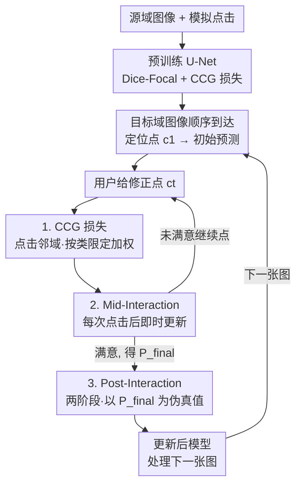

# You Point, I Learn: Online Adaptation of Interactive Segmentation Models for Handling Distribution Shifts in Medical Imaging

**会议**: ICLR 2026  
**OpenReview**: [https://openreview.net/forum?id=n0vHjCiLD2](https://openreview.net/forum?id=n0vHjCiLD2)  
**代码**: https://github.com/WenTXuL/OAIMS （有）  
**领域**: 医学图像 / 交互式分割 / 在线自适应  
**关键词**: 交互式分割, 分布偏移, 在线学习, 伪标签, 医学图像

## 一句话总结
针对医学图像部署后训练/测试分布不一致的问题，本文把交互式分割中"用户点完后的最终预测"当作伪真值，设计了一套精简的在线自适应框架 OAIMS（Post-Interaction + Mid-Interaction 两种更新 + Click-Centered Gaussian 损失），在 5 个眼底库与 4 个脑 MRI 库上一致超过现有方法，脑 MRI 上 Dice 提升超 10%。

## 研究背景与动机
**领域现状**：医学图像分割的自动模型在训练分布上表现很好，但临床部署时图像往往来自不同扫描仪、不同病理、不同模态，分布偏移会让自动模型性能严重下降。交互式分割（用户用点击/涂画/框来引导模型）天然能借助人类先验，临床医生即便面对没见过的分布也能给出靠谱的标注，因此交互范式很适合用来对抗分布偏移。SAM、MedSAM、Med-SA 这类模型把点击编码进 Transformer，DeepIGeoS、ICNN 则把点击编码成额外输入通道。

**现有痛点**：上述交互模型只是"用点击改善当前预测"，**没有机制把用户的修正反过来更新模型参数**——下一张图来了还是同样的错误起点。少数做在线自适应的工作（IA+SA、TSCA）确实会更新参数，但它们用稀疏交叉熵/focal 损失，**只在被点击的那几个像素上算损失**，忽略了点击周围的大片区域；为了防止在这几个像素上过拟合，又得加额外正则项，平白增加超参数和复杂度。

**核心矛盾**：点击其实承载的信息远不止那一个像素——它隐含了"这一片区域应该是某个类"。只在点击像素上优化，既浪费了周围监督信号，又容易过拟合到极少数标注点。

**本文目标**：设计一套实用、精简、低延迟的在线自适应方法，既能在部署前训练时增强模型对点击的响应，又能在部署后用用户修正持续适配新分布。

**切入角度**：作者的关键观察是——在真实交互流程里，用户一路点击修正到满意为止，**最终那张分割掩码质量已经足够好，完全可以当作这张图的伪真值**。既然有了伪真值，就不必依赖复杂正则，直接拿它做监督即可。

**核心 idea**：把"用户修正后的最终预测"当伪真值，配合一个只作用于点击邻域、且按类限定的高斯加权损失（CCG），在"每次点击之后"和"整张图修完之后"两个时机更新模型参数。

## 方法详解

### 整体框架
方法称为 **OAIMS**（Online Adaptation for Interactive Medical-image Segmentation）。骨干是一个改造过的 U-Net，输入除了图像 $I$ 还拼接两张引导图 $G_{fg}$、$G_{bg}$（前景/背景点击经高斯平滑、归一化到 $[0,1]$ 的通道）。整条流程分三个阶段：**部署前预训练**用模拟点击 + Dice-Focal + CCG 损失把模型练得对点击敏感；**部署后推理**时图像 $\{I_1,\dots,I_N\}$ 顺序到达，对每张图用户先给一个定位点 $c_1$ 触发初始预测，再迭代给修正点直到满意，得到最终掩码 $P_{final}=P_T$；在这个过程中插入两种在线自适应——**Mid-Interaction（MI）** 在每次点击后立刻更新一次参数，**Post-Interaction（PI）** 在整张图修完后再做两阶段更新。两种自适应共享同一个 CCG 损失，都把模型自己的某个预测当伪真值，不引入任何人工额外标注。

### 关键设计

**1. Click-Centered Gaussian（CCG）损失：把点击的监督信号铺到邻域，又不越界**

这是全文的核心，专治"只在点击像素上算损失导致浪费信号 + 过拟合"。一个点击 $c$ 落在像素 $(i',j')$、类别为 $y_{i',j'}\in\{0,1\}$，CCG 不是只罚这一个像素，而是给点击周围一圈像素都加监督，权重按到点击的距离做高斯衰减：

$$G_c(i,j)=\exp\!\Big(-\tfrac{(i-i')^2+(j-j')^2}{2\sigma^2}\Big),\quad |i-i'|\le 3\sigma,\ |j-j'|\le 3\sigma$$

超出 $3\sigma$ 截断为 0。关键的第二个机制是**按类限定**：用指示函数 $I_c(i,j)$ 只对"真值里和点击同类"的邻域像素算损失——给一个前景点，只罚周围那些真值为前景的像素。完整损失为

$$\mathcal{L}_{CCG}=\frac{\sum_{c\in C}\sum_{i,j}G_c(i,j)\,I_c(i,j)\,\mathrm{CE}\big(\hat P(i,j),P(i,j)\big)}{|C|\,HW}$$

其中 $P$ 是真值（预训练时）或伪真值（自适应时）。为什么不对邻域所有像素都算？作者的解释是：一个点击只意味着"把周围像素改成它自己这一类"，它并不提供"周围另一类像素该怎么分"的信息；如果硬给另一类像素也加惩罚，模型会过拟合到具体区域/图像，在分布偏移和在线学习时反而掉点。这个"高斯加权 + 按类限定"的双机制是 CCG 区别于以往稀疏点损失的根本所在，且它在预训练、MI、PI 三个阶段统一复用。

**2. Post-Interaction 自适应：把修完的最终掩码当伪真值，两阶段补课**

针对"用户改完就丢了、信息没回灌进模型"的痛点。核心假设是 $P_{final}$ 质量已"足够好"，可作伪真值（实践中只需在用户确认满意的图上做自适应即可保证）。由于交互总是从一个定位点开始，作者顺势把更新拆成两阶段。**阶段一**只喂定位点 $c_1$ 得到 $P_1=f(I,c_1,\theta)$，用 Dice-Focal 损失 $\mathcal{L}_{DF}=(1-\alpha)\mathcal{L}_D+\alpha\mathcal{L}_F$ 把 $P_1$ 拉向 $P_{final}$，**只做一次梯度更新**——目的是提升模型在新数据上"第一眼"的定位能力。**阶段二**要提升模型利用修正点的能力，但不能复用用户原来的修正点 $C_T$（那会让输出和 $P_{final}$ 完全一样、梯度归零），于是作者**对比阶段一输出 $P_1$ 与 $P_{final}$，在假阳/假阴的每个连通区域各自动生成一个人工修正点**（最多 $T$ 个，无需人工），喂进去得 $\hat P$，再用 CCG + Dice-Focal 联合损失 $\mathcal{L}_{total}=\mathcal{L}_{DF}+\beta\mathcal{L}_{CCG}$ 把 $\hat P$ 拉向 $P_{final}$。整套只需两次反向传播，却比需要十几次反传的旧方法更好。

**3. Mid-Interaction 自适应：每次点击当场学，让伪真值越改越准**

PI 是修完才学，MI 则在交互途中、每点一次就更新一次，好处是更新后的参数立刻决定下一步预测，**既改善后续图像，也改善当前这张图**——进而让 $P_T$ 质量更高，反过来强化后面的 PI，两者互补。机制上同样用"修正后的预测当伪真值"：设 $P_{t-1}=f(I,C_{t-1},\theta_{t-1})$，新点击 $c_t$ 到来后得 $P_t^{initial}=f(I,C_t,\theta_{t-1})$，然后用 CCG + Dice-Focal（同 Eq. 5）惩罚 $P_{t-1}$ 与 $P_t^{initial}$ 的差异——**把 $P_t^{initial}$ 当伪真值、$P_{t-1}$ 当预测**，相当于用"多了一个点击 $c_t$ 后的新状态"去监督"旧状态"。更新到 $\theta_t$ 后再算 $P_t=f(I,C_t,\theta_t)$ 展示给用户、并作为下一轮预测。由于早期迭代的伪真值并不完美，CCG 在这里尤为重要：它把学习聚焦在点击附近——最可信、最有价值的区域——避免模型从粗糙伪真值的边缘错误中学坏。注意此处 CCG 只施加在最新的点击 $c_t$ 上，且作用不是"增强响应"（因为 $c_t$ 没被用来生成 $P_{t-1}$），而是约束学习区域。

### 损失函数 / 训练策略
预训练用 Dice-Focal + CCG（Dice 与 Focal 配合处理医学图像前/背景像素极不平衡）。自适应阶段：PI 阶段一仅 Dice-Focal、阶段二 Dice-Focal + $\beta\mathcal{L}_{CCG}$；MI 用 Dice-Focal + $\beta\mathcal{L}_{CCG}$。超参 $\alpha=0.7$、$\beta=200$、$\sigma=3$。所有阶段更新全部模型参数，每张图/每次点击仅做一次梯度更新，延迟极低（A5000 上 MI 0.05s、PI 0.09s；即便 CPU 上 MI 0.25s、PI 0.41s）。

## 实验关键数据

数据集：眼底 5 库（REFUGE2、G1020、GS1-Drishti、GAMMA、PAPILA，多类分割 Cup/Disc）；脑 MRI 4 库（BRATS-Glioma、ATLAS-Stroke、WMH、TBI，按模态 Flair/T1/T1c/T2 视作不同分布，2D 最大病灶切片，多类合并为二分类）。每图默认 $T=10$ 次点击，报告第 1/5/10 次点击后的平均 Dice。对比 ICNN*（不自适应基线，用 CCG 预训练）、Med-SA（冻结的 SAM 类）、IA+SA、TSCA（在线自适应）。PI 为本文 Post-Interaction，PI+MI 为两者结合。

### 主实验

眼底（平均 Dice %，Disc/Cup，第 10 次点击）：

| 目标库（偏移） | 指标 | ICNN* | TSCA | PI | PI+MI |
|--------|------|------|------|------|------|
| G1020（大偏移） | Cup | 88.0 | 90.7 | 92.2 | **92.7** |
| PAPILA（大偏移） | Cup | 77.1 | 79.0 | 85.8 | **86.2** |
| GS1（小偏移） | Cup | 94.1 | 95.5 | 95.7 | **96.5** |

脑 MRI 模态偏移（Dice %，第 1/5/10 次点击）：

| 模态 | ICNN* | TSCA | PI | PI+MI |
|------|------|------|------|------|
| BRATS T1 | 20.7/46.8/62.5 | 34.4/60.9/74.0 | 61.1/72.4/78.9 | **71.2/83.4/88.0** |
| BRATS T1c | 45.4/63.8/75.4 | 50.1/70.2/79.6 | 64.3/74.7/80.4 | **70.4/82.9/87.5** |

可以看到偏移越大、点击越少时本文优势越明显：BRATS-T1 第 1 次点击 PI+MI 比 TSCA 高出 36.8 个点（71.2 vs 34.4）。单用 PI（两次反传）就已普遍超过需十几次反传的 TSCA。

### 消融实验
逐项拆解 PI/MI 中的损失项（Tab.5，BRATS-T1 第 10 次点击）：

| 配置 | BRATS T1 (10 clicks) | 说明 |
|------|------|------|
| 完整（MI 双损失 + PI 双损失 + S1） | **88.0** | 全套 |
| MI 去 CCG（仅 DF） | 48.9 | 暴跌 ~39 点，伪真值粗糙时 DF 会学坏 |
| 去掉整个 MI（仅 PI） | 78.9 | MI 在大偏移上贡献显著 |
| PI 阶段二仅 DF（去 CCG） | 76.8 | CCG 在 PI 也有用 |
| PI 仅阶段一 S1 | 67.9 | 阶段二的修正点学习不可或缺 |

CCG 设计消融（Tab.7）：去掉"按类限定"（no class）或把高斯换成均匀核（no gaussian），PI 与 PI+MI 在多数情形都掉点，证明"高斯加权 + 按类限定"双机制都必要。

### 关键发现
- **CCG 是稳压器**：在 BRATS-T1 这类边界模糊的肿瘤上，MI 只用 Dice-Focal 会因分割误差超出真实边界而学到错误信息；加 CCG 把学习收束到点击邻域可有效缓解。
- **PI 与 MI 互补**：MI 在 PI 之上加分；反过来在 5 点击预算下 PI 几乎处处提升，但 10 点击预算下 PI 的增益随交互增多而被 MI 覆盖、优势收窄（仅 WMH 仍受益）。作者建议两者一起用。
- **少点击鲁棒**：即便每图只允许 3 或 5 次修正、伪真值更糙，PI/PI+MI 仍显著超过冻结基线（Tab.4，ATLAS-T1 3 点击：PI+MI 73.3 vs TSCA 51.4）。
- Med-SA（冻结 SAM 类）多数情形反而差于基线 ICNN*，故未深入。

## 亮点与洞察
- **"最终预测即伪真值"这一观察很省事**：交互流程天然产出一个被用户认可的高质量掩码，直接拿来当监督，绕开了在线学习里"标注从哪来"的死结，也避免了复杂正则。
- **CCG 的"按类限定"是反直觉但关键的一笔**：常规做法会想"既然加权了就把邻域都算上"，作者反而论证只对同类像素算损失才不过拟合——这个细节在大分布偏移下尤其值钱。
- **两阶段 PI 里"自动生成修正点"很巧**：对比阶段一输出与 $P_{final}$ 的 FP/FN 连通域自动补点，既避免复用原点击导致梯度为零，又模拟了真实修正分布，全程零额外人工。
- **极低延迟 + 模型无关**：骨干可替换成别的架构，CPU 上更新也几乎无感，对真实临床工作流友好——这类"够轻能落地"的设计思路可迁移到其他需要部署后持续学习的交互系统。

## 局限与展望
- 自适应只针对部署后单一目标分布，不处理 Continual Learning 的灾难性遗忘——换一个新分布需重新适配。
- 伪真值的质量上限决定了学习效果，早期点击少时伪真值粗糙（虽然实验显示仍能学），若用户一开始就给得很差，效果存疑。
- MRI 实验在 2D 最大病灶切片上做，未验证完整 3D 体数据的在线自适应。
- 10 点击预算下 PI 的边际收益变小，说明两套机制存在重叠，如何按交互预算自适应地分配 PI/MI 的更新可进一步优化。

## 相关工作与启发
- **vs IA+SA / TSCA**：同为交互式分割的在线自适应，但它们仅在被点像素上用稀疏 CE/focal 损失、需额外正则防过拟合；本文用"最终掩码作伪真值 + CCG 邻域按类加权"，无需复杂正则，且只需 2 次反传就超过它们的十几次反传。
- **vs Med-SA / MedSAM / SAM**：这些用 Transformer 编码 prompt、推理时冻结，不从用户修正更新参数；本文骨干虽是轻量 U-Net，但因带在线自适应而在分布偏移下反超冻结的 SAM 类模型。
- **vs ICNN（Sakinis et al., 2019）**：沿用其"点击编码成前/背景引导图拼通道"的输入方式，但加上 CCG 预训练（ICNN*）并补齐了部署后自适应能力。

## 评分
- 新颖性: ⭐⭐⭐⭐ "最终预测当伪真值 + CCG 按类限定 + 双时机更新"组合清晰，CCG 的类限定机制有洞察。
- 实验充分度: ⭐⭐⭐⭐⭐ 9 个库、多模态/多病理、不同点击预算、延迟、逐项消融都覆盖到了。
- 写作质量: ⭐⭐⭐⭐ 动机推导顺，符号略多但方法讲得清楚。
- 价值: ⭐⭐⭐⭐ 低延迟、模型无关、对医学交互工作流可直接落地。

<!-- RELATED:START -->

## 相关论文

- [\[ICLR 2026\] Improving 2D Diffusion Models for 3D Medical Imaging with Inter-Slice Consistent Stochasticity](improving_2d_diffusion_models_for_3d_medical_imaging_with_inter-slice_consistent.md)
- [\[ICCV 2025\] MultiverSeg: Scalable Interactive Segmentation of Biomedical Imaging Datasets with In-Context Guidance](../../ICCV2025/medical_imaging/multiverseg_scalable_interactive_segmentation_of_biomedical_imaging_datasets_wit.md)
- [\[ICLR 2026\] Bridging Radiology and Pathology Foundation Models via Concept-Based Multimodal Co-Adaptation](bridging_radiology_and_pathology_foundation_models_via_concept-based_multimodal_.md)
- [\[ICLR 2026\] Joint Adaptation of Uni-modal Foundation Models for Multi-modal Alzheimer's Disease Diagnosis](joint_adaptation_of_uni-modal_foundation_models_for_multi-modal_alzheimers_disea.md)
- [\[CVPR 2025\] OpenMIBOOD: Open Medical Imaging Benchmarks for Out-Of-Distribution Detection](../../CVPR2025/medical_imaging/openmibood_open_medical_imaging_benchmarks_for_out-of-distribution_detection.md)

<!-- RELATED:END -->
