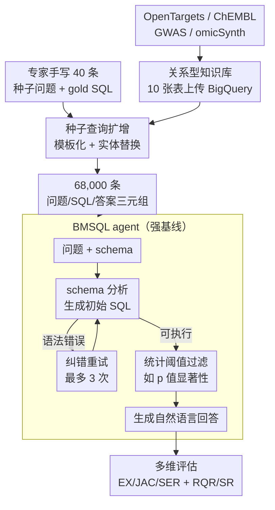

# BiomedSQL: Text-to-SQL for Scientific Reasoning on Biomedical Knowledge Bases

**会议**: ICLR 2026 (Gen2 Workshop)  
**arXiv**: [2505.20321](https://arxiv.org/abs/2505.20321)  
**代码**: [https://github.com/NIH-CARD/biomedsql](https://github.com/NIH-CARD/biomedsql)  
**领域**: 医疗NLP  
**关键词**: Text-to-SQL, 生物医学知识库, 科学推理, BigQuery, LLM评估

## 一句话总结
提出 BiomedSQL，首个专门评估 Text-to-SQL 系统在生物医学知识库上科学推理能力的基准，包含 68,000 个问题/SQL/答案三元组，揭示当前最强模型（GPT-o3-mini 62.6%）与领域专家（90%）之间仍有巨大差距。

## 研究背景与动机

现代生物医学研究日益依赖大规模结构化数据库，研究人员需要频繁查询电子健康记录、高通量实验数据和人群规模研究。自然语言接口（尤其是 Text-to-SQL 系统）有望让非技术研究人员也能访问这些资源。

**现有痛点**：当前的 Text-to-SQL 系统将查询生成视为"语法翻译"任务，将问题结构映射到 SQL 模板，缺乏对领域知识的深入理解。在生物医学场景下，这种抽象会失效——领域专家常问"哪些 SNP 与阿尔茨海默病显著相关？"或"哪些已批准药物靶向帕金森病中上调的基因？"，这些问题隐含了统计阈值（如 GWAS 显著性 p < 5×10⁻⁸）、药物审批流程和跨模态因果推理等领域特定知识。

**核心矛盾**：通用 Text-to-SQL 基准（如 Spider、BIRD）不评估科学推理能力；EHR 导向基准（如 EHRSQL）侧重时间逻辑和患者检索，而非科学发现所需的推理。

**切入角度**：构建首个专门评估生物医学领域 Text-to-SQL 科学推理能力的大规模基准。

## 方法详解

### 整体框架
BiomedSQL 要解决的是：通用 Text-to-SQL 把生成当成"语法翻译"，碰到生物医学问题里隐含的科学惯例（显著性阈值、药物审批状态、多组学因果）就失守，而现有基准又没法量化这种"科学推理"短板。它把科学推理灌进一条评测闭环——先离线把分散的生物医学数据源拼成一个能联合查询的关系型知识库，再让专家写少量种子查询、模板化扩增出 68,000 条带 ground-truth 的问答；评测时系统读问题加 schema、生成可执行 SQL、在 BigQuery 上跑出结果、据此产出自然语言回答，最后用 SQL 执行 + 回答质量两组指标打分。作者还配了一个模拟专家逐步查询的 BMSQL agent 作为强基线，把"问题→SQL"的单步范式换成"schema 分析→纠错重试→阈值过滤→生成回答"的多步流水线。

### 关键设计

**1. 关系型知识库：把分散的生物医学数据源拼成可联合查询的 schema**

基准要测的是科学推理，而非玩具表上的语法翻译，因此第一步是搭一个贴近真实研究的库。作者整合了 10 张核心表：基因-疾病-药物关联来自 OpenTargets Platform，生物活性分子和药理学数据来自 ChEMBL，再纳入阿尔茨海默病与帕金森病的 GWAS 统计摘要（含 p 值、rsID、等位基因频率等字段），以及 omicSynth 基于孟德尔随机化的多组学因果推理数据。所有表以 Parquet 格式上传到 Google BigQuery，让评测直接发生在生产级云数据仓库的真实方言上，而不是简化的本地 SQLite——这也意味着模型必须处理跨表 join 和领域特有字段语义，单纯套模板会失效。

**2. 种子查询扩增：用 40 条专家 SQL 撑起 68,000 条带 ground-truth 的问答**

高质量的 gold SQL 离不开专家，但人工标注无法规模化。作者让领域专家手写 40 个种子问题及其 gold-standard SQL，再通过模板化与实体替换（替换基因、疾病、药物等实体占位）把这 40 条自动扩展成 68,000 个问题/SQL/答案三元组；每条生成的 SQL 都在 BigQuery 上实际执行，取回执行结果作为 ground-truth。这样既保证了每条数据的可验证性，又让规模足以支撑细粒度的难度分层评测，同时每个问题都嵌入了专家查询里隐含的领域知识。问题还按所需推理类型分成三类，让基准能定位短板而非只看总分：一是操作化隐含科学惯例，需要模型自行补出 GWAS 显著性阈值（如 $p < 5\times10^{-8}$）、效应方向性等约定；二是整合缺失的上下文知识，需要补全药物审批状态、临床试验阶段等问题里没写的事实；三是执行复杂多跳推理，跨多张表串联关系操作。后续实验正是借这套分类发现 Join、相似度搜索与多重过滤类查询最难。

**3. BMSQL agent：把专家的迭代查询过程拆成可执行的多步流水线，作为强基线**

单步"问题进、SQL 出"的范式忽略了专家真实的试错过程，于是作者设计了迭代式的 BMSQL agent 模拟这一流程：先做 schema 分析锁定相关表和列，生成初始 SQL；若有语法错误则修正并重试（最多 3 次）；随后应用统计阈值过滤（如按 p 值显著性筛选），最后基于过滤前后两组执行结果生成自然语言回答，并可选地追加额外推理步骤（inference-time compute）。这条流水线把领域惯例（阈值过滤）和纠错显式拆成独立环节，使其在 EX 上比单步基线高出约 9 个点（GPT-o3-mini 从 53.5% 提到 62.6%）。

**4. 多维评估指标：SQL 执行与回答质量分开量**

由于一个问题可能有多条语义等价的 SQL，且最终交付给研究者的是自然语言答案，作者用两组指标分别度量。SQL 侧看执行结果精确匹配率 Execution Accuracy (EX)、结果集交并比 Jaccard Index (JAC) 和语法错误率 Syntax Error Rate (SER)；回答侧用 LLM-as-judge 的 BioScore，拆成衡量回答正确性的 Response Quality Rate (RQR) 与衡量是否给出危险/误导建议的 Safety Rate (SR)。两组指标互补，避免"SQL 跑通但回答失实"或"回答顺滑却 SQL 错误"被单一分数掩盖。

## 实验关键数据

### 主实验

| 模型 | EX↑ | JAC↑ | RQR↑ | SR↑ | SER↓ |
|------|-----|------|------|-----|------|
| 领域专家 | 90.0 | 90.0 | 95.0 | - | - |
| GPT-o3-mini | 53.5 | 60.4 | 73.3 | 29.4 | 0.0 |
| GPT-4o | 46.9 | 54.7 | 71.2 | 26.1 | 1.3 |
| Claude-3.7-sonnet | - | - | - | 43.0 | - |
| Qwen-2.5-Coder-32B | 40.8 | - | - | - | - |
| **BMSQL-GPT-o3-mini** | **62.6** | **69.2** | **83.1** | 38.0 | 2.6 |
| **BMSQL-Gemini** | - | - | **84.6** | - | - |

### 交互范式实验

| 方法 | EX↑ | JAC↑ | RQR↑ |
|------|-----|------|------|
| ReAct-GPT-o3-mini | 56.2 | 64.8 | 73.6 |
| Index-GPT-o3-mini | - | - | - (最高SR 66.9%) |
| BMSQL-GPT-o3-mini | 62.6 | 69.2 | 83.1 |

### 消融实验

| 配置 | 关键指标 | 说明 |
|------|---------|------|
| Combo prompt（3-rows+3-shot+stat-instruct） | EX +5.5%, RQR +4.5% | 但 token 消耗增加近 3 倍 |
| 1-pass vs 3-pass（推理时间计算） | EX 62.6→61.7, RQR 83.1→85.5 | 增加推理步数收益甚微 |
| 单独添加表格行示例 | 可忽略改进 | schema 理解 > 内容记忆 |

### 关键发现
- 最强模型 BMSQL-GPT-o3-mini 的 EX 仅 62.6%，距专家基准 90% 有约 30% 差距
- Join、Similarity Search 和 Multi-Filter 类查询最具挑战性
- 增加推理步数带来的改进极为有限，主要修正语法错误而非重构查询逻辑
- schema-level 理解比记忆原始数据行更重要
- 小模型 Qwen-2.5-Coder 在部分指标上超过参数量远大于它的 LLaMA 模型

## 亮点与洞察
- 首个专注于生物医学领域科学推理的 Text-to-SQL 基准，填补重要空白
- 68,000 个问题规模庞大，且每个问题都需要隐含的领域知识推理
- 多维评估体系设计合理（SQL 执行指标 + 自然语言回答质量）
- BMSQL 的多阶段设计模拟专家查询流程，效果显著优于单步方法
- 揭示了当前 LLM 在操作化领域特定科学惯例方面的重大不足
- 使用 BigQuery 模拟真实生产环境，增加了实际部署的相关性

## 局限与展望
- Gold SQL 并非唯一正确答案，可能存在多个语义等价的 SQL 表达
- 未评估 DIN-SQL、DAIL-SQL 等通用 Text-to-SQL 系统（与 BigQuery 方言不兼容）
- 依赖 BigQuery 云特定方言，限制了与其他基准的直接可比性
- 数据集通过模板扩展，可能引入系统性偏差
- 领域覆盖主要限于神经退行性疾病（阿尔茨海默和帕金森）

## 相关工作与启发
- 与 Spider、BIRD 等通用 Text-to-SQL 基准互补，专注科学推理维度
- 与 EHRSQL、MIMICSQL 等临床数据基准不同，面向科学知识发现而非患者检索
- 与 SciFact、EntailmentBank 等科学推理基准相关，但评估 SQL 生成能力
- 启发：可将类似方法推广到其他领域（如材料科学、环境科学）的知识库查询

## 评分
- 新颖性: ⭐⭐⭐⭐
- 实验充分度: ⭐⭐⭐⭐⭐
- 写作质量: ⭐⭐⭐⭐
- 价值: ⭐⭐⭐⭐

<!-- RELATED:START -->

## 相关论文

- [\[ICLR 2026\] MedAgentGym: A Scalable Agentic Training Environment for Code-Centric Reasoning in Biomedical Data Science](medagentgym_agentic_training_biomedical.md)
- [\[NeurIPS 2025\] CGBench: Benchmarking Language Model Scientific Reasoning for Clinical Genetics Research](../../NeurIPS2025/medical_nlp/cgbench_benchmarking_language_model_scientific_reasoning_for_clinical_genetics_r.md)
- [\[ACL 2026\] Text-Attributed Knowledge Graph Enrichment with Large Language Models for Medical Concept Representation](../../ACL2026/medical_nlp/text-attributed_knowledge_graph_enrichment_with_large_language_models_for_medica.md)
- [\[ACL 2025\] Query-driven Document-level Scientific Evidence Extraction from Biomedical Studies](../../ACL2025/medical_nlp/urca_biomedical_evidence_extraction.md)
- [\[NeurIPS 2025\] Mind the Gap: Aligning Knowledge Bases with User Needs to Enhance Mental Health Retrieval](../../NeurIPS2025/medical_nlp/mind_the_gap_aligning_knowledge_bases_with_user_needs_to_enhance_mental_health_r.md)

<!-- RELATED:END -->
