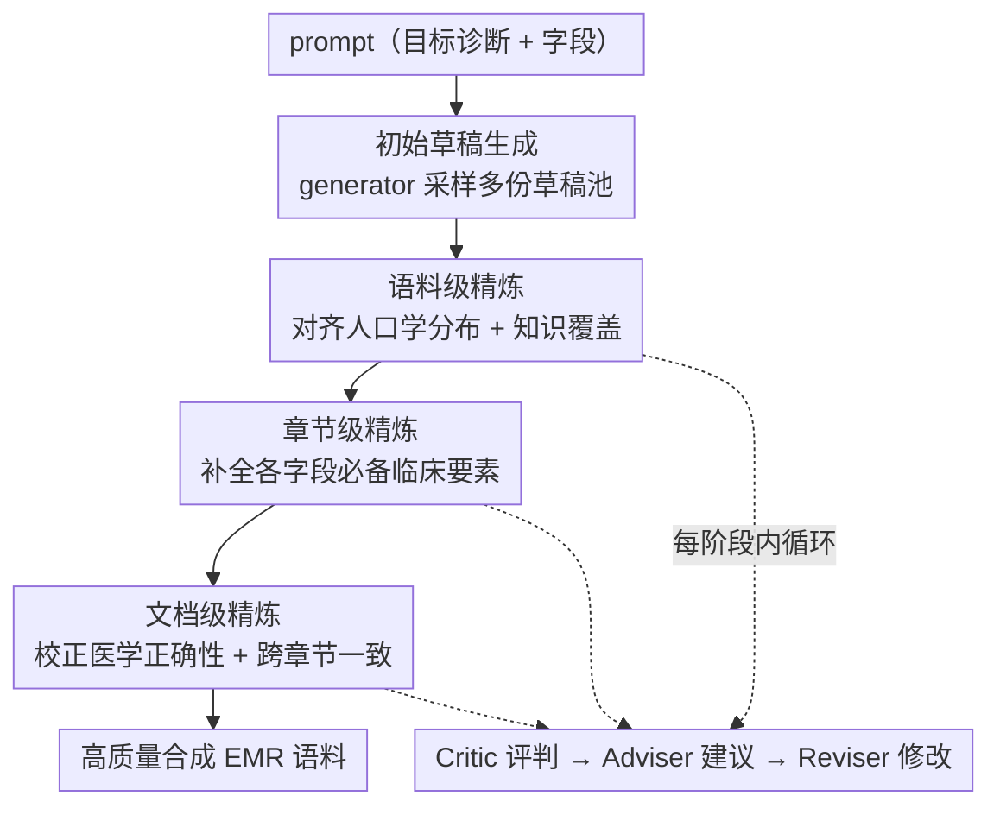

# Critic-Adviser-Reviser Cyclic Refinement: Towards High-Quality EMR Corpus Generation with LLMs

**会议**: ICLR 2026  
**OpenReview**: [https://openreview.net/forum?id=7y11BdJIOp](https://openreview.net/forum?id=7y11BdJIOp)  
**代码**: 无  
**领域**: 医学NLP / LLM多智能体 / 合成数据生成  
**关键词**: 电子病历合成, 循环精炼, 多智能体, 临床质量, 隐私保护

## 一句话总结
针对 LLM 直接生成电子病历（EMR）"只会模仿、分布失真、缺少质量约束"的问题，本文提出 LLM-CARe——一个按"语料→章节→文档"三级粒度、每级由 Critic/Adviser/Reviser 三个智能体循环精炼的框架，在完全不接触任何真实 EMR 文本的前提下，把合成病历的质量和下游临床任务表现都显著推到 SOTA 之上。

## 研究背景与动机
**领域现状**：电子病历是医疗研究的宝贵资源，但患者隐私限制了真实病历的开放共享，于是"合成 EMR"成为热门替代方案。早期路线是 GAN（从噪声或诊断码生成）和自回归模型（RNN/Transformer 把病历当 token 序列建模），近来则流行直接 prompt 大模型来写病历。

**现有痛点**：几乎所有现有方法都在做一件事——**模仿真实病历**（imitation）。GAN/自回归把病历当分布或序列拟合，LLM 方法则把真实病历当 in-context 示例去"照着写"。但真实病历本身就可能含有错误和遗漏，模仿策略会把这些缺陷原样继承进合成数据；而 LLM 直接生成又会暴露另一类毛病：作者的预实验发现 LLM 输出存在**分布偏置**（如不真实的性别比例）、并且只爱写某个疾病"最典型"的表现，缺乏对罕见或多样临床场景的覆盖。

**核心矛盾**：EMR 不是普通自由文本，它是专业医疗文档，可靠性取决于是否满足完整性、一致性、分布对齐等硬性质量要求。但"模仿真实文本"这个范式本质上**没有显式建模和强制这些质量标准**——它只追求"像"，不追求"对"。于是合成出来的病历可能看似逼真，对下游临床/研究应用却无用甚至误导。

**本文目标**：在不接触任何真实 EMR 文本（训练或 prompt 都不用）的前提下，生成同时满足语料级、章节级、文档级质量原则的高质量合成病历，并在真实下游临床任务上证明其效用。

**切入角度**：作者先把"什么叫高质量 EMR"拆成可显式检查的具体原则——跨三个层级的五条原则：人口学典型性、知识覆盖度（语料级）、内容完整性（章节级）、医学正确性、上下文一致性（文档级）。既然质量可以被逐条评判，那就可以被逐条精炼。

**核心 idea**：用"评判—建议—修改"的循环精炼（cyclic refinement）替代"一次性模仿生成"，并把精炼按粒度分阶段进行，从最宽松的语料级分布对齐，逐步收紧到最严格的文档级逻辑一致。

## 方法详解

### 整体框架
LLM-CARe 的输入是一段指定目标主诊断和所需病历字段（主诉、现病史等）的 prompt，输出是一批满足多级质量原则的合成 EMR。整个流程分两步走：先由一个 generator 智能体对每个 prompt 采样多份初始草稿，组成草稿池 $D^{(0)}=\{E^{(0)}_1,\dots,E^{(0)}_n\}$；这些草稿往往有遗漏、矛盾或临床不合理处，但作为后续精炼的起点。

随后草稿依次流过**三个精炼阶段**——语料（corpus）、章节（section）、文档（document）。每个阶段内部都是同一套"三智能体循环"：Critic 按本阶段目标评判草稿，Adviser 指出问题并给出具体改进策略，Reviser 据此更新草稿，反复迭代直到该粒度的质量达标，再把草稿交给下一阶段。三个阶段的**顺序是刻意设计的**：从最"软"（语料级分布对齐，不要求精确匹配）到最"硬"（文档级逻辑一致，错了会引入严重矛盾），由松到紧，让每一级在前一级基础上推进、同时把相互干扰降到最低。

### 关键设计

**1. 五条质量原则：把"好病历"拆成可逐条检查的标准**

本文不空谈"质量"，而是先把临床文档规范落成五条可显式校验的原则，分布在三个粒度上。语料级有两条：**人口学典型性**（年龄、性别等变量要符合真实人群分布）和**知识覆盖度**（语料要同时包含常见与罕见的临床情形）；章节级一条：**内容完整性**（每个字段都要含该类型应有的核心临床要素）；文档级两条：**医学正确性**（临床陈述在给定诊断下成立）和**上下文一致性**（各章节之间不自相矛盾）。每条原则进一步细化成可逐项打勾的 criteria（取自临床指南）。这一步是整个框架的地基——正因为质量被拆成离散、可判定的标准，后面的 Critic 才有明确的评判依据，Adviser 才能给出针对性的修改方向，否则"精炼"就无从下手。

**2. 三智能体循环：用"评判—建议—修改"取代一次性生成**

每个阶段内部由 Critic、Adviser、Reviser 协同迭代。Critic 负责评判：在语料级它度量当前语料 $D^{(t)}$ 相对参考分布 $T_d$（从训练集聚合统计得到，如年龄/性别分布、症状/用药等临床概念频次）在某属性 $c_{corpus,k}$ 上的偏差 $\delta^{(t)}_{corpus,k}=M^{corpus}_{critic}(D^{(t)},T_d,c_{corpus,k})$；在章节级和文档级则输出二值判断（criterion 是否满足，$\delta\in\{0,1\}$）。Adviser 负责诊断与开方：它解读 Critic 的反馈，在语料级挑出"改动后最能缩小分布失配"的记录子集 $S^{(t)}_k$ 并生成可操作反馈 $F^{(t)}_{corpus,k}$，在章节/文档级则针对未满足的 criterion 给出"具体该补哪些临床要素、改哪个章节"的指令。Reviser 负责执行：把 Adviser 的指令落到选中的记录或章节上，如 $S^{(t+1)}_k=M^{corpus}_{reviser}(S^{(t)}_k,F^{(t)}_{corpus,k})$，在保留既有内容与连贯性的前提下增补或修正。消融实验证明三者缺一不可——去掉 Critic（Adviser 对所有 criteria 无差别提反馈）或去掉 Reviser（退化成让 generator 拿着全部 criteria 重新生成）掉点最严重，恰恰说明"准确评判当前草稿"和"在已有草稿上迭代修改"这两件事是高质量的关键，单步生成满足不了所有质量约束。

**3. 阶段化由松到紧的排序：让精炼互不破坏**

三个阶段为什么是"语料→章节→文档"这个固定顺序而不是任意排列？因为不同粒度的修改会相互影响：语料级精炼很"软"，只求分布大致对齐、不要求精确匹配，所以放最前面先做；文档级精炼最"硬"，要强制跨章节的严格逻辑一致，一旦出错就是严重的临床矛盾，所以放最后压轴。按这个由松到紧的顺序推进，每一级都在前一级的成果上继续打磨，又不会因为后做宽松调整而把先前确立的严格一致性破坏掉。分阶段分析（Figure 7）也印证了这点：各质量维度在其对应阶段提升最明显（如完整性在章节阶段跃升），即便中途有暂时波动，最终所有维度都明显超过直接生成。

### 一个完整示例
以生成一份"肺炎"病历为例走一遍流程：generator 先按 prompt（主诊断=肺炎，字段=主诉/现病史/住院经过/出院医嘱等）采样出若干份初始草稿，但这批草稿的性别比例偏离真实人群、且都写成最典型的咳嗽发热表现。**语料阶段**：Critic 算出当前语料在性别分布、症状覆盖上的偏差，Adviser 挑出"改了最能拉回分布"的一批记录并建议增补罕见呈现，Reviser 据此改写这批记录，让整体分布向真实统计靠拢。**章节阶段**：Critic 逐字段检查，发现"住院经过"缺少治疗反应这一必备要素（$\delta=0$），Adviser 指明该补什么，Reviser 在保持原文连贯的同时补全。**文档阶段**：Critic 发现"现病史"写了无发热、但"住院经过"却提到退热治疗，存在跨章节矛盾，Adviser 建议改动影响较小的那一节来恢复一致，Reviser 据此调和。三阶段走完，得到一份分布合理、字段完整、逻辑自洽的合成病历。

## 实验关键数据

数据集为一份真实世界 EMR，含 192k 条记录、覆盖 302 种疾病，去标识化后按疾病类别做 8:2 分层切分。所有 LLM 方法骨干为 Qwen2.5-7B-Instruct，质量评判用 Qwen2.5-32B-Instruct，下游任务微调 Qwen2.5-0.5B-Instruct。

### 主实验

五条质量原则上的得分（%，越高越好）。关键看点：本文**全程不依赖真实 EMR 文本**（"Rely on EMR Text"列为 ×），却在每一项上都领先：

| 方法 | 依赖真实文本 | 内容完整性 | 医学正确性 | 上下文一致性 | 人口学典型性 | 知识覆盖度 |
|------|:---:|:---:|:---:|:---:|:---:|:---:|
| LSTM | ✓ | 70.8 | 65.0 | 21.7 | 93.3 | 70.4 |
| mtGAN | ✓ | 55.8 | 51.8 | 21.4 | 93.6 | 76.3 |
| MedSyn | ✓ | 84.8 | 95.3 | 91.9 | 84.1 | 84.5 |
| LLM Direct | ✗ | 77.1 | 90.7 | 87.9 | 77.7 | 73.9 |
| Self-Refine | ✗ | 78.3 | 90.9 | 88.5 | 77.7 | 78.0 |
| **LLM-CARe（本文）** | ✗ | **91.2** | **98.6** | **93.8** | **96.8** | **94.1** |

下游临床任务准确率（%），三个任务分别是诊断预测、检查推荐、治疗推荐：

| 方法 | 依赖真实文本 | 诊断 Micro | 诊断 Macro | 检查 Micro | 检查 Macro | 治疗 Micro | 治疗 Macro |
|------|:---:|:---:|:---:|:---:|:---:|:---:|:---:|
| mtGAN | ✓ | 81.9 | 80.9 | 72.4 | 73.4 | 58.6 | 52.9 |
| MedSyn | ✓ | 81.7 | 81.7 | 82.9 | 82.2 | 74.5 | 71.3 |
| LLM Direct | ✗ | 81.8 | 81.8 | 64.4 | 65.4 | 60.9 | 59.0 |
| Self-Refine | ✗ | 81.9 | 81.8 | 64.9 | 65.7 | 63.1 | 61.3 |
| **LLM-CARe（本文）** | ✗ | **82.6** | **82.4** | **85.3** | **85.2** | **76.9** | **74.1** |

### 消融实验

逐一移除三个智能体（Figure 8），观察质量与下游任务掉点：

| 配置 | 影响 | 说明 |
|------|------|------|
| Full（LLM-CARe） | — | 完整三智能体循环 |
| w/o Critic | 掉点最严重 | Adviser 对所有 criteria 无差别提反馈，失去精准评判 |
| w/o Reviser | 掉点最严重 | 退化成 generator 拿全部 criteria 重新生成，无法在草稿上迭代 |
| w/o Adviser | 明显掉点 | Reviser 只拿到"哪条不满足"的高层信息、缺少可操作建议 |

### 关键发现
- **Critic 和 Reviser 是命门**：去掉这两者掉点最大，说明"准确评判当前草稿"+"在已有草稿上迭代修改"是质量来源；大模型在单步生成里无法同时满足所有质量约束，这正是循环精炼存在的理由。
- **具体反馈胜过抽象标准**：去掉 Adviser 也明显掉点，证明"该补哪个临床要素"这种可操作建议比"哪条 criterion 不满足"的抽象输入更能指导有效修改。
- **模仿范式会继承缺陷**：MedSyn 在"住院经过完整性"等criteria上甚至不如 LLM Direct——它把真实病历当 in-context 示例，真实病历的遗漏被传染进合成数据，反向印证了"显式建模质量"比"模仿"更可靠。
- **骨干无关、且无法被预训练替代**：在 LLaMA3.1-8B、医学预训练的 Meditron3-8B、推理型 R1-Distill-Llama-8B 上，LLM-CARe 都能把质量从 ~50 提到 76–80；即便 Meditron 专门做过医学预训练、R1 擅长推理，直接生成仍达不到要求，说明原则驱动的精炼不能被预训练或推理能力替代。
- **不靠真实文本也不吃亏**：给初始 generator 喂一份真实 EMR 作参考的变体，性能与原版几乎持平（Figure 9），说明效果来自结构化的多智能体循环精炼，而非真实文本泄漏。

## 亮点与洞察
- **把"质量"工程化**：先把抽象的"高质量病历"拆成五条跨粒度、可逐项打勾的临床原则，是整个框架能闭环的前提——只有质量可判定，精炼才有抓手。这套"先定义可检查原则、再循环修复"的思路可迁移到任何对输出有硬性规范的生成任务（合同、代码、结构化报告）。
- **由松到紧的阶段排序**很巧妙：先做不破坏全局的软对齐、最后做一旦出错就致命的硬一致，避免后续宽松调整推翻先前严格约束，是多目标精炼里很值得借鉴的"调度"经验。
- **零真实文本的隐私友好性**：训练和 prompt 都不碰真实病历，却在下游任务上反超那些用真实文本的 baseline，这对隐私敏感的医疗场景是实打实的卖点。
- **Adviser 这个"中间层"**是亮点：不直接让 Critic 的判断喂给 Reviser，而是中间加一个把"哪里不对"翻译成"具体怎么改"的智能体，消融证明这层显著有效——评判与执行之间需要一个"开方"环节。

## 局限与展望
- 质量评判高度依赖 LLM-as-judge（Qwen2.5-32B）以及人工定义的 criteria，judge 本身的偏置和 criteria 覆盖度会影响结论可靠性；虽然作者用额外 LLM 复验，但根本上仍是"用模型评模型"。
- 实验集中在一个中文 EMR 数据集（192k/302 病种），跨语言、跨医院体系、跨更复杂病历结构的泛化性尚待验证（部分在附录用外部数据集补充）。
- 三阶段循环的多智能体精炼计算开销不小——每条记录要过多轮 Critic/Adviser/Reviser，论文未充分讨论生成成本与可扩展性。
- 五条原则与 criteria 取自临床指南并人工细化，迁移到新科室/新疾病时需要重新设计 criteria，自动化程度有待提升。

## 相关工作与启发
- **vs GAN/自回归方法（mtGAN、LSTM）**：它们把病历当分布或 token 序列拟合，擅长建模统计/时序模式，但完全不管临床质量，一致性得分极低（21 左右）；本文用原则驱动的精炼把一致性拉到 93.8。
- **vs MedSyn（模仿式 LLM）**：MedSyn 靠真实病历做 in-context 示例，会把真实数据的遗漏传染进合成数据、且有隐私风险；本文不碰真实文本，质量与下游全面反超。
- **vs Self-Refine（通用自我精炼）**：Self-Refine 在每轮里把所有质量要求一锅端地联合自评自改，相比 LLM Direct 只有微弱提升，证明"一刀切的全能修订"满足不了 EMR 的多级质量要求；本文的贡献正是把精炼按粒度拆开、各管一摊。

## 评分
- 新颖性: ⭐⭐⭐⭐ 把"质量原则化 + 分阶段三智能体循环精炼"用于 EMR 合成，框架清晰且有针对性，单个组件不算全新但组合与问题切入有新意。
- 实验充分度: ⭐⭐⭐⭐⭐ 质量五原则 + 三下游任务 + 多骨干 + 逐智能体消融 + 阶段分析 + 真实文本变体，覆盖很全。
- 写作质量: ⭐⭐⭐⭐ 动机与方法逻辑顺，公式与原则对应清楚，可读性好。
- 价值: ⭐⭐⭐⭐⭐ 零真实文本即可生成高质量、隐私安全的合成病历，对医疗 NLP 数据匮乏与隐私困境有实用价值。

<!-- RELATED:START -->

## 相关论文

- [\[ACL 2025\] Evaluation of LLMs in Medical Text Summarization: The Role of Vocabulary Adaptation in High OOV Settings](../../ACL2025/medical_nlp/evaluation_of_llms_in_medical_text_summarization_the_role_of_vocabulary_adaptati.md)
- [\[ACL 2025\] Enhancing Medical Dialogue Generation through Knowledge Refinement and Dynamic Prompt Adjustment](../../ACL2025/medical_nlp/enhancing_medical_dialogue_generation_through_knowledge_refinement_and_dynamic_p.md)
- [\[ICLR 2026\] Can SAEs Reveal and Mitigate Racial Biases of LLMs in Healthcare?](can_saes_reveal_and_mitigate_racial_biases_of_llms_in_healthcare.md)
- [\[ICLR 2026\] SimpleToM: Exposing the Gap between Explicit ToM Inference and Implicit ToM Application in LLMs](simpletom_exposing_the_gap_between_explicit_tom_inference_and_implicit_tom_appli.md)
- [\[NeurIPS 2025\] Demo: Guide-RAG: Evidence-Driven Corpus Curation for Retrieval-Augmented Generation in Long COVID](../../NeurIPS2025/medical_nlp/demo_guide-rag_evidence-driven_corpus_curation_for_retrieval-augmented_generatio.md)

<!-- RELATED:END -->
