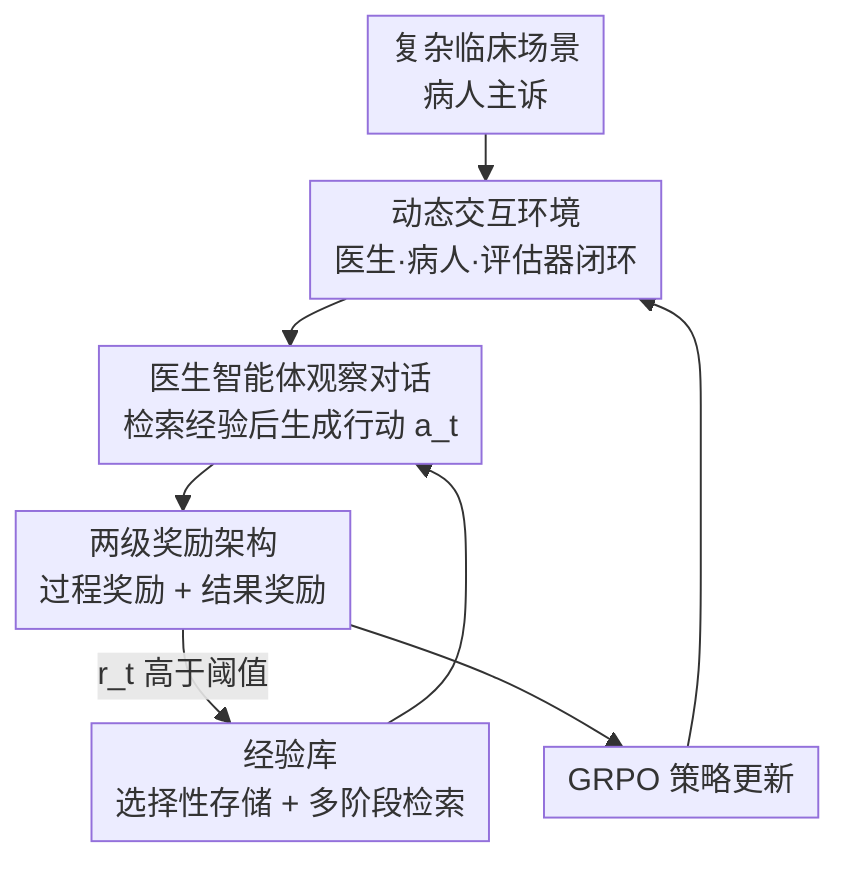

# Doctor-R1: Mastering Clinical Inquiry with Experiential Agentic Reinforcement Learning

**会议**: ICLR 2026  
**OpenReview**: [https://openreview.net/forum?id=vQGHTyL0Jw](https://openreview.net/forum?id=vQGHTyL0Jw)  
**代码**: https://github.com/thu-unicorn/Doctor-R1  
**领域**: 医学 NLP / Agent / 强化学习  
**关键词**: 临床问诊、Agentic RL、多目标奖励、经验库、GRPO

## 一句话总结
Doctor-R1 把门诊问诊建模成部分可观测的多轮决策过程，用「多智能体交互环境 + 两级奖励架构 + 经验库」做经验式 agentic 强化学习，让一个 8B 的医生智能体既会战略性、有同理心地追问，又能做对诊断，在 HealthBench / MAQuE 上反超 32B 开源模型和 GPT-4.1 等闭源大模型。

## 研究背景与动机
**领域现状**：医疗 LLM 这两年在静态考试上突飞猛进——GPT-4o、Med-PaLM 2 在 USMLE 这类标准化医考上已经超过人类专家，一批专科推理模型（HuatuoGPT-o1、UltraMedical、Baichuan-M2）和多智能体临床模拟也相继出现。

**现有痛点**：但「考得好」不等于「会看病」。真实门诊不是一道有标准答案的选择题，而是在信息不全、不确定的情况下逐步收集证据的动态过程。论文把这个过程称为 **Dynamic Inquiry（动态问诊）**：医生先形成鉴别诊断的假设，再用有针对性的提问逐步排除可能、并根据病人实时反应调整策略。现有模型在这件事上几乎全军覆没——会问一堆不痛不痒的泛泛问题（"有没有发烧/体重变化？"），却抓不住红旗症状；遇到急症又缺乏共情表达。

**核心矛盾**：一个好医生的专业性同时依赖两种能力——**做对决策的"硬技能"**和**战略性、共情式问诊的"软技能"**。现有训练范式（监督微调模仿、单轮对齐）只优化了前者，把问诊当成静态生成任务，根本没有在多轮交互中学习"问什么、怎么问、如何安抚"的机制。

**本文目标**：训练一个同时掌握软硬两种技能的医生智能体，让它能问出"高产出"的问题、做多轮战略性追问来引导诊断，并且在传达严重病情时表达共情。

**切入角度**：作者提出好医生智能体应满足三条原则——① 战略动态问诊；② 共情沟通；③ 从好经验中学习（像真实医生一样选择性复用过往高质量诊疗经验，而非单纯做相似度检索）。

**核心 idea**：把问诊建成部分可观测马尔可夫决策过程（POMDP），用 GRPO 在多智能体交互环境里做多轮 agentic RL；再用一个把软硬技能拆开评分的两级奖励，以及一个只存"好经验"的经验库，构成一个闭环的「经验式 agentic 强化学习」框架。

## 方法详解

### 整体框架
Doctor-R1 是一个**闭环的经验式强化学习训练系统**：输入是复杂临床场景（病人初始主诉），输出是训练好的医生智能体策略 $\pi_\theta$。整个交互循环按「环境 → 行动 → 评分 → 存经验 → 更新策略」运转。

具体一轮是这样转的：在 **动态交互环境** 里，一个 LLM 扮演的病人智能体被注入某个临床场景（定义了它的真实病情，即隐藏状态 $s$）。医生智能体 $\pi_\theta$ 观察当前对话历史 $o_t$，先去 **经验库** 检索一条最相关的"好经验"作为下一步提示，然后生成行动 $a_t$（一句追问或一个诊断结论）。病人智能体据此回应，更新观测 $o_{t+1}$。**问诊评估器（Consultation Evaluator）** 作为奖励函数，用 **两级奖励架构** 对这次行动打分 $r_t$；若得分够高（$r_t > \tau_{reward}$），这条三元组 $(s_t, a_t, r_t)$ 就被存进经验库。如此多轮，直到医生给出诊断或达到最大轮数，再用 GRPO 更新策略。

### 关键设计

**1. 动态交互环境：把门诊问诊形式化成 POMDP**

针对"现有模型把问诊当静态单轮任务"这个根本痛点，作者把诊疗过程建成部分可观测马尔可夫决策过程 $\langle S, A, O, R\rangle$：状态 $s$ 是病人的真实病情（医生看不到），动作 $a_t$ 是医生第 $t$ 轮说的话，观测 $o_t$ 是到第 $t$ 轮为止的对话历史，奖励 $R(s,a)$ 由问诊评估器给出。环境里有三个角色协同：医生智能体 $\pi_\theta(a_t|o_t)$ 是被训练的目标，要学到最大化累计奖励的最优问诊策略；病人智能体由一个独立 LLM 扮演，被注入临床场景后负责状态转移——它根据医生的提问动态生成回应，从而构造出高多样性、覆盖各种科室与急缓情形的训练环境；问诊评估器充当奖励函数。这套"医生—病人—评估器"的闭环，让医生能像真实出诊那样在多轮 rollout 里交互、学习、进化，而不是对着固定标签做模仿。

**2. 两级奖励架构：把"会聊"和"诊断对"拆成软硬两条信号**

单一标量奖励无法同时刻画准确、效率、共情这些目标，作者把奖励拆成过程奖励（软技能，逐轮给）和结果奖励（硬技能，终局给）。

过程奖励 $R_{turn}$ 在八个维度上评估每一轮回应：安全性、推理、医学准确、完整性、信息收集、对参考答案的忠实度、共情与清晰、谦逊（避免过度自信）。关键在于它不是简单加权和——加权和会因"平均化"效应淡化灾难性错误。作者用 **安全优先的分层否决（Hierarchical Veto）**：

$$R_{turn} = \begin{cases} -1.0 & \text{若 } S_{safety} < \epsilon \\ -0.75 & \text{否则若 } S_{reasoning} < \epsilon \text{ 或 } S_{accuracy} < \epsilon \\ \sum_{i=1}^{k} w_i \cdot S_i & \text{其余情况} \end{cases}$$

只要安全、推理或准确任何一项跌破失败阈值 $\epsilon$，立刻触发一个大负奖励、直接覆盖正常打分；没有违规时才取八维加权和。这种"否决层"思路对齐 Safe RL 里的屏蔽机制，保证临床可靠性是不可妥协的底线。

结果奖励 $R_{final} = S_{correctness}$ 在对话结束时按最终诊断与标准答案的吻合度打分：诊断正确 1.0、部分正确（如鉴别方向对但主诊断错）0.5、错误 0.0。两类奖励打分前都要求模型先生成一段推理 trace，让评分更一致。

**3. 经验库：只存"好经验"，多阶段检索把它喂回策略**

第三条原则是"从好经验学习"，但现有方法多是单纯相似度检索，检索到的不一定是高质量的。Doctor-R1 用一个三阶段检索流水线，在"低精度但快的 embedding"和"高精度但贵的 reranker"之间取平衡：

- **阶段 I 候选筛选**：把查询状态 $Q$ 和库内所有经验状态预计算成稠密向量，用一个把余弦相似度和历史奖励融合的组合分 $S_{combined}(Q, E_i) = f_{sim}(f_{emb}(Q), f_{emb}(E_i^{state})) + \alpha \cdot R(E_i)$ 取 top-$N$，把百万级经验库缩到可处理规模。
- **阶段 II 高保真重排**：用 cross-encoder 结构的 reranker 对每个 $(Q, E_i^{state})$ 对做 token 级注意力打分，比 bi-encoder 更准地重排候选。
- **阶段 III 新颖性与奖励过滤**：先算一个动态高奖励阈值 $\tau_{dynamic} = \mu_R(E_{cand}) + \beta_{std} \cdot \sigma_R(E_{cand})$（候选集奖励均值加若干倍标准差），一条经验被判为"好经验"当且仅当它对 $Q$ 的相似度低于新颖性阈值 $\tau_{novelty}$（防止反复检索高度雷同的经验）**且**奖励高于 $\tau_{dynamic}$。最终 top-$k$ 经验被前置到查询前面，给医生下一步动作直接的建议。

配套的 **选择性存储** 保证只有奖励达到边界 $\tau_{reward}$ 的交互才被存成 $(s_t, a_t, r_t)$ 三元组，内存缓存与 embedding 张量实时更新，长期保留高价值知识。

### 损失函数 / 训练策略
策略优化用 GRPO（Group Relative Policy Optimization）：不像 PPO 只用单个优势估计、也不像 DPO 只用一对 chosen/rejected，GRPO 用一组候选回应的奖励做 listwise 目标，让被选回应 $y_c$ 相对一组被拒回应的对数似然更高：

$$L_{GRPO} = -\mathbb{E}_{(x,y_c,\{y_r\})\sim D}\left[\log \frac{e^{R_\psi(x,y_c)}}{\sum_{y\in\{y_c\}\cup\{y_r\}} e^{R_\psi(x,y)}}\right]$$

这里 $R_\psi$ 就是问诊评估器（多目标奖励模型），$\pi_\theta$ 是医生智能体；通过把一个高质量动作和一组较差动作对比来更新策略。基座模型为 Qwen3-8B。

## 实验关键数据

### 主实验
评测主要在 HealthBench 和 MAQuE 两个复杂多轮临床基准上做，并在静态 QA 基准 MedQA / MMLU 上验证训练没有损害基础知识。HealthBench Main 从主题（急诊转诊、沟通等）和能力轴（准确、沟通质量、上下文感知等）两个维度评分。

| 模型 | 参数量 | HealthBench Avg. | Accuracy | Comm. Quality | Context Aware. |
|------|--------|------------------|----------|---------------|----------------|
| **DOCTOR-R1** | 8B | **36.29** | **37.84** | **64.15** | **49.24** |
| Baichuan-M2-32B | 32B | 33.16 | 33.95 | 58.01 | 46.80 |
| UltraMedical-70B | 70B | 26.38 | 32.60 | 50.62 | 45.49 |
| GPT-4.1 | 闭源 | 31.18 | 34.78 | 60.65 | 44.81 |
| Claude Sonnet 4 | 闭源 | 25.69 | 28.78 | 58.37 | 41.81 |
| Grok-4 | 闭源 | 33.03 | 37.95 | 61.35 | 45.62 |

8B 的 Doctor-R1 平均分反超 4 倍大的 Baichuan-M2-32B（36.29 vs. 33.16，+9.4%），也压过 GPT-4.1、Grok-4、Claude Sonnet 4 等闭源模型；在 MAQuE 上准确率与 GPT-4.1 持平，但共情分大幅领先（93.80 vs. 75.20）。相比 UltraMedical-70B，HealthBench +9.91、MAQuE +8.00。说明在这个任务上，「经验式 agentic RL 框架」比单纯堆模型规模更有效。

### 消融实验

| 配置 | HealthBench Avg. | 说明 |
|------|------------------|------|
| DOCTOR-R1（完整） | 36.29 | 完整框架 |
| w/o 过程奖励 | 32.61 | 去掉逐轮过程奖励，掉 3.68 |
| w/o 经验库 | 31.69 | 去掉经验库，掉 4.60 |
| Base (Qwen3-8B) | 25.13 | 未经训练的基座 |

### 关键发现
- 经验库贡献最大：去掉后掉 4.60 分，说明"从好经验学习"是软技能提升的主要来源；过程奖励次之（掉 3.68），主要影响沟通与上下文能力。
- 从基座 Qwen3-8B 的 25.13 一路涨到 36.29，整个框架带来 +11.16 的增益，且主要落在沟通质量（49.35→64.15）这类软技能轴上。
- 一个值得注意的结论：**提升问诊能力会反过来改善决策**——增强软技能后 Accuracy 也跟着涨（37.84，超过 GPT-4.1 的 34.78），软硬技能并非互斥而是相互促进。

## 亮点与洞察
- **分层否决的奖励设计很务实**：临床场景里"安全 > 平均得分高"，普通加权和会把一次危险建议平均掉，分层否决直接给灾难性错误一个压倒性的大负奖励，把"安全不可妥协"写进了奖励函数。这个思路可迁移到任何高风险决策的 RL 奖励设计。
- **经验库不是单纯相似检索，而是"相似 + 高奖励 + 新颖"三重过滤**：把强化学习的奖励信号注入检索，既保证检索到的是优质经验，又靠新颖性阈值避免反复看到雷同样本，比 RAG 式相似度检索更贴合"医生复用好经验"的直觉。
- **最 aha 的点**：8B 模型靠交互环境 + 经验复用反超 70B / 闭源模型，且"练软技能顺带提升硬技能"，说明对话式医疗任务的瓶颈不在知识量，而在动态决策与信息收集策略。

## 局限与展望
- 病人智能体由 LLM 模拟，环境的真实性受限于模拟病人的行为多样性与拟真度——模拟病人可能与真实门诊里非配合、表述含糊的病人有分布差异。
- 评估高度依赖 LLM-as-judge 式的问诊评估器（八维打分本身由模型给出），奖励信号的偏差可能被策略学进去；同理失败阈值 $\epsilon$、新颖性/奖励阈值等超参对结果敏感，论文把细节放在附录，正文难以判断其稳健性。
- 跨模型横向比较需谨慎：不同模型在 HealthBench 上的轮次预算、提示设置未必完全可比，绝对分数差不宜过度解读。
- 可改进方向：引入真实诊疗记录或人类反馈来校准模拟病人与评估器；探索经验库随训练规模增长后的检索效率与遗忘问题。

## 相关工作与启发
- **vs 静态医疗推理模型（HuatuoGPT-o1 / UltraMedical / Med-PaLM 2）**：它们在 USMLE 类静态考试上刷高分，但把问诊当单轮决策；Doctor-R1 把问诊建成多轮 POMDP 并用 RL 训练动态追问策略，优势在真实多轮场景，劣势是训练系统更复杂。
- **vs DoctorAgent-RL / 多智能体临床模拟**：同样用多智能体环境，但 Doctor-R1 的差异在两级奖励（软硬拆开）+ 经验库这套闭环；其在 HealthBench 上以 36.29 远超 DoctorAgent-RL 的 15.77。
- **vs 普通 RAG 式经验检索（相似度检索）**：传统做法只按语义相似度取历史样本，Doctor-R1 把历史奖励、动态高奖励阈值、新颖性过滤一起塞进检索，确保复用的是"高质量且不冗余"的经验。

## 评分
- 新颖性: ⭐⭐⭐⭐ 把 POMDP + 两级奖励 + 奖励感知经验库组合成医疗问诊的闭环 agentic RL，框架整合得有想法
- 实验充分度: ⭐⭐⭐⭐ 覆盖 HealthBench/MAQuE/MedQA/MMLU，含消融与人类专家评估，但部分关键超参细节藏在附录
- 写作质量: ⭐⭐⭐⭐ 三原则—三组件的对应清晰，公式与图配合到位
- 价值: ⭐⭐⭐⭐ 8B 反超 32B/闭源、且"软技能促硬技能"的结论对医疗对话智能体有实践指导意义

<!-- RELATED:START -->

## 相关论文

- [\[ACL 2026\] Dr. Assistant: Enhancing Clinical Diagnostic Inquiry via Structured Diagnostic Reasoning Data and Reinforcement Learning](../../ACL2026/medical_nlp/dr_assistant_enhancing_clinical_diagnostic_inquiry_via_structured_diagnostic_rea.md)
- [\[ACL 2026\] RADS: Reinforcement Learning-Based Sample Selection Improves Transfer Learning in Low-resource and Imbalanced Clinical Settings](../../ACL2026/medical_nlp/rads_reinforcement_learning-based_sample_selection_improves_transfer_learning_in.md)
- [\[ICLR 2026\] GALAX: Graph-Augmented Language Model for Explainable Reinforcement-Guided Subgraph Reasoning in Precision Medicine](galax_graph-augmented_language_model_for_explainable_reinforcement-guided_subgra.md)
- [\[ACL 2026\] CURE-Med: Curriculum-Informed Reinforcement Learning for Multilingual Medical Reasoning](../../ACL2026/medical_nlp/cure-med_curriculum-informed_reinforcement_learning_for_multilingual_medical_rea.md)
- [\[ACL 2026\] Eliciting Medical Reasoning with Knowledge-enhanced Data Synthesis: A Semi-Supervised Reinforcement Learning Approach](../../ACL2026/medical_nlp/eliciting_medical_reasoning_with_knowledge-enhanced_data_synthesis_a_semi-superv.md)

<!-- RELATED:END -->
