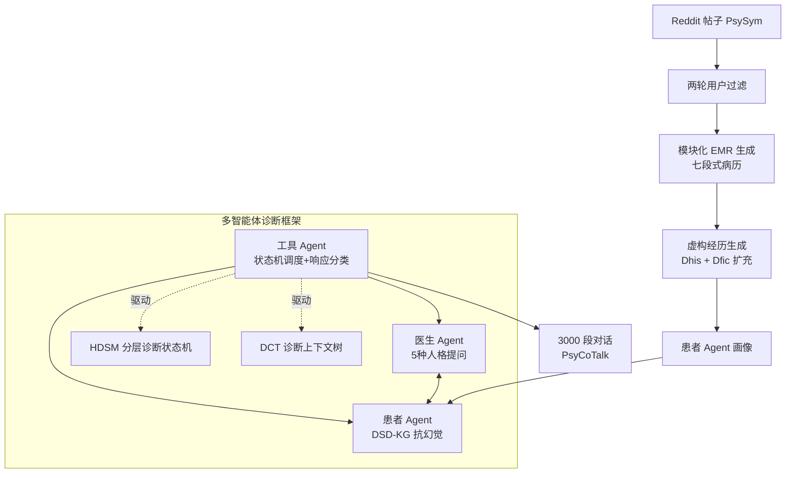

# From Medical Records to Diagnostic Dialogues: A Clinical-Grounded Approach and Dataset for Psychiatric Comorbidity

**会议**: ICLR 2026  
**OpenReview**: [https://openreview.net/forum?id=sWWAZVHtke](https://openreview.net/forum?id=sWWAZVHtke)  
**代码**: 待确认  
**领域**: 医疗 NLP / 精神科诊断对话 / 数据集  
**关键词**: 精神科共病, 诊断对话生成, 多智能体, 合成 EMR, SCID-5, 分层状态机  

## 一句话总结
本文提出一条「社交媒体帖子 → 结构化电子病历 → 多智能体诊断对话」的两阶段流水线，把 SCID-5 临床访谈协议改写成分层诊断状态机（HDSM）+ 诊断上下文树（DCT），构建出首个大规模精神科共病诊断对话数据集 PsyCoTalk（3,000 段多轮对话），并经执业精神科医生验证其临床真实性。

## 研究背景与动机
**领域现状**：精神疾病在全球造成超过 1.25 亿伤残调整生命年，而精神科共病（多个障碍共同出现）极为普遍——荷兰一项研究显示，67% 的抑郁症患者当前合并焦虑障碍、75% 终身合并焦虑障碍。共病显著增加了诊断与治疗的复杂度，需要医生在一次访谈中按 DSM-5 标准逐步推理、同时筛查多种障碍。

**现有痛点**：现有精神健康对话数据集绝大多数聚焦单一障碍（如 D4 只覆盖抑郁、PsyQA 是问答对），少数涉及多障碍的语料（如 MDD-5k）也把每种疾病孤立处理，缺乏细粒度标注，无法刻画症状共现与诊断过程中的症状演进。结果是 LLM 从未在「多障碍诊断」任务上被系统评测过，可靠的筛查系统也无从训练。

**核心矛盾**：训练一个会做共病诊断的对话模型，既需要**大规模、贴近真实分布的患者画像**（光靠 profile 太单薄，光靠 EMR 又无法刻画动态医患交互），又需要**结构化、临床合规的对话流程**来保证推理的真实性与有效性——两者缺一不可，而真实临床共病数据极度稀缺。

**本文目标**：构建一个既能驱动数据建模、又能系统评测诊断推理的大规模共病对话数据集，并提供一条可复现、可扩展、临床可信的生成流水线。

**核心 idea**：用「合成 EMR + 多智能体对话」两阶段解耦数据稀缺问题——**先把 Reddit 自述帖按七段式临床病历模板转成 502 份结构化 EMR**，再以 EMR 作为患者智能体的画像，**用一个把 SCID-5-RV 协议符号化为分层状态机的三智能体系统（医生/患者/工具）生成临床合规的多轮诊断对话**。

## 方法详解

### 整体框架
整套系统是两阶段流水线：阶段一把社交媒体帖子转换成结构化电子病历（PsyCoProfile，502 份），阶段二把每份 EMR 喂给一个三智能体诊断系统（医生 Agent、患者 Agent、工具 Agent），在符号化的 SCID-5 访谈框架下生成多轮对话，最终筛选出 3,000 段符合六种共病组合的对话构成 PsyCoTalk。整个对话流由工具 Agent 用「LLM + 规则」混合驱动，既保证临床流程的结构性，又保留自然语言的灵活性。

### 关键设计

**1. 模块化合成 EMR 生成：把碎片化帖子拼成临床标准病历。** 作者与精神科医生合作，将每份病历定义为七个标准组成部分（人口学信息、主诉、当前病情、既往史、个人史、家族史、初步诊断）。生成时不采用「一步聚合」而是**模块化分治**——因为分治在信息召回、分类准确度和推理连贯性上都优于一步生成。针对不同字段用不同策略：主诉与当前病情用症状/生活事件双分类器生成二元向量再交给 LLM 总结；既往史/个人史/家族史用关键词分类后分段送 LLM 推理；教育、职业、隐性年龄靠关键词检索 + 局部上下文裁剪；性别、婚姻、显性年龄则用预定义关键词规则直接抽取。底层数据选用 PsySym（5,624 名自述精神障碍的 Reddit 用户，人均 102.5 帖），并做两轮过滤——保留至少 10 条症状帖、20 种不同症状类型的用户，再用 DSM-5 对齐的疾病-症状图剔除症状-标签不一致者，最终得到 502 份覆盖四种核心障碍（MDD、AD、BD、ADHD）六种组合的 EMR。

**2. 虚构患者经历生成：用一对多扩充打破「一病历一对话」的单调。** EMR 提供事实信息但缺乏真实医患交互的叙事丰富度。作者提出基于结构化 EMR 的个性化虚构经历生成：与 MDD-5k 随机采样模板不同，本方法把采样内容与 EMR 属性对齐以避免语义冲突，并注入临床相关的生活方式属性。形式上，对每份 EMR 输入 $x_{\text{EMR}}$，先用 LLM 生成两个结构化字典——个人史字典 $D_{\text{his}}$（如「偏清淡饮食、偶尔抽烟喝酒、每周运动三次」）和虚构经历字典 $D_{\text{fic}}$（如「一年前被指责为公司项目失败的主因」），再从中组合生成自由文本叙述 $\tilde{e}$：

$$D_{\text{fic}}, D_{\text{his}} = \text{LLM}(\text{Prompt}(x_{\text{EMR}})), \quad \tilde{e} = \text{LLM}(\text{Prompt}(h, e)), \quad h \in D_{\text{his}},\ e \in D_{\text{fic}}$$

这种两阶段机制让每份 EMR 最多衍生 50 条独特虚构经历，在保持语义一致与诊断有效的前提下，大幅提升下游对话的多样性。

**3. HDSM 分层诊断状态机：把 SCID-5 协议变成可执行的诊断图。** 这是把临床访谈手册符号化的核心。HDSM 严格遵循 SCID-5-RV，为每种目标障碍（MDD/AD/BD/ADHD）分配一个子状态机，每个子状态机终止于互斥的诊断结果（如 MDD 的 depression1–depression5 五种诊断）。结构上是三级层次：高层状态（HLS，如当前发作筛查等总体模块）、中层状态（ILS，把相关症状归组，其中虚线表示的 sub-state group 聚合密切相关的问题做联合询问）、基本层状态（BLS，对应单个问题的终端节点，通常带时间约束）。问题分四类：情感/认知症状、生理/行为变化、功能损害/风险、共病/影响因素。两个工程化细节让对话既临床又自然：(i) **自然语言线索**——每个 sub-state group 只有首个问题用精确时间短语（如「过去两周」），后续改用「最近」之类宽松表述避免重复；(ii) **二元症状量表 + 流控制**——把 SCID-5 原本四级量表（unclear/absent/subthreshold/threshold）简化为「present/absent」二值。作者强调这不是丢弃严重度信息（严重度编码在节点和转移条件里，如「持续 ≥1 周」「是否影响学业/工作/社交功能」），而是因为早期实验中让 LLM 维持四级评分常产生矛盾输出、导致诊断死循环或非法转移，二值化反而更稳定可审计。当某组「present」回答数超过阈值（如 ≥5）则该组判为阳性走对应路径，否则触发替代转移。

**4. DCT 诊断上下文树 + 三智能体执行：补全背景信息并抑制幻觉。** DCT 是与 HDSM 并行的树状语义控制器，顶层三大分支为家族史、个人史、经历询问（Experience Inquiry）。其中经历询问节点在每轮末根据对话上下文动态触发，HDSM 完成后再随机顺序遍历剩余叶节点以保持自然流。三个智能体分工明确：**患者 Agent** 基于 EMR + 虚构经历 + 当前话题作答——为抑制「对所有症状都点头」的偏置，作者构建了源自 SCID-5 的疾病-症状描述知识图（DSD-KG），每个问题先查 DSD-KG，若症状不在 EMR 中或与初步诊断矛盾则回答「no」，过滤幻觉式附和；**医生 Agent** 设五种人格（年龄、专长、共情风格、话痨程度、诊断速度、解释频率各异），配合回复长度限制和轮换的共情短语池减少重复；**工具 Agent** 是中央控制器，负责「树管理」（`SubStateMachineOrderGen` 决定四个子状态机执行顺序、`ResponseClassifier` 把患者回答分类为 present/absent 触发状态转移、`NeedExpBranch` 决定是否进入经历询问分支）与「对话接口」（`BuildPrompt` 为医患双方生成对齐 prompt、`IsDialEnd` 在所有子状态机到达终态且上下文树必需节点遍历完后终止对话）。

## 实验关键数据

### 数据集对比（结构保真度）

| 数据集 | 医生平均字数 | 患者平均字数 | 平均轮数 | 障碍数 | 共病 | 对话数 |
|---|---|---|---|---|---|---|
| Real-World Dial | 28.3 | 35.8 | – | – | ✗ | – |
| D4 | 20.4 | 14.9 | 21.6 | 抑郁 | ✗ | 1,339 |
| MDD-5k | 91.1 | 162.8 | 26.8 | >25 | ✗ | 5,000 |
| **PsyCoTalk** | **34.0** | **43.5** | **45.9** | 4 | **✓** | 3,000 |

PsyCoTalk 是唯一支持共病的数据集，平均 45.9 轮近乎其他语料两倍；医患发言长度（34.0/43.5）最接近真实临床（28.3/35.8），而 MDD-5k 因发言过长偏离最大。

### 诊断准确度（exact-match，五种障碍全对）

| 模型/系统 | Subset Accuracy |
|---|---|
| Qwen2.5-72B 零样本 | 0.22 |
| **本文 HDSM 多智能体系统** | **0.31** (McNemar p=7e-6) |
| GPT-4o-mini / Deepseek-v3 | <0.1 |
| Qwen3-32B | <0.02 |
| Qwen3-8B | <0.04 |

逐标签 F1：MDD 0.92、AD 0.81、ADHD 0.64、BD 0.40——与临床趋势一致（BD/ADHD 因症状重叠、起病隐匿、异质性高而更难诊断）。

### 专家评估（6 维，10 分制）+ AB 真实性测试

| Prof. | Comm.(i) | Comm.(ii) | Flu.(i) | Flu.(ii) | Sim. |
|---|---|---|---|---|---|
| 7.72 | 8.14 | 8.24 | 7.42 | 6.79 | 6.67 |

AB 测试（判断「真实 vs AI 生成」，5 位执业精神科医生）：Real-World 6 分、PsyCoTalk 5 分、D4 4 分、MDD-5k 1 分。PsyCoTalk 仅次于真实数据，而 MDD-5k 因模板化重复得分最低。

### 关键发现
- 模块化 EMR 生成在信息召回、分类准确度、推理连贯性上全面优于一步聚合。
- 二元症状量表比四级量表更稳定可审计，避免了 LLM 维持细粒度评分时的诊断死循环。
- DSD-KG 知识图有效抑制了患者 Agent 的「症状全肯定」幻觉偏置。
- HDSM 引导把诊断准确度从 0.22 提升到 0.31（统计显著），且远超主流通用 LLM 的零样本表现。

## 亮点与洞察
- **临床协议符号化的范式**：把 SCID-5-RV 这种半结构化访谈手册拆成「分层状态机 + 上下文树」，让 LLM 的诊断流程既可控又临床合规，是把领域专家知识注入对话生成的优雅做法。
- **抓住共病这个真实临床痛点**：现有工作把疾病孤立处理，本文首次大规模刻画症状共现与多障碍单轮筛查，填补了真实空白。
- **二值化的务实工程权衡**：作者没有盲目追求高保真四级量表，而是从「LLM 实际能稳定维持什么」出发做简化，并把严重度信息下沉到状态转移条件——这种「为可审计性让步」的判断很有借鉴价值。
- **多重抗幻觉与多样性机制叠加**：DSD-KG 抑制患者附和、五种医生人格 + 一对多虚构经历提升多样性，体现了合成数据生成中对「真实感」的系统性把控。

## 局限与展望
- **障碍覆盖窄**：仅四种常见障碍及其共病，受限于临床可靠共病数据的稀缺，难以覆盖罕见病。
- **语言单一**：主数据集为中文（受专家评估约束），仅做了小规模英文生成实验，多语言适用性受限。
- **数据源偏差**：Reddit 自述帖可能带入人口学/文化偏斜（合成 EMR 年龄峰值 20-24 岁 vs 真实 30-34 岁，性别更均衡），尽管 EMR 模板与 SCID-5 框架本身语言/文化无关、可迁移到本地临床语料。
- **下游影响未充分量化**：尚未系统评测该数据集对模型诊断推理能力的训练增益，作者将此列为未来工作。

## 相关工作与启发
- **单障碍语料**：D4（1,339 段中文抑郁对话）、PsyQA（22,000 问答对，后扩为 SMILECHAT 55,000）、EFAQA（20,000 真实咨询）。
- **多障碍语料**：CED-BS（双相+精神分裂）、MDD-5k（迄今最大中文诊断语料，5,000 段、>25 种障碍，但仍孤立处理每种病、采用一对多策略）。
- **LLM 驱动对话模拟**：LLM-Empowered Chatbots（评测 ChatGPT 诊断共情）、Patient-Ψ（CBT 规则 + LLM 培训咨询师）、CPsyCoun（治疗笔记转可训练对话）、AMC 框架（医生/患者/督导三智能体 + 三级记忆）。本文的 HDSM-Agents 在 AMC 与 MDD-5k 神经符号控制器基础上，首次引入与权威访谈标准显式对齐的分层状态机 + 上下文树，并首次生成反映共病诊断推理的对话。
- **启发**：「把领域标准协议符号化为可执行控制器再驱动 LLM」是一条值得推广的合成数据范式，可迁移到其他需要严格流程合规的诊断/咨询场景（如全科问诊、法律咨询、客服合规）。

## 评分
- **新颖性**: ⭐⭐⭐⭐ — 首个大规模精神科共病诊断对话数据集，「SCID-5 协议符号化为 HDSM+DCT」的设计在合成临床对话领域具有原创性。
- **实验充分度**: ⭐⭐⭐ — 有客观结构对比、诊断准确度、5 位执业医生的 6 维主观评估和 AB 测试，较扎实；但下游训练增益未量化、英文实验仅小规模，留有缺口。
- **写作质量**: ⭐⭐⭐⭐ — 结构清晰、动机充分，图示（框架图 + MDD 子状态机）有效辅助理解符号化设计，工程权衡（二值化）的论证尤其透明。
- **价值**: ⭐⭐⭐⭐ — 填补共病诊断数据空白，提供可复现可扩展的生成流水线，对精神健康 LLM 训练与评测有直接资源价值。

<!-- RELATED:START -->

## 相关论文

- [\[ACL 2026\] PrinciplismQA: A Philosophy-Grounded Approach to Assessing LLM-Human Clinical Medical Ethics Alignment](../../ACL2026/medical_nlp/principlismqa_a_philosophy-grounded_approach_to_assessing_llm-human_clinical_med.md)
- [\[ICML 2026\] A Machine-Learned Comorbidity Index](../../ICML2026/medical_nlp/a_machine-learned_comorbidity_index.md)
- [\[ICLR 2026\] MedAraBench: Large-scale Arabic Medical Question Answering Dataset and Benchmark](medarabench_large-scale_arabic_medical_question_answering_dataset_and_benchmark.md)
- [\[ACL 2026\] Region-Grounded Report Generation for 3D Medical Imaging: A Fine-Grained Dataset and Graph-Enhanced Framework](../../ACL2026/medical_nlp/region-grounded_report_generation_for_3d_medical_imaging_a_fine-grained_dataset_.md)
- [\[ACL 2026\] Dr. Assistant: Enhancing Clinical Diagnostic Inquiry via Structured Diagnostic Reasoning Data and Reinforcement Learning](../../ACL2026/medical_nlp/dr_assistant_enhancing_clinical_diagnostic_inquiry_via_structured_diagnostic_rea.md)

<!-- RELATED:END -->
