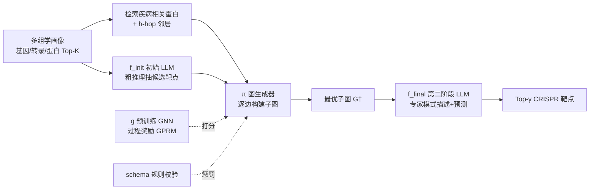

# GALAX: Graph-Augmented Language Model for Explainable Reinforcement-Guided Subgraph Reasoning in Precision Medicine

**会议**: ICLR 2026  
**OpenReview**: [https://openreview.net/forum?id=ADFXCeYXvR](https://openreview.net/forum?id=ADFXCeYXvR)  
**代码**: 待确认  
**领域**: 精准医疗 / 图增强 LLM / 强化学习  
**关键词**: 子图推理, 过程奖励模型, 多组学, CRISPR 靶点发现, GNN-LLM 融合  

## 一句话总结
GALAX 把预训练 GNN 当作"过程裁判"，用强化学习引导 LLM 一步步搭建疾病相关子图，从而在没有逐步标注的前提下，为精准医疗做出可解释、患者特异的癌症靶点预测。

## 研究背景与动机
- **领域现状**：精准医疗要找出驱动疾病的关键信号通路和治疗靶点，需要同时利用三类信息——定量多组学特征（基因组/转录组/蛋白组）、生物网络的拓扑结构、以及文献规模的文本知识。CRISPR 大规模敲除筛选提供了可靠的实验"金标准"靶点。
- **现有痛点**：传统差异表达/必需性打分无法建模分子网络的层级和跨模态依赖；图模型只擅长结局预测、缺少靶点优先排序所需的结构化监督；基于知识图谱的 RAG（RoG、SubgraphRAG、GNN-RAG、G-Retriever）只盯最终答案准确率，检索到的子图嘈杂、巨大、没有真值机制结构，而且**普遍丢掉了数值组学信号**，导致细胞系特异信息缺失。
- **核心矛盾**：过程奖励模型（PRM）本可对中间推理步骤做细粒度监督，但它有三大硬伤——步骤定义粗糙、中间正确性难验证、模型奖励容易被 reward hacking。在生物医学里这些问题被放大：多组学文本-数值图（TNG）根本没有逐步真值标注，生物通路组合爆炸让穷举规划/检索不现实。
- **本文目标**：在没有显式逐步标签的情况下，把数值组学、文本知识、生物拓扑统一到一个强化学习框架里，用子图推理作为连接"数值证据-拓扑知识-语言上下文"的桥梁，输出既准确又可解释的患者特异靶点。
- **核心 idea**：**用预训练 GNN 充当过程奖励来源**——让 GNN 对 LLM 逐步生成的部分信号子图打"生物合理性 + 癌症相关性"分，再叠加基于 schema 的规则校验，从而在无标注下实现过程级监督，把语言推理翻译成可解释的图构建。

## 方法详解

### 整体框架
GALAX 分两阶段：先用初始 LLM `f_init` 从多组学画像里粗略推理、抽出候选靶点；再由强化学习图生成器 `π` 在预训练图基础模型 `g` 的逐步奖励引导下增量搭建可解释子图 `G†`；最后第二阶段 LLM `f_final` 同时读"初始输出 + 生成子图"做精炼预测，子图 `G†` 本身就是透明的推理依据。整套数据底座是 TOSG（Text-Omic Signaling Graph），并配套 Target-QA 基准提供 CRISPR 真值监督。

### 关键设计
**1. TOSG 把三模态焊进一张图：让组学数值、文本、拓扑同处一个坐标系。** 作者构建 Text-Omic Signaling Graph $G = \{\mathcal{X}^{(0)}, \mathcal{T}, \mathcal{V}, \mathcal{E}\}$，节点分为启动子、基因、转录本、蛋白四类（$|\mathcal{V}| = m^{(pm)} + m^{(g)} + m^{(t)} + m^{(p)} = M$），每个样本的组学特征按四类拼接 $X_n^{(0)} = [x_n^{(pm)} \oplus x_n^{(g)} \oplus x_n^{(t)} \oplus x_n^{(p)}]$。图被拆成内部信号子图 $G^{(in)}$（沿中心法则 promoter→gene→transcript→protein 传播）和蛋白互作子图 $G^{(PPI)}$。这样既保留了 DepMap 的数值证据，又挂上了 BioMedGraphica 的文本描述和拓扑关系，为后续 GNN 和 LLM 提供同一份可对齐的输入。

**2. 双基础模型预训练：先把 GNN 训成"会判断癌症相关性"的裁判，把 LLM 训成"懂生物术语"的提案者。** 图侧用两阶段流程：第一阶段对 PPI 边做伯努利掩码 $\mathcal{E}_{mask} \sim \text{Bernoulli}(p)$，跨模态编码后做内部传播再做掩码全局传播，学到基因调控模式；第二阶段把预训练参数 $\theta_G^{pre}$ 迁移到下游分类器，用 $\hat{Y}^{(0)} = \arg\max_o \text{Softmax}[\text{MLP}_G(f_G(\cdot))]$ 预测疾病类型，最小化交叉熵。这个预训练 GNN 后续就成了过程奖励的"权威裁判"（实测疾病分类训练/测试准确率 99.46%/96.15%）。语言侧用生物医学语料预训练 LLaMA3-8B，让它先掌握蛋白互作、疾病-靶点关系的术语和结构。

**3. 把子图构建建模成逐边添加的强化学习：状态-动作-策略三件套全围绕"加一条边"。** 状态是当前图 $G_n^{(i)} = (V_n^{(i)}, E_n^{(i)})$，动作 $\Delta_n^{(i)} = (v_{src}^i, v_{tgt}^i)$ 在可行性掩码下添加一条边。策略先用消息传播模块得到节点嵌入 $X_n^{(i)} = \pi_{MSG}(G_n^{(i)}, X_n^{(cand)})$，再用两个带掩码的概率函数依次采样源点和目标点：$v_{src}^i \sim \pi_{SRC}(X_n^{(i)}, M_{SRC})$、$v_{tgt}^i \sim \pi_{TGT}(X_n^{(i)}, M_{TGT}; v_{src}^i)$，其中掩码 $M_{SRC}$ 限定源点只能选已在图里的节点、$M_{TGT}$ 排除源点本身。起始节点集 $V_n^{(start)}$ 按优先级选取：有疾病相关蛋白就取 Top-η，否则取初始候选 Top-η，再不行就从组学节点随机采样 η 个，候选集 $V_n^{(cand)} = V_n^{(init)} \cup V_n^{(sub)} \cup V_n^{(omic)}$。

**4. GPRM 过程奖励 = GNN 即时反馈 + rollout 未来模拟 + 规则惩罚，三项合一替代逐步标注。** 这是全文最核心的一招。每步奖励先看预训练分类器对当前子图给目标类 $o^\star$ 的概率，并用 L 次 rollout 模拟未来轨迹做前瞻：
$$R_n^{(i)} = g_{o^\star}(G_n^{(i+1)}) - \frac{1}{|O|} + \lambda \cdot \frac{1}{L}\sum_{\ell=1}^{L}\left(g_{o^\star}(\text{Rollout}_\ell(G_n^{(i+1)})) - \frac{1}{|O|}\right)$$
再叠加基于 BioMedGraphica 关系的规则项 $R_{rule}$ 惩罚违反 schema 的非法边，得到总奖励 $R_{total}^{(i)} = R_n^{(i)} + \lambda_{rule} \cdot R_{rule}(G_n^{(i+1)})$。采用贪心接受：仅当 $R_{total}^{(i)} > 0$ 才接受该边、更新状态。生成器用奖励加权交叉熵优化 $L_{step} = -R_{total}^{(i)}[\text{CE}(v_{src}^i, \pi_{SRC}) + \text{CE}(v_{tgt}^i, \pi_{TGT})]$，多次采样后保留最优子图 $G_n^\dagger$。这套设计巧妙地把"中间步骤对不对"的判断外包给一个独立训练好的 GNN，绕开了 PRM 需要人工逐步标注的死结。

**5. 子图回灌做最终答案：把图翻译成专家级文本提示，再微调 LLM 输出靶点。** 最优子图 $G_n^\dagger$ 经"专家模式"verbalize 成结构化文本，拼到原 query 后形成最终提示 $P_n^{(final)}$，第二阶段 LLM 按 $\xi_{\theta_{final}}(\hat{A}_n | Q_n, G_n^\dagger)$ 自回归生成 Top-γ 靶点，用 token 级交叉熵 $L_{final}$ 对齐真值。最后再用 NER 从输出里抽出预测蛋白集与参考靶点比对。子图既是监督信号也是可读的机制解释。

## 实验关键数据

### 主实验表格（Precision / Recall，节选）

| 模型 | Overall Prec ↑ | Overall Rec ↑ | LUAD Rec | BRCA Rec |
|------|---------------|---------------|----------|----------|
| M2T（纯多组学传统法） | 0.0016 | 0.0011 | 0.0014 | 0.0000 |
| L3-FT(QA)+Omics | 0.5250 | 0.4959 | 0.4905 | 0.4856 |
| G-Retriever+pre-GAT | 0.4763 | 0.3929 | 0.3881 | 0.3772 |
| RoG | 0.5248 | 0.4726 | 0.4562 | 0.4311 |
| SubgraphRAG | 0.5280 | 0.4617 | 0.4448 | 0.3917 |
| GNN-RAG | 0.5258 | 0.4735 | 0.5052 | 0.4389 |
| **GALAX** | **0.5472** | **0.5332** | 0.5157 | **0.5533** |
| GALAX (Qwen2.5-7B) | 0.5445 | 0.5405 | **0.5462** | 0.5206 |

- 数据集 Target-QA：363 个癌症细胞系 QA 对，80/20 划分，4 个随机种子；每条答案是 Top-100 CRISPR 优先靶点。
- GALAX 在 Recall 上提升最显著（Overall 比最强 RAG 基线 +6 个点左右），BRCA 上尤为突出。

### Hit@10 / Hit@5（节选）

| 模型 | Hit@10 ↑ | Hit@5 ↑ |
|------|----------|---------|
| L3-FT(QA)+Omics | 0.8693 | 0.8889 |
| RoG | 0.8450 | 0.8593 |
| SubgraphRAG | 0.8476 | 0.8624 |
| GNN-RAG | 0.8323 | 0.8656 |
| **GALAX** | 0.8815 | **0.9249** |
| GALAX (Qwen2.5-7B) | **0.8841** | 0.9079 |

### 消融实验表格（语言轴 × 图轴）

| 配置 | 作用 | 结果 |
|------|------|------|
| L3+Omics | 未任务微调的 LLaMA3 | 很弱 |
| L3-FT(Med)+Omics | 生物医学文本域适配 | 小幅提升 |
| L3-FT(QA)+Omics | Target-QA 任务微调 | **质变**（性能阶跃） |
| +KG（静态知识图谱） | 直接拼 KG | 几乎不升甚至下降 |
| G-Retriever+pre-GAT | 预训练 GAT 检索子图 | 不稳定（百万级节点难抽相关子图） |
| **+RL（GALAX 完整体）** | 强化引导子图构建 | 每项指标再涨约 2%–5% |

### 关键发现
- **任务自适应微调是性能分水岭**：L3-FT(QA) 相比域微调直接从 ~1% 跳到 ~52%，说明 QA 形式的监督比单纯灌生物文本更关键。
- **静态拼接 KG 反而有害**：直接把知识图谱塞给 LLM 几乎不涨甚至掉点，印证了"嘈杂大子图 + 无机制真值"的检索范式不可靠。
- **强化引导的过程级子图构建才是增量来源**：在 QA 微调基础上加 RL，跨数据集稳定 +2%–5%，验证了"GNN 当过程裁判"路线优于所有图增强 RAG 基线。
- **复杂度可控**：GALAX 训练/推理复杂度 $O(\kappa + M\varepsilon + M^2\varepsilon)$，与 RoG/GNN-RAG 同量级；因候选数 $\eta \ll M$，图嵌入项主导 RL 奖励成本。

## 亮点与洞察
- **把 PRM 的死结一刀切开**：PRM 三大痛点（步骤难定义、中间难验证、奖励易 hacking）的根源都是"缺逐步真值"。GALAX 用一个**独立预训练、目标明确（疾病分类）的 GNN**当裁判，既给出可验证的中间信号，又因为裁判是固定的而难被策略 hacking，是个很漂亮的工程解。
- **可解释性是"副产品"而非"后处理"**：子图 $G†$ 既是推理过程、又是监督对象、还是给人看的机制解释，三位一体，不像事后归因那样和决策脱钩。
- **多模态融合落到实处**：数值组学没有被丢弃（这正是它批评 RAG 系的点），而是和文本、拓扑一起进 TOSG，保住了细胞系特异信息。
- **rollout 前瞻 + 贪心接受**：每步既看即时分类增益又模拟未来轨迹，避免短视地加边，同时贪心接受保证单调改进。

## 局限与展望
- **数据规模偏小**：Target-QA 只有 363 个 QA 对、预训练 336 样本，且任务被简化成二分类（|O|=2）、只用 1-hop 邻居，泛化到更多癌种和更深拓扑还需验证。
- **裁判 GNN 的天花板就是系统天花板**：过程奖励完全依赖预训练 GNN 的判断（边预测 AUC 仅 64.4%），裁判本身的偏差会被强化学习放大。
- **依赖外部组件较多**：NER 用 GPT-4o-mini、整合工具用 BioMedGraphica、文本嵌入用 BioBERT，链路长、可复现成本高，任一环节漂移都可能影响结果。
- **奖励超参敏感性未充分探讨**：$\lambda$、$\lambda_{rule}$、rollout 深度 L、η 等都按经验取值（多为等权或固定），缺乏系统的敏感性分析。
- **临床落地距离**：CRISPR 细胞系靶点与真实患者治疗响应之间仍有 gap，"可解释子图"的生物学正确性还需湿实验验证。

## 相关工作与启发
- **图增强 RAG 系**（RoG、SubgraphRAG、GNN-RAG、G-Retriever）：GALAX 的直接对手，区别在于它们只优化最终答案、靠子图检索，而 GALAX 主动**生成**子图并对过程打分。
- **过程奖励模型 / 大推理模型**（PRM、StepGRPO、RLHF/PPO/GRPO）：GALAX 继承了"过程级监督"思想，但把奖励来源从人工/模型标注换成预训练 GNN + 规则，规避了 reward hacking。
- **多组学 GNN**（MOGONET、MoGCN）：提供了图结构推理用于癌症分型的先例，但它们只做结局预测、不做可解释靶点优先排序。
- **启发**：对任何"缺逐步真值但有结局标签"的推理任务，都可以考虑**训练一个独立的结局分类器当过程裁判**，把昂贵的逐步标注问题转化为奖励设计问题——这套范式不止适用于生物医学。

## 评分
- **新颖性**: ⭐⭐⭐⭐⭐ 用预训练 GNN 作为过程奖励来源、绕开 PRM 逐步标注难题的思路新颖且自洽，是 GNN-LLM-RL 三者融合的一个有机方案。
- **实验充分度**: ⭐⭐⭐ 消融沿语言/图两轴拆解得很清楚、复杂度分析到位，但数据集规模偏小、任务被简化为二分类，缺奖励超参敏感性分析。
- **写作质量**: ⭐⭐⭐⭐ 问题动机层层递进、公式记号严谨，图 3 工作流清晰；但记号密度高、附录依赖重，初读门槛偏高。
- **价值**: ⭐⭐⭐⭐ 为精准医疗的可解释靶点发现提供了一条"生成式 + 过程监督"的新路径，配套 Target-QA 基准也有复用价值。

<!-- RELATED:START -->

## 相关论文

- [\[ICLR 2026\] Knowledgeable Language Models as Black-Box Optimizers for Personalized Medicine](knowledgeable_language_models_as_black-box_optimizers_for_personalized_medicine.md)
- [\[AAAI 2026\] MIRAGE: Scaling Test-Time Inference with Parallel Graph-Retrieval-Augmented Reasoning Chains](../../AAAI2026/medical_nlp/mirage_scaling_test-time_inference_with_parallel_graph-retrieval-augmented_reaso.md)
- [\[ICLR 2026\] mCLM: A Modular Chemical Language Model that Generates Functional and Makeable Molecules](mclm_a_modular_chemical_language_model_that_generates_functional_and_makeable_mo.md)
- [\[ICLR 2026\] Doctor-R1: Mastering Clinical Inquiry with Experiential Agentic Reinforcement Learning](doctor-r1_mastering_clinical_inquiry_with_experiential_agentic_reinforcement_lea.md)
- [\[NeurIPS 2025\] CGBench: Benchmarking Language Model Scientific Reasoning for Clinical Genetics Research](../../NeurIPS2025/medical_nlp/cgbench_benchmarking_language_model_scientific_reasoning_for_clinical_genetics_r.md)

<!-- RELATED:END -->
