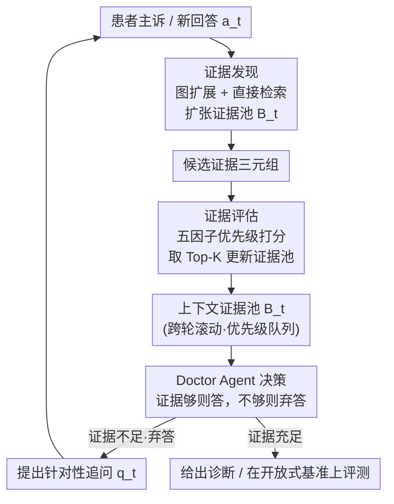

# KnowGuard: Knowledge-Driven Abstention for Multi-Round Clinical Reasoning

**会议**: ICLR 2026  
**OpenReview**: [https://openreview.net/forum?id=gQRefH8upx](https://openreview.net/forum?id=gQRefH8upx)  
**代码**: https://github.com/IcecreamArtist/KnowGuard  
**领域**: 医学NLP / LLM Agent / 知识图谱 / 临床推理  
**关键词**: 弃答(abstention)、多轮临床问诊、医学知识图谱、证据池、安全性

## 一句话总结
针对 LLM 在临床多轮问诊中"信息不全也敢下诊断"的过度自信问题，KnowGuard 提出"先调查再弃答"(investigate-before-abstain)范式：把弃答决策从依赖模型自评，改成在一张医学知识图谱上跨轮系统性地探索证据，用一个滚动更新的上下文证据池判断"还缺什么证据"，从而决定该继续追问还是给出诊断；在自建的开放式多轮基准上平均诊断准确率提升 3.93%、平均仅 5.74 轮即收敛。

## 研究背景与动机
**领域现状**：把 LLM 用作"医生 agent"做临床问诊已成趋势。真实诊断中患者初始主诉往往残缺、含糊，需要医生多轮追问逐步补全信息。此时一个关键的安全机制叫**弃答(abstention)**——在证据不足时拒绝下结论、转而继续追问，而不是硬给一个可能致命的误诊。

**现有痛点**：现有弃答方法几乎都依赖模型对自己的"自评置信度"——让 LLM 打个 1-5 的置信分、做二元判断或细粒度评级，低于阈值才弃答。但 LLM 天生过度自信且有"选择支持偏差"：一旦给出初始答案，即使遇到矛盾证据也会维持虚假的确定性，推理微调后的医疗 agent 这个毛病更严重。另一类做法（如长上下文检索整篇医学文档）虽引入外部信息，却是粗粒度的，无法精确定位"到底缺哪条证据"，反而造成信息过载。

**核心矛盾**：弃答的本质是要识别**知识边界**——判断"当前已掌握的信息是否足以支撑可靠诊断"。但纯靠模型自评相当于反复问"我有多自信"，而不是问"我具体还缺哪条证据"；前者无外部可验证依据，注定不可靠。

**本文目标**：用外部、结构化、可验证的医学知识来为弃答决策"接地"，并且要在多轮设置下保持探索的一致性、随新患者信息动态调整。

**切入角度**：知识图谱天然组织了医学实体之间的关系（症状—疾病—药物—副作用…），既能支持结构化的多跳推理，又能把"知识边界"具象成"图上还有哪些相关三元组没被覆盖"，比检索整段文本更适合精准定位证据缺口。

**核心 idea**：把"先自评再弃答"换成"**先调查再弃答**"——在知识图谱上跨轮系统探索证据，用知识冲突/覆盖不足作为不确定性信号，证据足了才回答，不足就继续有针对性地追问。

## 方法详解

### 整体框架
KnowGuard 把多轮临床弃答形式化为一个交互式问诊过程：**Patient Agent** 持有完整患者信息 $K=\{k_0,k_1,\dots,k_n\}$，只在被问到时如实披露相关子集；**Doctor Agent** 初始只拿到主诉 $k_0$，在每一轮 $t$ 要做一个二元弃答决策 $A_t:K_t\to\{0,1\}$——$A_t=0$ 表示信息不足、继续追问，$A_t=1$ 表示证据已足、给出诊断。核心难点是找到最优停止点：既要 $K_t$ 含足够证据保证诊断可靠，又要尽量少问几轮。

整个系统围绕一个**上下文证据池** $B_t$（一个知识三元组的优先级队列）运转，它**跨轮累积**：不在新一轮重新开始，而是在已有发现基础上吸收新患者回答 $a_t$ 继续扩展。每一轮证据池都经过两个互补阶段处理——**证据发现阶段**根据新患者信息系统性地扩张 $B_t$，**证据评估阶段**用多因子打分调整探索优先级；最终 Doctor Agent 综合证据池与患者上下文做弃答决策，若弃答则提出针对性问题 $q_t$，患者回答后进入下一轮。

### 关键设计

**1. Investigate-before-abstain 范式与跨轮上下文证据池：把弃答从"自评"换成"图上证据探索"**

这一设计直接针对"模型自评不可靠、过度自信"的根本痛点。传统方法在不确定时问的是"我有多自信"，KnowGuard 改成问"我具体还缺哪条证据"，并把答案落在外部知识图谱上。实现的载体是一个有界优先级队列形式的上下文证据池 $B_t=\{(h_i,r_i,t_i,p_i)\}_{i=1}^{|B_t|}$，每个元素是一条带优先级 $p_i$ 的医学三元组（一个潜在推理步）。它最关键的性质是**跨轮累积、滚动更新**：新一轮患者信息 $a_t$ 到来时，系统在旧证据基础上继续探索而非重启，因此推理路径在多轮间保持一致；同时证据池有界（保留 top-$K$）使得在庞大医学知识空间里仍能高效排序与选择，把探索聚焦在最有希望的知识路径上。最终弃答决策为 $A_t=\text{LLM}_{\text{doctor}}(K_t,B_t,\{x_{\text{text}},x_{\text{img}}\})$，模型同时拿到当前患者信息、排名靠前的证据三元组及其多模态内容来判断。

**2. 证据发现阶段：图扩展 + 直接检索双策略系统性补证据**

针对"长上下文检索粒度太粗、定位不到具体缺口"的痛点，证据发现阶段用两条互补路径在图上做结构化探索。**图扩展检索**沿当前高优先级候选里的实体向外一跳，找出所有相连三元组：$T_{\text{exp}}=\{(h,r,t)\in G: h\in E_{B_t}\ \text{or}\ t\in E_{B_t}\}$，其中 $E_{B_t}$ 是当前证据三元组里出现的实体——这保证新证据顺着已有推理路径自然延伸。**直接检索**则先用 LLM 根据当前患者回答 $a_t$ 生成查询，再在全图做一次检索：$T_{\text{query}}=\text{GraphRetrieval}(G,\text{LLM}_{\text{query}}(a_t))$，负责把患者新信息引入的、与现有路径不直接相连的相关知识拉进来。两者合并 $T_{\text{candidates}}=T_{\text{exp}}\cup T_{\text{query}}$ 送入评估阶段打分。一个"延伸已知 + 引入新知"的组合，正好对应多轮问诊里"顺着线索深挖"与"患者抛出新症状"两种情形。

**3. 证据评估阶段：五因子优先级打分定位可靠证据**

发现来的候选证据良莠不齐，评估阶段用五个互补因子算综合优先级，决定哪些证据进证据池、谁排前面。① **嵌入相似度（硬相关）**$s_{\text{sim}}=\cos(\text{Embed}(h,r,t),\text{Embed}(a_t))$ 衡量语义贴合；② **LLM 相关性（软相关）**$s_{\text{rel}}=\text{LLM}_{\text{rel}}(a_t,(h,r,t))$ 衡量临床相关，双重验证兼顾语义与临床对齐；③ **图一致性**$s_{\text{coh}}=\text{count}_B(h)+\text{count}_B(t)$ 用实体在整段对话所有证据池里的累计出现频次，奖励连向"常被访问实体"的三元组，从而沿既有推理通路系统推进、而非随机游走；④ **患者人群推理(PPR)**：先从对话历史推断患者人群 $P_t=\text{LLM}_{\text{demo}}(K_t,C_{\text{pop}})$（如青少年），属于该人群子图的三元组获得加权 $s_{\text{pop}}=\alpha\ (\alpha>1)$ 否则为 1；⑤ **轮次衰减**：用指数衰减平衡历史与当前 $p_{t+1}=p_t\times(1-w_{\text{decay}})+p_{\text{new}}\times w_{\text{decay}}$，让近期证据更突出。最终优先级把前四类加权聚合再乘人群权重：

$$p_{\text{final}}(h,r,t)=(w_{\text{sim}}\cdot s_{\text{sim}}+w_{\text{rel}}\cdot s_{\text{rel}}+w_{\text{coh}}\cdot s_{\text{coh}})\times s_{\text{pop}}$$

证据池据此保留 $B_{t+1}=\text{Top-}K(T_{\text{candidates}},p_{\text{final}})$，每条再附上来源文本与文档页图像等多模态证据。这套多因子打分让"哪条证据值得信、缺口在哪"有了可计算、可解释的依据，而不是一个黑箱置信分。

**4. 开放式多轮临床基准与多模态医学知识图谱：让弃答可被真实评测、有图可查**

弃答能力要在贴近真实问诊的开放式场景下评，而现有临床 QA 多是选择题、约束了回答空间、测不出真实弃答行为。为此作者把 MEDQA、CRAFT-MD、AFRIMEDQA 三个数据集转成交互式多轮格式（记为 ioMEDQA / ioCRAFT-MD / ioAFRIMEDQA），把病历解析为 age、gender、主诉与若干原子事实，初始只给 Doctor Agent 年龄/性别/主诉，逼它主动追问；并用 **LLM-as-judge** 把闭式题转成开放式评测——对原选择题，judge 在不看题干和正确项的情况下把自由文本预测匹配到最相似选项 $A_{\text{matched}}=\text{Judge}(A_{\text{pred}},\{\text{option}_i\})$；对原开放题则做二元匹配 $\text{Match}=\text{Judge}(A_{\text{pred}},A_{\text{true}})\in\{\text{Yes},\text{No}\}$。配套的知识图谱由 300+ WHO 指南构建，含 2.2 万节点、超 10 万边，每条三元组带来源文本与文档页图像（多模态），子图按指南标题/摘要标注人群与疾病特征以支持 PPR，并有月度爬虫自动抓取新指南保持更新。整个基准共 3,061 个 case，是方法能被公平评测的基础设施。

## 实验关键数据

所有实验以 GPT-4 作为核心 agent，主指标为准确率 ACC、期望校准误差 ECE、Brier 分数与平均对话轮数(avg. Turn)。

### 主实验
基础设置下（无 rationale / self-consistency 增强），KnowGuard 在三个数据集上全面领先；相比最强的置信度类方法平均提升约 1.07 个百分点(5.64%)，比 Long Context 平均高 10.29%，且 ECE/Brier 显著更低、轮数适中。

| 数据集 | 方法 | ACC | Turn | ECE | Brier |
|--------|------|-----|------|-----|-------|
| ioAFRIMEDQA | Scale Rating | 63.06 | 5.11 | 0.141 | 0.285 |
| ioAFRIMEDQA | **KnowGuard** | **68.70** | 5.26 | **0.050** | **0.236** |
| ioMEDQA | Scale Rating | 64.23 | 5.15 | 0.135 | 0.260 |
| ioMEDQA | **KnowGuard** | **70.98** | 5.41 | **0.065** | **0.219** |
| ioCRAFT-MD | Scale Rating | 65.40 | 4.83 | 0.136 | 0.261 |
| ioCRAFT-MD | **KnowGuard** | **66.47** | 4.89 | **0.050** | **0.216** |

在 rationale + self-consistency 增强设置下优势进一步扩大（平均提升 1.20 / 8.65%），KnowGuard 三数据集 ACC 分别达 73.20 / 74.12 / 71.96。与校准类方法对比中（Temperature Scaling、Conformal Abstention），后者过度保守、几乎每次都拖到 12 轮上限，ACC 仅 0.687/0.715/0.692 左右，而 KnowGuard 以更少轮数(5.30/5.40/6.51)取得更高准确率(0.732/0.741/0.720)。

### 消融实验
在增强设置上逐步关闭组件（以 ioAFRIMEDQA / ioMEDQA / ioCRAFT-MD 的 ACC 报告）：

| 配置 | ioAFRIMEDQA | ioMEDQA | ioCRAFT-MD | 说明 |
|------|-------------|---------|------------|------|
| Full（KG+Eval+PPR） | 73.20 | 74.12 | 71.96 | 完整模型 |
| w/o PPR | 72.60 | 74.29 | 71.92 | 去人群推理，精度基本持平但轮数变多(5.30→7.03) |
| w/o Eval & PPR | 66.22 | 70.66 | 68.92 | 去证据评估，三数据集大幅掉点 |
| 仅文本证据(no KG) | 66.02 | 64.79 | 62.73 | 用文本替代多模态 KG 三元组，再掉 |
| 纯基线(无外部证据) | 63.06 | 64.23 | 65.40 | 退化为自评式弃答 |

### 关键发现
- **证据评估阶段贡献最大**：去掉 Eval（连带 PPR）后三数据集 ACC 从 ~73 跌到 66/70/69，是掉点最猛的一环——说明"会找证据"还不够，"能给证据排序、定位可靠证据"才是系统性弃答的关键。
- **多模态 KG 优于纯文本**：用结构化 KG 三元组替换文本证据带来明显提升，验证了结构化医学知识对弃答的价值。
- **PPR 主要省轮数而非提精度**：去掉 PPR 后准确率几乎不变，但平均轮数从 5.30 涨到 7.03，说明人群推理的作用是更快聚焦到相关知识区域、减少无效追问。
- **超参不敏感**：五因子权重(最优 $w_{\text{sim}}{=}0.2,w_{\text{rel}}{=}0.6,w_{\text{coh}}{=}0.35,w_{\text{decay}}{=}0.5,w_{\text{pop}}{=}1.15$)在大范围扰动下表现稳定，方法鲁棒。

## 亮点与洞察
- **把"我有多自信"重构成"我还缺哪条证据"**：这是全文最"啊哈"的视角转换——弃答的不可靠根源是自评，作者用图上的证据覆盖/冲突替代主观置信，给了一个外部可验证的锚点。
- **跨轮证据池当优先级队列用**：证据不在每轮重置而是滚动累积+衰减，既保证多轮推理一致性，又能随新症状动态调整，是把"多轮一致性"工程化的巧妙载体，可迁移到任何需要跨轮维护状态的 agent 任务。
- **图扩展 vs 直接检索的分工**：一个顺着已知线索深挖、一个为患者新信息开新口子，恰好映射真实问诊的两种推进方式，比"一把梭检索整篇文档"精准得多。
- **开放式多轮基准 + LLM-as-judge** 本身是可复用的评测基础设施，把闭式 QA 转成能真正测弃答行为的开放式交互。

## 局限与展望
- **强依赖 GPT-4 与外部知识图谱质量**：所有实验只用 GPT-4，且证据全部接地在 WHO 指南构建的 KG 上；换更弱模型、或图谱覆盖不到的疾病/地区，弃答可靠性如何未充分验证。
- **Patient Agent 由 LLM 模拟**：交互对手是模拟患者而非真实患者，真实场景中患者表述噪声、依从性、信息隐瞒都更复杂。
- **五因子权重为全局固定**：当前是统一最优权重，未必适配所有人群/疾病；按上下文自适应调权可能进一步提升。
- **多模态证据利用深度存疑**：三元组虽附文档页图像，但图像信息究竟被模型用到多深，论文未做细粒度分析（⚠️ 以原文为准）。

## 相关工作与启发
- **vs 自评式弃答（Numerical Score / Scale Rating / Binary Decision）**：它们靠 LLM 自评置信度做弃答，受过度自信与选择支持偏差拖累；本文用外部 KG 证据接地，ECE 从 0.13~0.20 降到 0.05~0.10，校准性显著更好。
- **vs Long Context 检索**：Long Context 检索整篇医学文档、粒度粗且易信息过载，定位不到具体缺口；本文用三元组级图探索精准锁定证据缺口，平均高出 10%+。
- **vs 校准类方法（Temperature Scaling / Conformal Abstention）**：这些方法过度保守、几乎总拖满 12 轮，KnowGuard 用更少轮数取得更高准确率，弃答时机更合理。
- **vs MediQ 等交互式 QA 框架**：MediQ 也鼓励不确定时弃答并追问，但停留在多选格式且依赖内部知识；本文转向开放式多轮、并引入外部知识图谱探索。

## 评分
- 新颖性: ⭐⭐⭐⭐⭐ "先调查再弃答"范式 + 跨轮图证据池，把弃答从自评转为外部证据探索，视角新且自洽
- 实验充分度: ⭐⭐⭐⭐ 三数据集、5+ 基线、含校准类对比与逐组件消融与超参分析，但仅单一核心模型(GPT-4)
- 写作质量: ⭐⭐⭐⭐ 范式动机清晰、公式完整，图 2 信息密度偏高略难读
- 价值: ⭐⭐⭐⭐⭐ 医疗安全场景下弃答是刚需，配套开放式基准与 KG 也具基础设施价值

<!-- RELATED:START -->

## 相关论文

- [\[ACL 2026\] MultiDx: A Multi-Source Knowledge Integration Framework towards Diagnostic Reasoning](../../ACL2026/medical_nlp/multidx_a_multi-source_knowledge_integration_framework_towards_diagnostic_reason.md)
- [\[ACL 2026\] Beyond the Individual: Virtualizing Multi-Disciplinary Reasoning for Clinical Intake via Collaborative Agents](../../ACL2026/medical_nlp/beyond_the_individual_virtualizing_multi-disciplinary_reasoning_for_clinical_int.md)
- [\[ICLR 2026\] ATPO: Adaptive Tree Policy Optimization for Multi-Turn Medical Dialogue](atpo_adaptive_tree_policy_optimization_for_multi-turn_medical_dialogue.md)
- [\[ICLR 2026\] GALAX: Graph-Augmented Language Model for Explainable Reinforcement-Guided Subgraph Reasoning in Precision Medicine](galax_graph-augmented_language_model_for_explainable_reinforcement-guided_subgra.md)
- [\[ICLR 2026\] Doctor-R1: Mastering Clinical Inquiry with Experiential Agentic Reinforcement Learning](doctor-r1_mastering_clinical_inquiry_with_experiential_agentic_reinforcement_lea.md)

<!-- RELATED:END -->
