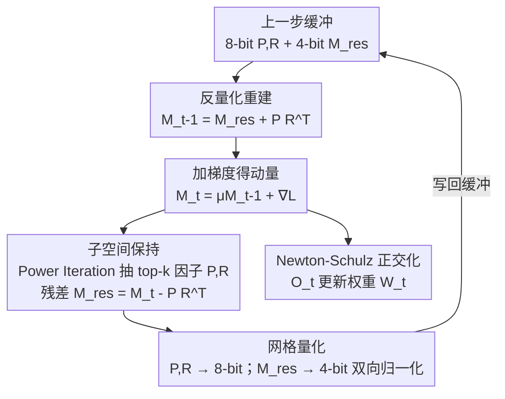

# Achieving low-bit Muon through subspace preservation and grid quantization

**会议**: ICLR2026  
**OpenReview**: [https://openreview.net/forum?id=g2l9bg9DWx](https://openreview.net/forum?id=g2l9bg9DWx)  
**代码**: https://github.com/wuhuaijin/lowbit-Muon  
**领域**: 模型压缩 / 优化器量化 / 高效训练  
**关键词**: Muon 优化器, 低比特量化, 奇异子空间保持, 网格量化, 显存高效训练

## 一句话总结
本文首次研究 Muon 优化器状态的 4-bit 压缩，发现 Newton-Schulz 正交化会把量化误差主要放大在动量矩阵的 top 奇异子空间上，于是提出 4-bit-Muon-GRASP：用 8-bit 温和保留 top 子空间、4-bit 压残差子空间，并用沿行列双向归一化的网格量化抑制双维度离群值，在 LLaMA 130M~1.1B 预训练与 Qwen2.5-7B 微调上几乎无损精度，训练显存最多降 28%。

## 研究背景与动机
**领域现状**：大模型训练的显存瓶颈很大一块来自优化器状态。AdamW 需要同时存一阶、二阶动量，缓冲区是模型大小的 2 倍——一个 5B 模型仅 fp32 优化器状态就超过 40GB。降低这部分显存有两类算法路线：低秩分解（如 Adafactor、GaLore）和把优化器状态量化到低比特（8-bit、4-bit）。后者因为简单、通用而尤其有吸引力，但现有的低比特优化器工作几乎都围绕 AdamW、SGD 展开。

**现有痛点**：Muon 是最近提出的基于矩阵正交化的优化器，只需存一阶动量，相比 AdamW 天然省掉约一半优化器显存，且训练效率接近 AdamW 的两倍，已被 Kimi-K2 等大模型采用。既然 Muon 本身只剩一个动量缓冲，进一步把它压到 4-bit 看似收益巨大，但"怎么压"几乎没人碰过。把为 AdamW 设计的低比特方案直接搬到 Muon 上会出问题。

**核心矛盾**：Muon 与 AdamW 的本质区别在于它的更新不是逐元素算出来的，而是要对动量矩阵 $M_t$ 做一次正交化（用 Newton-Schulz 迭代近似 $UV^\top$，其中 $U\Sigma V^\top = M_t$ 是 SVD）。本文实测发现：量化前后动量矩阵分布几乎重合（相对误差 RE=0.07），但**经过 NS 迭代之后两者分布出现巨大差异（RE=1.78）**。也就是说，正交化这一步把量化引入的微小扰动急剧放大了——这正是直接量化 Muon 失效的根因，而 AdamW 没有这个环节所以不受影响。

**本文目标**：在保证训练/下游精度几乎无损的前提下，把 Muon 的动量状态压到 4-bit，从而进一步降低训练显存。需要先搞清楚误差从哪来、再针对性设计压缩方案。

**切入角度**：作者做了两个关键诊断。其一，误差放大不是"NS 迭代步数不够"造成的——增加迭代步数或多项式阶数反而让量化误差更高，说明量化矩阵需要的是更少而非更多的迭代。其二，把动量矩阵按 SVD 拆成 top 奇异子空间 $M_{top}$ 与残差子空间 $M_{res}$ 分别量化后观察：NS 迭代前两者误差相当（≈0.08/0.09），迭代后 $M_{top}$ 的误差被放大约 40×，而 $M_{res}$ 只放大约 5×。误差集中在 top 奇异子空间。

**核心 idea**：既然误差源是 top 奇异子空间，就**对不同子空间用不同精度**——用更温和的 8-bit 保住 top 子空间、用 4-bit 压残差；同时针对动量矩阵在行、列两个方向都出现离群值的现象，用"网格量化"沿双向归一化给出更紧的逐元素量化边界。

## 方法详解

### 整体框架
4-bit-Muon-GRASP（GRid And Subspace Preserving）的目标是：在每个优化步里，把原本要以 fp32 存储的动量矩阵 $M_t \in \mathbb{R}^{m\times n}$ 替换成"8-bit 的 top 奇异因子 + 4-bit 的残差矩阵"这套低比特表示，从而把 Muon 的优化器缓冲压到接近 4-bit，同时不让正交化把误差放大到伤害收敛。

整体流程是对标准 Muon 单步的改造。标准 Muon 单步为：更新动量 $M_t = \mu M_{t-1} + \nabla L_t(W_{t-1})$，正交化 $O_t = \text{Newton-Schulz}_p(M_t, T)$，再更新权重 $W_t = W_{t-1} - \eta_t O_t$。GRASP 在"存动量"这件事上动刀：每步先从量化缓冲里反量化恢复出 $M_{t-1}$，加梯度得到 $M_t$；用一步 Power Iteration 抽出 top-$k$ 奇异因子 $P_t, R_t$（满足 $P_t R_t^\top \approx M_{top}$），残差 $M_{res,t} = M_t - P_t R_t^\top$；把 $M_{res}$ 用网格量化压到 4-bit、把 $P,R$ 压到 8-bit 存进缓冲；正交化仍用完整的 $M_t$ 算出更新方向。

### 关键设计

**1. 子空间保持：用混合精度把误差源单独留住**

针对"NS 迭代主要放大 top 奇异子空间误差"这个诊断，作者把动量矩阵显式拆成两块。设 $U\Sigma V^\top = M$ 为 SVD，则

$$M_{top} := M_k = U_k \Sigma_k V_k^\top, \qquad M_{res} = M - M_{top}$$

其中 $U_k, V_k$ 是 top-$k$ 奇异向量、$\Sigma_k$ 是 top-$k$ 奇异值。对误差敏感的 $M_{top}$ 用相对温和的 8-bit 保留，对 $M_{res}$ 用 4-bit 压缩。这样既不让正交化把 top 子空间的量化误差放大到失控，又因为 $M_{res}$ 占绝大部分元素而保住了整体的低比特收益。关键的一点是：作者通过消融发现**残差子空间不能丢**——只保留 top 子空间、丢掉残差，哪怕用 1/2 秩近似，训练精度损失也会超过 2%，因为 NS 迭代会把原本很小的奇异值也放大到不可忽略，单靠 top 子空间无法覆盖动量矩阵的全部信息。这解释了为什么 Muon 不能简单做低秩近似。

直接对每步做 SVD 来取 $M_{top}$ 太贵，作者改用 **Power Iteration（幂迭代）数值近似** top 奇异向量：每步算出 $M_t$ 后，求秩-$k$ 的 $P_t \in \mathbb{R}^{m\times k}, R_t \in \mathbb{R}^{n\times k}$ 使 $P_t R_t^\top \approx M_{top}$。技巧在于用上一步的 $R_{t-1}$ 列归一化得到 $Q_t$ 作为热启动——因为相邻步的 $M_t, M_{t-1}$ 高度相似，**单步幂迭代就足以准确抓住 top 子空间**（实测 1-step 的近似相对误差已低至 0.01，与 2/3-step 几乎没差距）。由于秩 $k$ 很小，$k(n+m) \ll mn$，多存 $P,R$ 带来的显存开销可忽略。

**2. 网格量化：用行列双向归一化抑制双维度离群值**

动量张量的离群值不是只出现在某一行或某一列，而是**在行、列两个方向上都有**。传统的按通道（per-channel）或按 token（per-token）分组量化只沿单一方向取归一化尺度，无法同时罩住两个方向的离群值，导致量化边界偏松、精度损失。

网格量化的做法是：把矩阵 $X$ 切成若干 $s\times s$ 的块（$s$ 为组大小，实验设 128），对块内元素同时计算行方向与列方向的尺度

$$scale^r_i = \max_{r_1 \le j \le r_2} x_{i,j}, \qquad scale^c_j = \max_{c_1 \le i \le c_2} x_{i,j}$$

然后对每个元素用两个方向尺度的**较小值**做归一化：

$$N_{grid}(x_{i,j}) = \frac{x_{i,j}}{\min(scale^r_i,\, scale^c_j)}$$

取 min 等于给每个元素一个更紧、且逐元素唯一的量化边界，从而精细地照顾到两个维度上的离群值。代价是要存的量化尺度数量大约是分组量化的两倍，但相对张量本身仍可忽略。消融显示，在不保留 top 子空间、直接压动量矩阵的对照下，网格量化把分组量化的精度损失**减半**。

把这两个设计合起来（top 子空间保持 + 网格量化），动量矩阵经 NS 迭代后的归一化误差从 NE=1.78 降到 NE=0.14（top 子空间秩取原矩阵秩的 1/16 时）。

### 一个完整示例
以算法第 $t$ 步（$t>0$）为例走一遍，看缓冲里到底存了什么、怎么流转：

1. **反量化重建动量**：从缓冲取出 4-bit 的 $M^q_{res,t-1}$、8-bit 的 $P^q_{t-1}, R^q_{t-1}$，反量化后重建 $M_{t-1} = M_{res,t-1} + P_{t-1}R_{t-1}^\top$。
2. **热启动方向**：把 $R_{t-1}$ 列归一化得 $Q_t$，作为本步幂迭代的起点。
3. **更新动量**：$M_t = \mu M_{t-1} + \nabla L_t(W_{t-1})$。
4. **抽 top 子空间**：$P_t, R_t = \text{PowerIter}(M_t, Q_t)$（内部为 $P\leftarrow M_t Q$、QR 正交化、$R\leftarrow M_t^\top P$，单步即可）。
5. **算残差并量化**：$M_{res,t} = M_t - P_t R_t^\top$，对其做 4-bit 网格量化 $M^q_{res,t}$；对 $P_t, R_t$ 做 8-bit 量化写回缓冲。
6. **正交化更新权重**：用完整 $M_t$ 做 Newton-Schulz 正交化得 $O_t$，再 $W_t = W_{t-1} - \eta_t(O_t + \lambda W_{t-1})$（带权重衰减）。

整个过程中常驻显存里的只有低比特的 $M^q_{res}$（4-bit）和 $P^q, R^q$（8-bit），而真正参与正交化计算的是即时反量化重建出的 fp/bf16 矩阵。

### 损失函数 / 训练策略
本方法不改训练目标，只改优化器状态的存储与重建。实现上用 OpenAI Triton kernel 写量化/反量化以拿到真实显存收益；遵循 Liu et al. (2025) 的做法，矩阵参数用 Muon，RMSNorm/LM head/embedding 仍用 AdamW；INT4/INT8 格式，组大小与网格大小均为 128，top 子空间秩默认取原秩的 1/16。

## 实验关键数据

### 主实验
预训练用 Slimpajama，LLaMA 架构（RMSNorm + SwiGLU），三种规模 130M/350M/1.1B，BF16 混合精度，最多 31.5B tokens；微调用 Qwen2.5-7B（通用）与 Qwen2.5-7B-Math（数学）。

预训练下游零样本平均精度（节选）：

| 模型 | 优化器 | HellaSwag | ARC-e | PIQA | SciQ | 平均 |
|------|--------|-----------|-------|------|------|------|
| 350M | fp32-Muon | 32.4 | 38.3 | 62.0 | 68.0 | 44.6 |
| 350M | 4bit-Muon-base | 31.6 | 37.7 | 61.8 | 64.4 | 43.7 |
| 350M | **4bit-Muon-GRASP** | 32.4 | 38.5 | 61.4 | 66.6 | **44.5** |
| 1.1B | fp32-Muon | 40.6 | 42.8 | 66.5 | 69.5 | 48.0 |
| 1.1B | 4bit-Muon-base | 39.8 | 41.5 | 66.6 | 69.7 | 47.6 |
| 1.1B | **4bit-Muon-GRASP** | 40.4 | 42.3 | 67.4 | 71.3 | **48.2** |

朴素的 4bit-Muon-base 在 350M 上平均掉到 43.7，而 GRASP 恢复到 44.5、与 fp32-Muon 持平；1.1B 上 GRASP 甚至略超 fp32（48.2 vs 48.0）。训练曲线上，GRASP 与 fp32-Muon 的差距 <0.2%，1.1B 上几乎无损。

显存与困惑度（10K 步后，节选）：

| 规模 | 优化器 | 显存(GB) | PPL↓ |
|------|--------|----------|------|
| 1.1B | fp32-Muon | 13.22 | 12.48 |
| 1.1B | 4bit-Muon-base | 10.54 | 12.76 |
| 1.1B | **4bit-Muon-GRASP** | 10.14 | **12.48** |

GRASP 在 1.1B 上把困惑度拉回到与 fp32-Muon 一致（12.48），而 base 掉到 12.76。总显存对比（含数据、激活、梯度等）显示 4-bit Muon 相比 fp32-AdamW、fp32-Muon 分别最多省 **48%、28%**，是所有低比特优化器里最省显存的。

微调 Qwen2.5-7B / 7B-Math（7 个基准平均）：fp32-SFT 62.6、4bit-base 62.5、**4bit-GRASP 62.8**，几乎无损甚至略优，说明 4-bit Muon 不会破坏预训练模型能力。

### 消融实验

| 配置 | 现象 | 说明 |
|------|------|------|
| top 子空间秩 1/64→1/2 | 秩越小、与 fp32 差距越大 | 1/2 秩时训练曲线与基线无差异 |
| 只留 top、丢残差 | 精度损失 >2%（即便 1/2 秩） | 残差子空间不可丢，Muon 难做低秩近似 |
| 网格 vs 分组量化 | 网格把分组的精度损失减半 | 双向归一化有效抑制双维度离群值 |
| 幂迭代 1/2/3 步 | 1 步误差已低至 0.01 | 热启动下单步幂迭代足够 |

### 关键发现
- 误差放大的根因是 NS 正交化对 **top 奇异子空间**的量化误差放大（约 40×），而非迭代步数不足——增加迭代步数反而让量化误差更高。
- 残差子空间贡献关键：正交化会放大本来很小的奇异值，丢残差就丢信息，导致 >2% 精度损失，这正面否定了"对 Muon 直接做低秩近似"的可行性。
- 幂迭代靠"用上一步结果热启动"把每步成本压到单步，几乎不增加训练时间开销。

## 亮点与洞察
- **把"误差从哪来"做成方法主线**：先用可视化和分子空间误差表（NS 前后 $M_{top}$ 放大 40× vs $M_{res}$ 5×）精确定位误差源，再针对性地对不同子空间用不同精度——这种"先诊断后开方"的范式比直接套低比特模板更有说服力。
- **混合精度子空间拆分**这一思路可迁移：凡是更新里含正交化/谱操作、量化误差会被非线性放大的优化器（如 Shampoo 系），都可以借鉴"保住敏感子空间、压残差"的做法。
- **网格量化**是个轻量但通用的 trick：当张量在行列两个方向都有离群值时，取行列尺度的 min 做逐元素归一化，几乎零额外开销就能把精度损失减半，可用于其它二维张量量化场景。
- 用幂迭代 + 跨步热启动近似 SVD 子空间，把每步成本降到单步迭代，是让"分子空间量化"在训练里真正可用的工程关键。

## 局限与展望
- 作者承认：最优量化设置依赖任务/数据/训练细节，本文探索局限于常见 LLM 训练场景；受资源限制，预训练评估只到 1.1B（微调到 7B）。
- top 子空间的秩是手调超参（默认 1/16），缺乏自动选秩的策略——这是作者列出的首要 open problem。
- 显存收益对小模型不明显、且随比特数下降趋于饱和，因为统计的是含激活/梯度/碎片的总显存而非单独优化器显存；真正的低比特红利要在更大模型上才充分显现。
- 分布式场景下低比特优化器的通信与效率仍待优化（Muon 需要完整梯度矩阵，与 PyTorch FSDP 不直接兼容，本文是基于 distributed Muon 公开实现做的分区量化）。

## 相关工作与启发
- **vs 4-bit AdamW（Li et al. 2023）/ 8-bit 优化器（Dettmers et al. 2021）**：它们针对逐元素更新的 AdamW/SGD 做块级动态量化，没有正交化环节；本文指出这类方法直接搬到 Muon 会因 NS 迭代放大误差而失效，需要分子空间 + 网格量化才行。
- **vs 低秩分解类（Adafactor、GaLore、SM3）**：那条路用低秩近似省二阶动量显存；本文实验证明 Muon 的动量经正交化后**不能简单低秩近似**（丢残差掉点 >2%），所以走的是"全秩 + 混合精度量化"而非低秩路线。
- **vs 4-bit Shampoo（Wang et al. 2024）**：同为对含谱/矩阵操作的优化器做低比特，但 Shampoo 压的是二阶预条件子；本文是首个针对 Muon 一阶动量正交化做 4-bit 压缩的工作。

## 评分
- 新颖性: ⭐⭐⭐⭐⭐ 首个 Muon 优化器低比特压缩工作，误差归因（top 子空间被正交化放大）有洞见。
- 实验充分度: ⭐⭐⭐⭐ 预训练+微调、多规模、多基准、消融完整，但预训练规模止于 1.1B。
- 写作质量: ⭐⭐⭐⭐⭐ "诊断—拆解—设计"主线清晰，图表支撑到位。
- 价值: ⭐⭐⭐⭐ Muon 正被大模型采用，省 28% 训练显存且近乎无损，落地价值实在。

<!-- RELATED:START -->

## 相关论文

- [\[ICML 2026\] TWLA: Achieving Ternary Weights and Low-Bit Activations for LLMs via Post-Training Quantization](../../ICML2026/model_compression/twla_achieving_ternary_weights_and_low-bit_activations_for_llms_via_post-trainin.md)
- [\[ICLR 2026\] MASS: MoErging through Adaptive Subspace Selection](mass_moerging_through_adaptive_subspace_selection.md)
- [\[ICLR 2026\] Towards Quantization-Aware Training for Ultra-Low-Bit Reasoning LLMs](towards_quantization-aware_training_for_ultra-low-bit_reasoning_llms.md)
- [\[ICML 2026\] ReQAT: Achieving Full-Precision Reasoning Accuracy with 4-bit Floating-Point Quantization-Aware Training](../../ICML2026/model_compression/reqat_achieving_full-precision_reasoning_accuracy_with_4-bit_floating-point_quan.md)
- [\[AAAI 2026\] QuantVSR: Low-Bit Post-Training Quantization for Real-World Video Super-Resolution](../../AAAI2026/model_compression/quantvsr_low-bit_post-training_quantization_for_real-world_video_super-resolutio.md)

<!-- RELATED:END -->
