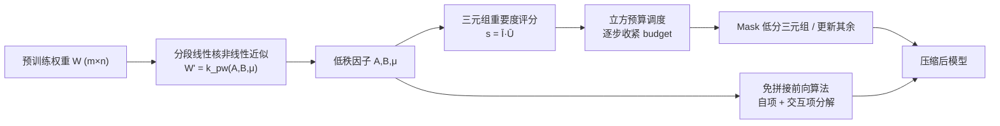

# Adaptive Nonlinear Compression for Large Foundation Models

**会议**: ICLR 2026  
**OpenReview**: [https://openreview.net/forum?id=p66qXIp5jv](https://openreview.net/forum?id=p66qXIp5jv)  
**代码**: [https://github.com/Liang08/NLA](https://github.com/Liang08/NLA)  
**领域**: 模型压缩 / 低秩近似  
**关键词**: 低秩近似, 非线性核, 分段线性核, 自适应预算分配, 大模型压缩  

## 一句话总结
NLA 用分段线性核把权重矩阵做"非线性低秩近似"，再配一个免拼接全矩阵的前向算法和按重要度分配压缩率的自适应预算调度，让低秩压缩在相同参数量下信息损失更小、压缩率更高。

## 研究背景与动机
- **领域现状**：大模型部署受限于显存，主流压缩有量化、剪枝、蒸馏、低秩近似四类。其中低秩近似（SVD 系）最大的优点是不依赖专用硬件（不需要稀疏推理或低比特单元），且能和其他压缩方法叠加，因此被视为硬件友好的方向。
- **现有痛点**：SVD 类方法本质是**线性**的——把权重分解成奇异向量的线性组合后，截断小奇异值对应的方向。压缩率一高，被丢掉的奇异方向就越多，信息损失急剧放大，导致 LLaMA-7B 在 50%/60% 压缩下困惑度直接爆炸到上万。
- **核心矛盾**：用非线性核把低秩因子隐式映射到高维 Hilbert 空间能提升表达力、降低信息损失，但**直接套核函数有两个硬伤**：(1) 大多数核在前向传播时必须先把低秩因子重建成完整权重矩阵，显存和算力开销暴涨；(2) 核形式难以像线性方法那样对不同矩阵做自适应秩分配，而不同权重矩阵的敏感度差异恰恰很大。
- **本文目标**：在不重建全矩阵、不依赖专用硬件的前提下，把非线性低秩近似做到既省显存又能逐矩阵自适应分配压缩预算。
- **核心 idea**：**「分段线性核做非线性近似 + 自相互项分解的轻量前向 + 三元组重要度驱动的自适应预算调度」**——用分段线性核替代线性内积获得表达力，把核展开成可在低秩因子上直接计算的三个加法项以避免重建全矩阵，再以三元组为粒度按重要度做立方调度的预算分配。

## 方法详解

### 整体框架
NLA（Nonlinear Low-rank approximation with Adaptive budget allocation）把每个预训练权重矩阵 $W\in\mathbb{R}^{m\times n}$ 表示成两个低秩因子 $A\in\mathbb{R}^{m\times h\times r}$、$B\in\mathbb{R}^{n\times h\times r}$ 和一个共享系数 $\mu\in\mathbb{R}^h$，通过分段线性核 $k_{pw}$ 非线性地拟合 $W$；为了能真正部署，前向过程被改写成只用低秩因子计算的"自项+交互项"形式，避免拼回完整矩阵；最后在重训练阶段，以 $h$ 个分段三元组为粒度计算重要度，按立方预算调度把不重要的三元组逐步置零，从而对每个矩阵实现不同压缩率。

### 关键设计

**1. 分段线性核的非线性低秩近似：用距离而非内积拟合权重。** 线性低秩近似把 $W_{ij}$ 写成两个向量的内积 $a\cdot b$，受限于线性假设类，截断必然丢信息。NLA 改用受 DyN 启发的分段线性核，把矩阵元素拟合成低秩因子之间的加权平方距离：$W'_{i,j}=k_{pw}(A_{i,\cdot,\cdot},B_{j,\cdot,\cdot})=\sum_{l=1}^{h}\mu_l\,\lVert A_{i,l,\cdot}-B_{j,l,\cdot}\rVert^2$。核函数 $k(x,x')=\langle\phi(x),\phi(x')\rangle_{\mathcal H}$ 等价于把低秩向量隐式映射到高维特征空间再做内积，于是同样 $(m+n)\cdot r\cdot h+h$ 个参数能表达比线性内积更高秩的结构。拟合时直接用梯度下降最小化 MSE 重建损失 $W^*=\arg\min_{A,B}\mathcal L_{MSE}(W',W)$，把"低秩还原高秩"的能力交给优化而非奇异值大小，这也是它在 OPT-1.3B 各层拟合 loss 普遍只有 SVD 一半甚至更低的根因。

**2. 自项—交互项分解的免拼接前向算法：把非线性的显存代价压下来。** 非线性的代价是前向时不能像线性那样"特征直接乘低秩因子"，朴素做法必须先把 $A,B$ 合并成完整 $W$ 再算，显存爆炸。NLA 把分段线性核按加法结构展开成三块：输入自项 $\text{InS}=\sum_k Q_{in}[:,:,k]^2\odot\mu$、输出自项 $\text{OutS}=\sum_k Q_{out}[:,:,k]^2\odot\mu$、以及交互项 $X_{in\&out}=(Q_{out}\cdot(Q_{in}^\top X^\top))\odot\mu$，最终输出 $Y=X_{in}+X_{out}-2\,X_{in\&out}$。每一项都只用低秩因子和共享系数 $\mu$ 计算，全程不构造完整权重矩阵，因此 OPT-1.3B 训练显存能降到朴素实现的 12.2%、推理降到 15.4%，让非线性近似从"理论可行"变成"真能跑"。

**3. 三元组重要度 + 立方预算调度的自适应压缩：把预算花在敏感矩阵上。** 论文观察到（Fig.3）不同层、不同矩阵（Q vs FC）的拟合 loss 和收敛速度差异巨大，统一压成同一秩并不划算。NLA 把每个矩阵的分解天然切成 $h$ 个分段三元组 $\tau_l=\{A_l,\mu_l,B_l\}$ 作为分配粒度，给每个三元组打重要度 $s_{W,l}=s(\mu_l)+\frac{1}{mr}\sum s(A_{i,l,j})+\frac{1}{nr}\sum s(B_{i,l,j})$；单参数重要度用敏感度 $I(w)=|w\cdot\nabla_w\mathcal L|$，并做指数平滑得到平滑重要度 $\bar I$ 与不确定度 $\bar U$，最终 $s(w)=\bar I(w)\cdot\bar U(w)$ 兼顾稳定性与动态变化。压缩率由保留的三元组数量决定，预算 $b(t)$ 走立方稀疏调度——前期 warm-up 保守保住容量、中段按立方曲线激进收紧、末段 cool-down 平滑过渡，更新时只对落在 top-$b$ 内的 $\mu_l$ 做梯度更新、其余直接置零，从而把更多预算留给敏感矩阵。

## 实验关键数据

### 主实验表格

LLaMA-7B 在 WikiText-2/PTB/C4 上的困惑度（越低越好，节选）：

| 方法 | 压缩率 | WikiText-2 | PTB | C4 |
|------|--------|-----------|-----|-----|
| Original | 0% | 5.68 | 8.35 | 7.34 |
| ASVD | 50% | 15358 | 47690 | 27925 |
| SVD-LLM | 50% | 23.97 | 150.58 | 118.57 |
| SVD-LLM | 60% | 42.30 | 321.27 | 246.89 |
| **NLA (Ours)** | **50%** | **15.21** | **84.65** | **70.32** |
| **NLA (Ours)** | **70%** | 39.91 | 320.35 | 240.56 |

Swin-Base 在 ImageNet-1K 上的分类（压缩率更高且精度更好）：

| 方法 | Params(M) | 压缩率 | Acc(%) |
|------|-----------|--------|--------|
| Swin-Base | 87.8 | 0% | 83.5 |
| PELA | 62.2 | 29.2% | 82.4 |
| **NLA (Ours)** | **40.2** | **54.2%** | **82.7** |

### 消融实验表格

| 消融项 | 设置 | 结果 |
|--------|------|------|
| 免拼接前向算法（OPT-1.3B 训练显存） | 无 Alg.1 | >81920 MB |
| | 有 Alg.1 | 12623.75 MB（约 12.2%）|
| 自适应预算分配（OPT-1.3B 困惑度） | 关闭 | 20.13 |
| | 开启 | 19.77 |
| 核函数选择（LLaMA-7B 推理） | Gaussian | 1.45s / 6.5GB |
| | 分段线性（ours） | 0.82s / 6.7GB |
| 线性 vs 非线性拟合（仅转换不训练，PPL） | FWSVD 60% | 32194 |
| | NLA 仅低秩 70% | 16774 |

### 关键发现
- **非线性拟合本身就更强**：仅做权重转换、不再训练时，NLA 70% 压缩的困惑度（16774）就比 SVD 系最好结果（FWSVD 60%，32194）低 70% 以上；逐层拟合 loss 普遍只有 SVD 的一半。
- **微调后差距进一步拉大**：LLaMA-7B 在 50% 压缩下微调后 NLA 困惑度 9.68 vs SVD-LLM 13.26，70% 压缩下 17.77 vs 28.45，说明非线性近似没有破坏模型"可被微调恢复"的能力。
- **常识推理同样领先**：50% 压缩下平均准确率 0.37 vs SVD-LLM 0.33，相对提升约 12%。
- **可与量化叠加**：NLA + 4bit 在更低显存（1.9GB）下困惑度 12.18，优于 SVD-LLM + 4bit（2.1GB，13.29）。
- **免拼接前向是落地关键**：没有 Algorithm 1，OPT-1.3B 训练直接超 80GB 显存放不下；有了它降到约 12.6GB。

## 亮点与洞察
- **把"非线性核压缩"从理论搬到可部署**：核方法表达力强是老知识，但前向必须重建全矩阵一直是劝退点；自项—交互项分解直接绕开重建，是本文最实用的工程贡献。
- **用距离核替代内积**的视角很干净：分段线性核既保留了高维映射的表达力，又比 Gaussian/Sigmoid 核更快更省，是表达力与开销之间一个聪明的折中。
- **三元组粒度天然适配自适应分配**：把 $h$ 个分段做成可独立打分、独立 mask 的单元，让"非线性核难以自适应秩分配"这个核心障碍被结构性地化解。

## 局限与展望
- 共享系数 $\mu$ 的 mask 是压缩率的唯一旋钮，粒度较粗，是否能在 $A/B$ 因子内部做更细的预算分配仍待探索。
- 自适应预算分配在消融里增益不大（OPT-1.3B 20.13→19.77、Swin-Base 82.55→82.73），主要收益来自非线性近似本身，自适应部分的价值还需在更极端压缩率下验证。
- 实验主要在 LLaMA-7B / OPT / Swin 规模，更大模型（70B 级）和真实推理时延（分段线性前向相比稠密 GEMM 的实际 kernel 效率）还需进一步验证。
- 立方调度引入 $b_0,b_f,t_i,t_f$ 等超参，调度敏感性与跨模型可迁移性未充分讨论。

## 相关工作与启发
- **线性低秩压缩**：FWSVD（Fisher 加权 SVD）、ASVD（按输入通道影响缩放）、SVD-LLM（建立奇异值与压缩损失的直接映射），NLA 把这条线从"线性内积"推进到"非线性核"。
- **非线性表示**：KPCA 用核映射捕捉非线性结构、DyN（Dynamics-inspired Neuromorphic Learning）用无权重的有限子模型替代权重结构——NLA 借鉴 DyN 把分段线性模型当作权重矩阵的低秩近似器。
- **混合压缩**：CALDERA 把低秩与低精度联合分解；NLA 也展示了与 GPTQ/4bit 量化叠加的潜力，提示低秩与量化正交互补。
- **启发**：当线性方法在高压缩率下遇到信息损失的硬墙时，"换一个更富表达力的假设类 + 想办法让它在工程上可计算"往往比在线性框架内继续优化更值得；本文的"核展开成加法项免重建"是一个可迁移到其他非线性参数化方法的通用技巧。

## 评分
- **新颖性**: ⭐⭐⭐⭐ 把分段线性核引入低秩压缩并解决前向重建与自适应分配两大障碍，思路清晰且有实际工程价值，非"换核"式增量。
- **实验充分度**: ⭐⭐⭐⭐ 覆盖 LLM（LLaMA/OPT、语言建模+常识推理）与视觉（Swin）、含拟合 loss、显存、核对比、量化叠加等多角度消融；但缺更大模型与真实推理时延评测。
- **写作质量**: ⭐⭐⭐⭐ 动机—矛盾—方法链条顺畅，公式与算法表述清楚，图表支撑充分。
- **价值**: ⭐⭐⭐⭐ 硬件友好、可与量化叠加、在高压缩率下显著优于 SVD 系，对资源受限部署有现实意义。

<!-- RELATED:START -->

## 相关论文

- [\[ICML 2026\] End-to-End Compression for Tabular Foundation Models](../../ICML2026/model_compression/end-to-end_compression_for_tabular_foundation_models.md)
- [\[ICLR 2026\] ABBA-Adapters: Efficient and Expressive Fine-Tuning of Foundation Models](abba-adapters_efficient_and_expressive_fine-tuning_of_foundation_models.md)
- [\[ICLR 2026\] NerVE: Nonlinear Eigenspectrum Dynamics in LLM Feed-Forward Networks](nerve_nonlinear_eigenspectrum_dynamics_in_llm_feed-forward_networks.md)
- [\[ICLR 2026\] UniQL: Unified Quantization and Low-Rank Compression for Adaptive Edge LLMs](uniql_unified_quantization_and_low-rank_compression_for_adaptive_edge_llms.md)
- [\[ICLR 2026\] NLI: Non-uniform Linear Interpolation Approximation of Nonlinear Operations for Efficient LLMs Inference](nli_non-uniform_linear_interpolation_approximation_of_nonlinear_operations_for_e.md)

<!-- RELATED:END -->
