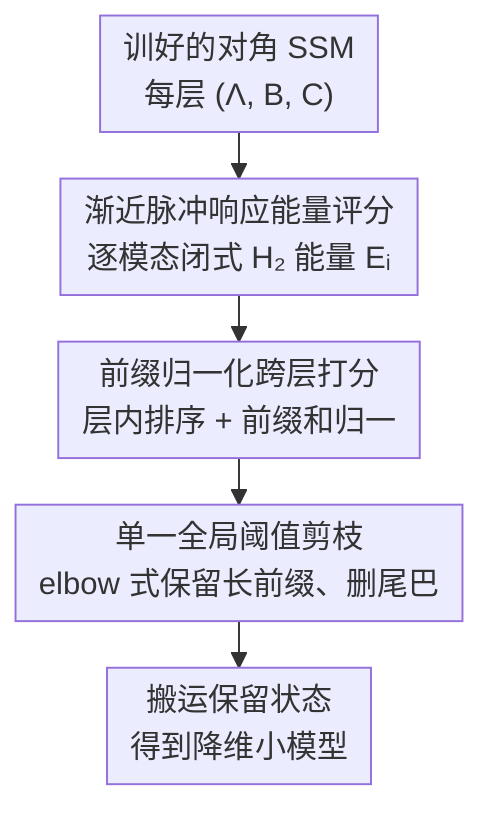

# AIRE-Prune: Asymptotic Impulse-Response Energy for State Pruning in State Space Models

**会议**: ICLR2026  
**OpenReview**: [https://openreview.net/forum?id=JLUxTl1Um6](https://openreview.net/forum?id=JLUxTl1Um6)  
**代码**: https://github.com/falcon-arrow/AIRE-Prune （论文承诺释出）  
**领域**: 模型压缩 / 状态空间模型  
**关键词**: 状态空间模型, 结构化剪枝, 模型降阶, 脉冲响应能量, 训练后压缩

## 一句话总结
AIRE-Prune 为对角状态空间模型（SSM）的每个状态算出一个闭式的"无限时域脉冲响应能量"分数，再用前缀归一化把不同层的分数拉到同一尺度，仅凭一个全局阈值、无需重训就能剪掉平均 60.8% 的状态，而精度只掉 0.29 个百分点。

## 研究背景与动机
**领域现状**：现代深度状态空间模型（S4、S5、Mamba 等）通过把输入历史压缩进内部状态来高效建模长序列。决定计算量和显存的关键变量是每层的**状态维度 $n$**：为了稳定训练，主流做法要么用多个并行的小 SISO 子系统再做通道混合（multi-SISO），要么用共享状态的 MIMO 系统（S5 风格）。两类做法训练完之后状态维度都是固定写死的。

**现有痛点**：训完的 SSM 通常**严重过参数化**——很多状态对最终输出几乎没贡献，却照样吃满推理时的算力和显存。已有的复杂度优化（频域核、传递函数参数化）要么只加速训练/推理、不解决学到的状态空间里的冗余，要么会限制搜索空间、或只在初始化时保证稳定。换句话说，缺一个**训练后**直接削减 $n$ 的机制。

**核心矛盾**：要在不重训的前提下删状态，就得有一个能跨层比较、又能反映"删掉这个状态会让输出失真多少"的重要性度量。最接近的前作 LAST 用的是**最坏情况**的频域增益（$H_\infty$ 视角，即峰值放大），并做层归一化实现全局选择。但最坏情况度量对典型工作负载偏保守——它强调的是任务可能极少激发的峰值共振，于是低估了很多本可以删的状态。

**本文目标**：给对角 SSM 设计一个训练后、层自适应的结构化状态剪枝准则，让它（1）对每个状态给出闭式、可快速计算的重要性分数；（2）能跨层全局比较；（3）一刀切的全局阈值就能用，无需逐层调参、无需重训。

**切入角度**：作者回到经典线性系统理论里"状态重要性"的标准定义——一个状态方向能从输入往输出传递多少**输出能量**。对稳定的离散 LTI 系统，这个能量就是脉冲响应平方在无限时域上的累加（等价于 $H_2$ 能量），是个**典型情况**而非最坏情况的量。

**核心 idea**：用"无限时域脉冲响应能量"（$H_2$）代替 LAST 的"最坏情况峰值增益"（$H_\infty$）来给状态打分，把单系统的经典模态截断推广到带非线性的深层堆叠，从而以可忽略的精度代价实现激进压缩。

## 方法详解

### 整体框架
AIRE-Prune 把每个 SSM 层看成一个对角离散 LTI 系统 $x_{k+1}=\Lambda x_k+Bu_k,\ y_k=Cx_k$，其中 $\Lambda=\mathrm{diag}(\lambda_1,\dots,\lambda_n)$ 且所有极点严格落在单位圆内（$|\lambda_i|<1$ 保证无限求和收敛）。剪枝分四步：先给每层每个模态（状态）算一个闭式能量分数；再在层内排序、做前缀归一化把分数拉成跨层可比；然后用一个全局阈值在所有层、所有状态上统一选择保留谁、删除谁；最后把保留的状态搬进一个降维后的小模型。整个过程是**一次性（one-shot）打分、全局应用、不重训**。

### 关键设计

**1. 渐近脉冲响应能量评分：用典型情况能量而非最坏情况增益衡量状态重要性**

针对"最坏情况度量偏保守"这个痛点，作者把状态重要性定义成它在无限时域里贡献的总输出能量。对单个对角模态 $\Sigma_i:(\lambda_i, B_{i,:}, C_{:,i})$，单位脉冲下第 $t$ 步的输出是秩一切片 $H_t^{(i)}=C_{:,i}\,\lambda_i^t\,B_{i,:}$，其 Frobenius 范数平方为 $\|H_t^{(i)}\|_F^2=|\lambda_i|^{2t}\,\|C_{:,i}\|_2^2\,\|B_{i,:}\|_2^2$。对 $t$ 从 0 到 $\infty$ 求和是一个几何级数，借助 $|\lambda_i|<1$ 收敛，得到闭式的每模态能量分数：

$$\mathrm{EnergyScore}_{\text{local}}(x_i)=E_i=\frac{\|C_{:,i}\|_2^2\,\|B_{i,:}\|_2^2}{1-|\lambda_i|^2}.$$

这个分数有三个好处：**模态可分**（不用解大矩阵，每个状态独立算）、**尺度感知**（通过 $B/C$ 的耦合范数体现可控性/可观性）、**动态感知**（通过极点阻尼 $|\lambda_i|$ 体现记忆长度）。一个状态越易激发（$\|B_{i,:}\|$ 大）、越易测量（$\|C_{:,i}\|$ 大）、记忆越久（$|\lambda_i|$ 大），$E_i$ 越大，删掉它造成的失真也越大。和 LAST 的对比一目了然：LAST 用 $H_\infty$ 峰值增益 $\frac{\|C_i\|^2\|B_i\|^2}{(1-|\lambda_i|)^2}$（分母是 $(1-|\lambda_i|)^2$），AIRE 用 $H_2$ 总能量 $\frac{\|C_i\|^2\|B_i\|^2}{1-|\lambda_i|^2}$（分母是 $1-|\lambda_i|^2$）。前者强调任务罕有的峰值，后者反映长跑里真实的能量支出，因而更贴合典型负载。

层级能量可近似为各模态之和 $\|\Sigma\|_{\text{energy}}^2\approx\sum_i E_i$，删掉状态集合 $P$ 造成的层能量变化约等于它们各自能量之和 $\sum_{i\in P}E_i$，所以"删最小能量的模态"就能最小化层级的稳态失真。

**2. 前缀归一化跨层打分：把各层异尺度的能量拉到同一全局可比标度**

直接拿 $E_i$ 跨层比较会出问题——不同层因为编码器/解码器增益不同，能量量级差异巨大。作者先在每层内把模态按能量降序排，记第 $i$ 大的为 $E^{(\ell)}_{(i)}$，算前缀和 $S^{(\ell)}_{(i)}=\sum_{j\le i}E^{(\ell)}_{(j)}$，再定义前缀归一化分数：

$$\mathrm{AIRE\text{-}Prune}\big(x^{(\ell)}_{(i)}\big)=\frac{E^{(\ell)}_{(i)}}{S^{(\ell)}_{(i)}+\varepsilon}.$$

这个"风险率（hazard-rate）"式的比值对 $i$ 单调非增，等于把每个状态相对于"它前面所有更重要状态累计能量"做归一化，于是各层都被映射到同一标度上、可以拿同一个阈值切。$\varepsilon$ 是为数值稳定加的小量。和 LAST 的层归一化思路一致，但分子换成了 $H_2$ 能量。

**3. 单一全局阈值剪枝：一刀切阈值实现 elbow 式层自适应删除**

有了跨层可比的分数后，给定一个全局阈值 $\tau$（或等价地给定目标剪枝率 $p$，反推预算 $B=\sum_\ell n_\ell\cdot(1-p)$，取全局第 $B$ 大分数作为 $\tau$），每层保留分数 $\ge\tau$ 的最长前缀、删掉后面那段连续的尾巴。因为前缀归一化分数单调非增，这天然就是一条 elbow 式的层自适应规则：能压的层多删、敏感的层少删，全靠一个阈值自动分配，不用逐层调。实验里这条规则让精度在很高的剪枝率前都贴近满模型、过了 elbow 才陡降，说明 AIRE 的打分把重要状态和无关状态分得很开（head-tail separation 大），单阈值就能保住关键模态、整段砍掉低能量尾巴；在高剪枝率下甚至能把整层状态全部压到阈值之下从而**删掉整层**，把细粒度稀疏变成块级删除，更利于硬件部署。

### 损失函数 / 训练策略
本方法是**训练后、无重训**的一次性剪枝：所有打分只需用学到的 $(\Lambda,B,C)$ 闭式计算一次，剪枝后冻结全部参数直接评测，没有任何额外训练目标或微调。算法复杂度主要在每层的排序与前缀和。

## 实验关键数据

### 主实验
评测在 S5（MIMO）骨干上跑 Long Range Arena（LRA）六项任务 + Speech Commands 35 类关键词识别（序列长 16,000），单卡 H100，全程一次性剪枝不重训。下表为各任务的剪枝率（Prun.）与剪枝后精度（Acc.），对比 LAST 等最强基线（基线数字引自 Gwak et al., 2025）：

| 任务（序列长） | S5 满模型 Acc. | LAST 剪枝率/Acc. | AIRE-Prune 剪枝率/Acc. |
|--------|------|------|------|
| ListOps (2,048) | 61.48 | 0% / 61.48 | 20% / 61.48 |
| Text (4,096) | 88.88 | 60% / 88.52 | 80% / 88.24 |
| Retrieval (4,000) | 91.20 | 50% / 90.42 | 50% / 90.11 |
| Image (1,024) | 87.30 | 30% / 86.34 | 65% / 87.30 |
| Pathfinder (1,024) | 95.15 | 30% / 94.45 | 80% / 95.15 |
| Path-X (16,384) | 98.41 | 30% / 97.95 | 70% / 98.41 |
| Speech (16,000) | 96.43 | 20% / 96.31 | 45% / 96.40 |

**平均结果**：AIRE-Prune 平均剪掉 60.8% 的状态、精度只掉 0.29pp，而 Uniform $H_\infty$ 掉 4.32pp、Global $H_\infty$ 掉 7.51pp、LAST 掉 0.52pp 且平均剪枝率只有约 33%（AIRE 约为其 1.8×）。在"$\le 1$pp 损失"判据下，Text、Pathfinder 各能压 80%、Path-X 压 70%、Image 压 65%、Retrieval 压 50%，连常被认为"不可压"的 ListOps 也能压 20%。

### 跨架构泛化与系统收益

| 配置 | 关键指标 | 说明 |
|------|---------|------|
| S5（主架构） | 平均 60.8% 剪枝、−0.29pp | MIMO 骨干，全面优于基线 |
| S4D | Text 90%、Image 40% | 紧贴满模型精度 |
| Mamba (S6) | Text 45%、Retrieval 60%、Image 80% | 退化可忽略，证明能力不绑定特定参数化 |
| 推理加速（S5） | 1.2×–2.9× | 高剪枝任务（Pathfinder/Path-X）增益最大 |
| 参数量削减（S5） | 19%–65% | 把稀疏真正转化为算力/显存节省 |

### 关键发现
- **打分质量决定一切**：AIRE 的精度-剪枝曲线呈明显 elbow/台阶（高阈值前贴满精度、然后陡降），而基线是平滑下滑——台阶意味着 AIRE 把重要/无关状态分得很开，平滑下滑说明基线在整个扫描过程中把两类状态混着删了。
- **层级剖面任务相关**：Path-X/Pathfinder 主要削后层、高剪枝率下能整层删除；Text/Retrieval 前层保留多、中后层贡献大部分预算；ListOps 各层都有非平凡贡献，所以 elbow 来得早、只能保守压到 20%。这种异质的层自适应行为与 LAST 偏均匀的层剪枝形成对比。
- **$H_2$ vs $H_\infty$ 的核心差异**：把分母从 $(1-|\lambda_i|)^2$ 换成 $1-|\lambda_i|^2$（即从峰值增益换成总能量），是 AIRE 全面超越 H∞ 类基线的根本原因。

## 亮点与洞察
- **用经典控制理论的 $H_2$ 能量给现代 SSM 剪枝**：把单系统的模态截断/平衡截断思想迁移到带非线性的深层堆叠，且坚持保留对角参数化（平衡截断的相似变换会破坏对角结构），既有理论解释又能闭式快速算，是很漂亮的"老理论新用"。
- **闭式、模态可分的分数**：$E_i=\frac{\|C_{:,i}\|^2\|B_{i,:}\|^2}{1-|\lambda_i|^2}$ 不需要解大矩阵，每个状态独立打分，可控性、可观性、阻尼三要素一目了然，工程上极易实现。
- **前缀归一化是跨层全局选择的关键 trick**：把"相对于前缀累计能量"的比值当分数，单调非增 + 跨层同尺度，让"一个全局阈值切所有层"成为可能；这个归一化思路可迁移到其他需要跨层/跨模块统一打分的剪枝场景。
- **能把细粒度状态稀疏升级成块级删层**：高剪枝率下整层被压到阈值以下直接删除，对部署比零散稀疏友好得多。

## 局限与展望
- **只针对对角（或可对角化）SSM**：方法依赖对角参数化下"层能量可加性分解"和闭式模态能量，对非对角/一般实现需要额外推导，方法本身不直接适用。
- **典型情况度量的代价**：$H_2$ 是典型情况量，对那些真会激发峰值的对抗性/异常输入，最坏情况失真没有显式界（LAST 的 $H_\infty$ 反而有峰值增益界）；安全攸关场景下两种度量可能需要结合。
- **层能量加性是近似**：$\|\Sigma\|^2_{\text{energy}}\approx\sum_i E_i$ 与删除集合的能量变化 $\approx\sum_{i\in P}E_i$ 都是近似（细节见原文附录，⚠️ 以原文为准），在状态间存在强耦合时近似误差可能放大。
- **评测主要在 LRA + Speech、S5/S4D/Mamba**：尚未覆盖语言建模等大规模生成式 SSM，"$\le 1$pp 损失"的判据在更大模型上是否仍成立有待验证。
- **改进方向**：把无重训剪枝与轻量微调结合或许能进一步提高安全剪枝预算；把能量准则与 $H_\infty$ 界融合可兼顾典型与最坏情况。

## 相关工作与启发
- **vs LAST（Gwak et al., 2025）**：两者都是层自适应、前缀归一化、单阈值全局剪枝的框架，但 LAST 用最坏情况 $H_\infty$ 峰值增益（分母 $(1-|\lambda_i|)^2$），AIRE 用无限时域 $H_2$ 总能量（分母 $1-|\lambda_i|^2$）。AIRE 是典型情况准则，head-tail 分离更强、平均剪枝率约 1.8×、平均精度损失更低（0.29 vs 0.52pp）。
- **vs 模态截断 / 平衡截断（经典 MOR）**：平衡截断用同时可控/可观的实现再删最小能量状态，误差界强，但相似变换会破坏现代 SSM 赖以高效稳定的对角结构；AIRE 保留对角参数化与每状态粒度（像模态截断），并把单线性系统的设定推广到带非线性的深层堆叠。
- **vs 幅值类剪枝（Uniform/Global magnitude、LAMP）**：SSM 由传递函数和动态耦合支配，而非只看静态权重幅值，因此非幅值的重要性准则才合理；AIRE 的能量分数同时编码了可控性、可观性与阻尼，明显优于幅值基线。

## 评分
- 新颖性: ⭐⭐⭐⭐ 把 $H_2$ 渐近能量引入深层 SSM 状态剪枝，相对 LAST 的 $H_\infty$ 是清晰且有据的一步
- 实验充分度: ⭐⭐⭐⭐ 覆盖 LRA + Speech、S5/S4D/Mamba 三种骨干、含加速与参数量系统收益，但缺大规模生成式 SSM
- 写作质量: ⭐⭐⭐⭐ 理论推导清楚、与 LAST 的对照直观，算法与公式完整
- 价值: ⭐⭐⭐⭐ 训练后无重训、闭式可算、单阈值即用，工程落地性强

<!-- RELATED:START -->

## 相关论文

- [\[ICLR 2026\] The Curious Case of In-Training Compression of State Space Models](the_curious_case_of_in-training_compression_of_state_space_models.md)
- [\[ACL 2025\] State-offset Tuning: State-based Parameter-Efficient Fine-Tuning for State Space Models](../../ACL2025/model_compression/state_offset_tuning_ssm_peft.md)
- [\[ICML 2025\] Parameter-Efficient Fine-Tuning of State Space Models](../../ICML2025/model_compression/parameter-efficient_fine-tuning_of_state_space_models.md)
- [\[ICLR 2026\] SSDi8: Accurate and Efficient 8-bit Quantization for State Space Duality](ssdi8_accurate_and_efficient_8-bit_quantization_for_state_space_duality.md)
- [\[CVPR 2025\] Mamba-Adaptor: State Space Model Adaptor for Visual Recognition](../../CVPR2025/model_compression/mamba-adaptor_state_space_model_adaptor_for_visual_recognition.md)

<!-- RELATED:END -->
