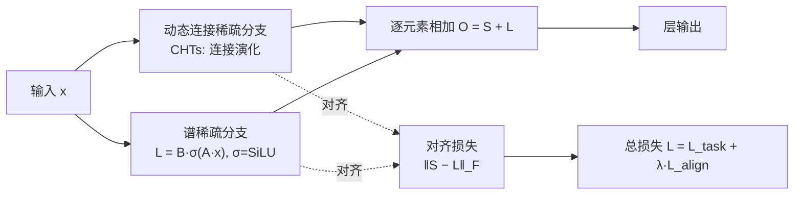

# Alignment-Enhanced Integration of Connectivity and Spectral Sparsity in Dynamic Sparse Training of LLM

**会议**: ICLR 2026  
**OpenReview**: [https://openreview.net/forum?id=jZplmg7Ad9](https://openreview.net/forum?id=jZplmg7Ad9)  
**代码**: 补充材料中提供（未公开仓库链接）  
**领域**: 模型压缩 / 参数高效预训练  
**关键词**: 动态稀疏训练, 低秩分解, 连接稀疏, 谱稀疏, 抵消效应, 对齐损失  

## 一句话总结
本文首次把**动态连接稀疏**（CHTs）与**动态低秩谱稀疏**真正融合到一个统一的稀疏预训练框架里，发现两个分支朴素相加会产生输出"互相抵消"的现象，并用一个简单的对齐损失把它们拉到同一方向协作，得到的 CHTsL 在 LLaMA-60M/130M 上仅保留 10%~30% 参数即逼近 dense 训练。

## 研究背景与动机
**领域现状**：从零训练 LLM 极度消耗显存与算力，参数高效稀疏预训练应运而生。它分两支：**连接稀疏训练**（在权重矩阵的连接结构上强制稀疏，代表是动态稀疏训练 DST，如 SET/RigL/MEST/CHT/CHTs）和**谱稀疏训练**（用低秩分解约束权重子空间，如 LoRA 的预训练版 ReLoRA/GaLore，以及训练+推理全程保持低秩的 CoLA）。两支各有所长，DST 在 10% 参数下能逼近 dense，低秩则擅长捕捉整体子空间。

**现有痛点**：把两支结合的工作几乎没有。唯一的先驱 SLTrain 有两个硬伤——(1) 它的稀疏分支是**静态**的，只当低秩的"补充项"，没用上动态连接稀疏的真正威力；(2) 它只是把稀疏输出和低秩输出**直接求和**，没有任何让两者协作的机制。

**核心矛盾**：作者观察到，当稀疏分支输出 $S$ 和低秩分支输出 $L$ 一起训练时，二者经常**指向相反方向**——一个把某个特征往正方向推，另一个往负方向推，净效果被中和掉，白白浪费表达能力。这种 **cancellation effect（抵消效应）** 让朴素相加 $S+L$ 无法真正承载两个分支各自的信息，尤其在注意力的 Q、K 矩阵上最严重，因为它们的点积直接决定注意力权重，对不一致极其敏感。

**本文目标**：建立一个真正融合动态连接稀疏与动态谱稀疏的统一框架，量化并缓解抵消效应，让两个分支协同而非互斥。

**核心 idea**：**用一个对齐损失把稀疏分支和低秩分支的输出拉到同方向**，配合对低秩分支的激活稳定化，使二者从"互相抵消"变成"互补协作"。

## 方法详解

### 整体框架
框架由三步构成：先用 OCR 指标**识别并量化**抵消效应；再用对齐损失 + 激活调整组成的**训练框架**让两个分支稳定协作；最后把先进的动态稀疏方法 CHTs 与低秩分支实例化为 **CHTsL**。每层输出是稀疏分支与低秩分支之和 $O^{(l)}=S^{(l)}+L^{(l)}$，前向时两分支并行计算、反向时由对齐损失牵引彼此靠拢。

### 关键设计

**1. OCR 指标：把"抵消"量化成一个可观测的数**——作者先把直觉变成度量，定义 **重叠抵消比 Overlap Cancellation Ratio**：$\mathrm{OCR}=\frac{\sum_i \min(|S_i|,|L_i|)\cdot\mathbb{1}\{S_iL_i<0\}}{\sum_i \min(|S_i|,|L_i|)+\varepsilon}$。分子只统计那些两分支**符号相反**（$S_iL_i<0$）的位置上，被抵消掉的重叠信号量（取两者绝对值的较小者，即真正被中和的部分），分母是全部重叠信号。OCR 落在 $[0,1)$，越大说明抵消越严重。这个指标让"两分支打架"从模糊感觉变成可以逐层、逐训练步追踪的曲线，也是后续验证对齐有效性的核心证据。

**2. 对齐损失：把两分支拉到同方向协作**——既然抵消来自方向冲突，最直接的办法就是惩罚两分支输出的差异。作者对每层定义 $L^{(l)}_{\text{align}}=\frac{1}{BN}\lVert S^{(l)}-L^{(l)}\rVert_F$（$B$ 是 batch size，$N$ 是单样本该层输出的元素数），所有层求和得 $L_{\text{align}}=\sum_l L^{(l)}_{\text{align}}$。这个 Frobenius 范数惩罚让稀疏与低秩输出趋于一致，从而减少破坏性干涉——但注意目标不是让两者完全相同（那样就退化成单分支），而是降低方向冲突，让每个分支专注于表达的互补侧面。它最终以系数 $\lambda$ 加权进总目标。

**3. 低秩激活稳定化：让低秩分支可靠出力**——低秩分解虽省参数，但在极端稀疏下输出容易不稳定、尺度失控。借鉴 CoLA，作者在低秩两个因子矩阵之间插入一个温和的非线性：$L^{(l)}=B^{(l)}\,\sigma(A^{(l)}x)$，其中 $\sigma$ 取 SiLU。这里激活的作用不是增强表达，而是**维持合理尺度、防止数值发散**，确保低秩分支能稳定地与稀疏分支并肩工作。消融显示单加激活（Act）已能大幅改善朴素相加（Naive）的崩溃，再叠加对齐（Act+Align）进一步提升。

**4. CHTsL 实例化与统一目标**——把上述框架落地：稀疏分支用 CHTs 的连接演化规则（基于 Cannistracci-Hebbian 理论从脑连接组得到启发的动态稀疏），低秩分支带激活调整，对齐损失逐层施加。总目标为 $L=L_{\text{task}}+\lambda L_{\text{align}}$，$\lambda$ 平衡对齐强度（LLaMA-60M/OpenWebText 与 130M 取 0.5，60M/C4 取 0.3）。两分支在统一目标下联合优化，既稳定低秩训练又促成协作，从根上缓解抵消。

## 实验关键数据

模型：LLaMA-60M / 130M；数据：OpenWebText、C4；预算：保留 dense 的 10%/20%/30% 参数（总稀疏度 0.9/0.8/0.7）。稀疏度统一定义为 $s=1-\#\text{params}/\#\text{params}_{\text{dense}}$，融合方法总稀疏度 $s_{\text{total}}=1-d_{\text{conn}}-d_{\text{spec}}$，保证各方法可训练参数量相同。

### 主实验表格（验证集 PPL↓，节选）

| 数据集 | 方法 | 60M s=0.9 | 60M s=0.8 | 60M s=0.7 | 130M s=0.9 | 130M s=0.8 | 130M s=0.7 |
|---|---|---|---|---|---|---|---|
| OpenWebText | Dense | 26.56 | — | — | 19.46 | — | — |
| | CHTs | 33.03 | 29.84 | 28.12 | 24.75 | 22.67 | 21.48 |
| | CoLA | 37.58 | 30.87 | 28.53 | 27.07 | 23.24 | 21.61 |
| | SLTrain | 33.90 | 29.83 | 27.86 | 25.33 | 22.81 | 21.25 |
| | **CHTsL** | **31.77** | **29.11** | **27.40** | **24.07** | **21.87** | **20.65** |
| C4 | Dense | 33.21 | — | — | 24.55 | — | — |
| | CHTs | 40.62 | 37.55 | 35.23 | 31.00 | 28.69 | 27.46 |
| | SLTrain | 41.05 | 37.00 | 34.89 | 31.38 | 28.28 | 26.78 |
| | **CHTsL** | **39.29** | **35.95** | **34.19** | **30.03** | **27.59** | **26.19** |

CHTsL 在**所有**模型/数据/稀疏度组合下都是最优稀疏方法，且最接近 dense（如 130M/OpenWebText/s=0.7 时 20.65 vs dense 19.46）。

### 消融实验表格（整合策略对比，PPL↓）

| 模型/数据 | 总稀疏度 | Naive（直接相加） | Act（+激活） | Act+Align（+对齐） |
|---|---|---|---|---|
| 60M/OpenWebText | 0.9 | 32.64 | 32.21 | **31.77** |
| 60M/C4 | 0.9 | 189.55 | 39.66 | **39.29** |
| 60M/C4 | 0.7 | 591.42 | 34.55 | **34.33** |
| 130M/OpenWebText | 0.9 | 119.35 | 24.45 | **24.07** |
| 130M/C4 | 0.7 | 920.16 | 26.55 | **26.19** |

Wilcoxon 符号秩检验：Act+Align vs Naive 的 $p=0.00049$，vs Act 的 $p=0.00049$，均 $<0.05$，差异显著。可见**朴素相加在极端稀疏下会灾难性崩溃**（PPL 高达数百），激活先救回稳定性，对齐再稳步提升。

### 关键发现
- **抵消主要发生在 Q、K**：OCR 逐层曲线显示对齐损失显著降低 Query/Key 层的 OCR，而 V/O 和 FFN 因有残差连接更宽容。Q、K 决定注意力权重，对不一致最敏感，对齐稳住注意力图、缓解梯度冲突。
- **稀疏配置敏感性**：固定总稀疏度 0.7 时，OpenWebText（同质语料）偏好连接稀疏占多，低秩占比过高会崩溃；C4（异质多样语料）则更受益于较高低秩比例，因多样语言模式需要对整张权重矩阵做更广的适配。

## 亮点与洞察
- **把模糊直觉做成可测指标再针对性优化**：OCR 不只是诊断工具，它把"两分支打架"变成可观测、可优化的对象，方法论上很干净。
- **极端稀疏下的崩溃现象很有说服力**：Naive 在 s=0.9 时 PPL 飙到 189/591/920，直观说明朴素相加不是"次优"而是"不可用"，凸显对齐/激活的必要性。
- **抵消集中在 Q、K 的解释自洽**：从注意力点积的敏感性出发解释为何 Q、K 受益最大，并被 OCR 曲线佐证，因果链完整。
- **统一了两条互不相通的稀疏范式**：首次让动态连接稀疏与动态低秩谱稀疏真正"动态地"协作，而非像 SLTrain 那样静态补充。

## 局限与展望
- **规模偏小**：仅验证到 LLaMA-130M，OpenWebText/C4 上的 PPL，未在更大模型（1B+）或下游任务上检验，结论的可扩展性待证。
- **对齐损失是启发式**：直接惩罚 $\lVert S-L\rVert_F$ 让两分支趋同，但"对齐到何种程度才最优"缺乏理论刻画，$\lambda$ 需逐设置搜索（0.3~0.5），泛化到新任务需重新调参。
- **稀疏配置需网格搜索**：稀疏/低秩参数分配按 5% 步长系统搜索后报告最优，实际部署成本不低，且不同数据集最优配置差异大（同质 vs 异质语料）。
- **额外计算开销**：逐层对齐损失和低秩激活带来的训练时算力/显存代价未量化分析。

## 相关工作与启发
- **动态连接稀疏**：SET（随机重连）→ RigL（按梯度再生）→ MEST（权重+梯度）→ CHT/CHTs（Cannistracci-Hebbian 脑连接组启发，SOTA），本文稀疏分支即取 CHTs。
- **谱稀疏/低秩**：LoRA（微调低秩）→ ReLoRA/GaLore（预训练低秩，但前向仍需 dense）→ CoLA（训练+推理全程低秩），本文低秩分支与激活设计借鉴 CoLA。
- **混合尝试**：SLTrain 是最早的连接+谱混合，但静态稀疏+朴素相加，本文正是针对其两大缺陷做改进。
- **启发**：当多个互补模块被简单加法组合时，"输出方向冲突"可能是隐藏的性能杀手；定义一个抵消度量 + 一致性正则，是把模块从竞争拉向协作的通用思路，可迁移到 MoE、多分支网络、集成等场景。

## 评分
- **新颖性**: ⭐⭐⭐⭐ — 首次真正动态融合连接稀疏与谱稀疏，OCR 指标和对齐损失的组合简洁有效，切中 SLTrain 的痛点。
- **实验充分度**: ⭐⭐⭐ — 两模型两数据三稀疏度 + 消融 + Wilcoxon 检验 + OCR 逐层证据扎实，但模型规模偏小、无下游任务、无大模型验证。
- **写作质量**: ⭐⭐⭐⭐ — 问题—诊断—方法—验证逻辑清晰，OCR 与 Q/K 解释自洽；个别句子有语法瑕疵但不影响理解。
- **价值**: ⭐⭐⭐⭐ — 为参数高效稀疏预训练提供了"如何融合两条范式"的可落地方案，抵消效应的视角对其他多分支组合也有借鉴意义。

<!-- RELATED:START -->

## 相关论文

- [\[ICLR 2026\] Dr.LLM: Dynamic Layer Routing in LLMs](drllm_dynamic_layer_routing_in_llms.md)
- [\[ICLR 2026\] ODESteer: A Unified ODE-Based Steering Framework for LLM Alignment](odesteer_a_unified_ode-based_steering_framework_for_llm_alignment.md)
- [\[ICLR 2026\] LeSTD: LLM Compression via Learning-based Sparse Tensor Decomposition](lestd_llm_compression_via_learning-based_sparse_tensor_decomposition.md)
- [\[ICML 2025\] Sparse Spectral Training and Inference on Euclidean and Hyperbolic Neural Networks](../../ICML2025/model_compression/sparse_spectral_training_and_inference_on_euclidean_and_hyperbolic_neural_networ.md)
- [\[ICLR 2026\] The Unseen Frontier: Pushing the Limits of LLM Sparsity with Surrogate-Free ADMM](the_unseen_frontier_pushing_the_limits_of_llm_sparsity_with_surrogate-free_admm.md)

<!-- RELATED:END -->
