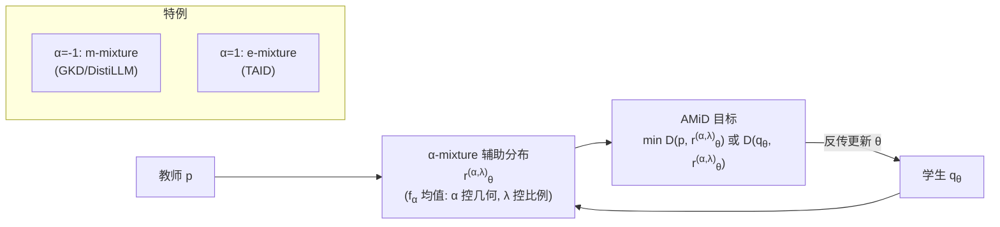

# AMiD: Knowledge Distillation for LLMs with $\alpha$-mixture Assistant Distribution

**会议**: ICLR 2026  
**OpenReview**: [https://openreview.net/forum?id=7WPJ0EgPdW](https://openreview.net/forum?id=7WPJ0EgPdW)  
**代码**: [https://github.com/aailab-kaist/AMiD](https://github.com/aailab-kaist/AMiD)  
**领域**: 模型压缩 / 知识蒸馏  
**关键词**: 知识蒸馏, LLM 压缩, 辅助分布, 信息几何, α-mixture, mode-covering/mode-seeking  

## 一句话总结
本文用信息几何的「广义 $f_\alpha$ 均值」把知识蒸馏里此前零散提出的各种「辅助分布」（教师-学生中间分布）统一成一个带新设计变量 $\alpha$ 的 **α-mixture 辅助分布族**，并据此提出统一蒸馏框架 AMiD，理论证明其最优性、揭示 $\alpha$ 调控 mode-covering/mode-seeking，实验上稳定且全面超越现有辅助分布方法。

## 研究背景与动机
- **领域现状**：LLM 知识蒸馏（KD）的核心是用某种散度对齐教师与学生的逐 token 分布。近年研究围绕「选什么散度」展开——KL（mode-covering）、reverse KL（mode-seeking）、GKD 的广义 JS、ABKD 的 α-β 散度等，试图平衡 quality-diversity。
- **现有痛点**：纯换散度无法根治两个本质难题——（1）大教师与小学生之间的**容量鸿沟（capacity gap）**，在高维输出的 LLM 上尤其严重；（2）高维概率空间里**大量近零概率**导致密度比（如 KL）数值不稳定。为缓解这两点，DistiLLM、TAID、GKD 等开始隐式或显式引入一个**辅助分布 $r_\theta$**（教师 $p$ 与学生 $q_\theta$ 的中间插值），作为知识传递的「桥梁」并稳定优化。
- **核心矛盾**：这些辅助分布是**各自为政的零散配方**——GKD/DistiLLM 用的是算术平均 $\lambda p+(1-\lambda)q_\theta$（m-mixture），TAID 用的是几何平均（本文新发现其本质是 e-mixture）；没人系统研究过插值路径的几何、与不同散度的兼容性、以及还有哪些未被探索的候选，导致各方法停在次优解。
- **本文目标**：把碎片化的辅助分布统一进一个**连续、可调、有理论支撑**的设计空间，并给出对应的统一蒸馏框架。
- **核心 idea**（**统一辅助分布族**）：现有辅助分布都是 $p,q_\theta$ 经「均值函数」的混合，只是均值类型不同。用信息几何的广义 $f_\alpha$ 均值把均值类型参数化为一个连续变量 $\alpha$——$\alpha=-1$ 退化为算术平均，$\alpha=1$ 退化为几何平均，中间和外侧则是全新的辅助分布，由此把「换散度」之外开辟出「换插值几何」这条**正交的新设计轴**。

## 方法详解

### 整体框架
AMiD 分两步：先用广义 $f_\alpha$ 均值定义统一的 **α-mixture 辅助分布** $r^{(\alpha,\lambda)}_\theta$（$\lambda$ 控插值比例、$\alpha$ 控插值路径几何），再把蒸馏目标改成「对齐 $r^{(\alpha,\lambda)}_\theta$ 与教师 $p$ 或学生 $q_\theta$」，允许搭配任意散度。框架在两个维度上同时泛化了已有方法：辅助分布维度（$\alpha$）与散度维度（$D$）。

### 关键设计

**1. α-mixture 辅助分布：把零散配方装进一个连续族** —— 给定 $\alpha\in\mathbb{R},\lambda\in[0,1]$，未归一化辅助分布定义为 $\tilde r^{(\alpha,\lambda)}_\theta(z)=\big(\lambda\,p(z)^{\frac{1-\alpha}{2}}+(1-\lambda)\,q_\theta(z)^{\frac{1-\alpha}{2}}\big)^{\frac{2}{1-\alpha}}$（$\alpha\neq1$），$\alpha=1$ 时取几何平均 $p^\lambda q_\theta^{1-\lambda}$，再归一化得 $r^{(\alpha,\lambda)}_\theta$。这一形式来自广义 $f_\alpha$ 均值（$\alpha=-1$ 算术、$\alpha=1$ 几何、$\alpha=3$ 调和、$\alpha\to\pm\infty$ 取 max/min），因此它**把 GKD/DistiLLM 的 m-mixture（$\alpha=-1$）和 TAID 的 e-mixture（$\alpha=1$）都收为特例**，同时填出大量从未被 KD 用过的新插值分布。其中 $\lambda$ 与 $\alpha$ 是正交的两个旋钮：$\alpha$ 一旦固定就确定了插值「路径」，$\lambda$ 只在该路径上滑动比例。

**2. 信息几何视角与 support 可控性** —— 论文证明 $r^{(\alpha,\lambda)}_\theta$ 正是 Amari α-散度意义下的内分点：$r^{(\alpha,\lambda)}=\arg\min_r \lambda D_\alpha(p\|r)+(1-\lambda)D_\alpha(q\|r)$，把「均值的推广」与「信息几何中的测地线」对应起来——$\alpha=-1$ 对应 KL 加权和的最小点（m-测地线直线），$\alpha=1$ 对应 reverse KL 的最小点（e-测地线）。$\alpha$ 还决定了辅助分布的**支撑集**：$\alpha<1$ 时 $\mathrm{supp}=\mathrm{supp}(p)\cup\mathrm{supp}(q_\theta)$（在更广区域匹配），$\alpha\ge1$ 时取交集（强化重叠区匹配）。由于 LLM 词表上大量概率近零，这一性质给了「在哪儿对齐」的可调旋钮；又因 $r^{(\alpha,\lambda)}_\theta$ 对 $\alpha$ 连续，可进一步设计基于重叠度的自适应 $\alpha$ 课程。

**3. AMiD 目标与最优性保证** —— 蒸馏写成 $\min_\theta \mathbb{E}\sum_l D(p, r^{(\alpha,\lambda)}_\theta)$ 或 $\min_\theta \mathbb{E}\sum_l D(q_\theta, r^{(\alpha,\lambda)}_\theta)$，可套任意 proper 散度与任意数据策略（off/on/mixed-policy）。关键定理（Optimality）证明：在完美优化假设下，无论选什么 $D$、$\alpha$、$\lambda\in(0,1)$，「让插值点与一个端点重合」当且仅当 $p=q_\theta$，即**仍精确达成 KD 的终极目标**——这从理论上把 DistiLLM（$D_{KL}(p\|r^{(-1,\lambda)}_\theta)$）、TAID（$D_{KL}(r^{(1,\lambda)}_\theta\|q_\theta)$）等都纳为合法实例。

**4. 梯度分析：α 调控 mode-covering 与 mode-seeking** —— 对 $f$-散度做梯度分析得 $\nabla_\theta D_f(p\|r^{(\alpha,\lambda)}_\theta)=\mathbb{E}_{r^{(\alpha,\lambda)}_\theta}\!\big[w\cdot(\psi_f(\cdot)-\mathbb{E}[\psi_f])\cdot\nabla_\theta\log q_\theta\big]$，其中权重 $w=\frac{(1-\lambda)q_\theta^{(1-\alpha)/2}}{\lambda p^{(1-\alpha)/2}+(1-\lambda)q_\theta^{(1-\alpha)/2}}$ 是关于密度比 $p/q_\theta$ 的逐样本调制。分析表明：**即便固定散度，$\alpha$ 也能调控学生的模式行为**——较大 $\alpha$ 放大「学生低估教师」区域的梯度（偏 mode-covering），较小 $\alpha$ 放大「学生高估」区域的梯度（偏 mode-seeking）。这是 $\lambda$ 或学习率调度都做不到的、源于 $\alpha$-mixture 的独有特性，玩具实验（双峰 $p$、单峰 $q_\theta$）也验证了 $q^*_\theta$ 随 $\alpha$ 从收敛单峰逐渐变为覆盖均值的厚尾分布。

## 实验关键数据

### 主实验表格（任务无关指令跟随，ROUGE-L↑，GPT-2 XL 1.5B 教师；AMiD 用 $D_{AB}$、$\lambda=0.1$）

| 学生 | 方法 | Avg. (↑) |
|---|---|---|
| GPT-2 (0.1B) | GKD / TAID / DistiLLM(SRKL) / ABKD | 19.77 / 21.24 / 21.30 / 21.76 |
| GPT-2 (0.1B) | **AMiD** | **23.40**（≈ 教师 23.29） |
| GPT-2 Medium (0.3B) | ABKD（次优） | 23.43 |
| GPT-2 Medium (0.3B) | **AMiD** | **24.50** |
| GPT-2 Large (0.8B) | ABKD（次优） | 24.88 |
| GPT-2 Large (0.8B) | **AMiD** | **25.84** |

三种学生规模上 AMiD 均为最佳，0.1B 学生平均分甚至追平 1.5B 教师。

### 消融实验表格（任务特定蒸馏，$D_{KL}$、$\lambda=0.1$；α≠±1 即新分布）

| 教师→学生 | 设置 | Trans. COMET | Summ. R-L | GSM8K Acc |
|---|---|---|---|---|
| Gemma-7B→2B | $q_\theta$（无辅助） | 74.21 | 34.88 | 24.26 |
| Gemma-7B→2B | AMiD ($\alpha=-1$, =DistiLLM) | 52.83 | 26.51 | 0.00 |
| Gemma-7B→2B | AMiD ($\alpha=1$, =TAID) | 74.20 | 34.93 | 24.49 |
| Gemma-7B→2B | **AMiD ($\alpha\neq\pm1$, 新)** | **74.78** | **35.22** | **24.94** |
| Qwen2-7B→0.5B | $q_\theta$ / $\alpha=-1$ / $\alpha=1$ | 58.07 / 57.23 / 58.17 | 31.67 / 32.27 / 31.65 | 33.13 / 35.63 / 33.28 |
| Qwen2-7B→0.5B | **AMiD ($\alpha\neq\pm1$)** | **58.31** | **32.51** | **36.24** |

新 $\alpha$ 值（非 ±1 的端点）一致优于退化成 DistiLLM/TAID 的特例，验证「开辟新插值几何」确有增益。

### 关键发现
- **$\alpha$ 是真正有用的新设计轴**：表 3 显示在固定 $D_{KL}(p\|r)$ 下，$\alpha$ 从 $-5$ 到 $1$ 扫描，平均分从 22.66 单调变化到 18.16，最优落在新区域（如 $\alpha=-5$ 达 22.66）而非端点。
- **训练更稳**：Dolly 上的 ROUGE-L 训练曲线显示 AMiD 收敛更平滑、上限更高（图 4）。
- **mode 行为可控**：玩具实验与真实实验一致支持「$\alpha$ 调控 mode-covering/seeking」，把以往归因于「选散度」的能力部分转移到「选 $\alpha$」。

## 亮点与洞察
- **统一性强**：用一个连续参数 $\alpha$ 把 GKD/DistiLLM/TAID 的辅助分布统一为同族特例，并新发现 TAID 本质是 e-mixture——这是把零散经验「装进同一个数学框架」的漂亮工作。
- **理论扎实**：最优性定理、$\alpha$-散度内分点解释、$f$-散度梯度分析三件套，把「为什么有效」「$\alpha$ 在调什么」讲透，而非纯 empirical。
- **正交旋钮**：明确区分 $\lambda$（插值比例）与 $\alpha$（插值几何），并指出 $\alpha$ 能做 $\lambda$/学习率都做不到的逐样本密度比调制。
- **即插即用**：对散度与数据策略均无约束，可叠加在现有 KD pipeline 上。

## 局限与展望
- **最优性依赖完美优化假设**：实际中需要为不同任务挑选合适的 $\alpha$，论文给的是基于重叠度的启发式调度（附录），尚非自动最优。
- **$\alpha$ 搜索成本**：新增一维超参，虽正交但仍需调参；自适应 $\alpha$ 课程的普适性有待更多任务验证。
- **规模与模型族**：主实验多在 GPT-2/Gemma/Qwen2 的中小学生上，超大教师→超小学生、以及更现代的 MoE/长上下文模型上的表现有待补充。
- **某些退化点会崩**：表 2 中 $\alpha=-1$ 在 Gemma 翻译/GSM8K 上严重退化（GSM8K 0.00），说明端点选择高度敏感，反向凸显了选对 $\alpha$ 的必要性。

## 相关工作与启发
- **散度路线**：KL/RKL、GKD（广义 JS）、ABKD（α-β 散度）、CSD（concrete score）——AMiD 与之正交，可组合。
- **辅助分布路线**：DistiLLM（skew KL/RKL，m-mixture）、TAID（自适应中间分布，e-mixture）、Ko et al. 的 adaptive off-policy——AMiD 将它们统一并泛化。
- **信息几何**：Amari 的 α-散度/对偶联络、广义 $f$-均值是本文的数学底座，把 KD 与信息几何 manifold 上的测地线联系起来，这一桥接对后续「在分布流形上设计蒸馏路径」很有启发。

## 评分
- **新颖性**: ⭐⭐⭐⭐⭐ —— 用广义 $f_\alpha$ 均值统一辅助分布、开辟与「选散度」正交的 $\alpha$ 设计轴，并揭示 TAID=e-mixture，概念贡献清晰且原创。
- **实验充分度**: ⭐⭐⭐⭐ —— 三种学生规模 + 多教师族 + 任务无关/特定双场景 + 散度×α 扫描 + 玩具实验佐证理论；但偏中小模型，缺超大规模与现代架构验证。
- **写作质量**: ⭐⭐⭐⭐ —— 动机—统一—理论—实验链条完整，信息几何部分需一定背景，图 2/3 的可视化有效帮助理解。
- **价值**: ⭐⭐⭐⭐ —— 即插即用、理论支撑强，为 LLM KD 提供了可复用的统一设计空间与新调参维度，对压缩落地有实用意义。
